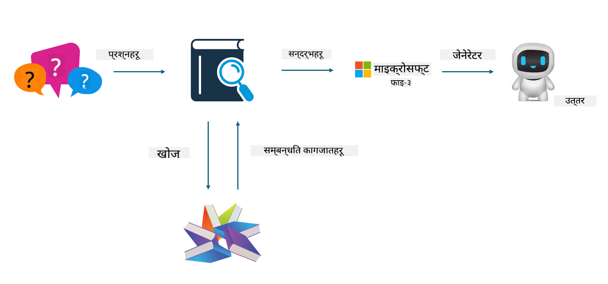
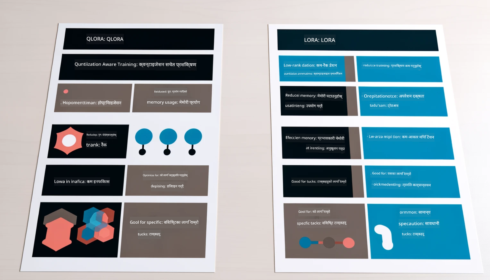

<!--
CO_OP_TRANSLATOR_METADATA:
{
  "original_hash": "743d7e9cb9c4e8ea642d77bee657a7fa",
  "translation_date": "2025-05-09T22:25:30+00:00",
  "source_file": "md/03.FineTuning/LetPhi3gotoIndustriy.md",
  "language_code": "ne"
}
-->
# **Phi-3 लाई उद्योग विशेषज्ञ बनाऔं**

Phi-3 मोडेललाई उद्योगमा प्रयोग गर्न, तपाईंले उद्योगसँग सम्बन्धित व्यवसाय डेटा Phi-3 मोडेलमा थप्नुपर्छ। हामीसँग दुई विकल्प छन्, पहिलो RAG (Retrieval Augmented Generation) र दोस्रो Fine Tuning।

## **RAG vs Fine-Tuning**

### **Retrieval Augmented Generation**

RAG भनेको डेटा पुनःप्राप्ति + पाठ उत्पादन हो। उद्यमका संरचित र असंरचित डेटा भेक्टर डाटाबेसमा संग्रह गरिन्छ। सम्बन्धित सामग्री खोज्दा, सम्बन्धित सारांश र सामग्री पत्ता लगाएर सन्दर्भ तयार गरिन्छ, र LLM/SLM को पाठ पूर्ति क्षमता प्रयोग गरी सामग्री उत्पन्न गरिन्छ।

### **Fine-tuning**

Fine-tuning भनेको कुनै मोडेललाई सुधार गर्ने प्रक्रिया हो। यो मोडेल एल्गोरिदमबाट सुरु गर्नु पर्दैन, तर डेटा निरन्तर सङ्कलन गर्नुपर्छ। यदि तपाईंलाई उद्योगमा थप सटीक शब्दावली र भाषा चाहिन्छ भने, fine-tuning उत्तम विकल्प हो। तर यदि तपाईंको डेटा बारम्बार परिवर्तन हुन्छ भने fine-tuning जटिल हुन सक्छ।

### **कसरी छनौट गर्ने**

1. यदि हाम्रो जवाफमा बाह्य डेटा समावेश गर्नुपर्नेछ भने, RAG सबैभन्दा राम्रो विकल्प हो।

2. यदि तपाईंलाई स्थिर र सटीक उद्योग ज्ञान आवश्यक छ भने, fine-tuning राम्रो विकल्प हो। RAG ले सम्बन्धित सामग्री तान्छ तर सधैं विशेष सान्दर्भिकता नपुग्न सक्छ।

3. Fine-tuning का लागि उच्च गुणस्तरको डेटा सेट चाहिन्छ, र यदि डेटा सानो छ भने ठूलो फरक पर्दैन। RAG बढी लचिलो छ।

4. Fine-tuning एउटा कालो बाकस जस्तो हुन्छ, यसको भित्री प्रक्रिया बुझ्न गाह्रो हुन्छ। तर RAG ले डेटा स्रोत सजिलै पत्ता लगाउन मद्दत गर्छ, जसले भ्रम वा सामग्री त्रुटि सुधार्न र पारदर्शिता बढाउन सहयोग गर्छ।

### **परिदृश्यहरू**

1. विशेष पेशागत शब्दावली र अभिव्यक्ति चाहिने ठूला उद्योगहरूमा ***Fine-tuning*** उत्तम हुन्छ।

2. विभिन्न ज्ञान बिन्दुहरू समेट्ने QA प्रणालीका लागि ***RAG*** उपयुक्त हुन्छ।

3. स्वचालित व्यवसाय प्रवाहको संयोजनमा ***RAG + Fine-tuning*** सबैभन्दा राम्रो हुन्छ।

## **RAG कसरी प्रयोग गर्ने**

भेक्टर डाटाबेस भनेको गणितीय रूपमा डेटा संग्रह गर्ने प्रणाली हो। भेक्टर डाटाबेसले मेसिन लर्निङ मोडेलहरूलाई अघिल्लो इनपुट सम्झन सजिलो बनाउँछ, जसले खोज, सिफारिस र पाठ उत्पादन जस्ता प्रयोगहरूमा सहयोग पुर्‍याउँछ। डेटा समानता मेट्रिक्समा आधारित पहिचान गरिन्छ, जसले कम्प्युटर मोडेललाई डेटा सन्दर्भ बुझ्न सक्षम बनाउँछ।

भेक्टर डाटाबेस RAG को मुख्य कुञ्जी हो। हामी text-embedding-3, jina-ai-embedding जस्ता भेक्टर मोडेलहरू प्रयोग गरी डेटा भेक्टर स्टोरेजमा रूपान्तरण गर्न सक्छौं।

RAG एप्लिकेसन बनाउन थप जान्न [https://github.com/microsoft/Phi-3CookBook](https://github.com/microsoft/Phi-3CookBook?WT.mc_id=aiml-138114-kinfeylo) मा जानुहोस्।

## **Fine-tuning कसरी प्रयोग गर्ने**

Fine-tuning मा सामान्यतया प्रयोग गरिने एल्गोरिदमहरू Lora र QLora हुन्। कसरी छनौट गर्ने?
- [यो नमुना नोटबुकसँग थप जान्नुहोस्](../../../../code/04.Finetuning/Phi_3_Inference_Finetuning.ipynb)
- [Python FineTuning नमुना उदाहरण](../../../../code/04.Finetuning/FineTrainingScript.py)

### **Lora र QLora**

LoRA (Low-Rank Adaptation) र QLoRA (Quantized Low-Rank Adaptation) दुवै Parameter Efficient Fine Tuning (PEFT) प्रयोग गरी ठूलो भाषा मोडेलहरू (LLMs) लाई fine-tune गर्ने प्रविधिहरू हुन्। PEFT ले पारम्परिक विधिभन्दा मोडेललाई छिटो र कम स्रोतमा तालिम दिन डिजाइन गरिएको हो।

LoRA एक स्वतन्त्र fine-tuning प्रविधि हो जसले weight update matrix मा low-rank approximation लागू गरेर मेमोरी खपत घटाउँछ। यसले छिटो तालिम समय र पारम्परिक fine-tuning जत्तिकै प्रदर्शन दिन्छ।

QLoRA LoRA को विस्तार हो जसले क्वान्टाइजेसन प्रविधि समावेश गरेर मेमोरी उपयोग अझ कम गर्छ। QLoRA ले प्रि-ट्रेन्ड LLM का weight parameters लाई 4-bit precision मा क्वान्टाइज गर्छ, जुन LoRA भन्दा बढी मेमोरी बचत गर्छ। तर QLoRA तालिम LoRA भन्दा लगभग ३०% ढिलो हुन्छ किनभने यसमा क्वान्टाइजेसन र डिक्वान्टाइजेसन चरणहरू थप हुन्छन्।

QLoRA ले LoRA लाई सहायकको रूपमा प्रयोग गरेर क्वान्टाइजेसनले ल्याएका त्रुटिहरू सच्याउँछ। QLoRA ले थोरै र सहज उपलब्ध GPU हरूमा अर्बौं प्यारामिटर भएका ठूलो मोडेलहरू fine-tune गर्न सक्षम बनाउँछ। उदाहरणका लागि, QLoRA ले ७०B प्यारामिटर मोडेल जुन ३६ GPUs चाहिन्छ, मात्र २ GPUs मा fine-tune गर्न सक्छ।

**अस्वीकरण**:  
यो दस्तावेज AI अनुवाद सेवा [Co-op Translator](https://github.com/Azure/co-op-translator) प्रयोग गरेर अनुवाद गरिएको हो। हामी शुद्धताका लागि प्रयास गर्छौं, तर कृपया ध्यान दिनुहोस् कि स्वचालित अनुवादमा त्रुटि वा अशुद्धता हुन सक्छ। मूल दस्तावेज यसको मूल भाषामा आधिकारिक स्रोत मानिनुपर्छ। महत्वपूर्ण जानकारीका लागि पेशेवर मानवीय अनुवाद सिफारिस गरिन्छ। यस अनुवादको प्रयोगबाट उत्पन्न कुनै पनि गलतफहमी वा गलत व्याख्याका लागि हामी जिम्मेवार छैनौं।