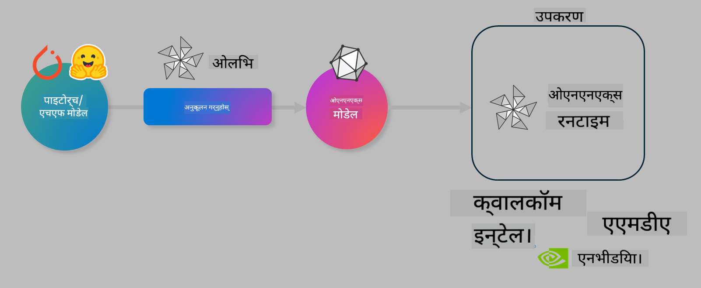

<!--
CO_OP_TRANSLATOR_METADATA:
{
  "original_hash": "6bbe47de3b974df7eea29dfeccf6032b",
  "translation_date": "2025-07-17T10:17:03+00:00",
  "source_file": "md/03.FineTuning/olive-lab/readme.md",
  "language_code": "ne"
}
-->
# ल्याब। उपकरणमा AI मोडेलहरूलाई अनुकूलन गर्नुहोस्

## परिचय

> [!IMPORTANT]
> यस ल्याबका लागि **Nvidia A10 वा A100 GPU** र सम्बन्धित ड्राइभरहरू तथा CUDA टूलकिट (संस्करण 12+) आवश्यक छ।

> [!NOTE]
> यो **३५ मिनेटको** ल्याब हो जसले तपाईंलाई OLIVE प्रयोग गरी उपकरणमा मोडेल इन्फरेन्स अनुकूलनका मुख्य अवधारणाहरूमा व्यावहारिक परिचय दिनेछ।

## सिकाइका उद्देश्यहरू

यस ल्याबको अन्त्यसम्म, तपाईं OLIVE प्रयोग गरेर:

- AWQ क्वान्टाइजेसन विधि प्रयोग गरी AI मोडेल क्वान्टाइज गर्न सक्नुहुनेछ।
- कुनै विशेष कार्यका लागि AI मोडेललाई फाइन-ट्यून गर्न सक्नुहुनेछ।
- ONNX Runtime मा प्रभावकारी उपकरण-आधारित इन्फरेन्सका लागि LoRA एडाप्टरहरू (फाइन-ट्यून गरिएको मोडेल) उत्पन्न गर्न सक्नुहुनेछ।

### Olive के हो

Olive (*O*NNX *live*) एक मोडेल अनुकूलन टूलकिट हो जससँग CLI पनि छ, जसले तपाईंलाई ONNX runtime +++https://onnxruntime.ai+++ का लागि गुणस्तर र प्रदर्शनसहित मोडेलहरू पठाउन सक्षम बनाउँछ।



Olive मा इनपुट सामान्यतया PyTorch वा Hugging Face मोडेल हुन्छ र आउटपुट एक अनुकूलित ONNX मोडेल हुन्छ जुन ONNX runtime चल्ने उपकरण (डिप्लोयमेन्ट लक्ष्य) मा कार्यान्वयन हुन्छ। Olive ले Qualcomm, AMD, Nvidia वा Intel जस्ता हार्डवेयर विक्रेता द्वारा प्रदान गरिएको उपकरण लक्ष्यको AI एक्सेलेरेटर (NPU, GPU, CPU) का लागि मोडेल अनुकूलन गर्छ।

Olive ले *workflow* चलाउँछ, जुन व्यक्तिगत मोडेल अनुकूलन कार्यहरूको क्रमबद्ध श्रृंखला हो जसलाई *passes* भनिन्छ - उदाहरणका लागि: मोडेल कम्प्रेसन, ग्राफ क्याप्चर, क्वान्टाइजेसन, ग्राफ अनुकूलन। प्रत्येक पाससँग त्यस्ता प्यारामिटरहरू हुन्छन् जसलाई सबैभन्दा राम्रो मेट्रिक्स (जस्तै सटीकता र विलम्बता) प्राप्त गर्न ट्यून गर्न सकिन्छ, जुन सम्बन्धित मूल्याङ्कनकर्ताले मूल्याङ्कन गर्छ। Olive ले खोज एल्गोरिदम प्रयोग गरी प्रत्येक पासलाई एक-एक गरी वा समूहमा अटो-ट्यून गर्ने खोज रणनीति अपनाउँछ।

#### Olive का फाइदाहरू

- ग्राफ अनुकूलन, कम्प्रेसन र क्वान्टाइजेसनका विभिन्न प्रविधिहरूमा म्यानुअल परीक्षण-त्रुटि गर्दा लाग्ने समय र निराशा कम गर्नुहोस्। तपाईंको गुणस्तर र प्रदर्शन सीमाहरू परिभाषित गर्नुहोस् र Olive ले तपाईंका लागि सबैभन्दा राम्रो मोडेल स्वतः फेला पार्नेछ।
- क्वान्टाइजेसन, कम्प्रेसन, ग्राफ अनुकूलन र फाइनट्यूनिङमा ४०+ निर्मित मोडेल अनुकूलन कम्पोनेन्टहरू।
- सामान्य मोडेल अनुकूलन कार्यहरूका लागि सजिलो CLI। जस्तै, olive quantize, olive auto-opt, olive finetune।
- मोडेल प्याकेजिङ र डिप्लोयमेन्ट निर्मित।
- **Multi LoRA serving** का लागि मोडेलहरू उत्पन्न गर्न समर्थन।
- YAML/JSON प्रयोग गरी मोडेल अनुकूलन र डिप्लोयमेन्ट कार्यहरू संयोजन गर्न सकिने वर्कफ्लोहरू निर्माण।
- **Hugging Face** र **Azure AI** एकीकरण।
- लागत बचत गर्न निर्मित **क्याचिङ** मेकानिज्म।

## ल्याब निर्देशनहरू

> [!NOTE]
> कृपया सुनिश्चित गर्नुहोस् कि तपाईंले Azure AI Hub र Project सेटअप गर्नुभएको छ र Lab 1 अनुसार A100 कम्प्युट सेटअप गर्नुभएको छ।

### चरण ०: Azure AI Compute सँग जडान गर्नुहोस्

तपाईं **VS Code** को रिमोट सुविधा प्रयोग गरी Azure AI कम्प्युटसँग जडान हुनुहुनेछ।

1. आफ्नो **VS Code** डेस्कटप एप्लिकेसन खोल्नुहोस्।
2. **Shift+Ctrl+P** थिचेर कमाण्ड प्यालेट खोल्नुहोस्।
3. कमाण्ड प्यालेटमा **AzureML - remote: Connect to compute instance in New Window** खोज्नुहोस्।
4. स्क्रिनमा देखाइएका निर्देशनहरू पालना गर्दै Compute सँग जडान गर्नुहोस्। यसमा तपाईंको Azure Subscription, Resource Group, Project र Lab 1 मा सेट गरेको Compute नाम चयन गर्नु पर्नेछ।
5. जडान भएपछि, Visual Code को तल बायाँ कुनामा `><Azure ML: Compute Name` देखिनेछ।

### चरण १: यो रिपोजिटरी क्लोन गर्नुहोस्

VS Code मा नयाँ टर्मिनल खोल्न **Ctrl+J** थिच्नुहोस् र यो रिपो क्लोन गर्नुहोस्:

टर्मिनलमा तपाईंले निम्न प्रॉम्प्ट देख्नुहुनेछ

```
azureuser@computername:~/cloudfiles/code$ 
```  
सोलुसन क्लोन गर्नुहोस्  

```bash
cd ~/localfiles
git clone https://github.com/microsoft/phi-3cookbook.git
```

### चरण २: VS Code मा फोल्डर खोल्नुहोस्

टर्मिनलमा तलको कमाण्ड चलाएर सम्बन्धित फोल्डरमा VS Code खोल्नुहोस्, जसले नयाँ विन्डो खोल्नेछ:

```bash
code phi-3cookbook/code/04.Finetuning/Olive-lab
```

अथवा, **File** > **Open Folder** चयन गरेर पनि फोल्डर खोल्न सकिन्छ।

### चरण ३: निर्भरता स्थापना गर्नुहोस्

VS Code मा Azure AI Compute Instance को टर्मिनल (सुझाव: **Ctrl+J**) खोल्नुहोस् र निर्भरता स्थापना गर्न तलका कमाण्डहरू चलाउनुहोस्:

```bash
conda create -n olive-ai python=3.11 -y
conda activate olive-ai
pip install -r requirements.txt
az extension remove -n azure-cli-ml
az extension add -n ml
```

> [!NOTE]
> सबै निर्भरता स्थापना गर्न करिब ५ मिनेट लाग्नेछ।

यस ल्याबमा तपाईं मोडेलहरू Azure AI Model catalog मा डाउनलोड र अपलोड गर्नुहुनेछ। मोडेल क्याटलग पहुँच गर्न, Azure मा लगइन गर्नुहोस्:

```bash
az login
```

> [!NOTE]
> लगइन गर्दा तपाईंलाई आफ्नो सब्स्क्रिप्शन चयन गर्न भनिनेछ। कृपया यस ल्याबका लागि दिइएको सब्स्क्रिप्शन चयन गर्नुहोस्।

### चरण ४: Olive कमाण्डहरू चलाउनुहोस्

VS Code मा Azure AI Compute Instance को टर्मिनल खोल्नुहोस् (सुझाव: **Ctrl+J**) र `olive-ai` कन्डा वातावरण सक्रिय छ भनी सुनिश्चित गर्नुहोस्:

```bash
conda activate olive-ai
```

अर्को, तलका Olive कमाण्डहरू कमाण्ड लाइनमा चलाउनुहोस्।

1. **डेटा निरीक्षण गर्नुहोस्:** यस उदाहरणमा, तपाईं Phi-3.5-Mini मोडेललाई यात्रा सम्बन्धी प्रश्नहरूको उत्तर दिन विशेष बनाउने गरी फाइन-ट्यून गर्दै हुनुहुन्छ। तलको कोडले JSON lines ढाँचामा रहेको डेटासेटका केही पहिलो रेकर्डहरू देखाउँछ:

    ```bash
    head data/data_sample_travel.jsonl
    ```

2. **मोडेल क्वान्टाइज गर्नुहोस्:** मोडेल प्रशिक्षण अघि, तपाईंले Active Aware Quantization (AWQ) +++https://arxiv.org/abs/2306.00978+++ नामक प्रविधि प्रयोग गरी क्वान्टाइज गर्नुहुनेछ। AWQ ले इन्फरेन्सको क्रममा उत्पन्न हुने एक्टिभेसनहरूलाई ध्यानमा राखेर मोडेलका तौलहरू क्वान्टाइज गर्छ। यसको अर्थ क्वान्टाइजेसन प्रक्रियाले एक्टिभेसनमा वास्तविक डाटा वितरणलाई समावेश गर्छ, जसले परम्परागत तौल क्वान्टाइजेसन विधिहरूको तुलनामा मोडेलको सटीकता राम्रोसँग जोगाउँछ।

    ```bash
    olive quantize \
       --model_name_or_path microsoft/Phi-3.5-mini-instruct \
       --trust_remote_code \
       --algorithm awq \
       --output_path models/phi/awq \
       --log_level 1
    ```

    AWQ क्वान्टाइजेसन पूरा गर्न करिब **८ मिनेट** लाग्छ, जसले मोडेलको आकार करिब ~७.५GB बाट ~२.५GB मा घटाउँछ।

    यस ल्याबमा हामीले Hugging Face बाट मोडेल इनपुट गर्ने तरिका देखाएका छौं (जस्तै: `microsoft/Phi-3.5-mini-instruct`)। तर Olive ले Azure AI क्याटलगबाट मोडेल इनपुट गर्न पनि अनुमति दिन्छ, `model_name_or_path` आर्गुमेन्टलाई Azure AI asset ID (जस्तै: `azureml://registries/azureml/models/Phi-3.5-mini-instruct/versions/4`) मा अपडेट गरेर।

3. **मोडेल प्रशिक्षण गर्नुहोस्:** त्यसपछि, `olive finetune` कमाण्डले क्वान्टाइज गरिएको मोडेललाई फाइन-ट्यून गर्छ। क्वान्टाइजेसन पछि होइन, फाइन-ट्यूनिङ अघि क्वान्टाइज गर्दा राम्रो सटीकता प्राप्त हुन्छ किनभने फाइन-ट्यूनिङले क्वान्टाइजेसनबाट भएको केही हानि पुनः प्राप्त गर्छ।

    ```bash
    olive finetune \
        --method lora \
        --model_name_or_path models/phi/awq \
        --data_files "data/data_sample_travel.jsonl" \
        --data_name "json" \
        --text_template "<|user|>\n{prompt}<|end|>\n<|assistant|>\n{response}<|end|>" \
        --max_steps 100 \
        --output_path ./models/phi/ft \
        --log_level 1
    ```

    फाइन-ट्यूनिङ (१०० स्टेप्स) पूरा गर्न करिब **६ मिनेट** लाग्छ।

4. **अनुकूलन गर्नुहोस्:** मोडेल प्रशिक्षण पछि, Olive को `auto-opt` कमाण्ड प्रयोग गरी मोडेल अनुकूलन गर्नुहोस्, जसले ONNX ग्राफ क्याप्चर गरी मोडेल प्रदर्शन सुधार गर्न CPU का लागि कम्प्रेसन र फ्युजनहरू स्वचालित रूपमा गर्छ। ध्यान दिनुहोस्, तपाईं अन्य उपकरणहरू (जस्तै NPU वा GPU) का लागि पनि `--device` र `--provider` आर्गुमेन्टहरू अपडेट गरेर अनुकूलन गर्न सक्नुहुन्छ - तर यस ल्याबका लागि CPU प्रयोग गरिनेछ।

    ```bash
    olive auto-opt \
       --model_name_or_path models/phi/ft/model \
       --adapter_path models/phi/ft/adapter \
       --device cpu \
       --provider CPUExecutionProvider \
       --use_ort_genai \
       --output_path models/phi/onnx-ao \
       --log_level 1
    ```

    अनुकूलन पूरा गर्न करिब **५ मिनेट** लाग्छ।

### चरण ५: मोडेल इन्फरेन्स छिटो परीक्षण

मोडेल इन्फरेन्स परीक्षण गर्न, आफ्नो फोल्डरमा **app.py** नामक Python फाइल बनाउनुहोस् र तलको कोड कपी-पेस्ट गर्नुहोस्:

```python
import onnxruntime_genai as og
import numpy as np

print("loading model and adapters...", end="", flush=True)
model = og.Model("models/phi/onnx-ao/model")
adapters = og.Adapters(model)
adapters.load("models/phi/onnx-ao/model/adapter_weights.onnx_adapter", "travel")
print("DONE!")

tokenizer = og.Tokenizer(model)
tokenizer_stream = tokenizer.create_stream()

params = og.GeneratorParams(model)
params.set_search_options(max_length=100, past_present_share_buffer=False)
user_input = "what is the best thing to see in chicago"
params.input_ids = tokenizer.encode(f"<|user|>\n{user_input}<|end|>\n<|assistant|>\n")

generator = og.Generator(model, params)

generator.set_active_adapter(adapters, "travel")

print(f"{user_input}")

while not generator.is_done():
    generator.compute_logits()
    generator.generate_next_token()

    new_token = generator.get_next_tokens()[0]
    print(tokenizer_stream.decode(new_token), end='', flush=True)

print("\n")
```

कोड चलाउन:

```bash
python app.py
```

### चरण ६: मोडेल Azure AI मा अपलोड गर्नुहोस्

मोडेल Azure AI मोडेल रिपोजिटरीमा अपलोड गर्दा तपाईंको विकास टोलीका अन्य सदस्यहरूसँग मोडेल साझा गर्न सकिन्छ र मोडेलको संस्करण नियन्त्रण पनि हुन्छ। मोडेल अपलोड गर्न तलको कमाण्ड चलाउनुहोस्:

> [!NOTE]
> `{}` प्लेसहोल्डरहरूलाई तपाईंको Resource Group र Azure AI Project नामले अपडेट गर्नुहोस्।

तपाईंको Resource Group र Azure AI Project नाम पत्ता लगाउन तलको कमाण्ड चलाउनुहोस्:

```
az ml workspace show
```

वा +++ai.azure.com+++ मा गई **management center** > **project** > **overview** चयन गरेर पनि हेर्न सकिन्छ।

`{}` प्लेसहोल्डरहरूलाई तपाईंको Resource Group र Azure AI Project नामले अपडेट गर्नुहोस्।

```bash
az ml model create \
    --name ft-for-travel \
    --version 1 \
    --path ./models/phi/onnx-ao \
    --resource-group {RESOURCE_GROUP_NAME} \
    --workspace-name {PROJECT_NAME}
```

तपाईंले अपलोड गरेको मोडेल हेर्न र डिप्लोय गर्न https://ml.azure.com/model/list मा जान सक्नुहुन्छ।

**अस्वीकरण**:  
यो दस्तावेज AI अनुवाद सेवा [Co-op Translator](https://github.com/Azure/co-op-translator) प्रयोग गरी अनुवाद गरिएको हो। हामी शुद्धताका लागि प्रयासरत छौं भने पनि, कृपया ध्यान दिनुहोस् कि स्वचालित अनुवादमा त्रुटि वा अशुद्धता हुनसक्छ। मूल दस्तावेज यसको मूल भाषामा नै अधिकारिक स्रोत मानिनुपर्छ। महत्वपूर्ण जानकारीका लागि व्यावसायिक मानव अनुवाद सिफारिस गरिन्छ। यस अनुवादको प्रयोगबाट उत्पन्न कुनै पनि गलतफहमी वा गलत व्याख्याका लागि हामी जिम्मेवार छैनौं।