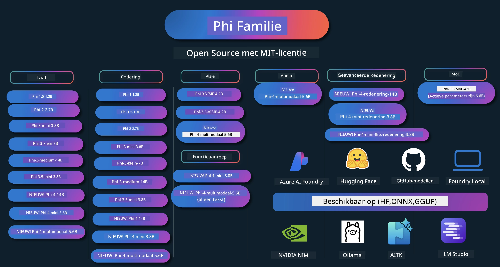

# Phi Kookboek: Praktische Voorbeelden met Microsofts Phi Modellen

[](https://codespaces.new/microsoft/phicookbook)
[](https://vscode.dev/redirect?url=vscode://ms-vscode-remote.remote-containers/cloneInVolume?url=https://github.com/microsoft/phicookbook)

[](https://GitHub.com/microsoft/phicookbook/graphs/contributors/?WT.mc_id=aiml-137032-kinfeylo)
[](https://GitHub.com/microsoft/phicookbook/issues/?WT.mc_id=aiml-137032-kinfeylo)
[](https://GitHub.com/microsoft/phicookbook/pulls/?WT.mc_id=aiml-137032-kinfeylo)
[](http://makeapullrequest.com?WT.mc_id=aiml-137032-kinfeylo)

[](https://GitHub.com/microsoft/phicookbook/watchers/?WT.mc_id=aiml-137032-kinfeylo)
[](https://GitHub.com/microsoft/phicookbook/network/?WT.mc_id=aiml-137032-kinfeylo)
[](https://GitHub.com/microsoft/phicookbook/stargazers/?WT.mc_id=aiml-137032-kinfeylo)

[](https://discord.com/invite/ByRwuEEgH4)

Phi is een reeks open source AI-modellen ontwikkeld door Microsoft.

Phi is momenteel het krachtigste en kosteneffectiefste kleine taalmodel (SLM), met zeer goede benchmarks in meertaligheid, redeneren, tekst-/chatgeneratie, coderen, afbeeldingen, audio en andere scenario's.

Je kunt Phi implementeren in de cloud of op edge-apparaten, en je kunt gemakkelijk generatieve AI-toepassingen bouwen met beperkte rekenkracht.

Volg deze stappen om te beginnen met het gebruik van deze bronnen:
1. **Fork de Repository**: Klik op [](https://GitHub.com/microsoft/phicookbook/network/?WT.mc_id=aiml-137032-kinfeylo)
2. **Clone de Repository**: `git clone https://github.com/microsoft/PhiCookBook.git`
3. [**Word lid van de Microsoft AI Discord-community en ontmoet experts en mede-ontwikkelaars**](https://discord.com/invite/ByRwuEEgH4?WT.mc_id=aiml-137032-kinfeylo)



### 🌐 Meertalige Ondersteuning

#### Ondersteund via GitHub Action (Geautomatiseerd & Altijd Up-to-Date)

<!-- CO-OP TRANSLATOR LANGUAGES TABLE START -->
[Arabisch](../ar/README.md) | [Bengaals](../bn/README.md) | [Bulgaars](../bg/README.md) | [Birmaans (Myanmar)](../my/README.md) | [Chinees (Vereenvoudigd)](../zh-CN/README.md) | [Chinees (Traditioneel, Hong Kong)](../zh-HK/README.md) | [Chinees (Traditioneel, Macau)](../zh-MO/README.md) | [Chinees (Traditioneel, Taiwan)](../zh-TW/README.md) | [Kroatisch](../hr/README.md) | [Tsjechisch](../cs/README.md) | [Deens](../da/README.md) | [Nederlands](./README.md) | [Ests](../et/README.md) | [Fins](../fi/README.md) | [Frans](../fr/README.md) | [Duits](../de/README.md) | [Grieks](../el/README.md) | [Hebreeuws](../he/README.md) | [Hindi](../hi/README.md) | [Hongaars](../hu/README.md) | [Indonesisch](../id/README.md) | [Italiaans](../it/README.md) | [Japans](../ja/README.md) | [Kannada](../kn/README.md) | [Koreaans](../ko/README.md) | [Litouws](../lt/README.md) | [Maleis](../ms/README.md) | [Malayalam](../ml/README.md) | [Marathi](../mr/README.md) | [Nepalees](../ne/README.md) | [Nigeriaans Pidgin](../pcm/README.md) | [Noors](../no/README.md) | [Perzisch (Farsi)](../fa/README.md) | [Pools](../pl/README.md) | [Portugees (Brazilië)](../pt-BR/README.md) | [Portugees (Portugal)](../pt-PT/README.md) | [Punjabi (Gurmukhi)](../pa/README.md) | [Roemeens](../ro/README.md) | [Russisch](../ru/README.md) | [Servisch (Cyrillisch)](../sr/README.md) | [Slowaaks](../sk/README.md) | [Sloveens](../sl/README.md) | [Spaans](../es/README.md) | [Swahili](../sw/README.md) | [Zweeds](../sv/README.md) | [Tagalog (Filipijns)](../tl/README.md) | [Tamil](../ta/README.md) | [Telugu](../te/README.md) | [Thai](../th/README.md) | [Turks](../tr/README.md) | [Oekraïens](../uk/README.md) | [Urdu](../ur/README.md) | [Vietnamees](../vi/README.md)

> **Liever Lokaal Clonen?**

> Deze repository bevat meer dan 50 taalvertalingen wat de downloadgrootte aanzienlijk vergroot. Om te clonen zonder vertalingen, gebruik sparse checkout:
> ```bash
> git clone --filter=blob:none --sparse https://github.com/microsoft/PhiCookBook.git
> cd PhiCookBook
> git sparse-checkout set --no-cone '/*' '!translations' '!translated_images'
> ```
> Dit geeft je alles wat je nodig hebt om de cursus te voltooien met een veel snellere download.
<!-- CO-OP TRANSLATOR LANGUAGES TABLE END -->

## Inhoudsopgave

- Introductie
  - [Welkom bij de Phi Familie](./md/01.Introduction/01/01.PhiFamily.md)
  - [Je omgeving instellen](./md/01.Introduction/01/01.EnvironmentSetup.md)
  - [Belangrijke Technologieën Begrijpen](./md/01.Introduction/01/01.Understandingtech.md)
  - [AI Veiligheid voor Phi Modellen](./md/01.Introduction/01/01.AISafety.md)
  - [Phi Hardware Ondersteuning](./md/01.Introduction/01/01.Hardwaresupport.md)
  - [Phi Modellen & Beschikbaarheid over platforms](./md/01.Introduction/01/01.Edgeandcloud.md)
  - [Gebruik van Guidance-ai en Phi](./md/01.Introduction/01/01.Guidance.md)
  - [GitHub Marketplace Modellen](https://github.com/marketplace/models)
  - [Azure AI Model Catalogus](https://ai.azure.com)

- Inferentie Phi in verschillende omgevingen
    -  [Hugging face](./md/01.Introduction/02/01.HF.md)
    -  [GitHub Modellen](./md/01.Introduction/02/02.GitHubModel.md)
    -  [Azure AI Foundry Model Catalog](./md/01.Introduction/02/03.AzureAIFoundry.md)
    -  [Ollama](./md/01.Introduction/02/04.Ollama.md)
    -  [AI Toolkit VSCode (AITK)](./md/01.Introduction/02/05.AITK.md)
    -  [NVIDIA NIM](./md/01.Introduction/02/06.NVIDIA.md)
    -  [Foundry Lokaal](./md/01.Introduction/02/07.FoundryLocal.md)

- Inferentie Phi Familie
    - [Inferentie Phi op iOS](./md/01.Introduction/03/iOS_Inference.md)
    - [Inferentie Phi op Android](./md/01.Introduction/03/Android_Inference.md)
    - [Inferentie Phi op Jetson](./md/01.Introduction/03/Jetson_Inference.md)
    - [Inferentie Phi op AI PC](./md/01.Introduction/03/AIPC_Inference.md)
    - [Inferentie Phi met Apple MLX Framework](./md/01.Introduction/03/MLX_Inference.md)
    - [Inferentie Phi op Lokale Server](./md/01.Introduction/03/Local_Server_Inference.md)
    - [Inferentie Phi op Afstandsserver met AI Toolkit](./md/01.Introduction/03/Remote_Interence.md)
    - [Inferentie Phi met Rust](./md/01.Introduction/03/Rust_Inference.md)
    - [Inferentie Phi--Vision Lokaal](./md/01.Introduction/03/Vision_Inference.md)
    - [Inferentie Phi met Kaito AKS, Azure Containers (officiële ondersteuning)](./md/01.Introduction/03/Kaito_Inference.md)
-  [Quantificeren van Phi Familie](./md/01.Introduction/04/QuantifyingPhi.md)
    - [Quantiseren van Phi-3.5 / 4 met llama.cpp](./md/01.Introduction/04/UsingLlamacppQuantifyingPhi.md)
    - [Quantiseren van Phi-3.5 / 4 met Generative AI extensies voor onnxruntime](./md/01.Introduction/04/UsingORTGenAIQuantifyingPhi.md)
    - [Quantiseren van Phi-3.5 / 4 met Intel OpenVINO](./md/01.Introduction/04/UsingIntelOpenVINOQuantifyingPhi.md)
    - [Quantiseren van Phi-3.5 / 4 met Apple MLX Framework](./md/01.Introduction/04/UsingAppleMLXQuantifyingPhi.md)

- Evaluatie Phi
    - [Verantwoorde AI](./md/01.Introduction/05/ResponsibleAI.md)
    - [Azure AI Foundry voor Evaluatie](./md/01.Introduction/05/AIFoundry.md)
    - [Gebruik van Promptflow voor Evaluatie](./md/01.Introduction/05/Promptflow.md)
 
- RAG met Azure AI Search
    - [Hoe Phi-4-mini en Phi-4-multimodal (RAG) te gebruiken met Azure AI Search](https://github.com/microsoft/PhiCookBook/blob/main/code/06.E2E/E2E_Phi-4-RAG-Azure-AI-Search.ipynb)

- Phi applicatie ontwikkelvoorbeelden
  - Tekst- & Chattoepassingen
    - Phi-4 Voorbeelden 🆕
      - [📓] [Chat met Phi-4-mini ONNX Model](./md/02.Application/01.TextAndChat/Phi4/ChatWithPhi4ONNX/README.md)
      - [Chat met Phi-4 lokaal ONNX Model .NET](../../md/04.HOL/dotnet/src/LabsPhi4-Chat-01OnnxRuntime)
      - [Chat .NET Console-app met Phi-4 ONNX via Semantic Kernel](../../md/04.HOL/dotnet/src/LabsPhi4-Chat-02SK)
    - Phi-3 / 3.5 Voorbeelden
      - [Lokale Chatbot in de browser met Phi3, ONNX Runtime Web en WebGPU](https://github.com/microsoft/onnxruntime-inference-examples/tree/main/js/chat)
      - [OpenVino Chat](./md/02.Application/01.TextAndChat/Phi3/E2E_OpenVino_Chat.md)
      - [Multi Model - Interactieve Phi-3-mini en OpenAI Whisper](./md/02.Application/01.TextAndChat/Phi3/E2E_Phi-3-mini_with_whisper.md)
      - [MLFlow - Een wrapper bouwen en Phi-3 gebruiken met MLFlow](./md//02.Application/01.TextAndChat/Phi3/E2E_Phi-3-MLflow.md)
      - [Modeloptimalisatie - Hoe het Phi-3-min model te optimaliseren voor ONNX Runtime Web met Olive](https://github.com/microsoft/Olive/tree/main/examples/phi3)
      - [WinUI3-app met Phi-3 mini-4k-instruct-onnx](https://github.com/microsoft/Phi3-Chat-WinUI3-Sample/)
      -[WinUI3 Multi Model AI aangedreven notities app voorbeeld](https://github.com/microsoft/ai-powered-notes-winui3-sample)
      - [Fijn afstemmen en integreren van aangepaste Phi-3 modellen met Prompt flow](./md/02.Application/01.TextAndChat/Phi3/E2E_Phi-3-FineTuning_PromptFlow_Integration.md)
      - [Fijn afstemmen en integreren van aangepaste Phi-3 modellen met Prompt flow in Azure AI Foundry](./md/02.Application/01.TextAndChat/Phi3/E2E_Phi-3-FineTuning_PromptFlow_Integration_AIFoundry.md)
      - [Evalueren van het fijn afgestemde Phi-3 / Phi-3.5-model in Azure AI Foundry met focus op Microsoft's Verantwoordelijke AI Principes](./md/02.Application/01.TextAndChat/Phi3/E2E_Phi-3-Evaluation_AIFoundry.md)
      - [📓] [Phi-3.5-mini-instruct taalvoorspellingsvoorbeeld (Chinees/Engels)](./md/02.Application/01.TextAndChat/Phi3/phi3-instruct-demo.ipynb)
      - [Phi-3.5-Instruct WebGPU RAG Chatbot](./md/02.Application/01.TextAndChat/Phi3/WebGPUWithPhi35Readme.md)
      - [Windows GPU gebruiken om Prompt flow-oplossing met Phi-3.5-Instruct ONNX te maken](./md/02.Application/01.TextAndChat/Phi3/UsingPromptFlowWithONNX.md)
      - [Microsoft Phi-3.5 tflite gebruiken om Android-app te maken](./md/02.Application/01.TextAndChat/Phi3/UsingPhi35TFLiteCreateAndroidApp.md)
      - [Q&A .NET voorbeeld met lokaal ONNX Phi-3 model met Microsoft.ML.OnnxRuntime](../../md/04.HOL/dotnet/src/LabsPhi301)
      - [Console chat .NET app met Semantic Kernel en Phi-3](../../md/04.HOL/dotnet/src/LabsPhi302)

  - Azure AI Inference SDK Code gebaseerde voorbeelden
    - Phi-4 Voorbeelden 🆕
      - [📓] [Projectcode genereren met Phi-4-multimodal](./md/02.Application/02.Code/Phi4/GenProjectCode/README.md)
    - Phi-3 / 3.5 Voorbeelden
      - [Bouw je eigen Visual Studio Code GitHub Copilot Chat met Microsoft Phi-3 Familie](./md/02.Application/02.Code/Phi3/VSCodeExt/README.md)
      - [Maak je eigen Visual Studio Code Chat Copilot Agent met Phi-3.5 door GitHub Modellen](/md/02.Application/02.Code/Phi3/CreateVSCodeChatAgentWithGitHubModels.md)

  - Geavanceerde redeneervoorbeelden
    - Phi-4 Voorbeelden 🆕
      - [📓] [Phi-4-mini-reasoning of Phi-4-reasoning Voorbeelden](./md/02.Application/03.AdvancedReasoning/Phi4/AdvancedResoningPhi4mini/README.md)
      - [📓] [Fijn afstemmen van Phi-4-mini-reasoning met Microsoft Olive](./md/02.Application/03.AdvancedReasoning/Phi4/AdvancedResoningPhi4mini/olive_ft_phi_4_reasoning_with_medicaldata.ipynb)
      - [📓] [Fijn afstemmen van Phi-4-mini-reasoning met Apple MLX](./md/02.Application/03.AdvancedReasoning/Phi4/AdvancedResoningPhi4mini/mlx_ft_phi_4_reasoning_with_medicaldata.ipynb)
      - [📓] [Phi-4-mini-reasoning met GitHub Modellen](./md/02.Application/02.Code/Phi4r/github_models_inference.ipynb)
      - [📓] [Phi-4-mini-reasoning met Azure AI Foundry Modellen](./md/02.Application/02.Code/Phi4r/azure_models_inference.ipynb)
  - Demo's
      - [Phi-4-mini demo's gehost op Hugging Face Spaces](https://huggingface.co/spaces/microsoft/phi-4-mini?WT.mc_id=aiml-137032-kinfeylo)
      - [Phi-4-multimodal demo's gehost op Hugginge Face Spaces](https://huggingface.co/spaces/microsoft/phi-4-multimodal?WT.mc_id=aiml-137032-kinfeylo)
  - Vision Voorbeelden
    - Phi-4 Voorbeelden 🆕
      - [📓] [Gebruik Phi-4-multimodal om afbeeldingen te lezen en code te genereren](./md/02.Application/04.Vision/Phi4/CreateFrontend/README.md) 
    - Phi-3 / 3.5 Voorbeelden
      -  [📓][Phi-3-visie-Afbeelding tekst naar tekst](./md/02.Application/04.Vision/Phi3/E2E_Phi-3-vision-image-text-to-text-online-endpoint.ipynb)
      - [Phi-3-visie-ONNX](https://onnxruntime.ai/docs/genai/tutorials/phi3-v.html)
      - [📓][Phi-3-visie CLIP Embedding](./md/02.Application/04.Vision/Phi3/E2E_Phi-3-vision-image-text-to-text-online-endpoint.ipynb)
      - [DEMO: Phi-3 Recycling](https://github.com/jennifermarsman/PhiRecycling/)
      - [Phi-3-visie - Visuele taalassistent - met Phi3-Vision en OpenVINO](https://docs.openvino.ai/nightly/notebooks/phi-3-vision-with-output.html)
      - [Phi-3 Vision Nvidia NIM](./md/02.Application/04.Vision/Phi3/E2E_Nvidia_NIM_Vision.md)
      - [Phi-3 Vision OpenVino](./md/02.Application/04.Vision/Phi3/E2E_OpenVino_Phi3Vision.md)
      - [📓][Phi-3.5 Vision multi-frame of multi-image voorbeeld](./md/02.Application/04.Vision/Phi3/phi3-vision-demo.ipynb)
      - [Phi-3 Vision lokaal ONNX-model met Microsoft.ML.OnnxRuntime .NET](../../md/04.HOL/dotnet/src/LabsPhi303)
      - [Menu gebaseerd Phi-3 Vision lokaal ONNX-model met Microsoft.ML.OnnxRuntime .NET](../../md/04.HOL/dotnet/src/LabsPhi304)

  - Wiskunde Voorbeelden
    -  Phi-4-Mini-Flash-Reasoning-Instruct Voorbeelden 🆕 [Wiskunde Demo met Phi-4-Mini-Flash-Reasoning-Instruct](./md/02.Application/09.Math/MathDemo.ipynb)

  - Audio Voorbeelden
    - Phi-4 Voorbeelden 🆕
      - [📓] [Audio transcripties extraheren met Phi-4-multimodal](./md/02.Application/05.Audio/Phi4/Transciption/README.md)
      - [📓] [Phi-4-multimodal Audio Voorbeeld](./md/02.Application/05.Audio/Phi4/Siri/demo.ipynb)
      - [📓] [Phi-4-multimodal Spraakvertaling Voorbeeld](./md/02.Application/05.Audio/Phi4/Translate/demo.ipynb)
      - [.NET console applicatie met Phi-4-multimodal Audio om een audiobestand te analyseren en transcript te genereren](../../md/04.HOL/dotnet/src/LabsPhi4-MultiModal-02Audio)

  - MOE Voorbeelden
    - Phi-3 / 3.5 Voorbeelden
      - [📓] [Phi-3.5 Mixture of Experts Models (MoEs) Social Media Voorbeeld](./md/02.Application/06.MoE/Phi3/phi3_moe_demo.ipynb)
      - [📓] [Een Retrieval-Augmented Generation (RAG) Pipeline bouwen met NVIDIA NIM Phi-3 MOE, Azure AI Search en LlamaIndex](./md/02.Application/06.MoE/Phi3/azure-ai-search-nvidia-rag.ipynb)
      - 
  - Function Calling Voorbeelden
    - Phi-4 Voorbeelden 🆕
      -  [📓] [Function Calling gebruiken met Phi-4-mini](./md/02.Application/07.FunctionCalling/Phi4/FunctionCallingBasic/README.md)
      -  [📓] [Function Calling gebruiken om multi-agents te maken met Phi-4-mini](./md/02.Application/07.FunctionCalling/Phi4/Multiagents/Phi_4_mini_multiagent.ipynb)
      -  [📓] [Function Calling gebruiken met Ollama](./md/02.Application/07.FunctionCalling/Phi4/Ollama/ollama_functioncalling.ipynb)
      -  [📓] [Function Calling gebruiken met ONNX](./md/02.Application/07.FunctionCalling/Phi4/ONNX/onnx_parallel_functioncalling.ipynb)
  - Multimodale Meng Voorbeelden
    - Phi-4 Voorbeelden 🆕
      -  [📓] [Phi-4-multimodal gebruiken als technologiejournalist](./md/02.Application/08.Multimodel/Phi4/TechJournalist/phi_4_mm_audio_text_publish_news.ipynb)
      - [.NET console applicatie die Phi-4-multimodal gebruikt om afbeeldingen te analyseren](../../md/04.HOL/dotnet/src/LabsPhi4-MultiModal-01Images)

- Fijn afstemmen Phi Voorbeelden
  - [Fijn afstemmen scenario's](./md/03.FineTuning/FineTuning_Scenarios.md)
  - [Fijn afstemmen versus RAG](./md/03.FineTuning/FineTuning_vs_RAG.md)
  - [Fijn afstemmen Laat Phi-3 een industrie-expert worden](./md/03.FineTuning/LetPhi3gotoIndustriy.md)
  - [Fijn afstemmen Phi-3 met AI Toolkit voor VS Code](./md/03.FineTuning/Finetuning_VSCodeaitoolkit.md)
  - [Fijn afstemmen Phi-3 met Azure Machine Learning Service](./md/03.FineTuning/Introduce_AzureML.md)
  - [Fijn afstemmen Phi-3 met Lora](./md/03.FineTuning/FineTuning_Lora.md)
  - [Fijn afstemmen Phi-3 met QLora](./md/03.FineTuning/FineTuning_Qlora.md)
  - [Fijn afstemmen Phi-3 met Azure AI Foundry](./md/03.FineTuning/FineTuning_AIFoundry.md)
  - [Fijn afstemmen Phi-3 met Azure ML CLI/SDK](./md/03.FineTuning/FineTuning_MLSDK.md)
  - [Fijn afstemmen met Microsoft Olive](./md/03.FineTuning/FineTuning_MicrosoftOlive.md)
  - [Fijn afstemmen met Microsoft Olive Hands-On Lab](./md/03.FineTuning/olive-lab/readme.md)
  - [Fijn afstemmen Phi-3-vision met Weights and Bias](./md/03.FineTuning/FineTuning_Phi-3-visionWandB.md)
  - [Fijn afstemmen Phi-3 met Apple MLX Framework](./md/03.FineTuning/FineTuning_MLX.md)
  - [Fijn afstemmen Phi-3-vision (officiële ondersteuning)](./md/03.FineTuning/FineTuning_Vision.md)
  - [Fijn afstemmen Phi-3 met Kaito AKS, Azure Containers (officiële ondersteuning)](./md/03.FineTuning/FineTuning_Kaito.md)
  - [Fijn afstemmen Phi-3 en 3.5 Vision](https://github.com/2U1/Phi3-Vision-Finetune)

- Hands-on Lab
  - [Ontdekken van geavanceerde modellen: LLMs, SLMs, lokale ontwikkeling en meer](https://github.com/microsoft/aitour-exploring-cutting-edge-models)
  - [NLP-potentieel ontgrendelen: Fijn afstemmen met Microsoft Olive](https://github.com/azure/Ignite_FineTuning_workshop)

- Academische onderzoeksartikelen en publicaties
  - [Leerboeken Zijn Alles Wat Je Nodig Hebt II: phi-1.5 technisch rapport](https://arxiv.org/abs/2309.05463)
  - [Phi-3 Technisch Rapport: Een Zeer Bekwaam Taalmodel Lokaal op Je Telefoon](https://arxiv.org/abs/2404.14219)
  - [Phi-4 Technisch Rapport](https://arxiv.org/abs/2412.08905)
  - [Phi-4-Mini Technisch Rapport: Compact maar Krachtig Multimodaal Taalmodellen via Mengsel van LoRAs](https://arxiv.org/abs/2503.01743)
  - [Optimaliseren van Kleine Taalmodellen voor In-Vehicle Function-Calling](https://arxiv.org/abs/2501.02342)
  - [(WhyPHI) Fijnafstelling van PHI-3 voor Multiple-Choice Vraagbeantwoording: Methodologie, Resultaten en Uitdagingen](https://arxiv.org/abs/2501.01588)
  - [Phi-4-redeneren Technisch Rapport](https://www.microsoft.com/en-us/research/wp-content/uploads/2025/04/phi_4_reasoning.pdf)
  - [Phi-4-mini-redeneren Technisch Rapport](https://huggingface.co/microsoft/Phi-4-mini-reasoning/blob/main/Phi-4-Mini-Reasoning.pdf)

## Phi Modellen gebruiken

### Phi op Azure AI Foundry

Je kunt leren hoe je Microsoft Phi gebruikt en hoe je end-to-end oplossingen bouwt op jouw verschillende hardware-apparaten. Om Phi zelf te ervaren, begin met spelen met de modellen en het aanpassen van Phi voor jouw scenario's met behulp van de [Azure AI Foundry Azure AI Model Catalog](https://aka.ms/phi3-azure-ai). Je kunt meer leren bij Aan de slag met [Azure AI Foundry](/md/02.QuickStart/AzureAIFoundry_QuickStart.md).

**Playground**  
Elk model heeft een speciale playground om het model te testen [Azure AI Playground](https://aka.ms/try-phi3).

### Phi op GitHub Modellen

Je kunt leren hoe je Microsoft Phi gebruikt en hoe je end-to-end oplossingen bouwt op jouw verschillende hardware-apparaten. Om Phi zelf te ervaren, begin met spelen met het model en het aanpassen van Phi voor jouw scenario's met behulp van de [GitHub Model Catalog](https://github.com/marketplace/models?WT.mc_id=aiml-137032-kinfeylo). Je kunt meer leren bij Aan de slag met [GitHub Model Catalog](/md/02.QuickStart/GitHubModel_QuickStart.md).

**Playground**  
Elk model heeft een speciale [playground om het model te testen](/md/02.QuickStart/GitHubModel_QuickStart.md).

### Phi op Hugging Face

Je kunt het model ook vinden op [Hugging Face](https://huggingface.co/microsoft).

**Playground**  
[Hugging Chat playground](https://huggingface.co/chat/models/microsoft/Phi-3-mini-4k-instruct)

## 🎒 Andere Cursussen

Ons team produceert andere cursussen! Bekijk:

<!-- CO-OP TRANSLATOR OTHER COURSES START -->
### LangChain  
[](https://aka.ms/langchain4j-for-beginners)  
[](https://aka.ms/langchainjs-for-beginners?WT.mc_id=m365-94501-dwahlin)  
[](https://github.com/microsoft/langchain-for-beginners?WT.mc_id=m365-94501-dwahlin)  
---

### Azure / Edge / MCP / Agents  
[](https://github.com/microsoft/AZD-for-beginners?WT.mc_id=academic-105485-koreyst)  
[](https://github.com/microsoft/edgeai-for-beginners?WT.mc_id=academic-105485-koreyst)  
[](https://github.com/microsoft/mcp-for-beginners?WT.mc_id=academic-105485-koreyst)  
[](https://github.com/microsoft/ai-agents-for-beginners?WT.mc_id=academic-105485-koreyst)  

---

### Generatieve AI Serie  
[](https://github.com/microsoft/generative-ai-for-beginners?WT.mc_id=academic-105485-koreyst)  
[-9333EA?style=for-the-badge&labelColor=E5E7EB&color=9333EA)](https://github.com/microsoft/Generative-AI-for-beginners-dotnet?WT.mc_id=academic-105485-koreyst)  
[-C084FC?style=for-the-badge&labelColor=E5E7EB&color=C084FC)](https://github.com/microsoft/generative-ai-for-beginners-java?WT.mc_id=academic-105485-koreyst)  
[-E879F9?style=for-the-badge&labelColor=E5E7EB&color=E879F9)](https://github.com/microsoft/generative-ai-with-javascript?WT.mc_id=academic-105485-koreyst)  

---

### Kernleren  
[](https://aka.ms/ml-beginners?WT.mc_id=academic-105485-koreyst)  
[](https://aka.ms/datascience-beginners?WT.mc_id=academic-105485-koreyst)  
[](https://aka.ms/ai-beginners?WT.mc_id=academic-105485-koreyst)  
[](https://github.com/microsoft/Security-101?WT.mc_id=academic-96948-sayoung)  
[](https://aka.ms/webdev-beginners?WT.mc_id=academic-105485-koreyst)  
[](https://aka.ms/iot-beginners?WT.mc_id=academic-105485-koreyst)  
[](https://github.com/microsoft/xr-development-for-beginners?WT.mc_id=academic-105485-koreyst)  

---

### Copilot Serie  
[](https://aka.ms/GitHubCopilotAI?WT.mc_id=academic-105485-koreyst)  
[](https://github.com/microsoft/mastering-github-copilot-for-dotnet-csharp-developers?WT.mc_id=academic-105485-koreyst)  
[](https://github.com/microsoft/CopilotAdventures?WT.mc_id=academic-105485-koreyst)  
<!-- CO-OP TRANSLATOR OTHER COURSES END -->

## Verantwoorde AI

Microsoft zet zich in om onze klanten te helpen onze AI-producten verantwoord te gebruiken, onze inzichten te delen en op vertrouwen gebaseerde partnerschappen op te bouwen via tools zoals Transparency Notes en Impact Assessments. Veel van deze hulpmiddelen zijn te vinden op [https://aka.ms/RAI](https://aka.ms/RAI).  
De benadering van Microsoft voor verantwoorde AI is gebaseerd op onze AI-principes: eerlijkheid, betrouwbaarheid en veiligheid, privacy en beveiliging, inclusiviteit, transparantie en verantwoordelijkheid.

Grote natuurlijke taal-, beeld- en spraakmodellen – zoals die gebruikt worden in deze voorbeeldtoepassing – kunnen zich mogelijk op oneerlijke, onbetrouwbare of aanstootgevende manieren gedragen, wat schade kan veroorzaken. Raadpleeg de [Azure OpenAI service Transparency note](https://learn.microsoft.com/legal/cognitive-services/openai/transparency-note?tabs=text) om geïnformeerd te worden over risico's en beperkingen.

De aanbevolen aanpak om deze risico’s te beperken is het opnemen van een veiligheidssysteem in je architectuur dat schadelijk gedrag kan herkennen en voorkomen. [Azure AI Content Safety](https://learn.microsoft.com/azure/ai-services/content-safety/overview) biedt een onafhankelijke beschermingslaag, die schadelijke door gebruikers en AI gegenereerde inhoud in applicaties en diensten kan detecteren. Azure AI Content Safety bevat tekst- en beeld-API’s waarmee je schadelijk materiaal kunt detecteren. Binnen Azure AI Foundry kun je met de Content Safety-service voorbeeldcode bekijken, verkennen en uitproberen voor het detecteren van schadelijke inhoud in verschillende modaliteiten. De volgende [quickstart-documentatie](https://learn.microsoft.com/azure/ai-services/content-safety/quickstart-text?tabs=visual-studio%2Clinux&pivots=programming-language-rest) begeleidt je bij het maken van verzoeken aan de service.
Een ander aspect om rekening mee te houden is de algehele applicatieprestaties. Bij multi-modale en multi-modelapplicaties beschouwen we prestaties als het systeem dat presteert zoals jij en je gebruikers verwachten, inclusief het niet genereren van schadelijke output. Het is belangrijk om de prestaties van je gehele applicatie te beoordelen met behulp van [Performance and Quality and Risk and Safety evaluators](https://learn.microsoft.com/azure/ai-studio/concepts/evaluation-metrics-built-in). Je hebt ook de mogelijkheid om te creëren en evalueren met [custom evaluators](https://learn.microsoft.com/azure/ai-studio/how-to/develop/evaluate-sdk#custom-evaluators).

Je kunt je AI-applicatie evalueren in je ontwikkelomgeving met behulp van de [Azure AI Evaluation SDK](https://microsoft.github.io/promptflow/index.html). Gegeven een testdataset of een doel, worden de generaties van je generatieve AI-applicatie kwantitatief gemeten met ingebouwde evaluators of custom evaluators naar keuze. Om aan de slag te gaan met de Azure AI Evaluation SDK voor het evalueren van je systeem, kun je de [quickstart guide](https://learn.microsoft.com/azure/ai-studio/how-to/develop/flow-evaluate-sdk) volgen. Zodra je een evaluatieronde uitvoert, kun je [de resultaten visualiseren in Azure AI Foundry](https://learn.microsoft.com/azure/ai-studio/how-to/evaluate-flow-results).

## Handelsmerken

Dit project kan handelsmerken of logo’s bevatten voor projecten, producten of diensten. Geautoriseerd gebruik van Microsoft-handelsmerken of logo’s is onderhevig aan en moet voldoen aan [Microsoft's Trademark & Brand Guidelines](https://www.microsoft.com/legal/intellectualproperty/trademarks/usage/general). Gebruik van Microsoft-handelsmerken of logo’s in gewijzigde versies van dit project mag geen verwarring veroorzaken of impliceren dat Microsoft sponsor is. Elk gebruik van handelsmerken of logo’s van derden valt onder het beleid van die derden.

## Hulp krijgen

Als je vastloopt of vragen hebt over het bouwen van AI-apps, sluit je dan aan bij:

[](https://aka.ms/foundry/discord)

Als je productfeedback of fouten hebt tijdens het bouwen, bezoek dan:

[](https://aka.ms/foundry/forum)

---

<!-- CO-OP TRANSLATOR DISCLAIMER START -->
**Disclaimer**:
Dit document is vertaald met behulp van de AI-vertalingsdienst [Co-op Translator](https://github.com/Azure/co-op-translator). Hoewel we streven naar nauwkeurigheid, dient u er rekening mee te houden dat geautomatiseerde vertalingen fouten of onjuistheden kunnen bevatten. Het oorspronkelijke document in de oorspronkelijke taal moet worden beschouwd als de gezaghebbende bron. Voor cruciale informatie wordt professionele menselijke vertaling aanbevolen. Wij zijn niet aansprakelijk voor eventuele misverstanden of verkeerde interpretaties voortvloeiend uit het gebruik van deze vertaling.
<!-- CO-OP TRANSLATOR DISCLAIMER END -->