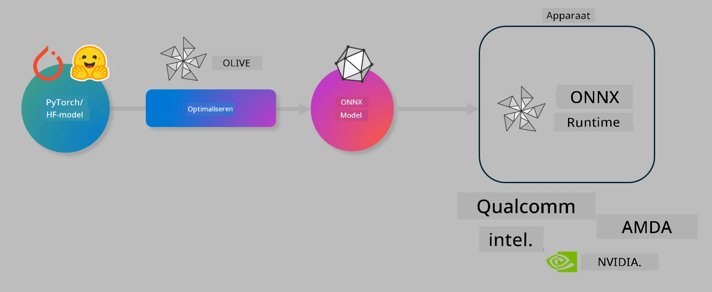

# Lab. Optimaliseer AI-modellen voor on-device inferentie

## Introductie

> [!IMPORTANT]  
> Deze lab vereist een **Nvidia A10 of A100 GPU** met bijbehorende drivers en CUDA toolkit (versie 12+) geïnstalleerd.

> [!NOTE]  
> Dit is een **35 minuten** durende lab die je een praktische introductie geeft in de kernconcepten van het optimaliseren van modellen voor on-device inferentie met OLIVE.

## Leerdoelen

Aan het einde van deze lab kun je met OLIVE:

- Een AI-model kwantiseren met de AWQ-kwantisatiemethode.  
- Een AI-model fijn afstemmen voor een specifieke taak.  
- LoRA-adapters genereren (fijn afgestemd model) voor efficiënte on-device inferentie op de ONNX Runtime.

### Wat is Olive

Olive (*O*NNX *live*) is een toolkit voor modeloptimalisatie met een bijbehorende CLI die je in staat stelt modellen te leveren voor de ONNX runtime +++https://onnxruntime.ai+++ met kwaliteit en prestaties.



De input voor Olive is meestal een PyTorch- of Hugging Face-model en de output is een geoptimaliseerd ONNX-model dat wordt uitgevoerd op een apparaat (deploydoel) met de ONNX runtime. Olive optimaliseert het model voor de AI-accelerator (NPU, GPU, CPU) van het deploydoel, geleverd door een hardwareleverancier zoals Qualcomm, AMD, Nvidia of Intel.

Olive voert een *workflow* uit, een geordende reeks van individuele modeloptimalisatietaken, genaamd *passes* - voorbeelden van passes zijn: modelcompressie, grafiekcaptatie, kwantisatie, grafiekoptimalisatie. Elke pass heeft een set parameters die kunnen worden aangepast om de beste metrics te bereiken, zoals nauwkeurigheid en latency, die worden geëvalueerd door de respectievelijke evaluator. Olive gebruikt een zoekstrategie die een zoekalgoritme inzet om elke pass één voor één of een set passes samen automatisch af te stemmen.

#### Voordelen van Olive

- **Vermindert frustratie en tijd** door trial-and-error handmatige experimenten met verschillende technieken voor grafiekoptimalisatie, compressie en kwantisatie. Definieer je kwaliteit- en prestatie-eisen en laat Olive automatisch het beste model voor je vinden.  
- **Meer dan 40 ingebouwde modeloptimalisatiecomponenten** die geavanceerde technieken in kwantisatie, compressie, grafiekoptimalisatie en fijn afstemmen omvatten.  
- **Gebruiksvriendelijke CLI** voor veelvoorkomende modeloptimalisatietaken. Bijvoorbeeld: olive quantize, olive auto-opt, olive finetune.  
- Modelverpakking en deployment ingebouwd.  
- Ondersteunt het genereren van modellen voor **Multi LoRA serving**.  
- Workflows samenstellen met YAML/JSON om modeloptimalisatie- en deploymenttaken te orkestreren.  
- **Hugging Face** en **Azure AI** integratie.  
- Ingebouwd **caching** mechanisme om **kosten te besparen**.

## Labinstructies

> [!NOTE]  
> Zorg dat je je Azure AI Hub en Project hebt ingericht en je A100 compute hebt ingesteld zoals beschreven in Lab 1.

### Stap 0: Verbinden met je Azure AI Compute

Je maakt verbinding met de Azure AI compute via de remote functie in **VS Code**.

1. Open je **VS Code** desktop applicatie:  
1. Open de **command palette** met **Shift+Ctrl+P**  
1. Zoek in de command palette naar **AzureML - remote: Connect to compute instance in New Window**.  
1. Volg de instructies op het scherm om verbinding te maken met de Compute. Dit houdt in dat je je Azure Subscription, Resource Group, Project en Compute naam selecteert die je in Lab 1 hebt ingesteld.  
1. Zodra je verbonden bent met je Azure ML Compute node, wordt dit weergegeven linksonder in Visual Studio Code als `><Azure ML: Compute Name`

### Stap 1: Clone deze repo

In VS Code kun je een nieuwe terminal openen met **Ctrl+J** en deze repo clonen:

In de terminal zie je de prompt

```
azureuser@computername:~/cloudfiles/code$ 
```  
Clone de oplossing

```bash
cd ~/localfiles
git clone https://github.com/microsoft/phi-3cookbook.git
```

### Stap 2: Open map in VS Code

Om VS Code te openen in de relevante map, voer je het volgende commando uit in de terminal, dit opent een nieuw venster:

```bash
code phi-3cookbook/code/04.Finetuning/Olive-lab
```

Je kunt ook de map openen via **Bestand** > **Map openen**.

### Stap 3: Dependencies

Open een terminalvenster in VS Code op je Azure AI Compute Instance (tip: **Ctrl+J**) en voer de volgende commando’s uit om de dependencies te installeren:

```bash
conda create -n olive-ai python=3.11 -y
conda activate olive-ai
pip install -r requirements.txt
az extension remove -n azure-cli-ml
az extension add -n ml
```

> [!NOTE]  
> Het installeren van alle dependencies duurt ongeveer 5 minuten.

In deze lab download en upload je modellen naar de Azure AI Model catalogus. Om toegang te krijgen tot de modelcatalogus moet je inloggen bij Azure met:

```bash
az login
```

> [!NOTE]  
> Bij het inloggen wordt je gevraagd je subscription te selecteren. Zorg dat je de subscription kiest die voor deze lab is toegewezen.

### Stap 4: Voer Olive-commando’s uit

Open een terminalvenster in VS Code op je Azure AI Compute Instance (tip: **Ctrl+J**) en zorg dat de `olive-ai` conda-omgeving actief is:

```bash
conda activate olive-ai
```

Voer vervolgens de volgende Olive-commando’s uit in de commandoregel.

1. **Inspecteer de data:** In dit voorbeeld ga je het Phi-3.5-Mini model fijn afstemmen zodat het gespecialiseerd is in het beantwoorden van reisgerelateerde vragen. De onderstaande code toont de eerste records van de dataset, die in JSON lines-formaat zijn:

    ```bash
    head data/data_sample_travel.jsonl
    ```

1. **Kwantiseren van het model:** Voordat je het model traint, kwantiseer je het eerst met het volgende commando dat een techniek gebruikt genaamd Active Aware Quantization (AWQ) +++https://arxiv.org/abs/2306.00978+++. AWQ kwantiseert de gewichten van een model door rekening te houden met de activaties die tijdens inferentie worden geproduceerd. Dit betekent dat het kwantisatieproces de daadwerkelijke datadistributie in de activaties meeneemt, wat leidt tot een betere behoud van modelnauwkeurigheid vergeleken met traditionele gewichtskwantisatiemethoden.

    ```bash
    olive quantize \
       --model_name_or_path microsoft/Phi-3.5-mini-instruct \
       --trust_remote_code \
       --algorithm awq \
       --output_path models/phi/awq \
       --log_level 1
    ```

    Het duurt ongeveer **8 minuten** om de AWQ-kwantisatie te voltooien, wat de modelgrootte zal **verminderen van ~7,5GB naar ~2,5GB**.

    In deze lab laten we zien hoe je modellen van Hugging Face kunt invoeren (bijvoorbeeld: `microsoft/Phi-3.5-mini-instruct`). Olive maakt het ook mogelijk om modellen uit de Azure AI catalogus te gebruiken door het argument `model_name_or_path` te updaten naar een Azure AI asset ID (bijvoorbeeld: `azureml://registries/azureml/models/Phi-3.5-mini-instruct/versions/4`).

1. **Train het model:** Vervolgens finetunet het commando `olive finetune` het gekwantiseerde model. Het kwantiseren van het model *voor* het fijn afstemmen in plaats van erna geeft een betere nauwkeurigheid omdat het fijn afstemmen een deel van het verlies door kwantisatie herstelt.

    ```bash
    olive finetune \
        --method lora \
        --model_name_or_path models/phi/awq \
        --data_files "data/data_sample_travel.jsonl" \
        --data_name "json" \
        --text_template "<|user|>\n{prompt}<|end|>\n<|assistant|>\n{response}<|end|>" \
        --max_steps 100 \
        --output_path ./models/phi/ft \
        --log_level 1
    ```

    Het duurt ongeveer **6 minuten** om het fijn afstemmen te voltooien (met 100 stappen).

1. **Optimaliseren:** Met het getrainde model optimaliseer je het model nu met het `auto-opt` commando van Olive, dat de ONNX-grafiek vastlegt en automatisch een aantal optimalisaties uitvoert om de modelprestaties voor CPU te verbeteren door het model te comprimeren en fusies toe te passen. Het is goed om te weten dat je ook kunt optimaliseren voor andere apparaten zoals NPU of GPU door alleen de argumenten `--device` en `--provider` aan te passen - maar voor deze lab gebruiken we CPU.

    ```bash
    olive auto-opt \
       --model_name_or_path models/phi/ft/model \
       --adapter_path models/phi/ft/adapter \
       --device cpu \
       --provider CPUExecutionProvider \
       --use_ort_genai \
       --output_path models/phi/onnx-ao \
       --log_level 1
    ```

    Het duurt ongeveer **5 minuten** om de optimalisatie te voltooien.

### Stap 5: Sneltest modelinferentie

Om de inferentie van het model te testen, maak je een Python-bestand aan in je map met de naam **app.py** en kopieer je de volgende code:

```python
import onnxruntime_genai as og
import numpy as np

print("loading model and adapters...", end="", flush=True)
model = og.Model("models/phi/onnx-ao/model")
adapters = og.Adapters(model)
adapters.load("models/phi/onnx-ao/model/adapter_weights.onnx_adapter", "travel")
print("DONE!")

tokenizer = og.Tokenizer(model)
tokenizer_stream = tokenizer.create_stream()

params = og.GeneratorParams(model)
params.set_search_options(max_length=100, past_present_share_buffer=False)
user_input = "what is the best thing to see in chicago"
params.input_ids = tokenizer.encode(f"<|user|>\n{user_input}<|end|>\n<|assistant|>\n")

generator = og.Generator(model, params)

generator.set_active_adapter(adapters, "travel")

print(f"{user_input}")

while not generator.is_done():
    generator.compute_logits()
    generator.generate_next_token()

    new_token = generator.get_next_tokens()[0]
    print(tokenizer_stream.decode(new_token), end='', flush=True)

print("\n")
```

Voer de code uit met:

```bash
python app.py
```

### Stap 6: Upload model naar Azure AI

Het uploaden van het model naar een Azure AI modelrepository maakt het model deelbaar met andere leden van je ontwikkelteam en verzorgt ook versiebeheer van het model. Om het model te uploaden, voer je het volgende commando uit:

> [!NOTE]  
> Vervang de `{}` placeholders door de naam van je resourcegroep en Azure AI Projectnaam.

Om je resourcegroep `"resourceGroup"` en Azure AI Projectnaam te vinden, voer je het volgende commando uit:

```
az ml workspace show
```

Of ga naar +++ai.azure.com+++ en selecteer **management center** > **project** > **overview**

Vervang de `{}` placeholders door de naam van je resourcegroep en Azure AI Projectnaam.

```bash
az ml model create \
    --name ft-for-travel \
    --version 1 \
    --path ./models/phi/onnx-ao \
    --resource-group {RESOURCE_GROUP_NAME} \
    --workspace-name {PROJECT_NAME}
```  
Je kunt je geüploade model vervolgens bekijken en deployen op https://ml.azure.com/model/list

**Disclaimer**:  
Dit document is vertaald met behulp van de AI-vertalingsdienst [Co-op Translator](https://github.com/Azure/co-op-translator). Hoewel we streven naar nauwkeurigheid, dient u er rekening mee te houden dat geautomatiseerde vertalingen fouten of onnauwkeurigheden kunnen bevatten. Het originele document in de oorspronkelijke taal moet als de gezaghebbende bron worden beschouwd. Voor cruciale informatie wordt professionele menselijke vertaling aanbevolen. Wij zijn niet aansprakelijk voor eventuele misverstanden of verkeerde interpretaties die voortvloeien uit het gebruik van deze vertaling.