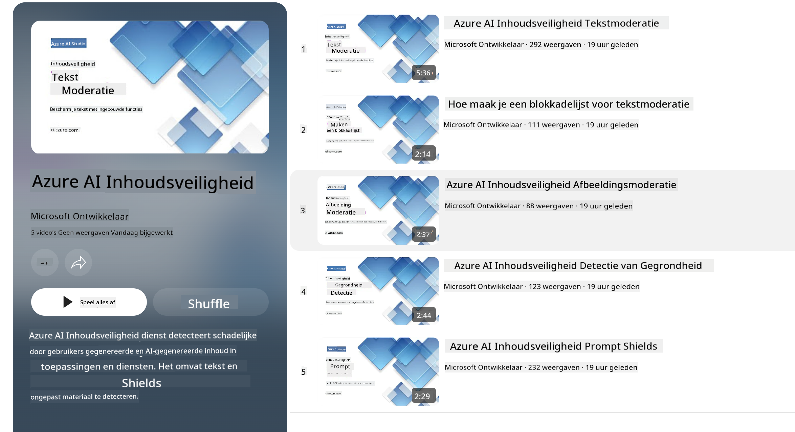

<!--
CO_OP_TRANSLATOR_METADATA:
{
  "original_hash": "c8273672cc57df2be675407a1383aaf0",
  "translation_date": "2025-05-09T06:07:22+00:00",
  "source_file": "md/01.Introduction/01/01.AISafety.md",
  "language_code": "nl"
}
-->
# AI-veiligheid voor Phi-modellen  
De Phi-familie modellen is ontwikkeld volgens de [Microsoft Responsible AI Standard](https://query.prod.cms.rt.microsoft.com/cms/api/am/binary/RE5cmFl), een bedrijf brede set van vereisten gebaseerd op de volgende zes principes: verantwoordelijkheid, transparantie, eerlijkheid, betrouwbaarheid en veiligheid, privacy en beveiliging, en inclusiviteit die samen [Microsoft’s Responsible AI principes](https://www.microsoft.com/ai/responsible-ai) vormen.

Net als bij eerdere Phi-modellen is een veelzijdige veiligheidsbeoordeling en een veiligheidsaanpak na training toegepast, met extra maatregelen om rekening te houden met de meertalige mogelijkheden van deze release. Onze aanpak voor veiligheidstraining en evaluaties, inclusief testen in meerdere talen en risicocategorieën, wordt toegelicht in het [Phi Safety Post-Training Paper](https://arxiv.org/abs/2407.13833). Hoewel de Phi-modellen profiteren van deze aanpak, dienen ontwikkelaars verantwoordelijke AI best practices toe te passen, waaronder het in kaart brengen, meten en beperken van risico’s die verbonden zijn aan hun specifieke gebruikssituatie en culturele en taalkundige context.

## Best Practices

Net als andere modellen kunnen de Phi-modellen zich mogelijk op manieren gedragen die oneerlijk, onbetrouwbaar of aanstootgevend zijn.

Enkele van de beperkingen van SLM en LLM waar je je bewust van moet zijn, zijn:

- **Kwaliteit van de Dienst:** De Phi-modellen zijn voornamelijk getraind op Engelse teksten. Andere talen zullen slechter presteren. Engelse taalvarianten die minder vertegenwoordigd zijn in de trainingsdata kunnen slechter presteren dan standaard Amerikaans Engels.  
- **Weergave van Schade & Bestendiging van Stereotypen:** Deze modellen kunnen groepen mensen over- of ondervertegenwoordigen, de representatie van sommige groepen wissen, of vernederende of negatieve stereotypen versterken. Ondanks de veiligheidsaanpak na training kunnen deze beperkingen nog steeds aanwezig zijn door verschillende niveaus van representatie van groepen of de prevalentie van voorbeelden van negatieve stereotypen in trainingsdata die echte wereldpatronen en maatschappelijke vooroordelen weerspiegelen.  
- **Ongepaste of Aanstootgevende Inhoud:** Deze modellen kunnen andere vormen van ongepaste of aanstootgevende inhoud genereren, waardoor ze mogelijk ongeschikt zijn voor gebruik in gevoelige contexten zonder aanvullende mitigaties die specifiek zijn voor het gebruiksscenario.  
- **Betrouwbaarheid van Informatie:** Taalmodellen kunnen onzinnige inhoud genereren of informatie verzinnen die redelijk klinkt maar onjuist of verouderd is.  
- **Beperkte Code-ondersteuning:** Het merendeel van de Phi-3 trainingsdata is gebaseerd op Python en gebruikt veelvoorkomende pakketten zoals "typing, math, random, collections, datetime, itertools". Als het model Python-scripts genereert die andere pakketten gebruiken of scripts in andere talen, raden we gebruikers sterk aan om alle API-gebruik handmatig te verifiëren.

Ontwikkelaars dienen verantwoordelijke AI best practices toe te passen en zijn verantwoordelijk voor het waarborgen dat een specifiek gebruik voldoet aan relevante wet- en regelgeving (bijv. privacy, handel, enz.).

## Responsible AI Overwegingen

Net als andere taalmodellen kunnen de Phi-serie modellen zich mogelijk op manieren gedragen die oneerlijk, onbetrouwbaar of aanstootgevend zijn. Enkele van de beperkingen om op te letten zijn:

**Kwaliteit van de Dienst:** De Phi-modellen zijn voornamelijk getraind op Engelse teksten. Andere talen zullen slechter presteren. Engelse taalvarianten die minder vertegenwoordigd zijn in de trainingsdata kunnen slechter presteren dan standaard Amerikaans Engels.

**Weergave van Schade & Bestendiging van Stereotypen:** Deze modellen kunnen groepen mensen over- of ondervertegenwoordigen, de representatie van sommige groepen wissen, of vernederende of negatieve stereotypen versterken. Ondanks de veiligheidsaanpak na training kunnen deze beperkingen nog steeds aanwezig zijn door verschillende niveaus van representatie van groepen of de prevalentie van voorbeelden van negatieve stereotypen in trainingsdata die echte wereldpatronen en maatschappelijke vooroordelen weerspiegelen.

**Ongepaste of Aanstootgevende Inhoud:** Deze modellen kunnen andere vormen van ongepaste of aanstootgevende inhoud genereren, waardoor ze mogelijk ongeschikt zijn voor gebruik in gevoelige contexten zonder aanvullende mitigaties die specifiek zijn voor het gebruiksscenario.  
**Betrouwbaarheid van Informatie:** Taalmodellen kunnen onzinnige inhoud genereren of informatie verzinnen die redelijk klinkt maar onjuist of verouderd is.

**Beperkte Code-ondersteuning:** Het merendeel van de Phi-3 trainingsdata is gebaseerd op Python en gebruikt veelvoorkomende pakketten zoals "typing, math, random, collections, datetime, itertools". Als het model Python-scripts genereert die andere pakketten gebruiken of scripts in andere talen, raden we gebruikers sterk aan om alle API-gebruik handmatig te verifiëren.

Ontwikkelaars dienen verantwoordelijke AI best practices toe te passen en zijn verantwoordelijk voor het waarborgen dat een specifiek gebruik voldoet aan relevante wet- en regelgeving (bijv. privacy, handel, enz.). Belangrijke aandachtspunten zijn:

**Toewijzing:** Modellen zijn mogelijk niet geschikt voor scenario’s die grote impact kunnen hebben op juridische status of de toewijzing van middelen of levensmogelijkheden (bijv. huisvesting, werk, krediet, enz.) zonder verdere beoordelingen en aanvullende debiasing-technieken.

**Risicovolle Scenario’s:** Ontwikkelaars moeten de geschiktheid van het gebruik van modellen in risicovolle scenario’s beoordelen waarbij oneerlijke, onbetrouwbare of aanstootgevende uitkomsten extreem kostbaar kunnen zijn of schade kunnen veroorzaken. Dit omvat het geven van advies in gevoelige of gespecialiseerde domeinen waar nauwkeurigheid en betrouwbaarheid cruciaal zijn (bijv. juridisch of medisch advies). Extra waarborgen moeten op applicatieniveau worden geïmplementeerd afhankelijk van de context van de inzet.

**Desinformatie:** Modellen kunnen onjuiste informatie produceren. Ontwikkelaars moeten transparantie best practices volgen en eindgebruikers informeren dat ze met een AI-systeem te maken hebben. Op applicatieniveau kunnen ontwikkelaars feedbackmechanismen en pipelines bouwen om antwoorden te baseren op gebruiksspecifieke, contextuele informatie, een techniek die bekendstaat als Retrieval Augmented Generation (RAG).

**Generatie van Schadelijke Inhoud:** Ontwikkelaars moeten outputs beoordelen op hun context en beschikbare veiligheidsclassificaties of aangepaste oplossingen gebruiken die passend zijn voor hun gebruikssituatie.

**Misbruik:** Andere vormen van misbruik zoals fraude, spam of malwareproductie zijn mogelijk, en ontwikkelaars moeten ervoor zorgen dat hun applicaties niet in strijd zijn met toepasselijke wet- en regelgeving.

### Finetuning en AI Content Safety

Na het finetunen van een model raden we sterk aan gebruik te maken van [Azure AI Content Safety](https://learn.microsoft.com/azure/ai-services/content-safety/overview) maatregelen om de door de modellen gegenereerde inhoud te monitoren, potentiële risico’s, bedreigingen en kwaliteitsproblemen te identificeren en te blokkeren.

[Azure AI Content Safety](https://learn.microsoft.com/azure/ai-services/content-safety/overview) ondersteunt zowel tekst- als beeldinhoud. Het kan worden ingezet in de cloud, in afgesloten containers en op edge/embedded devices.

## Overzicht van Azure AI Content Safety

Azure AI Content Safety is geen kant-en-klare oplossing; het kan worden aangepast aan de specifieke beleidsregels van bedrijven. Bovendien maken de meertalige modellen het mogelijk om meerdere talen tegelijk te begrijpen.

- **Azure AI Content Safety**  
- **Microsoft Developer**  
- **5 video’s**

De Azure AI Content Safety-service detecteert schadelijke gebruikers- en AI-gegenereerde inhoud in applicaties en diensten. Het bevat tekst- en beeld-API’s waarmee je schadelijk of ongepast materiaal kunt detecteren.

[AI Content Safety Playlist](https://www.youtube.com/playlist?list=PLlrxD0HtieHjaQ9bJjyp1T7FeCbmVcPkQ)

**Disclaimer**:  
Dit document is vertaald met behulp van de AI-vertalingsdienst [Co-op Translator](https://github.com/Azure/co-op-translator). Hoewel we streven naar nauwkeurigheid, dient u er rekening mee te houden dat automatische vertalingen fouten of onnauwkeurigheden kunnen bevatten. Het oorspronkelijke document in de oorspronkelijke taal moet als de gezaghebbende bron worden beschouwd. Voor cruciale informatie wordt professionele menselijke vertaling aanbevolen. Wij zijn niet aansprakelijk voor eventuele misverstanden of verkeerde interpretaties die voortvloeien uit het gebruik van deze vertaling.