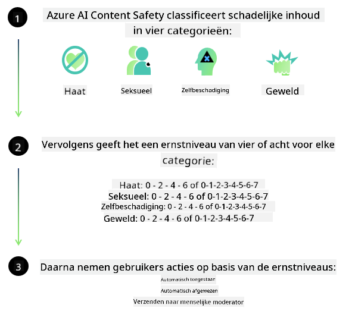

<!--
CO_OP_TRANSLATOR_METADATA:
{
  "original_hash": "839ccc4b3886ef10cfd4e64977f5792d",
  "translation_date": "2026-01-05T08:40:54+00:00",
  "source_file": "md/01.Introduction/01/01.AISafety.md",
  "language_code": "nl"
}
-->
# AI-veiligheid voor Phi-modellen
De Phi-familie modellen zijn ontwikkeld in overeenstemming met de [Microsoft Responsible AI Standard](https://www.microsoft.com/ai/principles-and-approach#responsible-ai-standard), een bedrijfsbrede set van vereisten gebaseerd op de volgende zes principes: verantwoordelijkheid, transparantie, eerlijkheid, betrouwbaarheid en veiligheid, privacy en beveiliging, en inclusiviteit die samen de [Responsible AI-principes van Microsoft](https://www.microsoft.com/ai/responsible-ai) vormen.

Net als bij de vorige Phi-modellen is een veelzijdige veiligheidsbeoordeling en veiligheidspost-trainingsbenadering gehanteerd, met aanvullende maatregelen om rekening te houden met de meertalige mogelijkheden van deze release. Onze aanpak van veiligheidstraining en evaluaties, inclusief testen in meerdere talen en risicocategorieën, wordt uiteengezet in het [Phi Safety Post-Training Paper](https://arxiv.org/abs/2407.13833). Hoewel de Phi-modellen profiteren van deze aanpak, dienen ontwikkelaars verantwoordelijke AI-best practices te hanteren, waaronder het in kaart brengen, meten en mitigeren van risico’s die verband houden met hun specifieke gebruiksgeval en cultureel en linguïstisch context.

## Best Practices

Net als andere modellen kunnen de Phi-modellen zich mogelijk op oneerlijke, onbetrouwbare of aanstootgevende manieren gedragen.

Enkele van de beperkende gedragingen van SLM en LLM waarvan u zich bewust moet zijn, zijn:

- **Kwaliteit van de Dienst:** De Phi-modellen zijn voornamelijk getraind op Engelse tekst. Andere talen dan Engels zullen slechter presteren. Engelse taalvarianten met minder vertegenwoordiging in de trainingsgegevens kunnen slechter presteren dan standaard Amerikaans Engels.
- **Weergave van Schade & Bestendiging van Stereotypen:** Deze modellen kunnen groepen mensen over- of ondervertegenwoordigen, de representatie van sommige groepen uitwissen, of vernederende of negatieve stereotypen versterken. Ondanks veiligheidspost-training kunnen deze beperkingen nog steeds aanwezig zijn vanwege verschillende niveaus van vertegenwoordiging van diverse groepen of de prevalentie van voorbeelden van negatieve stereotypen in trainingsgegevens die real-world patronen en maatschappelijke vooroordelen weerspiegelen.
- **Ongepaste of Aanstootgevende Inhoud:** Deze modellen kunnen andere typen ongepaste of aanstootgevende inhoud produceren, wat het ongepast kan maken om ze in gevoelige contexten zonder aanvullende mitigerende maatregelen die specifiek zijn voor het gebruiksgeval in te zetten.
Informatievertrouwelijkheid: Taalmodellen kunnen onsamenhangende inhoud genereren of inhoud verzinnen die redelijk klinkt maar onnauwkeurig of verouderd is.
- **Beperkt Domein voor Code:** Het merendeel van de Phi-3 trainingsdata is gebaseerd op Python en gebruikt gangbare pakketten zoals "typing, math, random, collections, datetime, itertools". Als het model Python-scripts genereert die andere pakketten gebruiken of scripts in andere talen, raden wij gebruikers sterk aan alle API-gebruiken handmatig te verifiëren.

Ontwikkelaars dienen verantwoordelijke AI-best practices toe te passen en zijn verantwoordelijk voor het waarborgen dat een specifiek gebruiksgeval voldoet aan relevante wet- en regelgeving (bijv. privacy, handel, enz.).

## Overwegingen voor Verantwoorde AI

Net als andere taalmodellen kunnen de Phi-seriemodellen zich mogelijk op oneerlijke, onbetrouwbare of aanstootgevende manieren gedragen. Enkele van de beperkende gedragingen om rekening mee te houden zijn:

**Kwaliteit van de Dienst:** De Phi-modellen zijn voornamelijk getraind op Engelse tekst. Andere talen dan Engels zullen slechter presteren. Engelse taalvarianten met minder vertegenwoordiging in de trainingsgegevens kunnen slechter presteren dan standaard Amerikaans Engels.

**Weergave van Schade & Bestendiging van Stereotypen:** Deze modellen kunnen groepen mensen over- of ondervertegenwoordigen, de representatie van sommige groepen uitwissen, of vernederende of negatieve stereotypen versterken. Ondanks veiligheidspost-training kunnen deze beperkingen nog steeds aanwezig zijn vanwege verschillende niveaus van vertegenwoordiging van diverse groepen of de prevalentie van voorbeelden van negatieve stereotypen in trainingsgegevens die real-world patronen en maatschappelijke vooroordelen weerspiegelen.

**Ongepaste of Aanstootgevende Inhoud:** Deze modellen kunnen andere typen ongepaste of aanstootgevende inhoud produceren, wat het ongepast kan maken om ze in gevoelige contexten zonder aanvullende mitigerende maatregelen die specifiek zijn voor het gebruiksgeval in te zetten.
Informatievertrouwelijkheid: Taalmodellen kunnen onsamenhangende inhoud genereren of inhoud verzinnen die redelijk klinkt maar onnauwkeurig of verouderd is.

**Beperkt Domein voor Code:** Het merendeel van de Phi-3 trainingsdata is gebaseerd op Python en gebruikt gangbare pakketten zoals "typing, math, random, collections, datetime, itertools". Als het model Python-scripts genereert die andere pakketten gebruiken of scripts in andere talen, raden wij gebruikers sterk aan alle API-gebruiken handmatig te verifiëren.

Ontwikkelaars dienen verantwoordelijke AI-best practices toe te passen en zijn verantwoordelijk voor het waarborgen dat een specifiek gebruiksgeval voldoet aan relevante wet- en regelgeving (bijv. privacy, handel, enz.). Belangrijke aandachtspunten zijn:

**Toewijzing:** Modellen zijn mogelijk niet geschikt voor scenario’s die een ingrijpende impact kunnen hebben op juridische status of de toewijzing van middelen of levensmogelijkheden (bijv. huisvesting, werk, krediet, enz.) zonder nadere beoordelingen en aanvullende debiasing-technieken.

**Hoge-Risico Scenario’s:** Ontwikkelaars moeten de geschiktheid van het gebruik van modellen in hoge-risico scenario’s beoordelen waar oneerlijke, onbetrouwbare of aanstootgevende output uiterst kostbaar kan zijn of schade kan veroorzaken. Dit omvat het geven van advies in gevoelige of deskundige domeinen waar nauwkeurigheid en betrouwbaarheid cruciaal zijn (bijv. juridisch of medisch advies). Extra waarborgen moeten op applicatieniveau worden geïmplementeerd volgens de implementatiecontext.

**Misleidende Informatie:** Modellen kunnen onnauwkeurige informatie genereren. Ontwikkelaars moeten transparantiebest practices volgen en eindgebruikers informeren dat ze met een AI-systeem omgaan. Op applicatieniveau kunnen ontwikkelaars feedbackmechanismen en pipelines bouwen om reacties te onderbouwen met gebruiksspecifieke, contextuele informatie, een techniek die bekend staat als Retrieval Augmented Generation (RAG).

**Generatie van Schadelijke Inhoud:** Ontwikkelaars moeten output beoordelen in hun context en beschikbare veiligheidsclassificaties of aangepaste oplossingen toepassen die geschikt zijn voor hun gebruiksgeval.

**Misbruik:** Andere vormen van misbruik zoals fraude, spam of malwareproductie kunnen mogelijk voorkomen en ontwikkelaars moeten ervoor zorgen dat hun applicaties voldoen aan toepasselijke wet- en regelgeving.

### Fijn afstemmen en AI-inhoudsveiligheid

Na het fijn afstemmen van een model raden wij sterk aan gebruik te maken van [Azure AI Content Safety](https://learn.microsoft.com/azure/ai-services/content-safety/overview) maatregelen om de door modellen gegenereerde inhoud te monitoren, potentiële risico’s, bedreigingen en kwaliteitsproblemen te identificeren en te blokkeren.

[Azure AI Content Safety](https://learn.microsoft.com/azure/ai-services/content-safety/overview) ondersteunt zowel tekst- als beeldinhoud. Het kan worden ingezet in de cloud, in losgekoppelde containers en op edge/embedded apparaten.

## Overzicht van Azure AI Content Safety

Azure AI Content Safety is geen kant-en-klare oplossing; het kan worden aangepast aan de specifieke beleidsregels van bedrijven. Bovendien kunnen de meertalige modellen meerdere talen tegelijk begrijpen.

- **Azure AI Content Safety**
- **Microsoft Developer**
- **5 video’s**

De Azure AI Content Safety service detecteert schadelijke gebruikersgegenereerde en AI-gegenereerde inhoud in applicaties en diensten. Het bevat tekst- en beeld-API’s waarmee u schadelijk of ongepast materiaal kunt detecteren.

[AI Content Safety Playlist](https://www.youtube.com/playlist?list=PLlrxD0HtieHjaQ9bJjyp1T7FeCbmVcPkQ)

---

<!-- CO-OP TRANSLATOR DISCLAIMER START -->
**Disclaimer**:
Dit document is vertaald met behulp van de AI-vertalingsservice [Co-op Translator](https://github.com/Azure/co-op-translator). Hoewel we streven naar nauwkeurigheid, kan het voorkomen dat automatische vertalingen fouten of onnauwkeurigheden bevatten. Het originele document in de oorspronkelijke taal moet als de gezaghebbende bron worden beschouwd. Voor kritieke informatie wordt professionele menselijke vertaling aanbevolen. Wij zijn niet aansprakelijk voor eventuele misverstanden of verkeerde interpretaties die voortvloeien uit het gebruik van deze vertaling.
<!-- CO-OP TRANSLATOR DISCLAIMER END -->