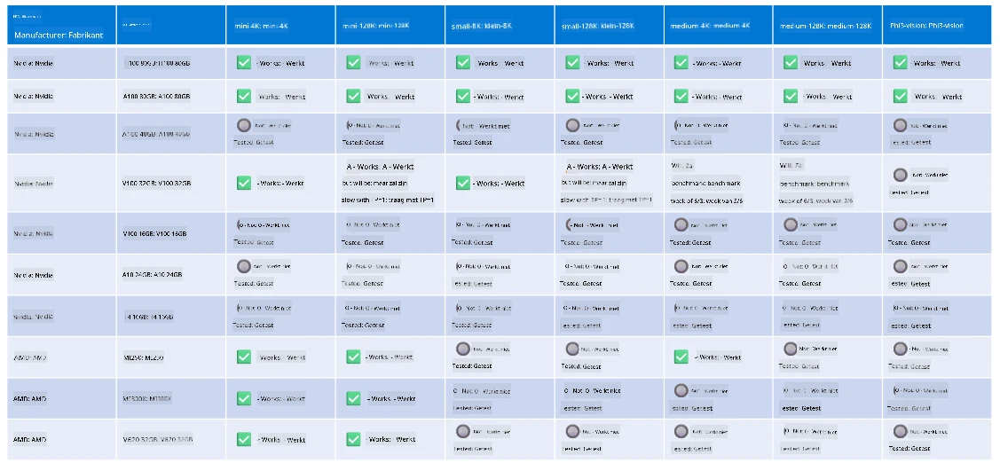

# Phi Hardware Ondersteuning

Microsoft Phi is geoptimaliseerd voor ONNX Runtime en ondersteunt Windows DirectML. Het werkt goed op verschillende hardwaretypes, waaronder GPU's, CPU's en zelfs mobiele apparaten.

## Apparaathardware  
Specifiek omvat de ondersteunde hardware:

- GPU SKU: RTX 4090 (DirectML)  
- GPU SKU: 1 A100 80GB (CUDA)  
- CPU SKU: Standard F64s v2 (64 vCPU's, 128 GiB geheugen)  

## Mobiele SKU

- Android - Samsung Galaxy S21  
- Apple iPhone 14 of hoger met A16/A17-processor  

## Phi Hardware Specificatie

- Minimale vereiste configuratie.  
- Windows: DirectX 12-compatibele GPU en minimaal 4GB gecombineerd RAM  

CUDA: NVIDIA GPU met Compute Capability >= 7.02  



## onnxruntime draaien op meerdere GPU's

De momenteel beschikbare Phi ONNX-modellen zijn alleen voor 1 GPU. Het is mogelijk om multi-gpu ondersteuning te bieden voor Phi-modellen, maar ORT met 2 GPU's garandeert niet dat dit meer doorvoer oplevert dan 2 instanties van ORT. Raadpleeg [ONNX Runtime](https://onnxruntime.ai/) voor de laatste updates.

Tijdens [Build 2024 kondigde het GenAI ONNX Team](https://youtu.be/WLW4SE8M9i8?si=EtG04UwDvcjunyfC) aan dat ze multi-instance in plaats van multi-gpu hadden ingeschakeld voor Phi-modellen.

Op dit moment kun je hiermee één onnxruntime- of onnxruntime-genai-instantie draaien met de CUDA_VISIBLE_DEVICES-omgevingvariabele zoals hieronder.

```Python
CUDA_VISIBLE_DEVICES=0 python infer.py
CUDA_VISIBLE_DEVICES=1 python infer.py
```

Voel je vrij om Phi verder te verkennen in [Azure AI Foundry](https://ai.azure.com)

**Disclaimer**:  
Dit document is vertaald met behulp van de AI-vertalingsdienst [Co-op Translator](https://github.com/Azure/co-op-translator). Hoewel we streven naar nauwkeurigheid, dient u er rekening mee te houden dat geautomatiseerde vertalingen fouten of onnauwkeurigheden kunnen bevatten. Het originele document in de oorspronkelijke taal moet als de gezaghebbende bron worden beschouwd. Voor cruciale informatie wordt professionele menselijke vertaling aanbevolen. Wij zijn niet aansprakelijk voor eventuele misverstanden of verkeerde interpretaties die voortvloeien uit het gebruik van deze vertaling.