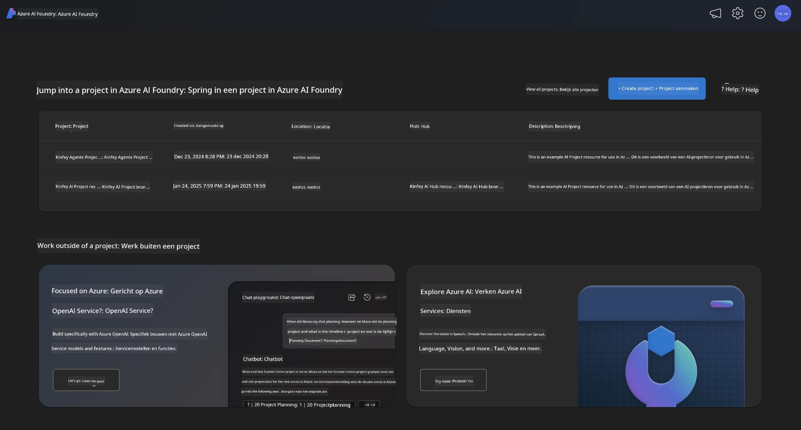
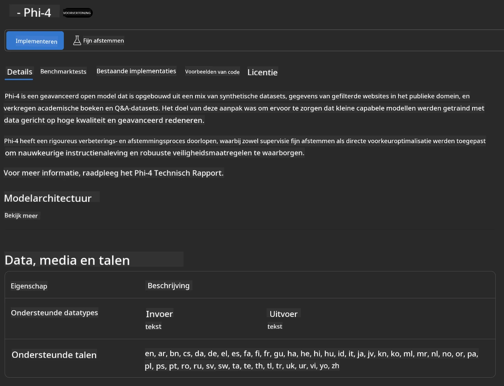
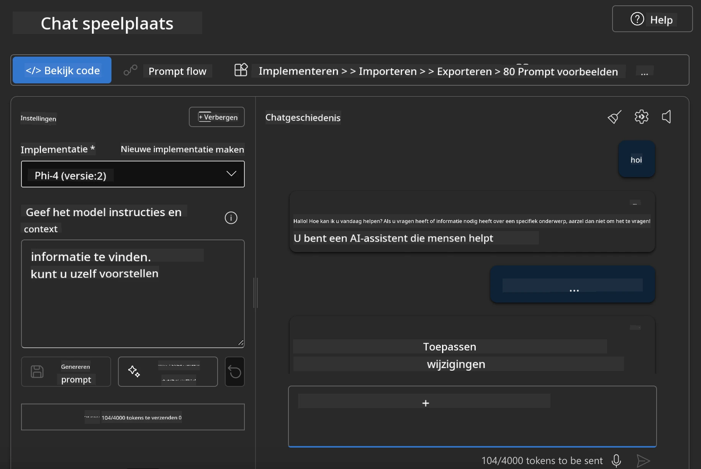

## Phi Family in Azure AI Foundry

[Azure AI Foundry](https://ai.azure.com) is een betrouwbaar platform dat ontwikkelaars in staat stelt om innovatie te stimuleren en de toekomst vorm te geven met AI op een veilige, beveiligde en verantwoorde manier.

[Azure AI Foundry](https://ai.azure.com) is ontworpen voor ontwikkelaars om:

- Generatieve AI-toepassingen te bouwen op een platform van ondernemingsniveau.
- Te verkennen, bouwen, testen en implementeren met geavanceerde AI-tools en ML-modellen, gebaseerd op verantwoordelijke AI-praktijken.
- Samen te werken met een team gedurende de volledige levenscyclus van applicatieontwikkeling.

Met Azure AI Foundry kun je een breed scala aan modellen, diensten en mogelijkheden verkennen en AI-toepassingen bouwen die het beste aansluiten bij jouw doelen. Het Azure AI Foundry-platform maakt schaalbaarheid mogelijk om proof of concepts moeiteloos om te zetten in volwaardige productieapplicaties. Continue monitoring en verfijning ondersteunen langdurig succes.



Naast het gebruik van Azure AOAI Service in Azure AI Foundry, kun je ook modellen van derden gebruiken in de Azure AI Foundry Model Catalog. Dit is een goede keuze als je Azure AI Foundry als jouw AI-oplossingsplatform wilt gebruiken.

We kunnen Phi Family Models snel implementeren via de Model Catalog in Azure AI Foundry

[Microsoft Phi Models in Azure AI Foundry Models](https://ai.azure.com/explore/models/?selectedCollection=phi)


### **Phi-4 implementeren in Azure AI Foundry**



### **Phi-4 testen in Azure AI Foundry Playground**



### **Python-code uitvoeren om Azure AI Foundry Phi-4 aan te roepen**

```python

import os  
import base64
from openai import AzureOpenAI  
from azure.identity import DefaultAzureCredential, get_bearer_token_provider  
        
endpoint = os.getenv("ENDPOINT_URL", "Your Azure AOAI Service Endpoint")  
deployment = os.getenv("DEPLOYMENT_NAME", "Phi-4")  
      
token_provider = get_bearer_token_provider(  
    DefaultAzureCredential(),  
    "https://cognitiveservices.azure.com/.default"  
)  
  
client = AzureOpenAI(  
    azure_endpoint=endpoint,  
    azure_ad_token_provider=token_provider,  
    api_version="2024-05-01-preview",  
)  
  

chat_prompt = [
    {
        "role": "system",
        "content": "You are an AI assistant that helps people find information."
    },
    {
        "role": "user",
        "content": "can you introduce yourself"
    }
] 
    
# Include speech result if speech is enabled  
messages = chat_prompt 

completion = client.chat.completions.create(  
    model=deployment,  
    messages=messages,
    max_tokens=800,  
    temperature=0.7,  
    top_p=0.95,  
    frequency_penalty=0,  
    presence_penalty=0,
    stop=None,  
    stream=False  
)  
  
print(completion.to_json())  

```

**Disclaimer**:  
Dit document is vertaald met behulp van de AI-vertalingsdienst [Co-op Translator](https://github.com/Azure/co-op-translator). Hoewel we streven naar nauwkeurigheid, dient u er rekening mee te houden dat geautomatiseerde vertalingen fouten of onnauwkeurigheden kunnen bevatten. Het originele document in de oorspronkelijke taal moet als de gezaghebbende bron worden beschouwd. Voor cruciale informatie wordt professionele menselijke vertaling aanbevolen. Wij zijn niet aansprakelijk voor eventuele misverstanden of verkeerde interpretaties die voortvloeien uit het gebruik van deze vertaling.