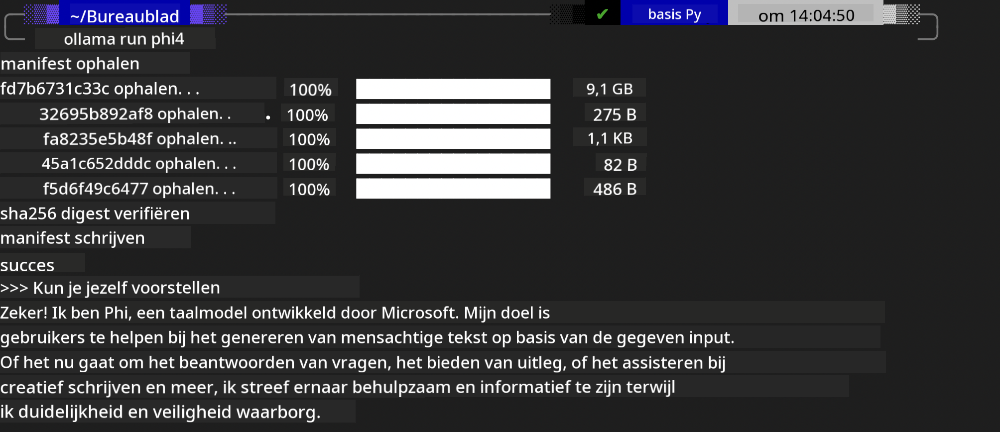
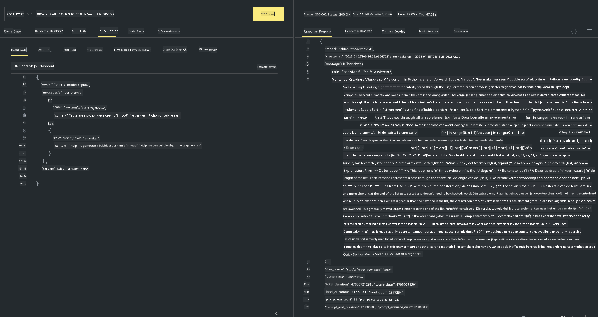

<!--
CO_OP_TRANSLATOR_METADATA:
{
  "original_hash": "0b38834693bb497f96bf53f0d941f9a1",
  "translation_date": "2025-07-16T19:17:11+00:00",
  "source_file": "md/01.Introduction/02/04.Ollama.md",
  "language_code": "nl"
}
-->
## Phi Family in Ollama


[Ollama](https://ollama.com) maakt het voor meer mensen mogelijk om open source LLM of SLM direct te implementeren via eenvoudige scripts, en kan ook API's bouwen om lokale Copilot-toepassingsscenario's te ondersteunen.

## **1. Installatie**

Ollama ondersteunt het draaien op Windows, macOS en Linux. Je kunt Ollama installeren via deze link ([https://ollama.com/download](https://ollama.com/download)). Na een succesvolle installatie kun je direct met een terminalvenster het Ollama-script gebruiken om Phi-3 aan te roepen. Je kunt alle [beschikbare bibliotheken in Ollama](https://ollama.com/library) bekijken. Als je deze repository opent in een Codespace, is Ollama al geïnstalleerd.

```bash

ollama run phi4

```

> [!NOTE]
> Het model wordt de eerste keer dat je het uitvoert eerst gedownload. Natuurlijk kun je ook direct het gedownloade Phi-4 model specificeren. We nemen WSL als voorbeeld om het commando uit te voeren. Nadat het model succesvol is gedownload, kun je direct via de terminal interactie hebben.



## **2. Roep de phi-4 API aan vanuit Ollama**

Als je de Phi-4 API wilt aanroepen die door Ollama is gegenereerd, kun je dit commando in de terminal gebruiken om de Ollama-server te starten.

```bash

ollama serve

```

> [!NOTE]
> Als je MacOS of Linux gebruikt, kan het zijn dat je de volgende foutmelding krijgt: **"Error: listen tcp 127.0.0.1:11434: bind: address already in use"**. Deze fout kan optreden bij het uitvoeren van het commando. Je kunt deze fout negeren, omdat dit meestal betekent dat de server al draait, of je kunt Ollama stoppen en opnieuw starten:

**macOS**

```bash

brew services restart ollama

```

**Linux**

```bash

sudo systemctl stop ollama

```

Ollama ondersteunt twee API's: generate en chat. Je kunt de model-API die Ollama aanbiedt aanroepen op basis van je behoeften, door verzoeken te sturen naar de lokale service die draait op poort 11434.

**Chat**

```bash

curl http://127.0.0.1:11434/api/chat -d '{
  "model": "phi3",
  "messages": [
    {
      "role": "system",
      "content": "Your are a python developer."
    },
    {
      "role": "user",
      "content": "Help me generate a bubble algorithm"
    }
  ],
  "stream": false
  
}'

This is the result in Postman



## Additional Resources

Check the list of available models in Ollama in [their library](https://ollama.com/library).

Pull your model from the Ollama server using this command

```bash
ollama pull phi4
```

Run the model using this command

```bash
ollama run phi4
```

***Note:*** Visit this link [https://github.com/ollama/ollama/blob/main/docs/api.md](https://github.com/ollama/ollama/blob/main/docs/api.md) to learn more

## Calling Ollama from Python

You can use `requests` or `urllib3` to make requests to the local server endpoints used above. However, a popular way to use Ollama in Python is via the [openai](https://pypi.org/project/openai/) SDK, since Ollama provides OpenAI-compatible server endpoints as well.

Here is an example for phi3-mini:

```python
import openai

client = openai.OpenAI(
    base_url="http://localhost:11434/v1",
    api_key="nokeyneeded",
)

response = client.chat.completions.create(
    model="phi4",
    temperature=0.7,
    n=1,
    messages=[
        {"role": "system", "content": "Je bent een behulpzame assistent."},
        {"role": "user", "content": "Schrijf een haiku over een hongerige kat"},
    ],
)

print("Response:")
print(response.choices[0].message.content)
```

## Calling Ollama from JavaScript 

```javascript
// Voorbeeld van een bestand samenvatten met Phi-4
script({
    model: "ollama:phi4",
    title: "Samenvatten met Phi-4",
    system: ["system"],
})

// Voorbeeld van samenvatten
const file = def("FILE", env.files)
$`Vat ${file} samen in één alinea.`
```

## Calling Ollama from C#

Create a new C# Console application and add the following NuGet package:

```bash
dotnet add package Microsoft.SemanticKernel --version 1.34.0
```

Then replace this code in the `Program.cs` file

```csharp
using Microsoft.SemanticKernel;
using Microsoft.SemanticKernel.ChatCompletion;

// voeg chat completion service toe met de lokale ollama server endpoint
#pragma warning disable SKEXP0001, SKEXP0003, SKEXP0010, SKEXP0011, SKEXP0050, SKEXP0052
builder.AddOpenAIChatCompletion(
    modelId: "phi4",
    endpoint: new Uri("http://localhost:11434/"),
    apiKey: "non required");

// roep een eenvoudige prompt aan bij de chatservice
string prompt = "Schrijf een grap over kittens";
var response = await kernel.InvokePromptAsync(prompt);
Console.WriteLine(response.GetValue<string>());
```

Run the app with the command:

```bash
dotnet run


**Disclaimer**:  
Dit document is vertaald met behulp van de AI-vertalingsdienst [Co-op Translator](https://github.com/Azure/co-op-translator). Hoewel we streven naar nauwkeurigheid, dient u er rekening mee te houden dat geautomatiseerde vertalingen fouten of onnauwkeurigheden kunnen bevatten. Het originele document in de oorspronkelijke taal moet als de gezaghebbende bron worden beschouwd. Voor cruciale informatie wordt professionele menselijke vertaling aanbevolen. Wij zijn niet aansprakelijk voor eventuele misverstanden of verkeerde interpretaties die voortvloeien uit het gebruik van deze vertaling.