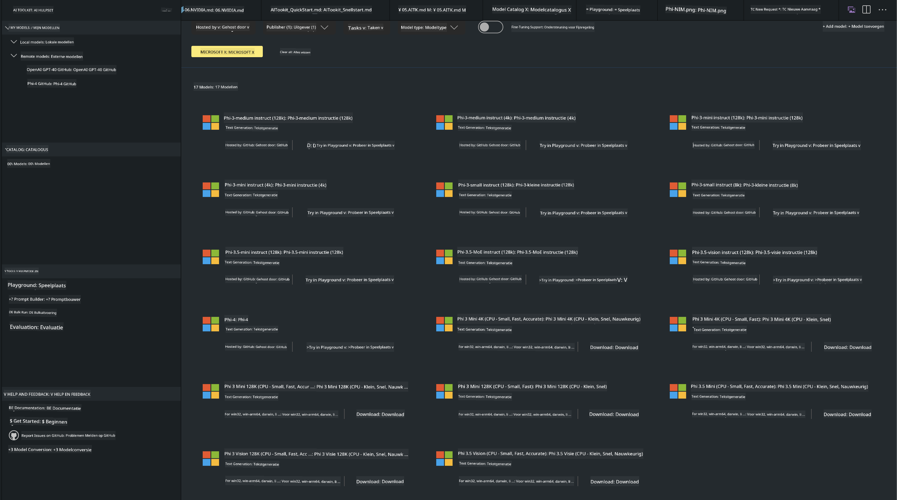
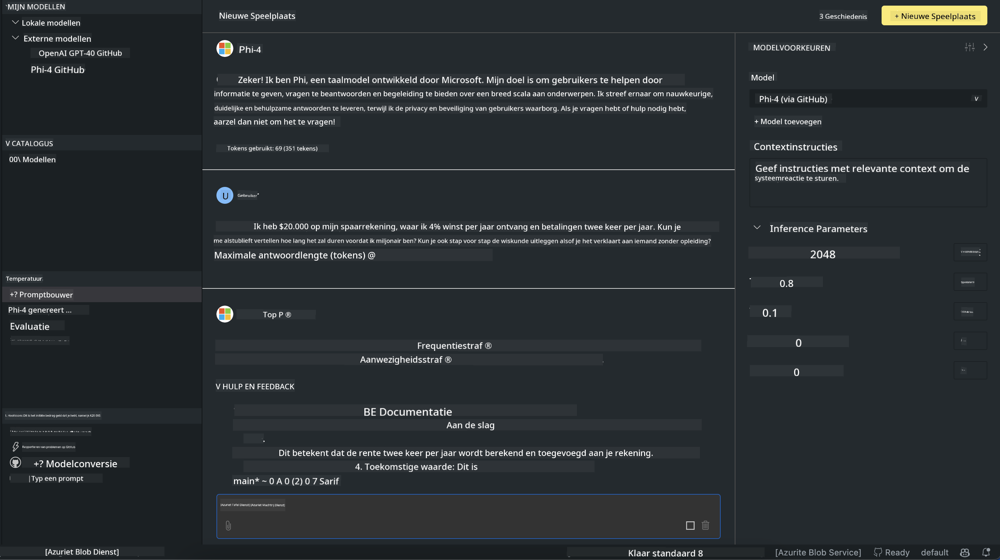

<!--
CO_OP_TRANSLATOR_METADATA:
{
  "original_hash": "4951d458c0b60c02cd1e751b40903877",
  "translation_date": "2025-05-09T09:38:25+00:00",
  "source_file": "md/01.Introduction/02/05.AITK.md",
  "language_code": "nl"
}
-->
# Phi Family in AITK

[AI Toolkit for VS Code](https://marketplace.visualstudio.com/items?itemName=ms-windows-ai-studio.windows-ai-studio) maakt het ontwikkelen van generatieve AI-apps eenvoudiger door geavanceerde AI-ontwikkeltools en modellen samen te brengen vanuit de Azure AI Foundry Catalog en andere catalogi zoals Hugging Face. Je kunt door de AI-modellencatalogus bladeren, aangedreven door GitHub Models en Azure AI Foundry Model Catalogs, modellen lokaal of op afstand downloaden, fine-tunen, testen en gebruiken in je applicatie.

AI Toolkit Preview draait lokaal. Lokale inferentie of fine-tuning hangt af van het gekozen model; je hebt mogelijk een GPU nodig, zoals een NVIDIA CUDA GPU. Je kunt GitHub Models ook direct met AITK gebruiken.

## Aan de slag

[Lees meer over het installeren van de Windows subsystem for Linux](https://learn.microsoft.com/windows/wsl/install?WT.mc_id=aiml-137032-kinfeylo)

en [het wijzigen van de standaarddistributie](https://learn.microsoft.com/windows/wsl/install#change-the-default-linux-distribution-installed).

[AI Toolkit GitHub Repo](https://github.com/microsoft/vscode-ai-toolkit/)

- Windows, Linux, macOS

- Voor fine-tuning op zowel Windows als Linux heb je een Nvidia GPU nodig. Daarnaast vereist **Windows** het Windows subsystem for Linux met Ubuntu distro 18.4 of hoger. [Lees meer over het installeren van Windows subsystem for Linux](https://learn.microsoft.com/windows/wsl/install) en [het wijzigen van de standaarddistributie](https://learn.microsoft.com/windows/wsl/install#change-the-default-linux-distribution-installed).

### AI Toolkit installeren

AI Toolkit wordt geleverd als een [Visual Studio Code Extension](https://code.visualstudio.com/docs/setup/additional-components#_vs-code-extensions), dus je moet eerst [VS Code](https://code.visualstudio.com/docs/setup/windows?WT.mc_id=aiml-137032-kinfeylo) installeren en AI Toolkit downloaden van de [VS Marketplace](https://marketplace.visualstudio.com/items?itemName=ms-windows-ai-studio.windows-ai-studio).  
De [AI Toolkit is beschikbaar in de Visual Studio Marketplace](https://marketplace.visualstudio.com/items?itemName=ms-windows-ai-studio.windows-ai-studio) en kan worden geïnstalleerd zoals elke andere VS Code-extensie.

Als je niet bekend bent met het installeren van VS Code-extensies, volg dan deze stappen:

### Aanmelden

1. Selecteer in de Activity Bar van VS Code **Extensions**  
1. Typ in de zoekbalk voor extensies "AI Toolkit"  
1. Selecteer "AI Toolkit for Visual Studio code"  
1. Klik op **Install**

Nu ben je klaar om de extensie te gebruiken!

Je wordt gevraagd om in te loggen bij GitHub, klik hiervoor op "Allow" om door te gaan. Je wordt doorgestuurd naar de GitHub-aanmeldpagina.

Log in en volg de stappen. Na succesvolle aanmelding word je teruggeleid naar VS Code.

Zodra de extensie is geïnstalleerd, zie je het AI Toolkit-icoon verschijnen in je Activity Bar.

Laten we de beschikbare acties verkennen!

### Beschikbare acties

De primaire zijbalk van de AI Toolkit is georganiseerd in  

- **Models**  
- **Resources**  
- **Playground**  
- **Fine-tuning**  
- **Evaluation**

Deze zijn te vinden in de Resources-sectie. Om te beginnen selecteer je **Model Catalog**.

### Een model downloaden uit de catalogus

Wanneer je AI Toolkit opent vanuit de VS Code zijbalk, kun je kiezen uit de volgende opties:



- Zoek een ondersteund model in **Model Catalog** en download het lokaal  
- Test modelinference in de **Model Playground**  
- Fine-tune het model lokaal of op afstand in **Model Fine-tuning**  
- Zet fine-tuned modellen uit naar de cloud via de command palette van AI Toolkit  
- Modellevaluatie

> [!NOTE]
>
> **GPU versus CPU**
>
> Je zult zien dat de modelkaarten de modelgrootte, het platform en het type accelerator (CPU, GPU) tonen. Voor optimale prestaties op **Windows-apparaten met minimaal één GPU**, kies je modelversies die alleen op Windows gericht zijn.
>
> Dit zorgt ervoor dat je een model hebt dat geoptimaliseerd is voor de DirectML-accelerator.
>
> De modelnamen hebben het formaat
>
> - `{model_name}-{accelerator}-{quantization}-{format}`.
>
>Om te controleren of je een GPU hebt op je Windows-apparaat, open je **Taakbeheer** en selecteer je het tabblad **Prestaties**. Als je GPU(s) hebt, worden deze vermeld onder namen zoals "GPU 0" of "GPU 1".

### Het model uitvoeren in de playground

Als alle parameters zijn ingesteld, klik je op **Generate Project**.

Zodra je model is gedownload, selecteer je **Load in Playground** op de modelkaart in de catalogus:

- Start het downloaden van het model  
- Installeer alle vereisten en afhankelijkheden  
- Maak een VS Code workspace aan



### Gebruik de REST API in je applicatie

De AI Toolkit bevat een lokale REST API-webserver **op poort 5272** die het [OpenAI chat completions format](https://platform.openai.com/docs/api-reference/chat/create) gebruikt.

Hiermee kun je je applicatie lokaal testen zonder afhankelijk te zijn van een cloud AI-modelservice. Bijvoorbeeld, het volgende JSON-bestand laat zien hoe je de body van het verzoek configureert:

```json
{
    "model": "Phi-4",
    "messages": [
        {
            "role": "user",
            "content": "what is the golden ratio?"
        }
    ],
    "temperature": 0.7,
    "top_p": 1,
    "top_k": 10,
    "max_tokens": 100,
    "stream": true
}
```

Je kunt de REST API testen met bijvoorbeeld [Postman](https://www.postman.com/) of de CURL (Client URL) tool:

```bash
curl -vX POST http://127.0.0.1:5272/v1/chat/completions -H 'Content-Type: application/json' -d @body.json
```

### Gebruik van de OpenAI clientbibliotheek voor Python

```python
from openai import OpenAI

client = OpenAI(
    base_url="http://127.0.0.1:5272/v1/", 
    api_key="x" # required for the API but not used
)

chat_completion = client.chat.completions.create(
    messages=[
        {
            "role": "user",
            "content": "what is the golden ratio?",
        }
    ],
    model="Phi-4",
)

print(chat_completion.choices[0].message.content)
```

### Gebruik van Azure OpenAI clientbibliotheek voor .NET

Voeg de [Azure OpenAI clientbibliotheek voor .NET](https://www.nuget.org/packages/Azure.AI.OpenAI/) toe aan je project via NuGet:

```bash
dotnet add {project_name} package Azure.AI.OpenAI --version 1.0.0-beta.17
```

Voeg een C#-bestand toe met de naam **OverridePolicy.cs** aan je project en plak de volgende code:

```csharp
// OverridePolicy.cs
using Azure.Core.Pipeline;
using Azure.Core;

internal partial class OverrideRequestUriPolicy(Uri overrideUri)
    : HttpPipelineSynchronousPolicy
{
    private readonly Uri _overrideUri = overrideUri;

    public override void OnSendingRequest(HttpMessage message)
    {
        message.Request.Uri.Reset(_overrideUri);
    }
}
```

Plak vervolgens de volgende code in je **Program.cs** bestand:

```csharp
// Program.cs
using Azure.AI.OpenAI;

Uri localhostUri = new("http://localhost:5272/v1/chat/completions");

OpenAIClientOptions clientOptions = new();
clientOptions.AddPolicy(
    new OverrideRequestUriPolicy(localhostUri),
    Azure.Core.HttpPipelinePosition.BeforeTransport);
OpenAIClient client = new(openAIApiKey: "unused", clientOptions);

ChatCompletionsOptions options = new()
{
    DeploymentName = "Phi-4",
    Messages =
    {
        new ChatRequestSystemMessage("You are a helpful assistant. Be brief and succinct."),
        new ChatRequestUserMessage("What is the golden ratio?"),
    }
};

StreamingResponse<StreamingChatCompletionsUpdate> streamingChatResponse
    = await client.GetChatCompletionsStreamingAsync(options);

await foreach (StreamingChatCompletionsUpdate chatChunk in streamingChatResponse)
{
    Console.Write(chatChunk.ContentUpdate);
}
```


## Fine Tuning met AI Toolkit

- Begin met model discovery en playground.  
- Model fine-tuning en inferentie met lokale computerbronnen.  
- Remote fine-tuning en inferentie met Azure-resources.

[Fine Tuning met AI Toolkit](../../03.FineTuning/Finetuning_VSCodeaitoolkit.md)

## AI Toolkit Q&A Resources

Raadpleeg onze [Q&A pagina](https://github.com/microsoft/vscode-ai-toolkit/blob/main/archive/QA.md) voor de meest voorkomende problemen en oplossingen.

**Disclaimer**:  
Dit document is vertaald met behulp van de AI-vertalingsdienst [Co-op Translator](https://github.com/Azure/co-op-translator). Hoewel we streven naar nauwkeurigheid, dient u er rekening mee te houden dat automatische vertalingen fouten of onnauwkeurigheden kunnen bevatten. Het originele document in de oorspronkelijke taal dient als de gezaghebbende bron te worden beschouwd. Voor cruciale informatie wordt professionele menselijke vertaling aanbevolen. Wij zijn niet aansprakelijk voor eventuele misverstanden of verkeerde interpretaties die voortvloeien uit het gebruik van deze vertaling.