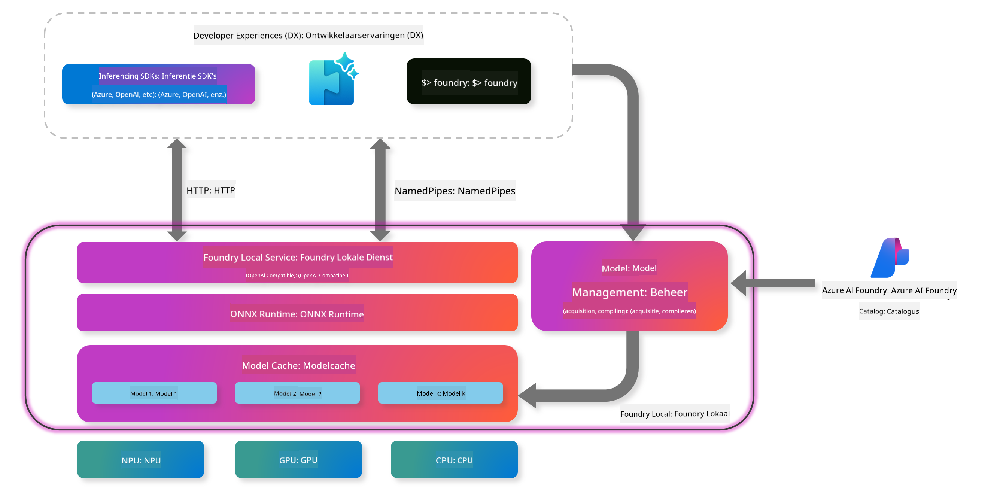
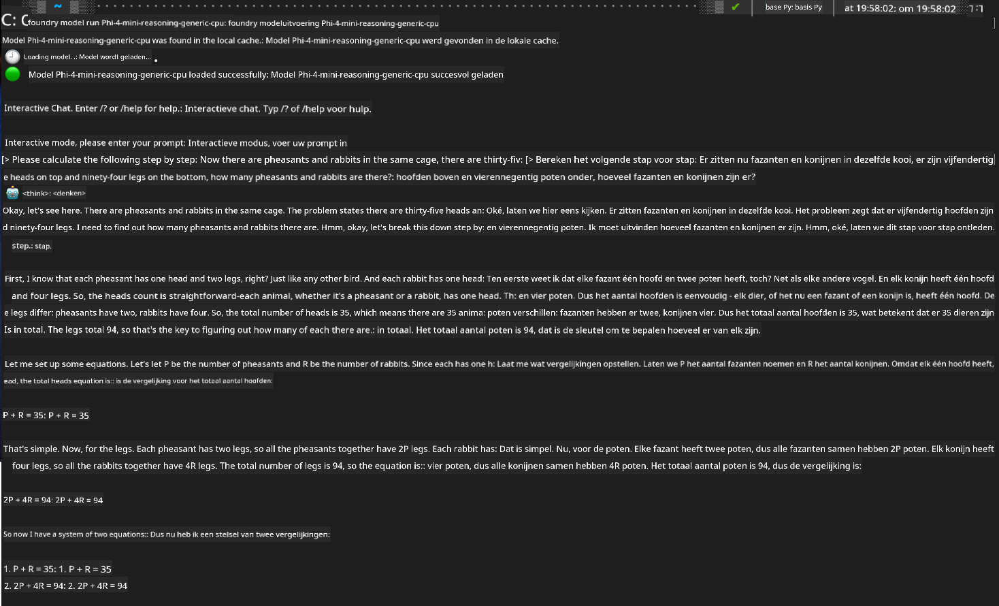

<!--
CO_OP_TRANSLATOR_METADATA:
{
  "original_hash": "52973a5680a65a810aa80b7036afd31f",
  "translation_date": "2025-07-16T19:48:22+00:00",
  "source_file": "md/01.Introduction/02/07.FoundryLocal.md",
  "language_code": "nl"
}
-->
## Aan de slag met Phi-Family modellen in Foundry Local

### Introductie tot Foundry Local

Foundry Local is een krachtige AI-inferentieoplossing die direct op je eigen apparaat draait en enterprise-grade AI-mogelijkheden naar je lokale hardware brengt. Deze handleiding helpt je bij het opzetten en gebruiken van Phi-Family modellen met Foundry Local, zodat je volledige controle hebt over je AI-taken, terwijl je privacy bewaakt en kosten verlaagt.

Foundry Local biedt voordelen op het gebied van prestaties, privacy, maatwerk en kosten door AI-modellen lokaal op je apparaat te draaien. Het integreert naadloos in je bestaande workflows en applicaties via een intuïtieve CLI, SDK en REST API.




### Waarom kiezen voor Foundry Local?

Door de voordelen van Foundry Local te begrijpen, kun je weloverwogen beslissingen nemen over je AI-implementatiestrategie:

- **Inferentie op het apparaat:** Draai modellen lokaal op je eigen hardware, verlaag je kosten en houd al je data op je apparaat.

- **Modelaanpassing:** Kies uit vooraf ingestelde modellen of gebruik je eigen modellen om aan specifieke eisen en toepassingen te voldoen.

- **Kostenbesparing:** Vermijd terugkerende kosten voor cloudservices door gebruik te maken van je bestaande hardware, waardoor AI toegankelijker wordt.

- **Naadloze integratie:** Verbind met je applicaties via een SDK, API-endpoints of de CLI, met eenvoudige opschaling naar Azure AI Foundry wanneer je behoeften groeien.

> **Opstartnotitie:** Deze handleiding richt zich op het gebruik van Foundry Local via de CLI en SDK. Je leert beide methoden zodat je de beste keuze kunt maken voor jouw situatie.

## Deel 1: Foundry Local CLI installeren en gebruiken

### Stap 1: Installatie

De Foundry Local CLI is je toegangspoort tot het beheren en draaien van AI-modellen lokaal. Laten we beginnen met de installatie op je systeem.

**Ondersteunde platforms:** Windows en macOS

Voor gedetailleerde installatie-instructies, raadpleeg de [officiële Foundry Local documentatie](https://github.com/microsoft/Foundry-Local/blob/main/README.md).

### Stap 2: Beschikbare modellen verkennen

Zodra je Foundry Local CLI hebt geïnstalleerd, kun je ontdekken welke modellen beschikbaar zijn voor jouw toepassing. Met dit commando zie je alle ondersteunde modellen:


```bash
foundry model list
```

### Stap 3: Phi Family modellen begrijpen

De Phi Family biedt een reeks modellen die geoptimaliseerd zijn voor verschillende toepassingen en hardwareconfiguraties. Dit zijn de Phi-modellen die beschikbaar zijn in Foundry Local:

**Beschikbare Phi modellen:** 

- **phi-3.5-mini** - Compact model voor basistaken
- **phi-3-mini-128k** - Uitgebreide contextversie voor langere gesprekken
- **phi-3-mini-4k** - Standaard contextmodel voor algemeen gebruik
- **phi-4** - Geavanceerd model met verbeterde mogelijkheden
- **phi-4-mini** - Lichtgewicht versie van Phi-4
- **phi-4-mini-reasoning** - Gespecialiseerd in complexe redeneertaken

> **Hardwarecompatibiliteit:** Elk model kan worden geconfigureerd voor verschillende hardwareversnelling (CPU, GPU) afhankelijk van de mogelijkheden van je systeem.

### Stap 4: Je eerste Phi-model draaien

Laten we beginnen met een praktisch voorbeeld. We draaien het `phi-4-mini-reasoning` model, dat uitblinkt in het stap voor stap oplossen van complexe problemen.


**Commando om het model te draaien:**

```bash
foundry model run Phi-4-mini-reasoning-generic-cpu
```

> **Eerste keer opstarten:** Bij het voor het eerst draaien van een model zal Foundry Local het automatisch downloaden naar je apparaat. De downloadtijd hangt af van je netwerksnelheid, dus heb geduld tijdens de eerste setup.

### Stap 5: Het model testen met een echt probleem

Laten we het model nu testen met een klassiek logisch probleem om te zien hoe het stap voor stap redeneert:

**Voorbeeldprobleem:**

```txt
Please calculate the following step by step: Now there are pheasants and rabbits in the same cage, there are thirty-five heads on top and ninety-four legs on the bottom, how many pheasants and rabbits are there?
```

**Verwacht gedrag:** Het model zou dit probleem moeten opsplitsen in logische stappen, gebruikmakend van het feit dat fazanten 2 poten hebben en konijnen 4 poten om het stelsel vergelijkingen op te lossen.

**Resultaten:**



## Deel 2: Applicaties bouwen met Foundry Local SDK

### Waarom de SDK gebruiken?

Hoewel de CLI ideaal is voor testen en snelle interacties, stelt de SDK je in staat Foundry Local programmatisch in je applicaties te integreren. Dit opent mogelijkheden voor:

- Het bouwen van op maat gemaakte AI-gedreven applicaties
- Het creëren van geautomatiseerde workflows
- Het integreren van AI-mogelijkheden in bestaande systemen
- Het ontwikkelen van chatbots en interactieve tools

### Ondersteunde programmeertalen

Foundry Local biedt SDK-ondersteuning voor meerdere programmeertalen, passend bij jouw ontwikkelvoorkeuren:

**📦 Beschikbare SDK's:**

- **C# (.NET):** [SDK Documentatie & Voorbeelden](https://github.com/microsoft/Foundry-Local/tree/main/sdk/cs)
- **Python:** [SDK Documentatie & Voorbeelden](https://github.com/microsoft/Foundry-Local/tree/main/sdk/python)
- **JavaScript:** [SDK Documentatie & Voorbeelden](https://github.com/microsoft/Foundry-Local/tree/main/sdk/js)
- **Rust:** [SDK Documentatie & Voorbeelden](https://github.com/microsoft/Foundry-Local/tree/main/sdk/rust)

### Volgende stappen

1. **Kies de SDK die het beste bij je ontwikkelomgeving past**
2. **Volg de SDK-specifieke documentatie** voor gedetailleerde implementatiehandleidingen
3. **Begin met eenvoudige voorbeelden** voordat je complexe applicaties bouwt
4. **Verken de voorbeeldcode** die in elke SDK-repository wordt meegeleverd

## Conclusie

Je hebt nu geleerd hoe je:
- ✅ Foundry Local CLI installeert en configureert
- ✅ Phi Family modellen ontdekt en draait
- ✅ Modellen test met praktijkvoorbeelden
- ✅ SDK-opties begrijpt voor applicatieontwikkeling

Foundry Local biedt een krachtige basis om AI-mogelijkheden direct naar je lokale omgeving te brengen, waardoor je controle hebt over prestaties, privacy en kosten, terwijl je de flexibiliteit behoudt om indien nodig naar cloudoplossingen op te schalen.

**Disclaimer**:  
Dit document is vertaald met behulp van de AI-vertalingsdienst [Co-op Translator](https://github.com/Azure/co-op-translator). Hoewel we streven naar nauwkeurigheid, dient u er rekening mee te houden dat geautomatiseerde vertalingen fouten of onnauwkeurigheden kunnen bevatten. Het originele document in de oorspronkelijke taal moet als de gezaghebbende bron worden beschouwd. Voor cruciale informatie wordt professionele menselijke vertaling aanbevolen. Wij zijn niet aansprakelijk voor eventuele misverstanden of verkeerde interpretaties die voortvloeien uit het gebruik van deze vertaling.