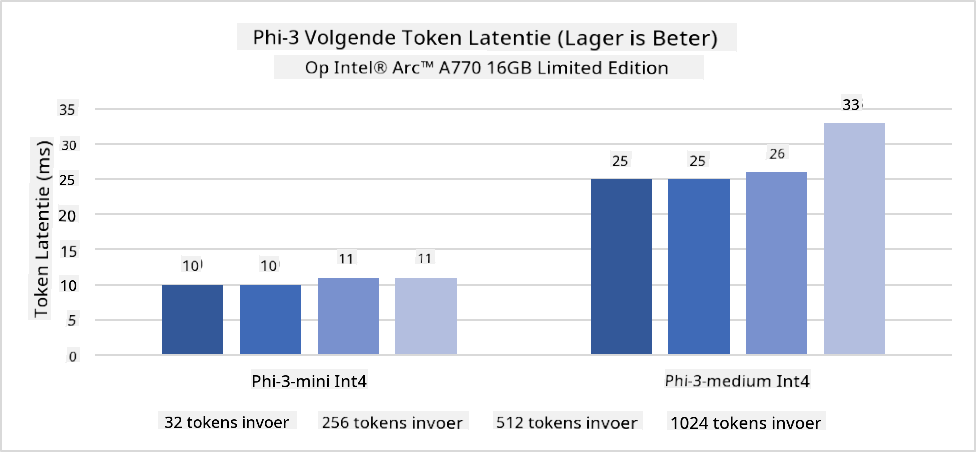
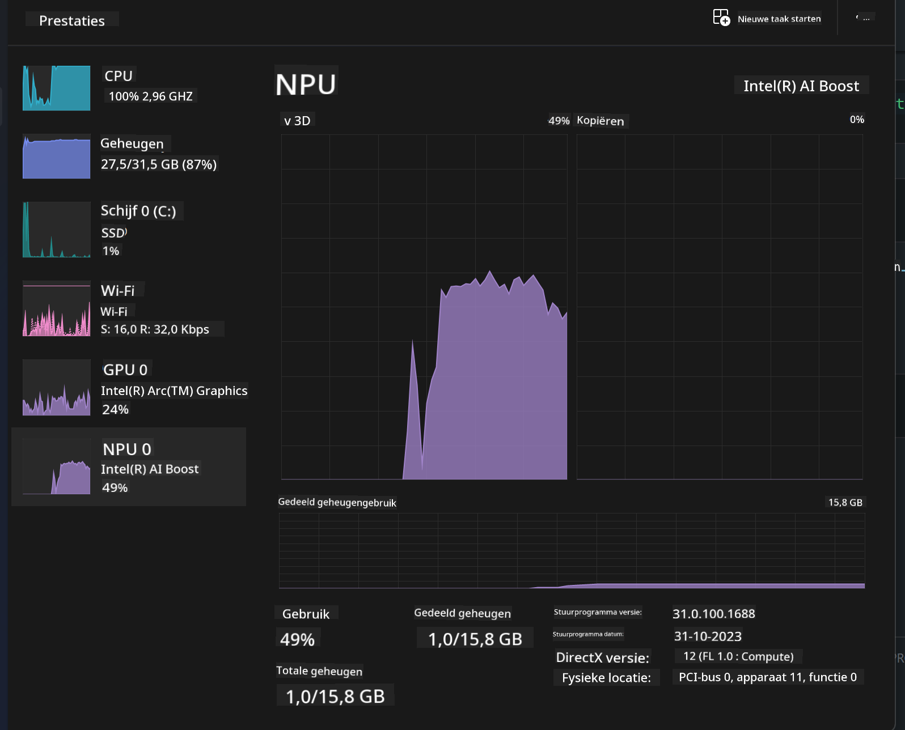
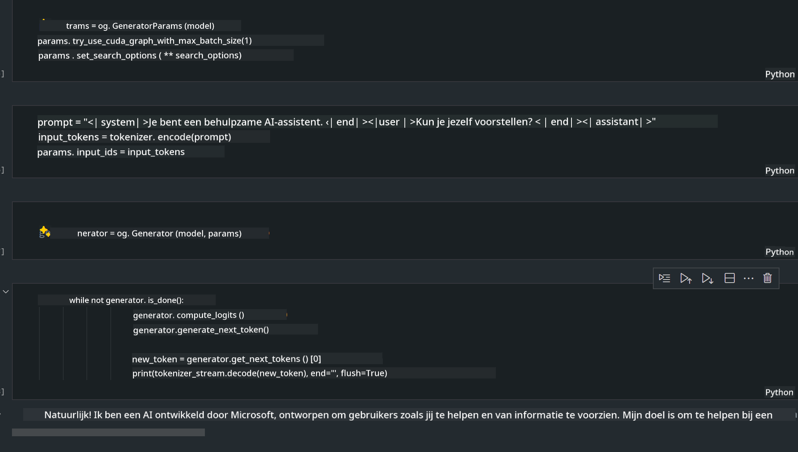
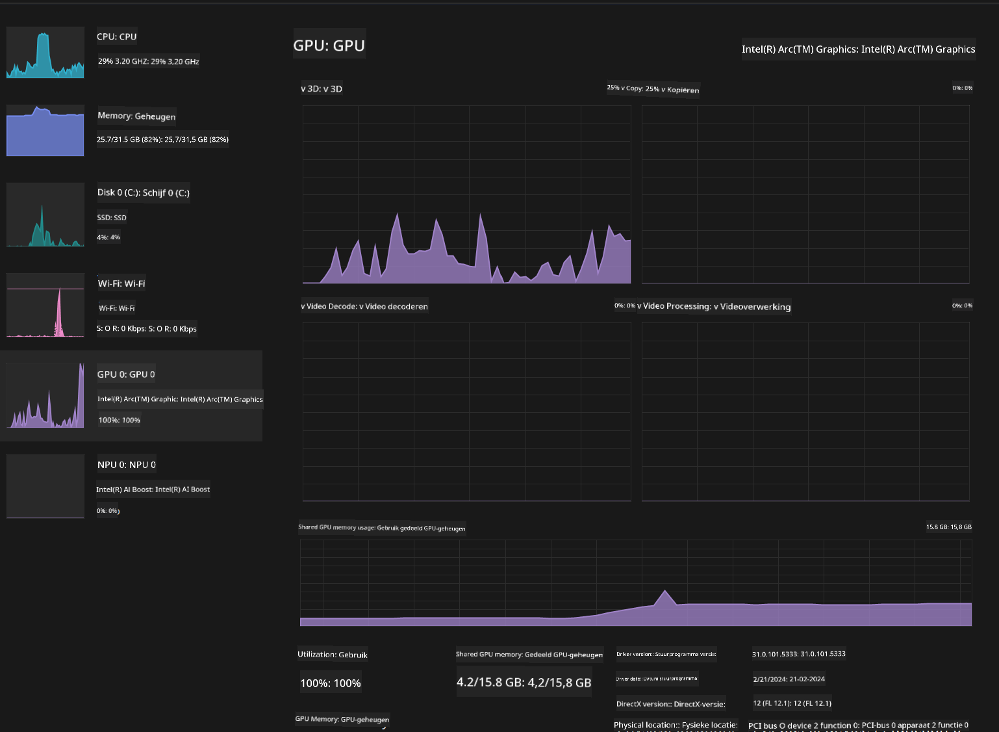

<!--
CO_OP_TRANSLATOR_METADATA:
{
  "original_hash": "e08ce816e23ad813244a09ca34ebb8ac",
  "translation_date": "2025-05-09T10:24:59+00:00",
  "source_file": "md/01.Introduction/03/AIPC_Inference.md",
  "language_code": "nl"
}
-->
# **Inference Phi-3 op AI PC**

Met de vooruitgang van generatieve AI en de verbeterde hardwaremogelijkheden van edge-apparaten, kunnen steeds meer generatieve AI-modellen nu worden geïntegreerd in de Bring Your Own Device (BYOD)-apparaten van gebruikers. AI PC's behoren tot deze modellen. Vanaf 2024 werken Intel, AMD en Qualcomm samen met pc-fabrikanten om AI PC's te introduceren die het inzetten van lokale generatieve AI-modellen mogelijk maken via hardware-aanpassingen. In deze bespreking richten we ons op Intel AI PC's en onderzoeken we hoe Phi-3 kan worden ingezet op een Intel AI PC.

### Wat is een NPU

Een NPU (Neural Processing Unit) is een speciale processor of verwerkingsunit op een grotere SoC, die specifiek is ontworpen om neurale netwerkoperaties en AI-taken te versnellen. In tegenstelling tot algemene CPU's en GPU's zijn NPU's geoptimaliseerd voor data-gedreven parallelle verwerking, waardoor ze zeer efficiënt zijn in het verwerken van enorme multimedia-gegevens zoals video's en afbeeldingen, en het verwerken van data voor neurale netwerken. Ze zijn bijzonder geschikt voor AI-gerelateerde taken, zoals spraakherkenning, achtergrondvervaging tijdens videogesprekken en bewerkingen van foto’s of video’s zoals objectdetectie.

## NPU versus GPU

Hoewel veel AI- en machine learning-taken op GPU's draaien, is er een belangrijk verschil tussen GPU's en NPU's.  
GPU's staan bekend om hun parallelle verwerkingsmogelijkheden, maar niet alle GPU's zijn even efficiënt buiten grafische verwerking. NPU's daarentegen zijn speciaal gebouwd voor complexe berekeningen die betrokken zijn bij neurale netwerkoperaties, waardoor ze zeer effectief zijn voor AI-taken.

Kortom, NPU's zijn de rekenwonders die AI-berekeningen versnellen en spelen een sleutelrol in het opkomende tijdperk van AI PC's!

***Dit voorbeeld is gebaseerd op Intel’s nieuwste Intel Core Ultra Processor***

## **1. Gebruik NPU om het Phi-3 model uit te voeren**

Intel® NPU-apparaat is een AI-inferentieversneller geïntegreerd met Intel client-CPU’s, beginnend bij de Intel® Core™ Ultra generatie CPU’s (voorheen bekend als Meteor Lake). Het maakt energiezuinige uitvoering van kunstmatige neurale netwerktaken mogelijk.




**Intel NPU Acceleration Library**

De Intel NPU Acceleration Library [https://github.com/intel/intel-npu-acceleration-library](https://github.com/intel/intel-npu-acceleration-library) is een Python-bibliotheek die ontworpen is om de efficiëntie van je applicaties te verhogen door gebruik te maken van de kracht van de Intel Neural Processing Unit (NPU) om hoge-snelheidsberekeningen uit te voeren op compatibele hardware.

Voorbeeld van Phi-3-mini op een AI PC aangedreven door Intel® Core™ Ultra processors.


Installeer de Python-bibliotheek met pip

```bash

   pip install intel-npu-acceleration-library

```

***Let op*** Het project is nog in ontwikkeling, maar het referentiemodel is al zeer compleet.

### **Phi-3 draaien met Intel NPU Acceleration Library**

Met Intel NPU-versnelling beïnvloedt deze bibliotheek het traditionele encoderingsproces niet. Je hoeft alleen deze bibliotheek te gebruiken om het originele Phi-3 model te quantiseren, bijvoorbeeld FP16, INT8, INT4, zoals:

```python
from transformers import AutoTokenizer, pipeline,TextStreamer
from intel_npu_acceleration_library import NPUModelForCausalLM, int4
from intel_npu_acceleration_library.compiler import CompilerConfig
import warnings

model_id = "microsoft/Phi-3-mini-4k-instruct"

compiler_conf = CompilerConfig(dtype=int4)
model = NPUModelForCausalLM.from_pretrained(
    model_id, use_cache=True, config=compiler_conf, attn_implementation="sdpa"
).eval()

tokenizer = AutoTokenizer.from_pretrained(model_id)

text_streamer = TextStreamer(tokenizer, skip_prompt=True)
```

Na succesvolle quantisatie, ga je verder met het aanroepen van de NPU om het Phi-3 model uit te voeren.

```python
generation_args = {
   "max_new_tokens": 1024,
   "return_full_text": False,
   "temperature": 0.3,
   "do_sample": False,
   "streamer": text_streamer,
}

pipe = pipeline(
   "text-generation",
   model=model,
   tokenizer=tokenizer,
)

query = "<|system|>You are a helpful AI assistant.<|end|><|user|>Can you introduce yourself?<|end|><|assistant|>"

with warnings.catch_warnings():
    warnings.simplefilter("ignore")
    pipe(query, **generation_args)
```

Tijdens het uitvoeren van de code kunnen we de status van de NPU bekijken via Taakbeheer.



***Voorbeelden*** : [AIPC_NPU_DEMO.ipynb](../../../../../code/03.Inference/AIPC/AIPC_NPU_DEMO.ipynb)

## **2. Gebruik DirectML + ONNX Runtime om het Phi-3 model uit te voeren**

### **Wat is DirectML**

[DirectML](https://github.com/microsoft/DirectML) is een high-performance, hardware-versnelde DirectX 12-bibliotheek voor machine learning. DirectML biedt GPU-versnelling voor veelvoorkomende machine learning-taken op een breed scala aan ondersteunde hardware en drivers, inclusief alle DirectX 12-compatibele GPU's van leveranciers zoals AMD, Intel, NVIDIA en Qualcomm.

Wanneer DirectML standalone wordt gebruikt, is de API een low-level DirectX 12-bibliotheek, geschikt voor high-performance, low-latency applicaties zoals frameworks, games en andere realtime toepassingen. De naadloze interoperabiliteit van DirectML met Direct3D 12, evenals de lage overhead en consistente werking op verschillende hardware, maken DirectML ideaal voor het versnellen van machine learning wanneer zowel hoge prestaties als betrouwbaarheid en voorspelbaarheid van resultaten over hardware heen cruciaal zijn.

***Let op***: De nieuwste DirectML ondersteunt al NPU (https://devblogs.microsoft.com/directx/introducing-neural-processor-unit-npu-support-in-directml-developer-preview/)

### DirectML en CUDA vergeleken op mogelijkheden en prestaties:

**DirectML** is een machine learning-bibliotheek ontwikkeld door Microsoft. Het is ontworpen om machine learning-taken op Windows-apparaten te versnellen, inclusief desktops, laptops en edge-apparaten.  
- DX12-gebaseerd: DirectML is gebouwd bovenop DirectX 12 (DX12), wat brede hardware-ondersteuning biedt voor GPU's, inclusief NVIDIA en AMD.  
- Brede ondersteuning: Doordat het DX12 gebruikt, werkt DirectML met elke GPU die DX12 ondersteunt, zelfs geïntegreerde GPU's.  
- Beeldverwerking: DirectML verwerkt afbeeldingen en andere data met neurale netwerken, geschikt voor taken zoals beeldherkenning, objectdetectie en meer.  
- Eenvoudige installatie: DirectML is makkelijk op te zetten en vereist geen specifieke SDK's of bibliotheken van GPU-fabrikanten.  
- Prestaties: In sommige gevallen presteert DirectML goed en kan het sneller zijn dan CUDA, vooral voor bepaalde workloads.  
- Beperkingen: Er zijn echter situaties waarin DirectML langzamer is, met name bij grote batchgroottes in float16.

**CUDA** is het parallelle rekenplatform en programmeermodel van NVIDIA. Het stelt ontwikkelaars in staat om de kracht van NVIDIA GPU's te benutten voor algemene berekeningen, waaronder machine learning en wetenschappelijke simulaties.  
- NVIDIA-specifiek: CUDA is nauw geïntegreerd met NVIDIA GPU's en speciaal voor hen ontworpen.  
- Zeer geoptimaliseerd: Het levert uitstekende prestaties voor GPU-versnelde taken, vooral met NVIDIA GPU's.  
- Breed gebruikt: Veel machine learning-frameworks en -bibliotheken (zoals TensorFlow en PyTorch) ondersteunen CUDA.  
- Aanpasbaar: Ontwikkelaars kunnen CUDA-instellingen fijn afstemmen voor specifieke taken, wat tot optimale prestaties leidt.  
- Beperkingen: CUDA is afhankelijk van NVIDIA-hardware, wat de compatibiliteit met andere GPU's beperkt.

### Kiezen tussen DirectML en CUDA

De keuze tussen DirectML en CUDA hangt af van je specifieke gebruikssituatie, beschikbare hardware en voorkeuren.  
Als je op zoek bent naar bredere compatibiliteit en eenvoudige installatie, kan DirectML een goede keuze zijn. Heb je echter NVIDIA GPU's en heb je behoefte aan sterk geoptimaliseerde prestaties, dan blijft CUDA een sterke optie. Samengevat hebben zowel DirectML als CUDA hun sterke en zwakke punten, dus overweeg je eisen en beschikbare hardware bij je keuze.

### **Generatieve AI met ONNX Runtime**

In het AI-tijdperk is de draagbaarheid van AI-modellen erg belangrijk. ONNX Runtime maakt het eenvoudig om getrainde modellen op verschillende apparaten te implementeren. Ontwikkelaars hoeven zich niet bezig te houden met het inferentiekader en kunnen via een uniforme API modelinference uitvoeren. In het tijdperk van generatieve AI heeft ONNX Runtime ook codeoptimalisaties doorgevoerd (https://onnxruntime.ai/docs/genai/). Met de geoptimaliseerde ONNX Runtime kan het gequantiseerde generatieve AI-model op verschillende apparaten worden geïnferreerd. Bij Generative AI met ONNX Runtime kun je AI-modelinference uitvoeren via Python, C#, C/C++. Voor implementatie op iPhone kan je gebruikmaken van de C++-interface van Generative AI met ONNX Runtime.

[Voorbeeldcode](https://github.com/Azure-Samples/Phi-3MiniSamples/tree/main/onnx)

***compileer generatieve AI met ONNX Runtime bibliotheek***

```bash

winget install --id=Kitware.CMake  -e

git clone https://github.com/microsoft/onnxruntime.git

cd .\onnxruntime\

./build.bat --build_shared_lib --skip_tests --parallel --use_dml --config Release

cd ../

git clone https://github.com/microsoft/onnxruntime-genai.git

cd .\onnxruntime-genai\

mkdir ort

cd ort

mkdir include

mkdir lib

copy ..\onnxruntime\include\onnxruntime\core\providers\dml\dml_provider_factory.h ort\include

copy ..\onnxruntime\include\onnxruntime\core\session\onnxruntime_c_api.h ort\include

copy ..\onnxruntime\build\Windows\Release\Release\*.dll ort\lib

copy ..\onnxruntime\build\Windows\Release\Release\onnxruntime.lib ort\lib

python build.py --use_dml


```

**Installeer bibliotheek**

```bash

pip install .\onnxruntime_genai_directml-0.3.0.dev0-cp310-cp310-win_amd64.whl

```

Dit is het resultaat van de uitvoering



***Voorbeelden*** : [AIPC_DirectML_DEMO.ipynb](../../../../../code/03.Inference/AIPC/AIPC_DirectML_DEMO.ipynb)

## **3. Gebruik Intel OpenVino om het Phi-3 model uit te voeren**

### **Wat is OpenVINO**

[OpenVINO](https://github.com/openvinotoolkit/openvino) is een open-source toolkit voor het optimaliseren en implementeren van deep learning-modellen. Het biedt verbeterde deep learning-prestaties voor vision-, audio- en taalmodellen van populaire frameworks zoals TensorFlow, PyTorch en meer. Begin met OpenVINO. OpenVINO kan ook in combinatie met CPU en GPU worden gebruikt om het Phi-3 model uit te voeren.

***Let op***: Op dit moment ondersteunt OpenVINO nog geen NPU.

### **OpenVINO-bibliotheek installeren**

```bash

 pip install git+https://github.com/huggingface/optimum-intel.git

 pip install git+https://github.com/openvinotoolkit/nncf.git

 pip install openvino-nightly

```

### **Phi-3 draaien met OpenVINO**

Net als bij NPU voert OpenVINO generatieve AI-modellen uit door gebruik te maken van gequantiseerde modellen. We moeten het Phi-3 model eerst quantiseren en de quantisatie voltooien via de command line met optimum-cli.

**INT4**

```bash

optimum-cli export openvino --model "microsoft/Phi-3-mini-4k-instruct" --task text-generation-with-past --weight-format int4 --group-size 128 --ratio 0.6  --sym  --trust-remote-code ./openvinomodel/phi3/int4

```

**FP16**

```bash

optimum-cli export openvino --model "microsoft/Phi-3-mini-4k-instruct" --task text-generation-with-past --weight-format fp16 --trust-remote-code ./openvinomodel/phi3/fp16

```

Het geconverteerde formaat ziet er zo uit:


Laad modelpaden (model_dir), gerelateerde configuraties (ov_config = {"PERFORMANCE_HINT": "LATENCY", "NUM_STREAMS": "1", "CACHE_DIR": ""}) en hardware-versnelde apparaten (GPU.0) via OVModelForCausalLM

```python

ov_model = OVModelForCausalLM.from_pretrained(
     model_dir,
     device='GPU.0',
     ov_config=ov_config,
     config=AutoConfig.from_pretrained(model_dir, trust_remote_code=True),
     trust_remote_code=True,
)

```

Tijdens het uitvoeren van de code kunnen we de status van de GPU bekijken via Taakbeheer.



***Voorbeelden*** : [AIPC_OpenVino_Demo.ipynb](../../../../../code/03.Inference/AIPC/AIPC_OpenVino_Demo.ipynb)

### ***Let op*** : De drie bovenstaande methoden hebben elk hun eigen voordelen, maar het wordt aanbevolen om NPU-versnelling te gebruiken voor AI PC-inferentie.

**Disclaimer**:  
Dit document is vertaald met behulp van de AI-vertalingsdienst [Co-op Translator](https://github.com/Azure/co-op-translator). Hoewel we streven naar nauwkeurigheid, dient u er rekening mee te houden dat geautomatiseerde vertalingen fouten of onnauwkeurigheden kunnen bevatten. Het oorspronkelijke document in de oorspronkelijke taal moet als de gezaghebbende bron worden beschouwd. Voor cruciale informatie wordt professionele menselijke vertaling aanbevolen. Wij zijn niet aansprakelijk voor eventuele misverstanden of verkeerde interpretaties die voortvloeien uit het gebruik van deze vertaling.