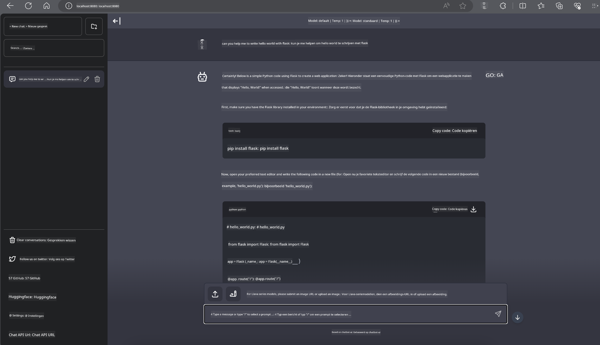

<!--
CO_OP_TRANSLATOR_METADATA:
{
  "original_hash": "be4101a30d98e95a71d42c276e8bcd37",
  "translation_date": "2025-07-16T20:43:32+00:00",
  "source_file": "md/01.Introduction/03/Jetson_Inference.md",
  "language_code": "nl"
}
-->
# **Inference Phi-3 op Nvidia Jetson**

Nvidia Jetson is een serie embedded computing boards van Nvidia. De Jetson TK1, TX1 en TX2 modellen bevatten allemaal een Tegra-processor (of SoC) van Nvidia die een ARM-architectuur centrale verwerkingseenheid (CPU) integreert. Jetson is een energiezuinig systeem en is ontworpen om machine learning-toepassingen te versnellen. Nvidia Jetson wordt gebruikt door professionele ontwikkelaars om baanbrekende AI-producten te creëren in alle sectoren, en door studenten en enthousiastelingen voor praktische AI-ervaring en het maken van indrukwekkende projecten. SLM wordt ingezet in edge-apparaten zoals Jetson, wat een betere implementatie van industriële generatieve AI-toepassingsscenario’s mogelijk maakt.

## Deployment op NVIDIA Jetson:
Ontwikkelaars die werken aan autonome robotica en embedded apparaten kunnen gebruikmaken van Phi-3 Mini. De relatief kleine omvang van Phi-3 maakt het ideaal voor edge-deployment. Parameters zijn zorgvuldig afgestemd tijdens de training, wat zorgt voor hoge nauwkeurigheid in de reacties.

### TensorRT-LLM Optimalisatie:
NVIDIA’s [TensorRT-LLM bibliotheek](https://github.com/NVIDIA/TensorRT-LLM?WT.mc_id=aiml-138114-kinfeylo) optimaliseert inference van grote taalmodellen. Het ondersteunt het lange contextvenster van Phi-3 Mini, wat zowel doorvoer als latency verbetert. Optimalisaties omvatten technieken zoals LongRoPE, FP8 en inflight batching.

### Beschikbaarheid en Deployment:
Ontwikkelaars kunnen Phi-3 Mini met het 128K contextvenster verkennen via [NVIDIA’s AI](https://www.nvidia.com/en-us/ai-data-science/generative-ai/). Het wordt geleverd als een NVIDIA NIM, een microservice met een standaard API die overal kan worden ingezet. Daarnaast zijn er [TensorRT-LLM implementaties op GitHub](https://github.com/NVIDIA/TensorRT-LLM).

## **1. Voorbereiding**

a. Jetson Orin NX / Jetson NX

b. JetPack 5.1.2+

c. Cuda 11.8

d. Python 3.8+

## **2. Phi-3 draaien op Jetson**

We kunnen kiezen voor [Ollama](https://ollama.com) of [LlamaEdge](https://llamaedge.com)

Als je gguf zowel in de cloud als op edge-apparaten tegelijk wilt gebruiken, kan LlamaEdge worden gezien als WasmEdge (WasmEdge is een lichtgewicht, hoogpresterende, schaalbare WebAssembly runtime die geschikt is voor cloud native, edge en gedecentraliseerde applicaties. Het ondersteunt serverless applicaties, embedded functies, microservices, smart contracts en IoT-apparaten). Je kunt het kwantitatieve model van gguf via LlamaEdge naar edge-apparaten en de cloud uitrollen.


Hier zijn de stappen om het te gebruiken

1. Installeer en download de benodigde libraries en bestanden

```bash

curl -sSf https://raw.githubusercontent.com/WasmEdge/WasmEdge/master/utils/install.sh | bash -s -- --plugin wasi_nn-ggml

curl -LO https://github.com/LlamaEdge/LlamaEdge/releases/latest/download/llama-api-server.wasm

curl -LO https://github.com/LlamaEdge/chatbot-ui/releases/latest/download/chatbot-ui.tar.gz

tar xzf chatbot-ui.tar.gz

```

**Opmerking**: llama-api-server.wasm en chatbot-ui moeten in dezelfde map staan

2. Voer scripts uit in de terminal

```bash

wasmedge --dir .:. --nn-preload default:GGML:AUTO:{Your gguf path} llama-api-server.wasm -p phi-3-chat

```

Hier is het resultaat van de uitvoering



***Voorbeeldcode*** [Phi-3 mini WASM Notebook Sample](https://github.com/Azure-Samples/Phi-3MiniSamples/tree/main/wasm)

Samenvattend vertegenwoordigt Phi-3 Mini een grote stap voorwaarts in taalmodellering, waarbij efficiëntie, contextbewustzijn en NVIDIA’s optimalisatiekracht worden gecombineerd. Of je nu robots bouwt of edge-applicaties ontwikkelt, Phi-3 Mini is een krachtig hulpmiddel om te kennen.

**Disclaimer**:  
Dit document is vertaald met behulp van de AI-vertalingsdienst [Co-op Translator](https://github.com/Azure/co-op-translator). Hoewel we streven naar nauwkeurigheid, dient u er rekening mee te houden dat geautomatiseerde vertalingen fouten of onnauwkeurigheden kunnen bevatten. Het originele document in de oorspronkelijke taal moet als de gezaghebbende bron worden beschouwd. Voor cruciale informatie wordt professionele menselijke vertaling aanbevolen. Wij zijn niet aansprakelijk voor eventuele misverstanden of verkeerde interpretaties die voortvloeien uit het gebruik van deze vertaling.