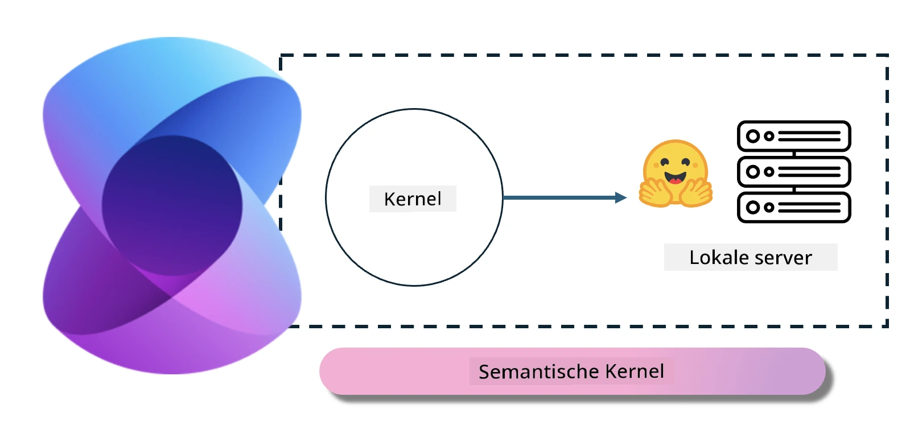
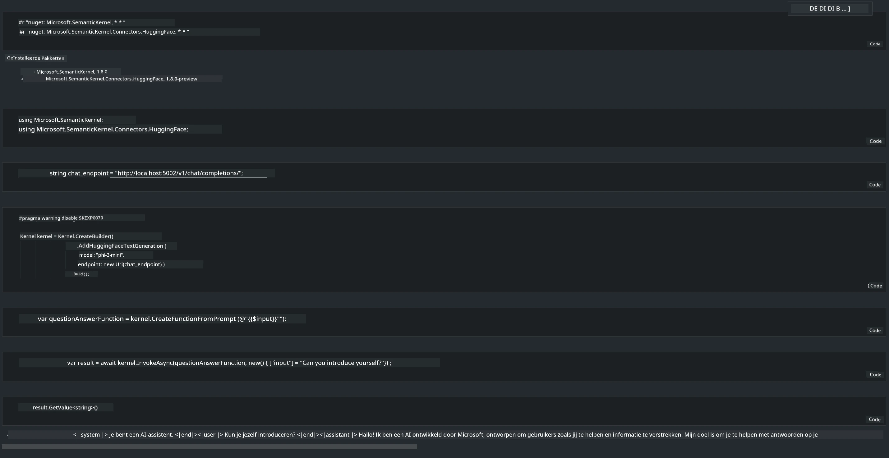

<!--
CO_OP_TRANSLATOR_METADATA:
{
  "original_hash": "bcf5dd7031db0031abdb9dd0c05ba118",
  "translation_date": "2025-07-16T20:58:04+00:00",
  "source_file": "md/01.Introduction/03/Local_Server_Inference.md",
  "language_code": "nl"
}
-->
# **Inference Phi-3 op Lokale Server**

We kunnen Phi-3 implementeren op een lokale server. Gebruikers kunnen kiezen voor [Ollama](https://ollama.com) of [LM Studio](https://llamaedge.com) oplossingen, of ze kunnen hun eigen code schrijven. Je kunt Phi-3’s lokale services verbinden via [Semantic Kernel](https://github.com/microsoft/semantic-kernel?WT.mc_id=aiml-138114-kinfeylo) of [Langchain](https://www.langchain.com/) om Copilot-applicaties te bouwen.

## **Gebruik Semantic Kernel om Phi-3-mini te benaderen**

In de Copilot-applicatie maken we applicaties via Semantic Kernel / LangChain. Dit type applicatiekader is over het algemeen compatibel met Azure OpenAI Service / OpenAI-modellen, en kan ook open source modellen op Hugging Face en lokale modellen ondersteunen. Wat moeten we doen als we Semantic Kernel willen gebruiken om Phi-3-mini te benaderen? Met .NET als voorbeeld kunnen we het combineren met de Hugging Face Connector in Semantic Kernel. Standaard kan het corresponderen met het model-id op Hugging Face (de eerste keer dat je het gebruikt, wordt het model gedownload van Hugging Face, wat enige tijd duurt). Je kunt ook verbinding maken met de lokaal gebouwde service. Vergeleken met de twee raden we het laatste aan omdat het een hogere mate van autonomie biedt, vooral bij bedrijfsapplicaties.

Uit de afbeelding blijkt dat toegang tot lokale services via Semantic Kernel eenvoudig verbinding kan maken met de zelfgebouwde Phi-3-mini modelserver. Hier is het resultaat van de uitvoering:

***Voorbeeldcode*** https://github.com/kinfey/Phi3MiniSamples/tree/main/semantickernel

**Disclaimer**:  
Dit document is vertaald met behulp van de AI-vertalingsdienst [Co-op Translator](https://github.com/Azure/co-op-translator). Hoewel we streven naar nauwkeurigheid, dient u er rekening mee te houden dat geautomatiseerde vertalingen fouten of onnauwkeurigheden kunnen bevatten. Het originele document in de oorspronkelijke taal moet als de gezaghebbende bron worden beschouwd. Voor cruciale informatie wordt professionele menselijke vertaling aanbevolen. Wij zijn niet aansprakelijk voor eventuele misverstanden of verkeerde interpretaties die voortvloeien uit het gebruik van deze vertaling.