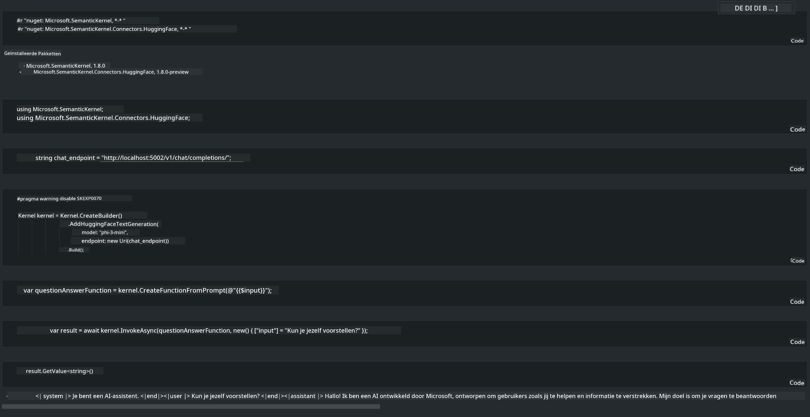

<!--
CO_OP_TRANSLATOR_METADATA:
{
  "original_hash": "bcf5dd7031db0031abdb9dd0c05ba118",
  "translation_date": "2025-05-09T12:06:08+00:00",
  "source_file": "md/01.Introduction/03/Local_Server_Inference.md",
  "language_code": "nl"
}
-->
# **Inference Phi-3 op een lokale server**

We kunnen Phi-3 implementeren op een lokale server. Gebruikers kunnen kiezen voor [Ollama](https://ollama.com) of [LM Studio](https://llamaedge.com) oplossingen, of ze kunnen hun eigen code schrijven. Je kunt Phi-3's lokale services verbinden via [Semantic Kernel](https://github.com/microsoft/semantic-kernel?WT.mc_id=aiml-138114-kinfeylo) of [Langchain](https://www.langchain.com/) om Copilot-toepassingen te bouwen.

## **Gebruik Semantic Kernel om Phi-3-mini te benaderen**

In de Copilot-applicatie maken we toepassingen via Semantic Kernel / LangChain. Dit type applicatiekader is over het algemeen compatibel met Azure OpenAI Service / OpenAI-modellen, en kan ook open source modellen op Hugging Face en lokale modellen ondersteunen. Wat moeten we doen als we Semantic Kernel willen gebruiken om Phi-3-mini te benaderen? Als voorbeeld met .NET kunnen we het combineren met de Hugging Face Connector in Semantic Kernel. Standaard kan het corresponderen met de model-id op Hugging Face (de eerste keer dat je het gebruikt, wordt het model van Hugging Face gedownload, wat enige tijd kan duren). Je kunt ook verbinding maken met de lokaal gebouwde service. Vergeleken met beide raden we de laatste aan omdat het een hogere mate van autonomie biedt, vooral in bedrijfsapplicaties.

Uit de afbeelding blijkt dat het benaderen van lokale services via Semantic Kernel eenvoudig verbinding kan maken met de zelfgebouwde Phi-3-mini modelserver. Hier is het resultaat van de uitvoering:

***Voorbeeldcode*** https://github.com/kinfey/Phi3MiniSamples/tree/main/semantickernel

**Disclaimer**:  
Dit document is vertaald met behulp van de AI-vertalingsdienst [Co-op Translator](https://github.com/Azure/co-op-translator). Hoewel we streven naar nauwkeurigheid, dient u er rekening mee te houden dat geautomatiseerde vertalingen fouten of onnauwkeurigheden kunnen bevatten. Het oorspronkelijke document in de oorspronkelijke taal moet worden beschouwd als de gezaghebbende bron. Voor belangrijke informatie wordt professionele menselijke vertaling aanbevolen. Wij zijn niet aansprakelijk voor eventuele misverstanden of verkeerde interpretaties die voortvloeien uit het gebruik van deze vertaling.