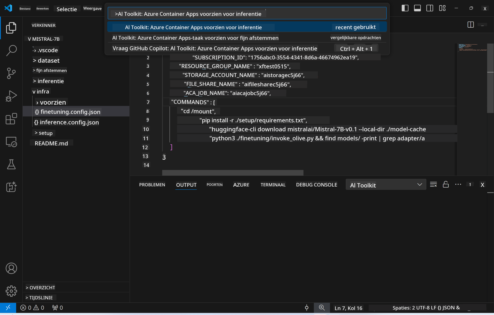
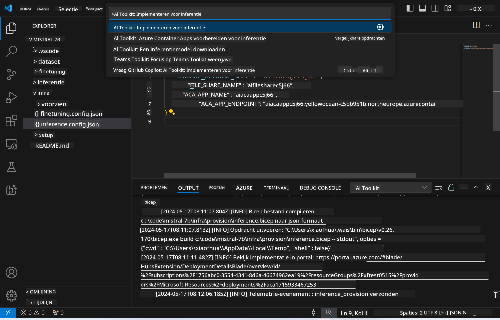

<!--
CO_OP_TRANSLATOR_METADATA:
{
  "original_hash": "a54cd3d65b6963e4e8ce21e143c3ab04",
  "translation_date": "2025-05-09T12:42:29+00:00",
  "source_file": "md/01.Introduction/03/Remote_Interence.md",
  "language_code": "nl"
}
-->
# Remote inferentie met het fijn-afgestelde model

Nadat de adapters zijn getraind in de remote omgeving, gebruik je een eenvoudige Gradio-applicatie om met het model te communiceren.


### Azure Resources provisionen  
Je moet de Azure Resources voor remote inferentie instellen door het uitvoeren van de `AI Toolkit: Provision Azure Container Apps for inference` vanuit het commandopalet. Tijdens deze setup wordt je gevraagd om je Azure Subscription en resourcegroep te selecteren.  


Standaard zouden de subscription en resourcegroep voor inferentie overeen moeten komen met die gebruikt voor het fijn-afstellen. De inferentie maakt gebruik van dezelfde Azure Container App Environment en heeft toegang tot het model en de modeladapter die zijn opgeslagen in Azure Files, welke gegenereerd zijn tijdens de fijn-afstap.

## Gebruik van AI Toolkit

### Deployment voor inferentie  
Als je de inferentiecode wilt aanpassen of het inferentiemodel opnieuw wilt laden, voer dan het `AI Toolkit: Deploy for inference` commando uit. Dit synchroniseert je nieuwste code met ACA en herstart de replica.



Na een succesvolle deployment is het model klaar voor evaluatie via deze endpoint.

### Toegang tot de Inference API

Je kunt de inference API bereiken door te klikken op de knop "*Go to Inference Endpoint*" die in de VSCode notificatie verschijnt. Alternatief is de web API endpoint te vinden onder `ACA_APP_ENDPOINT` in `./infra/inference.config.json` en in het outputpaneel.


> **Note:** Het kan enkele minuten duren voordat de inference endpoint volledig operationeel is.

## Inferentiecomponenten inbegrepen in de template

| Map | Inhoud |
| ------ |--------- |
| `infra` | Bevat alle benodigde configuraties voor remote operaties. |
| `infra/provision/inference.parameters.json` | Bevat parameters voor de bicep-templates, gebruikt voor het provisionen van Azure resources voor inferentie. |
| `infra/provision/inference.bicep` | Bevat templates voor het provisionen van Azure resources voor inferentie. |
| `infra/inference.config.json` | Het configuratiebestand, gegenereerd door het `AI Toolkit: Provision Azure Container Apps for inference` commando. Wordt gebruikt als input voor andere remote commandopaletten. |

### AI Toolkit gebruiken voor het configureren van Azure Resource Provision  
Configureer de [AI Toolkit](https://marketplace.visualstudio.com/items?itemName=ms-windows-ai-studio.windows-ai-studio)

Provision Azure Container Apps voor inferentie ` command.

You can find configuration parameters in `./infra/provision/inference.parameters.json` file. Here are the details:
| Parameter | Description |
| --------- |------------ |
| `defaultCommands` | This is the commands to initiate a web API. |
| `maximumInstanceCount` | This parameter sets the maximum capacity of GPU instances. |
| `location` | This is the location where Azure resources are provisioned. The default value is the same as the chosen resource group's location. |
| `storageAccountName`, `fileShareName` `acaEnvironmentName`, `acaEnvironmentStorageName`, `acaAppName`,  `acaLogAnalyticsName` | These parameters are used to name the Azure resources for provision. By default, they will be same to the fine-tuning resource name. You can input a new, unused resource name to create your own custom-named resources, or you can input the name of an already existing Azure resource if you'd prefer to use that. For details, refer to the section [Using existing Azure Resources](../../../../../md/01.Introduction/03). |

### Using Existing Azure Resources

By default, the inference provision use the same Azure Container App Environment, Storage Account, Azure File Share, and Azure Log Analytics that were used for fine-tuning. A separate Azure Container App is created solely for the inference API. 

If you have customized the Azure resources during the fine-tuning step or want to use your own existing Azure resources for inference, specify their names in the `./infra/inference.parameters.json` bestand. Voer daarna het `AI Toolkit: Provision Azure Container Apps for inference` commando uit vanuit het commandopalet. Dit werkt opgegeven resources bij en maakt eventueel ontbrekende aan.

Bijvoorbeeld, als je een bestaande Azure containeromgeving hebt, zou je `./infra/finetuning.parameters.json` er als volgt uit kunnen zien:

```json
{
    "$schema": "https://schema.management.azure.com/schemas/2019-04-01/deploymentParameters.json#",
    "contentVersion": "1.0.0.0",
    "parameters": {
      ...
      "acaEnvironmentName": {
        "value": "<your-aca-env-name>"
      },
      "acaEnvironmentStorageName": {
        "value": null
      },
      ...
    }
  }
```

### Handmatig provisionen  
Als je liever handmatig de Azure resources configureert, kun je de meegeleverde bicep-bestanden gebruiken in de `./infra/provision` folders. If you have already set up and configured all the Azure resources without using the AI Toolkit command palette, you can simply enter the resource names in the `inference.config.json` file.

Bijvoorbeeld:

```json
{
  "SUBSCRIPTION_ID": "<your-subscription-id>",
  "RESOURCE_GROUP_NAME": "<your-resource-group-name>",
  "STORAGE_ACCOUNT_NAME": "<your-storage-account-name>",
  "FILE_SHARE_NAME": "<your-file-share-name>",
  "ACA_APP_NAME": "<your-aca-name>",
  "ACA_APP_ENDPOINT": "<your-aca-endpoint>"
}
```

**Disclaimer**:  
Dit document is vertaald met behulp van de AI-vertalingsdienst [Co-op Translator](https://github.com/Azure/co-op-translator). Hoewel we streven naar nauwkeurigheid, dient u er rekening mee te houden dat automatische vertalingen fouten of onnauwkeurigheden kunnen bevatten. Het originele document in de oorspronkelijke taal moet worden beschouwd als de gezaghebbende bron. Voor cruciale informatie wordt professionele menselijke vertaling aanbevolen. Wij zijn niet aansprakelijk voor eventuele misverstanden of verkeerde interpretaties die voortvloeien uit het gebruik van deze vertaling.