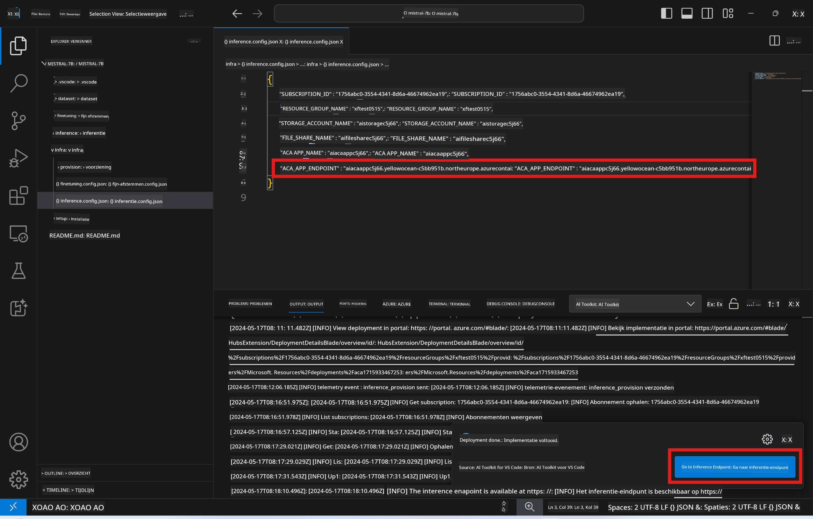

<!--
CO_OP_TRANSLATOR_METADATA:
{
  "original_hash": "a54cd3d65b6963e4e8ce21e143c3ab04",
  "translation_date": "2025-07-16T21:20:16+00:00",
  "source_file": "md/01.Introduction/03/Remote_Interence.md",
  "language_code": "nl"
}
-->
# Remote inferentie met het fijn-afgestelde model

Nadat de adapters zijn getraind in de remote omgeving, gebruik je een eenvoudige Gradio-applicatie om met het model te communiceren.


### Azure-resources provisionen  
Je moet de Azure-resources voor remote inferentie instellen door de opdracht `AI Toolkit: Provision Azure Container Apps for inference` uit te voeren vanuit de commandopalet. Tijdens deze setup wordt je gevraagd je Azure-abonnement en resourcegroep te selecteren.  


Standaard zouden het abonnement en de resourcegroep voor inferentie overeen moeten komen met die gebruikt voor het fijn-afstellen. De inferentie maakt gebruik van dezelfde Azure Container App Environment en krijgt toegang tot het model en de modeladapter die zijn opgeslagen in Azure Files, welke zijn gegenereerd tijdens de fijn-afstap.

## AI Toolkit gebruiken

### Deployment voor inferentie  
Als je de inferentiecode wilt aanpassen of het inferentiemodel opnieuw wilt laden, voer dan de opdracht `AI Toolkit: Deploy for inference` uit. Dit synchroniseert je nieuwste code met ACA en herstart de replica.


Na een succesvolle deployment is het model klaar voor evaluatie via deze endpoint.

### Toegang tot de Inference API

Je kunt de inference API openen door te klikken op de knop "*Go to Inference Endpoint*" die wordt weergegeven in de VSCode-notificatie. Alternatief is de web API endpoint te vinden onder `ACA_APP_ENDPOINT` in `./infra/inference.config.json` en in het outputpaneel.



> **Note:** Het kan enkele minuten duren voordat de inference endpoint volledig operationeel is.

## Inferentiecomponenten in de template

| Map | Inhoud |
| ------ |--------- |
| `infra` | Bevat alle benodigde configuraties voor remote operaties. |
| `infra/provision/inference.parameters.json` | Bevat parameters voor de bicep-templates, gebruikt voor het provisionen van Azure-resources voor inferentie. |
| `infra/provision/inference.bicep` | Bevat templates voor het provisionen van Azure-resources voor inferentie. |
| `infra/inference.config.json` | Het configuratiebestand, gegenereerd door de opdracht `AI Toolkit: Provision Azure Container Apps for inference`. Wordt gebruikt als input voor andere remote commandopalet-opdrachten. |

### AI Toolkit gebruiken voor het configureren van Azure Resource Provision  
Configureer de [AI Toolkit](https://marketplace.visualstudio.com/items?itemName=ms-windows-ai-studio.windows-ai-studio)

Voer de opdracht `Provision Azure Container Apps for inference` uit.

Je vindt configuratieparameters in het bestand `./infra/provision/inference.parameters.json`. Hier de details:  
| Parameter | Beschrijving |
| --------- |------------ |
| `defaultCommands` | Dit zijn de commando’s om een web API te starten. |
| `maximumInstanceCount` | Deze parameter stelt de maximale capaciteit van GPU-instanties in. |
| `location` | Dit is de locatie waar Azure-resources worden provisioned. De standaardwaarde is dezelfde als de locatie van de gekozen resourcegroep. |
| `storageAccountName`, `fileShareName`, `acaEnvironmentName`, `acaEnvironmentStorageName`, `acaAppName`, `acaLogAnalyticsName` | Deze parameters worden gebruikt om de Azure-resources te benoemen voor provisioning. Standaard zijn ze gelijk aan de naam van de resources voor fijn-afstellen. Je kunt een nieuwe, ongebruikte resource-naam invoeren om je eigen custom-named resources te maken, of je kunt de naam van een bestaande Azure-resource invoeren als je die wilt gebruiken. Zie de sectie [Using existing Azure Resources](../../../../../md/01.Introduction/03) voor details. |

### Bestaande Azure-resources gebruiken

Standaard gebruikt de inferentie-provision dezelfde Azure Container App Environment, Storage Account, Azure File Share en Azure Log Analytics die ook voor het fijn-afstellen zijn gebruikt. Er wordt een aparte Azure Container App aangemaakt die alleen voor de inference API is bedoeld.

Als je de Azure-resources hebt aangepast tijdens het fijn-afstellen of je eigen bestaande Azure-resources wilt gebruiken voor inferentie, geef dan hun namen op in het bestand `./infra/inference.parameters.json`. Voer daarna de opdracht `AI Toolkit: Provision Azure Container Apps for inference` uit vanuit de commandopalet. Dit werkt de opgegeven resources bij en maakt eventuele ontbrekende aan.

Bijvoorbeeld, als je een bestaande Azure containeromgeving hebt, zou je `./infra/finetuning.parameters.json` er zo uit kunnen zien:

```json
{
    "$schema": "https://schema.management.azure.com/schemas/2019-04-01/deploymentParameters.json#",
    "contentVersion": "1.0.0.0",
    "parameters": {
      ...
      "acaEnvironmentName": {
        "value": "<your-aca-env-name>"
      },
      "acaEnvironmentStorageName": {
        "value": null
      },
      ...
    }
  }
```

### Handmatige provisioning  
Als je de Azure-resources liever handmatig configureert, kun je de meegeleverde bicep-bestanden in de map `./infra/provision` gebruiken. Als je alle Azure-resources al hebt opgezet en geconfigureerd zonder de AI Toolkit commandopalet te gebruiken, kun je simpelweg de resource-namen invoeren in het bestand `inference.config.json`.

Bijvoorbeeld:

```json
{
  "SUBSCRIPTION_ID": "<your-subscription-id>",
  "RESOURCE_GROUP_NAME": "<your-resource-group-name>",
  "STORAGE_ACCOUNT_NAME": "<your-storage-account-name>",
  "FILE_SHARE_NAME": "<your-file-share-name>",
  "ACA_APP_NAME": "<your-aca-name>",
  "ACA_APP_ENDPOINT": "<your-aca-endpoint>"
}
```

**Disclaimer**:  
Dit document is vertaald met behulp van de AI-vertalingsdienst [Co-op Translator](https://github.com/Azure/co-op-translator). Hoewel we streven naar nauwkeurigheid, dient u er rekening mee te houden dat geautomatiseerde vertalingen fouten of onnauwkeurigheden kunnen bevatten. Het originele document in de oorspronkelijke taal moet als de gezaghebbende bron worden beschouwd. Voor cruciale informatie wordt professionele menselijke vertaling aanbevolen. Wij zijn niet aansprakelijk voor eventuele misverstanden of verkeerde interpretaties die voortvloeien uit het gebruik van deze vertaling.