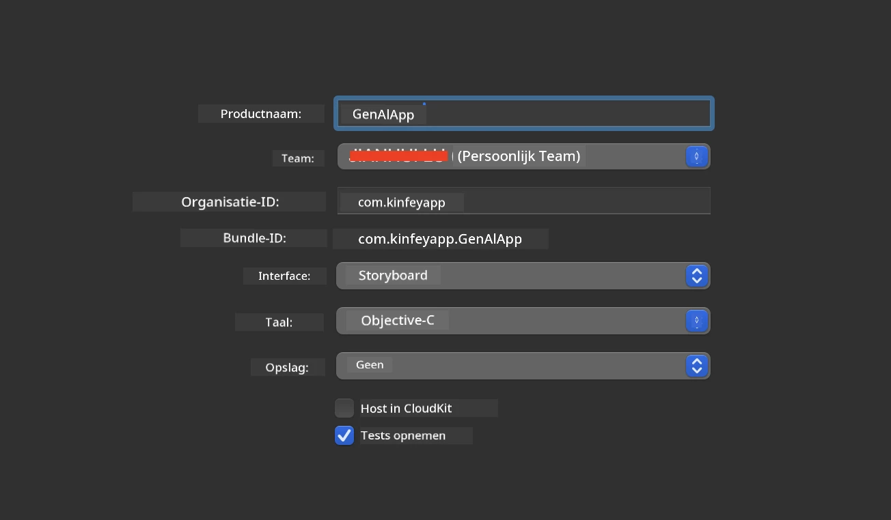
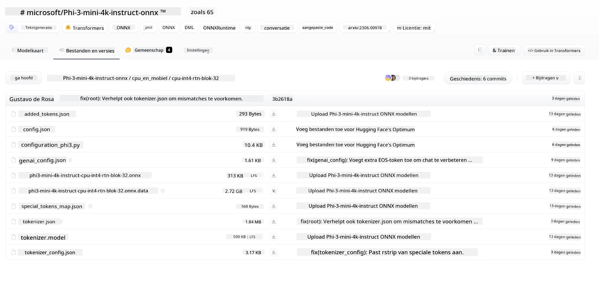
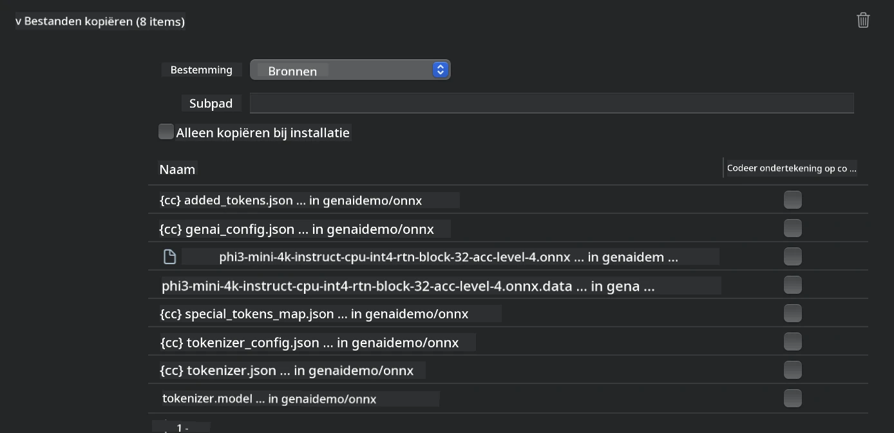
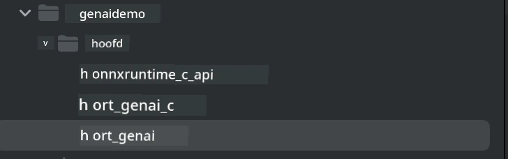
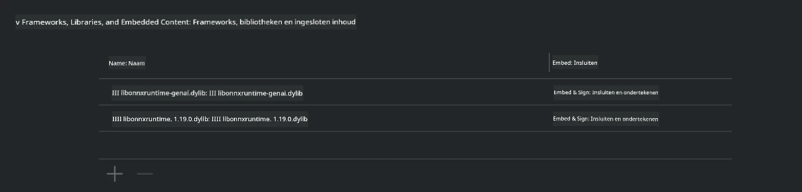
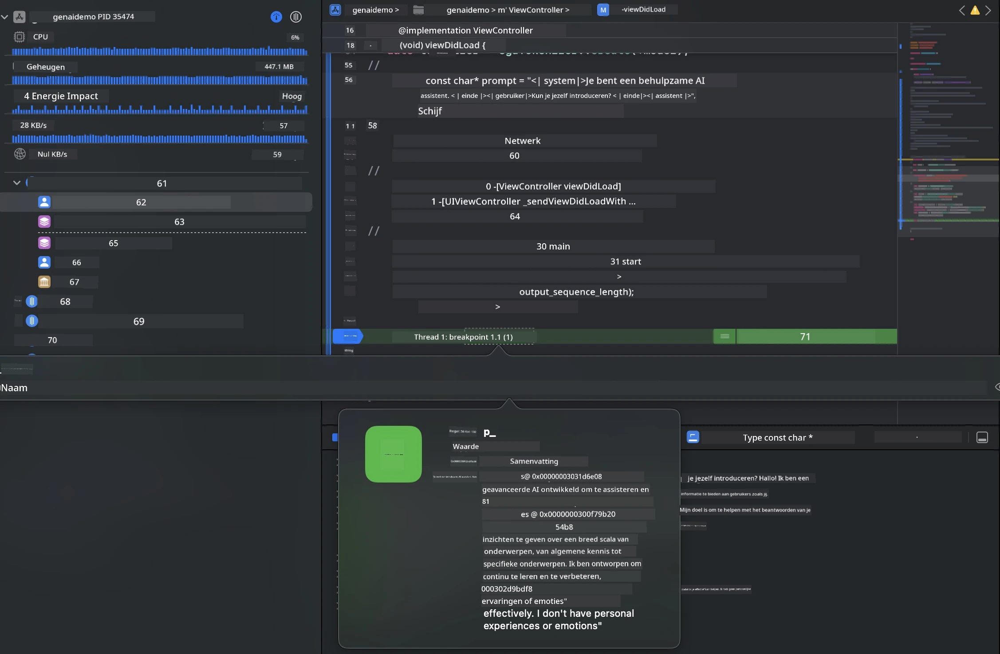

# **Inference Phi-3 op iOS**

Phi-3-mini is een nieuwe modelserie van Microsoft die het mogelijk maakt om Large Language Models (LLM's) te implementeren op edge-apparaten en IoT-apparaten. Phi-3-mini is beschikbaar voor iOS, Android en Edge Device-implementaties, waardoor generatieve AI ingezet kan worden in BYOD-omgevingen. Het volgende voorbeeld laat zien hoe je Phi-3-mini op iOS kunt implementeren.

## **1. Voorbereiding**

- **a.** macOS 14+
- **b.** Xcode 15+
- **c.** iOS SDK 17.x (iPhone 14 A16 of hoger)
- **d.** Installeer Python 3.10+ (Conda wordt aanbevolen)
- **e.** Installeer de Python-bibliotheek: `python-flatbuffers`
- **f.** Installeer CMake

### Semantic Kernel en Inference

Semantic Kernel is een applicatiekader waarmee je applicaties kunt maken die compatibel zijn met Azure OpenAI Service, OpenAI-modellen en zelfs lokale modellen. Toegang tot lokale services via Semantic Kernel maakt eenvoudige integratie mogelijk met je zelfgehoste Phi-3-mini modelserver.

### Aanroepen van Gequantiseerde Modellen met Ollama of LlamaEdge

Veel gebruikers geven de voorkeur aan het gebruik van gequantiseerde modellen om modellen lokaal te draaien. [Ollama](https://ollama.com) en [LlamaEdge](https://llamaedge.com) stellen gebruikers in staat om verschillende gequantiseerde modellen aan te roepen:

#### **Ollama**

Je kunt `ollama run phi3` direct uitvoeren of het offline configureren. Maak een Modelfile aan met het pad naar je `gguf`-bestand. Voorbeeldcode voor het draaien van het Phi-3-mini gequantiseerde model:

```gguf
FROM {Add your gguf file path}
TEMPLATE \"\"\"<|user|> .Prompt<|end|> <|assistant|>\"\"\"
PARAMETER stop <|end|>
PARAMETER num_ctx 4096
```

#### **LlamaEdge**

Als je `gguf` zowel in de cloud als op edge-apparaten tegelijk wilt gebruiken, is LlamaEdge een uitstekende optie.

## **2. ONNX Runtime compileren voor iOS**

```bash

git clone https://github.com/microsoft/onnxruntime.git

cd onnxruntime

./build.sh --build_shared_lib --ios --skip_tests --parallel --build_dir ./build_ios --ios --apple_sysroot iphoneos --osx_arch arm64 --apple_deploy_target 17.5 --cmake_generator Xcode --config Release

cd ../

```

### **Opmerking**

- **a.** Zorg ervoor dat Xcode correct is geconfigureerd en stel het in als de actieve ontwikkelaarsdirectory in de terminal voordat je gaat compileren:

    ```bash
    sudo xcode-select -switch /Applications/Xcode.app/Contents/Developer
    ```

- **b.** ONNX Runtime moet voor verschillende platformen worden gecompileerd. Voor iOS kun je compileren voor `arm64` of `x86_64`.

- **c.** Het wordt aanbevolen om de nieuwste iOS SDK te gebruiken voor compilatie. Je kunt echter ook een oudere versie gebruiken als je compatibiliteit met eerdere SDK's nodig hebt.

## **3. Generative AI compileren met ONNX Runtime voor iOS**

> **Note:** Omdat Generative AI met ONNX Runtime zich in preview bevindt, houd rekening met mogelijke wijzigingen.

```bash

git clone https://github.com/microsoft/onnxruntime-genai
 
cd onnxruntime-genai
 
mkdir ort
 
cd ort
 
mkdir include
 
mkdir lib
 
cd ../
 
cp ../onnxruntime/include/onnxruntime/core/session/onnxruntime_c_api.h ort/include
 
cp ../onnxruntime/build_ios/Release/Release-iphoneos/libonnxruntime*.dylib* ort/lib
 
export OPENCV_SKIP_XCODEBUILD_FORCE_TRYCOMPILE_DEBUG=1
 
python3 build.py --parallel --build_dir ./build_ios --ios --ios_sysroot iphoneos --ios_arch arm64 --ios_deployment_target 17.5 --cmake_generator Xcode --cmake_extra_defines CMAKE_XCODE_ATTRIBUTE_CODE_SIGNING_ALLOWED=NO

```

## **4. Maak een App-applicatie in Xcode**

Ik heb gekozen voor Objective-C als ontwikkelmethode voor de app, omdat Objective-C beter compatibel is met het gebruik van Generative AI via de ONNX Runtime C++ API. Natuurlijk kun je ook gerelateerde aanroepen via Swift bridging uitvoeren.



## **5. Kopieer het ONNX gequantiseerde INT4-model naar het App-project**

We moeten het INT4-quantisatiemodel in ONNX-formaat importeren, dat eerst gedownload moet worden.



Na het downloaden moet je het toevoegen aan de Resources-map van het project in Xcode.



## **6. Toevoegen van de C++ API in ViewControllers**

> **Opmerking:**

- **a.** Voeg de bijbehorende C++ headerbestanden toe aan het project.

  

- **b.** Voeg de `onnxruntime-genai` dynamische bibliotheek toe in Xcode.

  

- **c.** Gebruik de C Samples code voor testen. Je kunt ook extra functionaliteiten toevoegen zoals ChatUI voor meer mogelijkheden.

- **d.** Omdat je C++ in je project moet gebruiken, hernoem `ViewController.m` naar `ViewController.mm` om Objective-C++ ondersteuning in te schakelen.

```objc

    NSString *llmPath = [[NSBundle mainBundle] resourcePath];
    char const *modelPath = llmPath.cString;

    auto model =  OgaModel::Create(modelPath);

    auto tokenizer = OgaTokenizer::Create(*model);

    const char* prompt = "<|system|>You are a helpful AI assistant.<|end|><|user|>Can you introduce yourself?<|end|><|assistant|>";

    auto sequences = OgaSequences::Create();
    tokenizer->Encode(prompt, *sequences);

    auto params = OgaGeneratorParams::Create(*model);
    params->SetSearchOption("max_length", 100);
    params->SetInputSequences(*sequences);

    auto output_sequences = model->Generate(*params);
    const auto output_sequence_length = output_sequences->SequenceCount(0);
    const auto* output_sequence_data = output_sequences->SequenceData(0);
    auto out_string = tokenizer->Decode(output_sequence_data, output_sequence_length);
    
    auto tmp = out_string;

```

## **7. De applicatie uitvoeren**

Zodra de setup voltooid is, kun je de applicatie uitvoeren om de resultaten van de Phi-3-mini modelinference te zien.



Voor meer voorbeeldcode en gedetailleerde instructies, bezoek de [Phi-3 Mini Samples repository](https://github.com/Azure-Samples/Phi-3MiniSamples/tree/main/ios).

**Disclaimer**:  
Dit document is vertaald met behulp van de AI-vertalingsdienst [Co-op Translator](https://github.com/Azure/co-op-translator). Hoewel we streven naar nauwkeurigheid, dient u er rekening mee te houden dat geautomatiseerde vertalingen fouten of onnauwkeurigheden kunnen bevatten. Het originele document in de oorspronkelijke taal moet als de gezaghebbende bron worden beschouwd. Voor cruciale informatie wordt professionele menselijke vertaling aanbevolen. Wij zijn niet aansprakelijk voor eventuele misverstanden of verkeerde interpretaties die voortvloeien uit het gebruik van deze vertaling.