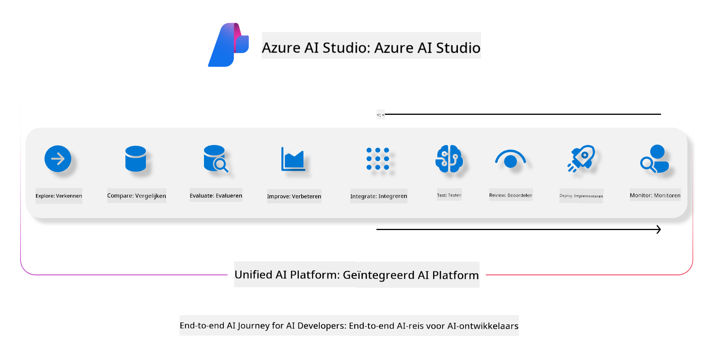
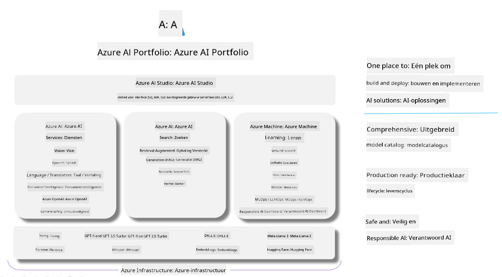

<!--
CO_OP_TRANSLATOR_METADATA:
{
  "original_hash": "7b4235159486df4000e16b7b46ddfec3",
  "translation_date": "2025-05-09T15:00:14+00:00",
  "source_file": "md/01.Introduction/05/AIFoundry.md",
  "language_code": "nl"
}
-->
# **Gebruik van Azure AI Foundry voor evaluatie**

Hoe je je generatieve AI-applicatie kunt evalueren met [Azure AI Foundry](https://ai.azure.com?WT.mc_id=aiml-138114-kinfeylo). Of je nu enkele- of meervoudige gespreksrondes beoordeelt, Azure AI Foundry biedt tools om de prestaties en veiligheid van modellen te evalueren.

## Hoe generatieve AI-apps te evalueren met Azure AI Foundry
Voor meer gedetailleerde instructies, zie de [Azure AI Foundry Documentatie](https://learn.microsoft.com/azure/ai-studio/how-to/evaluate-generative-ai-app?WT.mc_id=aiml-138114-kinfeylo)

Hier zijn de stappen om aan de slag te gaan:

## Evalueren van Generatieve AI-modellen in Azure AI Foundry

**Vereisten**

- Een testdataset in CSV- of JSON-formaat.
- Een gedeployed generatief AI-model (zoals Phi-3, GPT 3.5, GPT 4, of Davinci-modellen).
- Een runtime met een compute instance om de evaluatie uit te voeren.

## Ingebouwde evaluatiemaatstaven

Azure AI Foundry maakt het mogelijk om zowel enkele als complexe, meervoudige gespreksrondes te evalueren.
Voor Retrieval Augmented Generation (RAG)-scenario’s, waarbij het model gebaseerd is op specifieke data, kun je prestaties beoordelen met ingebouwde evaluatiemaatstaven.
Daarnaast kun je ook algemene enkele vraag-en-antwoord scenario’s (niet-RAG) evalueren.

## Aanmaken van een evaluatieronde

Ga in de Azure AI Foundry UI naar de pagina Evaluate of de pagina Prompt Flow.
Volg de wizard voor het aanmaken van een evaluatie om een evaluatieronde op te zetten. Geef desgewenst een naam op voor je evaluatie.
Kies het scenario dat aansluit bij de doelstellingen van je applicatie.
Selecteer een of meer evaluatiemaatstaven om de output van het model te beoordelen.

## Aangepaste evaluatiestroom (optioneel)

Voor meer flexibiliteit kun je een aangepaste evaluatiestroom opzetten. Pas het evaluatieproces aan op basis van je specifieke wensen.

## Resultaten bekijken

Na het uitvoeren van de evaluatie kun je in Azure AI Foundry gedetailleerde evaluatiemaatstaven loggen, bekijken en analyseren. Krijg inzicht in de mogelijkheden en beperkingen van je applicatie.

**Note** Azure AI Foundry bevindt zich momenteel in publieke preview, dus gebruik het vooral voor experimenten en ontwikkeling. Voor productieomgevingen kun je beter andere opties overwegen. Bekijk de officiële [AI Foundry documentatie](https://learn.microsoft.com/azure/ai-studio/?WT.mc_id=aiml-138114-kinfeylo) voor meer informatie en stapsgewijze instructies.

**Disclaimer**:  
Dit document is vertaald met behulp van de AI-vertalingsdienst [Co-op Translator](https://github.com/Azure/co-op-translator). Hoewel we streven naar nauwkeurigheid, dient u er rekening mee te houden dat geautomatiseerde vertalingen fouten of onnauwkeurigheden kunnen bevatten. Het originele document in de oorspronkelijke taal geldt als de gezaghebbende bron. Voor cruciale informatie wordt professionele menselijke vertaling aanbevolen. Wij zijn niet aansprakelijk voor misverstanden of verkeerde interpretaties die voortvloeien uit het gebruik van deze vertaling.