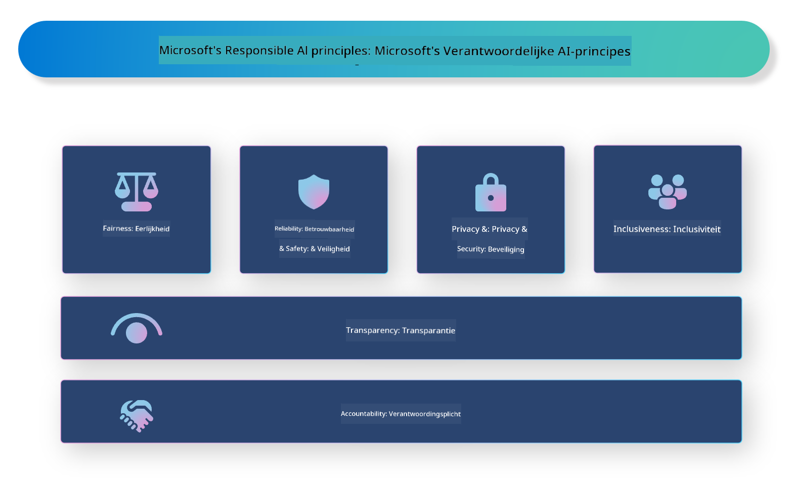

<!--
CO_OP_TRANSLATOR_METADATA:
{
  "original_hash": "805b96b20152936d8f4c587d90d6e06e",
  "translation_date": "2025-07-16T22:54:59+00:00",
  "source_file": "md/01.Introduction/05/ResponsibleAI.md",
  "language_code": "nl"
}
-->
# **Introductie van Responsible AI**

[Microsoft Responsible AI](https://www.microsoft.com/ai/responsible-ai?WT.mc_id=aiml-138114-kinfeylo) is een initiatief dat ontwikkelaars en organisaties helpt bij het bouwen van AI-systemen die transparant, betrouwbaar en verantwoordelijk zijn. Het initiatief biedt richtlijnen en hulpmiddelen voor het ontwikkelen van verantwoorde AI-oplossingen die aansluiten bij ethische principes, zoals privacy, eerlijkheid en transparantie. We zullen ook enkele uitdagingen en best practices bespreken die horen bij het bouwen van verantwoorde AI-systemen.

## Overzicht van Microsoft Responsible AI

**Ethische principes**

Microsoft Responsible AI wordt geleid door een reeks ethische principes, zoals privacy, eerlijkheid, transparantie, verantwoordelijkheid en veiligheid. Deze principes zijn bedoeld om ervoor te zorgen dat AI-systemen op een ethische en verantwoorde manier worden ontwikkeld.

**Transparante AI**

Microsoft Responsible AI benadrukt het belang van transparantie in AI-systemen. Dit omvat het geven van duidelijke uitleg over hoe AI-modellen werken, evenals het zorgen dat databronnen en algoritmes openbaar beschikbaar zijn.

**Verantwoorde AI**

[Microsoft Responsible AI](https://www.microsoft.com/ai/responsible-ai?WT.mc_id=aiml-138114-kinfeylo) stimuleert de ontwikkeling van verantwoorde AI-systemen die inzicht kunnen geven in hoe AI-modellen beslissingen nemen. Dit helpt gebruikers om de uitkomsten van AI-systemen te begrijpen en erop te vertrouwen.

**Inclusiviteit**

AI-systemen moeten zo ontworpen zijn dat ze iedereen ten goede komen. Microsoft streeft naar inclusieve AI die diverse perspectieven meeneemt en vooroordelen of discriminatie voorkomt.

**Betrouwbaarheid en veiligheid**

Het waarborgen dat AI-systemen betrouwbaar en veilig zijn, is cruciaal. Microsoft richt zich op het bouwen van robuuste modellen die consistent presteren en schadelijke gevolgen vermijden.

**Eerlijkheid in AI**

Microsoft Responsible AI erkent dat AI-systemen vooroordelen kunnen versterken als ze getraind worden met bevooroordeelde data of algoritmes. Het initiatief biedt richtlijnen voor het ontwikkelen van eerlijke AI-systemen die niet discrimineren op basis van factoren zoals ras, geslacht of leeftijd.

**Privacy en beveiliging**

Microsoft Responsible AI benadrukt het belang van het beschermen van gebruikersprivacy en databeveiliging in AI-systemen. Dit omvat het implementeren van sterke data-encryptie en toegangscontroles, evenals het regelmatig auditen van AI-systemen op kwetsbaarheden.

**Verantwoordingsplicht en verantwoordelijkheid**

Microsoft Responsible AI bevordert verantwoordelijkheid en aansprakelijkheid bij de ontwikkeling en inzet van AI. Dit betekent dat ontwikkelaars en organisaties zich bewust moeten zijn van de mogelijke risico’s van AI-systemen en stappen moeten ondernemen om deze risico’s te beperken.

## Best practices voor het bouwen van verantwoorde AI-systemen

**Ontwikkel AI-modellen met diverse datasets**

Om vooringenomenheid in AI-systemen te voorkomen, is het belangrijk om diverse datasets te gebruiken die een breed scala aan perspectieven en ervaringen vertegenwoordigen.

**Gebruik uitlegbare AI-technieken**

Uitlegbare AI-technieken helpen gebruikers te begrijpen hoe AI-modellen beslissingen nemen, wat het vertrouwen in het systeem kan vergroten.

**Audit AI-systemen regelmatig op kwetsbaarheden**

Regelmatige audits van AI-systemen helpen potentiële risico’s en kwetsbaarheden te identificeren die aangepakt moeten worden.

**Implementeer sterke data-encryptie en toegangscontroles**

Data-encryptie en toegangscontroles helpen de privacy en veiligheid van gebruikers in AI-systemen te beschermen.

**Volg ethische principes bij AI-ontwikkeling**

Het volgen van ethische principes zoals eerlijkheid, transparantie en verantwoordelijkheid helpt vertrouwen op te bouwen in AI-systemen en zorgt ervoor dat ze op een verantwoorde manier worden ontwikkeld.

## Gebruik van AI Foundry voor Responsible AI

[Azure AI Foundry](https://ai.azure.com?WT.mc_id=aiml-138114-kinfeylo) is een krachtig platform waarmee ontwikkelaars en organisaties snel intelligente, geavanceerde, marktklare en verantwoorde applicaties kunnen maken. Hier zijn enkele belangrijke functies en mogelijkheden van Azure AI Foundry:

**Kant-en-klare API’s en modellen**

Azure AI Foundry biedt vooraf gebouwde en aanpasbare API’s en modellen. Deze bestrijken een breed scala aan AI-taken, waaronder generatieve AI, natuurlijke taalverwerking voor gesprekken, zoeken, monitoring, vertaling, spraak, visie en besluitvorming.

**Prompt Flow**

Prompt flow in Azure AI Foundry stelt je in staat om conversatiegerichte AI-ervaringen te creëren. Je kunt conversatiestromen ontwerpen en beheren, wat het bouwen van chatbots, virtuele assistenten en andere interactieve applicaties vergemakkelijkt.

**Retrieval Augmented Generation (RAG)**

RAG is een techniek die retrieval-gebaseerde en generatieve benaderingen combineert. Het verbetert de kwaliteit van gegenereerde antwoorden door gebruik te maken van zowel bestaande kennis (retrieval) als creatieve generatie (generation).

**Evaluatie- en monitoringmetrics voor generatieve AI**

Azure AI Foundry biedt tools voor het evalueren en monitoren van generatieve AI-modellen. Je kunt hun prestaties, eerlijkheid en andere belangrijke metrics beoordelen om verantwoorde inzet te waarborgen. Daarnaast kun je, als je een dashboard hebt gemaakt, de no-code UI in Azure Machine Learning Studio gebruiken om een Responsible AI Dashboard en bijbehorende scorecard aan te passen en te genereren op basis van de [Responsible AI Toolbox](https://responsibleaitoolbox.ai/?WT.mc_id=aiml-138114-kinfeylo) Python Libraries. Deze scorecard helpt je om belangrijke inzichten over eerlijkheid, feature-importance en andere overwegingen voor verantwoorde inzet te delen met zowel technische als niet-technische belanghebbenden.

Om AI Foundry te gebruiken met Responsible AI, kun je de volgende best practices volgen:

**Definieer het probleem en de doelstellingen van je AI-systeem**

Voordat je begint met ontwikkelen, is het belangrijk om duidelijk het probleem of doel te definiëren dat je AI-systeem moet oplossen. Dit helpt je om de benodigde data, algoritmes en middelen te identificeren voor het bouwen van een effectief model.

**Verzamel en verwerk relevante data**

De kwaliteit en kwantiteit van de data die gebruikt wordt voor het trainen van een AI-systeem heeft grote invloed op de prestaties. Daarom is het belangrijk om relevante data te verzamelen, schoon te maken, voor te verwerken en ervoor te zorgen dat deze representatief is voor de populatie of het probleem dat je wilt oplossen.

**Kies de juiste evaluatie**

Er zijn verschillende evaluatie-algoritmes beschikbaar. Het is belangrijk om het meest geschikte algoritme te kiezen op basis van je data en probleem.

**Evalueer en interpreteer het model**

Zodra je een AI-model hebt gebouwd, is het belangrijk om de prestaties te evalueren met geschikte metrics en de resultaten op een transparante manier te interpreteren. Dit helpt je om eventuele vooroordelen of beperkingen in het model te identificeren en waar nodig verbeteringen door te voeren.

**Zorg voor transparantie en uitlegbaarheid**

AI-systemen moeten transparant en uitlegbaar zijn, zodat gebruikers kunnen begrijpen hoe ze werken en hoe beslissingen worden genomen. Dit is vooral belangrijk voor toepassingen die grote impact hebben op mensenlevens, zoals in de gezondheidszorg, financiën en juridische systemen.

**Monitor en update het model**

AI-systemen moeten continu gemonitord en bijgewerkt worden om ervoor te zorgen dat ze nauwkeurig en effectief blijven. Dit vereist doorlopend onderhoud, testen en het opnieuw trainen van het model.

Samenvattend is Microsoft Responsible AI een initiatief dat ontwikkelaars en organisaties helpt bij het bouwen van AI-systemen die transparant, betrouwbaar en verantwoordelijk zijn. Verantwoorde AI-implementatie is cruciaal, en Azure AI Foundry maakt dit praktisch toepasbaar voor organisaties. Door ethische principes en best practices te volgen, kunnen we ervoor zorgen dat AI-systemen op een verantwoorde manier worden ontwikkeld en ingezet, ten bate van de samenleving als geheel.

**Disclaimer**:  
Dit document is vertaald met behulp van de AI-vertalingsdienst [Co-op Translator](https://github.com/Azure/co-op-translator). Hoewel we streven naar nauwkeurigheid, dient u er rekening mee te houden dat geautomatiseerde vertalingen fouten of onnauwkeurigheden kunnen bevatten. Het originele document in de oorspronkelijke taal moet als de gezaghebbende bron worden beschouwd. Voor cruciale informatie wordt professionele menselijke vertaling aanbevolen. Wij zijn niet aansprakelijk voor eventuele misverstanden of verkeerde interpretaties die voortvloeien uit het gebruik van deze vertaling.