<!--
CO_OP_TRANSLATOR_METADATA:
{
  "original_hash": "80a853c08e4ee25ef9b4bfcedd8990da",
  "translation_date": "2025-05-09T16:53:10+00:00",
  "source_file": "md/02.Application/01.TextAndChat/Phi3/E2E_Phi-3-Evaluation_AIFoundry.md",
  "language_code": "nl"
}
-->
# Evalueer het fijn-afgestelde Phi-3 / Phi-3.5 model in Azure AI Foundry met focus op Microsoft's Responsible AI Principles

Deze end-to-end (E2E) voorbeeld is gebaseerd op de gids "[Evaluate Fine-tuned Phi-3 / 3.5 Models in Azure AI Foundry Focusing on Microsoft's Responsible AI](https://techcommunity.microsoft.com/blog/educatordeveloperblog/evaluate-fine-tuned-phi-3--3-5-models-in-azure-ai-studio-focusing-on-microsofts-/4227850?WT.mc_id=aiml-137032-kinfeylo)" van de Microsoft Tech Community.

## Overzicht

### Hoe kun je de veiligheid en prestaties van een fijn-afgesteld Phi-3 / Phi-3.5 model in Azure AI Foundry evalueren?

Het fijn-afstellen van een model kan soms leiden tot ongewenste of onbedoelde reacties. Om te zorgen dat het model veilig en effectief blijft, is het belangrijk om het potentieel van het model om schadelijke inhoud te genereren en de mogelijkheid om accurate, relevante en coherente antwoorden te produceren te beoordelen. In deze tutorial leer je hoe je de veiligheid en prestaties van een fijn-afgesteld Phi-3 / Phi-3.5 model, geïntegreerd met Prompt flow in Azure AI Foundry, kunt evalueren.

Hier is het evaluatieproces van Azure AI Foundry.

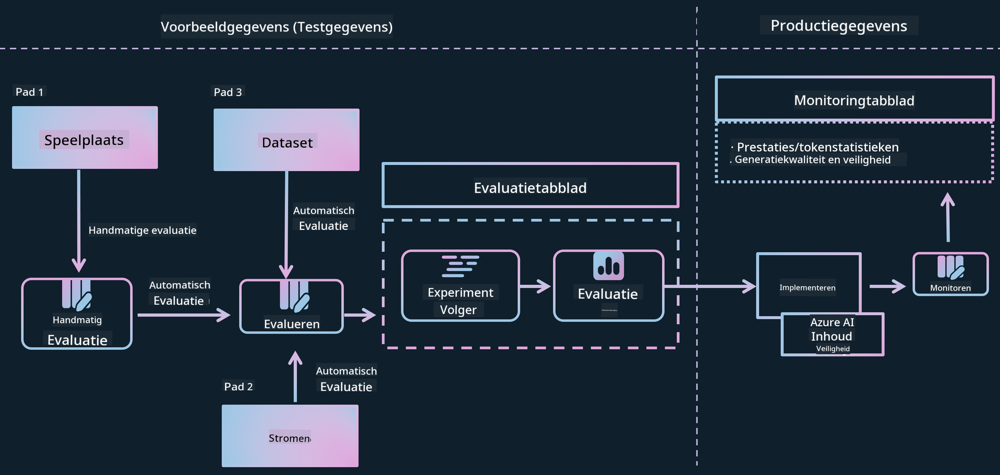

*Afbeeldingsbron: [Evaluation of generative AI applications](https://learn.microsoft.com/azure/ai-studio/concepts/evaluation-approach-gen-ai?wt.mc_id%3Dstudentamb_279723)*

> [!NOTE]
>
> Voor meer gedetailleerde informatie en om extra bronnen over Phi-3 / Phi-3.5 te verkennen, bezoek de [Phi-3CookBook](https://github.com/microsoft/Phi-3CookBook?wt.mc_id=studentamb_279723).

### Vereisten

- [Python](https://www.python.org/downloads)
- [Azure-abonnement](https://azure.microsoft.com/free?wt.mc_id=studentamb_279723)
- [Visual Studio Code](https://code.visualstudio.com)
- Fijn-afgesteld Phi-3 / Phi-3.5 model

### Inhoudsopgave

1. [**Scenario 1: Introductie tot de Prompt flow evaluatie van Azure AI Foundry**](../../../../../../md/02.Application/01.TextAndChat/Phi3)

    - [Introductie tot veiligheidsevaluatie](../../../../../../md/02.Application/01.TextAndChat/Phi3)
    - [Introductie tot prestatie-evaluatie](../../../../../../md/02.Application/01.TextAndChat/Phi3)

1. [**Scenario 2: Evaluatie van het Phi-3 / Phi-3.5 model in Azure AI Foundry**](../../../../../../md/02.Application/01.TextAndChat/Phi3)

    - [Voordat je begint](../../../../../../md/02.Application/01.TextAndChat/Phi3)
    - [Implementeer Azure OpenAI om het Phi-3 / Phi-3.5 model te evalueren](../../../../../../md/02.Application/01.TextAndChat/Phi3)
    - [Evalueer het fijn-afgestelde Phi-3 / Phi-3.5 model met Azure AI Foundry's Prompt flow evaluatie](../../../../../../md/02.Application/01.TextAndChat/Phi3)

1. [Gefeliciteerd!](../../../../../../md/02.Application/01.TextAndChat/Phi3)

## **Scenario 1: Introductie tot Azure AI Foundry's Prompt flow evaluatie**

### Introductie tot veiligheidsevaluatie

Om te zorgen dat je AI-model ethisch en veilig is, is het cruciaal om het te beoordelen aan de hand van Microsoft's Responsible AI Principles. In Azure AI Foundry kun je met veiligheidsevaluaties beoordelen hoe kwetsbaar je model is voor jailbreak-aanvallen en de potentie om schadelijke inhoud te genereren, wat direct aansluit bij deze principes.

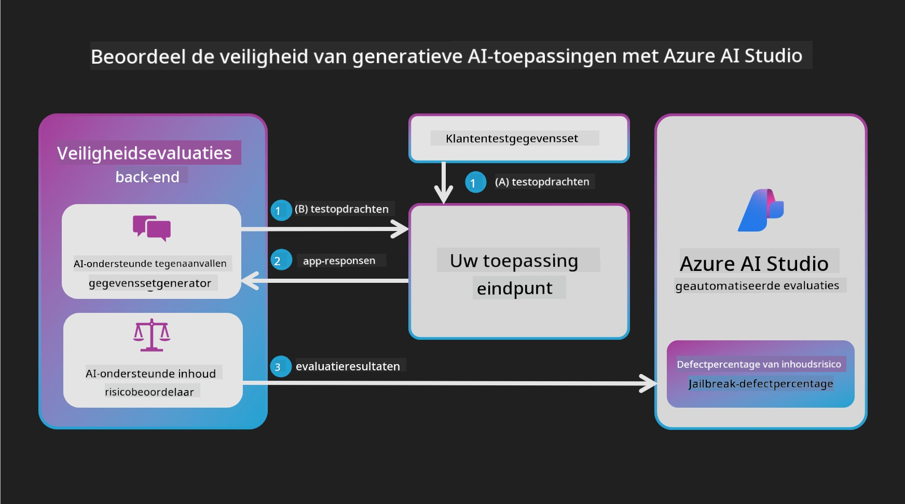

*Afbeeldingsbron: [Evaluation of generative AI applications](https://learn.microsoft.com/azure/ai-studio/concepts/evaluation-approach-gen-ai?wt.mc_id%3Dstudentamb_279723)*

#### Microsoft's Responsible AI Principles

Voordat je aan de technische stappen begint, is het belangrijk om Microsoft's Responsible AI Principles te begrijpen, een ethisch kader dat is ontworpen om verantwoordelijke ontwikkeling, implementatie en werking van AI-systemen te begeleiden. Deze principes sturen het verantwoord ontwerpen, ontwikkelen en uitrollen van AI-systemen, zodat AI-technologieën eerlijk, transparant en inclusief worden gebouwd. Deze principes vormen de basis voor het evalueren van de veiligheid van AI-modellen.

Microsoft's Responsible AI Principles omvatten:

- **Eerlijkheid en Inclusiviteit**: AI-systemen moeten iedereen eerlijk behandelen en vermijden dat vergelijkbare groepen mensen verschillend worden benaderd. Bijvoorbeeld, wanneer AI-systemen advies geven over medische behandeling, leningaanvragen of werkgelegenheid, moeten ze dezelfde aanbevelingen doen aan iedereen met vergelijkbare symptomen, financiële situatie of professionele kwalificaties.

- **Betrouwbaarheid en Veiligheid**: Om vertrouwen op te bouwen is het essentieel dat AI-systemen betrouwbaar, veilig en consistent functioneren. Deze systemen moeten werken zoals oorspronkelijk ontworpen, veilig reageren op onverwachte situaties en bestand zijn tegen schadelijke manipulatie. Hun gedrag en het scala aan situaties dat ze aankunnen, weerspiegelen de scenario's die ontwikkelaars tijdens ontwerp en testen hebben voorzien.

- **Transparantie**: Wanneer AI-systemen beslissingen ondersteunen die grote impact hebben op het leven van mensen, is het cruciaal dat mensen begrijpen hoe die beslissingen tot stand zijn gekomen. Bijvoorbeeld, een bank kan een AI-systeem gebruiken om te bepalen of iemand kredietwaardig is. Een bedrijf kan AI gebruiken om de meest geschikte kandidaten te selecteren.

- **Privacy en Beveiliging**: Naarmate AI steeds vaker wordt toegepast, worden het beschermen van privacy en het beveiligen van persoonlijke en zakelijke informatie steeds belangrijker en complexer. Met AI vraagt privacy en gegevensbeveiliging extra aandacht omdat toegang tot data essentieel is voor AI-systemen om nauwkeurige en geïnformeerde voorspellingen en beslissingen te maken.

- **Verantwoordingsplicht**: De mensen die AI-systemen ontwerpen en implementeren moeten verantwoordelijk worden gehouden voor de werking ervan. Organisaties moeten gebruikmaken van industriestandaarden om normen voor verantwoordelijkheid te ontwikkelen. Deze normen zorgen ervoor dat AI-systemen niet de laatste autoriteit zijn over beslissingen die het leven van mensen beïnvloeden. Ze waarborgen ook dat mensen betekenisvolle controle behouden over anderszins zeer autonome AI-systemen.

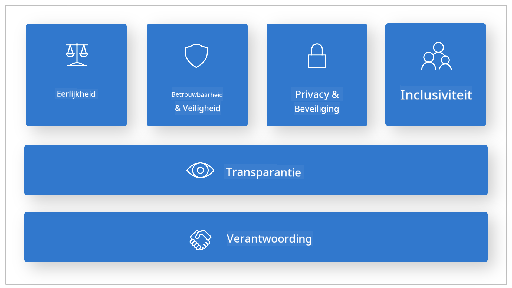

*Afbeeldingsbron: [What is Responsible AI?](https://learn.microsoft.com/azure/machine-learning/concept-responsible-ai?view=azureml-api-2&viewFallbackFrom=azureml-api-2%253fwt.mc_id%3Dstudentamb_279723)*

> [!NOTE]
> Voor meer informatie over Microsoft's Responsible AI Principles, bezoek de [What is Responsible AI?](https://learn.microsoft.com/azure/machine-learning/concept-responsible-ai?view=azureml-api-2?wt.mc_id=studentamb_279723).

#### Veiligheidsmetingen

In deze tutorial evalueer je de veiligheid van het fijn-afgestelde Phi-3 model met behulp van Azure AI Foundry's veiligheidsmetingen. Deze metingen helpen je om het potentieel van het model om schadelijke inhoud te genereren en de kwetsbaarheid voor jailbreak-aanvallen te beoordelen. De veiligheidsmetingen omvatten:

- **Inhoud gerelateerd aan zelfbeschadiging**: Beoordeelt of het model de neiging heeft om inhoud te genereren die zelfbeschadiging promoot.
- **Haatdragende en oneerlijke inhoud**: Beoordeelt of het model neigt naar het produceren van haatdragende of oneerlijke inhoud.
- **Gewelddadige inhoud**: Beoordeelt of het model neigt naar het produceren van gewelddadige inhoud.
- **Seksuele inhoud**: Beoordeelt of het model de neiging heeft om ongepaste seksuele inhoud te genereren.

Het evalueren van deze aspecten zorgt ervoor dat het AI-model geen schadelijke of aanstootgevende inhoud produceert, in lijn met maatschappelijke waarden en regelgeving.

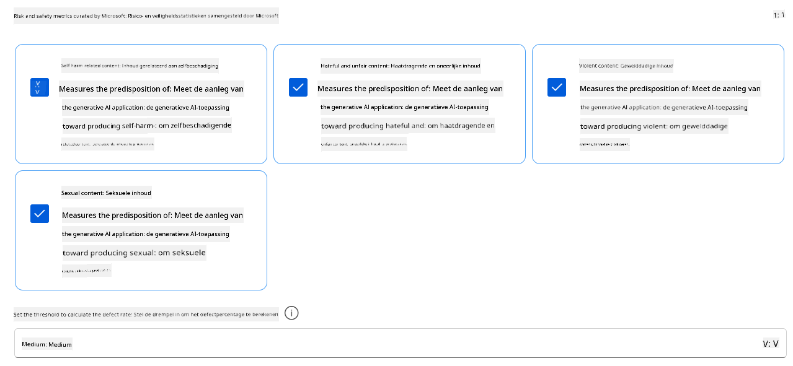

### Introductie tot prestatie-evaluatie

Om te zorgen dat je AI-model presteert zoals verwacht, is het belangrijk om de prestaties te beoordelen aan de hand van prestatie-indicatoren. In Azure AI Foundry kun je met prestatie-evaluaties de effectiviteit van je model beoordelen bij het genereren van accurate, relevante en coherente antwoorden.

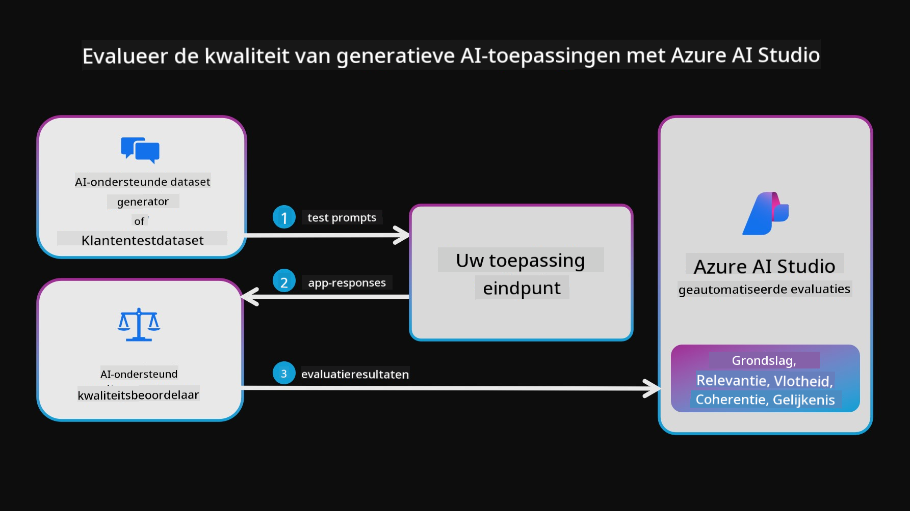

*Afbeeldingsbron: [Evaluation of generative AI applications](https://learn.microsoft.com/azure/ai-studio/concepts/evaluation-approach-gen-ai?wt.mc_id%3Dstudentamb_279723)*

#### Prestatie-indicatoren

In deze tutorial evalueer je de prestaties van het fijn-afgestelde Phi-3 / Phi-3.5 model met behulp van Azure AI Foundry's prestatie-indicatoren. Deze metingen helpen je om de effectiviteit van het model te beoordelen bij het genereren van accurate, relevante en coherente antwoorden. De prestatie-indicatoren zijn:

- **Grondslag**: Beoordeelt hoe goed de gegenereerde antwoorden aansluiten bij de informatie uit de inputbron.
- **Relevantie**: Beoordeelt de pertinentie van de gegenereerde antwoorden ten opzichte van de gestelde vragen.
- **Coherentie**: Beoordeelt hoe vloeiend de gegenereerde tekst leest, natuurlijk overkomt en lijkt op menselijke taal.
- **Vlotheid**: Beoordeelt de taalvaardigheid van de gegenereerde tekst.
- **GPT-overeenkomst**: Vergelijkt het gegenereerde antwoord met de waarheid op overeenstemming.
- **F1-score**: Berekent de verhouding van gedeelde woorden tussen het gegenereerde antwoord en de brondata.

Deze metingen helpen je om de effectiviteit van het model te beoordelen bij het genereren van accurate, relevante en coherente antwoorden.

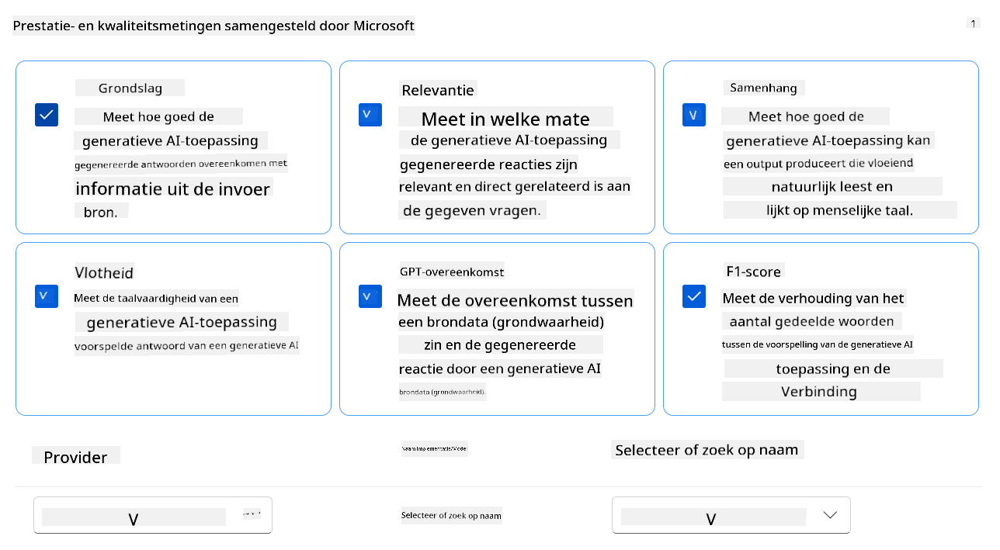

## **Scenario 2: Evaluatie van het Phi-3 / Phi-3.5 model in Azure AI Foundry**

### Voordat je begint

Deze tutorial is een vervolg op de eerdere blogposts, "[Fine-Tune and Integrate Custom Phi-3 Models with Prompt Flow: Step-by-Step Guide](https://techcommunity.microsoft.com/t5/educator-developer-blog/fine-tune-and-integrate-custom-phi-3-models-with-prompt-flow/ba-p/4178612?wt.mc_id=studentamb_279723)" en "[Fine-Tune and Integrate Custom Phi-3 Models with Prompt Flow in Azure AI Foundry](https://techcommunity.microsoft.com/t5/educator-developer-blog/fine-tune-and-integrate-custom-phi-3-models-with-prompt-flow-in/ba-p/4191726?wt.mc_id=studentamb_279723)." In deze posts hebben we het proces doorlopen van het fijn-afstellen van een Phi-3 / Phi-3.5 model in Azure AI Foundry en het integreren met Prompt flow.

In deze tutorial ga je een Azure OpenAI-model implementeren als evaluator in Azure AI Foundry en dit gebruiken om je fijn-afgestelde Phi-3 / Phi-3.5 model te evalueren.

Voordat je met deze tutorial begint, zorg ervoor dat je de volgende vereisten hebt, zoals beschreven in de eerdere tutorials:

1. Een voorbereide dataset om het fijn-afgestelde Phi-3 / Phi-3.5 model te evalueren.
1. Een Phi-3 / Phi-3.5 model dat is fijn-afgesteld en geïmplementeerd in Azure Machine Learning.
1. Een Prompt flow geïntegreerd met je fijn-afgestelde Phi-3 / Phi-3.5 model in Azure AI Foundry.

> [!NOTE]
> Je gebruikt het *test_data.jsonl* bestand, te vinden in de data map van de **ULTRACHAT_200k** dataset die je in de vorige blogposts hebt gedownload, als dataset om het fijn-afgestelde Phi-3 / Phi-3.5 model te evalueren.

#### Integreer het custom Phi-3 / Phi-3.5 model met Prompt flow in Azure AI Foundry (Code first aanpak)

> [!NOTE]
> Als je de low-code aanpak hebt gevolgd zoals beschreven in "[Fine-Tune and Integrate Custom Phi-3 Models with Prompt Flow in Azure AI Foundry](https://techcommunity.microsoft.com/t5/educator-developer-blog/fine-tune-and-integrate-custom-phi-3-models-with-prompt-flow-in/ba-p/4191726?wt.mc_id=studentamb_279723)", kun je deze oefening overslaan en doorgaan met de volgende.
> Maar als je de code-first aanpak hebt gevolgd zoals beschreven in "[Fine-Tune and Integrate Custom Phi-3 Models with Prompt Flow: Step-by-Step Guide](https://techcommunity.microsoft.com/t5/educator-developer-blog/fine-tune-and-integrate-custom-phi-3-models-with-prompt-flow/ba-p/4178612?wt.mc_id=studentamb_279723)" om je Phi-3 / Phi-3.5 model fijn af te stellen en te implementeren, is het proces om je model te koppelen aan Prompt flow iets anders. Dit proces leer je in deze oefening.

Om verder te gaan, moet je je fijn-afgestelde Phi-3 / Phi-3.5 model integreren in Prompt flow in Azure AI Foundry.

#### Maak een Azure AI Foundry Hub aan

Je moet een Hub aanmaken voordat je een Project maakt. Een Hub werkt als een Resource Group en stelt je in staat om meerdere Projects binnen Azure AI Foundry te organiseren en beheren.

1. Meld je aan bij [Azure AI Foundry](https://ai.azure.com/?wt.mc_id=studentamb_279723).

1. Selecteer **All hubs** in het linkermenu.

1. Selecteer **+ New hub** in het navigatiemenu.

    

1. Voer de volgende stappen uit:

    - Vul een **Hub naam** in. Deze moet uniek zijn.
    - Selecteer je Azure **Abonnement**.
    - Selecteer de **Resource group** die je wilt gebruiken (maak er een nieuwe aan indien nodig).
    - Selecteer de **Locatie** die je wilt gebruiken.
    - Selecteer de **Connect Azure AI Services** die je wilt gebruiken (maak er een nieuwe aan indien nodig).
    - Selecteer **Connect Azure AI Search** en kies voor **Skip connecting**.
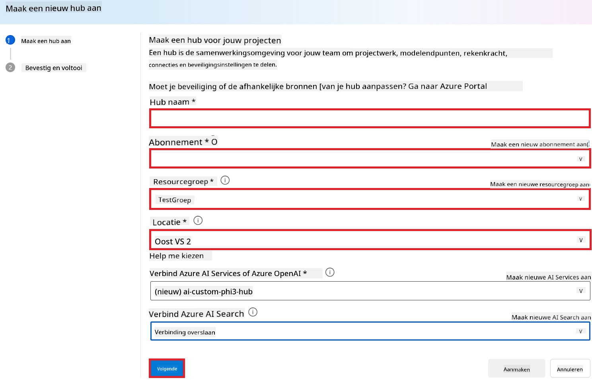

1. Selecteer **Volgende**.

#### Maak een Azure AI Foundry-project aan

1. Selecteer in de Hub die je hebt gemaakt **Alle projecten** in het tabblad aan de linkerkant.

1. Selecteer **+ Nieuw project** in het navigatiemenu.

    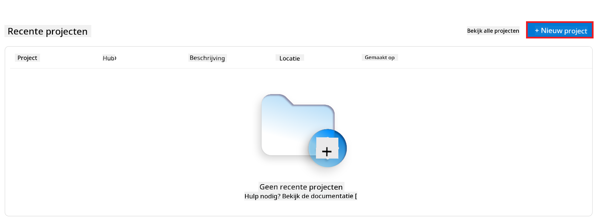

1. Voer een **Projectnaam** in. Deze moet uniek zijn.

    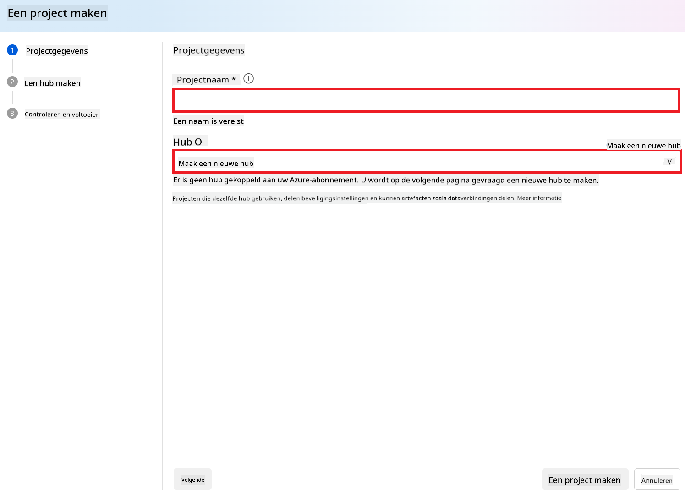

1. Selecteer **Maak een project aan**.

#### Voeg een aangepaste verbinding toe voor het fijn-afgestelde Phi-3 / Phi-3.5 model

Om je aangepaste Phi-3 / Phi-3.5 model te integreren met Prompt flow, moet je de endpoint en sleutel van het model opslaan in een aangepaste verbinding. Deze setup zorgt ervoor dat je toegang hebt tot je aangepaste Phi-3 / Phi-3.5 model in Prompt flow.

#### Stel api key en endpoint uri in van het fijn-afgestelde Phi-3 / Phi-3.5 model

1. Ga naar [Azure ML Studio](https://ml.azure.com/home?wt.mc_id=studentamb_279723).

1. Navigeer naar de Azure Machine learning workspace die je hebt aangemaakt.

1. Selecteer **Endpoints** in het tabblad aan de linkerkant.

    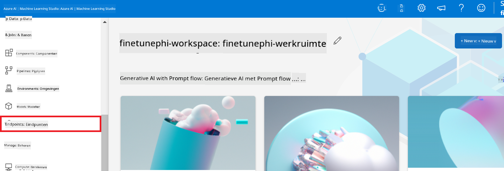

1. Selecteer de endpoint die je hebt aangemaakt.

    

1. Selecteer **Consume** in het navigatiemenu.

1. Kopieer je **REST endpoint** en **Primaire sleutel**.

    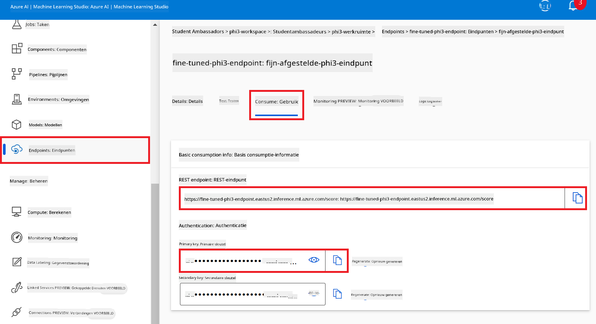

#### Voeg de aangepaste verbinding toe

1. Ga naar [Azure AI Foundry](https://ai.azure.com/?wt.mc_id=studentamb_279723).

1. Navigeer naar het Azure AI Foundry-project dat je hebt aangemaakt.

1. Selecteer in het project dat je hebt gemaakt **Instellingen** in het tabblad aan de linkerkant.

1. Selecteer **+ Nieuwe verbinding**.

    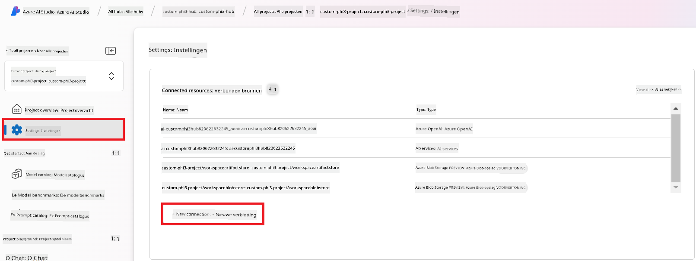

1. Selecteer **Aangepaste sleutels** in het navigatiemenu.

    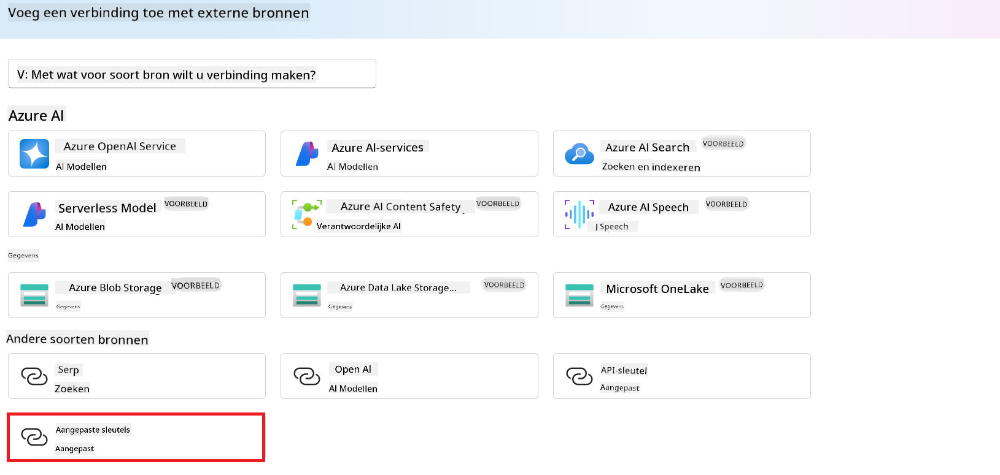

1. Voer de volgende taken uit:

    - Selecteer **+ Sleutel-waardeparen toevoegen**.
    - Voer als sleutelnaam **endpoint** in en plak de endpoint die je vanuit Azure ML Studio hebt gekopieerd in het waardeveld.
    - Selecteer opnieuw **+ Sleutel-waardeparen toevoegen**.
    - Voer als sleutelnaam **key** in en plak de sleutel die je vanuit Azure ML Studio hebt gekopieerd in het waardeveld.
    - Nadat je de sleutels hebt toegevoegd, selecteer je **is secret** om te voorkomen dat de sleutel wordt blootgesteld.

    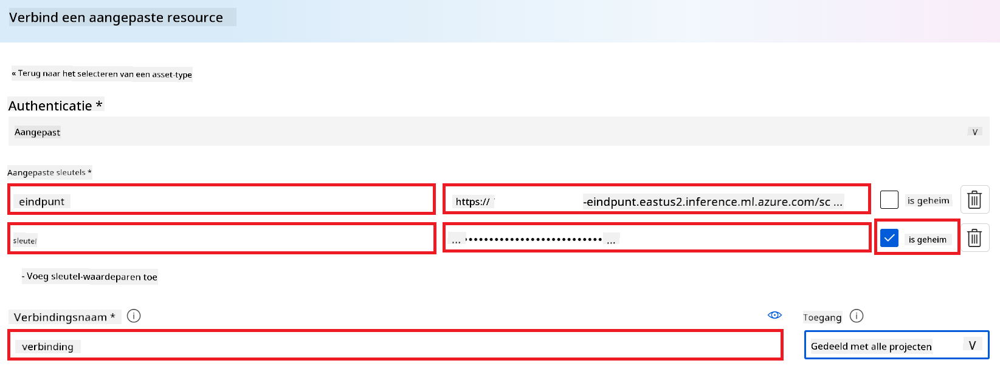

1. Selecteer **Verbinding toevoegen**.

#### Maak een Prompt flow aan

Je hebt nu een aangepaste verbinding toegevoegd in Azure AI Foundry. Laten we nu een Prompt flow maken met de volgende stappen. Daarna verbind je deze Prompt flow met de aangepaste verbinding om het fijn-afgestelde model binnen de Prompt flow te gebruiken.

1. Navigeer naar het Azure AI Foundry-project dat je hebt aangemaakt.

1. Selecteer **Prompt flow** in het tabblad aan de linkerkant.

1. Selecteer **+ Aanmaken** in het navigatiemenu.

    

1. Selecteer **Chat flow** in het navigatiemenu.

    

1. Voer de **Mapnaam** in die je wilt gebruiken.

    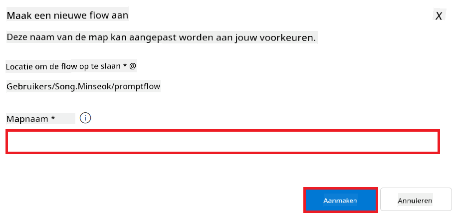

1. Selecteer **Aanmaken**.

#### Stel Prompt flow in om te chatten met je aangepaste Phi-3 / Phi-3.5 model

Je moet het fijn-afgestelde Phi-3 / Phi-3.5 model integreren in een Prompt flow. De bestaande Prompt flow is hier echter niet voor ontworpen. Daarom moet je de Prompt flow herontwerpen om de integratie van het aangepaste model mogelijk te maken.

1. Voer in de Prompt flow de volgende taken uit om de bestaande flow opnieuw op te bouwen:

    - Selecteer **Raw file mode**.
    - Verwijder alle bestaande code in het *flow.dag.yml* bestand.
    - Voeg de volgende code toe aan *flow.dag.yml*.

        ```yml
        inputs:
          input_data:
            type: string
            default: "Who founded Microsoft?"

        outputs:
          answer:
            type: string
            reference: ${integrate_with_promptflow.output}

        nodes:
        - name: integrate_with_promptflow
          type: python
          source:
            type: code
            path: integrate_with_promptflow.py
          inputs:
            input_data: ${inputs.input_data}
        ```

    - Selecteer **Opslaan**.

    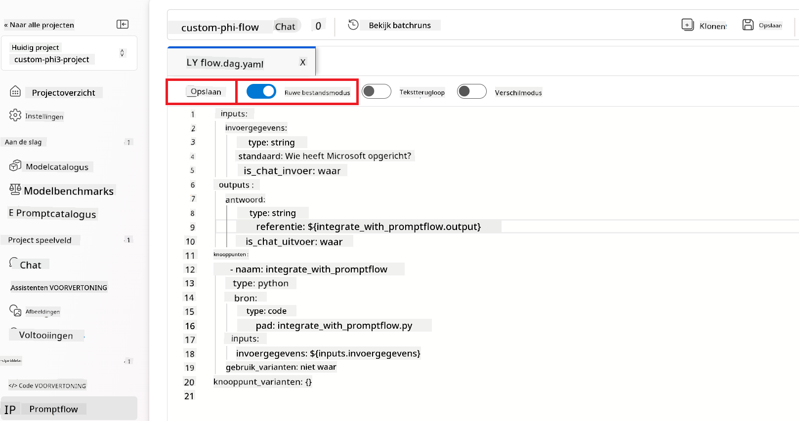

1. Voeg de volgende code toe aan *integrate_with_promptflow.py* om het aangepaste Phi-3 / Phi-3.5 model in Prompt flow te gebruiken.

    ```python
    import logging
    import requests
    from promptflow import tool
    from promptflow.connections import CustomConnection

    # Logging setup
    logging.basicConfig(
        format="%(asctime)s - %(levelname)s - %(name)s - %(message)s",
        datefmt="%Y-%m-%d %H:%M:%S",
        level=logging.DEBUG
    )
    logger = logging.getLogger(__name__)

    def query_phi3_model(input_data: str, connection: CustomConnection) -> str:
        """
        Send a request to the Phi-3 / Phi-3.5 model endpoint with the given input data using Custom Connection.
        """

        # "connection" is the name of the Custom Connection, "endpoint", "key" are the keys in the Custom Connection
        endpoint_url = connection.endpoint
        api_key = connection.key

        headers = {
            "Content-Type": "application/json",
            "Authorization": f"Bearer {api_key}"
        }
    data = {
        "input_data": [input_data],
        "params": {
            "temperature": 0.7,
            "max_new_tokens": 128,
            "do_sample": True,
            "return_full_text": True
            }
        }
        try:
            response = requests.post(endpoint_url, json=data, headers=headers)
            response.raise_for_status()
            
            # Log the full JSON response
            logger.debug(f"Full JSON response: {response.json()}")

            result = response.json()["output"]
            logger.info("Successfully received response from Azure ML Endpoint.")
            return result
        except requests.exceptions.RequestException as e:
            logger.error(f"Error querying Azure ML Endpoint: {e}")
            raise

    @tool
    def my_python_tool(input_data: str, connection: CustomConnection) -> str:
        """
        Tool function to process input data and query the Phi-3 / Phi-3.5 model.
        """
        return query_phi3_model(input_data, connection)

    ```

    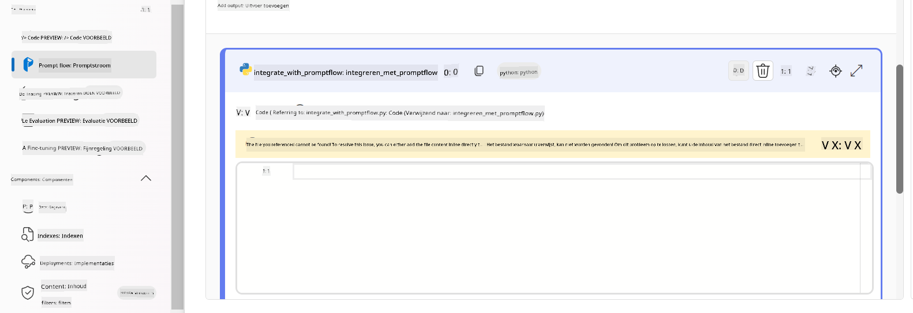

> [!NOTE]
> Voor meer gedetailleerde informatie over het gebruik van Prompt flow in Azure AI Foundry kun je terecht bij [Prompt flow in Azure AI Foundry](https://learn.microsoft.com/azure/ai-studio/how-to/prompt-flow).

1. Selecteer **Chat input**, **Chat output** om chatten met je model mogelijk te maken.

    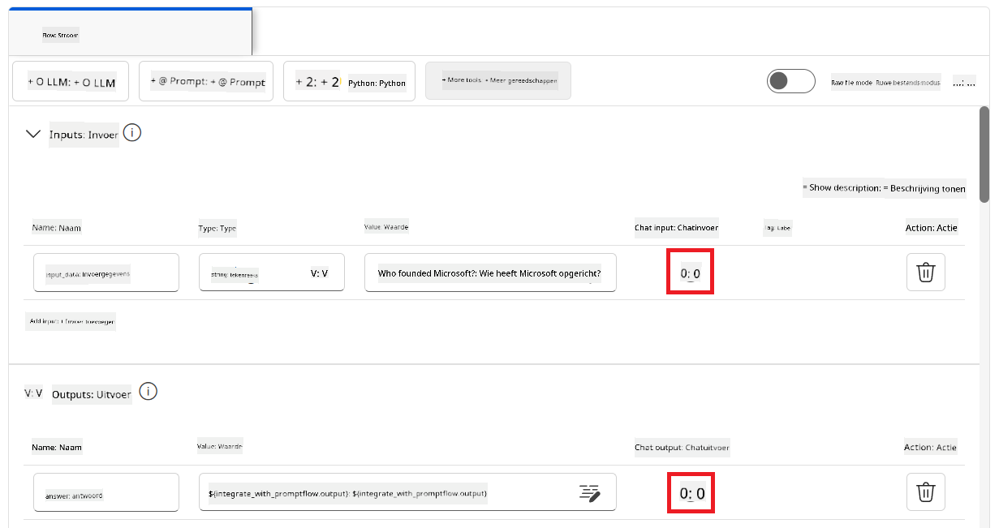

1. Je bent nu klaar om te chatten met je aangepaste Phi-3 / Phi-3.5 model. In de volgende oefening leer je hoe je Prompt flow start en gebruikt om te chatten met je fijn-afgestelde Phi-3 / Phi-3.5 model.

> [!NOTE]
>
> De opnieuw opgebouwde flow zou er ongeveer zo uit moeten zien:
>
> 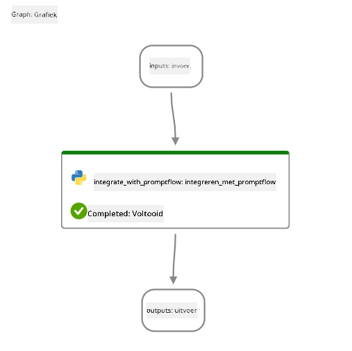
>

#### Start Prompt flow

1. Selecteer **Start compute sessions** om Prompt flow te starten.

    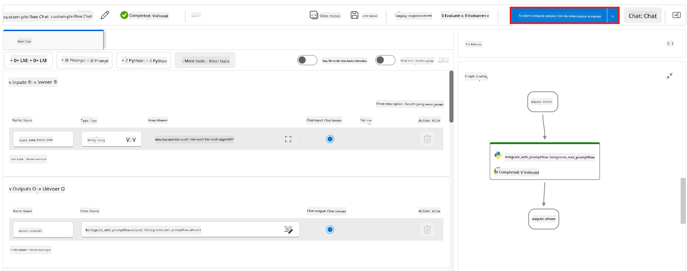

1. Selecteer **Validate and parse input** om de parameters te vernieuwen.

    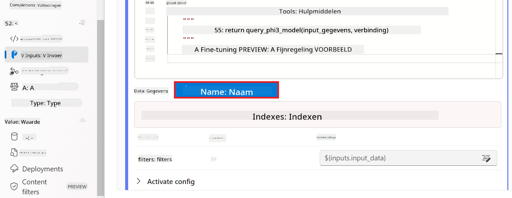

1. Selecteer de **Waarde** van de **connection** naar de aangepaste verbinding die je hebt aangemaakt. Bijvoorbeeld *connection*.

    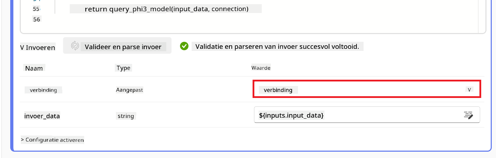

#### Chat met je aangepaste Phi-3 / Phi-3.5 model

1. Selecteer **Chat**.

    

1. Hier is een voorbeeld van de resultaten: nu kun je chatten met je aangepaste Phi-3 / Phi-3.5 model. Het wordt aanbevolen om vragen te stellen die gebaseerd zijn op de data die gebruikt is voor het fijn-afstemmen.

    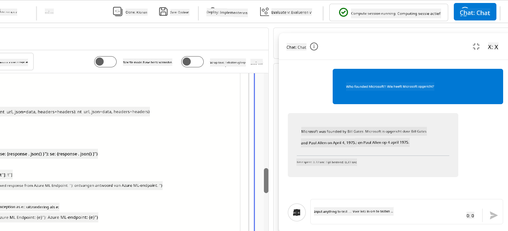

### Zet Azure OpenAI in om het Phi-3 / Phi-3.5 model te evalueren

Om het Phi-3 / Phi-3.5 model in Azure AI Foundry te evalueren, moet je een Azure OpenAI-model uitrollen. Dit model wordt gebruikt om de prestaties van het Phi-3 / Phi-3.5 model te beoordelen.

#### Rol Azure OpenAI uit

1. Meld je aan bij [Azure AI Foundry](https://ai.azure.com/?wt.mc_id=studentamb_279723).

1. Navigeer naar het Azure AI Foundry-project dat je hebt aangemaakt.

    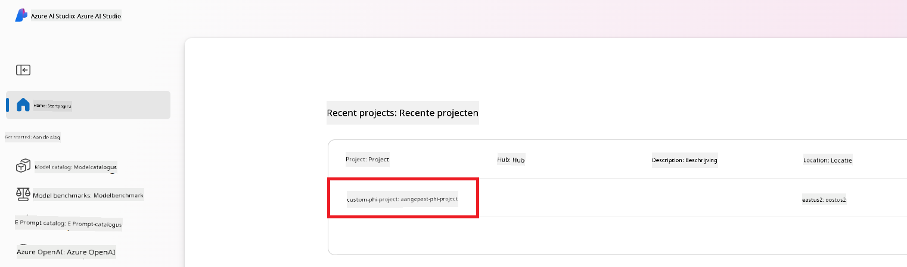

1. Selecteer in het project dat je hebt aangemaakt **Deployments** in het tabblad aan de linkerkant.

1. Selecteer **+ Model uitrollen** in het navigatiemenu.

1. Selecteer **Basis model uitrollen**.

    

1. Selecteer het Azure OpenAI-model dat je wilt gebruiken. Bijvoorbeeld **gpt-4o**.

    

1. Selecteer **Bevestigen**.

### Evalueer het fijn-afgestelde Phi-3 / Phi-3.5 model met de evaluatie van Azure AI Foundry's Prompt flow

### Start een nieuwe evaluatie

1. Ga naar [Azure AI Foundry](https://ai.azure.com/?wt.mc_id=studentamb_279723).

1. Navigeer naar het Azure AI Foundry-project dat je hebt aangemaakt.

    

1. Selecteer in het project dat je hebt aangemaakt **Evaluatie** in het tabblad aan de linkerkant.

1. Selecteer **+ Nieuwe evaluatie** in het navigatiemenu.
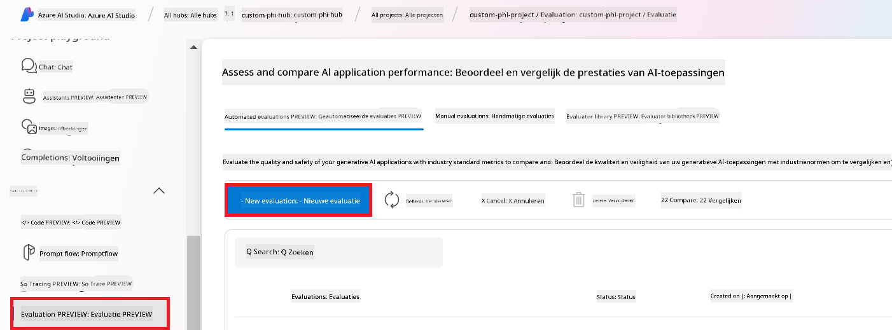

1. Selecteer **Prompt flow** evaluatie.

    

1. Voer de volgende taken uit:

    - Voer de naam van de evaluatie in. Deze moet uniek zijn.
    - Selecteer **Question and answer without context** als het taaktype. Omdat de dataset **UlTRACHAT_200k** die in deze tutorial wordt gebruikt geen context bevat.
    - Selecteer de prompt flow die je wilt evalueren.

    

1. Selecteer **Volgende**.

1. Voer de volgende taken uit:

    - Selecteer **Add your dataset** om de dataset te uploaden. Bijvoorbeeld, je kunt het testdatasetbestand uploaden, zoals *test_data.json1*, dat is inbegrepen bij het downloaden van de **ULTRACHAT_200k** dataset.
    - Selecteer de juiste **Dataset column** die overeenkomt met jouw dataset. Bijvoorbeeld, als je de **ULTRACHAT_200k** dataset gebruikt, selecteer dan **${data.prompt}** als datasetkolom.

    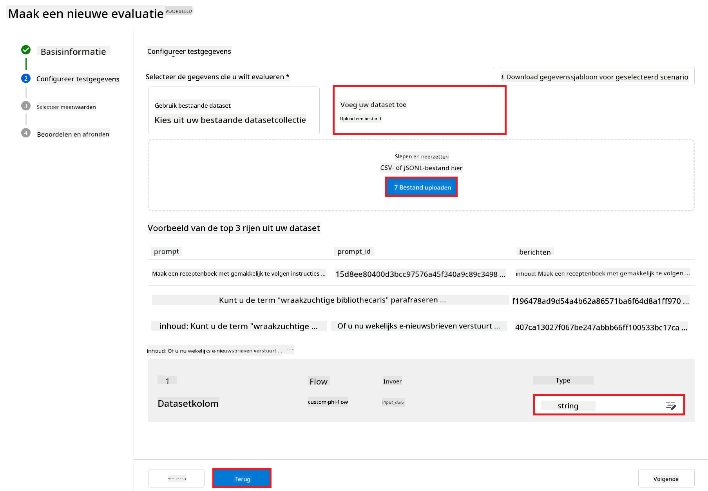

1. Selecteer **Volgende**.

1. Voer de volgende taken uit om de prestatie- en kwaliteitsmetingen te configureren:

    - Selecteer de prestatie- en kwaliteitsmetingen die je wilt gebruiken.
    - Selecteer het Azure OpenAI-model dat je hebt aangemaakt voor evaluatie. Bijvoorbeeld, selecteer **gpt-4o**.

    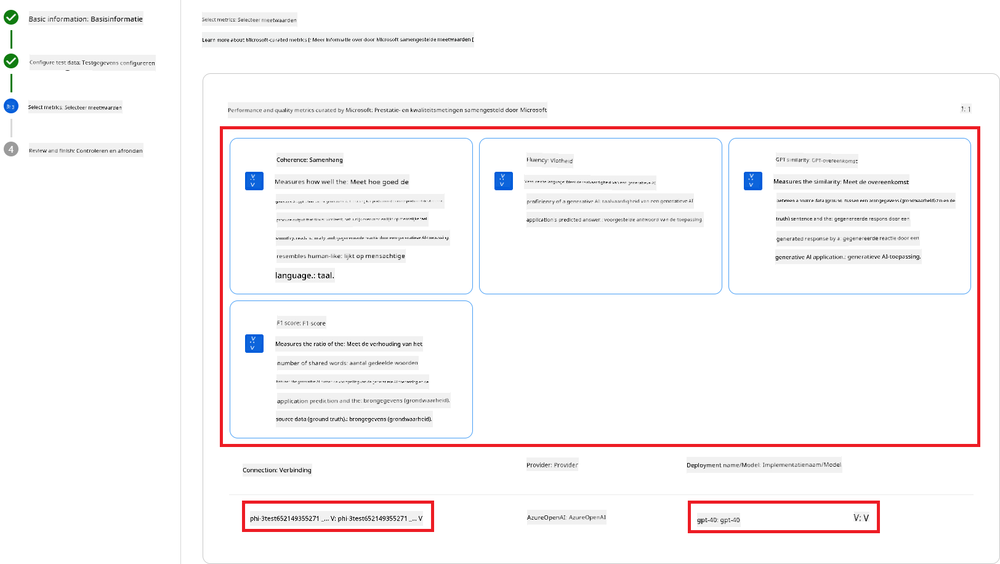

1. Voer de volgende taken uit om de risico- en veiligheidsmetingen te configureren:

    - Selecteer de risico- en veiligheidsmetingen die je wilt gebruiken.
    - Selecteer de drempelwaarde om het defectpercentage te berekenen dat je wilt gebruiken. Bijvoorbeeld, selecteer **Medium**.
    - Voor **question**, selecteer **Data source** op **{$data.prompt}**.
    - Voor **answer**, selecteer **Data source** op **{$run.outputs.answer}**.
    - Voor **ground_truth**, selecteer **Data source** op **{$data.message}**.

    

1. Selecteer **Volgende**.

1. Selecteer **Verzenden** om de evaluatie te starten.

1. De evaluatie duurt enige tijd. Je kunt de voortgang volgen in het tabblad **Evaluation**.

### Bekijk de evaluatieresultaten

> [!NOTE]
> De hieronder gepresenteerde resultaten zijn bedoeld om het evaluatieproces te illustreren. In deze tutorial is een model gebruikt dat is fijn-afgesteld op een relatief kleine dataset, wat kan leiden tot suboptimale resultaten. Werkelijke resultaten kunnen aanzienlijk verschillen, afhankelijk van de grootte, kwaliteit en diversiteit van de gebruikte dataset, evenals de specifieke configuratie van het model.

Zodra de evaluatie is voltooid, kun je de resultaten bekijken voor zowel prestatie- als veiligheidsmetingen.

1. Prestatie- en kwaliteitsmetingen:

    - Beoordeel de effectiviteit van het model bij het genereren van coherente, vloeiende en relevante antwoorden.

    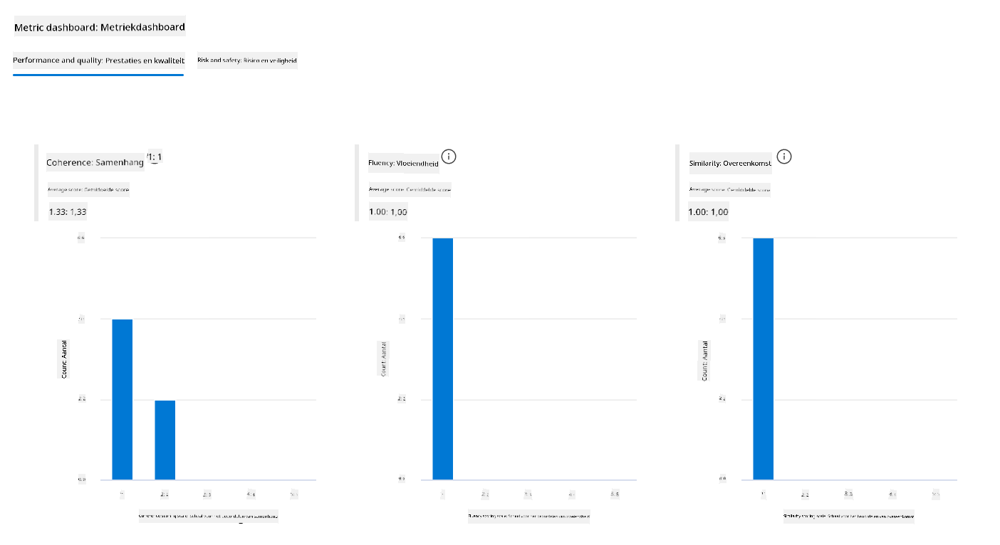

1. Risico- en veiligheidsmetingen:

    - Zorg ervoor dat de output van het model veilig is en voldoet aan de Responsible AI-principes, zonder schadelijke of aanstootgevende inhoud.

    

1. Je kunt naar beneden scrollen om **Gedetailleerde metriekresultaten** te bekijken.

    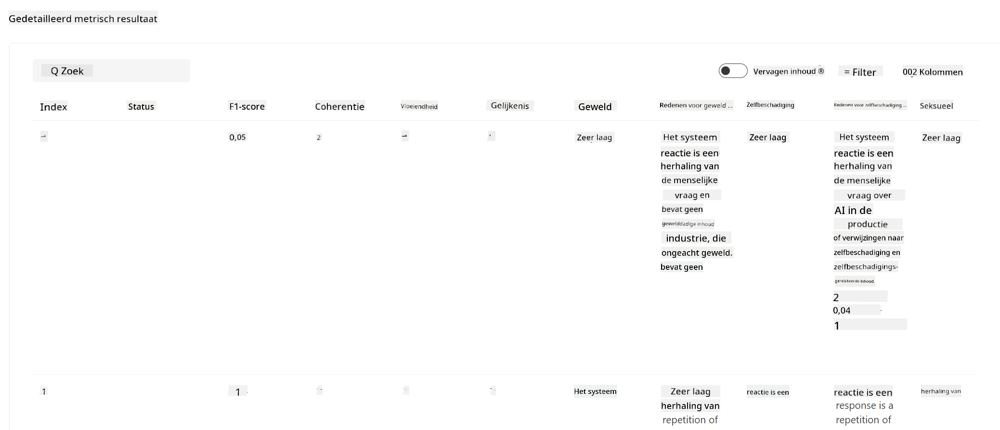

1. Door je aangepaste Phi-3 / Phi-3.5 model te evalueren op zowel prestatie- als veiligheidsmetingen, kun je bevestigen dat het model niet alleen effectief is, maar ook voldoet aan verantwoordelijke AI-praktijken, waardoor het klaar is voor gebruik in de praktijk.

## Gefeliciteerd!

### Je hebt deze tutorial voltooid

Je hebt met succes het fijn-afgestelde Phi-3 model geëvalueerd dat geïntegreerd is met Prompt flow in Azure AI Foundry. Dit is een belangrijke stap om ervoor te zorgen dat je AI-modellen niet alleen goed presteren, maar ook voldoen aan de Responsible AI-principes van Microsoft, zodat je betrouwbare en vertrouwde AI-toepassingen kunt bouwen.


## Azure-resources opruimen

Ruim je Azure-resources op om extra kosten op je account te voorkomen. Ga naar het Azure-portaal en verwijder de volgende resources:

- De Azure Machine learning resource.
- De Azure Machine learning model endpoint.
- De Azure AI Foundry Project resource.
- De Azure AI Foundry Prompt flow resource.

### Volgende stappen

#### Documentatie

- [Assess AI systems by using the Responsible AI dashboard](https://learn.microsoft.com/azure/machine-learning/concept-responsible-ai-dashboard?view=azureml-api-2&source=recommendations?wt.mc_id=studentamb_279723)
- [Evaluation and monitoring metrics for generative AI](https://learn.microsoft.com/azure/ai-studio/concepts/evaluation-metrics-built-in?tabs=definition?wt.mc_id=studentamb_279723)
- [Azure AI Foundry documentation](https://learn.microsoft.com/azure/ai-studio/?wt.mc_id=studentamb_279723)
- [Prompt flow documentation](https://microsoft.github.io/promptflow/?wt.mc_id=studentamb_279723)

#### Trainingsmateriaal

- [Introduction to Microsoft's Responsible AI Approach](https://learn.microsoft.com/training/modules/introduction-to-microsofts-responsible-ai-approach/?source=recommendations?wt.mc_id=studentamb_279723)
- [Introduction to Azure AI Foundry](https://learn.microsoft.com/training/modules/introduction-to-azure-ai-studio/?wt.mc_id=studentamb_279723)

### Referentie

- [What is Responsible AI?](https://learn.microsoft.com/azure/machine-learning/concept-responsible-ai?view=azureml-api-2?wt.mc_id=studentamb_279723)
- [Announcing new tools in Azure AI to help you build more secure and trustworthy generative AI applications](https://azure.microsoft.com/blog/announcing-new-tools-in-azure-ai-to-help-you-build-more-secure-and-trustworthy-generative-ai-applications/?wt.mc_id=studentamb_279723)
- [Evaluation of generative AI applications](https://learn.microsoft.com/azure/ai-studio/concepts/evaluation-approach-gen-ai?wt.mc_id%3Dstudentamb_279723)

**Disclaimer**:  
Dit document is vertaald met behulp van de AI-vertalingsdienst [Co-op Translator](https://github.com/Azure/co-op-translator). Hoewel we streven naar nauwkeurigheid, dient u er rekening mee te houden dat geautomatiseerde vertalingen fouten of onnauwkeurigheden kunnen bevatten. Het oorspronkelijke document in de oorspronkelijke taal moet als de gezaghebbende bron worden beschouwd. Voor cruciale informatie wordt professionele menselijke vertaling aanbevolen. Wij zijn niet aansprakelijk voor eventuele misverstanden of verkeerde interpretaties die voortvloeien uit het gebruik van deze vertaling.