<!--
CO_OP_TRANSLATOR_METADATA:
{
  "original_hash": "455be2b7b9c3390d367d528f8fab2aa0",
  "translation_date": "2025-07-17T00:34:04+00:00",
  "source_file": "md/02.Application/01.TextAndChat/Phi3/E2E_Phi-3-FineTuning_PromptFlow_Integration.md",
  "language_code": "nl"
}
-->
# Fijn afstemmen en integreren van aangepaste Phi-3 modellen met Prompt flow

Deze end-to-end (E2E) voorbeeld is gebaseerd op de handleiding "[Fine-Tune and Integrate Custom Phi-3 Models with Prompt Flow: Step-by-Step Guide](https://techcommunity.microsoft.com/t5/educator-developer-blog/fine-tune-and-integrate-custom-phi-3-models-with-prompt-flow/ba-p/4178612?WT.mc_id=aiml-137032-kinfeylo)" van de Microsoft Tech Community. Het introduceert de processen van fijn afstemmen, implementeren en integreren van aangepaste Phi-3 modellen met Prompt flow.

## Overzicht

In dit E2E voorbeeld leer je hoe je het Phi-3 model fijn afstemt en integreert met Prompt flow. Door gebruik te maken van Azure Machine Learning en Prompt flow stel je een workflow in voor het implementeren en gebruiken van aangepaste AI-modellen. Dit E2E voorbeeld is verdeeld in drie scenario's:

**Scenario 1: Azure-resources instellen en voorbereiden op fijn afstemmen**

**Scenario 2: Het Phi-3 model fijn afstemmen en implementeren in Azure Machine Learning Studio**

**Scenario 3: Integreren met Prompt flow en chatten met je aangepaste model**

Hier is een overzicht van dit E2E voorbeeld.


### Inhoudsopgave

1. **[Scenario 1: Azure-resources instellen en voorbereiden op fijn afstemmen](../../../../../../md/02.Application/01.TextAndChat/Phi3)**
    - [Een Azure Machine Learning Workspace aanmaken](../../../../../../md/02.Application/01.TextAndChat/Phi3)
    - [GPU-quotum aanvragen in Azure-abonnement](../../../../../../md/02.Application/01.TextAndChat/Phi3)
    - [Roltoewijzing toevoegen](../../../../../../md/02.Application/01.TextAndChat/Phi3)
    - [Project opzetten](../../../../../../md/02.Application/01.TextAndChat/Phi3)
    - [Dataset voorbereiden voor fijn afstemmen](../../../../../../md/02.Application/01.TextAndChat/Phi3)

1. **[Scenario 2: Phi-3 model fijn afstemmen en implementeren in Azure Machine Learning Studio](../../../../../../md/02.Application/01.TextAndChat/Phi3)**
    - [Azure CLI instellen](../../../../../../md/02.Application/01.TextAndChat/Phi3)
    - [Het Phi-3 model fijn afstemmen](../../../../../../md/02.Application/01.TextAndChat/Phi3)
    - [Het fijn afgestemde model implementeren](../../../../../../md/02.Application/01.TextAndChat/Phi3)

1. **[Scenario 3: Integreren met Prompt flow en chatten met je aangepaste model](../../../../../../md/02.Application/01.TextAndChat/Phi3)**
    - [Het aangepaste Phi-3 model integreren met Prompt flow](../../../../../../md/02.Application/01.TextAndChat/Phi3)
    - [Chatten met je aangepaste model](../../../../../../md/02.Application/01.TextAndChat/Phi3)

## Scenario 1: Azure-resources instellen en voorbereiden op fijn afstemmen

### Een Azure Machine Learning Workspace aanmaken

1. Typ *azure machine learning* in de **zoekbalk** bovenaan de portalpagina en selecteer **Azure Machine Learning** uit de opties die verschijnen.

    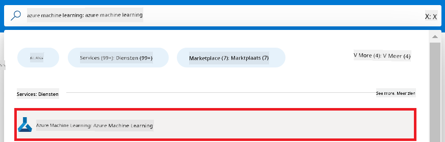

1. Selecteer **+ Create** in het navigatiemenu.

1. Selecteer **New workspace** in het navigatiemenu.

    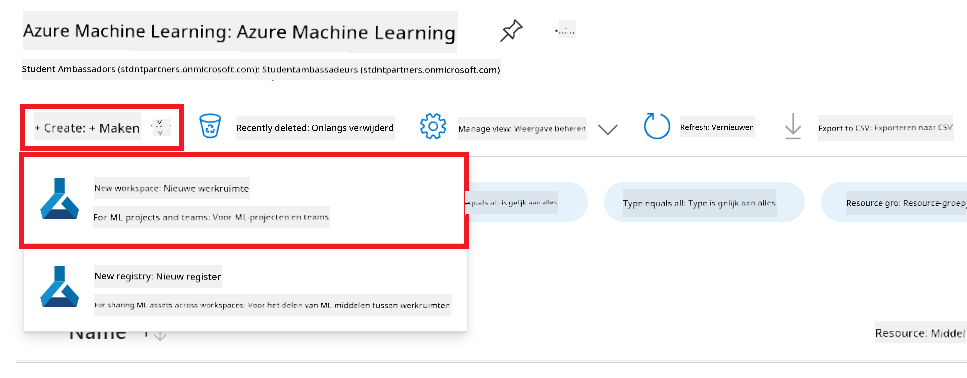

1. Voer de volgende taken uit:

    - Selecteer je Azure **Subscription**.
    - Selecteer de **Resource group** die je wilt gebruiken (maak er een nieuwe aan indien nodig).
    - Voer een **Workspace Name** in. Dit moet een unieke naam zijn.
    - Selecteer de **Regio** die je wilt gebruiken.
    - Selecteer de **Storage account** die je wilt gebruiken (maak er een nieuwe aan indien nodig).
    - Selecteer de **Key vault** die je wilt gebruiken (maak er een nieuwe aan indien nodig).
    - Selecteer de **Application insights** die je wilt gebruiken (maak er een nieuwe aan indien nodig).
    - Selecteer de **Container registry** die je wilt gebruiken (maak er een nieuwe aan indien nodig).

    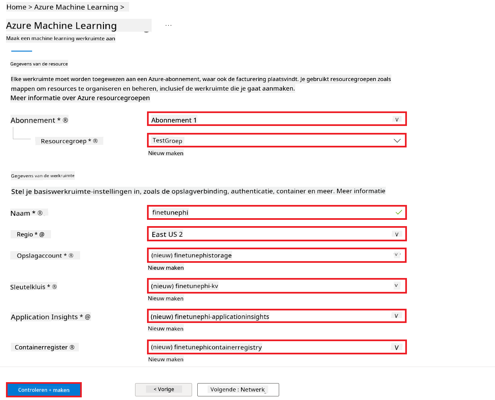

1. Selecteer **Review + Create**.

1. Selecteer **Create**.

### GPU-quotum aanvragen in Azure-abonnement

In dit E2E voorbeeld gebruik je de *Standard_NC24ads_A100_v4 GPU* voor fijn afstemmen, waarvoor een quotumaanvraag nodig is, en de *Standard_E4s_v3* CPU voor implementatie, waarvoor geen quotumaanvraag nodig is.

> [!NOTE]
>
> Alleen Pay-As-You-Go abonnementen (het standaard abonnements type) komen in aanmerking voor GPU-toewijzing; benefit abonnementen worden momenteel niet ondersteund.
>
> Voor gebruikers met benefit abonnementen (zoals Visual Studio Enterprise Subscription) of voor wie snel het fijn afstemmen en implementatieproces wil testen, biedt deze handleiding ook richtlijnen voor fijn afstemmen met een minimale dataset op een CPU. Het is echter belangrijk om te weten dat de resultaten van fijn afstemmen aanzienlijk beter zijn bij gebruik van een GPU met grotere datasets.

1. Bezoek [Azure ML Studio](https://ml.azure.com/home?wt.mc_id=studentamb_279723).

1. Voer de volgende stappen uit om het quotum voor *Standard NCADSA100v4 Family* aan te vragen:

    - Selecteer **Quota** in het tabblad aan de linkerkant.
    - Selecteer de **Virtual machine family** die je wilt gebruiken. Bijvoorbeeld, selecteer **Standard NCADSA100v4 Family Cluster Dedicated vCPUs**, waar de *Standard_NC24ads_A100_v4* GPU onder valt.
    - Selecteer **Request quota** in het navigatiemenu.

        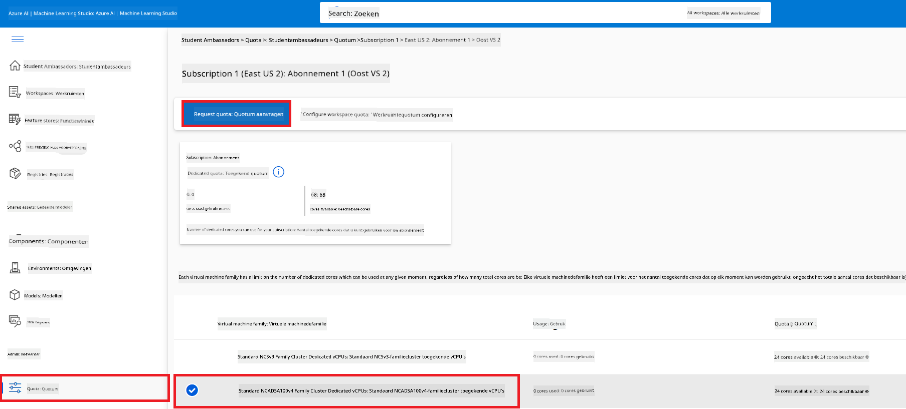

    - Vul op de pagina Request quota het gewenste aantal **New cores limit** in. Bijvoorbeeld 24.
    - Selecteer op de pagina Request quota **Submit** om het GPU-quotum aan te vragen.

> [!NOTE]
> Je kunt de juiste GPU of CPU kiezen op basis van je behoeften door te verwijzen naar de documentatie [Sizes for Virtual Machines in Azure](https://learn.microsoft.com/azure/virtual-machines/sizes/overview?tabs=breakdownseries%2Cgeneralsizelist%2Ccomputesizelist%2Cmemorysizelist%2Cstoragesizelist%2Cgpusizelist%2Cfpgasizelist%2Chpcsizelist).

### Roltoewijzing toevoegen

Om je modellen fijn af te stemmen en te implementeren, moet je eerst een User Assigned Managed Identity (UAI) aanmaken en deze de juiste machtigingen geven. Deze UAI wordt gebruikt voor authenticatie tijdens de implementatie.

#### User Assigned Managed Identity (UAI) aanmaken

1. Typ *managed identities* in de **zoekbalk** bovenaan de portalpagina en selecteer **Managed Identities** uit de opties die verschijnen.

    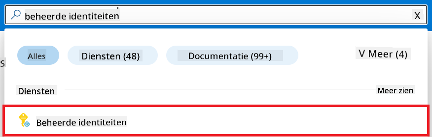

1. Selecteer **+ Create**.

    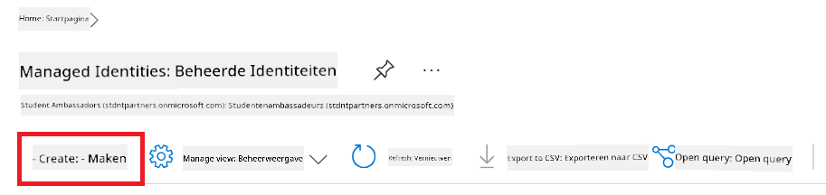

1. Voer de volgende taken uit:

    - Selecteer je Azure **Subscription**.
    - Selecteer de **Resource group** die je wilt gebruiken (maak er een nieuwe aan indien nodig).
    - Selecteer de **Regio** die je wilt gebruiken.
    - Voer een **Naam** in. Dit moet een unieke naam zijn.

1. Selecteer **Review + create**.

1. Selecteer **+ Create**.

#### Contributor roltoewijzing toevoegen aan Managed Identity

1. Navigeer naar de Managed Identity resource die je hebt aangemaakt.

1. Selecteer **Azure role assignments** in het tabblad aan de linkerkant.

1. Selecteer **+Add role assignment** in het navigatiemenu.

1. Voer op de pagina Add role assignment de volgende taken uit:
    - Stel de **Scope** in op **Resource group**.
    - Selecteer je Azure **Subscription**.
    - Selecteer de **Resource group** die je wilt gebruiken.
    - Selecteer de **Role** **Contributor**.

    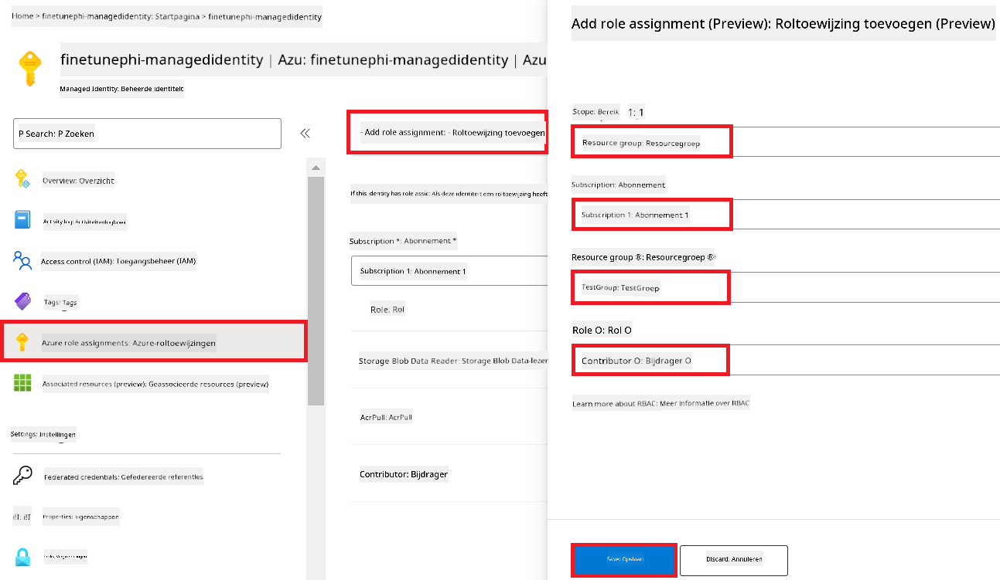

1. Selecteer **Save**.

#### Storage Blob Data Reader roltoewijzing toevoegen aan Managed Identity

1. Typ *storage accounts* in de **zoekbalk** bovenaan de portalpagina en selecteer **Storage accounts** uit de opties die verschijnen.

    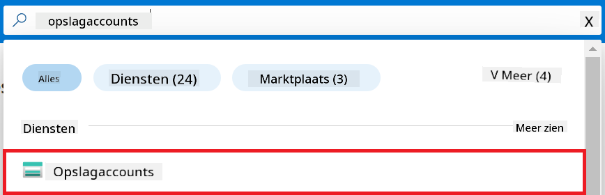

1. Selecteer de storage account die gekoppeld is aan de Azure Machine Learning workspace die je hebt aangemaakt. Bijvoorbeeld, *finetunephistorage*.

1. Voer de volgende stappen uit om naar de pagina Add role assignment te navigeren:

    - Navigeer naar de Azure Storage account die je hebt aangemaakt.
    - Selecteer **Access Control (IAM)** in het tabblad aan de linkerkant.
    - Selecteer **+ Add** in het navigatiemenu.
    - Selecteer **Add role assignment** in het navigatiemenu.

    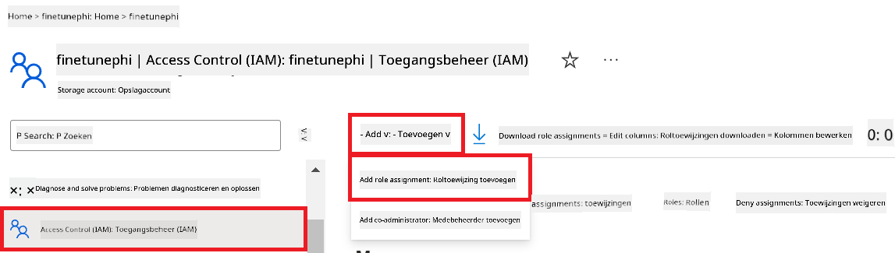

1. Voer op de pagina Add role assignment de volgende taken uit:

    - Typ op de Role-pagina *Storage Blob Data Reader* in de **zoekbalk** en selecteer **Storage Blob Data Reader** uit de opties die verschijnen.
    - Selecteer op de Role-pagina **Next**.
    - Selecteer op de Members-pagina **Assign access to** **Managed identity**.
    - Selecteer op de Members-pagina **+ Select members**.
    - Selecteer op de pagina Select managed identities je Azure **Subscription**.
    - Selecteer op de pagina Select managed identities de **Managed identity** onder **Manage Identity**.
    - Selecteer de Managed Identity die je hebt aangemaakt. Bijvoorbeeld, *finetunephi-managedidentity*.
    - Selecteer **Select**.

    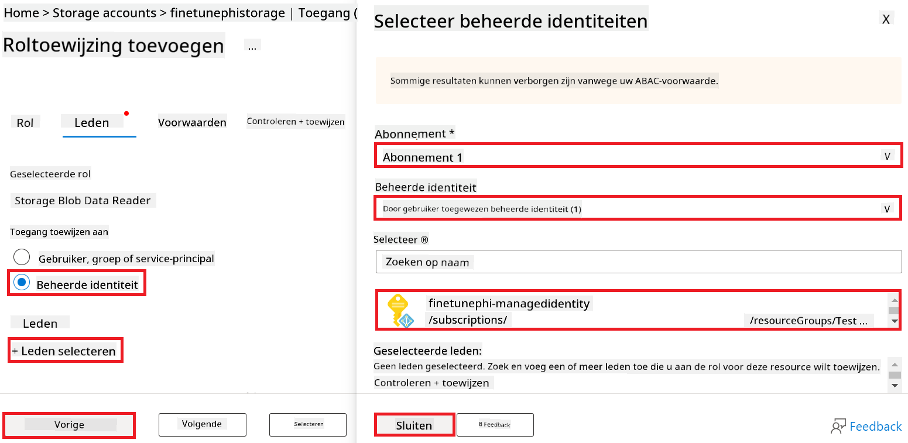

1. Selecteer **Review + assign**.

#### AcrPull roltoewijzing toevoegen aan Managed Identity

1. Typ *container registries* in de **zoekbalk** bovenaan de portalpagina en selecteer **Container registries** uit de opties die verschijnen.

    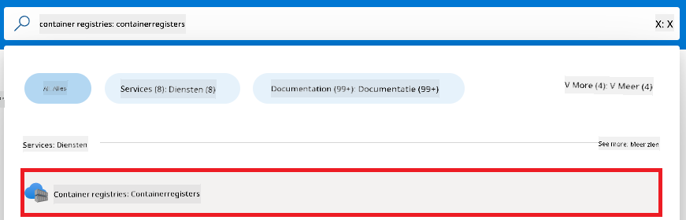

1. Selecteer de container registry die gekoppeld is aan de Azure Machine Learning workspace. Bijvoorbeeld, *finetunephicontainerregistries*

1. Voer de volgende stappen uit om naar de pagina Add role assignment te navigeren:

    - Selecteer **Access Control (IAM)** in het tabblad aan de linkerkant.
    - Selecteer **+ Add** in het navigatiemenu.
    - Selecteer **Add role assignment** in het navigatiemenu.

1. Voer op de pagina Add role assignment de volgende taken uit:

    - Typ op de Role-pagina *AcrPull* in de **zoekbalk** en selecteer **AcrPull** uit de opties die verschijnen.
    - Selecteer op de Role-pagina **Next**.
    - Selecteer op de Members-pagina **Assign access to** **Managed identity**.
    - Selecteer op de Members-pagina **+ Select members**.
    - Selecteer op de pagina Select managed identities je Azure **Subscription**.
    - Selecteer op de pagina Select managed identities de **Managed identity** onder **Manage Identity**.
    - Selecteer de Managed Identity die je hebt aangemaakt. Bijvoorbeeld, *finetunephi-managedidentity*.
    - Selecteer **Select**.
    - Selecteer **Review + assign**.

### Project opzetten

Nu ga je een map aanmaken om in te werken en een virtuele omgeving instellen om een programma te ontwikkelen dat met gebruikers communiceert en gebruikmaakt van opgeslagen chatgeschiedenis uit Azure Cosmos DB om zijn antwoorden te verbeteren.

#### Maak een map aan om in te werken

1. Open een terminalvenster en typ het volgende commando om een map genaamd *finetune-phi* aan te maken in het standaardpad.

    ```console
    mkdir finetune-phi
    ```

1. Typ het volgende commando in je terminal om naar de map *finetune-phi* te navigeren die je hebt aangemaakt.

    ```console
    cd finetune-phi
    ```

#### Maak een virtuele omgeving aan

1. Typ het volgende commando in je terminal om een virtuele omgeving aan te maken met de naam *.venv*.

    ```console
    python -m venv .venv
    ```

1. Typ het volgende commando in je terminal om de virtuele omgeving te activeren.

    ```console
    .venv\Scripts\activate.bat
    ```
> [!NOTE]
>
> Als het gelukt is, zou je *(.venv)* voor de opdrachtprompt moeten zien.
#### Installeer de benodigde pakketten

1. Typ de volgende opdrachten in je terminal om de benodigde pakketten te installeren.

    ```console
    pip install datasets==2.19.1
    pip install transformers==4.41.1
    pip install azure-ai-ml==1.16.0
    pip install torch==2.3.1
    pip install trl==0.9.4
    pip install promptflow==1.12.0
    ```

#### Maak projectbestanden aan

In deze oefening maak je de essentiële bestanden voor ons project aan. Deze bestanden bevatten scripts voor het downloaden van de dataset, het opzetten van de Azure Machine Learning-omgeving, het fine-tunen van het Phi-3 model en het uitrollen van het fijn-afgestelde model. Je maakt ook een *conda.yml* bestand aan om de fine-tuning omgeving in te stellen.

In deze oefening ga je:

- Een *download_dataset.py* bestand maken om de dataset te downloaden.
- Een *setup_ml.py* bestand maken om de Azure Machine Learning-omgeving op te zetten.
- Een *fine_tune.py* bestand maken in de map *finetuning_dir* om het Phi-3 model te fine-tunen met de dataset.
- Een *conda.yml* bestand maken om de fine-tuning omgeving in te stellen.
- Een *deploy_model.py* bestand maken om het fijn-afgestelde model uit te rollen.
- Een *integrate_with_promptflow.py* bestand maken om het fijn-afgestelde model te integreren en uit te voeren met Prompt flow.
- Een flow.dag.yml bestand maken om de workflowstructuur voor Prompt flow op te zetten.
- Een *config.py* bestand maken om Azure-informatie in te voeren.

> [!NOTE]
>
> Volledige mappenstructuur:
>
> ```text
> └── YourUserName
> .    └── finetune-phi
> .        ├── finetuning_dir
> .        │      └── fine_tune.py
> .        ├── conda.yml
> .        ├── config.py
> .        ├── deploy_model.py
> .        ├── download_dataset.py
> .        ├── flow.dag.yml
> .        ├── integrate_with_promptflow.py
> .        └── setup_ml.py
> ```

1. Open **Visual Studio Code**.

1. Selecteer **Bestand** in de menubalk.

1. Selecteer **Map openen**.

1. Selecteer de map *finetune-phi* die je hebt aangemaakt, deze bevindt zich op *C:\Users\yourUserName\finetune-phi*.

    

1. Klik in het linker paneel van Visual Studio Code met de rechtermuisknop en kies **Nieuw bestand** om een nieuw bestand aan te maken met de naam *download_dataset.py*.

1. Klik in het linker paneel van Visual Studio Code met de rechtermuisknop en kies **Nieuw bestand** om een nieuw bestand aan te maken met de naam *setup_ml.py*.

1. Klik in het linker paneel van Visual Studio Code met de rechtermuisknop en kies **Nieuw bestand** om een nieuw bestand aan te maken met de naam *deploy_model.py*.

    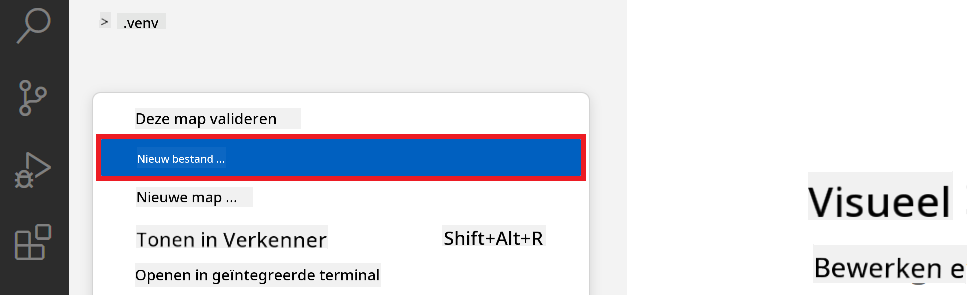

1. Klik in het linker paneel van Visual Studio Code met de rechtermuisknop en kies **Nieuwe map** om een nieuwe map aan te maken met de naam *finetuning_dir*.

1. Maak in de map *finetuning_dir* een nieuw bestand aan met de naam *fine_tune.py*.

#### Maak en configureer het *conda.yml* bestand

1. Klik in het linker paneel van Visual Studio Code met de rechtermuisknop en kies **Nieuw bestand** om een nieuw bestand aan te maken met de naam *conda.yml*.

1. Voeg de volgende code toe aan het *conda.yml* bestand om de fine-tuning omgeving voor het Phi-3 model in te stellen.

    ```yml
    name: phi-3-training-env
    channels:
      - defaults
      - conda-forge
    dependencies:
      - python=3.10
      - pip
      - numpy<2.0
      - pip:
          - torch==2.4.0
          - torchvision==0.19.0
          - trl==0.8.6
          - transformers==4.41
          - datasets==2.21.0
          - azureml-core==1.57.0
          - azure-storage-blob==12.19.0
          - azure-ai-ml==1.16
          - azure-identity==1.17.1
          - accelerate==0.33.0
          - mlflow==2.15.1
          - azureml-mlflow==1.57.0
    ```

#### Maak en configureer het *config.py* bestand

1. Klik in het linker paneel van Visual Studio Code met de rechtermuisknop en kies **Nieuw bestand** om een nieuw bestand aan te maken met de naam *config.py*.

1. Voeg de volgende code toe aan het *config.py* bestand om je Azure-informatie toe te voegen.

    ```python
    # Azure settings
    AZURE_SUBSCRIPTION_ID = "your_subscription_id"
    AZURE_RESOURCE_GROUP_NAME = "your_resource_group_name" # "TestGroup"

    # Azure Machine Learning settings
    AZURE_ML_WORKSPACE_NAME = "your_workspace_name" # "finetunephi-workspace"

    # Azure Managed Identity settings
    AZURE_MANAGED_IDENTITY_CLIENT_ID = "your_azure_managed_identity_client_id"
    AZURE_MANAGED_IDENTITY_NAME = "your_azure_managed_identity_name" # "finetunephi-mangedidentity"
    AZURE_MANAGED_IDENTITY_RESOURCE_ID = f"/subscriptions/{AZURE_SUBSCRIPTION_ID}/resourceGroups/{AZURE_RESOURCE_GROUP_NAME}/providers/Microsoft.ManagedIdentity/userAssignedIdentities/{AZURE_MANAGED_IDENTITY_NAME}"

    # Dataset file paths
    TRAIN_DATA_PATH = "data/train_data.jsonl"
    TEST_DATA_PATH = "data/test_data.jsonl"

    # Fine-tuned model settings
    AZURE_MODEL_NAME = "your_fine_tuned_model_name" # "finetune-phi-model"
    AZURE_ENDPOINT_NAME = "your_fine_tuned_model_endpoint_name" # "finetune-phi-endpoint"
    AZURE_DEPLOYMENT_NAME = "your_fine_tuned_model_deployment_name" # "finetune-phi-deployment"

    AZURE_ML_API_KEY = "your_fine_tuned_model_api_key"
    AZURE_ML_ENDPOINT = "your_fine_tuned_model_endpoint_uri" # "https://{your-endpoint-name}.{your-region}.inference.ml.azure.com/score"
    ```

#### Voeg Azure-omgevingsvariabelen toe

1. Voer de volgende stappen uit om de Azure Subscription ID toe te voegen:

    - Typ *subscriptions* in de **zoekbalk** bovenaan de portalpagina en selecteer **Subscriptions** uit de opties die verschijnen.
    - Selecteer de Azure Subscription die je momenteel gebruikt.
    - Kopieer en plak je Subscription ID in het *config.py* bestand.

    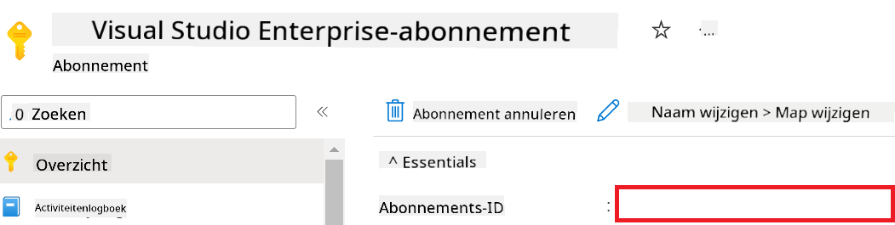

1. Voer de volgende stappen uit om de Azure Workspace Naam toe te voegen:

    - Navigeer naar de Azure Machine Learning resource die je hebt aangemaakt.
    - Kopieer en plak je accountnaam in het *config.py* bestand.

    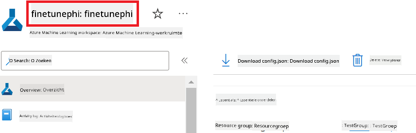

1. Voer de volgende stappen uit om de Azure Resource Group Naam toe te voegen:

    - Navigeer naar de Azure Machine Learning resource die je hebt aangemaakt.
    - Kopieer en plak je Azure Resource Group Naam in het *config.py* bestand.

    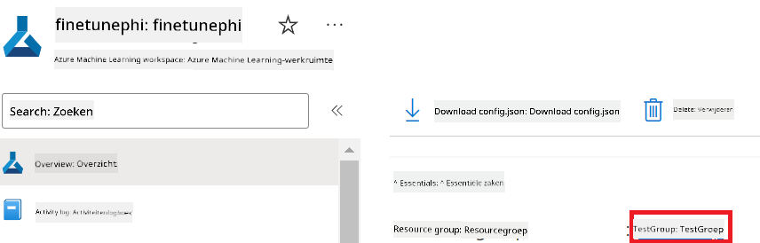

2. Voer de volgende stappen uit om de Azure Managed Identity naam toe te voegen:

    - Navigeer naar de Managed Identities resource die je hebt aangemaakt.
    - Kopieer en plak je Azure Managed Identity naam in het *config.py* bestand.

    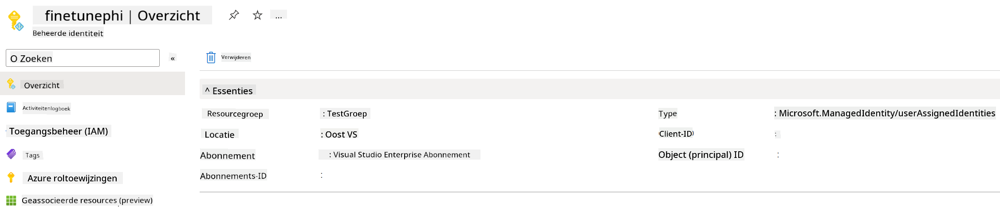

### Bereid dataset voor fine-tuning voor

In deze oefening ga je het *download_dataset.py* bestand uitvoeren om de *ULTRACHAT_200k* datasets te downloaden naar je lokale omgeving. Vervolgens gebruik je deze datasets om het Phi-3 model te fine-tunen in Azure Machine Learning.

#### Download je dataset met *download_dataset.py*

1. Open het *download_dataset.py* bestand in Visual Studio Code.

1. Voeg de volgende code toe aan *download_dataset.py*.

    ```python
    import json
    import os
    from datasets import load_dataset
    from config import (
        TRAIN_DATA_PATH,
        TEST_DATA_PATH)

    def load_and_split_dataset(dataset_name, config_name, split_ratio):
        """
        Load and split a dataset.
        """
        # Load the dataset with the specified name, configuration, and split ratio
        dataset = load_dataset(dataset_name, config_name, split=split_ratio)
        print(f"Original dataset size: {len(dataset)}")
        
        # Split the dataset into train and test sets (80% train, 20% test)
        split_dataset = dataset.train_test_split(test_size=0.2)
        print(f"Train dataset size: {len(split_dataset['train'])}")
        print(f"Test dataset size: {len(split_dataset['test'])}")
        
        return split_dataset

    def save_dataset_to_jsonl(dataset, filepath):
        """
        Save a dataset to a JSONL file.
        """
        # Create the directory if it does not exist
        os.makedirs(os.path.dirname(filepath), exist_ok=True)
        
        # Open the file in write mode
        with open(filepath, 'w', encoding='utf-8') as f:
            # Iterate over each record in the dataset
            for record in dataset:
                # Dump the record as a JSON object and write it to the file
                json.dump(record, f)
                # Write a newline character to separate records
                f.write('\n')
        
        print(f"Dataset saved to {filepath}")

    def main():
        """
        Main function to load, split, and save the dataset.
        """
        # Load and split the ULTRACHAT_200k dataset with a specific configuration and split ratio
        dataset = load_and_split_dataset("HuggingFaceH4/ultrachat_200k", 'default', 'train_sft[:1%]')
        
        # Extract the train and test datasets from the split
        train_dataset = dataset['train']
        test_dataset = dataset['test']

        # Save the train dataset to a JSONL file
        save_dataset_to_jsonl(train_dataset, TRAIN_DATA_PATH)
        
        # Save the test dataset to a separate JSONL file
        save_dataset_to_jsonl(test_dataset, TEST_DATA_PATH)

    if __name__ == "__main__":
        main()

    ```

> [!TIP]
>
> **Advies voor fine-tuning met een minimale dataset op een CPU**
>
> Als je een CPU wilt gebruiken voor fine-tuning, is deze aanpak ideaal voor gebruikers met benefit subscriptions (zoals Visual Studio Enterprise Subscription) of om snel het fine-tunen en uitrollen te testen.
>
> Vervang `dataset = load_and_split_dataset("HuggingFaceH4/ultrachat_200k", 'default', 'train_sft[:1%]')` door `dataset = load_and_split_dataset("HuggingFaceH4/ultrachat_200k", 'default', 'train_sft[:10]')`
>

1. Typ de volgende opdracht in je terminal om het script uit te voeren en de dataset naar je lokale omgeving te downloaden.

    ```console
    python download_data.py
    ```

1. Controleer of de datasets succesvol zijn opgeslagen in je lokale *finetune-phi/data* map.

> [!NOTE]
>
> **Dataset grootte en fine-tuning tijd**
>
> In dit E2E voorbeeld gebruik je slechts 1% van de dataset (`train_sft[:1%]`). Dit verkleint de hoeveelheid data aanzienlijk, waardoor zowel het uploaden als het fine-tunen sneller gaat. Je kunt het percentage aanpassen om de juiste balans te vinden tussen trainingstijd en modelprestaties. Het gebruik van een kleinere subset van de dataset verkort de fine-tuning tijd, wat het proces beter beheersbaar maakt voor een E2E voorbeeld.

## Scenario 2: Fine-tune het Phi-3 model en rol uit in Azure Machine Learning Studio

### Stel Azure CLI in

Je moet Azure CLI instellen om je omgeving te authenticeren. Azure CLI stelt je in staat om Azure-resources direct vanaf de opdrachtregel te beheren en levert de benodigde credentials zodat Azure Machine Learning toegang heeft tot deze resources. Om te beginnen, installeer [Azure CLI](https://learn.microsoft.com/cli/azure/install-azure-cli)

1. Open een terminalvenster en typ de volgende opdracht om in te loggen op je Azure-account.

    ```console
    az login
    ```

1. Selecteer je Azure-account om te gebruiken.

1. Selecteer je Azure-subscriptie om te gebruiken.

    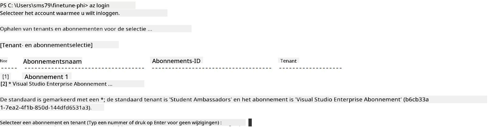

> [!TIP]
>
> Als je problemen hebt met inloggen bij Azure, probeer dan een apparaatcode te gebruiken. Open een terminalvenster en typ de volgende opdracht om in te loggen op je Azure-account:
>
> ```console
> az login --use-device-code
> ```
>

### Fine-tune het Phi-3 model

In deze oefening ga je het Phi-3 model fine-tunen met de meegeleverde dataset. Eerst definieer je het fine-tuning proces in het *fine_tune.py* bestand. Daarna configureer je de Azure Machine Learning-omgeving en start je het fine-tuning proces door het *setup_ml.py* bestand uit te voeren. Dit script zorgt ervoor dat het fine-tunen plaatsvindt binnen de Azure Machine Learning-omgeving.

Door *setup_ml.py* uit te voeren, start je het fine-tuning proces in de Azure Machine Learning-omgeving.

#### Voeg code toe aan het *fine_tune.py* bestand

1. Navigeer naar de map *finetuning_dir* en open het *fine_tune.py* bestand in Visual Studio Code.

1. Voeg de volgende code toe aan *fine_tune.py*.

    ```python
    import argparse
    import sys
    import logging
    import os
    from datasets import load_dataset
    import torch
    import mlflow
    from transformers import AutoModelForCausalLM, AutoTokenizer, TrainingArguments
    from trl import SFTTrainer

    # To avoid the INVALID_PARAMETER_VALUE error in MLflow, disable MLflow integration
    os.environ["DISABLE_MLFLOW_INTEGRATION"] = "True"

    # Logging setup
    logging.basicConfig(
        format="%(asctime)s - %(levelname)s - %(name)s - %(message)s",
        datefmt="%Y-%m-%d %H:%M:%S",
        handlers=[logging.StreamHandler(sys.stdout)],
        level=logging.WARNING
    )
    logger = logging.getLogger(__name__)

    def initialize_model_and_tokenizer(model_name, model_kwargs):
        """
        Initialize the model and tokenizer with the given pretrained model name and arguments.
        """
        model = AutoModelForCausalLM.from_pretrained(model_name, **model_kwargs)
        tokenizer = AutoTokenizer.from_pretrained(model_name)
        tokenizer.model_max_length = 2048
        tokenizer.pad_token = tokenizer.unk_token
        tokenizer.pad_token_id = tokenizer.convert_tokens_to_ids(tokenizer.pad_token)
        tokenizer.padding_side = 'right'
        return model, tokenizer

    def apply_chat_template(example, tokenizer):
        """
        Apply a chat template to tokenize messages in the example.
        """
        messages = example["messages"]
        if messages[0]["role"] != "system":
            messages.insert(0, {"role": "system", "content": ""})
        example["text"] = tokenizer.apply_chat_template(
            messages, tokenize=False, add_generation_prompt=False
        )
        return example

    def load_and_preprocess_data(train_filepath, test_filepath, tokenizer):
        """
        Load and preprocess the dataset.
        """
        train_dataset = load_dataset('json', data_files=train_filepath, split='train')
        test_dataset = load_dataset('json', data_files=test_filepath, split='train')
        column_names = list(train_dataset.features)

        train_dataset = train_dataset.map(
            apply_chat_template,
            fn_kwargs={"tokenizer": tokenizer},
            num_proc=10,
            remove_columns=column_names,
            desc="Applying chat template to train dataset",
        )

        test_dataset = test_dataset.map(
            apply_chat_template,
            fn_kwargs={"tokenizer": tokenizer},
            num_proc=10,
            remove_columns=column_names,
            desc="Applying chat template to test dataset",
        )

        return train_dataset, test_dataset

    def train_and_evaluate_model(train_dataset, test_dataset, model, tokenizer, output_dir):
        """
        Train and evaluate the model.
        """
        training_args = TrainingArguments(
            bf16=True,
            do_eval=True,
            output_dir=output_dir,
            eval_strategy="epoch",
            learning_rate=5.0e-06,
            logging_steps=20,
            lr_scheduler_type="cosine",
            num_train_epochs=3,
            overwrite_output_dir=True,
            per_device_eval_batch_size=4,
            per_device_train_batch_size=4,
            remove_unused_columns=True,
            save_steps=500,
            seed=0,
            gradient_checkpointing=True,
            gradient_accumulation_steps=1,
            warmup_ratio=0.2,
        )

        trainer = SFTTrainer(
            model=model,
            args=training_args,
            train_dataset=train_dataset,
            eval_dataset=test_dataset,
            max_seq_length=2048,
            dataset_text_field="text",
            tokenizer=tokenizer,
            packing=True
        )

        train_result = trainer.train()
        trainer.log_metrics("train", train_result.metrics)

        mlflow.transformers.log_model(
            transformers_model={"model": trainer.model, "tokenizer": tokenizer},
            artifact_path=output_dir,
        )

        tokenizer.padding_side = 'left'
        eval_metrics = trainer.evaluate()
        eval_metrics["eval_samples"] = len(test_dataset)
        trainer.log_metrics("eval", eval_metrics)

    def main(train_file, eval_file, model_output_dir):
        """
        Main function to fine-tune the model.
        """
        model_kwargs = {
            "use_cache": False,
            "trust_remote_code": True,
            "torch_dtype": torch.bfloat16,
            "device_map": None,
            "attn_implementation": "eager"
        }

        # pretrained_model_name = "microsoft/Phi-3-mini-4k-instruct"
        pretrained_model_name = "microsoft/Phi-3.5-mini-instruct"

        with mlflow.start_run():
            model, tokenizer = initialize_model_and_tokenizer(pretrained_model_name, model_kwargs)
            train_dataset, test_dataset = load_and_preprocess_data(train_file, eval_file, tokenizer)
            train_and_evaluate_model(train_dataset, test_dataset, model, tokenizer, model_output_dir)

    if __name__ == "__main__":
        parser = argparse.ArgumentParser()
        parser.add_argument("--train-file", type=str, required=True, help="Path to the training data")
        parser.add_argument("--eval-file", type=str, required=True, help="Path to the evaluation data")
        parser.add_argument("--model_output_dir", type=str, required=True, help="Directory to save the fine-tuned model")
        args = parser.parse_args()
        main(args.train_file, args.eval_file, args.model_output_dir)

    ```

1. Sla het *fine_tune.py* bestand op en sluit het.

> [!TIP]
> **Je kunt ook het Phi-3.5 model fine-tunen**
>
> In het *fine_tune.py* bestand kun je de waarde van `pretrained_model_name` wijzigen van `"microsoft/Phi-3-mini-4k-instruct"` naar elk model dat je wilt fine-tunen. Bijvoorbeeld, als je het verandert naar `"microsoft/Phi-3.5-mini-instruct"`, gebruik je het Phi-3.5-mini-instruct model voor fine-tuning. Om het model te vinden en de naam te gebruiken die je wilt, bezoek [Hugging Face](https://huggingface.co/), zoek het gewenste model en kopieer de naam naar het `pretrained_model_name` veld in je script.
>
> :::image type="content" source="../../imgs/03/FineTuning-PromptFlow/finetunephi3.5.png" alt-text="Fine tune Phi-3.5.":::
>

#### Voeg code toe aan het *setup_ml.py* bestand

1. Open het *setup_ml.py* bestand in Visual Studio Code.

1. Voeg de volgende code toe aan *setup_ml.py*.

    ```python
    import logging
    from azure.ai.ml import MLClient, command, Input
    from azure.ai.ml.entities import Environment, AmlCompute
    from azure.identity import AzureCliCredential
    from config import (
        AZURE_SUBSCRIPTION_ID,
        AZURE_RESOURCE_GROUP_NAME,
        AZURE_ML_WORKSPACE_NAME,
        TRAIN_DATA_PATH,
        TEST_DATA_PATH
    )

    # Constants

    # Uncomment the following lines to use a CPU instance for training
    # COMPUTE_INSTANCE_TYPE = "Standard_E16s_v3" # cpu
    # COMPUTE_NAME = "cpu-e16s-v3"
    # DOCKER_IMAGE_NAME = "mcr.microsoft.com/azureml/openmpi4.1.0-ubuntu20.04:latest"

    # Uncomment the following lines to use a GPU instance for training
    COMPUTE_INSTANCE_TYPE = "Standard_NC24ads_A100_v4"
    COMPUTE_NAME = "gpu-nc24s-a100-v4"
    DOCKER_IMAGE_NAME = "mcr.microsoft.com/azureml/curated/acft-hf-nlp-gpu:59"

    CONDA_FILE = "conda.yml"
    LOCATION = "eastus2" # Replace with the location of your compute cluster
    FINETUNING_DIR = "./finetuning_dir" # Path to the fine-tuning script
    TRAINING_ENV_NAME = "phi-3-training-environment" # Name of the training environment
    MODEL_OUTPUT_DIR = "./model_output" # Path to the model output directory in azure ml

    # Logging setup to track the process
    logger = logging.getLogger(__name__)
    logging.basicConfig(
        format="%(asctime)s - %(levelname)s - %(name)s - %(message)s",
        datefmt="%Y-%m-%d %H:%M:%S",
        level=logging.WARNING
    )

    def get_ml_client():
        """
        Initialize the ML Client using Azure CLI credentials.
        """
        credential = AzureCliCredential()
        return MLClient(credential, AZURE_SUBSCRIPTION_ID, AZURE_RESOURCE_GROUP_NAME, AZURE_ML_WORKSPACE_NAME)

    def create_or_get_environment(ml_client):
        """
        Create or update the training environment in Azure ML.
        """
        env = Environment(
            image=DOCKER_IMAGE_NAME,  # Docker image for the environment
            conda_file=CONDA_FILE,  # Conda environment file
            name=TRAINING_ENV_NAME,  # Name of the environment
        )
        return ml_client.environments.create_or_update(env)

    def create_or_get_compute_cluster(ml_client, compute_name, COMPUTE_INSTANCE_TYPE, location):
        """
        Create or update the compute cluster in Azure ML.
        """
        try:
            compute_cluster = ml_client.compute.get(compute_name)
            logger.info(f"Compute cluster '{compute_name}' already exists. Reusing it for the current run.")
        except Exception:
            logger.info(f"Compute cluster '{compute_name}' does not exist. Creating a new one with size {COMPUTE_INSTANCE_TYPE}.")
            compute_cluster = AmlCompute(
                name=compute_name,
                size=COMPUTE_INSTANCE_TYPE,
                location=location,
                tier="Dedicated",  # Tier of the compute cluster
                min_instances=0,  # Minimum number of instances
                max_instances=1  # Maximum number of instances
            )
            ml_client.compute.begin_create_or_update(compute_cluster).wait()  # Wait for the cluster to be created
        return compute_cluster

    def create_fine_tuning_job(env, compute_name):
        """
        Set up the fine-tuning job in Azure ML.
        """
        return command(
            code=FINETUNING_DIR,  # Path to fine_tune.py
            command=(
                "python fine_tune.py "
                "--train-file ${{inputs.train_file}} "
                "--eval-file ${{inputs.eval_file}} "
                "--model_output_dir ${{inputs.model_output}}"
            ),
            environment=env,  # Training environment
            compute=compute_name,  # Compute cluster to use
            inputs={
                "train_file": Input(type="uri_file", path=TRAIN_DATA_PATH),  # Path to the training data file
                "eval_file": Input(type="uri_file", path=TEST_DATA_PATH),  # Path to the evaluation data file
                "model_output": MODEL_OUTPUT_DIR
            }
        )

    def main():
        """
        Main function to set up and run the fine-tuning job in Azure ML.
        """
        # Initialize ML Client
        ml_client = get_ml_client()

        # Create Environment
        env = create_or_get_environment(ml_client)
        
        # Create or get existing compute cluster
        create_or_get_compute_cluster(ml_client, COMPUTE_NAME, COMPUTE_INSTANCE_TYPE, LOCATION)

        # Create and Submit Fine-Tuning Job
        job = create_fine_tuning_job(env, COMPUTE_NAME)
        returned_job = ml_client.jobs.create_or_update(job)  # Submit the job
        ml_client.jobs.stream(returned_job.name)  # Stream the job logs
        
        # Capture the job name
        job_name = returned_job.name
        print(f"Job name: {job_name}")

    if __name__ == "__main__":
        main()

    ```

1. Vervang `COMPUTE_INSTANCE_TYPE`, `COMPUTE_NAME` en `LOCATION` door jouw specifieke gegevens.

    ```python
   # Uncomment the following lines to use a GPU instance for training
    COMPUTE_INSTANCE_TYPE = "Standard_NC24ads_A100_v4"
    COMPUTE_NAME = "gpu-nc24s-a100-v4"
    ...
    LOCATION = "eastus2" # Replace with the location of your compute cluster
    ```

> [!TIP]
>
> **Advies voor fine-tuning met een minimale dataset op een CPU**
>
> Als je een CPU wilt gebruiken voor fine-tuning, is deze aanpak ideaal voor gebruikers met benefit subscriptions (zoals Visual Studio Enterprise Subscription) of om snel het fine-tunen en uitrollen te testen.
>
> 1. Open het *setup_ml* bestand.
> 1. Vervang `COMPUTE_INSTANCE_TYPE`, `COMPUTE_NAME` en `DOCKER_IMAGE_NAME` door het volgende. Als je geen toegang hebt tot *Standard_E16s_v3*, kun je een gelijkwaardige CPU-instance gebruiken of een nieuwe quota aanvragen.
> 1. Vervang `LOCATION` door jouw specifieke gegevens.
>
>    ```python
>    # Uncomment the following lines to use a CPU instance for training
>    COMPUTE_INSTANCE_TYPE = "Standard_E16s_v3" # cpu
>    COMPUTE_NAME = "cpu-e16s-v3"
>    DOCKER_IMAGE_NAME = "mcr.microsoft.com/azureml/openmpi4.1.0-ubuntu20.04:latest"
>    LOCATION = "eastus2" # Replace with the location of your compute cluster
>    ```
>

1. Typ de volgende opdracht om het *setup_ml.py* script uit te voeren en het fine-tuning proces in Azure Machine Learning te starten.

    ```python
    python setup_ml.py
    ```

1. In deze oefening heb je het Phi-3 model succesvol gefinetuned met Azure Machine Learning. Door het *setup_ml.py* script uit te voeren, heb je de Azure Machine Learning-omgeving opgezet en het fine-tuning proces gestart dat is gedefinieerd in het *fine_tune.py* bestand. Houd er rekening mee dat het fine-tuning proces enige tijd kan duren. Na het uitvoeren van de `python setup_ml.py` opdracht moet je wachten tot het proces is voltooid. Je kunt de status van de fine-tuning taak volgen via de link die in de terminal wordt weergegeven naar de Azure Machine Learning portal.

    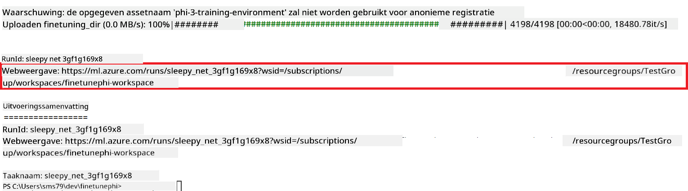

### Rol het fijn-afgestelde model uit

Om het fijn-afgestelde Phi-3 model te integreren met Prompt Flow, moet je het model uitrollen zodat het toegankelijk is voor realtime inferentie. Dit proces omvat het registreren van het model, het aanmaken van een online endpoint en het uitrollen van het model.

#### Stel de modelnaam, endpointnaam en deploymentnaam in voor uitrol

1. Open het *config.py* bestand.

1. Vervang `AZURE_MODEL_NAME = "your_fine_tuned_model_name"` door de gewenste naam voor je model.

1. Vervang `AZURE_ENDPOINT_NAME = "your_fine_tuned_model_endpoint_name"` door de gewenste naam voor je endpoint.

1. Vervang `AZURE_DEPLOYMENT_NAME = "your_fine_tuned_model_deployment_name"` door de gewenste naam voor je deployment.

#### Voeg code toe aan het *deploy_model.py* bestand

Het uitvoeren van het *deploy_model.py* bestand automatiseert het volledige uitrolproces. Het registreert het model, maakt een endpoint aan en voert de uitrol uit op basis van de instellingen in het *config.py* bestand, waaronder de modelnaam, endpointnaam en deploymentnaam.

1. Open het *deploy_model.py* bestand in Visual Studio Code.

1. Voeg de volgende code toe aan *deploy_model.py*.

    ```python
    import logging
    from azure.identity import AzureCliCredential
    from azure.ai.ml import MLClient
    from azure.ai.ml.entities import Model, ProbeSettings, ManagedOnlineEndpoint, ManagedOnlineDeployment, IdentityConfiguration, ManagedIdentityConfiguration, OnlineRequestSettings
    from azure.ai.ml.constants import AssetTypes

    # Configuration imports
    from config import (
        AZURE_SUBSCRIPTION_ID,
        AZURE_RESOURCE_GROUP_NAME,
        AZURE_ML_WORKSPACE_NAME,
        AZURE_MANAGED_IDENTITY_RESOURCE_ID,
        AZURE_MANAGED_IDENTITY_CLIENT_ID,
        AZURE_MODEL_NAME,
        AZURE_ENDPOINT_NAME,
        AZURE_DEPLOYMENT_NAME
    )

    # Constants
    JOB_NAME = "your-job-name"
    COMPUTE_INSTANCE_TYPE = "Standard_E4s_v3"

    deployment_env_vars = {
        "SUBSCRIPTION_ID": AZURE_SUBSCRIPTION_ID,
        "RESOURCE_GROUP_NAME": AZURE_RESOURCE_GROUP_NAME,
        "UAI_CLIENT_ID": AZURE_MANAGED_IDENTITY_CLIENT_ID,
    }

    # Logging setup
    logging.basicConfig(
        format="%(asctime)s - %(levelname)s - %(name)s - %(message)s",
        datefmt="%Y-%m-%d %H:%M:%S",
        level=logging.DEBUG
    )
    logger = logging.getLogger(__name__)

    def get_ml_client():
        """Initialize and return the ML Client."""
        credential = AzureCliCredential()
        return MLClient(credential, AZURE_SUBSCRIPTION_ID, AZURE_RESOURCE_GROUP_NAME, AZURE_ML_WORKSPACE_NAME)

    def register_model(ml_client, model_name, job_name):
        """Register a new model."""
        model_path = f"azureml://jobs/{job_name}/outputs/artifacts/paths/model_output"
        logger.info(f"Registering model {model_name} from job {job_name} at path {model_path}.")
        run_model = Model(
            path=model_path,
            name=model_name,
            description="Model created from run.",
            type=AssetTypes.MLFLOW_MODEL,
        )
        model = ml_client.models.create_or_update(run_model)
        logger.info(f"Registered model ID: {model.id}")
        return model

    def delete_existing_endpoint(ml_client, endpoint_name):
        """Delete existing endpoint if it exists."""
        try:
            endpoint_result = ml_client.online_endpoints.get(name=endpoint_name)
            logger.info(f"Deleting existing endpoint {endpoint_name}.")
            ml_client.online_endpoints.begin_delete(name=endpoint_name).result()
            logger.info(f"Deleted existing endpoint {endpoint_name}.")
        except Exception as e:
            logger.info(f"No existing endpoint {endpoint_name} found to delete: {e}")

    def create_or_update_endpoint(ml_client, endpoint_name, description=""):
        """Create or update an endpoint."""
        delete_existing_endpoint(ml_client, endpoint_name)
        logger.info(f"Creating new endpoint {endpoint_name}.")
        endpoint = ManagedOnlineEndpoint(
            name=endpoint_name,
            description=description,
            identity=IdentityConfiguration(
                type="user_assigned",
                user_assigned_identities=[ManagedIdentityConfiguration(resource_id=AZURE_MANAGED_IDENTITY_RESOURCE_ID)]
            )
        )
        endpoint_result = ml_client.online_endpoints.begin_create_or_update(endpoint).result()
        logger.info(f"Created new endpoint {endpoint_name}.")
        return endpoint_result

    def create_or_update_deployment(ml_client, endpoint_name, deployment_name, model):
        """Create or update a deployment."""

        logger.info(f"Creating deployment {deployment_name} for endpoint {endpoint_name}.")
        deployment = ManagedOnlineDeployment(
            name=deployment_name,
            endpoint_name=endpoint_name,
            model=model.id,
            instance_type=COMPUTE_INSTANCE_TYPE,
            instance_count=1,
            environment_variables=deployment_env_vars,
            request_settings=OnlineRequestSettings(
                max_concurrent_requests_per_instance=3,
                request_timeout_ms=180000,
                max_queue_wait_ms=120000
            ),
            liveness_probe=ProbeSettings(
                failure_threshold=30,
                success_threshold=1,
                period=100,
                initial_delay=500,
            ),
            readiness_probe=ProbeSettings(
                failure_threshold=30,
                success_threshold=1,
                period=100,
                initial_delay=500,
            ),
        )
        deployment_result = ml_client.online_deployments.begin_create_or_update(deployment).result()
        logger.info(f"Created deployment {deployment.name} for endpoint {endpoint_name}.")
        return deployment_result

    def set_traffic_to_deployment(ml_client, endpoint_name, deployment_name):
        """Set traffic to the specified deployment."""
        try:
            # Fetch the current endpoint details
            endpoint = ml_client.online_endpoints.get(name=endpoint_name)
            
            # Log the current traffic allocation for debugging
            logger.info(f"Current traffic allocation: {endpoint.traffic}")
            
            # Set the traffic allocation for the deployment
            endpoint.traffic = {deployment_name: 100}
            
            # Update the endpoint with the new traffic allocation
            endpoint_poller = ml_client.online_endpoints.begin_create_or_update(endpoint)
            updated_endpoint = endpoint_poller.result()
            
            # Log the updated traffic allocation for debugging
            logger.info(f"Updated traffic allocation: {updated_endpoint.traffic}")
            logger.info(f"Set traffic to deployment {deployment_name} at endpoint {endpoint_name}.")
            return updated_endpoint
        except Exception as e:
            # Log any errors that occur during the process
            logger.error(f"Failed to set traffic to deployment: {e}")
            raise


    def main():
        ml_client = get_ml_client()

        registered_model = register_model(ml_client, AZURE_MODEL_NAME, JOB_NAME)
        logger.info(f"Registered model ID: {registered_model.id}")

        endpoint = create_or_update_endpoint(ml_client, AZURE_ENDPOINT_NAME, "Endpoint for finetuned Phi-3 model")
        logger.info(f"Endpoint {AZURE_ENDPOINT_NAME} is ready.")

        try:
            deployment = create_or_update_deployment(ml_client, AZURE_ENDPOINT_NAME, AZURE_DEPLOYMENT_NAME, registered_model)
            logger.info(f"Deployment {AZURE_DEPLOYMENT_NAME} is created for endpoint {AZURE_ENDPOINT_NAME}.")

            set_traffic_to_deployment(ml_client, AZURE_ENDPOINT_NAME, AZURE_DEPLOYMENT_NAME)
            logger.info(f"Traffic is set to deployment {AZURE_DEPLOYMENT_NAME} at endpoint {AZURE_ENDPOINT_NAME}.")
        except Exception as e:
            logger.error(f"Failed to create or update deployment: {e}")

    if __name__ == "__main__":
        main()

    ```

1. Voer de volgende stappen uit om de `JOB_NAME` te achterhalen:

    - Navigeer naar de Azure Machine Learning resource die je hebt aangemaakt.
    - Selecteer **Studio web URL** om de Azure Machine Learning workspace te openen.
    - Selecteer **Jobs** in het linker tabblad.
    - Selecteer het experiment voor fine-tuning, bijvoorbeeld *finetunephi*.
    - Selecteer de job die je hebt aangemaakt.
- Kopieer en plak je jobnaam in `JOB_NAME = "your-job-name"` in het *deploy_model.py* bestand.

1. Vervang `COMPUTE_INSTANCE_TYPE` door jouw specifieke gegevens.

1. Typ het volgende commando om het *deploy_model.py* script uit te voeren en het deploymentproces in Azure Machine Learning te starten.

    ```python
    python deploy_model.py
    ```


> [!WARNING]
> Om extra kosten op je account te voorkomen, zorg ervoor dat je de aangemaakte endpoint verwijdert in de Azure Machine Learning workspace.
>

#### Controleer de status van de deployment in Azure Machine Learning Workspace

1. Bezoek [Azure ML Studio](https://ml.azure.com/home?wt.mc_id=studentamb_279723).

1. Navigeer naar de Azure Machine Learning workspace die je hebt aangemaakt.

1. Selecteer **Studio web URL** om de Azure Machine Learning workspace te openen.

1. Selecteer **Endpoints** in het tabblad aan de linkerkant.

    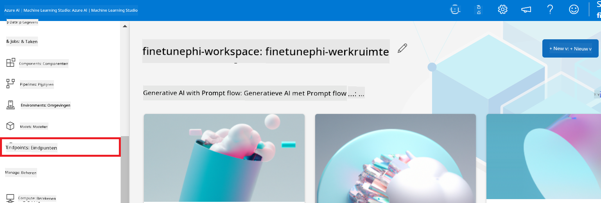

2. Selecteer de endpoint die je hebt aangemaakt.

    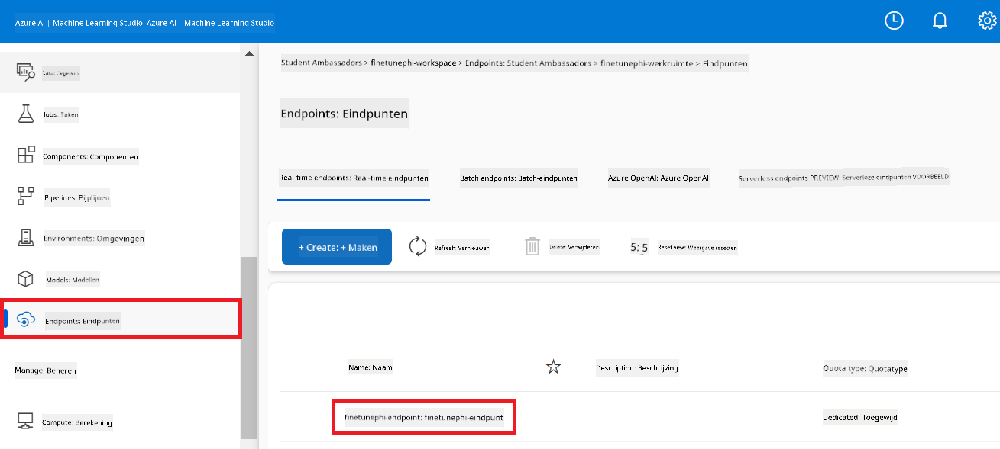

3. Op deze pagina kun je de endpoints beheren die tijdens het deploymentproces zijn aangemaakt.

## Scenario 3: Integreren met Prompt flow en chatten met je custom model

### Integreer het custom Phi-3 model met Prompt flow

Nadat je je fine-tuned model succesvol hebt gedeployed, kun je het nu integreren met Prompt flow om je model te gebruiken in realtime toepassingen, waarmee je diverse interactieve taken kunt uitvoeren met je custom Phi-3 model.

#### Stel de api key en endpoint uri in van het fine-tuned Phi-3 model

1. Navigeer naar de Azure Machine Learning workspace die je hebt aangemaakt.  
1. Selecteer **Endpoints** in het tabblad aan de linkerkant.  
1. Selecteer de endpoint die je hebt aangemaakt.  
1. Selecteer **Consume** in het navigatiemenu.  
1. Kopieer en plak je **REST endpoint** in het *config.py* bestand, waarbij je `AZURE_ML_ENDPOINT = "your_fine_tuned_model_endpoint_uri"` vervangt door je **REST endpoint**.  
1. Kopieer en plak je **Primary key** in het *config.py* bestand, waarbij je `AZURE_ML_API_KEY = "your_fine_tuned_model_api_key"` vervangt door je **Primary key**.

    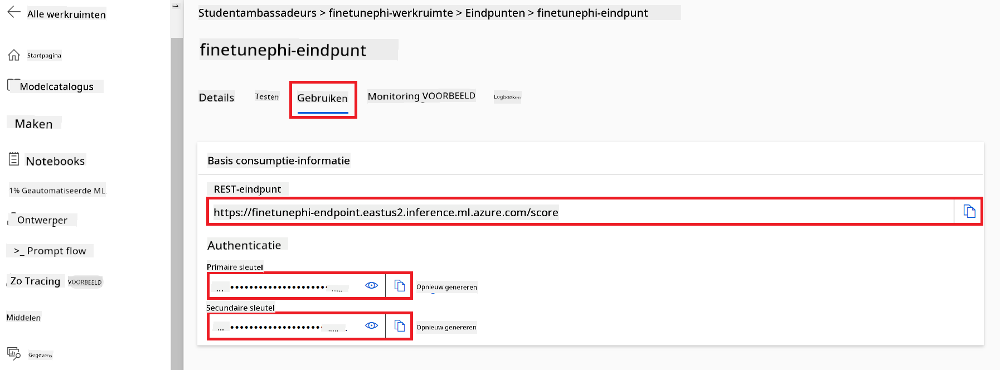

#### Voeg code toe aan het *flow.dag.yml* bestand

1. Open het *flow.dag.yml* bestand in Visual Studio Code.

1. Voeg de volgende code toe aan *flow.dag.yml*.

    ```yml
    inputs:
      input_data:
        type: string
        default: "Who founded Microsoft?"

    outputs:
      answer:
        type: string
        reference: ${integrate_with_promptflow.output}

    nodes:
    - name: integrate_with_promptflow
      type: python
      source:
        type: code
        path: integrate_with_promptflow.py
      inputs:
        input_data: ${inputs.input_data}
    ```

#### Voeg code toe aan het *integrate_with_promptflow.py* bestand

1. Open het *integrate_with_promptflow.py* bestand in Visual Studio Code.

1. Voeg de volgende code toe aan *integrate_with_promptflow.py*.

    ```python
    import logging
    import requests
    from promptflow.core import tool
    import asyncio
    import platform
    from config import (
        AZURE_ML_ENDPOINT,
        AZURE_ML_API_KEY
    )

    # Logging setup
    logging.basicConfig(
        format="%(asctime)s - %(levelname)s - %(name)s - %(message)s",
        datefmt="%Y-%m-%d %H:%M:%S",
        level=logging.DEBUG
    )
    logger = logging.getLogger(__name__)

    def query_azml_endpoint(input_data: list, endpoint_url: str, api_key: str) -> str:
        """
        Send a request to the Azure ML endpoint with the given input data.
        """
        headers = {
            "Content-Type": "application/json",
            "Authorization": f"Bearer {api_key}"
        }
        data = {
            "input_data": [input_data],
            "params": {
                "temperature": 0.7,
                "max_new_tokens": 128,
                "do_sample": True,
                "return_full_text": True
            }
        }
        try:
            response = requests.post(endpoint_url, json=data, headers=headers)
            response.raise_for_status()
            result = response.json()[0]
            logger.info("Successfully received response from Azure ML Endpoint.")
            return result
        except requests.exceptions.RequestException as e:
            logger.error(f"Error querying Azure ML Endpoint: {e}")
            raise

    def setup_asyncio_policy():
        """
        Setup asyncio event loop policy for Windows.
        """
        if platform.system() == 'Windows':
            asyncio.set_event_loop_policy(asyncio.WindowsSelectorEventLoopPolicy())
            logger.info("Set Windows asyncio event loop policy.")

    @tool
    def my_python_tool(input_data: str) -> str:
        """
        Tool function to process input data and query the Azure ML endpoint.
        """
        setup_asyncio_policy()
        return query_azml_endpoint(input_data, AZURE_ML_ENDPOINT, AZURE_ML_API_KEY)

    ```

### Chat met je custom model

1. Typ het volgende commando om het *deploy_model.py* script uit te voeren en het deploymentproces in Azure Machine Learning te starten.

    ```python
    pf flow serve --source ./ --port 8080 --host localhost
    ```

1. Hier is een voorbeeld van de resultaten: nu kun je chatten met je custom Phi-3 model. Het wordt aanbevolen om vragen te stellen die gebaseerd zijn op de data die gebruikt is voor het fine-tunen.

    

**Disclaimer**:  
Dit document is vertaald met behulp van de AI-vertalingsdienst [Co-op Translator](https://github.com/Azure/co-op-translator). Hoewel we streven naar nauwkeurigheid, dient u er rekening mee te houden dat geautomatiseerde vertalingen fouten of onnauwkeurigheden kunnen bevatten. Het originele document in de oorspronkelijke taal moet als de gezaghebbende bron worden beschouwd. Voor cruciale informatie wordt professionele menselijke vertaling aanbevolen. Wij zijn niet aansprakelijk voor eventuele misverstanden of verkeerde interpretaties die voortvloeien uit het gebruik van deze vertaling.