# Fijn afstemmen en integreren van aangepaste Phi-3-modellen met Prompt flow

Deze end-to-end (E2E) voorbeeld is gebaseerd op de gids "[Fine-Tune and Integrate Custom Phi-3 Models with Prompt Flow: Step-by-Step Guide](https://techcommunity.microsoft.com/t5/educator-developer-blog/fine-tune-and-integrate-custom-phi-3-models-with-prompt-flow/ba-p/4178612?WT.mc_id=aiml-137032-kinfeylo)" van de Microsoft Tech Community. Het introduceert de processen van fijn afstemmen, implementeren en integreren van aangepaste Phi-3-modellen met Prompt flow.

## Overzicht

In deze E2E-sample leert u hoe u het Phi-3-model fijn afstemt en integreert met Prompt flow. Door gebruik te maken van Azure Machine Learning en Prompt flow stelt u een workflow op voor het implementeren en gebruiken van aangepaste AI-modellen. Deze E2E-sample is verdeeld in drie scenario's:

**Scenario 1: Azure-resources opzetten en voorbereiden voor fijn afstemmen**

**Scenario 2: Phi-3-model fijn afstemmen en implementeren in Azure Machine Learning Studio**

**Scenario 3: Integreren met Prompt flow en chatten met uw aangepaste model**

Hier is een overzicht van deze E2E-sample.

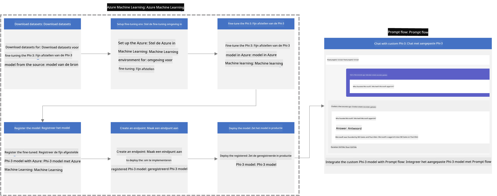

### Inhoudsopgave

1. **[Scenario 1: Azure-resources opzetten en voorbereiden voor fijn afstemmen](../../../../../../md/02.Application/01.TextAndChat/Phi3)**
    - [Een Azure Machine Learning-werkruimte maken](../../../../../../md/02.Application/01.TextAndChat/Phi3)
    - [GPU-quotums aanvragen in Azure-abonnement](../../../../../../md/02.Application/01.TextAndChat/Phi3)
    - [Roltoewijzing toevoegen](../../../../../../md/02.Application/01.TextAndChat/Phi3)
    - [Project opzetten](../../../../../../md/02.Application/01.TextAndChat/Phi3)
    - [Dataset voorbereiden voor fijn afstemmen](../../../../../../md/02.Application/01.TextAndChat/Phi3)

1. **[Scenario 2: Phi-3-model fijn afstemmen en implementeren in Azure Machine Learning Studio](../../../../../../md/02.Application/01.TextAndChat/Phi3)**
    - [Azure CLI instellen](../../../../../../md/02.Application/01.TextAndChat/Phi3)
    - [Het Phi-3-model fijn afstemmen](../../../../../../md/02.Application/01.TextAndChat/Phi3)
    - [Het fijn afgestemde model implementeren](../../../../../../md/02.Application/01.TextAndChat/Phi3)

1. **[Scenario 3: Integreren met Prompt flow en chatten met uw aangepaste model](../../../../../../md/02.Application/01.TextAndChat/Phi3)**
    - [Het aangepaste Phi-3-model integreren met Prompt flow](../../../../../../md/02.Application/01.TextAndChat/Phi3)
    - [Chatten met uw aangepaste model](../../../../../../md/02.Application/01.TextAndChat/Phi3)

## Scenario 1: Azure-resources opzetten en voorbereiden voor fijn afstemmen

### Een Azure Machine Learning-werkruimte maken

1. Typ *azure machine learning* in de **zoekbalk** bovenaan de portalpagina en selecteer **Azure Machine Learning** uit de opties die verschijnen.

    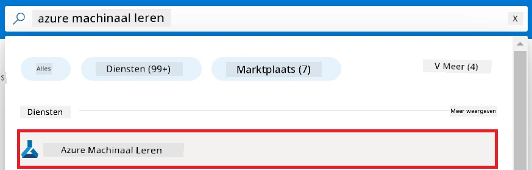

1. Selecteer **+ Create** in het navigatiemenu.

1. Selecteer **New workspace** in het navigatiemenu.

    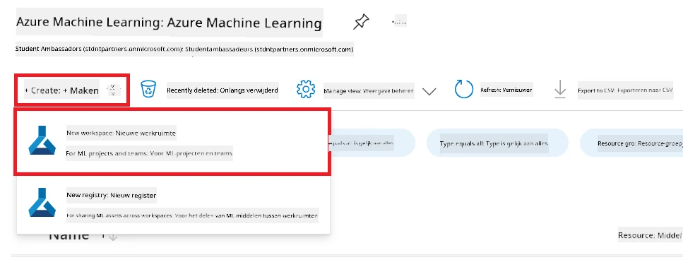

1. Voer de volgende taken uit:

    - Selecteer uw Azure **Abonnement**.
    - Selecteer de te gebruiken **Resourcegroep** (maak er een nieuwe aan indien nodig).
    - Voer een **Werkruimte naam** in. Dit moet een unieke waarde zijn.
    - Selecteer de **Regio** die u wilt gebruiken.
    - Selecteer de te gebruiken **Opslagaccount** (maak er een nieuwe aan indien nodig).
    - Selecteer de te gebruiken **Key vault** (maak er een nieuwe aan indien nodig).
    - Selecteer de te gebruiken **Application insights** (maak er een nieuwe aan indien nodig).
    - Selecteer de te gebruiken **Container registry** (maak er een nieuwe aan indien nodig).

    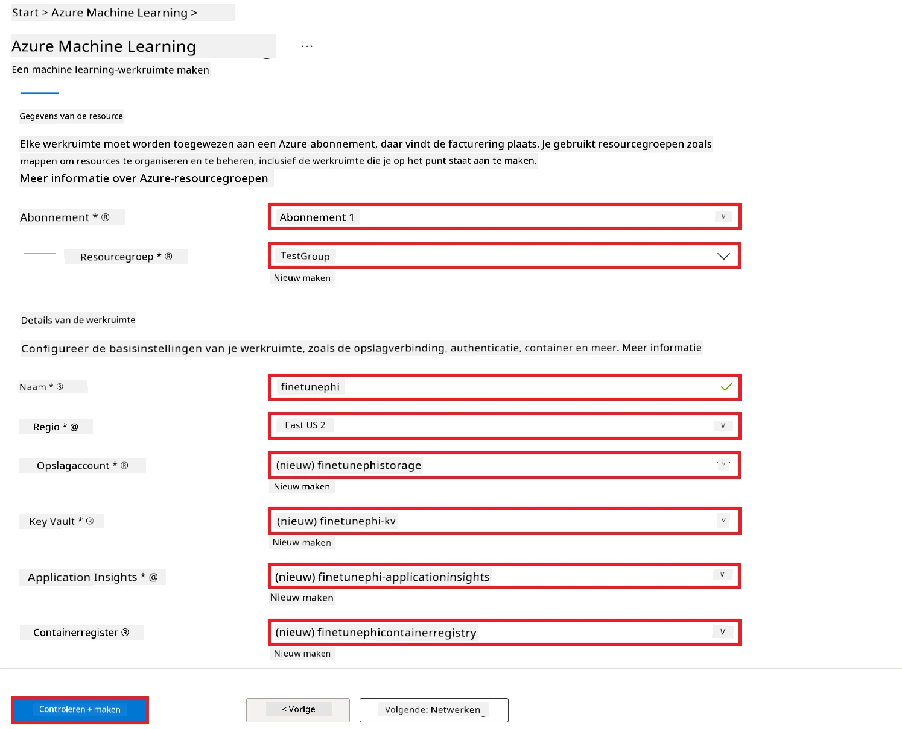

1. Selecteer **Review + Create**.

1. Selecteer **Create**.

### GPU-quotums aanvragen in Azure-abonnement

In deze E2E-sample gebruikt u de *Standard_NC24ads_A100_v4 GPU* voor fijn afstemmen, waarvoor een quotumaanvraag nodig is, en de *Standard_E4s_v3* CPU voor implementatie, waarvoor geen quotumaanvraag vereist is.

> [!NOTE]
>
> Alleen Pay-As-You-Go-abonnementen (het standaardabonnementstype) komen in aanmerking voor GPU-toewijzing; benefit-abonnementen worden momenteel niet ondersteund.
>
> Voor gebruikers met benefit-abonnementen (zoals Visual Studio Enterprise Subscription) of voor degenen die het fijn afstemmen en implementatieproces snel willen testen, biedt deze tutorial ook richtlijnen voor fijn afstemmen met een minimale dataset met een CPU. Het is echter belangrijk op te merken dat de resultaten van het fijn afstemmen aanzienlijk beter zijn bij gebruik van een GPU met grotere datasets.

1. Bezoek [Azure ML Studio](https://ml.azure.com/home?wt.mc_id=studentamb_279723).

1. Voer de volgende taken uit om een *Standard NCADSA100v4 Family* quotum aan te vragen:

    - Selecteer **Quota** uit het tabblad aan de linkerkant.
    - Selecteer de te gebruiken **Virtual machine family**. Bijvoorbeeld, selecteer **Standard NCADSA100v4 Family Cluster Dedicated vCPUs**, waar de *Standard_NC24ads_A100_v4* GPU onderdeel van is.
    - Selecteer **Request quota** in het navigatiemenu.

        

    - Voer op de pagina Request quota de **Nieuwe coreslimiet** in die u wilt gebruiken. Bijvoorbeeld 24.
    - Selecteer op de pagina Request quota **Submit** om de GPU-quotum aan te vragen.

> [!NOTE]
> U kunt de juiste GPU of CPU selecteren voor uw behoeften door te verwijzen naar het document [Sizes for Virtual Machines in Azure](https://learn.microsoft.com/azure/virtual-machines/sizes/overview?tabs=breakdownseries%2Cgeneralsizelist%2Ccomputesizelist%2Cmemorysizelist%2Cstoragesizelist%2Cgpusizelist%2Cfpgasizelist%2Chpcsizelist).

### Roltoewijzing toevoegen

Om uw modellen fijn af te stemmen en te implementeren, moet u eerst een User Assigned Managed Identity (UAI) aanmaken en deze de juiste rechten toewijzen. Deze UAI wordt gebruikt voor authenticatie tijdens implementatie.

#### User Assigned Managed Identity (UAI) maken

1. Typ *managed identities* in de **zoekbalk** bovenaan de portalpagina en selecteer **Managed Identities** uit de opties die verschijnen.

    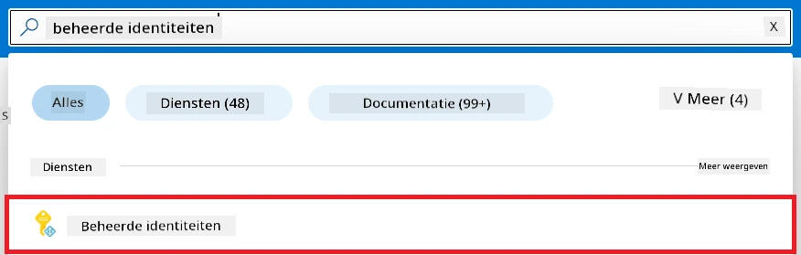

1. Selecteer **+ Create**.

    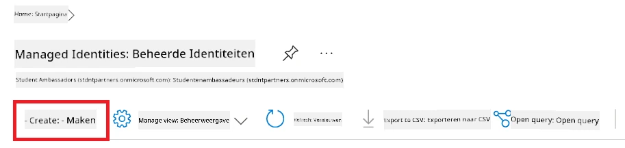

1. Voer de volgende taken uit:

    - Selecteer uw Azure **Abonnement**.
    - Selecteer de te gebruiken **Resourcegroep** (maak er een nieuwe aan indien nodig).
    - Selecteer de **Regio** die u wilt gebruiken.
    - Voer een **Naam** in. Dit moet een unieke waarde zijn.

1. Selecteer **Review + create**.

1. Selecteer **+ Create**.

#### Contributor-roltoewijzing toevoegen aan Managed Identity

1. Navigeer naar de Managed Identity-resource die u hebt aangemaakt.

1. Selecteer **Azure role assignments** uit het tabblad aan de linkerkant.

1. Selecteer **+Add role assignment** in het navigatiemenu.

1. Voer op de pagina Add role assignment de volgende taken uit:
    - Stel de **Scope** in op **Resource group**.
    - Selecteer uw Azure **Abonnement**.
    - Selecteer de te gebruiken **Resourcegroep**.
    - Selecteer de **Rol** voor **Contributor**.

    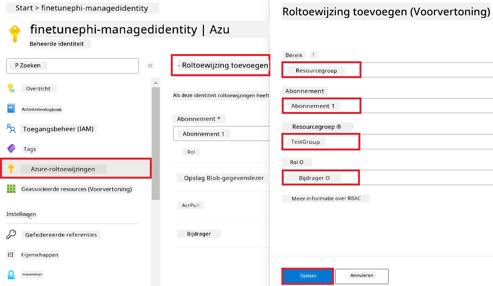

1. Selecteer **Save**.

#### Storage Blob Data Reader-roltoewijzing toevoegen aan Managed Identity

1. Typ *storage accounts* in de **zoekbalk** bovenaan de portalpagina en selecteer **Storage accounts** uit de opties die verschijnen.

    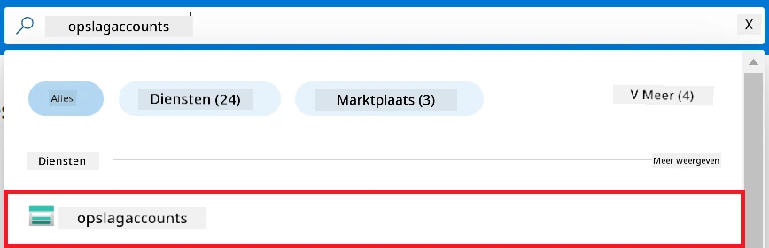

1. Selecteer de opslagaccount die is gekoppeld aan de Azure Machine Learning-werkruimte die u hebt gemaakt. Bijvoorbeeld, *finetunephistorage*.

1. Voer de volgende taken uit om naar de pagina Add role assignment te navigeren:

    - Navigeer naar de Azure Storage-account die u hebt aangemaakt.
    - Selecteer **Access Control (IAM)** in het tabblad aan de linkerkant.
    - Selecteer **+ Add** in het navigatiemenu.
    - Selecteer **Add role assignment** in het navigatiemenu.

    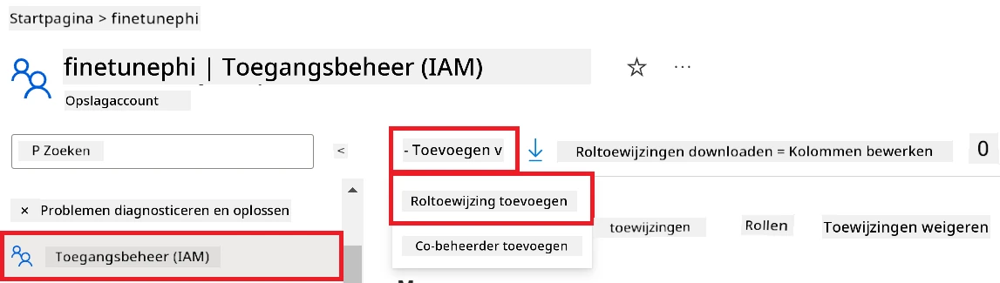

1. Voer op de pagina Add role assignment de volgende taken uit:

    - Typ op de pagina Rol *Storage Blob Data Reader* in de **zoekbalk** en selecteer **Storage Blob Data Reader** uit de opties die verschijnen.
    - Selecteer op de pagina Rol **Next**.
    - Selecteer op de pagina Leden bij **Assign access to** **Managed identity**.
    - Selecteer op de pagina Leden **+ Select members**.
    - Selecteer op de pagina Select managed identities uw Azure **Abonnement**.
    - Selecteer op de pagina Select managed identities de **Managed identity** voor **Manage Identity**.
    - Selecteer op de pagina Select managed identities de Manage Identity die u hebt aangemaakt. Bijvoorbeeld, *finetunephi-managedidentity*.
    - Selecteer op de pagina Select managed identities **Select**.

    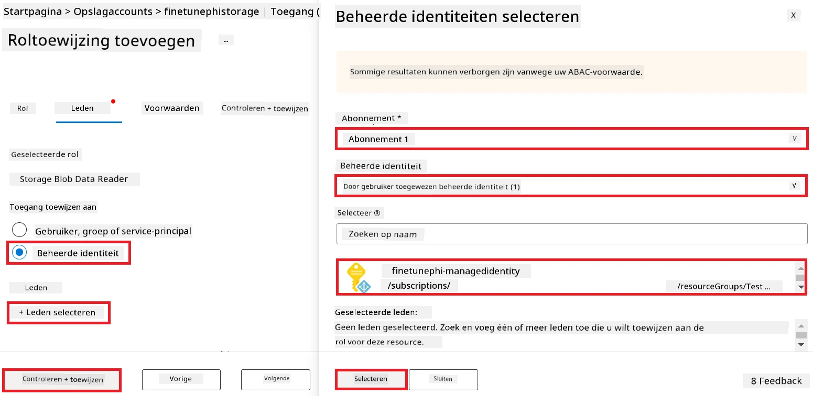

1. Selecteer **Review + assign**.

#### AcrPull-roltoewijzing toevoegen aan Managed Identity

1. Typ *container registries* in de **zoekbalk** bovenaan de portalpagina en selecteer **Container registries** uit de opties die verschijnen.

    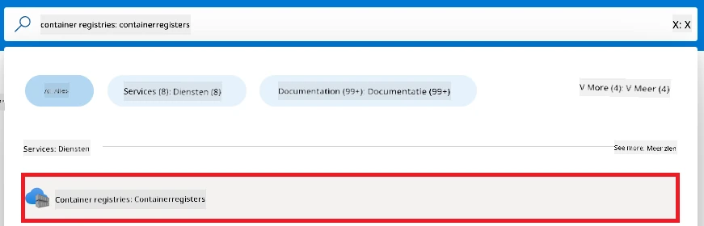

1. Selecteer de containerregistry die gekoppeld is aan de Azure Machine Learning-werkruimte. Bijvoorbeeld, *finetunephicontainerregistries*.

1. Voer de volgende taken uit om naar de pagina Add role assignment te navigeren:

    - Selecteer **Access Control (IAM)** in het tabblad aan de linkerkant.
    - Selecteer **+ Add** in het navigatiemenu.
    - Selecteer **Add role assignment** in het navigatiemenu.

1. Voer op de pagina Add role assignment de volgende taken uit:

    - Typ op de pagina Rol *AcrPull* in de **zoekbalk** en selecteer **AcrPull** uit de opties die verschijnen.
    - Selecteer op de pagina Rol **Next**.
    - Selecteer op de pagina Leden bij **Assign access to** **Managed identity**.
    - Selecteer op de pagina Leden **+ Select members**.
    - Selecteer op de pagina Select managed identities uw Azure **Abonnement**.
    - Selecteer op de pagina Select managed identities de **Managed identity** voor **Manage Identity**.
    - Selecteer op de pagina Select managed identities de Manage Identity die u hebt aangemaakt. Bijvoorbeeld, *finetunephi-managedidentity*.
    - Selecteer op de pagina Select managed identities **Select**.
    - Selecteer **Review + assign**.

### Project opzetten

Nu maakt u een map om in te werken en stelt u een virtuele omgeving in om een programma te ontwikkelen dat met gebruikers interageert en opgeslagen chatgeschiedenis uit Azure Cosmos DB gebruikt om zijn antwoorden te informeren.

#### Maak een map om in te werken

1. Open een terminalvenster en typ de volgende opdracht om een map genaamd *finetune-phi* te maken in het standaardpad.

    ```console
    mkdir finetune-phi
    ```

1. Typ de volgende opdracht in uw terminal om naar de map *finetune-phi* te navigeren die u hebt gemaakt.

    ```console
    cd finetune-phi
    ```

#### Maak een virtuele omgeving

1. Typ de volgende opdracht in uw terminal om een virtuele omgeving genaamd *.venv* te maken.

    ```console
    python -m venv .venv
    ```

1. Typ de volgende opdracht in uw terminal om de virtuele omgeving te activeren.

    ```console
    .venv\Scripts\activate.bat
    ```

> [!NOTE]
>
> Als het gelukt is, zou u *(.venv)* vóór de opdrachtprompt moeten zien.

#### Installeer de vereiste pakketten

1. Typ de volgende opdrachten in uw terminal om de vereiste pakketten te installeren.

    ```console
    pip install datasets==2.19.1
    pip install transformers==4.41.1
    pip install azure-ai-ml==1.16.0
    pip install torch==2.3.1
    pip install trl==0.9.4
    pip install promptflow==1.12.0
    ```

#### Maak projectbestanden aan
In deze oefening maakt u de essentiële bestanden voor ons project aan. Deze bestanden bevatten scripts voor het downloaden van de dataset, het opzetten van de Azure Machine Learning-omgeving, het fine-tunen van het Phi-3-model en het implementeren van het fijn-afgestelde model. U maakt ook een *conda.yml* bestand aan om de fine-tuning-omgeving op te zetten.

In deze oefening zult u:

- Een *download_dataset.py* bestand maken om de dataset te downloaden.
- Een *setup_ml.py* bestand maken om de Azure Machine Learning-omgeving op te zetten.
- Een *fine_tune.py* bestand maken in de map *finetuning_dir* om het Phi-3-model fijn af te stemmen met behulp van de dataset.
- Een *conda.yml* bestand maken om de fine-tuning omgeving op te zetten.
- Een *deploy_model.py* bestand maken om het fijn-afgestelde model te implementeren.
- Een *integrate_with_promptflow.py* bestand maken, om het fijn-afgestelde model te integreren en het model uit te voeren met Prompt flow.
- Een flow.dag.yml bestand maken, om de workflow-structuur voor Prompt flow op te zetten.
- Een *config.py* bestand maken om Azure-informatie in te voeren.

> [!NOTE]
>
> Complete mappenstructuur:
>
> ```text
> └── YourUserName
> .    └── finetune-phi
> .        ├── finetuning_dir
> .        │      └── fine_tune.py
> .        ├── conda.yml
> .        ├── config.py
> .        ├── deploy_model.py
> .        ├── download_dataset.py
> .        ├── flow.dag.yml
> .        ├── integrate_with_promptflow.py
> .        └── setup_ml.py
> ```

1. Open **Visual Studio Code**.

1. Selecteer **Bestand** in de menubalk.

1. Selecteer **Map openen**.

1. Selecteer de *finetune-phi* map die u hebt gemaakt, die zich bevindt in *C:\Users\yourUserName\finetune-phi*.

    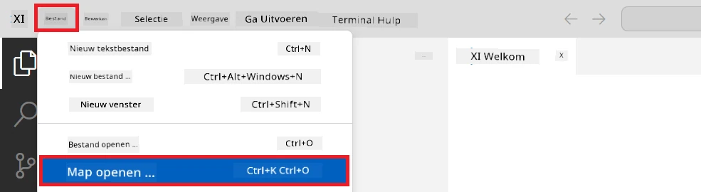

1. Klik met de rechtermuisknop in het linkerdeelvenster van Visual Studio Code en selecteer **Nieuw bestand** om een nieuw bestand genaamd *download_dataset.py* aan te maken.

1. Klik met de rechtermuisknop in het linkerdeelvenster van Visual Studio Code en selecteer **Nieuw bestand** om een nieuw bestand genaamd *setup_ml.py* aan te maken.

1. Klik met de rechtermuisknop in het linkerdeelvenster van Visual Studio Code en selecteer **Nieuw bestand** om een nieuw bestand genaamd *deploy_model.py* aan te maken.

    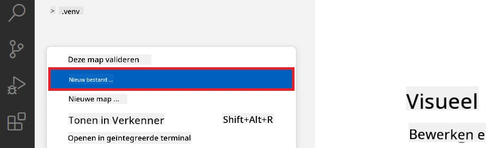

1. Klik met de rechtermuisknop in het linkerdeelvenster van Visual Studio Code en selecteer **Nieuwe map** om een nieuwe map genaamd *finetuning_dir* aan te maken.

1. Maak in de *finetuning_dir* map een nieuw bestand aan met de naam *fine_tune.py*.

#### Maak en configureer het *conda.yml* bestand

1. Klik met de rechtermuisknop in het linkerdeelvenster van Visual Studio Code en selecteer **Nieuw bestand** om een nieuw bestand aan te maken met de naam *conda.yml*.

1. Voeg de volgende code toe aan het *conda.yml* bestand om de fine-tuning-omgeving voor het Phi-3-model op te zetten.

    ```yml
    name: phi-3-training-env
    channels:
      - defaults
      - conda-forge
    dependencies:
      - python=3.10
      - pip
      - numpy<2.0
      - pip:
          - torch==2.4.0
          - torchvision==0.19.0
          - trl==0.8.6
          - transformers==4.41
          - datasets==2.21.0
          - azureml-core==1.57.0
          - azure-storage-blob==12.19.0
          - azure-ai-ml==1.16
          - azure-identity==1.17.1
          - accelerate==0.33.0
          - mlflow==2.15.1
          - azureml-mlflow==1.57.0
    ```

#### Maak en configureer het *config.py* bestand

1. Klik met de rechtermuisknop in het linkerdeelvenster van Visual Studio Code en selecteer **Nieuw bestand** om een nieuw bestand aan te maken met de naam *config.py*.

1. Voeg de volgende code toe aan het *config.py* bestand om uw Azure-informatie op te nemen.

    ```python
    # Azure-instellingen
    AZURE_SUBSCRIPTION_ID = "your_subscription_id"
    AZURE_RESOURCE_GROUP_NAME = "your_resource_group_name" # "TestGroep"

    # Azure Machine Learning-instellingen
    AZURE_ML_WORKSPACE_NAME = "your_workspace_name" # "finetunephi-werkruimte"

    # Azure Managed Identity-instellingen
    AZURE_MANAGED_IDENTITY_CLIENT_ID = "your_azure_managed_identity_client_id"
    AZURE_MANAGED_IDENTITY_NAME = "your_azure_managed_identity_name" # "finetunephi-managedidentity"
    AZURE_MANAGED_IDENTITY_RESOURCE_ID = f"/subscriptions/{AZURE_SUBSCRIPTION_ID}/resourceGroups/{AZURE_RESOURCE_GROUP_NAME}/providers/Microsoft.ManagedIdentity/userAssignedIdentities/{AZURE_MANAGED_IDENTITY_NAME}"

    # Dataset-bestandspaden
    TRAIN_DATA_PATH = "data/train_data.jsonl"
    TEST_DATA_PATH = "data/test_data.jsonl"

    # Instellingen van het fijn afgestemde model
    AZURE_MODEL_NAME = "your_fine_tuned_model_name" # "finetune-phi-model"
    AZURE_ENDPOINT_NAME = "your_fine_tuned_model_endpoint_name" # "finetune-phi-eindpunt"
    AZURE_DEPLOYMENT_NAME = "your_fine_tuned_model_deployment_name" # "finetune-phi-implementatie"

    AZURE_ML_API_KEY = "your_fine_tuned_model_api_key"
    AZURE_ML_ENDPOINT = "your_fine_tuned_model_endpoint_uri" # "https://{uw-eindpunt-naam}.{uw-regio}.inference.ml.azure.com/score"
    ```

#### Voeg Azure omgeving variabelen toe

1. Voer de volgende taken uit om de Azure Subscription ID toe te voegen:

    - Typ *subscriptions* in de **zoekbalk** bovenaan de portalpagina en selecteer **Subscriptions** uit de opties die verschijnen.
    - Selecteer de Azure-abonnementsservice die u momenteel gebruikt.
    - Kopieer en plak uw Subscription ID in het *config.py* bestand.

    

1. Voer de volgende taken uit om de Azure Workspace Naam toe te voegen:

    - Navigeer naar de Azure Machine Learning-resource die u hebt gemaakt.
    - Kopieer en plak uw accountnaam in het *config.py* bestand.

    

1. Voer de volgende taken uit om de Azure Resource Group Naam toe te voegen:

    - Navigeer naar de Azure Machine Learning-resource die u hebt gemaakt.
    - Kopieer en plak uw Azure Resource Group Naam in het *config.py* bestand.

    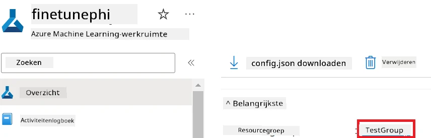

2. Voer de volgende taken uit om de Azure Managed Identity naam toe te voegen:

    - Navigeer naar de Managed Identities-resource die u hebt gemaakt.
    - Kopieer en plak uw Azure Managed Identity naam in het *config.py* bestand.

    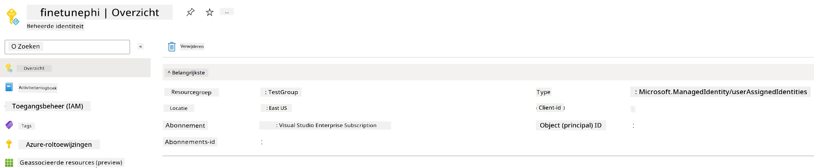

### Bereid dataset voor fine-tuning voor

In deze oefening voert u het *download_dataset.py* bestand uit om de *ULTRACHAT_200k* datasets naar uw lokale omgeving te downloaden. U gebruikt deze datasets vervolgens om het Phi-3-model in Azure Machine Learning fijn af te stemmen.

#### Download uw dataset met *download_dataset.py*

1. Open het *download_dataset.py* bestand in Visual Studio Code.

1. Voeg de volgende code toe in *download_dataset.py*.

    ```python
    import json
    import os
    from datasets import load_dataset
    from config import (
        TRAIN_DATA_PATH,
        TEST_DATA_PATH)

    def load_and_split_dataset(dataset_name, config_name, split_ratio):
        """
        Load and split a dataset.
        """
        # Laad de dataset met de opgegeven naam, configuratie en splitsingsverhouding
        dataset = load_dataset(dataset_name, config_name, split=split_ratio)
        print(f"Original dataset size: {len(dataset)}")
        
        # Splits de dataset in train- en testsets (80% train, 20% test)
        split_dataset = dataset.train_test_split(test_size=0.2)
        print(f"Train dataset size: {len(split_dataset['train'])}")
        print(f"Test dataset size: {len(split_dataset['test'])}")
        
        return split_dataset

    def save_dataset_to_jsonl(dataset, filepath):
        """
        Save a dataset to a JSONL file.
        """
        # Maak de map aan als deze nog niet bestaat
        os.makedirs(os.path.dirname(filepath), exist_ok=True)
        
        # Open het bestand in schrijfmethode
        with open(filepath, 'w', encoding='utf-8') as f:
            # Itereer over elk record in de dataset
            for record in dataset:
                # Sla het record op als een JSON-object en schrijf het naar het bestand
                json.dump(record, f)
                # Schrijf een nieuwe-regel teken om de records te scheiden
                f.write('\n')
        
        print(f"Dataset saved to {filepath}")

    def main():
        """
        Main function to load, split, and save the dataset.
        """
        # Laad en splits de ULTRACHAT_200k dataset met een specifieke configuratie en splitsingsverhouding
        dataset = load_and_split_dataset("HuggingFaceH4/ultrachat_200k", 'default', 'train_sft[:1%]')
        
        # Extraheer de train- en testdatasets uit de splitsing
        train_dataset = dataset['train']
        test_dataset = dataset['test']

        # Sla de train dataset op in een JSONL-bestand
        save_dataset_to_jsonl(train_dataset, TRAIN_DATA_PATH)
        
        # Sla de test dataset op in een apart JSONL-bestand
        save_dataset_to_jsonl(test_dataset, TEST_DATA_PATH)

    if __name__ == "__main__":
        main()

    ```

> [!TIP]
>
> **Richtlijnen voor fijn afstemmen met een minimale dataset op een CPU**
>
> Als u een CPU wilt gebruiken voor fijn afstemmen, is deze aanpak ideaal voor gebruikers met benefit-abonnementen (zoals Visual Studio Enterprise Subscription) of om het fijn-afstemmen en implementatieproces snel te testen.
>
> Vervang `dataset = load_and_split_dataset("HuggingFaceH4/ultrachat_200k", 'default', 'train_sft[:1%]')` door `dataset = load_and_split_dataset("HuggingFaceH4/ultrachat_200k", 'default', 'train_sft[:10]')`
>

1. Typ het volgende commando in uw terminal om het script uit te voeren en de dataset naar uw lokale omgeving te downloaden.

    ```console
    python download_data.py
    ```

1. Controleer of de datasets met succes zijn opgeslagen in uw lokale *finetune-phi/data* map.

> [!NOTE]
>
> **Dataset grootte en fine-tuning tijd**
>
> In dit E2E voorbeeld gebruikt u slechts 1% van de dataset (`train_sft[:1%]`). Dit vermindert het datavolume aanzienlijk, waardoor zowel het uploaden als het fine-tunen sneller verloopt. U kunt het percentage aanpassen om de juiste balans te vinden tussen trainingstijd en modelprestaties. Het gebruik van een kleinere subset van de dataset verkort de tijd die nodig is voor fine-tuning, waardoor het proces beter beheersbaar wordt voor een E2E voorbeeld.

## Scenario 2: Fijn afstemmen van het Phi-3 model en implementeren in Azure Machine Learning Studio

### Stel Azure CLI in

U moet Azure CLI instellen om uw omgeving te authenticeren. Azure CLI stelt u in staat om Azure resources rechtstreeks vanaf de opdrachtregel te beheren en biedt de benodigde referenties zodat Azure Machine Learning toegang heeft tot deze resources. Om te beginnen installeert u [Azure CLI](https://learn.microsoft.com/cli/azure/install-azure-cli)

1. Open een terminalvenster en typ het volgende commando om in te loggen op uw Azure-account.

    ```console
    az login
    ```

1. Selecteer de Azure-account die u wilt gebruiken.

1. Selecteer het Azure-abonnement dat u wilt gebruiken.

    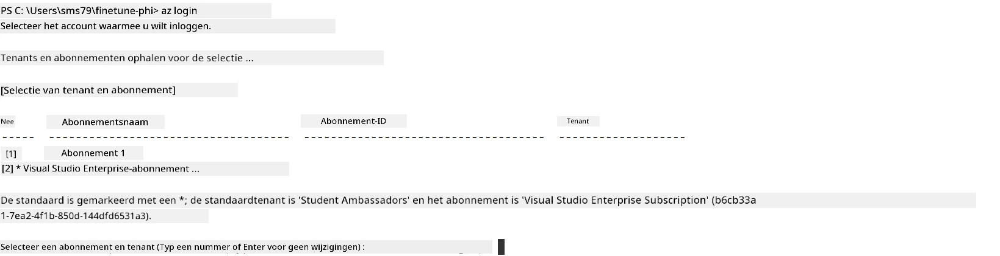

> [!TIP]
>
> Als u problemen ondervindt met aanmelden bij Azure, probeer dan een apparaatcode te gebruiken. Open een terminalvenster en typ het volgende commando om aan te melden op uw Azure-account:
>
> ```console
> az login --use-device-code
> ```
>

### Fijn afstemmen van het Phi-3 model

In deze oefening gaat u het Phi-3 model fijn afstemmen met behulp van de geleverde dataset. Eerst definieert u het fine-tuning proces in het *fine_tune.py* bestand. Vervolgens configureert u de Azure Machine Learning-omgeving en start u het fine-tuning proces door het *setup_ml.py* bestand uit te voeren. Dit script zorgt ervoor dat het fine-tunen plaatsvindt binnen de Azure Machine Learning-omgeving.

Door *setup_ml.py* uit te voeren, laat u het fine-tuning proces draaien in de Azure Machine Learning-omgeving.

#### Voeg code toe aan het *fine_tune.py* bestand

1. Navigeer naar de *finetuning_dir* map en open het *fine_tune.py* bestand in Visual Studio Code.

1. Voeg de volgende code toe aan *fine_tune.py*.

    ```python
    import argparse
    import sys
    import logging
    import os
    from datasets import load_dataset
    import torch
    import mlflow
    from transformers import AutoModelForCausalLM, AutoTokenizer, TrainingArguments
    from trl import SFTTrainer

    # Om de INVALID_PARAMETER_VALUE-fout in MLflow te voorkomen, schakel de MLflow-integratie uit
    os.environ["DISABLE_MLFLOW_INTEGRATION"] = "True"

    # Configuratie van logging
    logging.basicConfig(
        format="%(asctime)s - %(levelname)s - %(name)s - %(message)s",
        datefmt="%Y-%m-%d %H:%M:%S",
        handlers=[logging.StreamHandler(sys.stdout)],
        level=logging.WARNING
    )
    logger = logging.getLogger(__name__)

    def initialize_model_and_tokenizer(model_name, model_kwargs):
        """
        Initialize the model and tokenizer with the given pretrained model name and arguments.
        """
        model = AutoModelForCausalLM.from_pretrained(model_name, **model_kwargs)
        tokenizer = AutoTokenizer.from_pretrained(model_name)
        tokenizer.model_max_length = 2048
        tokenizer.pad_token = tokenizer.unk_token
        tokenizer.pad_token_id = tokenizer.convert_tokens_to_ids(tokenizer.pad_token)
        tokenizer.padding_side = 'right'
        return model, tokenizer

    def apply_chat_template(example, tokenizer):
        """
        Apply a chat template to tokenize messages in the example.
        """
        messages = example["messages"]
        if messages[0]["role"] != "system":
            messages.insert(0, {"role": "system", "content": ""})
        example["text"] = tokenizer.apply_chat_template(
            messages, tokenize=False, add_generation_prompt=False
        )
        return example

    def load_and_preprocess_data(train_filepath, test_filepath, tokenizer):
        """
        Load and preprocess the dataset.
        """
        train_dataset = load_dataset('json', data_files=train_filepath, split='train')
        test_dataset = load_dataset('json', data_files=test_filepath, split='train')
        column_names = list(train_dataset.features)

        train_dataset = train_dataset.map(
            apply_chat_template,
            fn_kwargs={"tokenizer": tokenizer},
            num_proc=10,
            remove_columns=column_names,
            desc="Applying chat template to train dataset",
        )

        test_dataset = test_dataset.map(
            apply_chat_template,
            fn_kwargs={"tokenizer": tokenizer},
            num_proc=10,
            remove_columns=column_names,
            desc="Applying chat template to test dataset",
        )

        return train_dataset, test_dataset

    def train_and_evaluate_model(train_dataset, test_dataset, model, tokenizer, output_dir):
        """
        Train and evaluate the model.
        """
        training_args = TrainingArguments(
            bf16=True,
            do_eval=True,
            output_dir=output_dir,
            eval_strategy="epoch",
            learning_rate=5.0e-06,
            logging_steps=20,
            lr_scheduler_type="cosine",
            num_train_epochs=3,
            overwrite_output_dir=True,
            per_device_eval_batch_size=4,
            per_device_train_batch_size=4,
            remove_unused_columns=True,
            save_steps=500,
            seed=0,
            gradient_checkpointing=True,
            gradient_accumulation_steps=1,
            warmup_ratio=0.2,
        )

        trainer = SFTTrainer(
            model=model,
            args=training_args,
            train_dataset=train_dataset,
            eval_dataset=test_dataset,
            max_seq_length=2048,
            dataset_text_field="text",
            tokenizer=tokenizer,
            packing=True
        )

        train_result = trainer.train()
        trainer.log_metrics("train", train_result.metrics)

        mlflow.transformers.log_model(
            transformers_model={"model": trainer.model, "tokenizer": tokenizer},
            artifact_path=output_dir,
        )

        tokenizer.padding_side = 'left'
        eval_metrics = trainer.evaluate()
        eval_metrics["eval_samples"] = len(test_dataset)
        trainer.log_metrics("eval", eval_metrics)

    def main(train_file, eval_file, model_output_dir):
        """
        Main function to fine-tune the model.
        """
        model_kwargs = {
            "use_cache": False,
            "trust_remote_code": True,
            "torch_dtype": torch.bfloat16,
            "device_map": None,
            "attn_implementation": "eager"
        }

        # pretrained_model_name = "microsoft/Phi-3-mini-4k-instruct"
        pretrained_model_name = "microsoft/Phi-3.5-mini-instruct"

        with mlflow.start_run():
            model, tokenizer = initialize_model_and_tokenizer(pretrained_model_name, model_kwargs)
            train_dataset, test_dataset = load_and_preprocess_data(train_file, eval_file, tokenizer)
            train_and_evaluate_model(train_dataset, test_dataset, model, tokenizer, model_output_dir)

    if __name__ == "__main__":
        parser = argparse.ArgumentParser()
        parser.add_argument("--train-file", type=str, required=True, help="Path to the training data")
        parser.add_argument("--eval-file", type=str, required=True, help="Path to the evaluation data")
        parser.add_argument("--model_output_dir", type=str, required=True, help="Directory to save the fine-tuned model")
        args = parser.parse_args()
        main(args.train_file, args.eval_file, args.model_output_dir)

    ```

1. Sla het *fine_tune.py* bestand op en sluit het.

> [!TIP]
> **U kunt het Phi-3.5 model fijn afstemmen**
>
> In het *fine_tune.py* bestand kunt u de `pretrained_model_name` veranderen van `"microsoft/Phi-3-mini-4k-instruct"` naar elk ander model dat u wilt fine-tunen. Bijvoorbeeld, als u het wijzigt naar `"microsoft/Phi-3.5-mini-instruct"`, gebruikt u het Phi-3.5-mini-instruct model voor fijn afstemmen. Om de modelnaam te vinden en te gebruiken die u verkiest, bezoekt u [Hugging Face](https://huggingface.co/), zoekt u naar het gewenste model en kopieert u de naam naar het `pretrained_model_name` veld in uw script.
>
> <image type="content" src="../../../../imgs/02/FineTuning-PromptFlow/finetunephi3.5.png" alt-text="Fine tune Phi-3.5.">
>

#### Voeg code toe aan het *setup_ml.py* bestand

1. Open het *setup_ml.py* bestand in Visual Studio Code.

1. Voeg de volgende code toe aan *setup_ml.py*.

    ```python
    import logging
    from azure.ai.ml import MLClient, command, Input
    from azure.ai.ml.entities import Environment, AmlCompute
    from azure.identity import AzureCliCredential
    from config import (
        AZURE_SUBSCRIPTION_ID,
        AZURE_RESOURCE_GROUP_NAME,
        AZURE_ML_WORKSPACE_NAME,
        TRAIN_DATA_PATH,
        TEST_DATA_PATH
    )

    # Constanten

    # Haal de commentaartekens weg van de volgende regels om een CPU-instantie te gebruiken voor training
    # COMPUTE_INSTANCE_TYPE = "Standard_E16s_v3" # cpu
    # COMPUTE_NAME = "cpu-e16s-v3"
    # DOCKER_IMAGE_NAME = "mcr.microsoft.com/azureml/openmpi4.1.0-ubuntu20.04:latest"

    # Haal de commentaartekens weg van de volgende regels om een GPU-instantie te gebruiken voor training
    COMPUTE_INSTANCE_TYPE = "Standard_NC24ads_A100_v4"
    COMPUTE_NAME = "gpu-nc24s-a100-v4"
    DOCKER_IMAGE_NAME = "mcr.microsoft.com/azureml/curated/acft-hf-nlp-gpu:59"

    CONDA_FILE = "conda.yml"
    LOCATION = "eastus2" # Vervang door de locatie van jouw compute-cluster
    FINETUNING_DIR = "./finetuning_dir" # Pad naar het fine-tuning script
    TRAINING_ENV_NAME = "phi-3-training-environment" # Naam van de trainingsomgeving
    MODEL_OUTPUT_DIR = "./model_output" # Pad naar de uitvoermap van het model in Azure ML

    # Logging setup om het proces te volgen
    logger = logging.getLogger(__name__)
    logging.basicConfig(
        format="%(asctime)s - %(levelname)s - %(name)s - %(message)s",
        datefmt="%Y-%m-%d %H:%M:%S",
        level=logging.WARNING
    )

    def get_ml_client():
        """
        Initialize the ML Client using Azure CLI credentials.
        """
        credential = AzureCliCredential()
        return MLClient(credential, AZURE_SUBSCRIPTION_ID, AZURE_RESOURCE_GROUP_NAME, AZURE_ML_WORKSPACE_NAME)

    def create_or_get_environment(ml_client):
        """
        Create or update the training environment in Azure ML.
        """
        env = Environment(
            image=DOCKER_IMAGE_NAME,  # Docker image voor de omgeving
            conda_file=CONDA_FILE,  # Conda environment bestand
            name=TRAINING_ENV_NAME,  # Naam van de omgeving
        )
        return ml_client.environments.create_or_update(env)

    def create_or_get_compute_cluster(ml_client, compute_name, COMPUTE_INSTANCE_TYPE, location):
        """
        Create or update the compute cluster in Azure ML.
        """
        try:
            compute_cluster = ml_client.compute.get(compute_name)
            logger.info(f"Compute cluster '{compute_name}' already exists. Reusing it for the current run.")
        except Exception:
            logger.info(f"Compute cluster '{compute_name}' does not exist. Creating a new one with size {COMPUTE_INSTANCE_TYPE}.")
            compute_cluster = AmlCompute(
                name=compute_name,
                size=COMPUTE_INSTANCE_TYPE,
                location=location,
                tier="Dedicated",  # Laag van het compute-cluster
                min_instances=0,  # Minimum aantal instanties
                max_instances=1  # Maximum aantal instanties
            )
            ml_client.compute.begin_create_or_update(compute_cluster).wait()  # Wacht tot het cluster is aangemaakt
        return compute_cluster

    def create_fine_tuning_job(env, compute_name):
        """
        Set up the fine-tuning job in Azure ML.
        """
        return command(
            code=FINETUNING_DIR,  # Pad naar fine_tune.py
            command=(
                "python fine_tune.py "
                "--train-file ${{inputs.train_file}} "
                "--eval-file ${{inputs.eval_file}} "
                "--model_output_dir ${{inputs.model_output}}"
            ),
            environment=env,  # Trainingsomgeving
            compute=compute_name,  # Te gebruiken compute-cluster
            inputs={
                "train_file": Input(type="uri_file", path=TRAIN_DATA_PATH),  # Pad naar het trainingsdata bestand
                "eval_file": Input(type="uri_file", path=TEST_DATA_PATH),  # Pad naar het evaluatiedata bestand
                "model_output": MODEL_OUTPUT_DIR
            }
        )

    def main():
        """
        Main function to set up and run the fine-tuning job in Azure ML.
        """
        # Initialiseer ML Client
        ml_client = get_ml_client()

        # Maak Environment aan
        env = create_or_get_environment(ml_client)
        
        # Maak aan of verkrijg bestaand compute-cluster
        create_or_get_compute_cluster(ml_client, COMPUTE_NAME, COMPUTE_INSTANCE_TYPE, LOCATION)

        # Maak en dien Fine-Tuning Job in
        job = create_fine_tuning_job(env, COMPUTE_NAME)
        returned_job = ml_client.jobs.create_or_update(job)  # Dien de job in
        ml_client.jobs.stream(returned_job.name)  # Stroom de joblogs
        
        # Leg de jobnaam vast
        job_name = returned_job.name
        print(f"Job name: {job_name}")

    if __name__ == "__main__":
        main()

    ```

1. Vervang `COMPUTE_INSTANCE_TYPE`, `COMPUTE_NAME` en `LOCATION` door uw specifieke gegevens.

    ```python
   # Haal de commentaartekens weg bij de volgende regels om een GPU-instance te gebruiken voor training
    COMPUTE_INSTANCE_TYPE = "Standard_NC24ads_A100_v4"
    COMPUTE_NAME = "gpu-nc24s-a100-v4"
    ...
    LOCATION = "eastus2" # Vervang door de locatie van je computercluster
    ```

> [!TIP]
>
> **Richtlijnen voor fijn afstemmen met een minimale dataset op een CPU**
>
> Als u een CPU wilt gebruiken voor fijn afstemmen, is deze aanpak ideaal voor gebruikers met benefit-abonnementen (zoals Visual Studio Enterprise Subscription) of om het fijn-afstemmen en implementatieproces snel te testen.
>
> 1. Open het *setup_ml* bestand.
> 1. Vervang `COMPUTE_INSTANCE_TYPE`, `COMPUTE_NAME` en `DOCKER_IMAGE_NAME` door het volgende. Als u geen toegang hebt tot *Standard_E16s_v3*, kunt u een equivalente CPU-instantie gebruiken of een nieuwe quota aanvragen.
> 1. Vervang `LOCATION` door uw specifieke gegevens.
>
>    ```python
>    # Uncomment the following lines to use a CPU instance for training
>    COMPUTE_INSTANCE_TYPE = "Standard_E16s_v3" # cpu
>    COMPUTE_NAME = "cpu-e16s-v3"
>    DOCKER_IMAGE_NAME = "mcr.microsoft.com/azureml/openmpi4.1.0-ubuntu20.04:latest"
>    LOCATION = "eastus2" # Replace with the location of your compute cluster
>    ```
>

1. Typ het volgende commando om het *setup_ml.py* script uit te voeren en het fijn afstemproces in Azure Machine Learning te starten.

    ```python
    python setup_ml.py
    ```

1. In deze oefening hebt u met succes het Phi-3 model fijn afgestemd met behulp van Azure Machine Learning. Door het *setup_ml.py* script uit te voeren, hebt u de Azure Machine Learning-omgeving ingesteld en het fijn afstemproces gestart dat is gedefinieerd in het *fine_tune.py* bestand. Houd er rekening mee dat het fijn-afstemproces aanzienlijk wat tijd kan kosten. Na het uitvoeren van de `python setup_ml.py` opdracht moet u wachten tot het proces is voltooid. U kunt de status van de fijn-afstemjob volgen via de link die in de terminal wordt weergegeven naar de Azure Machine Learning-portal.

    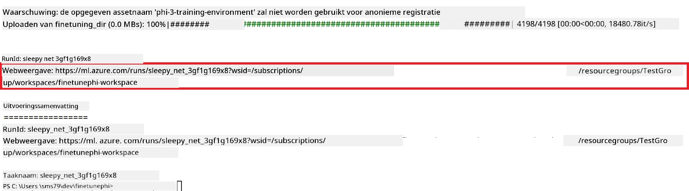

### Implementeer het fijn-afgestelde model

Om het fijn-afgestelde Phi-3 model te integreren met Prompt Flow, moet u het model implementeren zodat het toegankelijk is voor realtime inferentie. Dit proces omvat het registreren van het model, het maken van een online endpoint en het implementeren van het model.

#### Stel de modelnaam, endpointnaam en implementatienaam in voor implementatie

1. Open het *config.py* bestand.

1. Vervang `AZURE_MODEL_NAME = "your_fine_tuned_model_name"` door de gewenste naam voor uw model.

1. Vervang `AZURE_ENDPOINT_NAME = "your_fine_tuned_model_endpoint_name"` door de gewenste naam voor uw endpoint.

1. Vervang `AZURE_DEPLOYMENT_NAME = "your_fine_tuned_model_deployment_name"` door de gewenste naam voor uw implementatie.

#### Voeg code toe aan het *deploy_model.py* bestand

Het uitvoeren van het *deploy_model.py* bestand automatiseert het hele implementatieproces. Het registreert het model, maakt een endpoint aan en voert de implementatie uit op basis van de instellingen die zijn gespecificeerd in het config.py bestand, waaronder de modelnaam, endpointnaam en implementatienaam.

1. Open het *deploy_model.py* bestand in Visual Studio Code.

1. Voeg de volgende code toe aan *deploy_model.py*.

    ```python
    import logging
    from azure.identity import AzureCliCredential
    from azure.ai.ml import MLClient
    from azure.ai.ml.entities import Model, ProbeSettings, ManagedOnlineEndpoint, ManagedOnlineDeployment, IdentityConfiguration, ManagedIdentityConfiguration, OnlineRequestSettings
    from azure.ai.ml.constants import AssetTypes

    # Configuratie-imports
    from config import (
        AZURE_SUBSCRIPTION_ID,
        AZURE_RESOURCE_GROUP_NAME,
        AZURE_ML_WORKSPACE_NAME,
        AZURE_MANAGED_IDENTITY_RESOURCE_ID,
        AZURE_MANAGED_IDENTITY_CLIENT_ID,
        AZURE_MODEL_NAME,
        AZURE_ENDPOINT_NAME,
        AZURE_DEPLOYMENT_NAME
    )

    # Constanten
    JOB_NAME = "your-job-name"
    COMPUTE_INSTANCE_TYPE = "Standard_E4s_v3"

    deployment_env_vars = {
        "SUBSCRIPTION_ID": AZURE_SUBSCRIPTION_ID,
        "RESOURCE_GROUP_NAME": AZURE_RESOURCE_GROUP_NAME,
        "UAI_CLIENT_ID": AZURE_MANAGED_IDENTITY_CLIENT_ID,
    }

    # Logboekconfiguratie
    logging.basicConfig(
        format="%(asctime)s - %(levelname)s - %(name)s - %(message)s",
        datefmt="%Y-%m-%d %H:%M:%S",
        level=logging.DEBUG
    )
    logger = logging.getLogger(__name__)

    def get_ml_client():
        """Initialize and return the ML Client."""
        credential = AzureCliCredential()
        return MLClient(credential, AZURE_SUBSCRIPTION_ID, AZURE_RESOURCE_GROUP_NAME, AZURE_ML_WORKSPACE_NAME)

    def register_model(ml_client, model_name, job_name):
        """Register a new model."""
        model_path = f"azureml://jobs/{job_name}/outputs/artifacts/paths/model_output"
        logger.info(f"Registering model {model_name} from job {job_name} at path {model_path}.")
        run_model = Model(
            path=model_path,
            name=model_name,
            description="Model created from run.",
            type=AssetTypes.MLFLOW_MODEL,
        )
        model = ml_client.models.create_or_update(run_model)
        logger.info(f"Registered model ID: {model.id}")
        return model

    def delete_existing_endpoint(ml_client, endpoint_name):
        """Delete existing endpoint if it exists."""
        try:
            endpoint_result = ml_client.online_endpoints.get(name=endpoint_name)
            logger.info(f"Deleting existing endpoint {endpoint_name}.")
            ml_client.online_endpoints.begin_delete(name=endpoint_name).result()
            logger.info(f"Deleted existing endpoint {endpoint_name}.")
        except Exception as e:
            logger.info(f"No existing endpoint {endpoint_name} found to delete: {e}")

    def create_or_update_endpoint(ml_client, endpoint_name, description=""):
        """Create or update an endpoint."""
        delete_existing_endpoint(ml_client, endpoint_name)
        logger.info(f"Creating new endpoint {endpoint_name}.")
        endpoint = ManagedOnlineEndpoint(
            name=endpoint_name,
            description=description,
            identity=IdentityConfiguration(
                type="user_assigned",
                user_assigned_identities=[ManagedIdentityConfiguration(resource_id=AZURE_MANAGED_IDENTITY_RESOURCE_ID)]
            )
        )
        endpoint_result = ml_client.online_endpoints.begin_create_or_update(endpoint).result()
        logger.info(f"Created new endpoint {endpoint_name}.")
        return endpoint_result

    def create_or_update_deployment(ml_client, endpoint_name, deployment_name, model):
        """Create or update a deployment."""

        logger.info(f"Creating deployment {deployment_name} for endpoint {endpoint_name}.")
        deployment = ManagedOnlineDeployment(
            name=deployment_name,
            endpoint_name=endpoint_name,
            model=model.id,
            instance_type=COMPUTE_INSTANCE_TYPE,
            instance_count=1,
            environment_variables=deployment_env_vars,
            request_settings=OnlineRequestSettings(
                max_concurrent_requests_per_instance=3,
                request_timeout_ms=180000,
                max_queue_wait_ms=120000
            ),
            liveness_probe=ProbeSettings(
                failure_threshold=30,
                success_threshold=1,
                period=100,
                initial_delay=500,
            ),
            readiness_probe=ProbeSettings(
                failure_threshold=30,
                success_threshold=1,
                period=100,
                initial_delay=500,
            ),
        )
        deployment_result = ml_client.online_deployments.begin_create_or_update(deployment).result()
        logger.info(f"Created deployment {deployment.name} for endpoint {endpoint_name}.")
        return deployment_result

    def set_traffic_to_deployment(ml_client, endpoint_name, deployment_name):
        """Set traffic to the specified deployment."""
        try:
            # Haal de huidige eindpuntgegevens op
            endpoint = ml_client.online_endpoints.get(name=endpoint_name)
            
            # Log de huidige verkeersverdeling voor debugging
            logger.info(f"Current traffic allocation: {endpoint.traffic}")
            
            # Stel de verkeersverdeling voor de implementatie in
            endpoint.traffic = {deployment_name: 100}
            
            # Werk het eindpunt bij met de nieuwe verkeersverdeling
            endpoint_poller = ml_client.online_endpoints.begin_create_or_update(endpoint)
            updated_endpoint = endpoint_poller.result()
            
            # Log de bijgewerkte verkeersverdeling voor debugging
            logger.info(f"Updated traffic allocation: {updated_endpoint.traffic}")
            logger.info(f"Set traffic to deployment {deployment_name} at endpoint {endpoint_name}.")
            return updated_endpoint
        except Exception as e:
            # Log eventuele fouten die tijdens het proces optreden
            logger.error(f"Failed to set traffic to deployment: {e}")
            raise


    def main():
        ml_client = get_ml_client()

        registered_model = register_model(ml_client, AZURE_MODEL_NAME, JOB_NAME)
        logger.info(f"Registered model ID: {registered_model.id}")

        endpoint = create_or_update_endpoint(ml_client, AZURE_ENDPOINT_NAME, "Endpoint for finetuned Phi-3 model")
        logger.info(f"Endpoint {AZURE_ENDPOINT_NAME} is ready.")

        try:
            deployment = create_or_update_deployment(ml_client, AZURE_ENDPOINT_NAME, AZURE_DEPLOYMENT_NAME, registered_model)
            logger.info(f"Deployment {AZURE_DEPLOYMENT_NAME} is created for endpoint {AZURE_ENDPOINT_NAME}.")

            set_traffic_to_deployment(ml_client, AZURE_ENDPOINT_NAME, AZURE_DEPLOYMENT_NAME)
            logger.info(f"Traffic is set to deployment {AZURE_DEPLOYMENT_NAME} at endpoint {AZURE_ENDPOINT_NAME}.")
        except Exception as e:
            logger.error(f"Failed to create or update deployment: {e}")

    if __name__ == "__main__":
        main()

    ```

1. Voer de volgende taken uit om de `JOB_NAME` te verkrijgen:

    - Navigeer naar de Azure Machine Learning-resource die u hebt gemaakt.
    - Selecteer **Studio web URL** om de Azure Machine Learning workspace te openen.
    - Selecteer **Jobs** in de linker zijbalk.
    - Selecteer het experiment voor fijn-afstemmen, bijvoorbeeld *finetunephi*.
    - Selecteer de taak die u hebt aangemaakt.
    - Kopieer en plak je functienaam in de `JOB_NAME = "your-job-name"` in het bestand *deploy_model.py*.

1. Vervang `COMPUTE_INSTANCE_TYPE` door je specifieke gegevens.

1. Typ het volgende commando om het script *deploy_model.py* uit te voeren en het implementatieproces in Azure Machine Learning te starten.

    ```python
    python deploy_model.py
    ```

> [!WARNING]
> Om extra kosten op je account te voorkomen, zorg ervoor dat je de aangemaakte endpoint verwijdert in de Azure Machine Learning workspace.
>

#### Controleer de implementatiestatus in de Azure Machine Learning Workspace

1. Bezoek [Azure ML Studio](https://ml.azure.com/home?wt.mc_id=studentamb_279723).

1. Navigeer naar de Azure Machine Learning workspace die je hebt aangemaakt.

1. Selecteer **Studio web URL** om de Azure Machine Learning workspace te openen.

1. Selecteer **Endpoints** in het tabblad aan de linkerkant.

    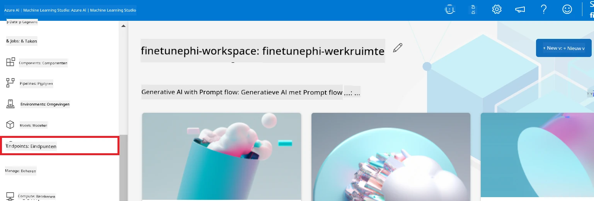

2. Selecteer de endpoint die je hebt aangemaakt.

    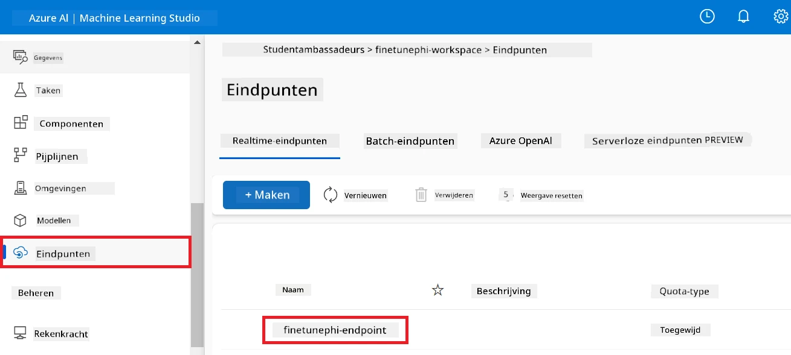

3. Op deze pagina kun je de endpoints beheren die zijn aangemaakt tijdens het implementatieproces.

## Scenario 3: Integreren met Prompt flow en chatten met je aangepaste model

### Integreer het aangepaste Phi-3 model met Prompt flow

Nadat je je fijn-afgestelde model succesvol hebt geïmplementeerd, kun je het nu integreren met Prompt flow om je model te gebruiken in realtime toepassingen, wat een verscheidenheid aan interactieve taken met je aangepaste Phi-3 model mogelijk maakt.

#### Stel de api-sleutel en endpoint-uri in van het fijn-afgestelde Phi-3 model

1. Navigeer naar de Azure Machine learning workspace die je hebt aangemaakt.
1. Selecteer **Endpoints** in het tabblad aan de linkerkant.
1. Selecteer de endpoint die je hebt aangemaakt.
1. Selecteer **Consume** in het navigatiemenu.
1. Kopieer en plak je **REST endpoint** in het bestand *config.py*, waarbij je `AZURE_ML_ENDPOINT = "your_fine_tuned_model_endpoint_uri"` vervangt door je **REST endpoint**.
1. Kopieer en plak je **Primary key** in het bestand *config.py*, waarbij je `AZURE_ML_API_KEY = "your_fine_tuned_model_api_key"` vervangt door je **Primary key**.

    

#### Voeg code toe aan het *flow.dag.yml* bestand

1. Open het bestand *flow.dag.yml* in Visual Studio Code.

1. Voeg de volgende code toe aan *flow.dag.yml*.

    ```yml
    inputs:
      input_data:
        type: string
        default: "Who founded Microsoft?"

    outputs:
      answer:
        type: string
        reference: ${integrate_with_promptflow.output}

    nodes:
    - name: integrate_with_promptflow
      type: python
      source:
        type: code
        path: integrate_with_promptflow.py
      inputs:
        input_data: ${inputs.input_data}
    ```

#### Voeg code toe aan het *integrate_with_promptflow.py* bestand

1. Open het bestand *integrate_with_promptflow.py* in Visual Studio Code.

1. Voeg de volgende code toe aan *integrate_with_promptflow.py*.

    ```python
    import logging
    import requests
    from promptflow.core import tool
    import asyncio
    import platform
    from config import (
        AZURE_ML_ENDPOINT,
        AZURE_ML_API_KEY
    )

    # Logging configuratie
    logging.basicConfig(
        format="%(asctime)s - %(levelname)s - %(name)s - %(message)s",
        datefmt="%Y-%m-%d %H:%M:%S",
        level=logging.DEBUG
    )
    logger = logging.getLogger(__name__)

    def query_azml_endpoint(input_data: list, endpoint_url: str, api_key: str) -> str:
        """
        Send a request to the Azure ML endpoint with the given input data.
        """
        headers = {
            "Content-Type": "application/json",
            "Authorization": f"Bearer {api_key}"
        }
        data = {
            "input_data": [input_data],
            "params": {
                "temperature": 0.7,
                "max_new_tokens": 128,
                "do_sample": True,
                "return_full_text": True
            }
        }
        try:
            response = requests.post(endpoint_url, json=data, headers=headers)
            response.raise_for_status()
            result = response.json()[0]
            logger.info("Successfully received response from Azure ML Endpoint.")
            return result
        except requests.exceptions.RequestException as e:
            logger.error(f"Error querying Azure ML Endpoint: {e}")
            raise

    def setup_asyncio_policy():
        """
        Setup asyncio event loop policy for Windows.
        """
        if platform.system() == 'Windows':
            asyncio.set_event_loop_policy(asyncio.WindowsSelectorEventLoopPolicy())
            logger.info("Set Windows asyncio event loop policy.")

    @tool
    def my_python_tool(input_data: str) -> str:
        """
        Tool function to process input data and query the Azure ML endpoint.
        """
        setup_asyncio_policy()
        return query_azml_endpoint(input_data, AZURE_ML_ENDPOINT, AZURE_ML_API_KEY)

    ```

### Chat met je aangepaste model

1. Typ het volgende commando om het script *deploy_model.py* uit te voeren en het implementatieproces in Azure Machine Learning te starten.

    ```python
    pf flow serve --source ./ --port 8080 --host localhost
    ```

1. Hier is een voorbeeld van de resultaten: nu kun je chatten met je aangepaste Phi-3 model. Het wordt aanbevolen om vragen te stellen op basis van de data die gebruikt is voor het fijn-afstellen.

    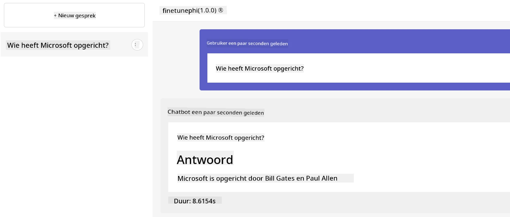

---

<!-- CO-OP TRANSLATOR DISCLAIMER START -->
**Disclaimer**:  
Dit document is vertaald met behulp van de AI vertaaldienst [Co-op Translator](https://github.com/Azure/co-op-translator). Hoewel wij streven naar nauwkeurigheid, dient u er rekening mee te houden dat automatische vertalingen fouten of onnauwkeurigheden kunnen bevatten. Het originele document in de oorspronkelijke taal wordt beschouwd als de gezaghebbende bron. Voor cruciale informatie wordt professionele menselijke vertaling aanbevolen. Wij zijn niet aansprakelijk voor misverstanden of verkeerde interpretaties die voortvloeien uit het gebruik van deze vertaling.
<!-- CO-OP TRANSLATOR DISCLAIMER END -->