<!--
CO_OP_TRANSLATOR_METADATA:
{
  "original_hash": "0df910a227098303cc392b6ad204c271",
  "translation_date": "2026-01-06T04:50:00+00:00",
  "source_file": "md/02.Application/01.TextAndChat/Phi3/E2E_Phi-3-FineTuning_PromptFlow_Integration_AIFoundry.md",
  "language_code": "nl"
}
-->
# Fijn afstemmen en integreren van aangepaste Phi-3-modellen met Prompt flow in Azure AI Foundry

Deze end-to-end (E2E) voorbeeld is gebaseerd op de gids "[Fijn afstemmen en integreren van aangepaste Phi-3-modellen met Prompt flow in Azure AI Foundry](https://techcommunity.microsoft.com/t5/educator-developer-blog/fine-tune-and-integrate-custom-phi-3-models-with-prompt-flow-in/ba-p/4191726?WT.mc_id=aiml-137032-kinfeylo)" van de Microsoft Tech Community. Het introduceert de processen van fijn afstemmen, implementeren en integreren van aangepaste Phi-3-modellen met Prompt flow in Azure AI Foundry.
In tegenstelling tot de E2E voorbeeld, "[Fijn afstemmen en integreren van aangepaste Phi-3-modellen met Prompt flow](./E2E_Phi-3-FineTuning_PromptFlow_Integration.md)", waarbij code lokaal werd uitgevoerd, richt deze tutorial zich volledig op het fijn afstemmen en integreren van uw model binnen Azure AI / ML Studio.

## Overzicht

In dit E2E voorbeeld leert u hoe u het Phi-3 model fijn afstemt en integreert met Prompt flow in Azure AI Foundry. Door gebruik te maken van Azure AI / ML Studio stelt u een workflow op voor het implementeren en gebruiken van aangepaste AI-modellen. Dit E2E voorbeeld is verdeeld in drie scenario's:

**Scenario 1: Azure-bronnen instellen en voorbereiden voor fijn afstemmen**

**Scenario 2: Het Phi-3 model fijn afstemmen en implementeren in Azure Machine Learning Studio**

**Scenario 3: Integreren met Prompt flow en chatten met uw aangepaste model in Azure AI Foundry**

Hier is een overzicht van dit E2E voorbeeld.

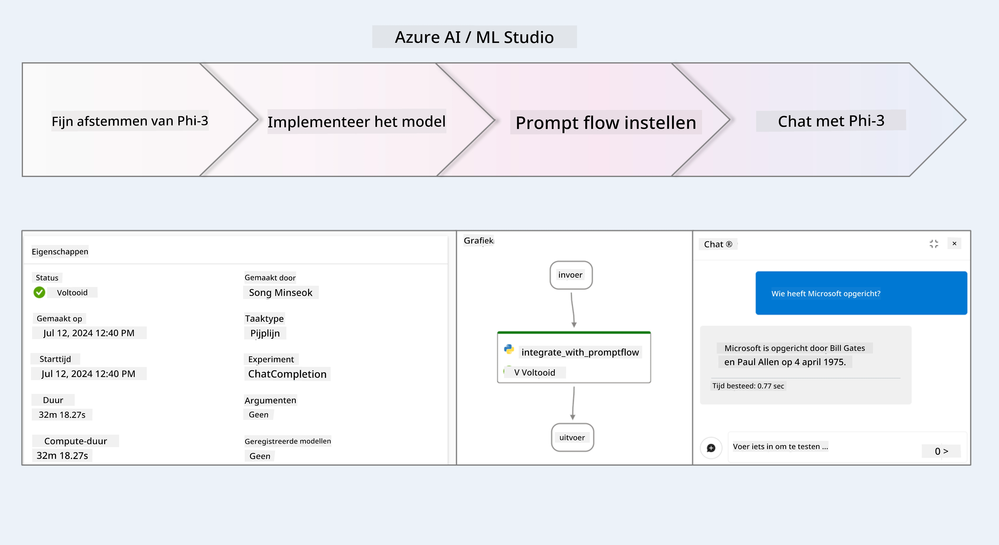

### Inhoudsopgave

1. **[Scenario 1: Azure-bronnen instellen en voorbereiden voor fijn afstemmen](../../../../../../md/02.Application/01.TextAndChat/Phi3)**
    - [Een Azure Machine Learning werkruimte maken](../../../../../../md/02.Application/01.TextAndChat/Phi3)
    - [GPU-quotums aanvragen in Azure-abonnement](../../../../../../md/02.Application/01.TextAndChat/Phi3)
    - [Roltoewijzing toevoegen](../../../../../../md/02.Application/01.TextAndChat/Phi3)
    - [Project opzetten](../../../../../../md/02.Application/01.TextAndChat/Phi3)
    - [Dataset voorbereiden voor fijn afstemmen](../../../../../../md/02.Application/01.TextAndChat/Phi3)

1. **[Scenario 2: Phi-3 model fijn afstemmen en implementeren in Azure Machine Learning Studio](../../../../../../md/02.Application/01.TextAndChat/Phi3)**
    - [Het Phi-3 model fijn afstemmen](../../../../../../md/02.Application/01.TextAndChat/Phi3)
    - [Het fijn afgestemde Phi-3 model implementeren](../../../../../../md/02.Application/01.TextAndChat/Phi3)

1. **[Scenario 3: Integreren met Prompt flow en chatten met uw aangepaste model in Azure AI Foundry](../../../../../../md/02.Application/01.TextAndChat/Phi3)**
    - [Het aangepaste Phi-3 model integreren met Prompt flow](../../../../../../md/02.Application/01.TextAndChat/Phi3)
    - [Chatten met uw aangepaste Phi-3 model](../../../../../../md/02.Application/01.TextAndChat/Phi3)

## Scenario 1: Azure-bronnen instellen en voorbereiden voor fijn afstemmen

### Een Azure Machine Learning werkruimte maken

1. Typ *azure machine learning* in de **zoekbalk** bovenaan de portalpagina en selecteer **Azure Machine Learning** uit de opties die verschijnen.

    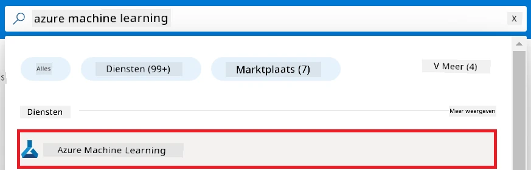

2. Selecteer **+ Maak aan** in het navigatiemenu.

3. Selecteer **Nieuwe werkruimte** in het navigatiemenu.

    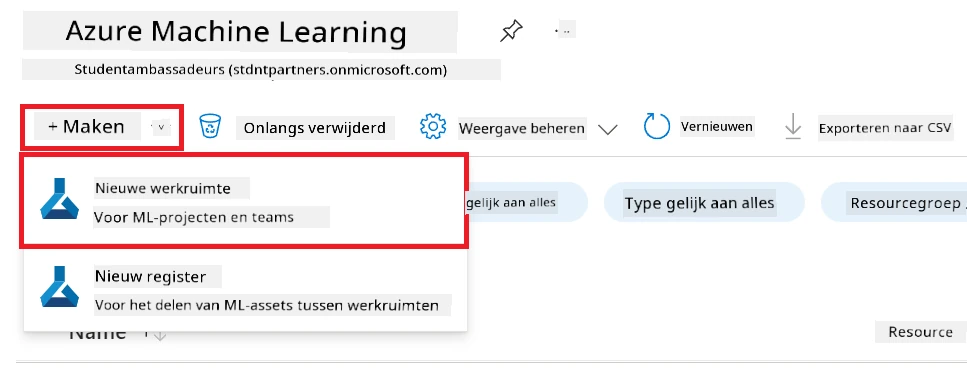

4. Voer de volgende taken uit:

    - Selecteer uw Azure **Abonnement**.
    - Selecteer de **Resourcegroep** die u wilt gebruiken (maak er een nieuwe aan indien nodig).
    - Voer een **Werkruimte naam** in. Deze moet een unieke waarde zijn.
    - Selecteer de **Regio** die u wilt gebruiken.
    - Selecteer het **Opslagaccount** om te gebruiken (maak er een nieuwe aan indien nodig).
    - Selecteer de **Key vault** om te gebruiken (maak er een nieuwe aan indien nodig).
    - Selecteer de **Application insights** om te gebruiken (maak er een nieuwe aan indien nodig).
    - Selecteer de **Containerregistratie** om te gebruiken (maak er een nieuwe aan indien nodig).

    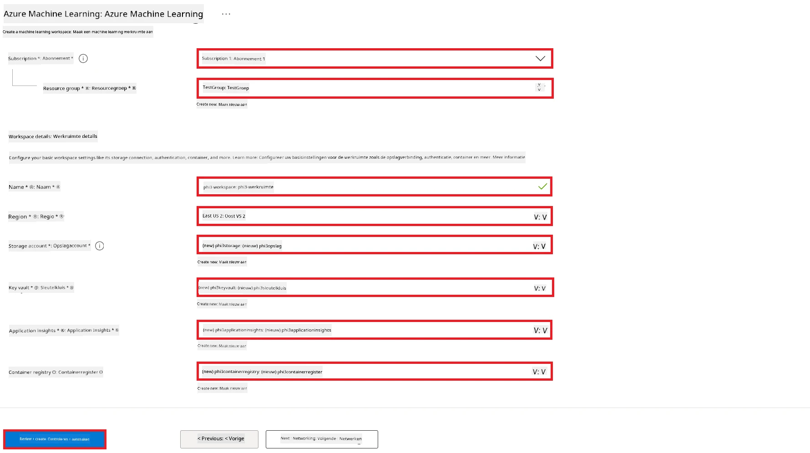

5. Selecteer **Controleren + aanmaken**.

6. Selecteer **Aanmaken**.

### GPU-quotums aanvragen in Azure-abonnement

In deze tutorial leert u hoe u een Phi-3 model fijn afstemt en implementeert met gebruik van GPU's. Voor het fijn afstemmen gebruikt u de *Standard_NC24ads_A100_v4* GPU, waarvoor een quotumverzoek nodig is. Voor implementatie gebruikt u de *Standard_NC6s_v3* GPU, waarvoor ook een quotumverzoek vereist is.

> [!NOTE]
>
> Alleen Pay-As-You-Go abonnementen (het standaard abonnementstype) komen in aanmerking voor GPU-toewijzing; voordeelabonnementen worden momenteel niet ondersteund.
>

1. Bezoek [Azure ML Studio](https://ml.azure.com/home?wt.mc_id=studentamb_279723).

1. Voer de volgende taken uit om het *Standard NCADSA100v4 Family* quotum aan te vragen:

    - Selecteer **Quotum** in de linker tab.
    - Selecteer de **Virtual machine family** die u wilt gebruiken. Bijvoorbeeld, selecteer **Standard NCADSA100v4 Family Cluster Dedicated vCPUs**, dat de *Standard_NC24ads_A100_v4* GPU omvat.
    - Selecteer **Quotum aanvragen** in het navigatiemenu.

        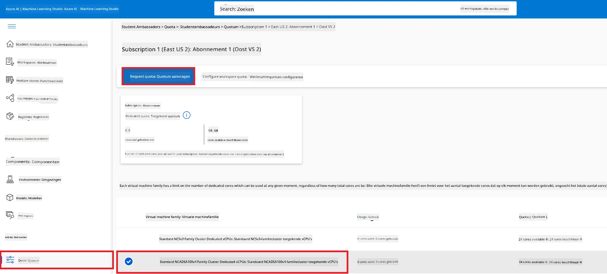

    - Vul op de pagina Quotum aanvragen de gewenste **Nieuwe kernlimiet** in. Bijvoorbeeld 24.
    - Selecteer **Verzenden** om het GPU-quotum aan te vragen.

1. Voer de volgende taken uit om het *Standard NCSv3 Family* quotum aan te vragen:

    - Selecteer **Quotum** in de linker tab.
    - Selecteer de **Virtual machine family** die u wilt gebruiken. Bijvoorbeeld, selecteer **Standard NCSv3 Family Cluster Dedicated vCPUs**, dat de *Standard_NC6s_v3* GPU omvat.
    - Selecteer **Quotum aanvragen** in het navigatiemenu.
    - Vul op de pagina Quotum aanvragen de gewenste **Nieuwe kernlimiet** in. Bijvoorbeeld 24.
    - Selecteer **Verzenden** om het GPU-quotum aan te vragen.

### Roltoewijzing toevoegen

Om uw modellen fijn af te stemmen en te implementeren, moet u eerst een User Assigned Managed Identity (UAI) aanmaken en deze de juiste machtigingen geven. Deze UAI wordt gebruikt voor authenticatie tijdens implementatie.

#### Een User Assigned Managed Identity (UAI) aanmaken

1. Typ *managed identities* in de **zoekbalk** bovenaan de portalpagina en selecteer **Managed Identities** uit de opties die verschijnen.

    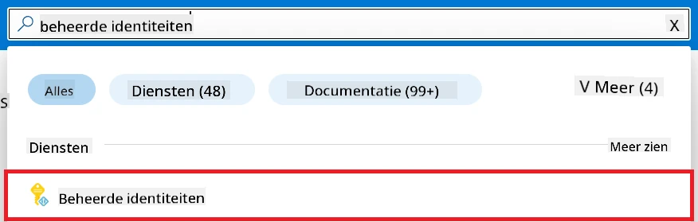

1. Selecteer **+ Aanmaken**.

    

1. Voer de volgende taken uit:

    - Selecteer uw Azure **Abonnement**.
    - Selecteer de **Resourcegroep** die u wilt gebruiken (maak er een nieuwe aan indien nodig).
    - Selecteer de **Regio** die u wilt gebruiken.
    - Voer de **Naam** in. Deze moet een unieke waarde zijn.

    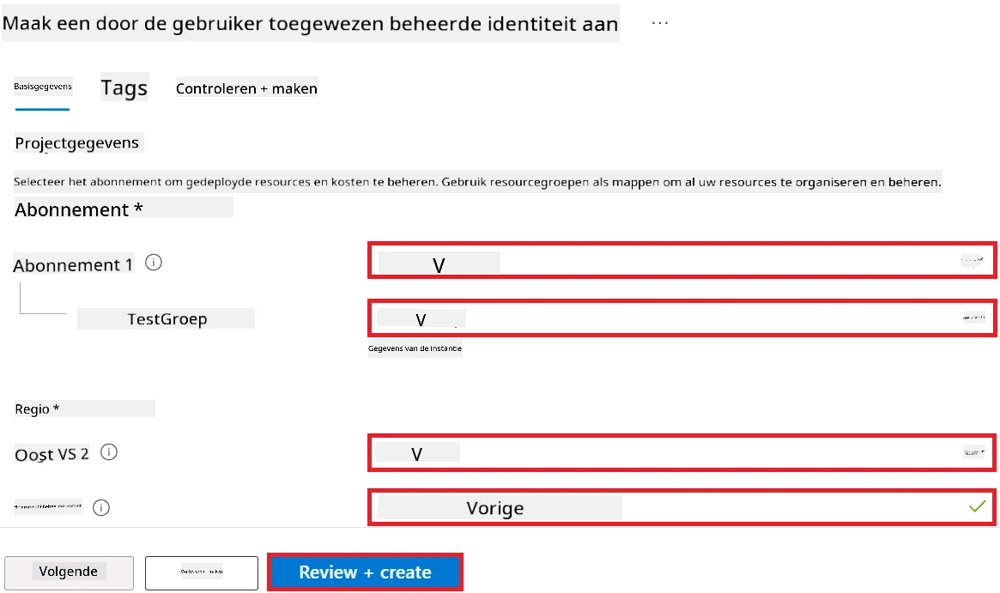

1. Selecteer **Controleren + aanmaken**.

1. Selecteer **+ Aanmaken**.

#### Contributor roltoewijzing toewijzen aan Managed Identity

1. Navigeer naar de Managed Identity resource die u hebt aangemaakt.

1. Selecteer **Azure roltoewijzingen** in het linker tabblad.

1. Selecteer **+ Roltoewijzing toevoegen** in het navigatiemenu.

1. Voer op de pagina Roltoewijzing toevoegen de volgende taken uit:
    - Stel de **Scope** in op **Resourcegroep**.
    - Selecteer uw Azure **Abonnement**.
    - Selecteer de **Resourcegroep** die u wilt gebruiken.
    - Stel de **Rol** in op **Contributor**.

    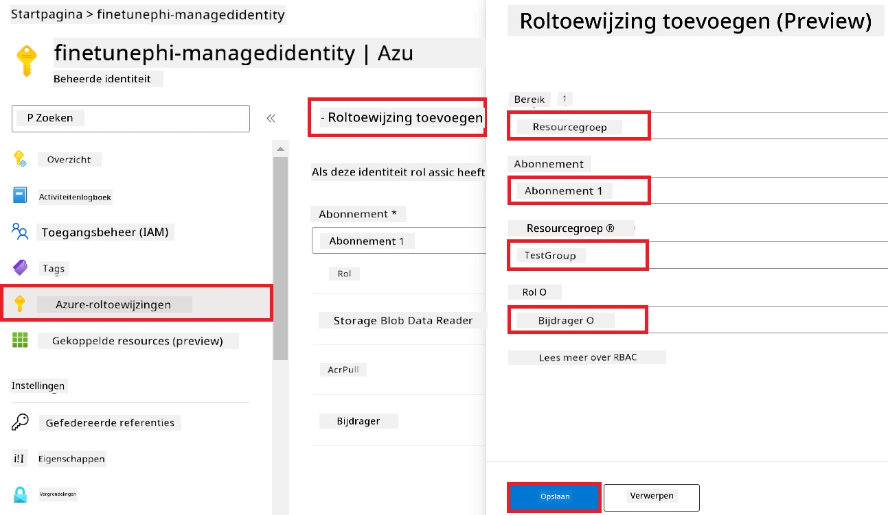

2. Selecteer **Opslaan**.

#### Storage Blob Data Reader roltoewijzing toevoegen aan Managed Identity

1. Typ *storage accounts* in de **zoekbalk** bovenaan de portalpagina en selecteer **Storage accounts** uit de opties die verschijnen.

    

1. Selecteer het opslagaccount dat is gekoppeld aan de Azure Machine Learning werkruimte die u hebt gemaakt. Bijvoorbeeld *finetunephistorage*.

1. Voer de volgende taken uit om naar de pagina Roltoewijzing toevoegen te navigeren:

    - Navigeer naar het Azure Storage-account dat u hebt gemaakt.
    - Selecteer **Toegangsbeheer (IAM)** in het linker tabblad.
    - Selecteer **+ Toevoegen** in het navigatiemenu.
    - Selecteer **Roltoewijzing toevoegen** in het navigatiemenu.

    

1. Voer op de pagina Roltoewijzing toevoegen de volgende taken uit:

    - Typ op de pagina Rol *Storage Blob Data Reader* in de **zoekbalk** en selecteer **Storage Blob Data Reader** uit de opties die verschijnen.
    - Selecteer **Volgende** op de pagina Rol.
    - Selecteer op de pagina Leden onder **Toegang toewijzen aan** de optie **Managed identity**.
    - Selecteer **+ Leden selecteren** op de pagina Leden.
    - Selecteer uw Azure **Abonnement** op de pagina Managed identities selecteren.
    - Selecteer de **Managed identity** als **Manage Identity**.
    - Selecteer de Manage Identity die u hebt aangemaakt. Bijvoorbeeld *finetunephi-managedidentity*.
    - Selecteer **Selecteren** op de pagina Managed identities selecteren.

    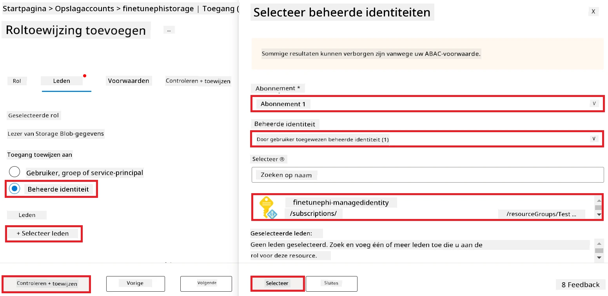

1. Selecteer **Controleren + toewijzen**.

#### AcrPull roltoewijzing toevoegen aan Managed Identity

1. Typ *container registries* in de **zoekbalk** bovenaan de portalpagina en selecteer **Container registries** uit de opties die verschijnen.

    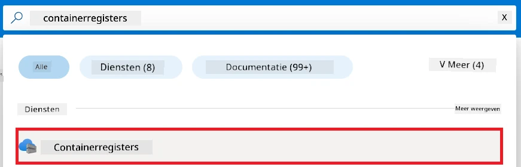

1. Selecteer de containerregistratie die gekoppeld is aan de Azure Machine Learning werkruimte. Bijvoorbeeld *finetunephicontainerregistry*.

1. Voer de volgende taken uit om naar de pagina Roltoewijzing toevoegen te navigeren:

    - Selecteer **Toegangsbeheer (IAM)** in het linker tabblad.
    - Selecteer **+ Toevoegen** in het navigatiemenu.
    - Selecteer **Roltoewijzing toevoegen** in het navigatiemenu.

1. Voer op de pagina Roltoewijzing toevoegen de volgende taken uit:

    - Typ op de pagina Rol *AcrPull* in de **zoekbalk** en selecteer **AcrPull** uit de opties die verschijnen.
    - Selecteer **Volgende** op de pagina Rol.
    - Selecteer op de pagina Leden onder **Toegang toewijzen aan** de optie **Managed identity**.
    - Selecteer **+ Leden selecteren** op de pagina Leden.
    - Selecteer uw Azure **Abonnement** op de pagina Managed identities selecteren.
    - Selecteer de **Managed identity** als **Manage Identity**.
    - Selecteer de Manage Identity die u hebt aangemaakt. Bijvoorbeeld *finetunephi-managedidentity*.
    - Selecteer **Selecteren** op de pagina Managed identities selecteren.
    - Selecteer **Controleren + toewijzen**.

### Project opzetten

Om de datasets te downloaden die nodig zijn voor het fijn afstemmen, stelt u een lokale omgeving in.

In deze oefening gaat u

- Een map maken om in te werken.
- Een virtuele omgeving aanmaken.
- De benodigde pakketten installeren.
- Een *download_dataset.py* bestand aanmaken om de dataset te downloaden.

#### Een map maken om in te werken

1. Open een terminalvenster en typ de volgende opdracht om een map genaamd *finetune-phi* te maken in het standaardpad.

    ```console
    mkdir finetune-phi
    ```

2. Typ de volgende opdracht in je terminal om naar de *finetune-phi* map te navigeren die je hebt aangemaakt.

    ```console
    cd finetune-phi
    ```

#### Maak een virtuele omgeving aan

1. Typ de volgende opdracht in je terminal om een virtuele omgeving te maken met de naam *.venv*.

    ```console
    python -m venv .venv
    ```

2. Typ de volgende opdracht in je terminal om de virtuele omgeving te activeren.

    ```console
    .venv\Scripts\activate.bat
    ```

> [!NOTE]
> Als het gelukt is, zou je *(.venv)* voor de opdrachtprompt moeten zien staan.

#### Installeer de vereiste pakketten

1. Typ de volgende opdrachten in je terminal om de vereiste pakketten te installeren.

    ```console
    pip install datasets==2.19.1
    ```

#### Maak `donload_dataset.py` aan

> [!NOTE]
> Volledige mappenstructuur:
>
> ```text
> └── YourUserName
> .    └── finetune-phi
> .        └── download_dataset.py
> ```

1. Open **Visual Studio Code**.

1. Selecteer **Bestand** in de menubalk.

1. Selecteer **Map openen**.

1. Selecteer de *finetune-phi* map die je hebt aangemaakt, die zich bevindt op *C:\Users\yourUserName\finetune-phi*.

    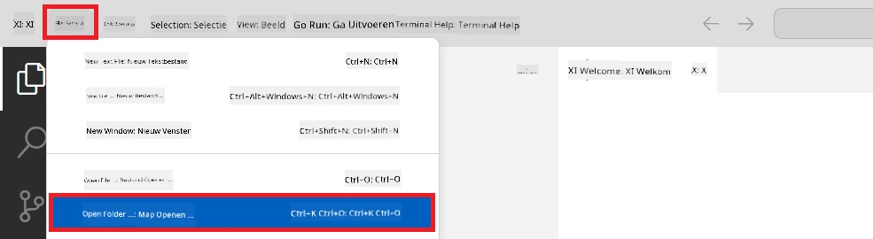

1. Klik in het linker paneel van Visual Studio Code met de rechtermuisknop en selecteer **Nieuw bestand** om een nieuw bestand aan te maken met de naam *download_dataset.py*.

    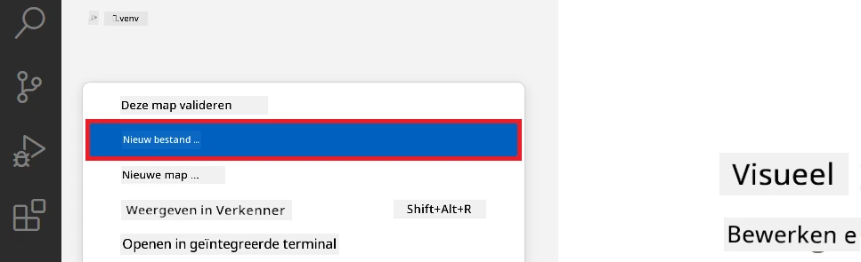

### Bereid dataset voor fine-tuning voor

In deze oefening ga je het bestand *download_dataset.py* uitvoeren om de *ultrachat_200k* datasets naar je lokale omgeving te downloaden. Vervolgens ga je deze datasets gebruiken om het Phi-3 model in Azure Machine Learning te finetunen.

In deze oefening ga je:

- Code toevoegen aan het bestand *download_dataset.py* om de datasets te downloaden.
- Het bestand *download_dataset.py* uitvoeren om de datasets naar je lokale omgeving te downloaden.

#### Download je dataset met *download_dataset.py*

1. Open het bestand *download_dataset.py* in Visual Studio Code.

1. Voeg de volgende code toe in het bestand *download_dataset.py*.

    ```python
    import json
    import os
    from datasets import load_dataset

    def load_and_split_dataset(dataset_name, config_name, split_ratio):
        """
        Load and split a dataset.
        """
        # Laad de dataset met de gespecificeerde naam, configuratie en splitsingsverhouding
        dataset = load_dataset(dataset_name, config_name, split=split_ratio)
        print(f"Original dataset size: {len(dataset)}")
        
        # Splits de dataset in train- en testsets (80% train, 20% test)
        split_dataset = dataset.train_test_split(test_size=0.2)
        print(f"Train dataset size: {len(split_dataset['train'])}")
        print(f"Test dataset size: {len(split_dataset['test'])}")
        
        return split_dataset

    def save_dataset_to_jsonl(dataset, filepath):
        """
        Save a dataset to a JSONL file.
        """
        # Maak de map aan als deze niet bestaat
        os.makedirs(os.path.dirname(filepath), exist_ok=True)
        
        # Open het bestand in schrijfmodes
        with open(filepath, 'w', encoding='utf-8') as f:
            # Itereer over elk record in de dataset
            for record in dataset:
                # Dump het record als een JSON-object en schrijf het naar het bestand
                json.dump(record, f)
                # Schrijf een nieuwe regelkarakter om records te scheiden
                f.write('\n')
        
        print(f"Dataset saved to {filepath}")

    def main():
        """
        Main function to load, split, and save the dataset.
        """
        # Laad en splits de ULTRACHAT_200k dataset met een specifieke configuratie en splitsingsverhouding
        dataset = load_and_split_dataset("HuggingFaceH4/ultrachat_200k", 'default', 'train_sft[:1%]')
        
        # Extraheer de train- en testdatasets uit de splitsing
        train_dataset = dataset['train']
        test_dataset = dataset['test']

        # Sla de train dataset op in een JSONL-bestand
        save_dataset_to_jsonl(train_dataset, "data/train_data.jsonl")
        
        # Sla de test dataset op in een apart JSONL-bestand
        save_dataset_to_jsonl(test_dataset, "data/test_data.jsonl")

    if __name__ == "__main__":
        main()

    ```

1. Typ de volgende opdracht in je terminal om het script uit te voeren en de dataset naar je lokale omgeving te downloaden.

    ```console
    python download_dataset.py
    ```

1. Controleer of de datasets succesvol zijn opgeslagen in je lokale *finetune-phi/data* map.

> [!NOTE]
>
> #### Opmerking over datasetgrootte en fine-tuning tijd
>
> In deze tutorial gebruik je slechts 1% van de dataset (`split='train[:1%]'`). Dit verkleint de hoeveelheid data aanzienlijk, waardoor zowel het uploaden als het fine-tunen versneld wordt. Je kunt het percentage aanpassen om de juiste balans te vinden tussen de trainingstijd en modelprestaties. Het gebruik van een kleinere subset van de dataset verkort de tijd die benodigd is voor fine-tuning, wat het proces beheersbaarder maakt voor een tutorial.

## Scenario 2: Fine-tune het Phi-3 model en implementeer in Azure Machine Learning Studio

### Fine-tune het Phi-3 model

In deze oefening ga je het Phi-3 model finetunen in Azure Machine Learning Studio.

In deze oefening ga je:

- Een computercluster maken voor fine-tuning.
- Het Phi-3 model finetunen in Azure Machine Learning Studio.

#### Maak een computercluster aan voor fine-tuning

1. Ga naar [Azure ML Studio](https://ml.azure.com/home?wt.mc_id=studentamb_279723).

1. Selecteer **Compute** in het linker zijmenu.

1. Selecteer **Compute clusters** in het navigatiemenu.

1. Selecteer **+ Nieuw**.

    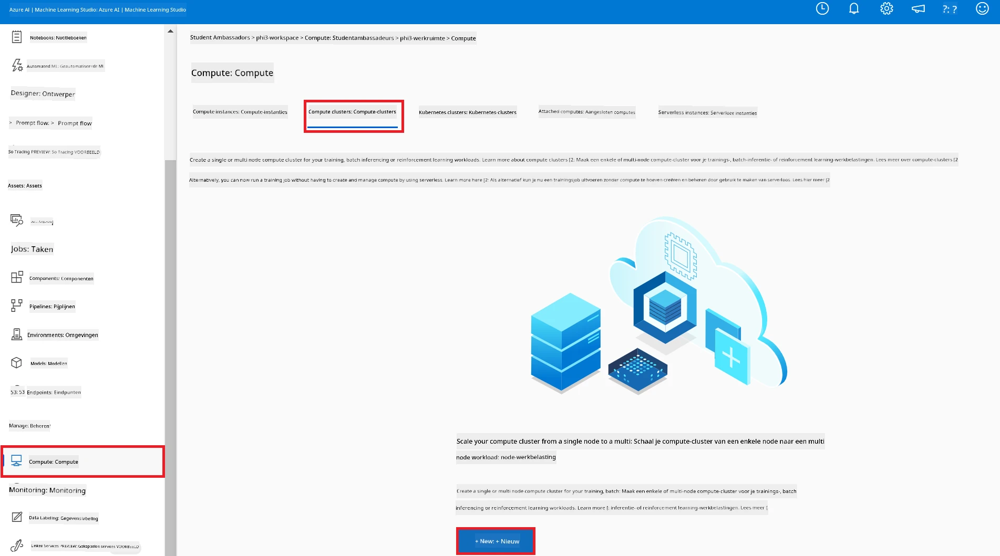

1. Voer de volgende taken uit:

    - Selecteer de **Regio** die je wilt gebruiken.
    - Selecteer de **Virtual machine tier** op **Dedicated**.
    - Selecteer het **Virtual machine type** op **GPU**.
    - Selecteer het filter voor **Virtual machine size** op **Selecteer uit alle opties**.
    - Selecteer de **Virtual machine size** op **Standard_NC24ads_A100_v4**.

    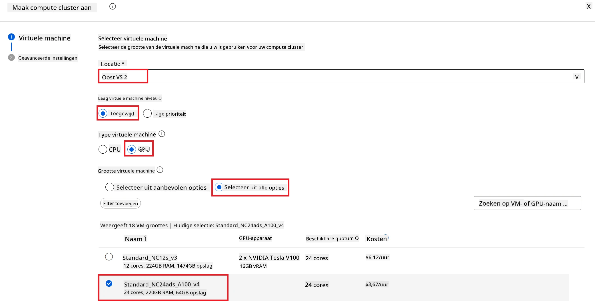

1. Selecteer **Volgende**.

1. Voer de volgende taken uit:

    - Vul de **Compute naam** in. Dit moet een unieke waarde zijn.
    - Stel het **Minimum aantal nodes** in op **0**.
    - Stel het **Maximum aantal nodes** in op **1**.
    - Stel de **Idle seconden voor schalen omlaag** in op **120**.

    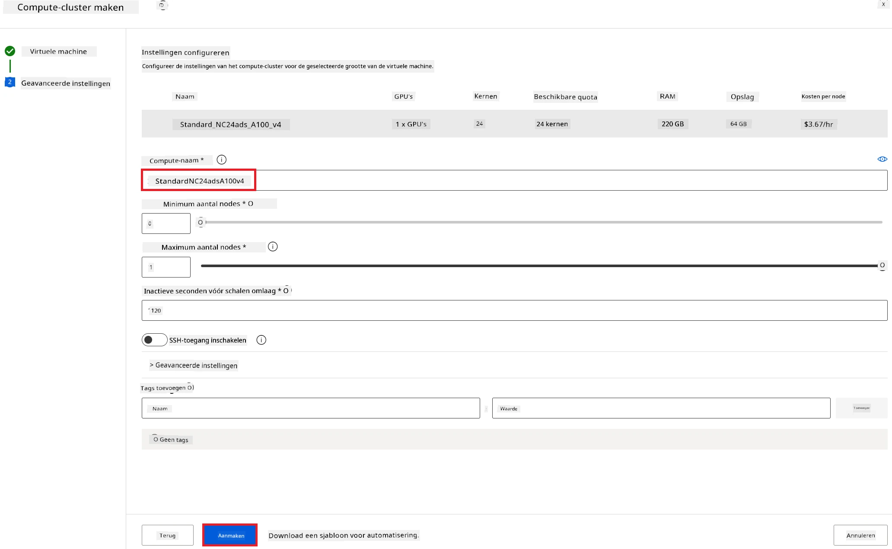

1. Selecteer **Maken**.

#### Fine-tune het Phi-3 model

1. Ga naar [Azure ML Studio](https://ml.azure.com/home?wt.mc_id=studentamb_279723).

1. Selecteer de Azure Machine Learning workspace die je hebt aangemaakt.

    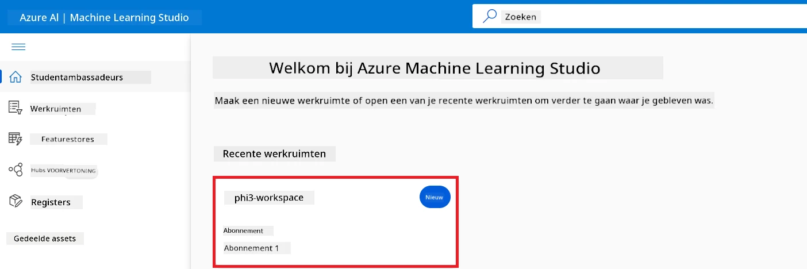

1. Voer de volgende taken uit:

    - Selecteer **Model catalog** in het linker zijmenu.
    - Typ *phi-3-mini-4k* in de **zoekbalk** en selecteer **Phi-3-mini-4k-instruct** uit de opties die verschijnen.

    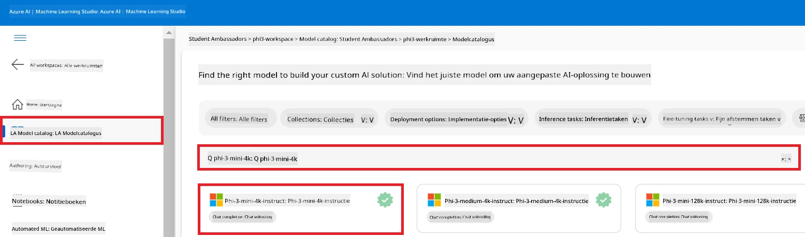

1. Selecteer **Fine-tune** in het navigatiemenu.

    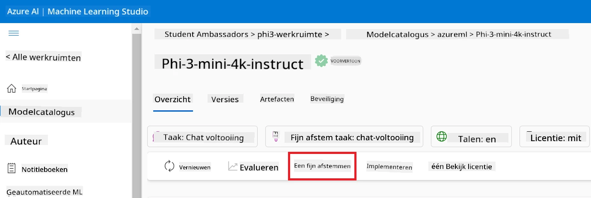

1. Voer de volgende taken uit:

    - Stel **Select task type** in op **Chat completion**.
    - Selecteer **+ Select data** om **Training data** te uploaden.
    - Selecteer het uploadtype voor Validatiegegevens op **Bied verschillende validatiegegevens aan**.
    - Selecteer **+ Select data** om **Validation data** te uploaden.

    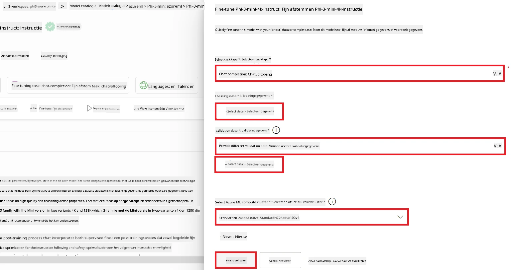

> [!TIP]
>
> Je kunt **Geavanceerde instellingen** selecteren om configuraties zoals **learning_rate** en **lr_scheduler_type** aan te passen om het fine-tuningproces te optimaliseren volgens je specifieke wensen.

1. Selecteer **Voltooien**.

1. In deze oefening heb je het Phi-3 model succesvol gefinetuned met behulp van Azure Machine Learning. Houd er rekening mee dat het fine-tuning proces aanzienlijke tijd kan kosten. Na het starten van de fine-tuning taak moet je wachten tot deze is voltooid. Je kunt de status van de fine-tuning taak volgen door naar het tabblad Taken (Jobs) aan de linkerzijde van je Azure Machine Learning Workspace te navigeren. In de volgende serie ga je het gefinetunede model implementeren en integreren met Prompt flow.

    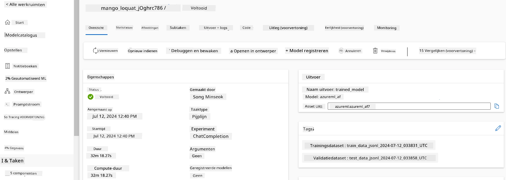

### Implementeer het gefinetunede Phi-3 model

Om het gefinetunede Phi-3 model te integreren met Prompt flow moet je het model implementeren zodat het toegankelijk is voor realtime voorspellingen. Dit proces omvat het registreren van het model, het aanmaken van een online endpoint en het implementeren van het model.

In deze oefening ga je:

- Het gefinetunede model registreren in de Azure Machine Learning workspace.
- Een online endpoint aanmaken.
- Het geregistreerde gefinetunede Phi-3 model implementeren.

#### Registreer het gefinetunede model

1. Ga naar [Azure ML Studio](https://ml.azure.com/home?wt.mc_id=studentamb_279723).

1. Selecteer de Azure Machine Learning workspace die je hebt aangemaakt.

    

1. Selecteer **Modellen** in het linker zijmenu.
1. Selecteer **+ Registreren**.
1. Selecteer **Vanuit output van een taak**.

    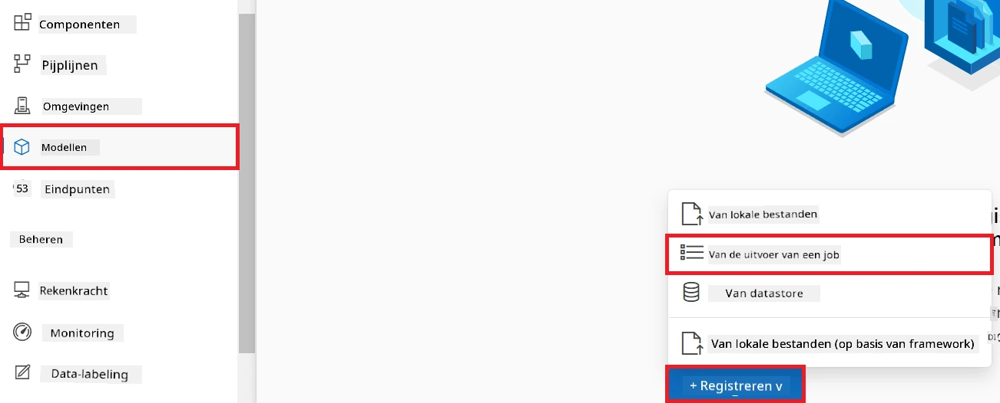

1. Selecteer de taak die je hebt uitgevoerd.

    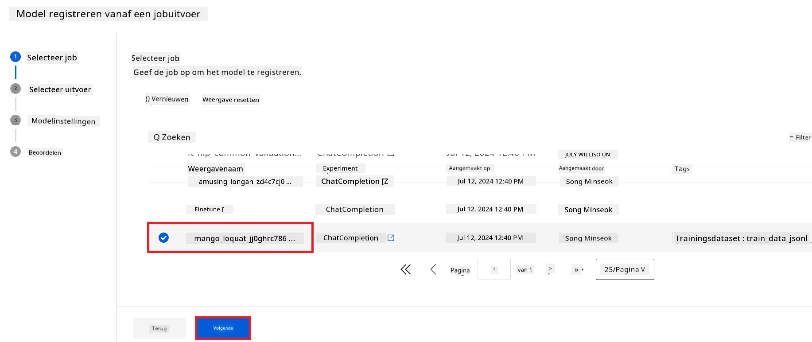

1. Selecteer **Volgende**.

1. Selecteer **Modeltype** op **MLflow**.

1. Zorg ervoor dat **Output van taak** is geselecteerd; dit zou automatisch geselecteerd moeten zijn.

    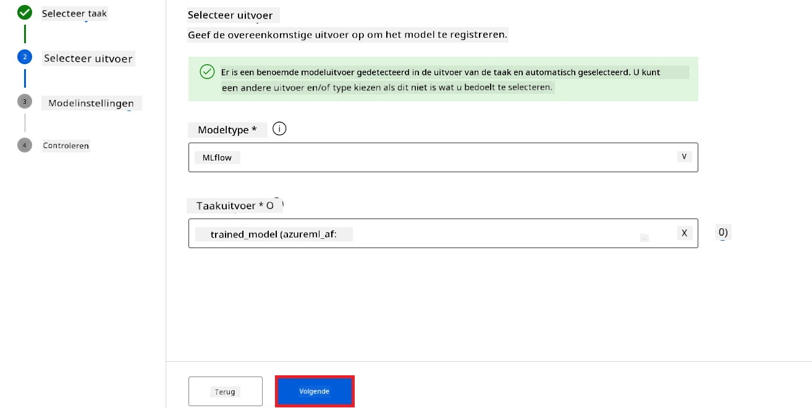

2. Selecteer **Volgende**.

3. Selecteer **Registreren**.

    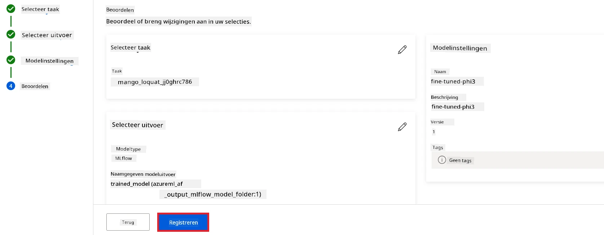

4. Je kunt je geregistreerde model bekijken door te navigeren naar het **Modellen** menu in het linker zijmenu.

    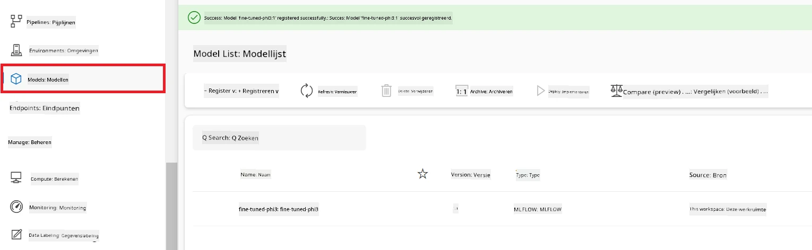

#### Implementeer het gefinetunede model

1. Ga naar de Azure Machine Learning workspace die je hebt aangemaakt.

1. Selecteer **Endpoints** in het linker zijmenu.

1. Selecteer **Realtime endpoints** in het navigatiemenu.

    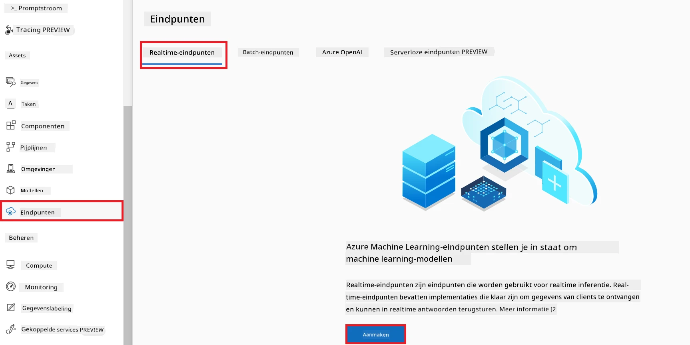

1. Selecteer **Maken**.

1. Selecteer het geregistreerde model dat je hebt aangemaakt.

    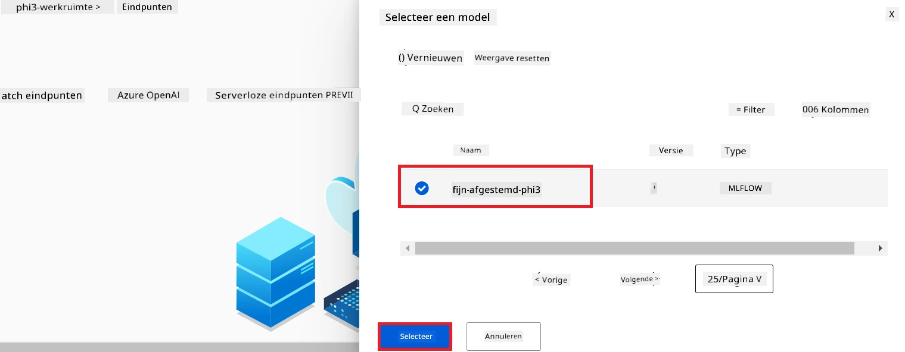

1. Selecteer **Selecteren**.

1. Voer de volgende taken uit:

    - Selecteer **Virtual machine** op *Standard_NC6s_v3*.
    - Selecteer het gewenste **aantal instanties**. Bijvoorbeeld *1*.
    - Selecteer de **Endpoint** op **Nieuw** om een endpoint aan te maken.
    - Vul **Endpoint naam** in. Dit moet een unieke waarde zijn.
    - Vul **Implementatienaam** in. Dit moet een unieke waarde zijn.

    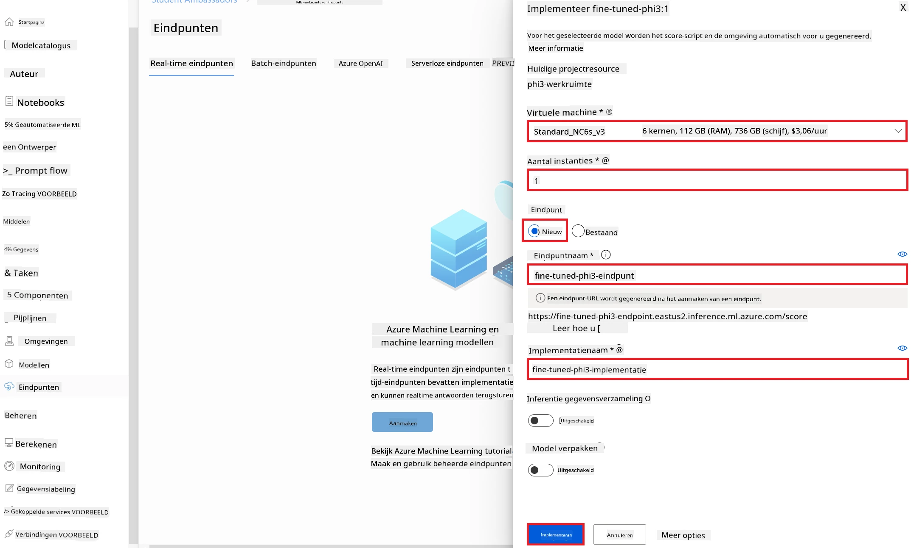

1. Selecteer **Implementeren**.

> [!WARNING]
> Om extra kosten op je account te vermijden, zorg ervoor dat je het aangemaakte endpoint in de Azure Machine Learning workspace verwijdert.
>

#### Controleer implementatiestatus in Azure Machine Learning Workspace

1. Ga naar de Azure Machine Learning workspace die je hebt aangemaakt.

1. Selecteer **Endpoints** in het linker zijmenu.

1. Selecteer het endpoint dat je hebt aangemaakt.

    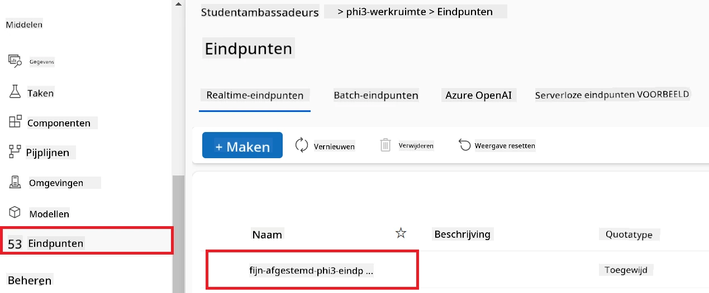

1. Op deze pagina kun je de endpoints beheren tijdens het implementatieproces.

> [!NOTE]
> Zodra de implementatie is voltooid, zorg ervoor dat **Live verkeer** is ingesteld op **100%**. Indien dit niet zo is, selecteer **Verkeer bijwerken** om de verkeersinstellingen aan te passen. Houd er rekening mee dat je het model niet kunt testen als het verkeer op 0% staat.
>
> 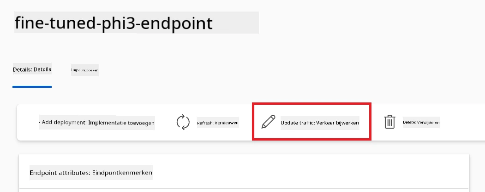
>

## Scenario 3: Integreren met Prompt flow en chatten met je aangepaste model in Azure AI Foundry

### Integreer het aangepaste Phi-3 model met Prompt flow

Nadat je je gefinetunede model succesvol hebt geïmplementeerd, kun je het nu integreren met Prompt Flow om je model te gebruiken in realtime toepassingen, waarmee je diverse interactieve taken kunt uitvoeren met je aangepaste Phi-3 model.

In deze oefening ga je:

- Azure AI Foundry Hub aanmaken.
- Azure AI Foundry Project aanmaken.
- Prompt flow aanmaken.
- Een aangepaste verbinding toevoegen voor het gefinetunede Phi-3 model.
- Prompt flow instellen om met je aangepaste Phi-3 model te chatten.

> [!NOTE]
> Je kunt ook integreren met Promptflow via Azure ML Studio. Hetzelfde integratieproces is toepasbaar op Azure ML Studio.

#### Maak een Azure AI Foundry Hub aan

Je moet eerst een Hub aanmaken voordat je een Project maakt. Een Hub fungeert als een Resource Group, waarmee je meerdere projecten binnen Azure AI Foundry kunt organiseren en beheren.

1. Ga naar [Azure AI Foundry](https://ai.azure.com/?WT.mc_id=aiml-137032-kinfeylo).

1. Selecteer **Alle hubs** in het linker zijmenu.

1. Selecteer **+ Nieuwe hub** in het navigatiemenu.
    

1. Voer de volgende taken uit:

    - Voer **Hub naam** in. Dit moet een unieke waarde zijn.
    - Selecteer uw Azure **Abonnement**.
    - Selecteer de **Resourcegroep** die u wilt gebruiken (maak er indien nodig een nieuwe aan).
    - Selecteer de **Locatie** die u wilt gebruiken.
    - Selecteer de **Connect Azure AI Services** die u wilt gebruiken (maak er indien nodig een nieuwe aan).
    - Selecteer **Connect Azure AI Search** om **Verbinding overslaan** te kiezen.

    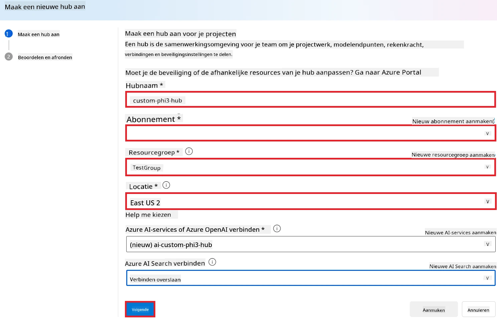

1. Selecteer **Volgende**.

#### Maak Azure AI Foundry-project aan

1. Selecteer in de hub die u hebt aangemaakt **Alle projecten** in het tabblad aan de linkerzijde.

1. Selecteer **+ Nieuw project** in het navigatiemenu.

    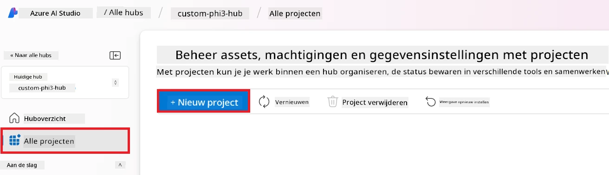

1. Voer een **Projectnaam** in. Dit moet een unieke waarde zijn.

    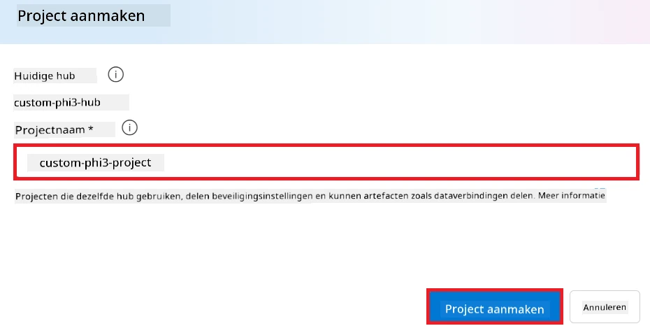

1. Selecteer **Maak een project aan**.

#### Voeg een aangepaste verbinding toe voor het fijn afgestelde Phi-3 model

Om uw aangepaste Phi-3 model te integreren met Prompt flow, moet u het eindpunt en de sleutel van het model opslaan in een aangepaste verbinding. Deze configuratie zorgt voor toegang tot uw aangepaste Phi-3 model in Prompt flow.

#### Stel api-sleutel en eindpunt-URI in van het fijn afgestelde Phi-3 model

1. Bezoek [Azure ML Studio](https://ml.azure.com/home?WT.mc_id=aiml-137032-kinfeylo).

1. Navigeer naar de Azure Machine learning werkruimte die u hebt aangemaakt.

1. Selecteer **Eindpunten** in het tabblad aan de linkerzijde.

    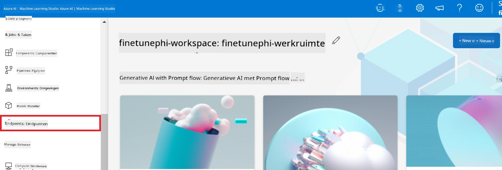

1. Selecteer het eindpunt dat u hebt aangemaakt.

    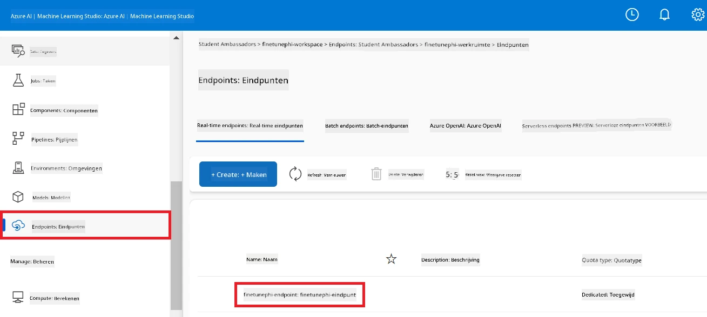

1. Selecteer **Consumeren** in het navigatiemenu.

1. Kopieer uw **REST-eindpunt** en **Primaire sleutel**.

    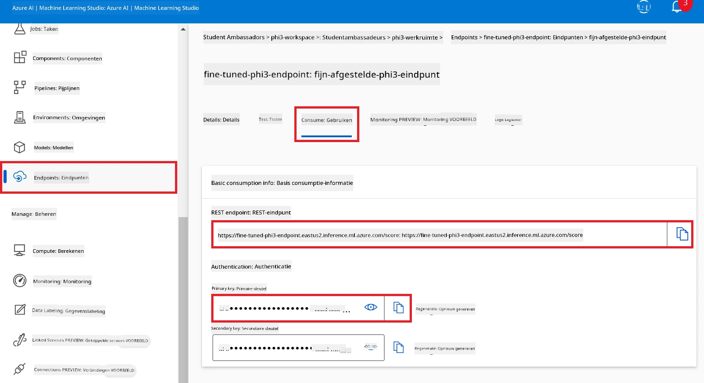

#### Voeg de aangepaste verbinding toe

1. Bezoek [Azure AI Foundry](https://ai.azure.com/?WT.mc_id=aiml-137032-kinfeylo).

1. Navigeer naar het Azure AI Foundry-project dat u hebt aangemaakt.

1. Selecteer in het project dat u hebt aangemaakt **Instellingen** in het tabblad aan de linkerzijde.

1. Selecteer **+ Nieuwe verbinding**.

    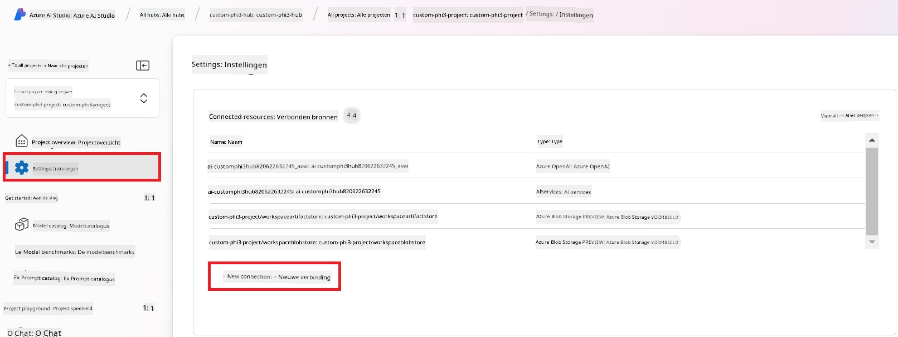

1. Selecteer **Aangepaste sleutels** in het navigatiemenu.

    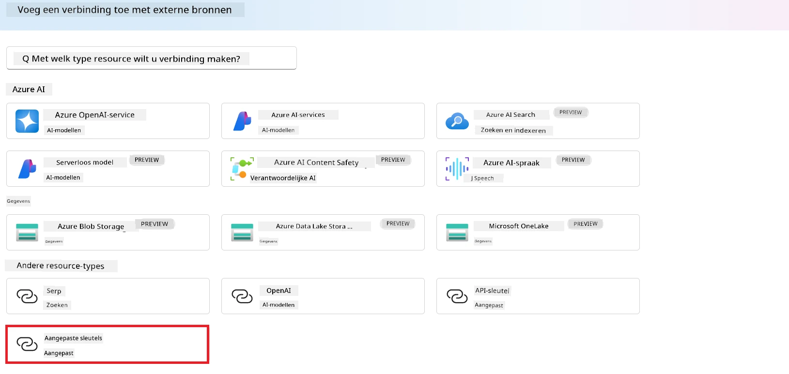

1. Voer de volgende taken uit:

    - Selecteer **+ Sleutel-waardeparen toevoegen**.
    - Voer voor de sleutelnaam **endpoint** in en plak het eindpunt dat u gekopieerd hebt uit Azure ML Studio in het veld waarde.
    - Selecteer opnieuw **+ Sleutel-waardeparen toevoegen**.
    - Voer voor de sleutelnaam **key** in en plak de sleutel die u gekopieerd hebt uit Azure ML Studio in het veld waarde.
    - Nadat u de sleutels hebt toegevoegd, selecteert u **is geheim** om te voorkomen dat de sleutel zichtbaar wordt.

    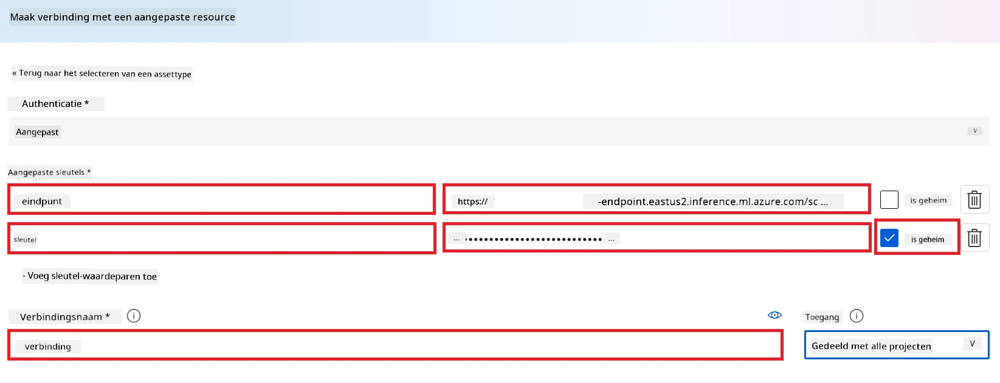

1. Selecteer **Verbinding toevoegen**.

#### Maak Prompt flow aan

U hebt een aangepaste verbinding toegevoegd in Azure AI Foundry. Laten we nu een Prompt flow aanmaken met de volgende stappen. Daarna koppelt u deze Prompt flow aan de aangepaste verbinding, zodat u het fijn afgestelde model binnen Prompt flow kunt gebruiken.

1. Navigeer naar het Azure AI Foundry-project dat u hebt aangemaakt.

1. Selecteer **Prompt flow** in het tabblad aan de linkerzijde.

1. Selecteer **+ Aanmaken** in het navigatiemenu.

    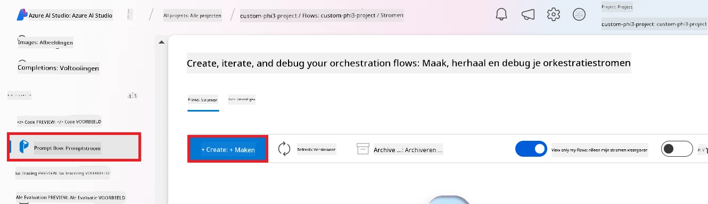

1. Selecteer **Chat flow** in het navigatiemenu.

    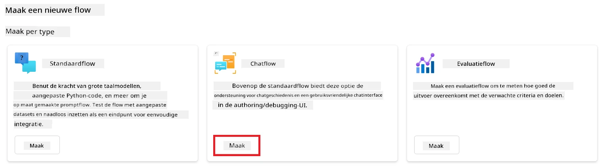

1. Voer een **Mapnaam** in om te gebruiken.

    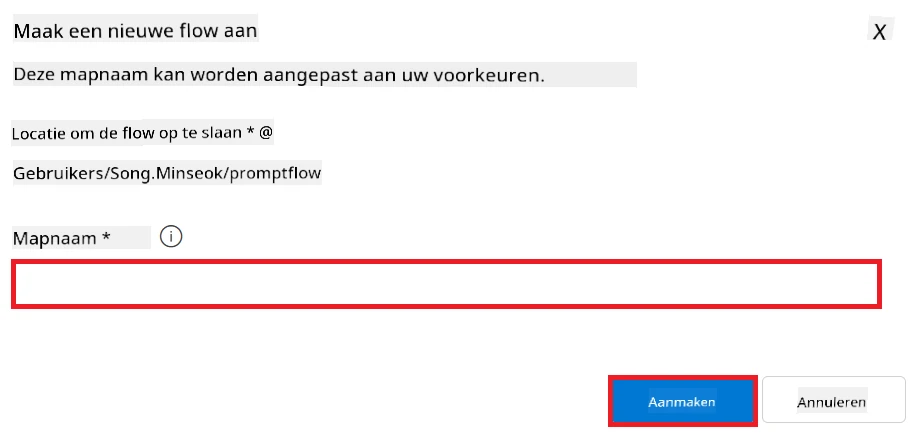

2. Selecteer **Aanmaken**.

#### Stel Prompt flow in om te chatten met uw aangepaste Phi-3 model

U moet het fijn afgestelde Phi-3 model integreren in een Prompt flow. De bestaande Prompt flow die wordt aangeboden, is hier niet voor ontworpen. Daarom moet u de Prompt flow opnieuw ontwerpen om de integratie van het aangepaste model mogelijk te maken.

1. Voer in de Prompt flow de volgende taken uit om de bestaande flow te herbouwen:

    - Selecteer **Ruwe bestandsmodus**.
    - Verwijder alle bestaande code in het bestand *flow.dag.yml*.
    - Voeg de volgende code toe aan het bestand *flow.dag.yml*.

        ```yml
        inputs:
          input_data:
            type: string
            default: "Who founded Microsoft?"

        outputs:
          answer:
            type: string
            reference: ${integrate_with_promptflow.output}

        nodes:
        - name: integrate_with_promptflow
          type: python
          source:
            type: code
            path: integrate_with_promptflow.py
          inputs:
            input_data: ${inputs.input_data}
        ```

    - Selecteer **Opslaan**.

    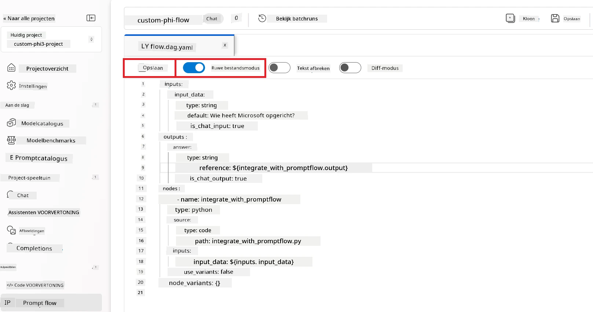

1. Voeg de volgende code toe aan het bestand *integrate_with_promptflow.py* om het aangepaste Phi-3 model in Prompt flow te gebruiken.

    ```python
    import logging
    import requests
    from promptflow import tool
    from promptflow.connections import CustomConnection

    # Logboekconfiguratie
    logging.basicConfig(
        format="%(asctime)s - %(levelname)s - %(name)s - %(message)s",
        datefmt="%Y-%m-%d %H:%M:%S",
        level=logging.DEBUG
    )
    logger = logging.getLogger(__name__)

    def query_phi3_model(input_data: str, connection: CustomConnection) -> str:
        """
        Send a request to the Phi-3 model endpoint with the given input data using Custom Connection.
        """

        # "connection" is de naam van de Aangepaste Verbinding, "endpoint", "key" zijn de sleutels in de Aangepaste Verbinding
        endpoint_url = connection.endpoint
        api_key = connection.key

        headers = {
            "Content-Type": "application/json",
            "Authorization": f"Bearer {api_key}"
        }
        data = {
            "input_data": {
                "input_string": [
                    {"role": "user", "content": input_data}
                ],
                "parameters": {
                    "temperature": 0.7,
                    "max_new_tokens": 128
                }
            }
        }
        try:
            response = requests.post(endpoint_url, json=data, headers=headers)
            response.raise_for_status()
            
            # Log de volledige JSON-respons
            logger.debug(f"Full JSON response: {response.json()}")

            result = response.json()["output"]
            logger.info("Successfully received response from Azure ML Endpoint.")
            return result
        except requests.exceptions.RequestException as e:
            logger.error(f"Error querying Azure ML Endpoint: {e}")
            raise

    @tool
    def my_python_tool(input_data: str, connection: CustomConnection) -> str:
        """
        Tool function to process input data and query the Phi-3 model.
        """
        return query_phi3_model(input_data, connection)

    ```

    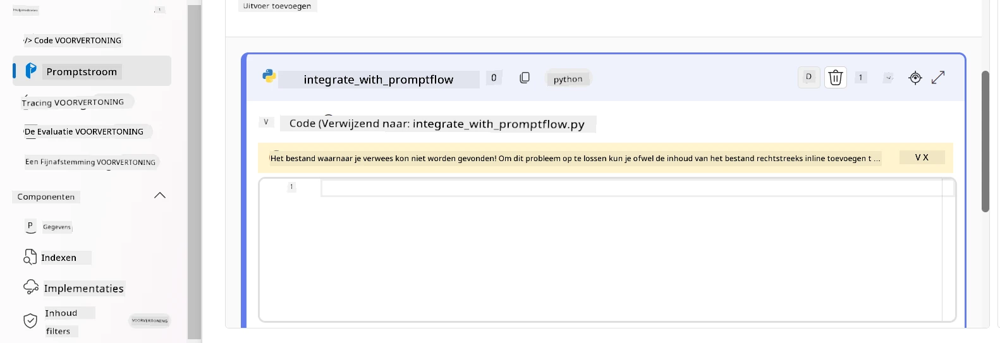

> [!NOTE]
> Voor meer gedetailleerde informatie over het gebruik van Prompt flow in Azure AI Foundry, kunt u kijken op [Prompt flow in Azure AI Foundry](https://learn.microsoft.com/azure/ai-studio/how-to/prompt-flow).

1. Selecteer **Chat invoer**, **Chat uitvoer** om chatten met uw model mogelijk te maken.

    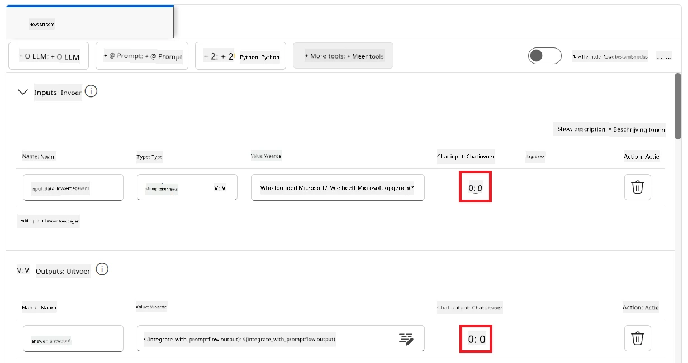

1. U bent nu klaar om te chatten met uw aangepaste Phi-3 model. In de volgende oefening leert u hoe u Prompt flow start en gebruikt om te chatten met uw fijn afgestelde Phi-3 model.

> [!NOTE]
>
> De herbouwde flow zou eruit moeten zien als op de onderstaande afbeelding:
>
> 
>

### Chatten met uw aangepaste Phi-3 model

Nu u uw aangepaste Phi-3 model hebt fijn afgestemd en geïntegreerd met Prompt flow, bent u klaar om te beginnen met interactie. Deze oefening begeleidt u bij het instellen en starten van een chat met uw model via Prompt flow. Door deze stappen te volgen, kunt u de mogelijkheden van uw fijn afgestelde Phi-3 model volledig benutten voor diverse taken en gesprekken.

- Chat met uw aangepaste Phi-3 model met Prompt flow.

#### Start Prompt flow

1. Selecteer **Compute sessies starten** om Prompt flow te starten.

    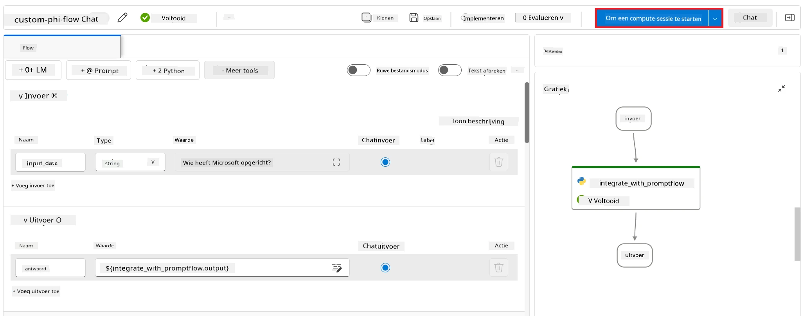

1. Selecteer **Invoer valideren en parsen** om parameters te vernieuwen.

    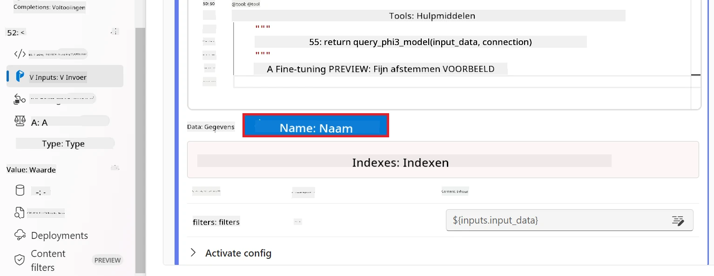

1. Selecteer de **Waarde** van de **verbinding** die u hebt gemaakt als aangepaste verbinding. Bijvoorbeeld *connection*.

    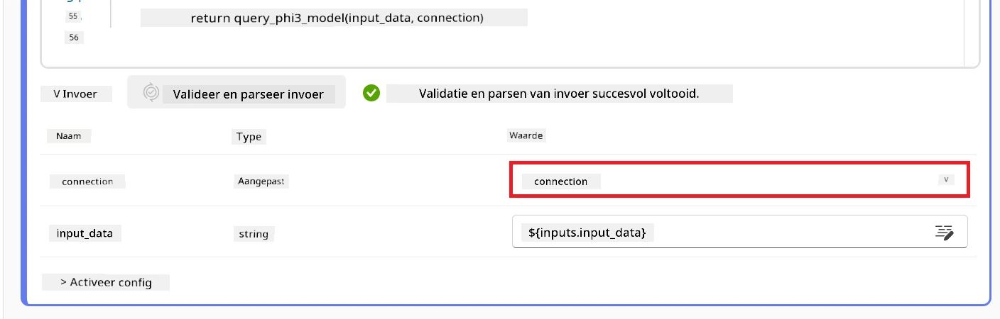

#### Chat met uw aangepaste model

1. Selecteer **Chat**.

    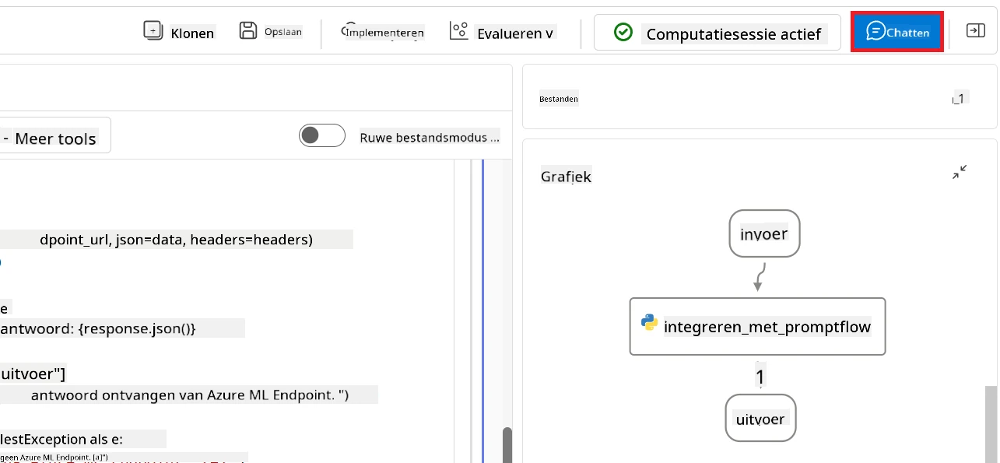

1. Hier is een voorbeeld van de resultaten: U kunt nu chatten met uw aangepaste Phi-3 model. Het wordt aangeraden om vragen te stellen die betrekking hebben op de data die is gebruikt voor het fijn afstemmen.

    

---

<!-- CO-OP TRANSLATOR DISCLAIMER START -->
**Disclaimer**:  
Dit document is vertaald met behulp van de AI-vertalingsservice [Co-op Translator](https://github.com/Azure/co-op-translator). Hoewel we streven naar nauwkeurigheid, dient u er rekening mee te houden dat geautomatiseerde vertalingen fouten of onjuistheden kunnen bevatten. Het oorspronkelijke document in de oorspronkelijke taal wordt beschouwd als de gezaghebbende bron. Voor cruciale informatie wordt een professionele menselijke vertaling aanbevolen. Wij zijn niet aansprakelijk voor misverstanden of verkeerde interpretaties die voortvloeien uit het gebruik van deze vertaling.
<!-- CO-OP TRANSLATOR DISCLAIMER END -->