<!--
CO_OP_TRANSLATOR_METADATA:
{
  "original_hash": "ecbd9179a21edbaafaf114d47f09f3e3",
  "translation_date": "2025-07-17T01:37:52+00:00",
  "source_file": "md/02.Application/01.TextAndChat/Phi3/E2E_Phi-3-FineTuning_PromptFlow_Integration_AIFoundry.md",
  "language_code": "nl"
}
-->
# Fine-tune en integreer aangepaste Phi-3 modellen met Prompt flow in Azure AI Foundry

Deze end-to-end (E2E) voorbeeld is gebaseerd op de handleiding "[Fine-Tune and Integrate Custom Phi-3 Models with Prompt Flow in Azure AI Foundry](https://techcommunity.microsoft.com/t5/educator-developer-blog/fine-tune-and-integrate-custom-phi-3-models-with-prompt-flow-in/ba-p/4191726?WT.mc_id=aiml-137032-kinfeylo)" van de Microsoft Tech Community. Het introduceert de processen van fine-tunen, implementeren en integreren van aangepaste Phi-3 modellen met Prompt flow in Azure AI Foundry.  
In tegenstelling tot het E2E voorbeeld, "[Fine-Tune and Integrate Custom Phi-3 Models with Prompt Flow](./E2E_Phi-3-FineTuning_PromptFlow_Integration.md)", waarbij code lokaal werd uitgevoerd, richt deze tutorial zich volledig op het fine-tunen en integreren van je model binnen Azure AI / ML Studio.

## Overzicht

In dit E2E voorbeeld leer je hoe je het Phi-3 model fine-tuned en integreert met Prompt flow in Azure AI Foundry. Door gebruik te maken van Azure AI / ML Studio stel je een workflow in voor het implementeren en gebruiken van aangepaste AI-modellen. Dit E2E voorbeeld is verdeeld in drie scenario’s:

**Scenario 1: Azure resources opzetten en voorbereiden voor fine-tuning**

**Scenario 2: Fine-tune het Phi-3 model en implementeer in Azure Machine Learning Studio**

**Scenario 3: Integreer met Prompt flow en chat met je aangepaste model in Azure AI Foundry**

Hier is een overzicht van dit E2E voorbeeld.


### Inhoudsopgave

1. **[Scenario 1: Azure resources opzetten en voorbereiden voor fine-tuning](../../../../../../md/02.Application/01.TextAndChat/Phi3)**
    - [Een Azure Machine Learning Workspace aanmaken](../../../../../../md/02.Application/01.TextAndChat/Phi3)
    - [GPU quota aanvragen in Azure Subscription](../../../../../../md/02.Application/01.TextAndChat/Phi3)
    - [Roltoewijzing toevoegen](../../../../../../md/02.Application/01.TextAndChat/Phi3)
    - [Project opzetten](../../../../../../md/02.Application/01.TextAndChat/Phi3)
    - [Dataset voorbereiden voor fine-tuning](../../../../../../md/02.Application/01.TextAndChat/Phi3)

1. **[Scenario 2: Fine-tune het Phi-3 model en implementeer in Azure Machine Learning Studio](../../../../../../md/02.Application/01.TextAndChat/Phi3)**
    - [Fine-tune het Phi-3 model](../../../../../../md/02.Application/01.TextAndChat/Phi3)
    - [Implementeer het fine-tuned Phi-3 model](../../../../../../md/02.Application/01.TextAndChat/Phi3)

1. **[Scenario 3: Integreer met Prompt flow en chat met je aangepaste model in Azure AI Foundry](../../../../../../md/02.Application/01.TextAndChat/Phi3)**
    - [Integreer het aangepaste Phi-3 model met Prompt flow](../../../../../../md/02.Application/01.TextAndChat/Phi3)
    - [Chat met je aangepaste Phi-3 model](../../../../../../md/02.Application/01.TextAndChat/Phi3)

## Scenario 1: Azure resources opzetten en voorbereiden voor fine-tuning

### Een Azure Machine Learning Workspace aanmaken

1. Typ *azure machine learning* in de **zoekbalk** bovenaan de portalpagina en selecteer **Azure Machine Learning** uit de opties die verschijnen.

    

2. Selecteer **+ Create** in het navigatiemenu.

3. Selecteer **New workspace** in het navigatiemenu.

    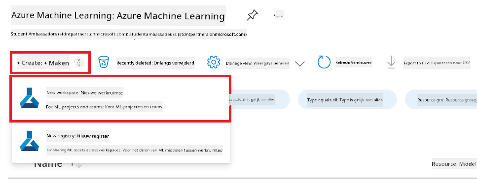

4. Voer de volgende taken uit:

    - Selecteer je Azure **Subscription**.
    - Selecteer de **Resource group** die je wilt gebruiken (maak er een nieuwe aan indien nodig).
    - Voer een **Workspace Name** in. Dit moet een unieke naam zijn.
    - Selecteer de **Regio** die je wilt gebruiken.
    - Selecteer de **Storage account** die je wilt gebruiken (maak er een nieuwe aan indien nodig).
    - Selecteer de **Key vault** die je wilt gebruiken (maak er een nieuwe aan indien nodig).
    - Selecteer de **Application insights** die je wilt gebruiken (maak er een nieuwe aan indien nodig).
    - Selecteer de **Container registry** die je wilt gebruiken (maak er een nieuwe aan indien nodig).

    

5. Selecteer **Review + Create**.

6. Selecteer **Create**.

### GPU quota aanvragen in Azure Subscription

In deze tutorial leer je hoe je een Phi-3 model fine-tuned en implementeert met behulp van GPU’s. Voor het fine-tunen gebruik je de *Standard_NC24ads_A100_v4* GPU, waarvoor een quota-aanvraag nodig is. Voor de implementatie gebruik je de *Standard_NC6s_v3* GPU, waarvoor ook een quota-aanvraag vereist is.

> [!NOTE]
>
> Alleen Pay-As-You-Go abonnementen (het standaard abonnements-type) komen in aanmerking voor GPU-toewijzing; voordeelabonnementen worden momenteel niet ondersteund.
>

1. Bezoek [Azure ML Studio](https://ml.azure.com/home?wt.mc_id=studentamb_279723).

1. Voer de volgende stappen uit om een quota aan te vragen voor de *Standard NCADSA100v4 Family*:

    - Selecteer **Quota** in het linker tabblad.
    - Selecteer de **Virtual machine family** die je wilt gebruiken. Bijvoorbeeld, selecteer **Standard NCADSA100v4 Family Cluster Dedicated vCPUs**, waar de *Standard_NC24ads_A100_v4* GPU onder valt.
    - Selecteer **Request quota** in het navigatiemenu.

        

    - Vul op de pagina Request quota de **New cores limit** in die je wilt gebruiken. Bijvoorbeeld 24.
    - Selecteer **Submit** om de GPU quota aan te vragen.

1. Voer de volgende stappen uit om een quota aan te vragen voor de *Standard NCSv3 Family*:

    - Selecteer **Quota** in het linker tabblad.
    - Selecteer de **Virtual machine family** die je wilt gebruiken. Bijvoorbeeld, selecteer **Standard NCSv3 Family Cluster Dedicated vCPUs**, waar de *Standard_NC6s_v3* GPU onder valt.
    - Selecteer **Request quota** in het navigatiemenu.
    - Vul op de pagina Request quota de **New cores limit** in die je wilt gebruiken. Bijvoorbeeld 24.
    - Selecteer **Submit** om de GPU quota aan te vragen.

### Roltoewijzing toevoegen

Om je modellen te fine-tunen en te implementeren, moet je eerst een User Assigned Managed Identity (UAI) aanmaken en deze de juiste permissies geven. Deze UAI wordt gebruikt voor authenticatie tijdens de implementatie.

#### User Assigned Managed Identity (UAI) aanmaken

1. Typ *managed identities* in de **zoekbalk** bovenaan de portalpagina en selecteer **Managed Identities** uit de opties die verschijnen.

    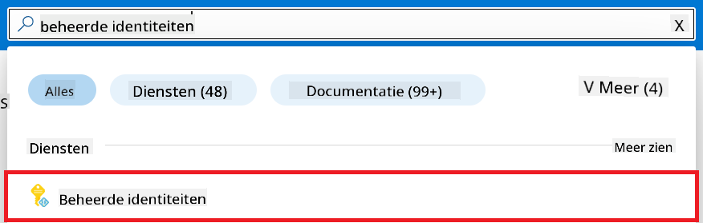

1. Selecteer **+ Create**.

    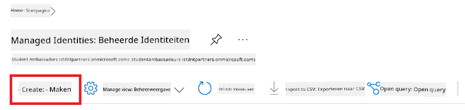

1. Voer de volgende taken uit:

    - Selecteer je Azure **Subscription**.
    - Selecteer de **Resource group** die je wilt gebruiken (maak er een nieuwe aan indien nodig).
    - Selecteer de **Regio** die je wilt gebruiken.
    - Voer een **Naam** in. Dit moet een unieke naam zijn.

    

1. Selecteer **Review + create**.

1. Selecteer **+ Create**.

#### Contributor roltoewijzing toevoegen aan Managed Identity

1. Navigeer naar de Managed Identity resource die je hebt aangemaakt.

1. Selecteer **Azure role assignments** in het linker tabblad.

1. Selecteer **+Add role assignment** in het navigatiemenu.

1. Voer op de pagina Add role assignment de volgende taken uit:
    - Stel de **Scope** in op **Resource group**.
    - Selecteer je Azure **Subscription**.
    - Selecteer de **Resource group** die je wilt gebruiken.
    - Selecteer de **Role** **Contributor**.

    

2. Selecteer **Save**.

#### Storage Blob Data Reader roltoewijzing toevoegen aan Managed Identity

1. Typ *storage accounts* in de **zoekbalk** bovenaan de portalpagina en selecteer **Storage accounts** uit de opties die verschijnen.

    

1. Selecteer de storage account die gekoppeld is aan de Azure Machine Learning workspace die je hebt aangemaakt. Bijvoorbeeld *finetunephistorage*.

1. Voer de volgende stappen uit om naar de pagina Add role assignment te navigeren:

    - Navigeer naar de Azure Storage account die je hebt aangemaakt.
    - Selecteer **Access Control (IAM)** in het linker tabblad.
    - Selecteer **+ Add** in het navigatiemenu.
    - Selecteer **Add role assignment** in het navigatiemenu.

    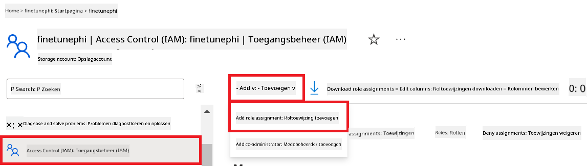

1. Voer op de pagina Add role assignment de volgende taken uit:

    - Typ in de rolpagina *Storage Blob Data Reader* in de **zoekbalk** en selecteer **Storage Blob Data Reader** uit de opties die verschijnen.
    - Selecteer **Next**.
    - Selecteer bij Members **Assign access to** **Managed identity**.
    - Selecteer **+ Select members**.
    - Selecteer je Azure **Subscription**.
    - Selecteer de **Managed identity** onder **Manage Identity**.
    - Selecteer de Managed Identity die je hebt aangemaakt. Bijvoorbeeld *finetunephi-managedidentity*.
    - Selecteer **Select**.

    

1. Selecteer **Review + assign**.

#### AcrPull roltoewijzing toevoegen aan Managed Identity

1. Typ *container registries* in de **zoekbalk** bovenaan de portalpagina en selecteer **Container registries** uit de opties die verschijnen.

    

1. Selecteer de container registry die gekoppeld is aan de Azure Machine Learning workspace. Bijvoorbeeld *finetunephicontainerregistry*

1. Voer de volgende stappen uit om naar de pagina Add role assignment te navigeren:

    - Selecteer **Access Control (IAM)** in het linker tabblad.
    - Selecteer **+ Add** in het navigatiemenu.
    - Selecteer **Add role assignment** in het navigatiemenu.

1. Voer op de pagina Add role assignment de volgende taken uit:

    - Typ in de rolpagina *AcrPull* in de **zoekbalk** en selecteer **AcrPull** uit de opties die verschijnen.
    - Selecteer **Next**.
    - Selecteer bij Members **Assign access to** **Managed identity**.
    - Selecteer **+ Select members**.
    - Selecteer je Azure **Subscription**.
    - Selecteer de **Managed identity** onder **Manage Identity**.
    - Selecteer de Managed Identity die je hebt aangemaakt. Bijvoorbeeld *finetunephi-managedidentity*.
    - Selecteer **Select**.
    - Selecteer **Review + assign**.

### Project opzetten

Om de datasets te downloaden die nodig zijn voor fine-tuning, zet je een lokale omgeving op.

In deze oefening ga je:

- Een map aanmaken om in te werken.
- Een virtuele omgeving aanmaken.
- De benodigde pakketten installeren.
- Een *download_dataset.py* bestand aanmaken om de dataset te downloaden.

#### Een map aanmaken om in te werken

1. Open een terminalvenster en typ het volgende commando om een map genaamd *finetune-phi* aan te maken in het standaardpad.

    ```console
    mkdir finetune-phi
    ```

2. Typ het volgende commando in je terminal om naar de map *finetune-phi* te navigeren die je hebt aangemaakt.
#### Maak een virtuele omgeving aan

1. Typ de volgende opdracht in je terminal om een virtuele omgeving met de naam *.venv* aan te maken.

    ```console
    python -m venv .venv
    ```

2. Typ de volgende opdracht in je terminal om de virtuele omgeving te activeren.

    ```console
    .venv\Scripts\activate.bat
    ```


> [!NOTE]
> Als het gelukt is, zou je *(.venv)* voor de opdrachtprompt moeten zien staan.

#### Installeer de benodigde pakketten

1. Typ de volgende opdrachten in je terminal om de benodigde pakketten te installeren.

    ```console
    pip install datasets==2.19.1
    ```

#### Maak `download_dataset.py` aan

> [!NOTE]
> Volledige mappenstructuur:
>
> ```text
> └── YourUserName
> .    └── finetune-phi
> .        └── download_dataset.py
> ```

1. Open **Visual Studio Code**.

1. Selecteer **Bestand** in de menubalk.

1. Selecteer **Map openen**.

1. Selecteer de map *finetune-phi* die je hebt aangemaakt, deze bevindt zich op *C:\Users\yourUserName\finetune-phi*.

    

1. Klik in het linker paneel van Visual Studio Code met de rechtermuisknop en kies **Nieuw bestand** om een nieuw bestand aan te maken met de naam *download_dataset.py*.

    

### Bereid dataset voor fine-tuning voor

In deze oefening ga je het bestand *download_dataset.py* uitvoeren om de *ultrachat_200k* datasets te downloaden naar je lokale omgeving. Vervolgens gebruik je deze datasets om het Phi-3 model te fine-tunen in Azure Machine Learning.

In deze oefening ga je:

- Code toevoegen aan het bestand *download_dataset.py* om de datasets te downloaden.
- Het bestand *download_dataset.py* uitvoeren om de datasets naar je lokale omgeving te downloaden.

#### Download je dataset met *download_dataset.py*

1. Open het bestand *download_dataset.py* in Visual Studio Code.

1. Voeg de volgende code toe aan het bestand *download_dataset.py*.

    ```python
    import json
    import os
    from datasets import load_dataset

    def load_and_split_dataset(dataset_name, config_name, split_ratio):
        """
        Load and split a dataset.
        """
        # Load the dataset with the specified name, configuration, and split ratio
        dataset = load_dataset(dataset_name, config_name, split=split_ratio)
        print(f"Original dataset size: {len(dataset)}")
        
        # Split the dataset into train and test sets (80% train, 20% test)
        split_dataset = dataset.train_test_split(test_size=0.2)
        print(f"Train dataset size: {len(split_dataset['train'])}")
        print(f"Test dataset size: {len(split_dataset['test'])}")
        
        return split_dataset

    def save_dataset_to_jsonl(dataset, filepath):
        """
        Save a dataset to a JSONL file.
        """
        # Create the directory if it does not exist
        os.makedirs(os.path.dirname(filepath), exist_ok=True)
        
        # Open the file in write mode
        with open(filepath, 'w', encoding='utf-8') as f:
            # Iterate over each record in the dataset
            for record in dataset:
                # Dump the record as a JSON object and write it to the file
                json.dump(record, f)
                # Write a newline character to separate records
                f.write('\n')
        
        print(f"Dataset saved to {filepath}")

    def main():
        """
        Main function to load, split, and save the dataset.
        """
        # Load and split the ULTRACHAT_200k dataset with a specific configuration and split ratio
        dataset = load_and_split_dataset("HuggingFaceH4/ultrachat_200k", 'default', 'train_sft[:1%]')
        
        # Extract the train and test datasets from the split
        train_dataset = dataset['train']
        test_dataset = dataset['test']

        # Save the train dataset to a JSONL file
        save_dataset_to_jsonl(train_dataset, "data/train_data.jsonl")
        
        # Save the test dataset to a separate JSONL file
        save_dataset_to_jsonl(test_dataset, "data/test_data.jsonl")

    if __name__ == "__main__":
        main()

    ```

1. Typ de volgende opdracht in je terminal om het script uit te voeren en de dataset naar je lokale omgeving te downloaden.

    ```console
    python download_dataset.py
    ```

1. Controleer of de datasets succesvol zijn opgeslagen in je lokale map *finetune-phi/data*.

> [!NOTE]
>
> #### Opmerking over datasetgrootte en fine-tuning tijd
>
> In deze tutorial gebruik je slechts 1% van de dataset (`split='train[:1%]'`). Dit verkleint de hoeveelheid data aanzienlijk, waardoor zowel het uploaden als het fine-tunen sneller gaat. Je kunt het percentage aanpassen om de juiste balans te vinden tussen trainingstijd en modelprestaties. Het gebruik van een kleinere subset van de dataset verkort de tijd die nodig is voor fine-tuning, wat het proces beter beheersbaar maakt voor een tutorial.

## Scenario 2: Fine-tune het Phi-3 model en implementeer in Azure Machine Learning Studio

### Fine-tune het Phi-3 model

In deze oefening ga je het Phi-3 model fine-tunen in Azure Machine Learning Studio.

In deze oefening ga je:

- Een computercluster aanmaken voor fine-tuning.
- Het Phi-3 model fine-tunen in Azure Machine Learning Studio.

#### Maak een computercluster aan voor fine-tuning

1. Bezoek [Azure ML Studio](https://ml.azure.com/home?wt.mc_id=studentamb_279723).

1. Selecteer **Compute** in het linker tabblad.

1. Selecteer **Compute clusters** in het navigatiemenu.

1. Selecteer **+ Nieuw**.

    

1. Voer de volgende taken uit:

    - Selecteer de **Regio** die je wilt gebruiken.
    - Selecteer de **Virtual machine tier** op **Dedicated**.
    - Selecteer het **Virtual machine type** op **GPU**.
    - Selecteer het filter **Virtual machine size** op **Select from all options**.
    - Selecteer de **Virtual machine size** op **Standard_NC24ads_A100_v4**.

    

1. Selecteer **Volgende**.

1. Voer de volgende taken uit:

    - Voer een **Compute naam** in. Dit moet een unieke waarde zijn.
    - Stel het **Minimum aantal nodes** in op **0**.
    - Stel het **Maximum aantal nodes** in op **1**.
    - Stel de **Idle seconden voor schaalverkleining** in op **120**.

    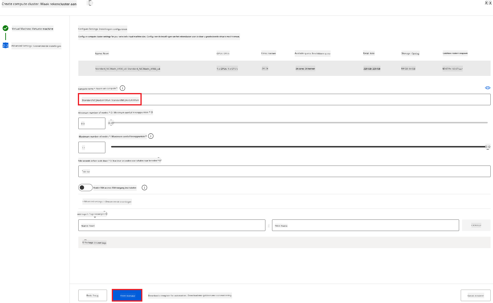

1. Selecteer **Maken**.

#### Fine-tune het Phi-3 model

1. Bezoek [Azure ML Studio](https://ml.azure.com/home?wt.mc_id=studentamb_279723).

1. Selecteer de Azure Machine Learning workspace die je hebt aangemaakt.

    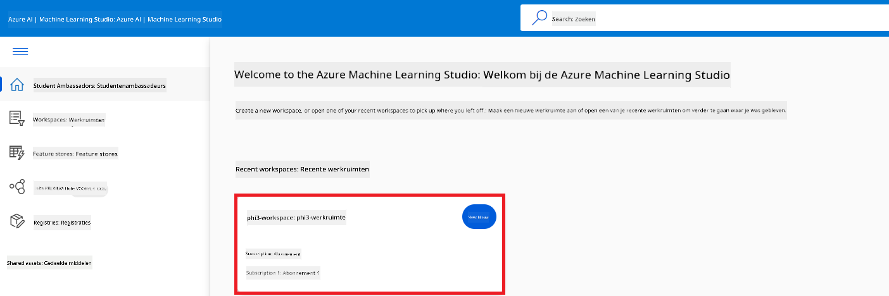

1. Voer de volgende taken uit:

    - Selecteer **Model catalog** in het linker tabblad.
    - Typ *phi-3-mini-4k* in de **zoekbalk** en selecteer **Phi-3-mini-4k-instruct** uit de opties die verschijnen.

    

1. Selecteer **Fine-tune** in het navigatiemenu.

    

1. Voer de volgende taken uit:

    - Selecteer **Select task type** op **Chat completion**.
    - Selecteer **+ Select data** om **Trainingsdata** te uploaden.
    - Selecteer het type upload voor validatiedata op **Provide different validation data**.
    - Selecteer **+ Select data** om **Validatiedata** te uploaden.

    

    > [!TIP]
    >
    > Je kunt **Geavanceerde instellingen** selecteren om configuraties zoals **learning_rate** en **lr_scheduler_type** aan te passen om het fine-tuning proces te optimaliseren op basis van jouw specifieke behoeften.

1. Selecteer **Voltooien**.

1. In deze oefening heb je het Phi-3 model succesvol gefinetuned met Azure Machine Learning. Houd er rekening mee dat het fine-tuning proces enige tijd kan duren. Nadat je de fine-tuning taak hebt gestart, moet je wachten tot deze is voltooid. Je kunt de status van de fine-tuning taak volgen via het tabblad Jobs aan de linkerkant van je Azure Machine Learning Workspace. In de volgende serie ga je het gefinetunede model implementeren en integreren met Prompt flow.

    

### Implementeer het gefinetunede Phi-3 model

Om het gefinetunede Phi-3 model te integreren met Prompt flow, moet je het model implementeren zodat het toegankelijk is voor realtime inferentie. Dit proces omvat het registreren van het model, het aanmaken van een online endpoint en het implementeren van het model.

In deze oefening ga je:

- Het gefinetunede model registreren in de Azure Machine Learning workspace.
- Een online endpoint aanmaken.
- Het geregistreerde gefinetunede Phi-3 model implementeren.

#### Registreer het gefinetunede model

1. Bezoek [Azure ML Studio](https://ml.azure.com/home?wt.mc_id=studentamb_279723).

1. Selecteer de Azure Machine Learning workspace die je hebt aangemaakt.

    

1. Selecteer **Models** in het linker tabblad.
1. Selecteer **+ Registreren**.
1. Selecteer **Vanuit een job output**.

    

1. Selecteer de job die je hebt aangemaakt.

    

1. Selecteer **Volgende**.

1. Selecteer **Model type** op **MLflow**.

1. Zorg dat **Job output** geselecteerd is; dit zou automatisch geselecteerd moeten zijn.

    

2. Selecteer **Volgende**.

3. Selecteer **Registreren**.

    

4. Je kunt je geregistreerde model bekijken door naar het menu **Models** te gaan in het linker tabblad.

    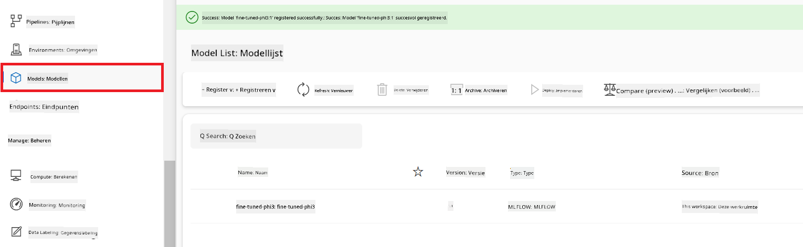

#### Implementeer het gefinetunede model

1. Navigeer naar de Azure Machine Learning workspace die je hebt aangemaakt.

1. Selecteer **Endpoints** in het linker tabblad.

1. Selecteer **Real-time endpoints** in het navigatiemenu.

    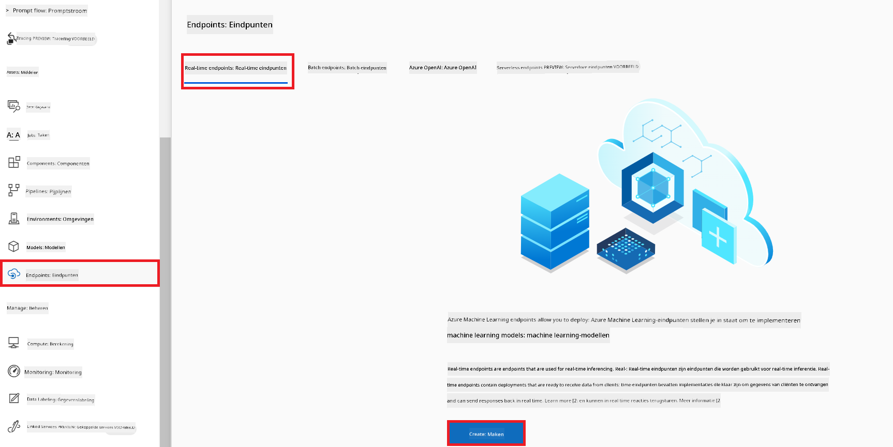

1. Selecteer **Maken**.

1. Selecteer het geregistreerde model dat je hebt aangemaakt.

    

1. Selecteer **Selecteren**.

1. Voer de volgende taken uit:

    - Selecteer **Virtual machine** op *Standard_NC6s_v3*.
    - Selecteer het aantal instanties dat je wilt gebruiken. Bijvoorbeeld *1*.
    - Selecteer **Endpoint** op **Nieuw** om een endpoint aan te maken.
    - Voer een **Endpoint naam** in. Dit moet een unieke waarde zijn.
    - Voer een **Deployment naam** in. Dit moet een unieke waarde zijn.

    

1. Selecteer **Implementeren**.

> [!WARNING]
> Om extra kosten op je account te voorkomen, zorg ervoor dat je het aangemaakte endpoint verwijdert in de Azure Machine Learning workspace.
>

#### Controleer de implementatiestatus in Azure Machine Learning Workspace

1. Navigeer naar de Azure Machine Learning workspace die je hebt aangemaakt.

1. Selecteer **Endpoints** in het linker tabblad.

1. Selecteer het endpoint dat je hebt aangemaakt.

    

1. Op deze pagina kun je de endpoints beheren tijdens het implementatieproces.

> [!NOTE]
> Zodra de implementatie voltooid is, zorg ervoor dat **Live traffic** is ingesteld op **100%**. Als dit niet het geval is, selecteer dan **Update traffic** om de verkeersinstellingen aan te passen. Houd er rekening mee dat je het model niet kunt testen als het verkeer op 0% staat.
>
> 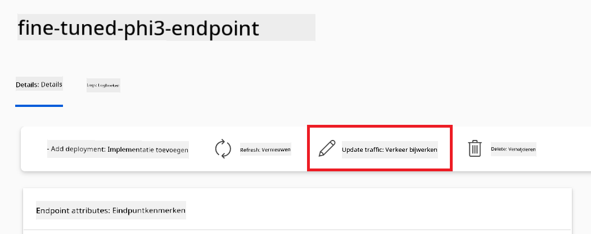
>

## Scenario 3: Integreren met Prompt flow en chatten met je aangepaste model in Azure AI Foundry

### Integreer het aangepaste Phi-3 model met Prompt flow

Nadat je je gefinetunede model succesvol hebt geïmplementeerd, kun je het nu integreren met Prompt Flow om je model te gebruiken in realtime toepassingen, waarmee je diverse interactieve taken kunt uitvoeren met je aangepaste Phi-3 model.

In deze oefening ga je:

- Azure AI Foundry Hub aanmaken.
- Azure AI Foundry Project aanmaken.
- Prompt flow aanmaken.
- Een aangepaste verbinding toevoegen voor het gefinetunede Phi-3 model.
- Prompt flow instellen om te chatten met je aangepaste Phi-3 model.
> [!NOTE]
> Je kunt ook integreren met Promptflow via Azure ML Studio. Hetzelfde integratieproces is toepasbaar op Azure ML Studio.
#### Maak Azure AI Foundry Hub aan

Je moet eerst een Hub aanmaken voordat je een Project maakt. Een Hub werkt als een Resource Group, waarmee je meerdere projecten binnen Azure AI Foundry kunt organiseren en beheren.

1. Bezoek [Azure AI Foundry](https://ai.azure.com/?WT.mc_id=aiml-137032-kinfeylo).

1. Selecteer **All hubs** in het tabblad aan de linkerkant.

1. Selecteer **+ New hub** in het navigatiemenu.

    

1. Voer de volgende taken uit:

    - Voer een **Hub name** in. Dit moet een unieke waarde zijn.
    - Selecteer je Azure **Subscription**.
    - Selecteer de **Resource group** die je wilt gebruiken (maak er een nieuwe aan indien nodig).
    - Selecteer de **Location** die je wilt gebruiken.
    - Selecteer de **Connect Azure AI Services** die je wilt gebruiken (maak er een nieuwe aan indien nodig).
    - Selecteer **Connect Azure AI Search** en kies **Skip connecting**.

    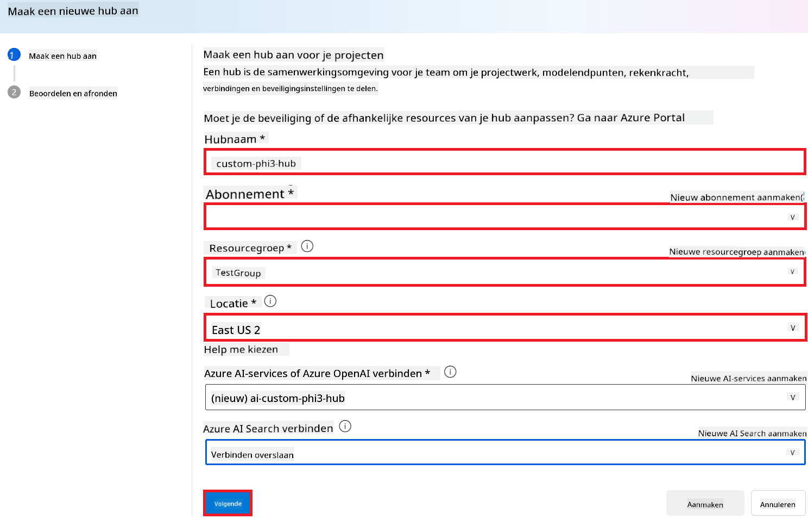

1. Selecteer **Next**.

#### Maak een Azure AI Foundry Project aan

1. Ga in de Hub die je hebt aangemaakt naar **All projects** in het tabblad aan de linkerkant.

1. Selecteer **+ New project** in het navigatiemenu.

    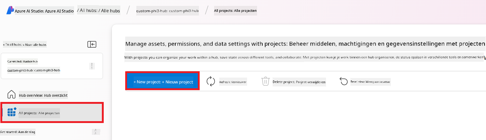

1. Voer een **Project name** in. Dit moet een unieke waarde zijn.

    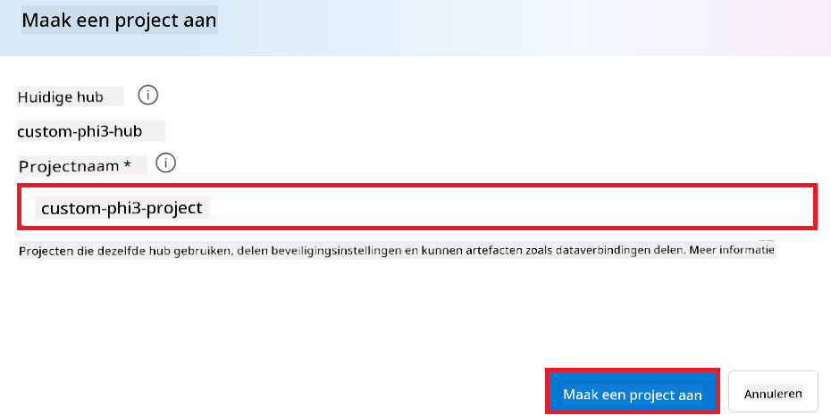

1. Selecteer **Create a project**.

#### Voeg een aangepaste verbinding toe voor het fijn-afgestelde Phi-3 model

Om je aangepaste Phi-3 model te integreren met Prompt flow, moet je de endpoint en sleutel van het model opslaan in een aangepaste verbinding. Deze setup zorgt ervoor dat je toegang hebt tot je aangepaste Phi-3 model binnen Prompt flow.

#### Stel api key en endpoint uri in van het fijn-afgestelde Phi-3 model

1. Bezoek [Azure ML Studio](https://ml.azure.com/home?WT.mc_id=aiml-137032-kinfeylo).

1. Navigeer naar de Azure Machine learning workspace die je hebt aangemaakt.

1. Selecteer **Endpoints** in het tabblad aan de linkerkant.

    

1. Selecteer de endpoint die je hebt aangemaakt.

    

1. Selecteer **Consume** in het navigatiemenu.

1. Kopieer je **REST endpoint** en **Primary key**.

    

#### Voeg de aangepaste verbinding toe

1. Bezoek [Azure AI Foundry](https://ai.azure.com/?WT.mc_id=aiml-137032-kinfeylo).

1. Navigeer naar het Azure AI Foundry project dat je hebt aangemaakt.

1. Ga in het project naar **Settings** in het tabblad aan de linkerkant.

1. Selecteer **+ New connection**.

    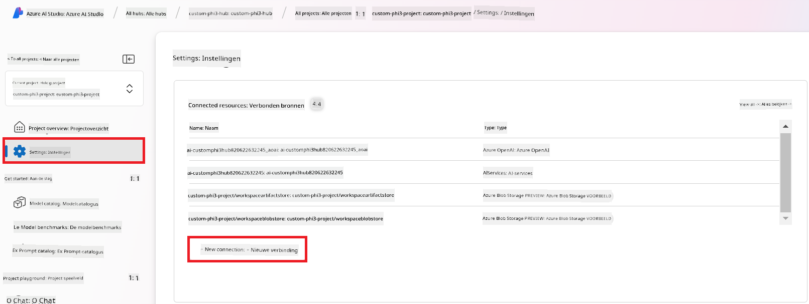

1. Selecteer **Custom keys** in het navigatiemenu.

    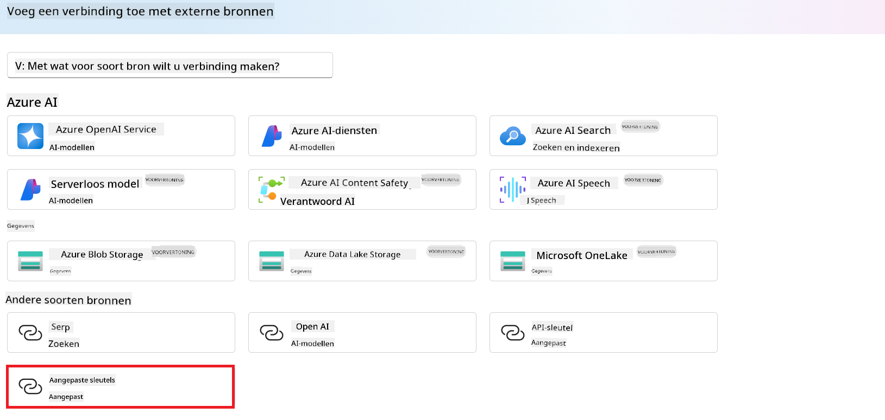

1. Voer de volgende taken uit:

    - Selecteer **+ Add key value pairs**.
    - Voer als sleutelnaam **endpoint** in en plak de endpoint die je uit Azure ML Studio hebt gekopieerd in het waardeveld.
    - Selecteer opnieuw **+ Add key value pairs**.
    - Voer als sleutelnaam **key** in en plak de sleutel die je uit Azure ML Studio hebt gekopieerd in het waardeveld.
    - Nadat je de sleutels hebt toegevoegd, selecteer je **is secret** om te voorkomen dat de sleutel zichtbaar wordt.

    

1. Selecteer **Add connection**.

#### Maak een Prompt flow aan

Je hebt een aangepaste verbinding toegevoegd in Azure AI Foundry. Laten we nu een Prompt flow maken met de volgende stappen. Daarna verbind je deze Prompt flow met de aangepaste verbinding zodat je het fijn-afgestelde model binnen Prompt flow kunt gebruiken.

1. Navigeer naar het Azure AI Foundry project dat je hebt aangemaakt.

1. Selecteer **Prompt flow** in het tabblad aan de linkerkant.

1. Selecteer **+ Create** in het navigatiemenu.

    

1. Selecteer **Chat flow** in het navigatiemenu.

    

1. Voer een **Folder name** in die je wilt gebruiken.

    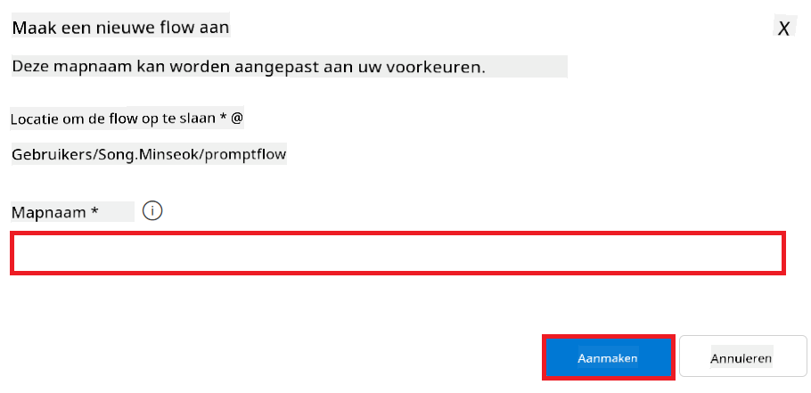

2. Selecteer **Create**.

#### Stel Prompt flow in om te chatten met je aangepaste Phi-3 model

Je moet het fijn-afgestelde Phi-3 model integreren in een Prompt flow. De bestaande Prompt flow is hier niet voor ontworpen, dus moet je de Prompt flow opnieuw ontwerpen om de integratie van het aangepaste model mogelijk te maken.

1. Voer in de Prompt flow de volgende taken uit om de bestaande flow opnieuw op te bouwen:

    - Selecteer **Raw file mode**.
    - Verwijder alle bestaande code in het *flow.dag.yml* bestand.
    - Voeg de volgende code toe aan het *flow.dag.yml* bestand.

        ```yml
        inputs:
          input_data:
            type: string
            default: "Who founded Microsoft?"

        outputs:
          answer:
            type: string
            reference: ${integrate_with_promptflow.output}

        nodes:
        - name: integrate_with_promptflow
          type: python
          source:
            type: code
            path: integrate_with_promptflow.py
          inputs:
            input_data: ${inputs.input_data}
        ```

    - Selecteer **Save**.

    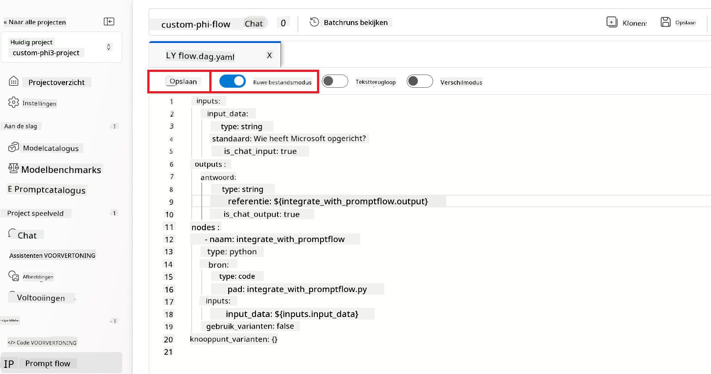

1. Voeg de volgende code toe aan het *integrate_with_promptflow.py* bestand om het aangepaste Phi-3 model in Prompt flow te gebruiken.

    ```python
    import logging
    import requests
    from promptflow import tool
    from promptflow.connections import CustomConnection

    # Logging setup
    logging.basicConfig(
        format="%(asctime)s - %(levelname)s - %(name)s - %(message)s",
        datefmt="%Y-%m-%d %H:%M:%S",
        level=logging.DEBUG
    )
    logger = logging.getLogger(__name__)

    def query_phi3_model(input_data: str, connection: CustomConnection) -> str:
        """
        Send a request to the Phi-3 model endpoint with the given input data using Custom Connection.
        """

        # "connection" is the name of the Custom Connection, "endpoint", "key" are the keys in the Custom Connection
        endpoint_url = connection.endpoint
        api_key = connection.key

        headers = {
            "Content-Type": "application/json",
            "Authorization": f"Bearer {api_key}"
        }
        data = {
            "input_data": {
                "input_string": [
                    {"role": "user", "content": input_data}
                ],
                "parameters": {
                    "temperature": 0.7,
                    "max_new_tokens": 128
                }
            }
        }
        try:
            response = requests.post(endpoint_url, json=data, headers=headers)
            response.raise_for_status()
            
            # Log the full JSON response
            logger.debug(f"Full JSON response: {response.json()}")

            result = response.json()["output"]
            logger.info("Successfully received response from Azure ML Endpoint.")
            return result
        except requests.exceptions.RequestException as e:
            logger.error(f"Error querying Azure ML Endpoint: {e}")
            raise

    @tool
    def my_python_tool(input_data: str, connection: CustomConnection) -> str:
        """
        Tool function to process input data and query the Phi-3 model.
        """
        return query_phi3_model(input_data, connection)

    ```

    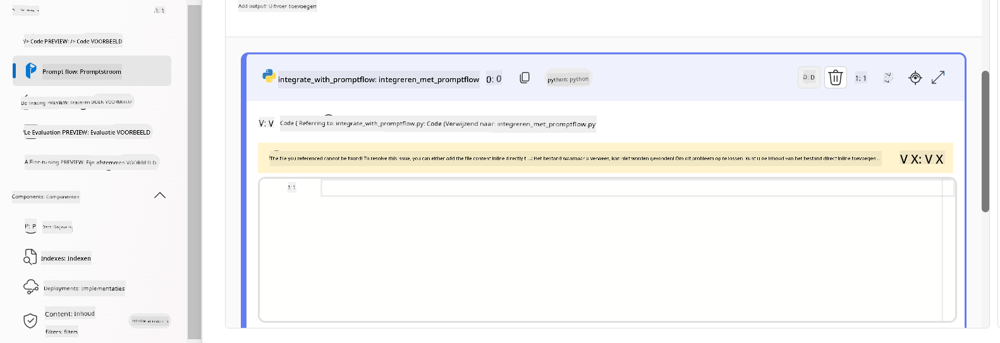

> [!NOTE]
> Voor meer gedetailleerde informatie over het gebruik van Prompt flow in Azure AI Foundry, kun je terecht bij [Prompt flow in Azure AI Foundry](https://learn.microsoft.com/azure/ai-studio/how-to/prompt-flow).

1. Selecteer **Chat input**, **Chat output** om chatten met je model mogelijk te maken.

    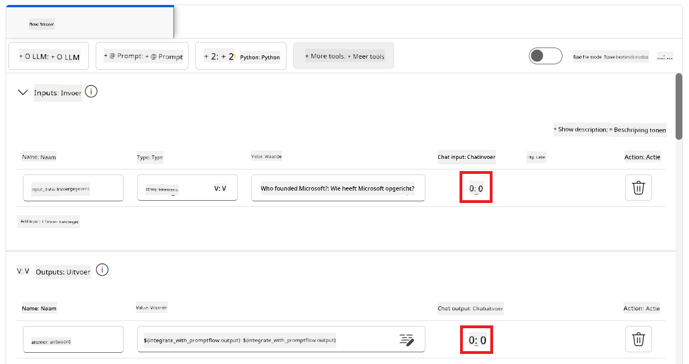

1. Je bent nu klaar om te chatten met je aangepaste Phi-3 model. In de volgende oefening leer je hoe je Prompt flow start en gebruikt om te chatten met je fijn-afgestelde Phi-3 model.

> [!NOTE]
>
> De opnieuw opgebouwde flow zou eruit moeten zien zoals in de afbeelding hieronder:
>
> 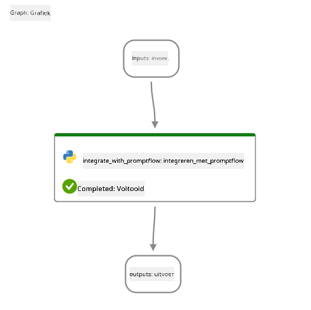
>

### Chat met je aangepaste Phi-3 model

Nu je je aangepaste Phi-3 model hebt fijn-afgesteld en geïntegreerd met Prompt flow, ben je klaar om ermee te communiceren. Deze oefening begeleidt je bij het opzetten en starten van een chat met je model via Prompt flow. Door deze stappen te volgen, kun je optimaal gebruikmaken van de mogelijkheden van je fijn-afgestelde Phi-3 model voor diverse taken en gesprekken.

- Chat met je aangepaste Phi-3 model via Prompt flow.

#### Start Prompt flow

1. Selecteer **Start compute sessions** om Prompt flow te starten.

    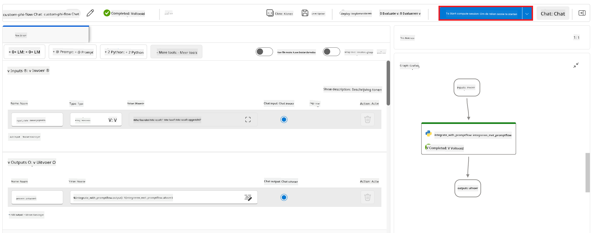

1. Selecteer **Validate and parse input** om de parameters te vernieuwen.

    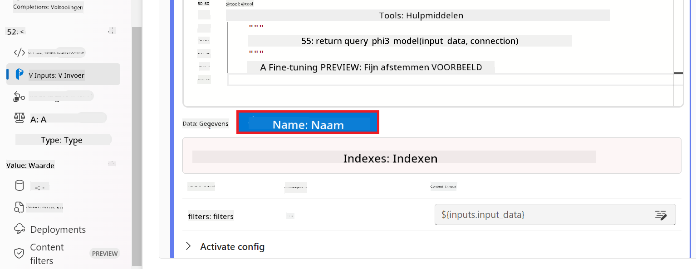

1. Selecteer de **Value** van de **connection** naar de aangepaste verbinding die je hebt gemaakt. Bijvoorbeeld *connection*.

    

#### Chat met je aangepaste model

1. Selecteer **Chat**.

    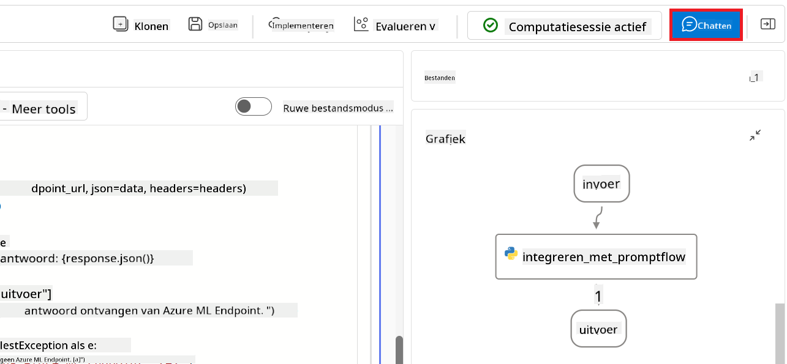

1. Hier is een voorbeeld van de resultaten: nu kun je chatten met je aangepaste Phi-3 model. Het is aan te raden om vragen te stellen die gebaseerd zijn op de data die gebruikt is voor het fijn-afstellen.

    

**Disclaimer**:  
Dit document is vertaald met behulp van de AI-vertalingsdienst [Co-op Translator](https://github.com/Azure/co-op-translator). Hoewel we streven naar nauwkeurigheid, dient u er rekening mee te houden dat geautomatiseerde vertalingen fouten of onnauwkeurigheden kunnen bevatten. Het originele document in de oorspronkelijke taal moet als de gezaghebbende bron worden beschouwd. Voor cruciale informatie wordt professionele menselijke vertaling aanbevolen. Wij zijn niet aansprakelijk voor eventuele misverstanden of verkeerde interpretaties die voortvloeien uit het gebruik van deze vertaling.