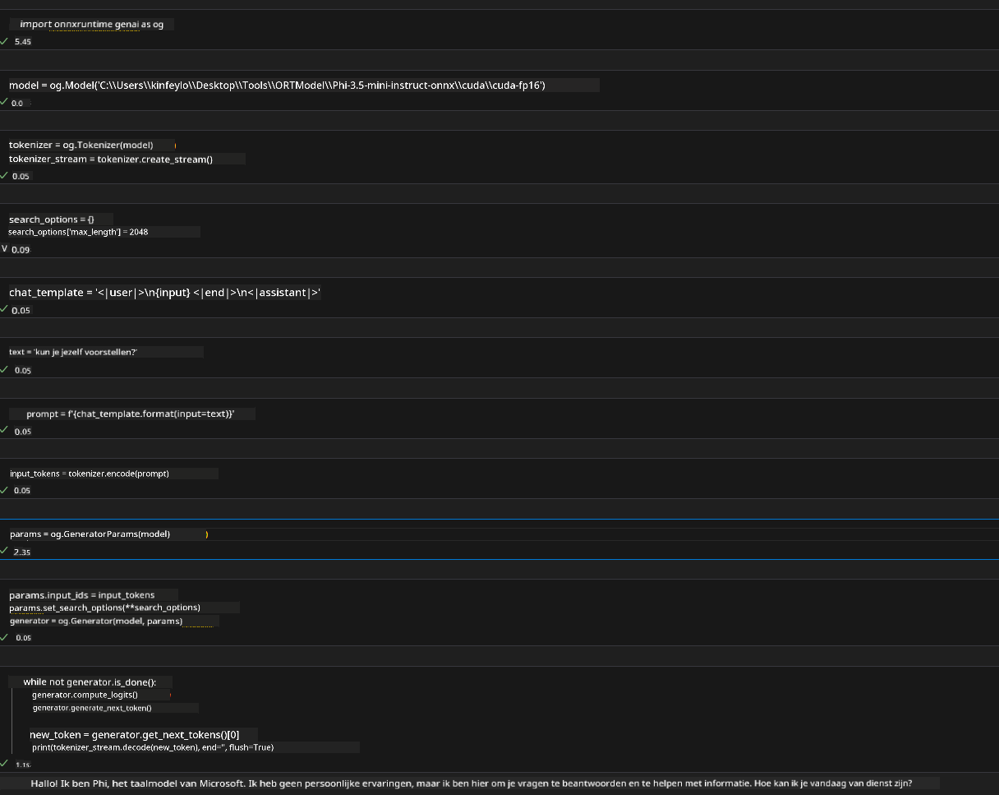
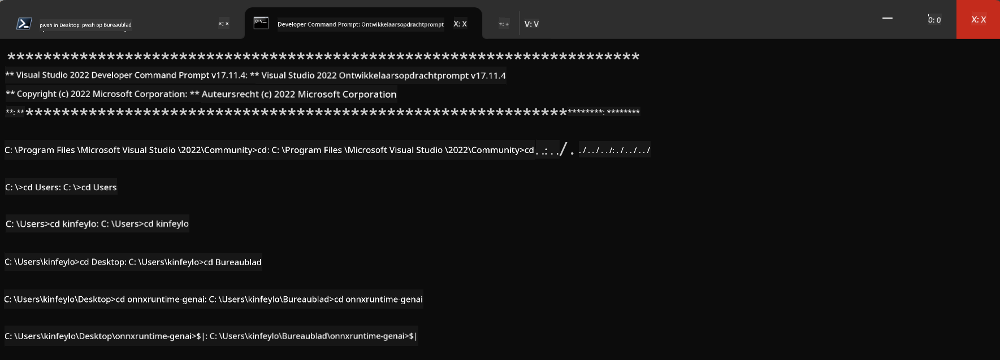

<!--
CO_OP_TRANSLATOR_METADATA:
{
  "original_hash": "b066fc29c1b2129df84e027cb75119ce",
  "translation_date": "2025-05-09T18:44:46+00:00",
  "source_file": "md/02.Application/01.TextAndChat/Phi3/ORTWindowGPUGuideline.md",
  "language_code": "nl"
}
-->
# **Richtlijn voor OnnxRuntime GenAI Windows GPU**

Deze richtlijn geeft stappen voor het opzetten en gebruiken van de ONNX Runtime (ORT) met GPU's op Windows. Het is bedoeld om je te helpen GPU-versnelling voor je modellen te benutten, waardoor de prestaties en efficiëntie verbeteren.

Het document geeft richtlijnen over:

- Omgevingsinstelling: Instructies voor het installeren van de benodigde afhankelijkheden zoals CUDA, cuDNN en ONNX Runtime.
- Configuratie: Hoe je de omgeving en ONNX Runtime configureert om GPU-bronnen effectief te gebruiken.
- Optimalisatietips: Advies over hoe je je GPU-instellingen kunt afstemmen voor optimale prestaties.

### **1. Python 3.10.x /3.11.8**

   ***Note*** Aanbevolen wordt om [miniforge](https://github.com/conda-forge/miniforge/releases/latest/download/Miniforge3-Windows-x86_64.exe) te gebruiken als je Python-omgeving

   ```bash

   conda create -n pydev python==3.11.8

   conda activate pydev

   ```

   ***Reminder*** Als je een Python ONNX-bibliotheek hebt geïnstalleerd, verwijder deze dan eerst

### **2. Installeer CMake met winget**

   ```bash

   winget install -e --id Kitware.CMake

   ```

### **3. Installeer Visual Studio 2022 - Desktop Development met C++**

   ***Note*** Als je niet wilt compileren, kun je deze stap overslaan


### **4. Installeer NVIDIA Driver**

1. **NVIDIA GPU Driver**  [https://www.nvidia.com/en-us/drivers/](https://www.nvidia.com/en-us/drivers/)

2. **NVIDIA CUDA 12.4** [https://developer.nvidia.com/cuda-12-4-0-download-archive](https://developer.nvidia.com/cuda-12-4-0-download-archive)

3. **NVIDIA CUDNN 9.4**  [https://developer.nvidia.com/cudnn-downloads](https://developer.nvidia.com/cudnn-downloads)

***Reminder*** Gebruik de standaardinstellingen tijdens de installatie

### **5. Stel NVIDIA-omgeving in**

Kopieer NVIDIA CUDNN 9.4 lib, bin, include naar NVIDIA CUDA 12.4 lib, bin, include

- kopieer de bestanden uit *'C:\Program Files\NVIDIA\CUDNN\v9.4\bin\12.6'* naar *'C:\Program Files\NVIDIA GPU Computing Toolkit\CUDA\v12.4\bin'*

- kopieer de bestanden uit *'C:\Program Files\NVIDIA\CUDNN\v9.4\include\12.6'* naar *'C:\Program Files\NVIDIA GPU Computing Toolkit\CUDA\v12.4\include'*

- kopieer de bestanden uit *'C:\Program Files\NVIDIA\CUDNN\v9.4\lib\12.6'* naar *'C:\Program Files\NVIDIA GPU Computing Toolkit\CUDA\v12.4\lib\x64'*

### **6. Download Phi-3.5-mini-instruct-onnx**

   ```bash

   winget install -e --id Git.Git

   winget install -e --id GitHub.GitLFS

   git lfs install

   git clone https://huggingface.co/microsoft/Phi-3.5-mini-instruct-onnx

   ```

### **7. Uitvoeren van InferencePhi35Instruct.ipynb**

   Open [Notebook](../../../../../../code/09.UpdateSamples/Aug/ortgpu-phi35-instruct.ipynb) en voer het uit



### **8. Compileer ORT GenAI GPU**

   ***Note*** 
   
   1. Verwijder eerst alle onnx, onnxruntime en onnxruntime-genai pakketten

   ```bash

   pip list 
   
   ```

   Verwijder vervolgens alle onnxruntime-bibliotheken, bijvoorbeeld:

   ```bash

   pip uninstall onnxruntime

   pip uninstall onnxruntime-genai

   pip uninstall onnxruntume-genai-cuda
   
   ```

   2. Controleer ondersteuning voor Visual Studio-extensie

   Controleer in C:\Program Files\NVIDIA GPU Computing Toolkit\CUDA\v12.4\extras of de map C:\Program Files\NVIDIA GPU Computing Toolkit\CUDA\v12.4\extras\visual_studio_integration aanwezig is.
   
   Als deze niet gevonden wordt, controleer dan andere CUDA toolkit driver mappen en kopieer de map visual_studio_integration en de inhoud naar C:\Program Files\NVIDIA GPU Computing Toolkit\CUDA\v12.4\extras\visual_studio_integration

   - Als je niet wilt compileren, kun je deze stap overslaan

   ```bash

   git clone https://github.com/microsoft/onnxruntime-genai

   ```

   - Download [https://github.com/microsoft/onnxruntime/releases/download/v1.19.2/onnxruntime-win-x64-gpu-1.19.2.zip](https://github.com/microsoft/onnxruntime/releases/download/v1.19.2/onnxruntime-win-x64-gpu-1.19.2.zip)

   - Pak onnxruntime-win-x64-gpu-1.19.2.zip uit, hernoem de map naar **ort**, en kopieer deze naar onnxruntime-genai

   - Open Windows Terminal, ga naar Developer Command Prompt voor VS 2022 en navigeer naar onnxruntime-genai



   - Compileer het met je Python-omgeving

   ```bash

   cd onnxruntime-genai

   python build.py --use_cuda  --cuda_home "C:\Program Files\NVIDIA GPU Computing Toolkit\CUDA\v12.4" --config Release
 

   cd build/Windows/Release/Wheel

   pip install .whl

   ```

**Disclaimer**:  
Dit document is vertaald met behulp van de AI-vertalingsdienst [Co-op Translator](https://github.com/Azure/co-op-translator). Hoewel we streven naar nauwkeurigheid, dient u er rekening mee te houden dat automatische vertalingen fouten of onnauwkeurigheden kunnen bevatten. Het originele document in de oorspronkelijke taal moet als de gezaghebbende bron worden beschouwd. Voor cruciale informatie wordt professionele menselijke vertaling aanbevolen. Wij zijn niet aansprakelijk voor misverstanden of verkeerde interpretaties die voortvloeien uit het gebruik van deze vertaling.