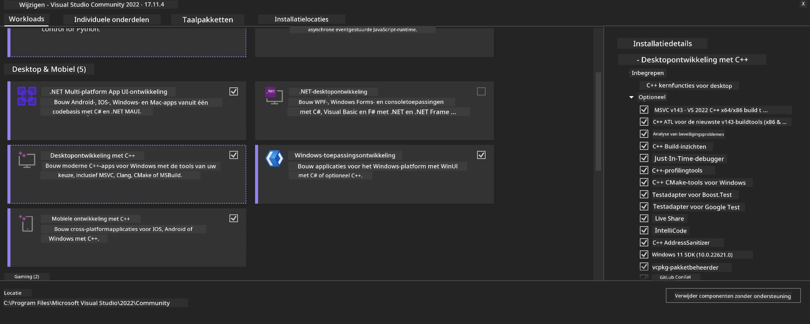
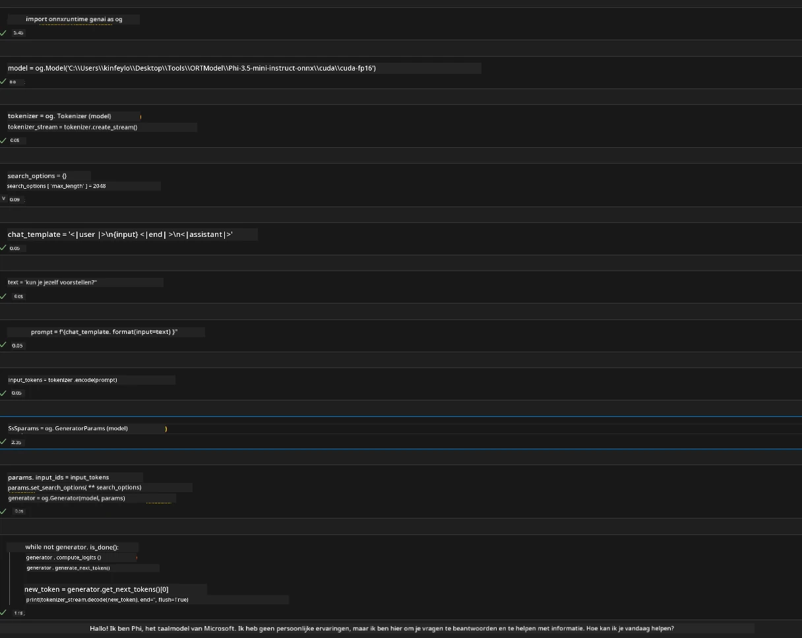
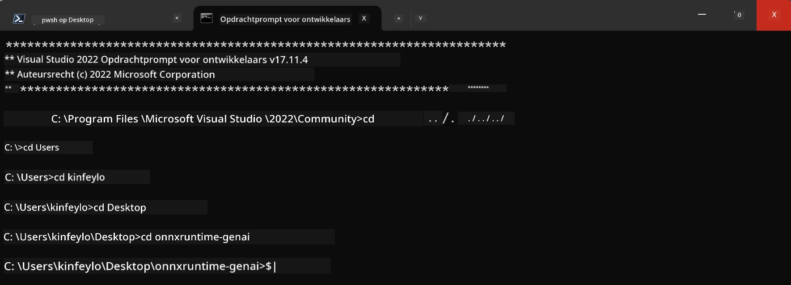

# **Richtlijn voor OnnxRuntime GenAI Windows GPU**

Deze richtlijn biedt stappen voor het opzetten en gebruiken van de ONNX Runtime (ORT) met GPU's op Windows. Het is ontworpen om u te helpen GPU-versnelling te benutten voor uw modellen, waardoor de prestaties en efficiëntie verbeterd worden.

Het document geeft richtlijnen over:

- Omgeving Setup: Instructies voor het installeren van de benodigde afhankelijkheden zoals CUDA, cuDNN en ONNX Runtime.
- Configuratie: Hoe u de omgeving en ONNX Runtime configureert om GPU-bronnen effectief te gebruiken.
- Optimalisatietips: Advies over hoe u uw GPU-instellingen kunt afstemmen voor optimale prestaties.

### **1. Python 3.10.x /3.11.8**

***Opmerking*** Aanbevolen wordt om [miniforge](https://github.com/conda-forge/miniforge/releases/latest/download/Miniforge3-Windows-x86_64.exe) als uw Python-omgeving te gebruiken

   ```bash

   conda create -n pydev python==3.11.8

   conda activate pydev

   ```

***Herinnering*** Als u een Python ONNX-bibliotheek hebt geïnstalleerd, verwijder deze dan eerst

### **2. Installeer CMake met winget**


   ```bash

   winget install -e --id Kitware.CMake

   ```

### **3. Installeer Visual Studio 2022 - Desktop Development met C++**

***Opmerking*** Als u niet wilt compileren kunt u deze stap overslaan




### **4. Installeer NVIDIA Driver**

1. **NVIDIA GPU Driver**  [https://www.nvidia.com/en-us/drivers/](https://www.nvidia.com/en-us/drivers/)

2. **NVIDIA CUDA 12.4** [https://developer.nvidia.com/cuda-12-4-0-download-archive](https://developer.nvidia.com/cuda-12-4-0-download-archive)

3. **NVIDIA CUDNN 9.4**  [https://developer.nvidia.com/cudnn-downloads](https://developer.nvidia.com/cudnn-downloads)

***Herinnering*** Gebruik de standaardinstellingen tijdens het installatieproces 

### **5. Stel NVIDIA-omgeving in**

Kopieer NVIDIA CUDNN 9.4 lib,bin,include naar NVIDIA CUDA 12.4 lib,bin,include

- kopieer *'C:\Program Files\NVIDIA\CUDNN\v9.4\bin\12.6'* bestanden naar  *'C:\Program Files\NVIDIA GPU Computing Toolkit\CUDA\v12.4\bin*

- kopieer *'C:\Program Files\NVIDIA\CUDNN\v9.4\include\12.6'* bestanden naar  *'C:\Program Files\NVIDIA GPU Computing Toolkit\CUDA\v12.4\include*

- kopieer *'C:\Program Files\NVIDIA\CUDNN\v9.4\lib\12.6'* bestanden naar  *'C:\Program Files\NVIDIA GPU Computing Toolkit\CUDA\v12.4\lib\x64'*


### **6. Download Phi-3.5-mini-instruct-onnx**


   ```bash

   winget install -e --id Git.Git

   winget install -e --id GitHub.GitLFS

   git lfs install

   git clone https://huggingface.co/microsoft/Phi-3.5-mini-instruct-onnx

   ```

### **7. Uitvoeren InferencePhi35Instruct.ipynb**

Open [Notebook](../../../../code/09.UpdateSamples/Aug/ortgpu-phi35-instruct.ipynb) en voer uit 





### **8. Compileer ORT GenAI GPU**


***Opmerking*** 
   
1. Verwijder eerst alle onnx, onnxruntime en onnxruntime-genai pakketten

   
   ```bash

   pip list 
   
   ```

Verwijder vervolgens alle onnxruntime bibliotheken, bijvoorbeeld 


   ```bash

   pip uninstall onnxruntime

   pip uninstall onnxruntime-genai

   pip uninstall onnxruntume-genai-cuda
   
   ```

2. Controleer of Visual Studio Extensie wordt ondersteund 

Controleer C:\Program Files\NVIDIA GPU Computing Toolkit\CUDA\v12.4\extras om te bevestigen dat C:\Program Files\NVIDIA GPU Computing Toolkit\CUDA\v12.4\extras\visual_studio_integration aanwezig is. 
   
Als dit niet gevonden wordt, controleer dan andere CUDA toolkit driver mappen en kopieer de map visual_studio_integration en inhoud naar C:\Program Files\NVIDIA GPU Computing Toolkit\CUDA\v12.4\extras\visual_studio_integration


- Als u niet wilt compileren kunt u deze stap overslaan


   ```bash

   git clone https://github.com/microsoft/onnxruntime-genai

   ```

- Download [https://github.com/microsoft/onnxruntime/releases/download/v1.19.2/onnxruntime-win-x64-gpu-1.19.2.zip](https://github.com/microsoft/onnxruntime/releases/download/v1.19.2/onnxruntime-win-x64-gpu-1.19.2.zip)

- Pak onnxruntime-win-x64-gpu-1.19.2.zip uit en hernoem het naar **ort**, kopieer de map ort naar onnxruntime-genai

- Gebruik Windows Terminal, ga naar Developer Command Prompt voor VS 2022 en ga naar onnxruntime-genai 



- Compileer het met uw python-omgeving

   
   ```bash

   cd onnxruntime-genai

   python build.py --use_cuda  --cuda_home "C:\Program Files\NVIDIA GPU Computing Toolkit\CUDA\v12.4" --config Release
 

   cd build/Windows/Release/Wheel

   pip install .whl

   ```

---

<!-- CO-OP TRANSLATOR DISCLAIMER START -->
**Disclaimer**:
Dit document is vertaald met behulp van de AI vertaaldienst [Co-op Translator](https://github.com/Azure/co-op-translator). Hoewel we streven naar nauwkeurigheid, dient u er rekening mee te houden dat geautomatiseerde vertalingen fouten of onnauwkeurigheden kunnen bevatten. Het originele document in de oorspronkelijke taal moet worden beschouwd als de gezaghebbende bron. Voor kritieke informatie wordt professionele menselijke vertaling aanbevolen. Wij zijn niet aansprakelijk voor eventuele misverstanden of verkeerde interpretaties die voortvloeien uit het gebruik van deze vertaling.
<!-- CO-OP TRANSLATOR DISCLAIMER END -->