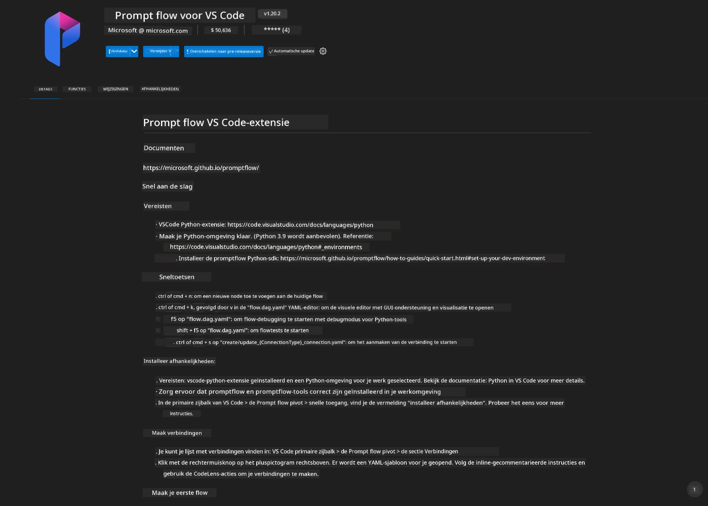
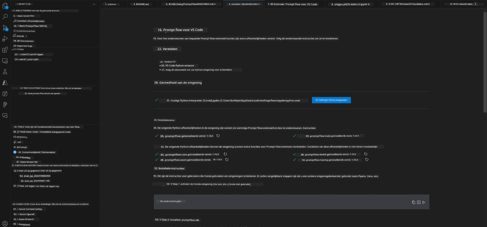
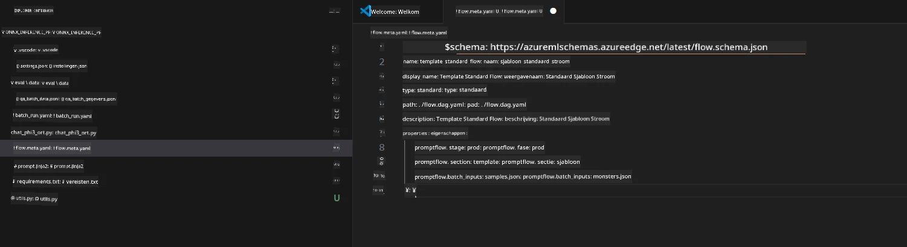
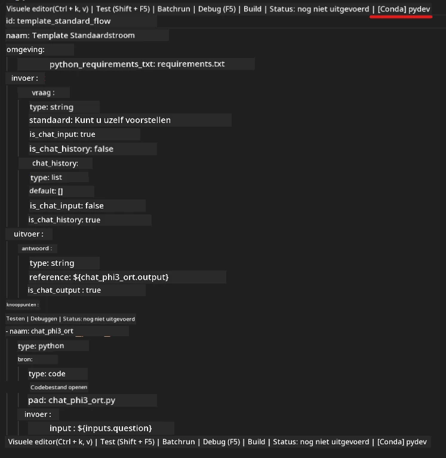
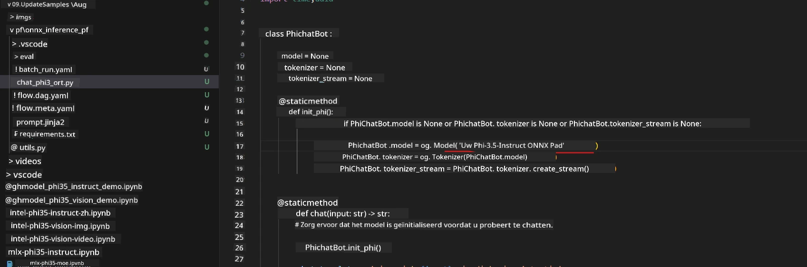
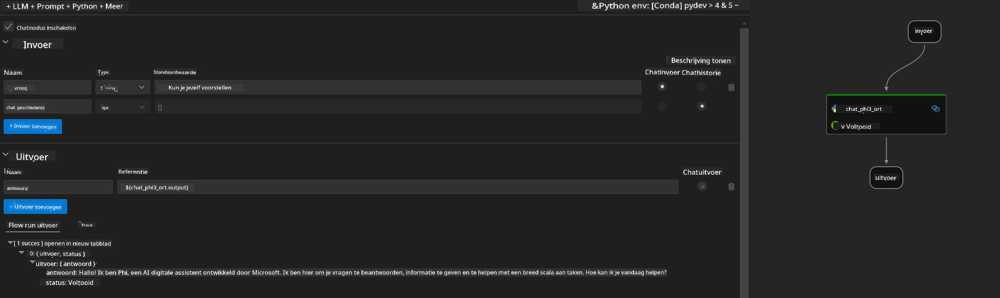
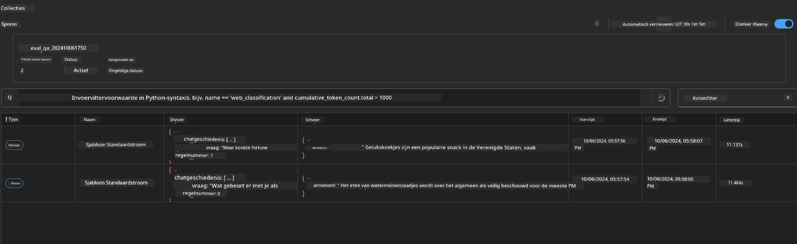

<!--
CO_OP_TRANSLATOR_METADATA:
{
  "original_hash": "92e7dac1e5af0dd7c94170fdaf6860fe",
  "translation_date": "2025-07-17T03:01:39+00:00",
  "source_file": "md/02.Application/01.TextAndChat/Phi3/UsingPromptFlowWithONNX.md",
  "language_code": "nl"
}
-->
# Gebruik van Windows GPU om Prompt flow-oplossing te maken met Phi-3.5-Instruct ONNX

Het volgende document is een voorbeeld van hoe je PromptFlow kunt gebruiken met ONNX (Open Neural Network Exchange) voor het ontwikkelen van AI-toepassingen gebaseerd op Phi-3 modellen.

PromptFlow is een verzameling ontwikkeltools die ontworpen zijn om de volledige ontwikkelingscyclus van LLM-gebaseerde (Large Language Model) AI-toepassingen te stroomlijnen, van ideeëngeneratie en prototyping tot testen en evaluatie.

Door PromptFlow te integreren met ONNX kunnen ontwikkelaars:

- Modelprestaties optimaliseren: Maak gebruik van ONNX voor efficiënte modelinference en implementatie.
- Ontwikkeling vereenvoudigen: Gebruik PromptFlow om de workflow te beheren en repetitieve taken te automatiseren.
- Samenwerking verbeteren: Faciliteer betere samenwerking tussen teamleden door een uniforme ontwikkelomgeving te bieden.

**Prompt flow** is een verzameling ontwikkeltools die ontworpen zijn om de volledige ontwikkelingscyclus van LLM-gebaseerde AI-toepassingen te stroomlijnen, van ideeëngeneratie, prototyping, testen, evaluatie tot productie-implementatie en monitoring. Het maakt prompt engineering veel eenvoudiger en stelt je in staat om LLM-apps te bouwen met productiekwaliteit.

Prompt flow kan verbinding maken met OpenAI, Azure OpenAI Service en aanpasbare modellen (Huggingface, lokale LLM/SLM). We hopen het gequantiseerde ONNX-model van Phi-3.5 te implementeren in lokale toepassingen. Prompt flow kan ons helpen onze business beter te plannen en lokale oplossingen te voltooien gebaseerd op Phi-3.5. In dit voorbeeld combineren we de ONNX Runtime GenAI Library om de Prompt flow-oplossing te voltooien op basis van Windows GPU.

## **Installatie**

### **ONNX Runtime GenAI voor Windows GPU**

Lees deze richtlijn om ONNX Runtime GenAI voor Windows GPU in te stellen [klik hier](./ORTWindowGPUGuideline.md)

### **Prompt flow instellen in VSCode**

1. Installeer de Prompt flow VS Code-extensie



2. Na het installeren van de Prompt flow VS Code-extensie, klik op de extensie en kies **Installation dependencies** volg deze richtlijn om de Prompt flow SDK in je omgeving te installeren



3. Download [Sample Code](../../../../../../code/09.UpdateSamples/Aug/pf/onnx_inference_pf) en open deze sample met VS Code



4. Open **flow.dag.yaml** om je Python-omgeving te kiezen



   Open **chat_phi3_ort.py** om de locatie van je Phi-3.5-instruct ONNX-model aan te passen



5. Voer je prompt flow uit om te testen

Open **flow.dag.yaml** en klik op visual editor


Klik hierna op uitvoeren om te testen



1. Je kunt batch uitvoeren in de terminal om meer resultaten te bekijken


```bash

pf run create --file batch_run.yaml --stream --name 'Your eval qa name'    

```

Je kunt de resultaten bekijken in je standaardbrowser




**Disclaimer**:  
Dit document is vertaald met behulp van de AI-vertalingsdienst [Co-op Translator](https://github.com/Azure/co-op-translator). Hoewel we streven naar nauwkeurigheid, dient u er rekening mee te houden dat geautomatiseerde vertalingen fouten of onnauwkeurigheden kunnen bevatten. Het originele document in de oorspronkelijke taal moet als de gezaghebbende bron worden beschouwd. Voor cruciale informatie wordt professionele menselijke vertaling aanbevolen. Wij zijn niet aansprakelijk voor eventuele misverstanden of verkeerde interpretaties die voortvloeien uit het gebruik van deze vertaling.