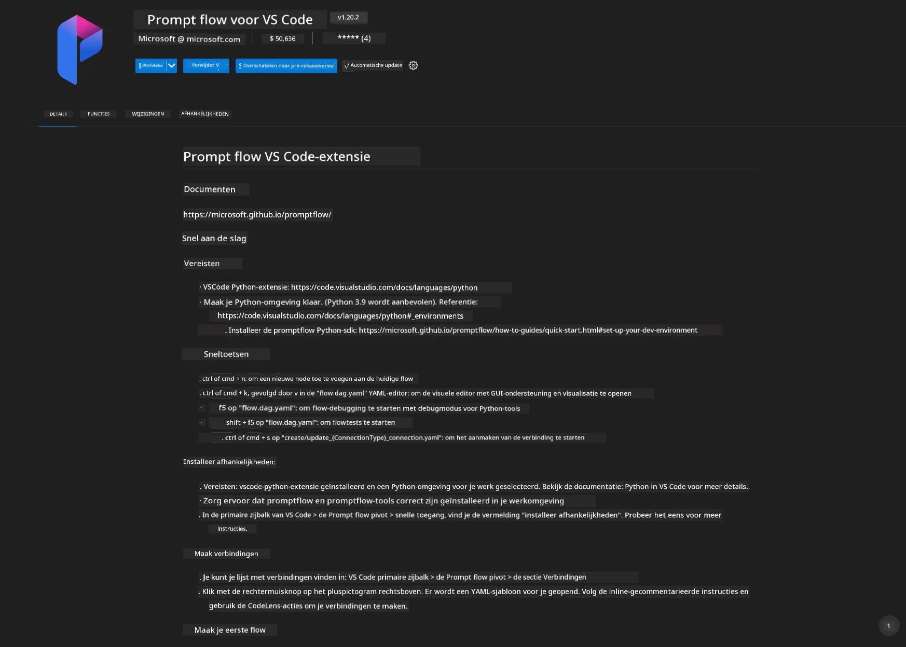
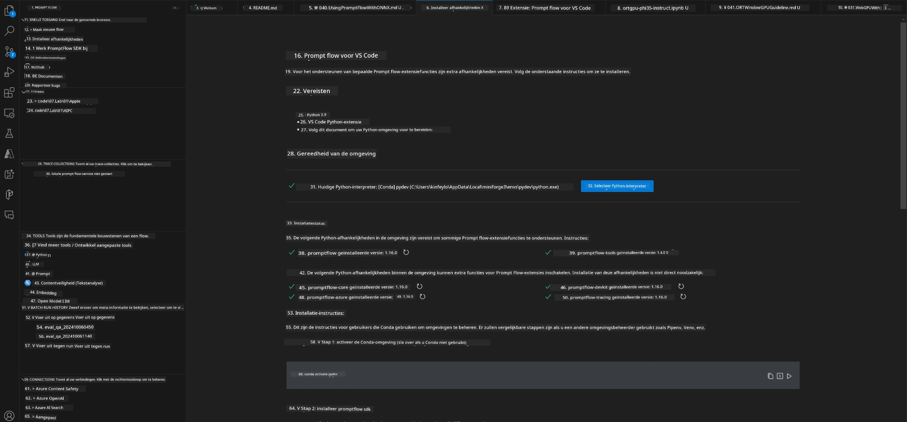
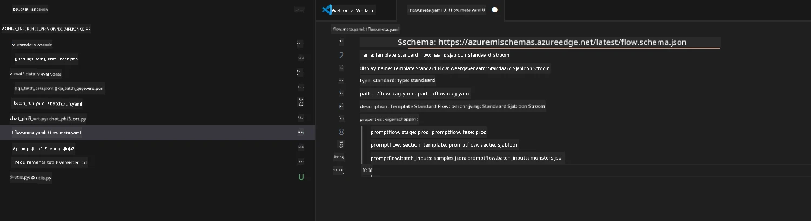
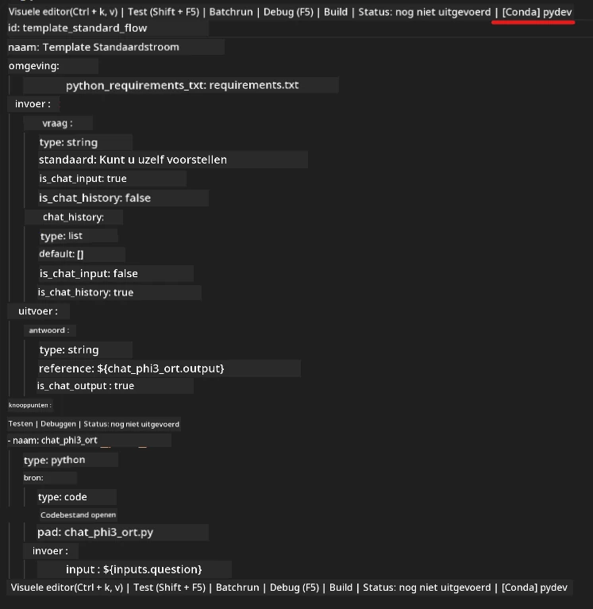
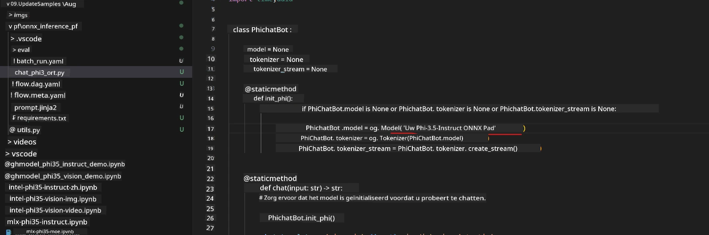
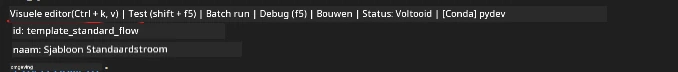
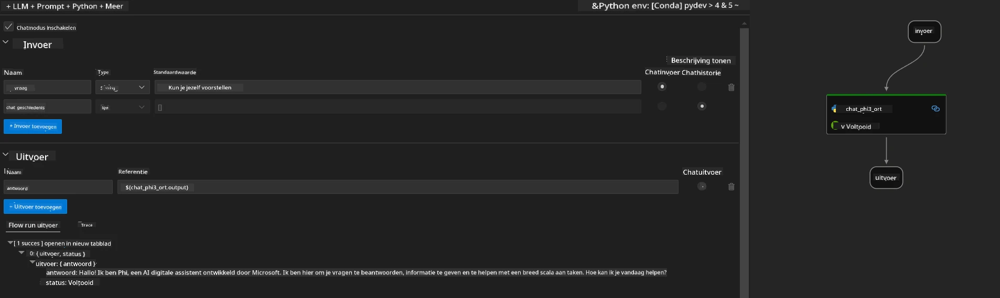
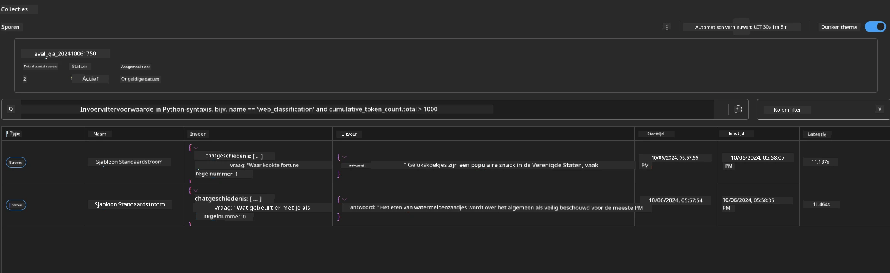

# Windows GPU gebruiken om Prompt flow-oplossing te maken met Phi-3.5-Instruct ONNX 

Het volgende document is een voorbeeld van hoe PromptFlow te gebruiken met ONNX (Open Neural Network Exchange) voor het ontwikkelen van AI-toepassingen gebaseerd op Phi-3 modellen.

PromptFlow is een suite van ontwikkeltools ontworpen om de end-to-end ontwikkelingscyclus van LLM-gebaseerde (Large Language Model) AI-toepassingen te stroomlijnen, van ideeënvorming en prototyping tot testen en evaluatie.

Door PromptFlow te integreren met ONNX kunnen ontwikkelaars:

- Modelprestaties Optimaliseren: Gebruik ONNX voor efficiënte modelinference en implementatie.
- Ontwikkeling Vereenvoudigen: Gebruik PromptFlow om de workflow te beheren en repetitieve taken te automatiseren.
- Samenwerking Verbeteren: Faciliteer betere samenwerking tussen teamleden door een uniforme ontwikkelomgeving te bieden.

**Prompt flow** is een suite van ontwikkeltools ontworpen om de end-to-end ontwikkelingscyclus van LLM-gebaseerde AI-toepassingen te stroomlijnen, van ideeënvorming, prototyping, testen, evaluatie tot productie-implementatie en monitoring. Het maakt prompt engineering veel eenvoudiger en stelt je in staat om LLM-apps met productiekwaliteit te bouwen.

Prompt flow kan verbinding maken met OpenAI, Azure OpenAI Service en aanpasbare modellen (Huggingface, lokale LLM/SLM). We hopen het gekwantiseerde ONNX-model van Phi-3.5 te implementeren voor lokale toepassingen. Prompt flow kan ons helpen onze bedrijfsvoering beter te plannen en lokale oplossingen gebaseerd op Phi-3.5 te voltooien. In dit voorbeeld combineren we ONNX Runtime GenAI Bibliotheek om de Prompt flow-oplossing op basis van Windows GPU te voltooien.

## **Installatie**

### **ONNX Runtime GenAI voor Windows GPU**

Lees deze richtlijn om ONNX Runtime GenAI voor Windows GPU in te stellen [klik hier](./ORTWindowGPUGuideline.md)

### **Prompt flow instellen in VSCode**

1. Installeer Prompt flow VS Code-extensie



2. Na het installeren van de Prompt flow VS Code-extensie, klik op de extensie en kies **Installatie afhankelijkheden** volg deze richtlijn om Prompt flow SDK in je omgeving te installeren



3. Download [Voorbeeldcode](../../../../../../code/09.UpdateSamples/Aug/pf/onnx_inference_pf) en open dit voorbeeld met VS Code



4. Open **flow.dag.yaml** om je Python-omgeving te kiezen



   Open **chat_phi3_ort.py** om je Phi-3.5-instruct ONNX model locatie te wijzigen



5. Voer je prompt flow uit om te testen

Open **flow.dag.yaml** klik op de visuele editor



na het klikken hierop, voer het uit om te testen



1. Je kunt batch uitvoeren in de terminal om meer resultaten te bekijken


```bash

pf run create --file batch_run.yaml --stream --name 'Your eval qa name'    

```

Je kunt resultaten bekijken in je standaard browser




---

<!-- CO-OP TRANSLATOR DISCLAIMER START -->
**Disclaimer**:
Dit document is vertaald met behulp van de AI vertaaldienst [Co-op Translator](https://github.com/Azure/co-op-translator). Hoewel we streven naar nauwkeurigheid, dient u er rekening mee te houden dat geautomatiseerde vertalingen fouten of onnauwkeurigheden kunnen bevatten. Het originele document in de oorspronkelijke taal moet worden beschouwd als de gezaghebbende bron. Voor kritieke informatie wordt professionele menselijke vertaling aanbevolen. Wij zijn niet aansprakelijk voor eventuele misverstanden of verkeerde interpretaties die voortvloeien uit het gebruik van deze vertaling.
<!-- CO-OP TRANSLATOR DISCLAIMER END -->