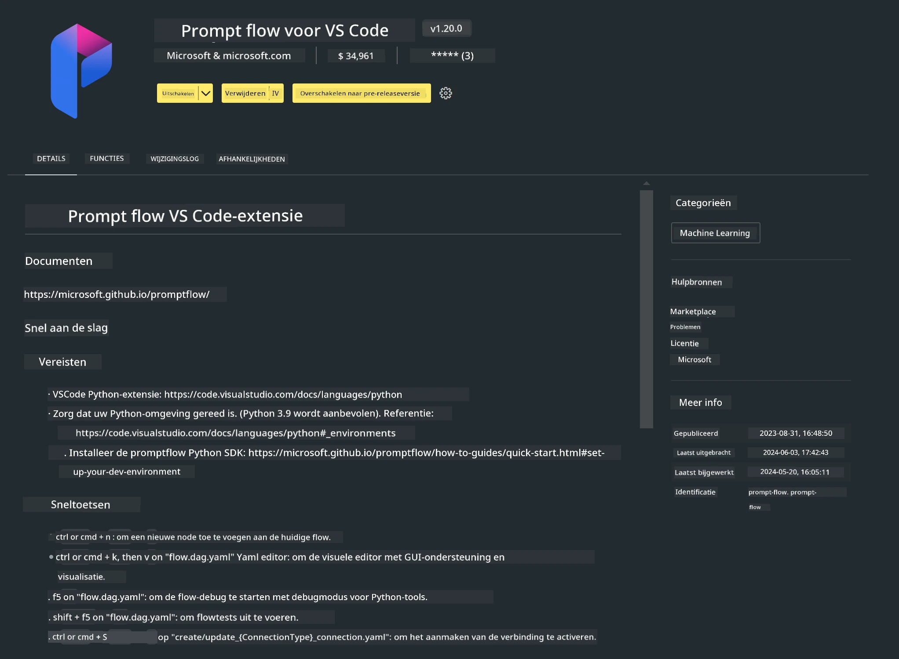

<!--
CO_OP_TRANSLATOR_METADATA:
{
  "original_hash": "a4ef39027902e82f2c33d568d2a2259a",
  "translation_date": "2025-07-17T03:51:20+00:00",
  "source_file": "md/02.Application/02.Code/Phi3/VSCodeExt/HOL/AIPC/01.Installations.md",
  "language_code": "nl"
}
-->
# **Lab 0 - Installatie**

Wanneer we het lab betreden, moeten we de relevante omgeving configureren:


### **1. Python 3.11+**

Het wordt aanbevolen om miniforge te gebruiken om je Python-omgeving in te stellen.

Voor het configureren van miniforge, raadpleeg [https://github.com/conda-forge/miniforge](https://github.com/conda-forge/miniforge)

Na het configureren van miniforge, voer je de volgende opdracht uit in Power Shell

```bash

conda create -n pyenv python==3.11.8 -y

conda activate pyenv

```


### **2. Installeer Prompt flow SDK**

In Lab 1 gebruiken we Prompt flow, dus je moet de Prompt flow SDK configureren.

```bash

pip install promptflow --upgrade

```

Je kunt de promptflow sdk controleren met deze opdracht


```bash

pf --version

```

### **3. Installeer Visual Studio Code Prompt flow Extensie**




### **4. Intel NPU Acceleration Library**

De nieuwe generatie processors van Intel ondersteunen NPU. Als je NPU wilt gebruiken om LLMs / SLMs lokaal uit te voeren, kun je de ***Intel NPU Acceleration Library*** gebruiken. Wil je meer weten, dan kun je dit lezen: [https://github.com/microsoft/PhiCookBook/blob/main/md/01.Introduction/03/AIPC_Inference.md](https://github.com/microsoft/PhiCookBook/blob/main/md/01.Introduction/03/AIPC_Inference.md).

Installeer Intel NPU Acceleration Library in bash


```bash

pip install intel-npu-acceleration-library

```

***Note***: Houd er rekening mee dat deze bibliotheek transformers ***4.40.2*** ondersteunt, controleer dus de versie


### **5. Andere Python Bibliotheken**


maak requirements.txt aan en voeg deze inhoud toe

```txt

notebook
numpy 
scipy 
scikit-learn 
matplotlib 
pandas 
pillow 
graphviz

```


### **6. Installeer NVM**

installeer nvm in Powershell 


```bash

winget install -e --id CoreyButler.NVMforWindows

```

installeer nodejs 18.20


```bash

nvm install 18.20.0

nvm use 18.20.0

```

### **7. Installeer Visual Studio Code Ontwikkelondersteuning**


```bash

npm install --global yo generator-code

```

Gefeliciteerd! Je hebt de SDK succesvol geconfigureerd. Ga nu verder met de praktische stappen.

**Disclaimer**:  
Dit document is vertaald met behulp van de AI-vertalingsdienst [Co-op Translator](https://github.com/Azure/co-op-translator). Hoewel we streven naar nauwkeurigheid, dient u er rekening mee te houden dat geautomatiseerde vertalingen fouten of onnauwkeurigheden kunnen bevatten. Het originele document in de oorspronkelijke taal moet als de gezaghebbende bron worden beschouwd. Voor cruciale informatie wordt professionele menselijke vertaling aanbevolen. Wij zijn niet aansprakelijk voor eventuele misverstanden of verkeerde interpretaties die voortvloeien uit het gebruik van deze vertaling.