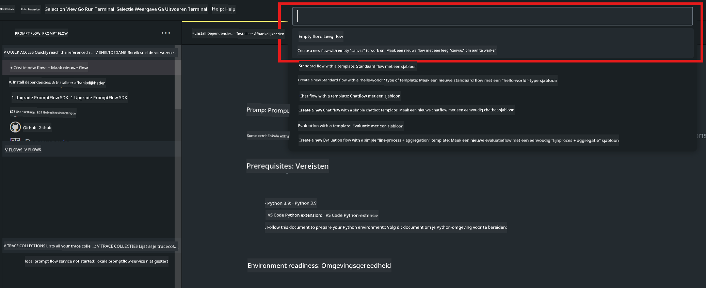
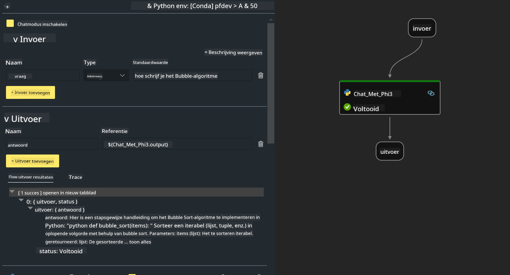

<!--
CO_OP_TRANSLATOR_METADATA:
{
  "original_hash": "bc29f7fe7fc16bed6932733eac8c81b8",
  "translation_date": "2025-05-09T19:24:39+00:00",
  "source_file": "md/02.Application/02.Code/Phi3/VSCodeExt/HOL/AIPC/02.PromptflowWithNPU.md",
  "language_code": "nl"
}
-->
# **Lab 2 - Prompt flow uitvoeren met Phi-3-mini in AIPC**

## **Wat is Prompt flow**

Prompt flow is een reeks ontwikkeltools die de volledige ontwikkelingscyclus van AI-toepassingen gebaseerd op LLM’s vereenvoudigt, van ideevorming, prototyping, testen, evaluatie tot productie-implementatie en monitoring. Het maakt prompt engineering veel gemakkelijker en stelt je in staat om LLM-apps van productiekwaliteit te bouwen.

Met prompt flow kun je:

- Flows maken die LLM’s, prompts, Python-code en andere tools samenbrengen in een uitvoerbare workflow.

- Je flows debuggen en itereren, vooral de interactie met LLM’s, op een eenvoudige manier.

- Je flows evalueren en kwaliteits- en prestatie-indicatoren berekenen met grotere datasets.

- Testen en evaluatie integreren in je CI/CD-systeem om de kwaliteit van je flow te waarborgen.

- Je flows uitrollen naar het servingplatform van jouw keuze of eenvoudig integreren in de codebasis van je app.

- (Optioneel maar sterk aanbevolen) Samenwerken met je team via de cloudversie van Prompt flow in Azure AI.

## **Wat is AIPC**

Een AI PC heeft een CPU, een GPU en een NPU, elk met specifieke AI-versnellingsmogelijkheden. Een NPU, of neural processing unit, is een gespecialiseerde accelerator die AI- en machine learning-taken direct op je pc uitvoert, in plaats van data naar de cloud te sturen voor verwerking. De GPU en CPU kunnen deze taken ook uitvoeren, maar de NPU is vooral geschikt voor energiezuinige AI-berekeningen. De AI PC betekent een fundamentele verandering in hoe onze computers werken. Het is geen oplossing voor een probleem dat eerder niet bestond, maar belooft een grote verbetering voor dagelijks pc-gebruik.

Hoe werkt het? In vergelijking met generatieve AI en de enorme grote taalmodellen (LLM’s) die op enorme hoeveelheden publieke data getraind zijn, is AI op je pc toegankelijker op vrijwel elk niveau. Het concept is makkelijker te begrijpen en omdat het getraind is op jouw data, zonder cloudtoegang, zijn de voordelen direct aantrekkelijker voor een breder publiek.

Op korte termijn draait het AI PC-wereldje om persoonlijke assistenten en kleinere AI-modellen die direct op je pc draaien, gebruikmakend van jouw data om persoonlijke, privé en veiliger AI-verbeteringen te bieden voor taken die je dagelijks doet – notuleren tijdens vergaderingen, een fantasy football league organiseren, automatische verbeteringen voor foto- en videobewerking, of de perfecte planning maken voor een familiereünie op basis van aankomst- en vertrektijden van iedereen.

## **Generatiecode-flows bouwen op AIPC**

***Note*** ：Als je de omgeving nog niet hebt geïnstalleerd, bezoek dan [Lab 0 -Installaties](./01.Installations.md)

1. Open de Prompt flow-extensie in Visual Studio Code en maak een leeg flow-project aan



2. Voeg Input- en Output-parameters toe en voeg Python-code toe als nieuwe flow



Je kunt deze structuur (flow.dag.yaml) gebruiken om je flow op te bouwen

```yaml

inputs:
  question:
    type: string
    default: how to write Bubble Algorithm
outputs:
  answer:
    type: string
    reference: ${Chat_With_Phi3.output}
nodes:
- name: Chat_With_Phi3
  type: python
  source:
    type: code
    path: Chat_With_Phi3.py
  inputs:
    question: ${inputs.question}


```

3. Voeg code toe in ***Chat_With_Phi3.py***

```python


from promptflow.core import tool

# import torch
from transformers import AutoTokenizer, pipeline,TextStreamer
import intel_npu_acceleration_library as npu_lib

import warnings

import asyncio
import platform

class Phi3CodeAgent:
    
    model = None
    tokenizer = None
    text_streamer = None
    
    model_id = "microsoft/Phi-3-mini-4k-instruct"

    @staticmethod
    def init_phi3():
        
        if Phi3CodeAgent.model is None or Phi3CodeAgent.tokenizer is None or Phi3CodeAgent.text_streamer is None:
            Phi3CodeAgent.model = npu_lib.NPUModelForCausalLM.from_pretrained(
                                    Phi3CodeAgent.model_id,
                                    torch_dtype="auto",
                                    dtype=npu_lib.int4,
                                    trust_remote_code=True
                                )
            Phi3CodeAgent.tokenizer = AutoTokenizer.from_pretrained(Phi3CodeAgent.model_id)
            Phi3CodeAgent.text_streamer = TextStreamer(Phi3CodeAgent.tokenizer, skip_prompt=True)

    

    @staticmethod
    def chat_with_phi3(prompt):
        
        Phi3CodeAgent.init_phi3()

        messages = "<|system|>You are a AI Python coding assistant. Please help me to generate code in Python.The answer only genertated Python code, but any comments and instructions do not need to be generated<|end|><|user|>" + prompt +"<|end|><|assistant|>"


        generation_args = {
            "max_new_tokens": 1024,
            "return_full_text": False,
            "temperature": 0.3,
            "do_sample": False,
            "streamer": Phi3CodeAgent.text_streamer,
        }

        pipe = pipeline(
            "text-generation",
            model=Phi3CodeAgent.model,
            tokenizer=Phi3CodeAgent.tokenizer,
            # **generation_args
        )

        result = ''

        with warnings.catch_warnings():
            warnings.simplefilter("ignore")
            response = pipe(messages, **generation_args)
            result =response[0]['generated_text']
            return result


@tool
def my_python_tool(question: str) -> str:
    if platform.system() == 'Windows':
        asyncio.set_event_loop_policy(asyncio.WindowsSelectorEventLoopPolicy())
    return Phi3CodeAgent.chat_with_phi3(question)


```

4. Je kunt de flow testen via Debug of Run om te controleren of de generatiecode werkt


5. Voer de flow uit als ontwikkel-API in de terminal

```

pf flow serve --source ./ --port 8080 --host localhost   

```

Je kunt het testen in Postman / Thunder Client

### **Note**

1. De eerste keer uitvoeren duurt lang. Het wordt aanbevolen het phi-3-model te downloaden via de Hugging face CLI.

2. Gezien de beperkte rekenkracht van de Intel NPU, is het aan te raden Phi-3-mini-4k-instruct te gebruiken.

3. We gebruiken Intel NPU-versnelling om INT4-kwantisatie uit te voeren, maar als je de service opnieuw start, moet je de cache- en nc_workshop-mappen verwijderen.

## **Resources**

1. Leer Promptflow [https://microsoft.github.io/promptflow/](https://microsoft.github.io/promptflow/)

2. Leer Intel NPU Acceleration [https://github.com/intel/intel-npu-acceleration-library](https://github.com/intel/intel-npu-acceleration-library)

3. Voorbeeldcode, download [Local NPU Agent Sample Code](../../../../../../../../../code/07.Lab/01/AIPC)

**Disclaimer**:  
Dit document is vertaald met behulp van de AI-vertalingsdienst [Co-op Translator](https://github.com/Azure/co-op-translator). Hoewel we streven naar nauwkeurigheid, dient u er rekening mee te houden dat geautomatiseerde vertalingen fouten of onnauwkeurigheden kunnen bevatten. Het oorspronkelijke document in de oorspronkelijke taal moet worden beschouwd als de gezaghebbende bron. Voor cruciale informatie wordt professionele menselijke vertaling aanbevolen. Wij zijn niet aansprakelijk voor misverstanden of verkeerde interpretaties die voortvloeien uit het gebruik van deze vertaling.