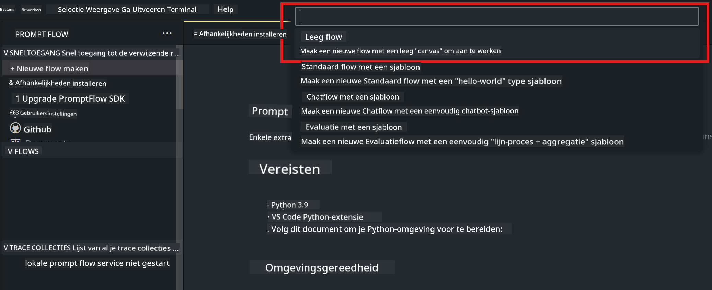
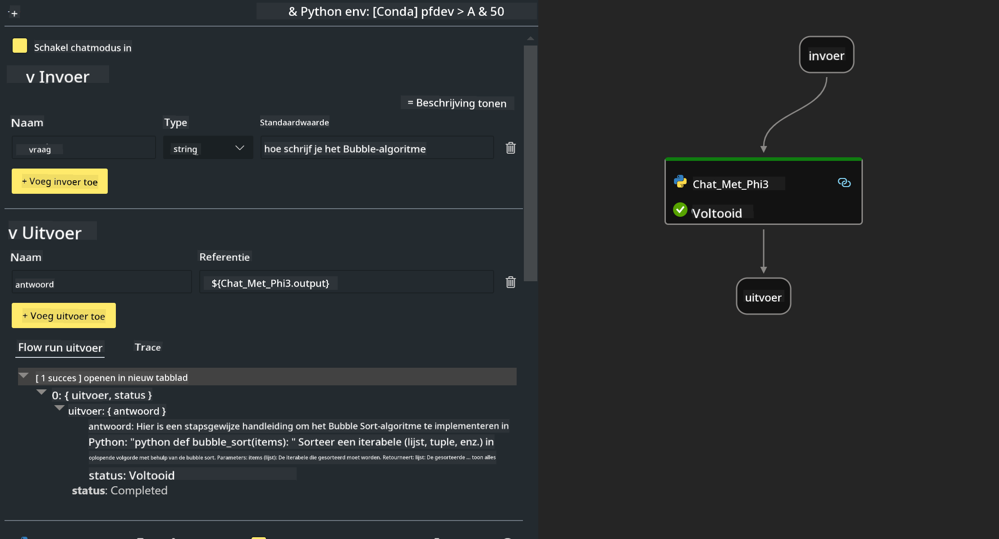
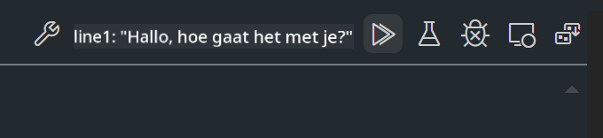

<!--
CO_OP_TRANSLATOR_METADATA:
{
  "original_hash": "3dbbf568625b1ee04b354c2dc81d3248",
  "translation_date": "2025-07-17T04:27:12+00:00",
  "source_file": "md/02.Application/02.Code/Phi3/VSCodeExt/HOL/Apple/02.PromptflowWithMLX.md",
  "language_code": "nl"
}
-->
# **Lab 2 - Run Prompt flow met Phi-3-mini in AIPC**

## **Wat is Prompt flow**

Prompt flow is een verzameling ontwikkeltools die de volledige ontwikkelingscyclus van op LLM gebaseerde AI-toepassingen stroomlijnen, van ideeëngeneratie, prototyping, testen, evaluatie tot productie-implementatie en monitoring. Het maakt prompt engineering veel eenvoudiger en stelt je in staat om LLM-apps van productiekwaliteit te bouwen.

Met prompt flow kun je:

- Flows maken die LLM's, prompts, Python-code en andere tools samenbrengen in een uitvoerbare workflow.

- Je flows debuggen en itereren, vooral de interactie met LLM's, op een gemakkelijke manier.

- Je flows evalueren en kwaliteits- en prestatie-indicatoren berekenen met grotere datasets.

- Testen en evaluatie integreren in je CI/CD-systeem om de kwaliteit van je flow te waarborgen.

- Je flows eenvoudig uitrollen naar het door jou gekozen serveerplatform of integreren in de codebase van je app.

- (Optioneel maar sterk aanbevolen) Samenwerken met je team door gebruik te maken van de cloudversie van Prompt flow in Azure AI.

## **Generatiecode flows bouwen op Apple Silicon**

***Note*** ：Als je de installatie van de omgeving nog niet hebt voltooid, bezoek dan [Lab 0 - Installaties](./01.Installations.md)

1. Open de Prompt flow-extensie in Visual Studio Code en maak een leeg flow-project aan



2. Voeg Inputs en Outputs parameters toe en voeg Python-code toe als nieuwe flow



Je kunt deze structuur (flow.dag.yaml) gebruiken om je flow op te bouwen

```yaml

inputs:
  prompt:
    type: string
    default: Write python code for Fibonacci serie. Please use markdown as output
outputs:
  result:
    type: string
    reference: ${gen_code_by_phi3.output}
nodes:
- name: gen_code_by_phi3
  type: python
  source:
    type: code
    path: gen_code_by_phi3.py
  inputs:
    prompt: ${inputs.prompt}


```

3. Kwantificeer phi-3-mini

We willen SLM beter laten draaien op lokale apparaten. Over het algemeen kwantificeren we het model (INT4, FP16, FP32)

```bash

python -m mlx_lm.convert --hf-path microsoft/Phi-3-mini-4k-instruct

```

**Note:** de standaardmap is mlx_model

4. Voeg code toe in ***Chat_With_Phi3.py***

```python


from promptflow import tool

from mlx_lm import load, generate


# The inputs section will change based on the arguments of the tool function, after you save the code
# Adding type to arguments and return value will help the system show the types properly
# Please update the function name/signature per need
@tool
def my_python_tool(prompt: str) -> str:

    model_id = './mlx_model_phi3_mini'

    model, tokenizer = load(model_id)

    # <|user|>\nWrite python code for Fibonacci serie. Please use markdown as output<|end|>\n<|assistant|>

    response = generate(model, tokenizer, prompt="<|user|>\n" + prompt  + "<|end|>\n<|assistant|>", max_tokens=2048, verbose=True)

    return response


```

4. Je kunt de flow testen via Debug of Run om te controleren of de generatiecode werkt



5. Run de flow als ontwikkel-API in de terminal

```

pf flow serve --source ./ --port 8080 --host localhost   

```

Je kunt het testen in Postman / Thunder Client

### **Note**

1. De eerste run duurt lang. Het wordt aanbevolen om het phi-3 model te downloaden via Hugging face CLI.

2. Gezien de beperkte rekenkracht van Intel NPU, wordt aanbevolen Phi-3-mini-4k-instruct te gebruiken.

3. We gebruiken Intel NPU Acceleration om INT4 conversie te kwantificeren, maar als je de service opnieuw start, moet je de cache- en nc_workshop-mappen verwijderen.

## **Resources**

1. Leer Promptflow [https://microsoft.github.io/promptflow/](https://microsoft.github.io/promptflow/)

2. Leer Intel NPU Acceleration [https://github.com/intel/intel-npu-acceleration-library](https://github.com/intel/intel-npu-acceleration-library)

3. Voorbeeldcode, download [Local NPU Agent Sample Code](../../../../../../../../../code/07.Lab/01/AIPC/local-npu-agent)

**Disclaimer**:  
Dit document is vertaald met behulp van de AI-vertalingsdienst [Co-op Translator](https://github.com/Azure/co-op-translator). Hoewel we streven naar nauwkeurigheid, dient u er rekening mee te houden dat geautomatiseerde vertalingen fouten of onnauwkeurigheden kunnen bevatten. Het originele document in de oorspronkelijke taal moet als de gezaghebbende bron worden beschouwd. Voor cruciale informatie wordt professionele menselijke vertaling aanbevolen. Wij zijn niet aansprakelijk voor eventuele misverstanden of verkeerde interpretaties die voortvloeien uit het gebruik van deze vertaling.