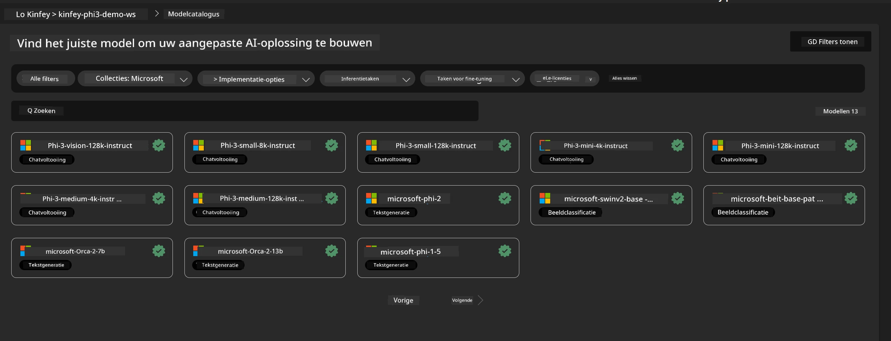
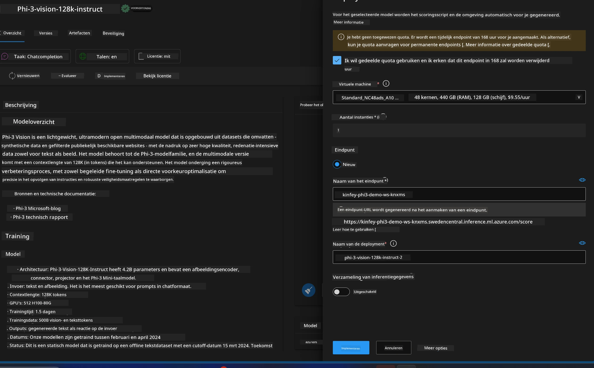
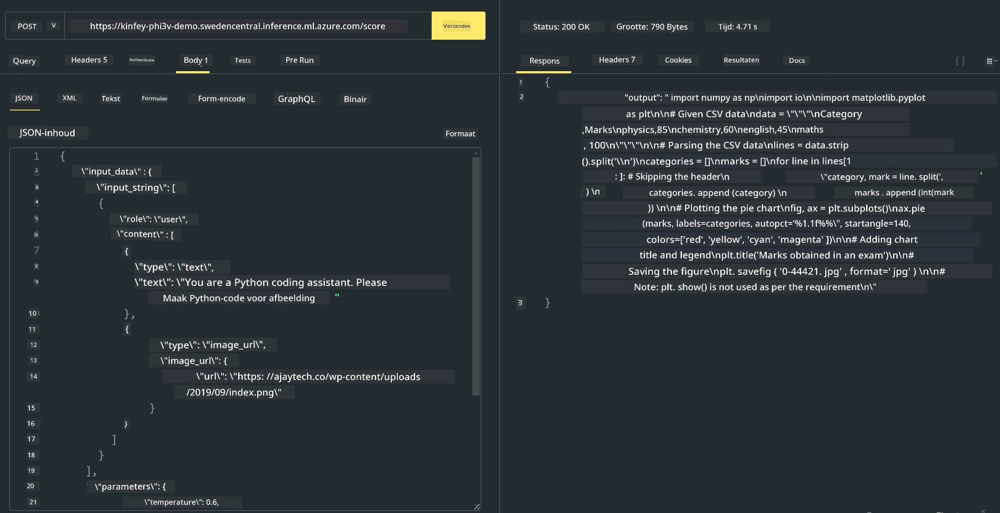

<!--
CO_OP_TRANSLATOR_METADATA:
{
  "original_hash": "20cb4e6ac1686248e8be913ccf6c2bc2",
  "translation_date": "2025-07-17T04:34:21+00:00",
  "source_file": "md/02.Application/02.Code/Phi3/VSCodeExt/HOL/Apple/03.DeployPhi3VisionOnAzure.md",
  "language_code": "nl"
}
-->
# **Lab 3 - Phi-3-vision implementeren op Azure Machine Learning Service**

We gebruiken NPU om de productie-implementatie van lokale code te voltooien, en vervolgens willen we de mogelijkheid introduceren om PHI-3-VISION te integreren om zo van afbeeldingen code te genereren.

In deze introductie kunnen we snel een Model As Service Phi-3 Vision-service opzetten in Azure Machine Learning Service.

***Note***: Phi-3 Vision vereist rekenkracht om content sneller te genereren. We hebben cloud computingkracht nodig om ons hierbij te helpen.


### **1. Maak Azure Machine Learning Service aan**

We moeten een Azure Machine Learning Service aanmaken in de Azure Portal. Wil je weten hoe, bezoek dan deze link [https://learn.microsoft.com/azure/machine-learning/quickstart-create-resources?view=azureml-api-2](https://learn.microsoft.com/azure/machine-learning/quickstart-create-resources?view=azureml-api-2)


### **2. Kies Phi-3 Vision in Azure Machine Learning Service**




### **3. Implementeer Phi-3-Vision in Azure**





### **4. Test de Endpoint in Postman**





***Note***

1. De te verzenden parameters moeten Authorization, azureml-model-deployment en Content-Type bevatten. Je moet de implementatiegegevens controleren om deze te verkrijgen.

2. Om parameters te verzenden, moet Phi-3-Vision een afbeeldingslink doorgeven. Raadpleeg de GPT-4-Vision methode om parameters te verzenden, bijvoorbeeld

```json

{
  "input_data":{
    "input_string":[
      {
        "role":"user",
        "content":[ 
          {
            "type": "text",
            "text": "You are a Python coding assistant.Please create Python code for image "
          },
          {
              "type": "image_url",
              "image_url": {
                "url": "https://ajaytech.co/wp-content/uploads/2019/09/index.png"
              }
          }
        ]
      }
    ],
    "parameters":{
          "temperature": 0.6,
          "top_p": 0.9,
          "do_sample": false,
          "max_new_tokens": 2048
    }
  }
}

```

3. Roep **/score** aan met de Post-methode

**Gefeliciteerd**! Je hebt de snelle PHI-3-VISION implementatie afgerond en geprobeerd hoe je met afbeeldingen code kunt genereren. Vervolgens kunnen we applicaties bouwen in combinatie met NPU’s en de cloud.

**Disclaimer**:  
Dit document is vertaald met behulp van de AI-vertalingsdienst [Co-op Translator](https://github.com/Azure/co-op-translator). Hoewel we streven naar nauwkeurigheid, dient u er rekening mee te houden dat geautomatiseerde vertalingen fouten of onnauwkeurigheden kunnen bevatten. Het originele document in de oorspronkelijke taal moet als de gezaghebbende bron worden beschouwd. Voor cruciale informatie wordt professionele menselijke vertaling aanbevolen. Wij zijn niet aansprakelijk voor eventuele misverstanden of verkeerde interpretaties die voortvloeien uit het gebruik van deze vertaling.