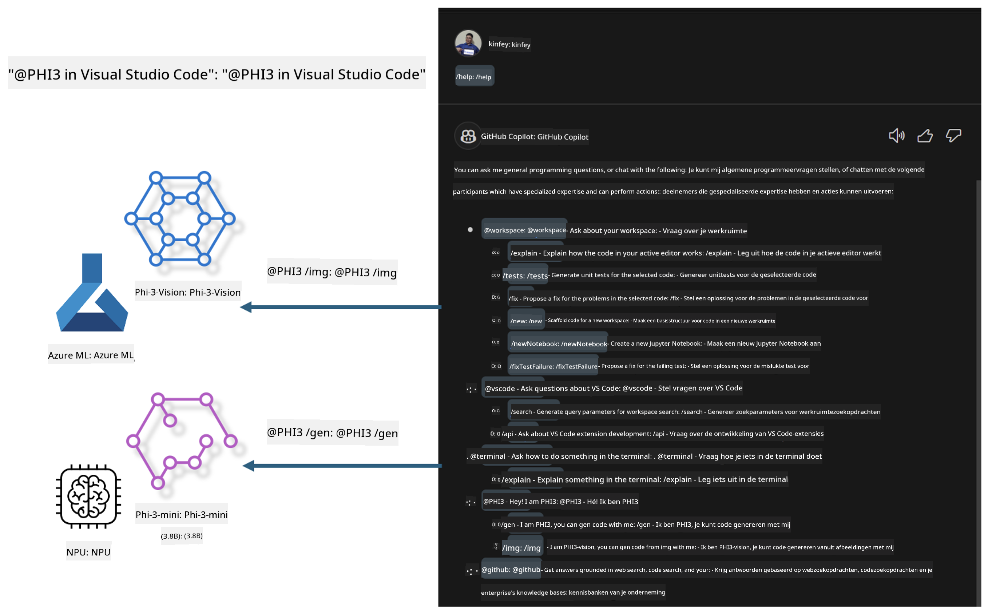

<!--
CO_OP_TRANSLATOR_METADATA:
{
  "original_hash": "00b7a699de8ac405fa821f4c0f7fc0ab",
  "translation_date": "2025-07-17T03:41:22+00:00",
  "source_file": "md/02.Application/02.Code/Phi3/VSCodeExt/README.md",
  "language_code": "nl"
}
-->
# **Bouw je eigen Visual Studio Code GitHub Copilot Chat met Microsoft Phi-3 Family**

Heb je de workspace-agent in GitHub Copilot Chat al gebruikt? Wil je een eigen code-agent voor je team bouwen? Deze praktische lab probeert het open source model te combineren om een enterprise-level code business agent te creëren.

## **Basis**

### **Waarom kiezen voor Microsoft Phi-3**

Phi-3 is een familieserie, waaronder phi-3-mini, phi-3-small en phi-3-medium, gebaseerd op verschillende trainingsparameters voor tekstgeneratie, dialoogafhandeling en codegeneratie. Er is ook phi-3-vision, gebaseerd op Vision. Het is geschikt voor bedrijven of verschillende teams om offline generatieve AI-oplossingen te creëren.

Aanbevolen om deze link te lezen [https://github.com/microsoft/PhiCookBook/blob/main/md/01.Introduction/01/01.PhiFamily.md](https://github.com/microsoft/PhiCookBook/blob/main/md/01.Introduction/01/01.PhiFamily.md)

### **Microsoft GitHub Copilot Chat**

De GitHub Copilot Chat-extensie biedt je een chatinterface waarmee je kunt communiceren met GitHub Copilot en direct binnen VS Code antwoorden krijgt op codeervragen, zonder dat je documentatie hoeft te doorzoeken of online forums hoeft te raadplegen.

Copilot Chat kan syntax highlighting, inspringing en andere opmaakfuncties gebruiken om de gegenereerde antwoorden duidelijker te maken. Afhankelijk van het type vraag van de gebruiker kan het resultaat links bevatten naar context die Copilot gebruikte voor het genereren van een antwoord, zoals broncodebestanden of documentatie, of knoppen om toegang te krijgen tot VS Code-functionaliteit.

- Copilot Chat integreert in je ontwikkelworkflow en biedt hulp waar je het nodig hebt:

- Start een inline chatgesprek direct vanuit de editor of terminal voor hulp tijdens het coderen

- Gebruik de Chat-weergave om een AI-assistent aan de zijkant te hebben die je op elk moment kan helpen

- Start Quick Chat om snel een vraag te stellen en weer verder te gaan met je werk

Je kunt GitHub Copilot Chat in verschillende scenario’s gebruiken, zoals:

- Vragen beantwoorden over hoe je een probleem het beste kunt oplossen

- Iemands code uitleggen en verbeteringen voorstellen

- Codefixes voorstellen

- Unit test cases genereren

- Code documentatie genereren

Aanbevolen om deze link te lezen [https://code.visualstudio.com/docs/copilot/copilot-chat](https://code.visualstudio.com/docs/copilot/copilot-chat?WT.mc_id=aiml-137032-kinfeylo)

###  **Microsoft GitHub Copilot Chat @workspace**

Door **@workspace** te gebruiken in Copilot Chat kun je vragen stellen over je volledige codebase. Op basis van de vraag haalt Copilot intelligent relevante bestanden en symbolen op, die het vervolgens in zijn antwoord als links en codevoorbeelden vermeldt.

Om je vraag te beantwoorden doorzoekt **@workspace** dezelfde bronnen die een ontwikkelaar zou gebruiken bij het navigeren door een codebase in VS Code:

- Alle bestanden in de workspace, behalve bestanden die worden genegeerd door een .gitignore-bestand

- De mappenstructuur met geneste mappen en bestandsnamen

- GitHub’s code-zoekindex, als de workspace een GitHub-repository is en geïndexeerd wordt door code search

- Symbolen en definities in de workspace

- Momenteel geselecteerde tekst of zichtbare tekst in de actieve editor

Opmerking: .gitignore wordt genegeerd als je een bestand open hebt staan of tekst hebt geselecteerd binnen een genegeerd bestand.

Aanbevolen om deze link te lezen [[https://code.visualstudio.com/docs/copilot/copilot-chat](https://code.visualstudio.com/docs/copilot/workspace-context?WT.mc_id=aiml-137032-kinfeylo)]

## **Meer weten over deze Lab**

GitHub Copilot heeft de programmeerefficiëntie van bedrijven sterk verbeterd, en elk bedrijf wil de relevante functies van GitHub Copilot aanpassen. Veel bedrijven hebben extensies aangepast die lijken op GitHub Copilot, gebaseerd op hun eigen zakelijke scenario’s en open source modellen. Voor bedrijven zijn aangepaste extensies makkelijker te beheren, maar dit beïnvloedt ook de gebruikerservaring. GitHub Copilot heeft immers sterkere functies voor algemene scenario’s en professionaliteit. Als de ervaring consistent kan blijven, is het beter om een eigen aangepaste extensie te maken. GitHub Copilot Chat biedt relevante API’s voor bedrijven om de chatervaring uit te breiden. Het behouden van een consistente ervaring met aangepaste functies zorgt voor een betere gebruikerservaring.

Deze lab gebruikt voornamelijk het Phi-3 model in combinatie met de lokale NPU en Azure hybride om een aangepaste Agent in GitHub Copilot Chat ***@PHI3*** te bouwen die enterprise-ontwikkelaars helpt bij het voltooien van codegeneratie ***(@PHI3 /gen)*** en het genereren van code op basis van afbeeldingen ***(@PHI3 /img)***.

### ***Opmerking:*** 

Deze lab is momenteel geïmplementeerd in de AIPC van Intel CPU en Apple Silicon. We blijven de Qualcomm-versie van NPU updaten.

## **Lab**

| Naam | Beschrijving | AIPC | Apple |
| ------------ | ----------- | -------- |-------- |
| Lab0 - Installaties(✅) | Configureren en installeren van gerelateerde omgevingen en installatiehulpmiddelen | [Ga](./HOL/AIPC/01.Installations.md) |[Ga](./HOL/Apple/01.Installations.md) |
| Lab1 - Run Prompt flow met Phi-3-mini (✅) | In combinatie met AIPC / Apple Silicon, gebruikmakend van lokale NPU om codegeneratie te creëren via Phi-3-mini | [Ga](./HOL/AIPC/02.PromptflowWithNPU.md) |  [Ga](./HOL/Apple/02.PromptflowWithMLX.md) |
| Lab2 - Deploy Phi-3-vision op Azure Machine Learning Service(✅) | Code genereren door het implementeren van Azure Machine Learning Service’s Model Catalog - Phi-3-vision image | [Ga](./HOL/AIPC/03.DeployPhi3VisionOnAzure.md) |[Ga](./HOL/Apple/03.DeployPhi3VisionOnAzure.md) |
| Lab3 - Maak een @phi-3 agent in GitHub Copilot Chat(✅)  | Maak een aangepaste Phi-3 agent in GitHub Copilot Chat om codegeneratie, grafiekgeneratiecode, RAG, enz. te voltooien | [Ga](./HOL/AIPC/04.CreatePhi3AgentInVSCode.md) | [Ga](./HOL/Apple/04.CreatePhi3AgentInVSCode.md) |
| Voorbeeldcode (✅)  | Download voorbeeldcode | [Ga](../../../../../../../code/07.Lab/01/AIPC) | [Ga](../../../../../../../code/07.Lab/01/Apple) |

## **Bronnen**

1. Phi-3 Cookbook [https://github.com/microsoft/Phi-3CookBook](https://github.com/microsoft/Phi-3CookBook)

2. Meer leren over GitHub Copilot [https://learn.microsoft.com/training/paths/copilot/](https://learn.microsoft.com/training/paths/copilot/?WT.mc_id=aiml-137032-kinfeylo)

3. Meer leren over GitHub Copilot Chat [https://learn.microsoft.com/training/paths/accelerate-app-development-using-github-copilot/](https://learn.microsoft.com/training/paths/accelerate-app-development-using-github-copilot/?WT.mc_id=aiml-137032-kinfeylo)

4. Meer leren over GitHub Copilot Chat API [https://code.visualstudio.com/api/extension-guides/chat](https://code.visualstudio.com/api/extension-guides/chat?WT.mc_id=aiml-137032-kinfeylo)

5. Meer leren over Azure AI Foundry [https://learn.microsoft.com/training/paths/create-custom-copilots-ai-studio/](https://learn.microsoft.com/training/paths/create-custom-copilots-ai-studio/?WT.mc_id=aiml-137032-kinfeylo)

6. Meer leren over Azure AI Foundry’s Model Catalog [https://learn.microsoft.com/azure/ai-studio/how-to/model-catalog-overview](https://learn.microsoft.com/azure/ai-studio/how-to/model-catalog-overview)

**Disclaimer**:  
Dit document is vertaald met behulp van de AI-vertalingsdienst [Co-op Translator](https://github.com/Azure/co-op-translator). Hoewel we streven naar nauwkeurigheid, dient u er rekening mee te houden dat geautomatiseerde vertalingen fouten of onnauwkeurigheden kunnen bevatten. Het originele document in de oorspronkelijke taal moet als de gezaghebbende bron worden beschouwd. Voor cruciale informatie wordt professionele menselijke vertaling aanbevolen. Wij zijn niet aansprakelijk voor eventuele misverstanden of verkeerde interpretaties die voortvloeien uit het gebruik van deze vertaling.