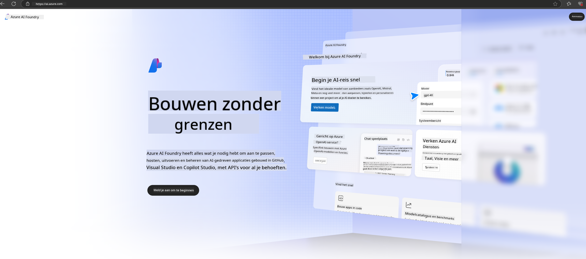

<!--
CO_OP_TRANSLATOR_METADATA:
{
  "original_hash": "3a1e48b628022485aac989c9f733e792",
  "translation_date": "2025-05-09T20:12:54+00:00",
  "source_file": "md/02.QuickStart/AzureAIFoundry_QuickStart.md",
  "language_code": "nl"
}
-->
# **Phi-3 gebruiken in Azure AI Foundry**

Met de ontwikkeling van Generative AI willen we een uniform platform gebruiken om verschillende LLM- en SLM-modellen te beheren, bedrijfsgegevens te integreren, fine-tuning/RAG-operaties uit te voeren en de evaluatie van verschillende bedrijfsprocessen na integratie van LLM en SLM te verzorgen, zodat generatieve AI beter kan worden toegepast in slimme applicaties. [Azure AI Foundry](https://ai.azure.com) is een enterprise-grade platform voor generatieve AI-toepassingen.

Met Azure AI Foundry kun je de reacties van grote taalmodellen (LLM) evalueren en prompt-toepassingscomponenten orkestreren met prompt flow voor betere prestaties. Het platform ondersteunt schaalbaarheid om proof of concepts eenvoudig om te zetten in volledige productieomgevingen. Doorlopende monitoring en verfijning zorgen voor langdurig succes.

We kunnen het Phi-3 model snel implementeren op Azure AI Foundry via eenvoudige stappen, en vervolgens Azure AI Foundry gebruiken voor Playground/Chat, fine-tuning, evaluatie en andere gerelateerde werkzaamheden met Phi-3.

## **1. Voorbereiding**

Als je de [Azure Developer CLI](https://learn.microsoft.com/azure/developer/azure-developer-cli/overview?WT.mc_id=aiml-138114-kinfeylo) al op je machine hebt geïnstalleerd, is het gebruik van deze template zo eenvoudig als het uitvoeren van dit commando in een nieuwe map.

## Handmatige aanmaak

Het aanmaken van een Microsoft Azure AI Foundry-project en hub is een goede manier om je AI-werk te organiseren en beheren. Hier volgt een stapsgewijze handleiding om te beginnen:

### Een project aanmaken in Azure AI Foundry

1. **Ga naar Azure AI Foundry**: Meld je aan bij het Azure AI Foundry-portaal.
2. **Maak een project aan**:
   - Als je al in een project zit, selecteer dan linksboven op de pagina "Azure AI Foundry" om naar de startpagina te gaan.
   - Selecteer "+ Create project".
   - Voer een naam in voor het project.
   - Als je een hub hebt, wordt deze standaard geselecteerd. Heb je toegang tot meerdere hubs, dan kun je er een andere kiezen uit de dropdown. Wil je een nieuwe hub aanmaken, selecteer dan "Create new hub" en geef een naam op.
   - Klik op "Create".

### Een hub aanmaken in Azure AI Foundry

1. **Ga naar Azure AI Foundry**: Log in met je Azure-account.
2. **Maak een hub aan**:
   - Selecteer het Management Center in het linker menu.
   - Kies "All resources", klik op het pijltje naast "+ New project" en selecteer "+ New hub".
   - Voer in het dialoogvenster "Create a new hub" een naam in voor je hub (bijv. contoso-hub) en pas de overige velden aan indien gewenst.
   - Klik op "Next", controleer de gegevens en klik daarna op "Create".

Voor meer gedetailleerde instructies kun je de officiële [Microsoft documentatie](https://learn.microsoft.com/azure/ai-studio/how-to/create-projects) raadplegen.

Na succesvolle aanmaak kun je de studio die je hebt gemaakt openen via [ai.azure.com](https://ai.azure.com/).

Er kunnen meerdere projecten binnen één AI Foundry bestaan. Maak een project aan in AI Foundry als voorbereiding.

Maak gebruik van Azure AI Foundry [QuickStarts](https://learn.microsoft.com/azure/ai-studio/quickstarts/get-started-code).

## **2. Een Phi-model implementeren in Azure AI Foundry**

Klik op de optie Explore van het project om naar de Model Catalog te gaan en selecteer Phi-3.

Selecteer Phi-3-mini-4k-instruct.

Klik op 'Deploy' om het Phi-3-mini-4k-instruct model te implementeren.

> [!NOTE]
>
> Je kunt bij het implementeren de rekenkracht kiezen.

## **3. Playground Chat Phi in Azure AI Foundry**

Ga naar de implementatiepagina, selecteer Playground en chat met Phi-3 van Azure AI Foundry.

## **4. Model implementeren vanuit Azure AI Foundry**

Volg deze stappen om een model uit de Azure Model Catalog te implementeren:

- Meld je aan bij Azure AI Foundry.
- Kies het model dat je wilt implementeren uit de Azure AI Foundry modelcatalogus.
- Op de detailpagina van het model selecteer je Deploy en daarna Serverless API met Azure AI Content Safety.
- Selecteer het project waarin je het model wilt implementeren. Om gebruik te maken van de Serverless API moet je workspace zich bevinden in de regio East US 2 of Sweden Central. Je kunt de naam van de implementatie aanpassen.
- In de implementatiewizard selecteer je Pricing and terms om meer te weten te komen over de kosten en gebruiksvoorwaarden.
- Klik op Deploy. Wacht tot de implementatie klaar is en je wordt doorgestuurd naar de Deployments-pagina.
- Klik op Open in playground om te starten met interactie met het model.
- Je kunt terugkeren naar de Deployments-pagina, de implementatie selecteren en de Target URL en Secret Key van de endpoint noteren. Deze gebruik je om de implementatie aan te roepen en completions te genereren.
- Je kunt de details van de endpoint, URL en toegangssleutels altijd vinden door naar het tabblad Build te gaan en Deployments te selecteren onder Components.

> [!NOTE]
> Houd er rekening mee dat je account de rol Azure AI Developer moet hebben binnen de Resource Group om deze stappen uit te voeren.

## **5. Phi API gebruiken in Azure AI Foundry**

Je kunt via Postman een GET-verzoek doen naar https://{Your project name}.region.inference.ml.azure.com/swagger.json en deze combineren met je Key om de beschikbare interfaces te verkennen.

Zo kun je heel gemakkelijk de aanvraagparameters en de responsparameters bekijken.

**Disclaimer**:  
Dit document is vertaald met behulp van de AI-vertalingsdienst [Co-op Translator](https://github.com/Azure/co-op-translator). Hoewel we streven naar nauwkeurigheid, dient u er rekening mee te houden dat automatische vertalingen fouten of onnauwkeurigheden kunnen bevatten. Het oorspronkelijke document in de oorspronkelijke taal dient als de gezaghebbende bron te worden beschouwd. Voor cruciale informatie wordt professionele menselijke vertaling aanbevolen. Wij zijn niet aansprakelijk voor eventuele misverstanden of verkeerde interpretaties die voortvloeien uit het gebruik van deze vertaling.