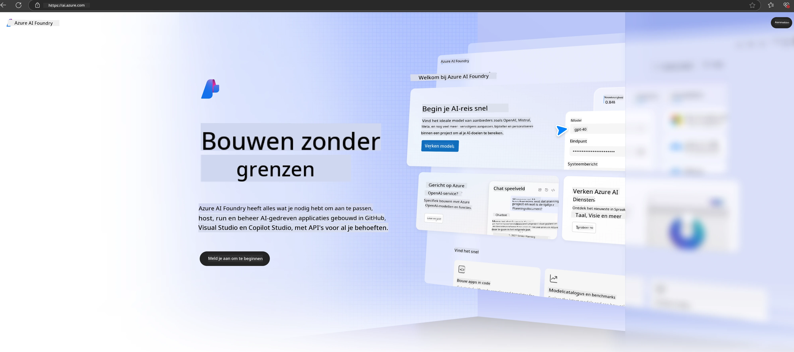

# **Phi-3 gebruiken in Microsoft Foundry**

Met de ontwikkeling van Generative AI hopen we een uniform platform te gebruiken om verschillende LLM- en SLM-modellen, integratie van bedrijfsdata, fine-tuning/RAG-operaties en de evaluatie van verschillende bedrijfsprocessen na integratie van LLM en SLM te beheren, zodat generatieve AI beter kan worden toegepast in slimme applicaties. [Microsoft Foundry](https://ai.azure.com) is een generatief AI-toepassingsplatform op ondernemingsniveau.

Met Microsoft Foundry kun je de reacties van grote taalmodellen (LLM) evalueren en promptapplicatiecomponenten orkestreren met prompt flow voor betere prestaties. Het platform maakt schaalbaarheid mogelijk om proof of concepts eenvoudig om te zetten naar volledige productie. Continue monitoring en verfijning ondersteunen langdurig succes.

We kunnen het Phi-3-model snel implementeren op Microsoft Foundry via eenvoudige stappen, en vervolgens Microsoft Foundry gebruiken om Playground/Chat, Fine-tuning, evaluatie en andere gerelateerde werkzaamheden rondom Phi-3 te voltooien.

## **1. Voorbereiding**

Als je de [Azure Developer CLI](https://learn.microsoft.com/azure/developer/azure-developer-cli/overview?WT.mc_id=aiml-138114-kinfeylo) al op je machine hebt geïnstalleerd, is het gebruik van deze template zo eenvoudig als het uitvoeren van dit commando in een nieuwe map.

## Handmatige aanmaak

Het aanmaken van een Microsoft Foundry-project en hub is een goede manier om je AI-werk te organiseren en beheren. Hier is een stapsgewijze handleiding om te beginnen:

### Een project aanmaken in Microsoft Foundry

1. **Ga naar Microsoft Foundry**: Log in op het Microsoft Foundry-portaal.
2. **Maak een project aan**:
   - Als je al in een project zit, selecteer dan linksboven op de pagina "Microsoft Foundry" om naar de startpagina te gaan.
   - Selecteer "+ Create project".
   - Voer een naam in voor het project.
   - Als je een hub hebt, wordt deze standaard geselecteerd. Als je toegang hebt tot meerdere hubs, kun je er een andere kiezen uit de dropdown. Wil je een nieuwe hub aanmaken, selecteer dan "Create new hub" en geef een naam op.
   - Selecteer "Create".

### Een hub aanmaken in Microsoft Foundry

1. **Ga naar Microsoft Foundry**: Log in met je Azure-account.
2. **Maak een hub aan**:
   - Selecteer het Management center in het linkermenu.
   - Selecteer "All resources", klik op het pijltje naast "+ New project" en kies "+ New hub".
   - Voer in het dialoogvenster "Create a new hub" een naam in voor je hub (bijv. contoso-hub) en pas de overige velden aan naar wens.
   - Selecteer "Next", controleer de informatie en klik op "Create".

Voor meer gedetailleerde instructies kun je de officiële [Microsoft-documentatie](https://learn.microsoft.com/azure/ai-studio/how-to/create-projects) raadplegen.

Na succesvolle aanmaak kun je de studio die je hebt gemaakt openen via [ai.azure.com](https://ai.azure.com/)

Er kunnen meerdere projecten in één AI Foundry zijn. Maak een project aan in AI Foundry ter voorbereiding.

Maak gebruik van Microsoft Foundry [QuickStarts](https://learn.microsoft.com/azure/ai-studio/quickstarts/get-started-code)

## **2. Een Phi-model implementeren in Microsoft Foundry**

Klik op de optie Explore van het project om de Model Catalog te openen en selecteer Phi-3

Selecteer Phi-3-mini-4k-instruct

Klik op 'Deploy' om het Phi-3-mini-4k-instruct model te implementeren

> [!NOTE]
>
> Je kunt bij het implementeren de rekenkracht selecteren

## **3. Playground Chat Phi in Microsoft Foundry**

Ga naar de implementatiepagina, selecteer Playground en chat met Phi-3 van Microsoft Foundry

## **4. Het model implementeren vanuit Microsoft Foundry**

Volg deze stappen om een model vanuit de Azure Model Catalog te implementeren:

- Log in op Microsoft Foundry.
- Kies het model dat je wilt implementeren uit de Microsoft Foundry modelcatalogus.
- Selecteer op de detailpagina van het model Deploy en kies vervolgens Serverless API met Azure AI Content Safety.
- Selecteer het project waarin je je modellen wilt implementeren. Om de Serverless API te gebruiken, moet je werkruimte zich in de regio East US 2 of Sweden Central bevinden. Je kunt de naam van de implementatie aanpassen.
- Selecteer in de implementatiewizard Pricing and terms om meer te weten te komen over de prijzen en gebruiksvoorwaarden.
- Klik op Deploy. Wacht tot de implementatie klaar is en je wordt doorgestuurd naar de pagina Deployments.
- Selecteer Open in playground om te beginnen met interactie met het model.
- Je kunt terugkeren naar de pagina Deployments, de implementatie selecteren en de Target URL van de endpoint en de Secret Key noteren, die je kunt gebruiken om de implementatie aan te roepen en completions te genereren.
- Je kunt altijd de details van de endpoint, URL en toegangssleutels vinden door naar het tabblad Build te gaan en Deployments te selecteren in de sectie Components.

> [!NOTE]
> Houd er rekening mee dat je account de rol Azure AI Developer moet hebben op de Resource Group om deze stappen uit te voeren.

## **5. Phi API gebruiken in Microsoft Foundry**

Je kunt https://{Your project name}.region.inference.ml.azure.com/swagger.json openen via Postman met een GET-verzoek en dit combineren met de Key om de beschikbare interfaces te bekijken.

Je kunt op een zeer gemakkelijke manier de aanvraagparameters en ook de responsparameters bekijken.

**Disclaimer**:  
Dit document is vertaald met behulp van de AI-vertalingsdienst [Co-op Translator](https://github.com/Azure/co-op-translator). Hoewel we streven naar nauwkeurigheid, dient u er rekening mee te houden dat geautomatiseerde vertalingen fouten of onnauwkeurigheden kunnen bevatten. Het originele document in de oorspronkelijke taal moet als de gezaghebbende bron worden beschouwd. Voor cruciale informatie wordt professionele menselijke vertaling aanbevolen. Wij zijn niet aansprakelijk voor eventuele misverstanden of verkeerde interpretaties die voortvloeien uit het gebruik van deze vertaling.