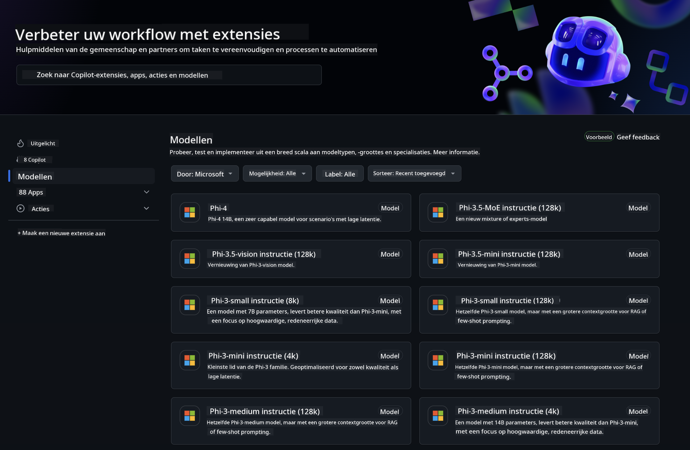
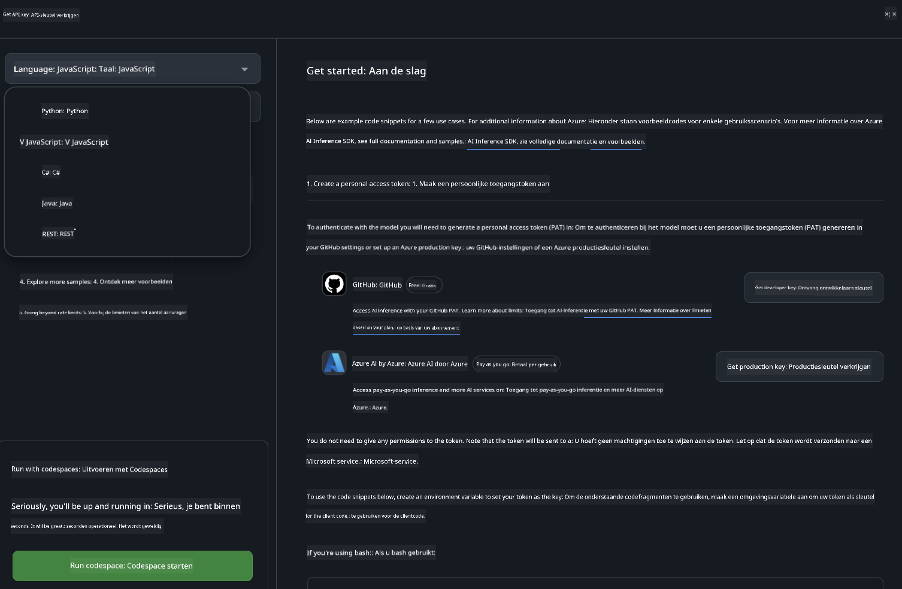
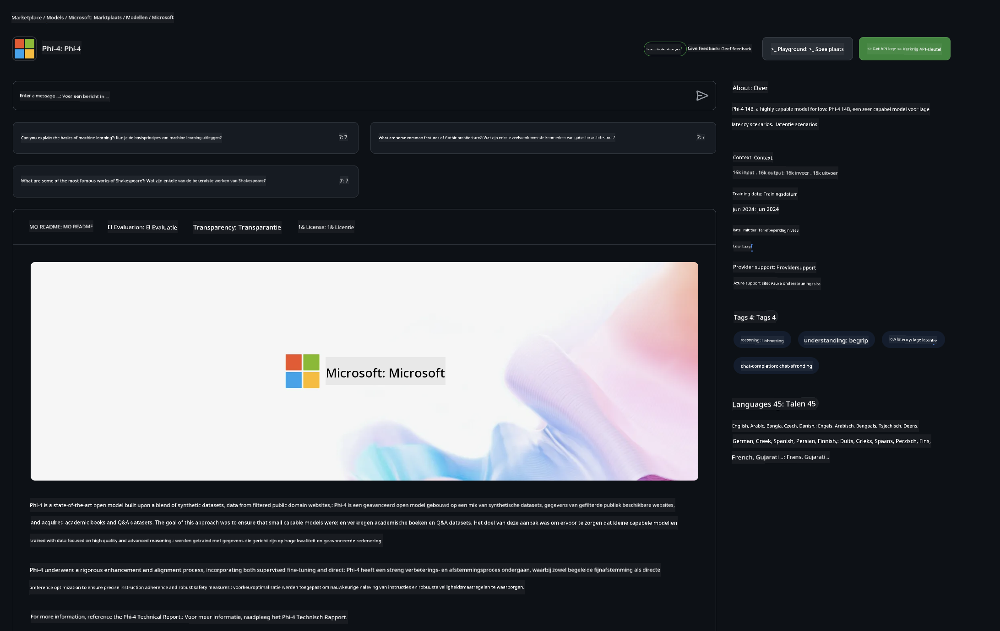

<!--
CO_OP_TRANSLATOR_METADATA:
{
  "original_hash": "5113634b77370af6790f9697d5d7de90",
  "translation_date": "2025-05-09T20:19:23+00:00",
  "source_file": "md/02.QuickStart/GitHubModel_QuickStart.md",
  "language_code": "nl"
}
-->
## GitHub Models - Beperkte Openbare Bèta

Welkom bij [GitHub Models](https://github.com/marketplace/models)! We hebben alles klaargezet zodat je AI-modellen kunt verkennen die gehost worden op Azure AI.



Voor meer informatie over de beschikbare modellen op GitHub Models, bekijk de [GitHub Model Marketplace](https://github.com/marketplace/models)

## Beschikbare Modellen

Elk model heeft een speciale playground en voorbeeldcode


### Phi-3 Modellen in GitHub Model Catalog

[Phi-3-Medium-128k-Instruct](https://github.com/marketplace/models/azureml/Phi-3-medium-128k-instruct)

[Phi-3-medium-4k-instruct](https://github.com/marketplace/models/azureml/Phi-3-medium-4k-instruct)

[Phi-3-mini-128k-instruct](https://github.com/marketplace/models/azureml/Phi-3-mini-128k-instruct)

[Phi-3-mini-4k-instruct](https://github.com/marketplace/models/azureml/Phi-3-mini-4k-instruct)

[Phi-3-small-128k-instruct](https://github.com/marketplace/models/azureml/Phi-3-small-128k-instruct)

[Phi-3-small-8k-instruct](https://github.com/marketplace/models/azureml/Phi-3-small-8k-instruct)

## Aan de Slag

Er zijn een paar basisvoorbeelden die je direct kunt uitvoeren. Je vindt ze in de samples directory. Wil je meteen aan de slag met jouw favoriete programmeertaal? De voorbeelden zijn beschikbaar in de volgende talen:

- Python
- JavaScript
- cURL

Er is ook een speciale Codespaces-omgeving beschikbaar om de samples en modellen uit te voeren.



## Voorbeeldcode

Hieronder vind je voorbeeldcode voor een aantal gebruiksscenario’s. Voor meer informatie over de Azure AI Inference SDK, bekijk de volledige documentatie en voorbeelden.

## Setup

1. Maak een personal access token aan  
Je hoeft geen permissies toe te kennen aan het token. Let op: het token wordt verzonden naar een Microsoft-service.

Om de onderstaande codevoorbeelden te gebruiken, maak je een omgevingsvariabele aan waarin je je token instelt als sleutel voor de client code.

Als je bash gebruikt:  
```
export GITHUB_TOKEN="<your-github-token-goes-here>"
```  
Als je PowerShell gebruikt:  

```
$Env:GITHUB_TOKEN="<your-github-token-goes-here>"
```  

Als je de Windows command prompt gebruikt:  

```
set GITHUB_TOKEN=<your-github-token-goes-here>
```  

## Python Voorbeeld

### Installeer dependencies  
Installeer de Azure AI Inference SDK met pip (Vereist: Python >=3.8):  

```
pip install azure-ai-inference
```  
### Voer een eenvoudig codevoorbeeld uit

Dit voorbeeld laat een basisaanroep zien naar de chat completion API. Het maakt gebruik van het GitHub AI model inference endpoint en je GitHub token. De aanroep is synchroon.

```
import os
from azure.ai.inference import ChatCompletionsClient
from azure.ai.inference.models import SystemMessage, UserMessage
from azure.core.credentials import AzureKeyCredential

endpoint = "https://models.inference.ai.azure.com"
# Replace Model_Name 
model_name = "Phi-3-small-8k-instruct"
token = os.environ["GITHUB_TOKEN"]

client = ChatCompletionsClient(
    endpoint=endpoint,
    credential=AzureKeyCredential(token),
)

response = client.complete(
    messages=[
        SystemMessage(content="You are a helpful assistant."),
        UserMessage(content="What is the capital of France?"),
    ],
    model=model_name,
    temperature=1.,
    max_tokens=1000,
    top_p=1.
)

print(response.choices[0].message.content)
```

### Voer een multi-turn gesprek uit

Dit voorbeeld toont een meerstapsgesprek met de chat completion API. Bij het gebruik van het model voor een chatapplicatie moet je de gespreksgeschiedenis beheren en de laatste berichten naar het model sturen.

```
import os
from azure.ai.inference import ChatCompletionsClient
from azure.ai.inference.models import AssistantMessage, SystemMessage, UserMessage
from azure.core.credentials import AzureKeyCredential

token = os.environ["GITHUB_TOKEN"]
endpoint = "https://models.inference.ai.azure.com"
# Replace Model_Name
model_name = "Phi-3-small-8k-instruct"

client = ChatCompletionsClient(
    endpoint=endpoint,
    credential=AzureKeyCredential(token),
)

messages = [
    SystemMessage(content="You are a helpful assistant."),
    UserMessage(content="What is the capital of France?"),
    AssistantMessage(content="The capital of France is Paris."),
    UserMessage(content="What about Spain?"),
]

response = client.complete(messages=messages, model=model_name)

print(response.choices[0].message.content)
```

### Stream de output

Voor een betere gebruikerservaring wil je de respons van het model streamen, zodat het eerste token snel verschijnt en je niet lang hoeft te wachten op een lange respons.

```
import os
from azure.ai.inference import ChatCompletionsClient
from azure.ai.inference.models import SystemMessage, UserMessage
from azure.core.credentials import AzureKeyCredential

token = os.environ["GITHUB_TOKEN"]
endpoint = "https://models.inference.ai.azure.com"
# Replace Model_Name
model_name = "Phi-3-small-8k-instruct"

client = ChatCompletionsClient(
    endpoint=endpoint,
    credential=AzureKeyCredential(token),
)

response = client.complete(
    stream=True,
    messages=[
        SystemMessage(content="You are a helpful assistant."),
        UserMessage(content="Give me 5 good reasons why I should exercise every day."),
    ],
    model=model_name,
)

for update in response:
    if update.choices:
        print(update.choices[0].delta.content or "", end="")

client.close()
```

## JavaScript

### Installeer dependencies

Installeer Node.js.

Kopieer de onderstaande tekstregels en sla ze op als een bestand package.json in je map.

```
{
  "type": "module",
  "dependencies": {
    "@azure-rest/ai-inference": "latest",
    "@azure/core-auth": "latest",
    "@azure/core-sse": "latest"
  }
}
```

Opmerking: @azure/core-sse is alleen nodig als je de chat completion respons streamt.

Open een terminal in deze map en voer npm install uit.

Voor elk van de onderstaande codevoorbeelden kopieer je de inhoud in een bestand sample.js en voer je het uit met node sample.js.

### Voer een eenvoudig codevoorbeeld uit

Dit voorbeeld laat een basisaanroep zien naar de chat completion API. Het maakt gebruik van het GitHub AI model inference endpoint en je GitHub token. De aanroep is synchroon.

```
import ModelClient from "@azure-rest/ai-inference";
import { AzureKeyCredential } from "@azure/core-auth";

const token = process.env["GITHUB_TOKEN"];
const endpoint = "https://models.inference.ai.azure.com";
// Update your modelname
const modelName = "Phi-3-small-8k-instruct";

export async function main() {

  const client = new ModelClient(endpoint, new AzureKeyCredential(token));

  const response = await client.path("/chat/completions").post({
    body: {
      messages: [
        { role:"system", content: "You are a helpful assistant." },
        { role:"user", content: "What is the capital of France?" }
      ],
      model: modelName,
      temperature: 1.,
      max_tokens: 1000,
      top_p: 1.
    }
  });

  if (response.status !== "200") {
    throw response.body.error;
  }
  console.log(response.body.choices[0].message.content);
}

main().catch((err) => {
  console.error("The sample encountered an error:", err);
});
```

### Voer een multi-turn gesprek uit

Dit voorbeeld toont een meerstapsgesprek met de chat completion API. Bij het gebruik van het model voor een chatapplicatie moet je de gespreksgeschiedenis beheren en de laatste berichten naar het model sturen.

```
import ModelClient from "@azure-rest/ai-inference";
import { AzureKeyCredential } from "@azure/core-auth";

const token = process.env["GITHUB_TOKEN"];
const endpoint = "https://models.inference.ai.azure.com";
// Update your modelname
const modelName = "Phi-3-small-8k-instruct";

export async function main() {

  const client = new ModelClient(endpoint, new AzureKeyCredential(token));

  const response = await client.path("/chat/completions").post({
    body: {
      messages: [
        { role: "system", content: "You are a helpful assistant." },
        { role: "user", content: "What is the capital of France?" },
        { role: "assistant", content: "The capital of France is Paris." },
        { role: "user", content: "What about Spain?" },
      ],
      model: modelName,
    }
  });

  if (response.status !== "200") {
    throw response.body.error;
  }

  for (const choice of response.body.choices) {
    console.log(choice.message.content);
  }
}

main().catch((err) => {
  console.error("The sample encountered an error:", err);
});
```

### Stream de output

Voor een betere gebruikerservaring wil je de respons van het model streamen, zodat het eerste token snel verschijnt en je niet lang hoeft te wachten op een lange respons.

```
import ModelClient from "@azure-rest/ai-inference";
import { AzureKeyCredential } from "@azure/core-auth";
import { createSseStream } from "@azure/core-sse";

const token = process.env["GITHUB_TOKEN"];
const endpoint = "https://models.inference.ai.azure.com";
// Update your modelname
const modelName = "Phi-3-small-8k-instruct";

export async function main() {

  const client = new ModelClient(endpoint, new AzureKeyCredential(token));

  const response = await client.path("/chat/completions").post({
    body: {
      messages: [
        { role: "system", content: "You are a helpful assistant." },
        { role: "user", content: "Give me 5 good reasons why I should exercise every day." },
      ],
      model: modelName,
      stream: true
    }
  }).asNodeStream();

  const stream = response.body;
  if (!stream) {
    throw new Error("The response stream is undefined");
  }

  if (response.status !== "200") {
    stream.destroy();
    throw new Error(`Failed to get chat completions, http operation failed with ${response.status} code`);
  }

  const sseStream = createSseStream(stream);

  for await (const event of sseStream) {
    if (event.data === "[DONE]") {
      return;
    }
    for (const choice of (JSON.parse(event.data)).choices) {
        process.stdout.write(choice.delta?.content ?? ``);
    }
  }
}

main().catch((err) => {
  console.error("The sample encountered an error:", err);
});
```

## REST

### Voer een eenvoudig codevoorbeeld uit

Plak het volgende in een shell:

```
curl -X POST "https://models.inference.ai.azure.com/chat/completions" \
    -H "Content-Type: application/json" \
    -H "Authorization: Bearer $GITHUB_TOKEN" \
    -d '{
        "messages": [
            {
                "role": "system",
                "content": "You are a helpful assistant."
            },
            {
                "role": "user",
                "content": "What is the capital of France?"
            }
        ],
        "model": "Phi-3-small-8k-instruct"
    }'
```

### Voer een multi-turn gesprek uit

Roep de chat completion API aan en geef de gespreksgeschiedenis door:

```
curl -X POST "https://models.inference.ai.azure.com/chat/completions" \
    -H "Content-Type: application/json" \
    -H "Authorization: Bearer $GITHUB_TOKEN" \
    -d '{
        "messages": [
            {
                "role": "system",
                "content": "You are a helpful assistant."
            },
            {
                "role": "user",
                "content": "What is the capital of France?"
            },
            {
                "role": "assistant",
                "content": "The capital of France is Paris."
            },
            {
                "role": "user",
                "content": "What about Spain?"
            }
        ],
        "model": "Phi-3-small-8k-instruct"
    }'
```

### Stream de output

Dit is een voorbeeld van het aanroepen van het endpoint en het streamen van de respons.

```
curl -X POST "https://models.inference.ai.azure.com/chat/completions" \
    -H "Content-Type: application/json" \
    -H "Authorization: Bearer $GITHUB_TOKEN" \
    -d '{
        "messages": [
            {
                "role": "system",
                "content": "You are a helpful assistant."
            },
            {
                "role": "user",
                "content": "Give me 5 good reasons why I should exercise every day."
            }
        ],
        "stream": true,
        "model": "Phi-3-small-8k-instruct"
    }'
```

## GRATIS Gebruik en Limieten voor GitHub Models



De [rate limits voor de playground en gratis API-gebruik](https://docs.github.com/en/github-models/prototyping-with-ai-models#rate-limits) zijn bedoeld om je te helpen experimenteren met modellen en je AI-applicatie te prototypen. Voor gebruik boven deze limieten moet je resources vanuit een Azure-account aanmaken en vanaf daar authenticeren in plaats van met je GitHub personal access token. Je hoeft verder niets aan je code te veranderen. Gebruik deze link om te ontdekken hoe je voorbij de gratis limieten kunt gaan in Azure AI.

### Mededelingen

Onthoud dat je bij het werken met een model experimenteert met AI, dus fouten in de inhoud zijn mogelijk.

De functionaliteit is onderhevig aan verschillende limieten (zoals verzoeken per minuut, verzoeken per dag, tokens per verzoek en gelijktijdige verzoeken) en is niet bedoeld voor productieomgevingen.

GitHub Models gebruikt Azure AI Content Safety. Deze filters kunnen niet worden uitgeschakeld binnen de GitHub Models-ervaring. Als je besluit om modellen via een betaalde dienst te gebruiken, configureer dan je contentfilters zodat ze aan jouw eisen voldoen.

Deze service valt onder de Pre-release Voorwaarden van GitHub.

**Disclaimer**:  
Dit document is vertaald met behulp van de AI-vertalingsdienst [Co-op Translator](https://github.com/Azure/co-op-translator). Hoewel we streven naar nauwkeurigheid, dient u er rekening mee te houden dat geautomatiseerde vertalingen fouten of onnauwkeurigheden kunnen bevatten. Het oorspronkelijke document in de oorspronkelijke taal moet worden beschouwd als de gezaghebbende bron. Voor cruciale informatie wordt professionele menselijke vertaling aanbevolen. Wij zijn niet aansprakelijk voor misverstanden of verkeerde interpretaties die voortvloeien uit het gebruik van deze vertaling.