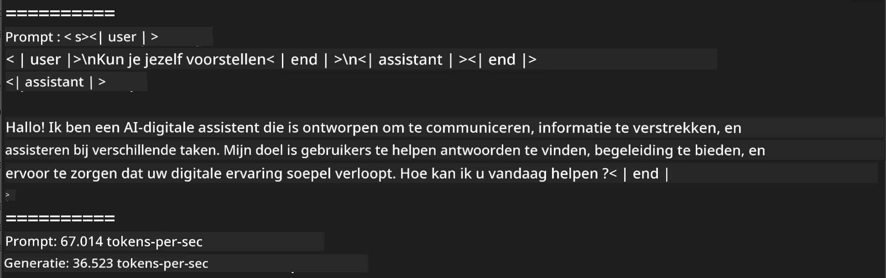
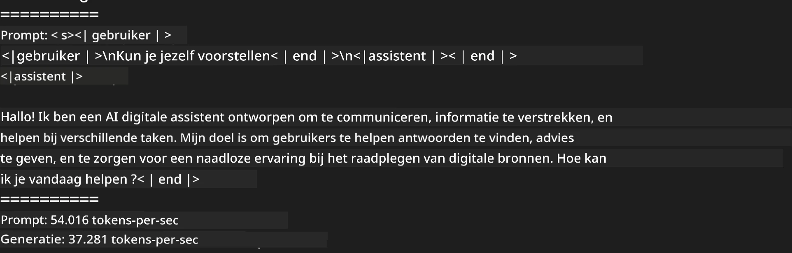
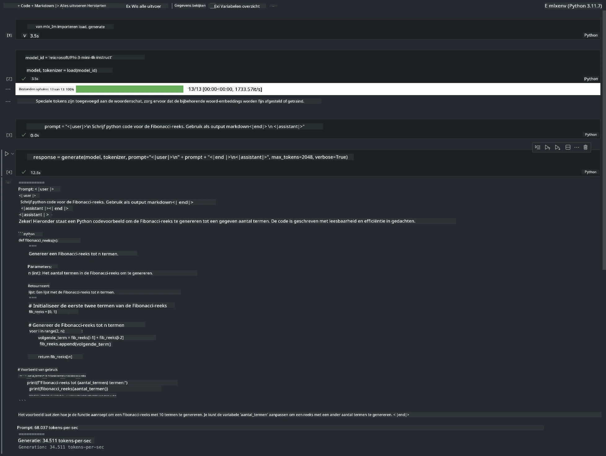

# **Inference Phi-3 met Apple MLX Framework**

## **Wat is het MLX Framework**

MLX is een array-framework voor machine learning onderzoek op Apple silicon, ontwikkeld door Apple machine learning onderzoek.

MLX is ontworpen door machine learning onderzoekers voor machine learning onderzoekers. Het framework is bedoeld om gebruiksvriendelijk te zijn, maar toch efficiënt voor het trainen en inzetten van modellen. Het ontwerp van het framework zelf is ook conceptueel eenvoudig. We willen het onderzoekers gemakkelijk maken om MLX uit te breiden en te verbeteren, met als doel snel nieuwe ideeën te verkennen.

LLM's kunnen worden versneld op Apple Silicon apparaten via MLX, en modellen kunnen heel eenvoudig lokaal worden uitgevoerd.

## **MLX gebruiken om Phi-3-mini te infereren**

### **1. Stel je MLX omgeving in**

1. Python 3.11.x  
2. Installeer de MLX bibliotheek


```bash

pip install mlx-lm

```

### **2. Phi-3-mini draaien in Terminal met MLX**


```bash

python -m mlx_lm.generate --model microsoft/Phi-3-mini-4k-instruct --max-token 2048 --prompt  "<|user|>\nCan you introduce yourself<|end|>\n<|assistant|>"

```

Het resultaat (mijn omgeving is Apple M1 Max, 64GB) is



### **3. Phi-3-mini quantiseren met MLX in Terminal**


```bash

python -m mlx_lm.convert --hf-path microsoft/Phi-3-mini-4k-instruct

```

***Note:*** Het model kan worden gequantiseerd via mlx_lm.convert, en de standaard quantisatie is INT4. Dit voorbeeld quantiseert Phi-3-mini naar INT4.

Het model kan worden gequantiseerd via mlx_lm.convert, en de standaard quantisatie is INT4. Dit voorbeeld laat zien hoe Phi-3-mini naar INT4 wordt gequantiseerd. Na quantisatie wordt het opgeslagen in de standaardmap ./mlx_model

We kunnen het met MLX gequantiseerde model testen vanuit de terminal


```bash

python -m mlx_lm.generate --model ./mlx_model/ --max-token 2048 --prompt  "<|user|>\nCan you introduce yourself<|end|>\n<|assistant|>"

```

Het resultaat is




### **4. Phi-3-mini draaien met MLX in Jupyter Notebook**




***Note:*** Lees dit voorbeeld [klik op deze link](../../../../../code/03.Inference/MLX/MLX_DEMO.ipynb)


## **Bronnen**

1. Leer meer over Apple MLX Framework [https://ml-explore.github.io](https://ml-explore.github.io/mlx/build/html/index.html)

2. Apple MLX GitHub Repo [https://github.com/ml-explore](https://github.com/ml-explore)

**Disclaimer**:  
Dit document is vertaald met behulp van de AI-vertalingsdienst [Co-op Translator](https://github.com/Azure/co-op-translator). Hoewel we streven naar nauwkeurigheid, dient u er rekening mee te houden dat geautomatiseerde vertalingen fouten of onnauwkeurigheden kunnen bevatten. Het originele document in de oorspronkelijke taal moet als de gezaghebbende bron worden beschouwd. Voor cruciale informatie wordt professionele menselijke vertaling aanbevolen. Wij zijn niet aansprakelijk voor eventuele misverstanden of verkeerde interpretaties die voortvloeien uit het gebruik van deze vertaling.