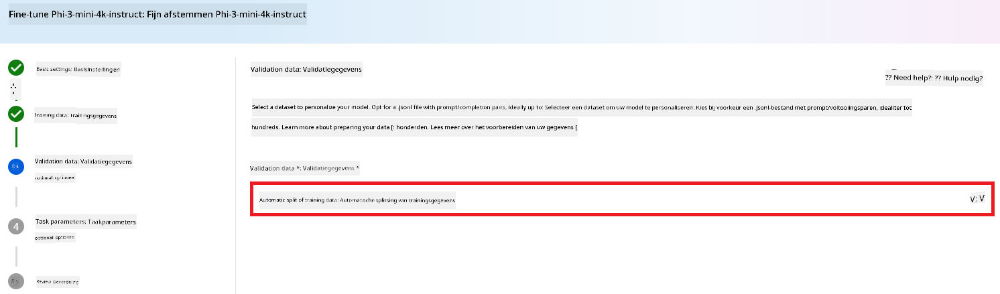

<!--
CO_OP_TRANSLATOR_METADATA:
{
  "original_hash": "c1559c5af6caccf6f623fd43a6b3a9a3",
  "translation_date": "2025-07-17T06:08:21+00:00",
  "source_file": "md/03.FineTuning/FineTuning_AIFoundry.md",
  "language_code": "nl"
}
-->
# Fine-tunen van Phi-3 met Azure AI Foundry

Laten we ontdekken hoe je het taalmodel Phi-3 Mini van Microsoft kunt fine-tunen met Azure AI Foundry. Fine-tunen stelt je in staat om Phi-3 Mini aan te passen aan specifieke taken, waardoor het model krachtiger en beter afgestemd op de context wordt.

## Overwegingen

- **Mogelijkheden:** Welke modellen zijn fine-tunebaar? Wat kan het basismodel leren na fine-tuning?
- **Kosten:** Wat is het prijsmodel voor fine-tuning?
- **Aanpasbaarheid:** Hoeveel kan ik het basismodel aanpassen – en op welke manieren?
- **Gebruiksgemak:** Hoe verloopt het fine-tunen precies – moet ik zelf code schrijven? Moet ik eigen rekenkracht meenemen?
- **Veiligheid:** Fine-tuned modellen kunnen veiligheidsrisico’s met zich meebrengen – zijn er beschermingsmaatregelen om onbedoelde schade te voorkomen?


## Voorbereiding voor fine-tuning

### Vereisten

> [!NOTE]
> Voor Phi-3 familie modellen is het pay-as-you-go fine-tune aanbod alleen beschikbaar voor hubs die zijn aangemaakt in de regio **East US 2**.

- Een Azure-abonnement. Als je nog geen Azure-abonnement hebt, maak dan een [betaald Azure-account](https://azure.microsoft.com/pricing/purchase-options/pay-as-you-go) aan om te beginnen.

- Een [AI Foundry-project](https://ai.azure.com?WT.mc_id=aiml-138114-kinfeylo).
- Azure role-based access controls (Azure RBAC) worden gebruikt om toegang te verlenen tot operaties in Azure AI Foundry. Om de stappen in dit artikel uit te voeren, moet je gebruikersaccount de __Azure AI Developer rol__ toegewezen hebben op de resourcegroep.

### Registratie van de subscription provider

Controleer of de subscription geregistreerd is bij de `Microsoft.Network` resource provider.

1. Meld je aan bij de [Azure portal](https://portal.azure.com).
1. Selecteer **Subscriptions** in het linkermenu.
1. Kies de subscription die je wilt gebruiken.
1. Selecteer **AI project settings** > **Resource providers** in het linkermenu.
1. Controleer of **Microsoft.Network** in de lijst van resource providers staat. Zo niet, voeg deze dan toe.

### Data voorbereiding

Bereid je trainings- en validatiegegevens voor om je model te fine-tunen. Je trainings- en validatiesets bestaan uit input- en outputvoorbeelden die aangeven hoe je wilt dat het model presteert.

Zorg dat al je trainingsvoorbeelden het verwachte formaat voor inferentie volgen. Om modellen effectief te fine-tunen, is het belangrijk om een gebalanceerde en diverse dataset te gebruiken.

Dit betekent dat je de data in balans houdt, verschillende scenario’s opneemt en de trainingsdata periodiek verfijnt om aan te sluiten bij de verwachtingen uit de praktijk, wat uiteindelijk leidt tot nauwkeurigere en evenwichtigere modelantwoorden.

Verschillende modeltypes vereisen een verschillend formaat van trainingsdata.

### Chat Completion

De trainings- en validatiegegevens die je gebruikt **moeten** geformatteerd zijn als een JSON Lines (JSONL) document. Voor `Phi-3-mini-128k-instruct` moet de fine-tuning dataset het conversatieformaat volgen dat gebruikt wordt door de Chat completions API.

### Voorbeeld bestandsformaat

```json
    {"messages": [{"role": "system", "content": "You are an Xbox customer support agent whose primary goal is to help users with issues they are experiencing with their Xbox devices. You are friendly and concise. You only provide factual answers to queries, and do not provide answers that are not related to Xbox."}, {"role": "user", "content": "Is Xbox better than PlayStation?"}, {"role": "assistant", "content": "I apologize, but I cannot provide personal opinions. My primary job is to assist you with any issues related to your Xbox device. Do you have any Xbox-related issues that need addressing?"}]}
    {"messages": [{"role": "system", "content": "You are an Xbox customer support agent whose primary goal is to help users with issues they are experiencing with their Xbox devices. You are friendly and concise. You only provide factual answers to queries, and do not provide answers that are not related to Xbox."}, {"role": "user", "content": "Can I play PC games on my Xbox?"}, {"role": "assistant", "content": "While Xbox consoles don't natively support PC games, they can play an array of Xbox games, many of which are also available on PC. Can I assist you with finding games compatible with your Xbox device?"}]}
    {"messages": [{"role": "system", "content": "You are an Xbox customer support agent whose primary goal is to help users with issues they are experiencing with their Xbox devices. You are friendly and concise. You only provide factual answers to queries, and do not provide answers that are not related to Xbox."}, {"role": "user", "content": "I'm having trouble connecting my Xbox to the Wi-Fi."}, {"role": "assistant", "content": "No worries, let's go through the network settings on your Xbox. Can you please tell me what happens when you try to connect it to the Wi-Fi?"}]}
```

Het ondersteunde bestandstype is JSON Lines. Bestanden worden geüpload naar de standaard datastore en beschikbaar gemaakt in je project.

## Fine-tunen van Phi-3 met Azure AI Foundry

Azure AI Foundry stelt je in staat om grote taalmodellen aan te passen aan je eigen datasets via een proces dat fine-tuning heet. Fine-tuning biedt veel waarde doordat het maatwerk en optimalisatie voor specifieke taken en toepassingen mogelijk maakt. Dit leidt tot betere prestaties, kostenbesparing, minder vertraging en op maat gemaakte output.


### Maak een nieuw project aan

1. Meld je aan bij [Azure AI Foundry](https://ai.azure.com).

1. Selecteer **+New project** om een nieuw project aan te maken in Azure AI Foundry.

    

1. Voer de volgende taken uit:

    - Project **Hub name**. Dit moet een unieke naam zijn.
    - Selecteer de **Hub** die je wilt gebruiken (maak er een nieuwe aan indien nodig).

    

1. Voer de volgende taken uit om een nieuwe hub aan te maken:

    - Voer een **Hub name** in. Dit moet een unieke naam zijn.
    - Selecteer je Azure **Subscription**.
    - Selecteer de **Resource group** die je wilt gebruiken (maak er een nieuwe aan indien nodig).
    - Selecteer de **Location** die je wilt gebruiken.
    - Selecteer de **Connect Azure AI Services** die je wilt gebruiken (maak er een nieuwe aan indien nodig).
    - Selecteer **Connect Azure AI Search** en kies **Skip connecting**.

    

1. Selecteer **Next**.
1. Selecteer **Create a project**.

### Data voorbereiding

Verzamel of maak een dataset die relevant is voor je taak, zoals chatinstructies, vraag-en-antwoordparen of andere relevante tekstdata. Maak deze data schoon en verwerk deze voor door ruis te verwijderen, ontbrekende waarden te behandelen en de tekst te tokenizen.

### Fine-tune Phi-3 modellen in Azure AI Foundry

> [!NOTE]
> Fine-tuning van Phi-3 modellen wordt momenteel ondersteund in projecten die zich bevinden in East US 2.

1. Selecteer **Model catalog** in het tabblad aan de linkerkant.

1. Typ *phi-3* in de **zoekbalk** en selecteer het phi-3 model dat je wilt gebruiken.

    

1. Selecteer **Fine-tune**.

    

1. Voer de **Fine-tuned model name** in.

    

1. Selecteer **Next**.

1. Voer de volgende taken uit:

    - Selecteer het **task type** als **Chat completion**.
    - Selecteer de **Training data** die je wilt gebruiken. Je kunt deze uploaden via Azure AI Foundry’s data of vanaf je lokale omgeving.

    

1. Selecteer **Next**.

1. Upload de **Validation data** die je wilt gebruiken, of kies voor **Automatic split of training data**.

    

1. Selecteer **Next**.

1. Voer de volgende taken uit:

    - Selecteer de gewenste **Batch size multiplier**.
    - Selecteer de gewenste **Learning rate**.
    - Selecteer het aantal **Epochs** dat je wilt gebruiken.

    

1. Selecteer **Submit** om het fine-tuning proces te starten.

    

1. Zodra je model is gefinetuned, wordt de status weergegeven als **Completed**, zoals in de afbeelding hieronder. Nu kun je het model implementeren en gebruiken in je eigen applicatie, in de playground of in prompt flow. Voor meer informatie, zie [Hoe Phi-3 familie van kleine taalmodellen te implementeren met Azure AI Foundry](https://learn.microsoft.com/azure/ai-studio/how-to/deploy-models-phi-3?tabs=phi-3-5&pivots=programming-language-python).

    

> [!NOTE]
> Voor meer gedetailleerde informatie over fine-tuning van Phi-3, bezoek [Fine-tune Phi-3 models in Azure AI Foundry](https://learn.microsoft.com/azure/ai-studio/how-to/fine-tune-phi-3?tabs=phi-3-mini).

## Opruimen van je fine-tuned modellen

Je kunt een fine-tuned model verwijderen uit de lijst met fine-tuning modellen in [Azure AI Foundry](https://ai.azure.com) of vanaf de model detailpagina. Selecteer het fine-tuned model dat je wilt verwijderen op de Fine-tuning pagina en klik vervolgens op de Delete-knop om het model te verwijderen.

> [!NOTE]
> Je kunt een custom model niet verwijderen als er een bestaande deployment is. Je moet eerst de modeldeployment verwijderen voordat je het custom model kunt verwijderen.

## Kosten en quota

### Kosten- en quotumoverwegingen voor Phi-3 modellen die als service zijn gefinetuned

Phi-modellen die als service zijn gefinetuned worden aangeboden door Microsoft en geïntegreerd met Azure AI Foundry voor gebruik. Je kunt de prijzen vinden tijdens het [implementeren](https://learn.microsoft.com/azure/ai-studio/how-to/deploy-models-phi-3?tabs=phi-3-5&pivots=programming-language-python) of fine-tunen van de modellen onder het tabblad Prijzen en voorwaarden in de deployment wizard.

## Content filtering

Modellen die als service met pay-as-you-go worden ingezet, worden beschermd door Azure AI Content Safety. Wanneer ze worden ingezet op real-time endpoints, kun je ervoor kiezen om deze functionaliteit uit te schakelen. Met Azure AI Content Safety ingeschakeld, worden zowel de prompt als de output door een ensemble van classificatiemodellen geleid die gericht zijn op het detecteren en voorkomen van schadelijke inhoud. Het contentfilteringssysteem detecteert en onderneemt actie tegen specifieke categorieën van potentieel schadelijke inhoud in zowel input prompts als output responses. Lees meer over [Azure AI Content Safety](https://learn.microsoft.com/azure/ai-studio/concepts/content-filtering).

**Fine-Tuning Configuratie**

Hyperparameters: Definieer hyperparameters zoals learning rate, batch size en aantal trainings-epochs.

**Lossfunctie**

Kies een geschikte lossfunctie voor je taak (bijv. cross-entropy).

**Optimizer**

Selecteer een optimizer (bijv. Adam) voor het bijwerken van de gradiënten tijdens training.

**Fine-Tuning Proces**

- Laad het voorgetrainde model: Laad de Phi-3 Mini checkpoint.
- Voeg aangepaste lagen toe: Voeg taak-specifieke lagen toe (bijv. classificatiekop voor chatinstructies).

**Train het model**  
Fine-tune het model met je voorbereide dataset. Houd de voortgang in de gaten en pas hyperparameters aan indien nodig.

**Evaluatie en validatie**

Validatieset: Verdeel je data in trainings- en validatiesets.

**Prestaties evalueren**

Gebruik metrics zoals nauwkeurigheid, F1-score of perplexity om de prestaties van het model te beoordelen.

## Sla het fine-tuned model op

**Checkpoint**  
Sla de checkpoint van het fine-tuned model op voor toekomstig gebruik.

## Implementatie

- Implementeer als webservice: Zet je fine-tuned model in als webservice in Azure AI Foundry.
- Test het endpoint: Verstuur testvragen naar het geïmplementeerde endpoint om de functionaliteit te controleren.

## Itereren en verbeteren

Itereer: Als de prestaties niet bevredigend zijn, pas dan hyperparameters aan, voeg meer data toe of fine-tune voor extra epochs.

## Monitoren en verfijnen

Blijf het gedrag van het model monitoren en verfijn waar nodig.

## Aanpassen en uitbreiden

Aangepaste taken: Phi-3 Mini kan voor verschillende taken worden gefinetuned, niet alleen voor chatinstructies. Ontdek andere toepassingen!  
Experimenteer: Probeer verschillende architecturen, laagcombinaties en technieken om de prestaties te verbeteren.

> [!NOTE]
> Fine-tuning is een iteratief proces. Experimenteer, leer en pas je model aan om de beste resultaten voor jouw specifieke taak te behalen!

**Disclaimer**:  
Dit document is vertaald met behulp van de AI-vertalingsdienst [Co-op Translator](https://github.com/Azure/co-op-translator). Hoewel we streven naar nauwkeurigheid, dient u er rekening mee te houden dat geautomatiseerde vertalingen fouten of onnauwkeurigheden kunnen bevatten. Het originele document in de oorspronkelijke taal moet als de gezaghebbende bron worden beschouwd. Voor cruciale informatie wordt professionele menselijke vertaling aanbevolen. Wij zijn niet aansprakelijk voor eventuele misverstanden of verkeerde interpretaties die voortvloeien uit het gebruik van deze vertaling.