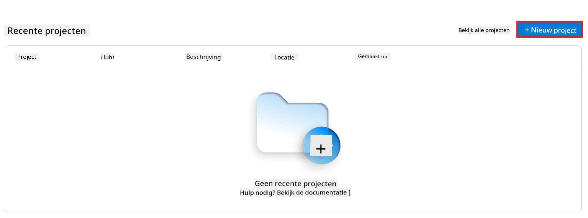

<!--
CO_OP_TRANSLATOR_METADATA:
{
  "original_hash": "c1559c5af6caccf6f623fd43a6b3a9a3",
  "translation_date": "2025-05-09T20:33:27+00:00",
  "source_file": "md/03.FineTuning/FineTuning_AIFoundry.md",
  "language_code": "nl"
}
-->
# Fine-tunen van Phi-3 met Azure AI Foundry

Laten we bekijken hoe je het taalmodel Phi-3 Mini van Microsoft kunt fine-tunen met Azure AI Foundry. Fine-tunen stelt je in staat Phi-3 Mini aan te passen aan specifieke taken, waardoor het nog krachtiger en contextbewuster wordt.

## Overwegingen

- **Mogelijkheden:** Welke modellen zijn fine-tunebaar? Wat kan het basismodel leren na fine-tuning?
- **Kosten:** Wat is het prijsmodel voor fine-tuning?
- **Aanpasbaarheid:** Hoeveel kan ik het basismodel aanpassen – en op welke manieren?
- **Gebruiksgemak:** Hoe vindt fine-tuning eigenlijk plaats – moet ik zelf code schrijven? Moet ik eigen rekenkracht meenemen?
- **Veiligheid:** Fine-tuned modellen kunnen veiligheidsrisico’s hebben – zijn er waarborgen om onbedoelde schade te voorkomen?


## Voorbereiding voor fine-tuning

### Vereisten

> [!NOTE]
> Voor Phi-3 familie modellen is het pay-as-you-go fine-tune aanbod alleen beschikbaar voor hubs die zijn aangemaakt in de regio **East US 2**.

- Een Azure-abonnement. Als je nog geen Azure-abonnement hebt, maak dan een [betaald Azure-account](https://azure.microsoft.com/pricing/purchase-options/pay-as-you-go) aan om te beginnen.
- Een [AI Foundry project](https://ai.azure.com?WT.mc_id=aiml-138114-kinfeylo).
- Azure rolgebaseerde toegangscontroles (Azure RBAC) worden gebruikt om toegang te verlenen tot bewerkingen in Azure AI Foundry. Om de stappen in dit artikel uit te voeren, moet je gebruikersaccount de __Azure AI Developer rol__ hebben op de resourcegroep.

### Registratie van de subscription provider

Controleer of de subscription is geregistreerd bij de `Microsoft.Network` resource provider.

1. Meld je aan bij het [Azure-portaal](https://portal.azure.com).
2. Selecteer **Subscriptions** in het linkermenu.
3. Kies de subscription die je wilt gebruiken.
4. Selecteer **AI project settings** > **Resource providers** in het linkermenu.
5. Controleer of **Microsoft.Network** in de lijst met resource providers staat. Zo niet, voeg deze dan toe.

### Data voorbereiding

Bereid je trainings- en validatiegegevens voor om je model te fine-tunen. Je trainings- en validatiesets bestaan uit input- en outputvoorbeelden van hoe je wilt dat het model presteert.

Zorg dat al je trainingsvoorbeelden voldoen aan het verwachte formaat voor inferentie. Om modellen effectief te fine-tunen, is het belangrijk een gebalanceerde en diverse dataset te gebruiken.

Dit betekent dat je data in balans houdt, verschillende scenario’s opneemt en je trainingsdata regelmatig verfijnt om aan te sluiten bij realistische verwachtingen, wat leidt tot nauwkeurigere en evenwichtigere modelantwoorden.

Verschillende modeltypen vereisen een verschillend formaat voor trainingsdata.

### Chat Completion

De trainings- en validatiegegevens die je gebruikt, **moeten** worden geformatteerd als een JSON Lines (JSONL) document. Voor `Phi-3-mini-128k-instruct` moet de fine-tuning dataset in het conversatieformaat zijn, zoals gebruikt door de Chat completions API.

### Voorbeeld bestandsformaat

```json
    {"messages": [{"role": "system", "content": "You are an Xbox customer support agent whose primary goal is to help users with issues they are experiencing with their Xbox devices. You are friendly and concise. You only provide factual answers to queries, and do not provide answers that are not related to Xbox."}, {"role": "user", "content": "Is Xbox better than PlayStation?"}, {"role": "assistant", "content": "I apologize, but I cannot provide personal opinions. My primary job is to assist you with any issues related to your Xbox device. Do you have any Xbox-related issues that need addressing?"}]}
    {"messages": [{"role": "system", "content": "You are an Xbox customer support agent whose primary goal is to help users with issues they are experiencing with their Xbox devices. You are friendly and concise. You only provide factual answers to queries, and do not provide answers that are not related to Xbox."}, {"role": "user", "content": "Can I play PC games on my Xbox?"}, {"role": "assistant", "content": "While Xbox consoles don't natively support PC games, they can play an array of Xbox games, many of which are also available on PC. Can I assist you with finding games compatible with your Xbox device?"}]}
    {"messages": [{"role": "system", "content": "You are an Xbox customer support agent whose primary goal is to help users with issues they are experiencing with their Xbox devices. You are friendly and concise. You only provide factual answers to queries, and do not provide answers that are not related to Xbox."}, {"role": "user", "content": "I'm having trouble connecting my Xbox to the Wi-Fi."}, {"role": "assistant", "content": "No worries, let's go through the network settings on your Xbox. Can you please tell me what happens when you try to connect it to the Wi-Fi?"}]}
```

Het ondersteunde bestandstype is JSON Lines. Bestanden worden geüpload naar de standaard datastore en beschikbaar gemaakt in je project.

## Fine-tunen van Phi-3 met Azure AI Foundry

Azure AI Foundry stelt je in staat grote taalmodellen aan te passen aan je eigen datasets via fine-tuning. Fine-tuning levert veel waarde doordat je het model kunt personaliseren en optimaliseren voor specifieke taken en toepassingen. Dit resulteert in betere prestaties, kostenbesparing, minder vertraging en op maat gemaakte output.


### Maak een nieuw project aan

1. Meld je aan bij [Azure AI Foundry](https://ai.azure.com).

2. Selecteer **+New project** om een nieuw project aan te maken in Azure AI Foundry.

    

3. Voer de volgende stappen uit:

    - Project **Hub name**. Dit moet een unieke naam zijn.
    - Selecteer de **Hub** die je wilt gebruiken (maak een nieuwe aan indien nodig).

    

4. Voer de volgende stappen uit om een nieuwe hub te maken:

    - Voer een **Hub name** in. Dit moet uniek zijn.
    - Selecteer je Azure **Subscription**.
    - Selecteer de **Resource group** die je wilt gebruiken (maak een nieuwe aan indien nodig).
    - Selecteer de **Location** waar je de hub wilt plaatsen.
    - Selecteer de **Connect Azure AI Services** die je wilt gebruiken (maak een nieuwe aan indien nodig).
    - Selecteer **Connect Azure AI Search** en kies voor **Skip connecting**.

    

5. Selecteer **Next**.
6. Selecteer **Create a project**.

### Data voorbereiding

Verzamel of maak een dataset die relevant is voor je taak, zoals chatinstructies, vraag-en-antwoord paren of andere relevante tekstdata. Maak de data schoon en verwerk deze voor door ruis te verwijderen, ontbrekende waarden aan te pakken en de tekst te tokenizen.

### Fine-tune Phi-3 modellen in Azure AI Foundry

> [!NOTE]
> Fine-tuning van Phi-3 modellen wordt momenteel ondersteund in projecten die zich bevinden in East US 2.

1. Selecteer **Model catalog** in het linker tabblad.

2. Typ *phi-3* in de **zoekbalk** en selecteer het phi-3 model dat je wilt gebruiken.

    

3. Selecteer **Fine-tune**.

    

4. Voer de **Fine-tuned model name** in.

    

5. Selecteer **Next**.

6. Voer de volgende taken uit:

    - Selecteer **task type** als **Chat completion**.
    - Selecteer de **Training data** die je wilt gebruiken. Je kunt deze uploaden via Azure AI Foundry of vanuit je lokale omgeving.

    

7. Selecteer **Next**.

8. Upload de **Validation data** die je wilt gebruiken, of kies voor **Automatic split of training data**.

    

9. Selecteer **Next**.

10. Voer de volgende taken uit:

    - Selecteer de **Batch size multiplier** die je wilt gebruiken.
    - Selecteer de **Learning rate** die je wilt gebruiken.
    - Selecteer het aantal **Epochs** dat je wilt gebruiken.

    

11. Selecteer **Submit** om het fine-tuning proces te starten.

    

12. Zodra je model is gefinetuned, wordt de status weergegeven als **Completed**, zoals in de afbeelding hieronder. Je kunt het model nu implementeren en gebruiken in je eigen applicatie, in de playground, of in prompt flow. Voor meer informatie, zie [Hoe je Phi-3 familie kleine taalmodellen implementeert met Azure AI Foundry](https://learn.microsoft.com/azure/ai-studio/how-to/deploy-models-phi-3?tabs=phi-3-5&pivots=programming-language-python).

    

> [!NOTE]
> Voor meer gedetailleerde informatie over fine-tuning van Phi-3, bezoek [Fine-tune Phi-3 modellen in Azure AI Foundry](https://learn.microsoft.com/azure/ai-studio/how-to/fine-tune-phi-3?tabs=phi-3-mini).

## Opruimen van je fine-tuned modellen

Je kunt een fine-tuned model verwijderen uit de lijst met fine-tuning modellen in [Azure AI Foundry](https://ai.azure.com) of vanaf de model detailpagina. Selecteer het fine-tuned model dat je wilt verwijderen op de Fine-tuning pagina en klik vervolgens op de Delete knop om het model te verwijderen.

> [!NOTE]
> Je kunt een aangepast model niet verwijderen als er een bestaande deployment actief is. Je moet eerst de modeldeployment verwijderen voordat je het aangepaste model kunt verwijderen.

## Kosten en quota

### Kosten- en quota-overwegingen voor Phi-3 modellen die als service zijn gefinetuned

Phi modellen die als service zijn gefinetuned worden door Microsoft aangeboden en geïntegreerd met Azure AI Foundry. Je vindt de prijzen bij het [implementeren](https://learn.microsoft.com/azure/ai-studio/how-to/deploy-models-phi-3?tabs=phi-3-5&pivots=programming-language-python) of fine-tunen van de modellen onder het tabblad Prijzen en voorwaarden in de implementatiewizard.

## Content filtering

Modellen die als pay-as-you-go service worden ingezet, zijn beschermd door Azure AI Content Safety. Bij realtime endpoints kun je ervoor kiezen deze bescherming uit te schakelen. Met Azure AI Content Safety ingeschakeld, worden zowel de prompt als de output gecontroleerd door een verzameling classificatiemodellen die schadelijke inhoud detecteren en voorkomen. Het content filtering systeem detecteert en grijpt in bij specifieke categorieën potentieel schadelijke inhoud in zowel input prompts als output. Meer informatie over [Azure AI Content Safety](https://learn.microsoft.com/azure/ai-studio/concepts/content-filtering).

**Fine-Tuning Configuratie**

Hyperparameters: Definieer hyperparameters zoals learning rate, batch size en aantal trainings-epochs.

**Loss Function**

Kies een passende loss functie voor je taak (bijv. cross-entropy).

**Optimizer**

Selecteer een optimizer (bijv. Adam) voor de gradient updates tijdens training.

**Fine-Tuning Proces**

- Laad het voorgetrainde model: Laad de Phi-3 Mini checkpoint.
- Voeg aangepaste lagen toe: Voeg taak-specifieke lagen toe (bijv. classificatiekop voor chatinstructies).

**Train het model**  
Fine-tune het model met je voorbereide dataset. Houd de voortgang in de gaten en pas hyperparameters aan indien nodig.

**Evaluatie en validatie**

Validatieset: Verdeel je data in trainings- en validatiesets.

**Prestaties evalueren**

Gebruik metrics zoals nauwkeurigheid, F1-score of perplexity om de prestaties te beoordelen.

## Opslaan van het fine-tuned model

**Checkpoint**  
Sla de fine-tuned model checkpoint op voor toekomstig gebruik.

## Implementatie

- Implementeer als Web Service: Zet je fine-tuned model in als webservice in Azure AI Foundry.
- Test de Endpoint: Verstuur testvragen naar de geïmplementeerde endpoint om de functionaliteit te verifiëren.

## Itereren en verbeteren

Itereer: Als de prestaties niet bevredigend zijn, pas dan hyperparameters aan, voeg meer data toe of fine-tune voor extra epochs.

## Monitoren en verfijnen

Blijf het gedrag van het model monitoren en verfijn waar nodig.

## Aanpassen en uitbreiden

Aangepaste taken: Phi-3 Mini kan voor verschillende taken worden fine-tuned, niet alleen voor chatinstructies. Ontdek andere toepassingen!  
Experimenteer: Probeer verschillende architecturen, laagcombinaties en technieken om de prestaties te verbeteren.

> [!NOTE]  
> Fine-tuning is een iteratief proces. Experimenteer, leer en pas je model aan om de beste resultaten voor jouw specifieke taak te behalen!

**Disclaimer**:  
Dit document is vertaald met behulp van de AI-vertalingsdienst [Co-op Translator](https://github.com/Azure/co-op-translator). Hoewel we streven naar nauwkeurigheid, dient u er rekening mee te houden dat geautomatiseerde vertalingen fouten of onnauwkeurigheden kunnen bevatten. Het originele document in de oorspronkelijke taal geldt als de gezaghebbende bron. Voor cruciale informatie wordt professionele menselijke vertaling aanbevolen. Wij zijn niet aansprakelijk voor eventuele misverstanden of verkeerde interpretaties die voortvloeien uit het gebruik van deze vertaling.