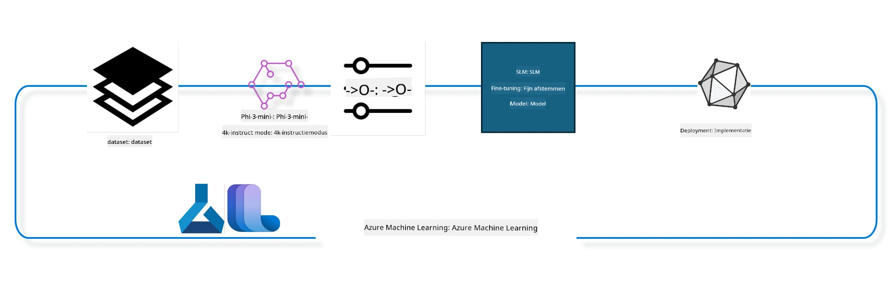

## Hoe chat-completion componenten uit de Azure ML system registry te gebruiken om een model fijn af te stemmen

In dit voorbeeld zullen we het model Phi-3-mini-4k-instruct fijn afstemmen om een gesprek tussen 2 personen te voltooien met behulp van de ultrachat_200k dataset.



Het voorbeeld laat zien hoe je fijn afstemmen kunt uitvoeren met de Azure ML SDK en Python en vervolgens het fijn afgestemde model kunt implementeren naar een online endpoint voor realtime inferentie.

### Trainingsgegevens

We zullen de ultrachat_200k dataset gebruiken. Dit is een sterk gefilterde versie van de UltraChat dataset en werd gebruikt om Zephyr-7B-β te trainen, een state-of-the-art 7b chatmodel.

### Model

We gebruiken het Phi-3-mini-4k-instruct model om te laten zien hoe gebruikers een model kunnen fijn afstemmen voor een chat-completion taak. Als je deze notebook vanuit een specifieke modelkaart hebt geopend, vervang dan de specifieke modelnaam.

### Taken

- Kies een model om fijn af te stemmen.
- Kies en verken trainingsgegevens.
- Configureer de fijn afstemmingsjob.
- Voer de fijn afstemmingsjob uit.
- Beoordeel trainings- en evaluatiemetrieken.
- Registreer het fijn afgestemde model.
- Implementeer het fijn afgestemde model voor realtime inferentie.
- Ruim resources op.

## 1. Voorwaarden instellen

- Installeer afhankelijkheden
- Verbind met AzureML Workspace. Meer informatie over het instellen van SDK-authenticatie. Vervang hieronder <WORKSPACE_NAME>, <RESOURCE_GROUP> en <SUBSCRIPTION_ID>.
- Verbind met azureml system registry
- Stel een optionele experimentnaam in
- Controleer of maak compute aan.

> [!NOTE]
> Vereist is een enkele GPU-node die meerdere GPU-kaarten kan hebben. Bijvoorbeeld, in één node van Standard_NC24rs_v3 zitten 4 NVIDIA V100 GPU's terwijl Standard_NC12s_v3 2 NVIDIA V100 GPU's heeft. Raadpleeg de documentatie voor deze informatie. Het aantal GPU-kaarten per node wordt ingesteld in de parameter gpus_per_node hieronder. Dit correct instellen zorgt voor optimaal gebruik van alle GPU's in de node. De aanbevolen GPU compute SKU's zijn hier en hier te vinden.

### Python Bibliotheken

Installeer afhankelijkheden door onderstaande cel uit te voeren. Dit is geen optionele stap als je in een nieuwe omgeving werkt.

```bash
pip install azure-ai-ml
pip install azure-identity
pip install datasets==2.9.0
pip install mlflow
pip install azureml-mlflow
```

### Interactie met Azure ML

1. Dit Python-script wordt gebruikt om te communiceren met de Azure Machine Learning (Azure ML) service. Hieronder wat het doet:

    - Het importeert benodigde modules uit azure.ai.ml, azure.identity en azure.ai.ml.entities pakketten. Ook wordt de time module geïmporteerd.

    - Het probeert authenticatie via DefaultAzureCredential(), wat een vereenvoudigde authenticatie-ervaring biedt om snel applicaties te ontwikkelen die in de Azure cloud draaien. Als dit mislukt, valt het terug op InteractiveBrowserCredential(), wat een interactieve login prompt biedt.

    - Vervolgens probeert het een MLClient instantie aan te maken via de from_config methode, die de configuratie leest uit het standaard configbestand (config.json). Als dit mislukt, wordt MLClient handmatig aangemaakt met opgegeven subscription_id, resource_group_name en workspace_name.

    - Er wordt een andere MLClient instantie aangemaakt, ditmaal voor de Azure ML registry genaamd "azureml". Deze registry is waar modellen, fijn afstemmingspijplijnen en omgevingen worden opgeslagen.

    - De experimentnaam wordt ingesteld op "chat_completion_Phi-3-mini-4k-instruct".

    - Er wordt een unieke timestamp gegenereerd door de huidige tijd (in seconden sinds epoch, als float) naar een integer en vervolgens naar een string te converteren. Deze timestamp kan worden gebruikt voor unieke namen en versies.

    ```python
    # Importeer benodigde modules van Azure ML en Azure Identity
    from azure.ai.ml import MLClient
    from azure.identity import (
        DefaultAzureCredential,
        InteractiveBrowserCredential,
    )
    from azure.ai.ml.entities import AmlCompute
    import time  # Importeer tijdmodule
    
    # Probeer te authenticeren met DefaultAzureCredential
    try:
        credential = DefaultAzureCredential()
        credential.get_token("https://management.azure.com/.default")
    except Exception as ex:  # Als DefaultAzureCredential faalt, gebruik InteractiveBrowserCredential
        credential = InteractiveBrowserCredential()
    
    # Probeer een MLClient-instance te maken met behulp van het standaard configuratiebestand
    try:
        workspace_ml_client = MLClient.from_config(credential=credential)
    except:  # Als dat faalt, maak een MLClient-instance door handmatig de gegevens te verstrekken
        workspace_ml_client = MLClient(
            credential,
            subscription_id="<SUBSCRIPTION_ID>",
            resource_group_name="<RESOURCE_GROUP>",
            workspace_name="<WORKSPACE_NAME>",
        )
    
    # Maak een andere MLClient-instance voor de Azure ML-register genaamd "azureml"
    # Deze register is waar modellen, fine-tuning pipelines en omgevingen worden opgeslagen
    registry_ml_client = MLClient(credential, registry_name="azureml")
    
    # Stel de experimenteernaam in
    experiment_name = "chat_completion_Phi-3-mini-4k-instruct"
    
    # Genereer een unieke timestamp die kan worden gebruikt voor namen en versies die uniek moeten zijn
    timestamp = str(int(time.time()))
    ```

## 2. Kies een foundation model om fijn af te stemmen

1. Phi-3-mini-4k-instruct is een 3.8 miljard parameters groot, lichtgewicht, state-of-the-art open model gebaseerd op datasets die worden gebruikt voor Phi-2. Het model behoort tot de Phi-3 model familie, en de Mini-versie komt in twee varianten 4K en 128K wat de contextlengte (in tokens) is die het kan ondersteunen. We moeten het model fijn afstemmen voor ons specifieke doel voordat we het kunnen gebruiken. Je kunt deze modellen bekijken in de Model Catalog in AzureML Studio, filterend op chat-completion taak. In dit voorbeeld gebruiken we het Phi-3-mini-4k-instruct model. Als je deze notebook voor een ander model hebt geopend, vervang dan de naam en versie van het model.

> [!NOTE]
> de model id eigenschap van het model. Dit wordt doorgegeven als input aan de fijn afstemmingsjob. Deze is ook beschikbaar als het Asset ID veld op de model details pagina in AzureML Studio Model Catalog.

2. Dit Python-script communiceert met de Azure Machine Learning (Azure ML) service. Hier is wat het doet:

    - Het stelt model_name in op "Phi-3-mini-4k-instruct".

    - Het gebruikt de get methode van de models eigenschap van het registry_ml_client object om de laatste versie van het model met de opgegeven naam op te halen uit de Azure ML registry. De get methode wordt aangeroepen met twee argumenten: de naam van het model en een label die aangeeft dat de laatste versie van het model moet worden opgehaald.

    - Het print een bericht naar de console die de naam, versie en id van het model weergeeft dat zal worden gebruikt voor fijn afstemming. De format methode van de string wordt gebruikt om deze gegevens in het bericht te verwerken. Naam, versie en id worden als eigenschappen van het foundation_model object benaderd.

    ```python
    # Stel de modelnaam in
    model_name = "Phi-3-mini-4k-instruct"
    
    # Haal de nieuwste versie van het model op uit het Azure ML-register
    foundation_model = registry_ml_client.models.get(model_name, label="latest")
    
    # Print de modelnaam, versie en id
    # Deze informatie is nuttig voor het bijhouden en debuggen
    print(
        "\n\nUsing model name: {0}, version: {1}, id: {2} for fine tuning".format(
            foundation_model.name, foundation_model.version, foundation_model.id
        )
    )
    ```

## 3. Maak een compute aan voor gebruik met de job

De fijn afstemmingsjob werkt ALLEEN met GPU compute. De grootte van de compute hangt af van hoe groot het model is en in de meeste gevallen is het lastig om de juiste compute voor de job te identificeren. In deze cel begeleiden we de gebruiker bij het selecteren van de juiste compute voor de job.

> [!NOTE]
> De hieronder genoemde computes werken met de meest geoptimaliseerde configuratie. Wijzigingen in de configuratie kunnen leiden tot een Cuda Out Of Memory-fout. In zulke gevallen probeer de compute te upgraden naar een grotere compute size.

> [!NOTE]
> Bij het selecteren van compute_cluster_size hieronder, zorg ervoor dat de compute beschikbaar is in jouw resourcegroep. Als een bepaalde compute niet beschikbaar is, kun je een verzoek indienen om toegang te krijgen tot de compute-resources.

### Controleren van het Model op Ondersteuning voor Fijn Afstemmen

1. Dit Python-script communiceert met een Azure Machine Learning (Azure ML) model. Hier is wat het doet:

    - Het importeert de ast module, die functies biedt om bomen van de Python abstracte syntaxisgrammatica te verwerken.

    - Het controleert of het foundation_model object (dat een model in Azure ML representeert) een tag heeft met de naam finetune_compute_allow_list. Tags in Azure ML zijn sleutel-waarde paren die je kunt gebruiken om modellen te filteren en sorteren.

    - Als de finetune_compute_allow_list tag aanwezig is, gebruikt het de ast.literal_eval functie om de waarde van de tag (een string) veilig te parsen naar een Python lijst. Deze lijst wordt vervolgens toegewezen aan de variabele computes_allow_list. Het print vervolgens een bericht dat er een compute uit de lijst gekozen moet worden.

    - Als de tag niet aanwezig is, wordt computes_allow_list op None gezet en wordt een bericht geprint dat de finetune_compute_allow_list tag geen deel uitmaakt van de modeltags.

    - Samenvattend controleert dit script voor een specifieke tag in de metadata van het model, zet de tagwaarde om naar een lijst indien aanwezig, en geeft de gebruiker hierover een melding.

    ```python
    # Importeer de ast-module, die functies levert om bomen van de abstracte syntaxisgrammatica van Python te verwerken
    import ast
    
    # Controleer of de tag 'finetune_compute_allow_list' aanwezig is in de tags van het model
    if "finetune_compute_allow_list" in foundation_model.tags:
        # Als de tag aanwezig is, gebruik dan ast.literal_eval om de waarde van de tag (een string) veilig te parseren naar een Python-lijst
        computes_allow_list = ast.literal_eval(
            foundation_model.tags["finetune_compute_allow_list"]
        )  # converteer string naar Python-lijst
        # Print een bericht dat aangeeft dat een compute gemaakt moet worden van de lijst
        print(f"Please create a compute from the above list - {computes_allow_list}")
    else:
        # Als de tag niet aanwezig is, stel computes_allow_list in op None
        computes_allow_list = None
        # Print een bericht dat aangeeft dat de tag 'finetune_compute_allow_list' geen onderdeel is van de tags van het model
        print("`finetune_compute_allow_list` is not part of model tags")
    ```

### Controleren van Compute Instance

1. Dit Python-script communiceert met Azure Machine Learning (Azure ML) service en voert diverse controles uit op een compute instance. Hier is wat het doet:

    - Het probeert de compute instance met de naam die in compute_cluster is opgeslagen op te halen uit de Azure ML workspace. Als de provisioning state van de compute instance "failed" is, wordt er een ValueError opgegooid.

    - Het controleert of computes_allow_list niet None is. Als dat zo is, worden alle compute groottes in de lijst naar kleine letters omgezet en wordt gecontroleerd of de grootte van de huidige compute instance in die lijst staat. Zo niet, dan wordt een ValueError opgegooid.

    - Als computes_allow_list None is, controleert het of de grootte van de compute instance in een lijst staat van niet-ondersteunde GPU VM groottes. Is dat het geval, dan wordt een ValueError opgegooid.

    - Het haalt een lijst op van alle beschikbare compute groottes in de workspace. Daarna loopt het de lijst door en als de naam overeenkomt met de grootte van de huidige compute instance, wordt het aantal GPU's van die compute grootte opgehaald en wordt gpu_count_found op True gezet.

    - Als gpu_count_found True is, print het het aantal GPU's van de compute instance. Als het False is, wordt er een ValueError opgegooid.

    - Samenvattend voert dit script diverse controles uit op een compute instance binnen een Azure ML workspace, inclusief de provisioning status, de grootte ten opzichte van een whitelist of blacklist, en het aantal GPU's.

    ```python
    # Print het foutbericht
    print(e)
    # Raise een ValueError als de compute grootte niet beschikbaar is in de workspace
    raise ValueError(
        f"WARNING! Compute size {compute_cluster_size} not available in workspace"
    )
    
    # Haal de compute instance op uit de Azure ML workspace
    compute = workspace_ml_client.compute.get(compute_cluster)
    # Controleer of de provisioning status van de compute instance "failed" is
    if compute.provisioning_state.lower() == "failed":
        # Raise een ValueError als de provisioning status "failed" is
        raise ValueError(
            f"Provisioning failed, Compute '{compute_cluster}' is in failed state. "
            f"please try creating a different compute"
        )
    
    # Controleer of computes_allow_list niet None is
    if computes_allow_list is not None:
        # Zet alle compute groottes in computes_allow_list om naar kleine letters
        computes_allow_list_lower_case = [x.lower() for x in computes_allow_list]
        # Controleer of de grootte van de compute instance in computes_allow_list_lower_case zit
        if compute.size.lower() not in computes_allow_list_lower_case:
            # Raise een ValueError als de grootte van de compute instance niet in computes_allow_list_lower_case zit
            raise ValueError(
                f"VM size {compute.size} is not in the allow-listed computes for finetuning"
            )
    else:
        # Definieer een lijst van niet-ondersteunde GPU VM groottes
        unsupported_gpu_vm_list = [
            "standard_nc6",
            "standard_nc12",
            "standard_nc24",
            "standard_nc24r",
        ]
        # Controleer of de grootte van de compute instance in unsupported_gpu_vm_list zit
        if compute.size.lower() in unsupported_gpu_vm_list:
            # Raise een ValueError als de grootte van de compute instance in unsupported_gpu_vm_list zit
            raise ValueError(
                f"VM size {compute.size} is currently not supported for finetuning"
            )
    
    # Initialiseer een vlag om te controleren of het aantal GPU's in de compute instance is gevonden
    gpu_count_found = False
    # Haal een lijst op van alle beschikbare compute groottes in de workspace
    workspace_compute_sku_list = workspace_ml_client.compute.list_sizes()
    available_sku_sizes = []
    # Loop door de lijst met beschikbare compute groottes
    for compute_sku in workspace_compute_sku_list:
        available_sku_sizes.append(compute_sku.name)
        # Controleer of de naam van de compute grootte overeenkomt met de grootte van de compute instance
        if compute_sku.name.lower() == compute.size.lower():
            # Als dit zo is, haal dan het aantal GPU's voor die compute grootte op en zet gpu_count_found op True
            gpus_per_node = compute_sku.gpus
            gpu_count_found = True
    # Als gpu_count_found True is, print het aantal GPU's in de compute instance
    if gpu_count_found:
        print(f"Number of GPU's in compute {compute.size}: {gpus_per_node}")
    else:
        # Als gpu_count_found False is, raise een ValueError
        raise ValueError(
            f"Number of GPU's in compute {compute.size} not found. Available skus are: {available_sku_sizes}."
            f"This should not happen. Please check the selected compute cluster: {compute_cluster} and try again."
        )
    ```

## 4. Kies de dataset voor het fijn afstemmen van het model

1. We gebruiken de ultrachat_200k dataset. Deze dataset heeft vier splits, geschikt voor Supervised fine-tuning (sft).
Generation ranking (gen). Het aantal voorbeelden per split is als volgt weergegeven:

    ```bash
    train_sft test_sft  train_gen  test_gen
    207865  23110  256032  28304
    ```

1. De volgende cellen laten basisgegevensvoorbereiding voor fijn afstemmen zien:

### Visualiseer enkele datarijen

We willen dat dit voorbeeld snel draait, dus sla train_sft, test_sft bestanden op die 5% bevatten van de reeds gesnoeide rijen. Dit betekent dat het fijn afgestemde model minder nauwkeurig zal zijn, dus het moet niet in de praktijk worden gebruikt.
De download-dataset.py wordt gebruikt om de ultrachat_200k dataset te downloaden en om te zetten naar een formaat dat door de fijn afstemmingspijplijn component gebruikt kan worden. Omdat de dataset groot is, hebben we hier slechts een deel van de dataset.

1. Het onderstaande script downloadt slechts 5% van de data. Dit kan worden verhoogd door de parameter dataset_split_pc aan te passen naar het gewenste percentage.

> [!NOTE]
> Sommige taalmodellen hebben verschillende taalcodes en daarom zouden de kolomnamen in de dataset hiermee overeen moeten komen.

1. Hier is een voorbeeld van hoe de data eruit zou moeten zien
De chat-completion dataset wordt opgeslagen in parquet-formaat waarbij elke invoer het volgende schema volgt:

    - Dit is een JSON (JavaScript Object Notation) document, een populair formaat voor gegevensuitwisseling. Het is geen uitvoerbare code, maar een manier om data op te slaan en te vervoeren. Hier is de structuur:

    - "prompt": Deze sleutel bevat een stringwaarde die een taak of vraag aan een AI-assistent weergeeft.

    - "messages": Deze sleutel bevat een array van objecten. Elk object vertegenwoordigt een bericht in een gesprek tussen een gebruiker en een AI-assistent. Elk berichtobject heeft twee sleutels:

    - "content": Deze sleutel bevat de inhoud van het bericht als string.
    - "role": Deze sleutel geeft de rol aan van de entiteit die het bericht verzendt. Dit kan "user" of "assistant" zijn.
    - "prompt_id": Deze sleutel bevat een unieke identifier voor de prompt als string.

1. In dit specifieke JSON-document wordt een gesprek weergegeven waarbij een gebruiker een AI-assistent vraagt een protagonist voor een dystopisch verhaal te creëren. De assistent reageert, vervolgens vraagt de gebruiker om meer details en de assistent stemt ermee in deze te geven. Het gehele gesprek is gekoppeld aan een specifieke prompt id.

    ```python
    {
        // The task or question posed to an AI assistant
        "prompt": "Create a fully-developed protagonist who is challenged to survive within a dystopian society under the rule of a tyrant. ...",
        
        // An array of objects, each representing a message in a conversation between a user and an AI assistant
        "messages":[
            {
                // The content of the user's message
                "content": "Create a fully-developed protagonist who is challenged to survive within a dystopian society under the rule of a tyrant. ...",
                // The role of the entity that sent the message
                "role": "user"
            },
            {
                // The content of the assistant's message
                "content": "Name: Ava\n\n Ava was just 16 years old when the world as she knew it came crashing down. The government had collapsed, leaving behind a chaotic and lawless society. ...",
                // The role of the entity that sent the message
                "role": "assistant"
            },
            {
                // The content of the user's message
                "content": "Wow, Ava's story is so intense and inspiring! Can you provide me with more details.  ...",
                // The role of the entity that sent the message
                "role": "user"
            }, 
            {
                // The content of the assistant's message
                "content": "Certainly! ....",
                // The role of the entity that sent the message
                "role": "assistant"
            }
        ],
        
        // A unique identifier for the prompt
        "prompt_id": "d938b65dfe31f05f80eb8572964c6673eddbd68eff3db6bd234d7f1e3b86c2af"
    }
    ```

### Data Downloaden

1. Dit Python-script downloadt een dataset via een hulpscript genaamd download-dataset.py. Hier is een uitleg van wat het doet:

    - Het importeert het os-module, dat een draagbare manier biedt om besturingssysteemafhankelijke functionaliteit te gebruiken.

    - Het gebruikt os.system om het script download-dataset.py uit te voeren in de shell met opgegeven commandoregelargumenten. Deze argumenten specificeren de dataset die gedownload moet worden (HuggingFaceH4/ultrachat_200k), de map waarin het opgeslagen moet worden (ultrachat_200k_dataset), en het percentage van de dataset om te splitsen (5). os.system retourneert de exitstatus van het commando; deze wordt opgeslagen in exit_status.

    - Het controleert of exit_status niet 0 is. In Unix-achtige systemen betekent een exitstatus van 0 meestal dat een commando geslaagd is, en een andere waarde betekent een fout. Is exit_status niet 0, dan wordt een Exception gegooid met een bericht dat er een fout is opgetreden bij het downloaden van de dataset.

    - Samenvattend voert dit script een commando uit om een dataset te downloaden met een hulpscript en gooit een uitzondering als dat mislukt.

    ```python
    # Importeer de os-module, die een manier biedt om besturingssysteemafhankelijke functionaliteit te gebruiken
    import os
    
    # Gebruik de functie os.system om het script download-dataset.py uit te voeren in de shell met specifieke commandoregelargumenten
    # De argumenten specificeren de dataset om te downloaden (HuggingFaceH4/ultrachat_200k), de map waarin het wordt gedownload (ultrachat_200k_dataset) en het percentage van de dataset om te splitsen (5)
    # De functie os.system geeft de exitstatus terug van het commando dat het uitvoerde; deze status wordt opgeslagen in de variabele exit_status
    exit_status = os.system(
        "python ./download-dataset.py --dataset HuggingFaceH4/ultrachat_200k --download_dir ultrachat_200k_dataset --dataset_split_pc 5"
    )
    
    # Controleer of exit_status niet 0 is
    # In Unix-achtige besturingssystemen duidt een exitstatus van 0 meestal aan dat een commando geslaagd is, terwijl elke andere waarde een fout aangeeft
    # Als exit_status niet 0 is, werp dan een Exception met een bericht dat aangeeft dat er een fout optrad bij het downloaden van de dataset
    if exit_status != 0:
        raise Exception("Error downloading dataset")
    ```

### Data Laden in een DataFrame

1. Dit Python-script laadt een JSON Lines bestand in een pandas DataFrame en toont de eerste 5 rijen. Hier is wat het doet:

    - Het importeert de pandas bibliotheek, een krachtige tool voor data manipulatie en analyse.

    - Het stelt de maximale kolombreedte in voor pandas display optie op 0. Dit betekent dat de volledige tekst van elke kolom wordt weergegeven zonder afgekapt te worden wanneer de DataFrame wordt geprint.
    - Het gebruikt de functie pd.read_json om het bestand train_sft.jsonl uit de map ultrachat_200k_dataset in te laden in een DataFrame. Het argument lines=True geeft aan dat het bestand in JSON Lines-formaat is, waarbij elke regel een apart JSON-object is.

    - Het gebruikt de head-methode om de eerste 5 rijen van het DataFrame weer te geven. Als het DataFrame minder dan 5 rijen bevat, worden ze allemaal weergegeven.

    - Samengevat, deze script laadt een JSON Lines-bestand in een DataFrame en toont de eerste 5 rijen met volledige kolomtekst.
    
    ```python
    # Importeer de pandas-bibliotheek, een krachtige bibliotheek voor gegevensmanipulatie en -analyse
    import pandas as pd
    
    # Stel de maximale kolombreedte voor de weergave-opties van pandas in op 0
    # Dit betekent dat de volledige tekst van elke kolom wordt weergegeven zonder afkapping wanneer de DataFrame wordt afgedrukt
    pd.set_option("display.max_colwidth", 0)
    
    # Gebruik de functie pd.read_json om het bestand train_sft.jsonl uit de map ultrachat_200k_dataset in een DataFrame te laden
    # Het argument lines=True geeft aan dat het bestand in JSON Lines-formaat is, waarbij elke regel een afzonderlijk JSON-object is
    df = pd.read_json("./ultrachat_200k_dataset/train_sft.jsonl", lines=True)
    
    # Gebruik de methode head om de eerste 5 rijen van de DataFrame weer te geven
    # Als de DataFrame minder dan 5 rijen heeft, worden ze allemaal weergegeven
    df.head()
    ```

## 5. Dien de fine tuning-taak in met het model en de data als invoer

Maak de taak aan die de chat-completion pipeline component gebruikt. Lees meer over alle parameters die ondersteund worden voor fine tuning.

### Definieer finetune parameters

1. Finetune parameters kunnen worden gegroepeerd in 2 categorieën - trainingsparameters, optimalisatieparameters

1. Trainingsparameters definiëren de trainingsaspecten zoals:

    - De optimizer, scheduler die gebruikt wordt
    - De metriek die de finetune optimaliseert
    - Aantal trainingsstappen en batchgrootte, enzovoort
    - Optimalisatieparameters helpen bij het optimaliseren van het GPU-geheugen en het effectief gebruiken van de computerbronnen.

1. Hieronder enkele parameters die bij deze categorie horen. De optimalisatieparameters verschillen per model en worden met het model meegeleverd om deze variaties te ondersteunen.

    - Schakel deepspeed en LoRA in
    - Schakel mixed precision training in
    - Schakel multi-node training in

> [!NOTE]
> Gecontroleerde finetuning kan leiden tot verlies van afstemming of catastrofaal vergeten. We raden aan dit probleem te controleren en een afstemmingsfase uit te voeren nadat u hebt gefinetuned.

### Fine Tuning Parameters

1. Dit Python-script stelt parameters in voor het finetunen van een machine learning-model. Hier is een overzicht van wat het doet:

    - Het stelt standaard trainingsparameters in zoals het aantal trainingsepochs, batchgroottes voor training en evaluatie, leerpercentage en type scheduler voor het leerpercentage.

    - Het stelt standaard optimalisatieparameters in zoals of Layer-wise Relevance Propagation (LoRa) en DeepSpeed worden toegepast, en het DeepSpeed-level.

    - Het combineert de trainings- en optimalisatieparameters in één dictionary genaamd finetune_parameters.

    - Het controleert of foundation_model model-specifieke standaardparameters heeft. Als dat zo is, print het een waarschuwingsbericht en werkt het finetune_parameters bij met deze model-specifieke standaarden. De functie ast.literal_eval wordt gebruikt om de model-specifieke standaarden van een string om te zetten naar een Python-dictionary.

    - Het print de uiteindelijke set finetune-parameters die voor de run gebruikt zullen worden.

    - Samengevat stelt dit script parameters in voor het finetunen van een machine learning-model en toont deze, met de mogelijkheid om de standaardparameters te overschrijven met model-specifieke.

    ```python
    # Stel standaard trainingsparameters in zoals het aantal trainingsepochs, batchgroottes voor training en evaluatie, leersnelheid en type leersnelheidsscheduler
    training_parameters = dict(
        num_train_epochs=3,
        per_device_train_batch_size=1,
        per_device_eval_batch_size=1,
        learning_rate=5e-6,
        lr_scheduler_type="cosine",
    )
    
    # Stel standaard optimalisatieparameters in zoals of Layer-wise Relevance Propagation (LoRa) en DeepSpeed worden toegepast, en de DeepSpeed-fase
    optimization_parameters = dict(
        apply_lora="true",
        apply_deepspeed="true",
        deepspeed_stage=2,
    )
    
    # Combineer de trainings- en optimalisatieparameters in een enkele dictionary genaamd finetune_parameters
    finetune_parameters = {**training_parameters, **optimization_parameters}
    
    # Controleer of het foundation_model model-specifieke standaardparameters heeft
    # Als dat zo is, print dan een waarschuwingsbericht en werk de finetune_parameters dictionary bij met deze model-specifieke standaardwaarden
    # De functie ast.literal_eval wordt gebruikt om de model-specifieke standaardwaarden van een string naar een Python-dictionary te converteren
    if "model_specific_defaults" in foundation_model.tags:
        print("Warning! Model specific defaults exist. The defaults could be overridden.")
        finetune_parameters.update(
            ast.literal_eval(  # converteer string naar python dict
                foundation_model.tags["model_specific_defaults"]
            )
        )
    
    # Print de definitieve set van fine-tuning parameters die voor de run zullen worden gebruikt
    print(
        f"The following finetune parameters are going to be set for the run: {finetune_parameters}"
    )
    ```

### Trainingspipeline

1. Dit Python-script definieert een functie om een weergavenaam te genereren voor een machine learning trainingspipeline, en roept daarna deze functie aan om de weergavenaam te genereren en te printen. Hier is wat het doet:

1. De functie get_pipeline_display_name wordt gedefinieerd. Deze functie genereert een weergavenaam op basis van verschillende parameters die te maken hebben met de trainingspipeline.

1. Binnen de functie wordt de totale batchgrootte berekend door de batchgrootte per apparaat te vermenigvuldigen met het aantal accumulatiestappen, het aantal GPU's per node, en het aantal nodes dat gebruikt wordt voor finetuning.

1. Het haalt diverse andere parameters op zoals het type leerpercentagescheduler, of DeepSpeed is ingeschakeld, het DeepSpeed-level, of Layer-wise Relevance Propagation (LoRa) wordt toegepast, het limiet op het aantal model checkpoints dat wordt bewaard, en de maximale sequentielengte.

1. Het bouwt een string die al deze parameters bevat, gescheiden door koppeltekens. Als DeepSpeed of LoRa wordt toegepast, bevat de string respectievelijk "ds" gevolgd door het DeepSpeed-level, of "lora". Zo niet, dan bevat het "nods" of "nolora".

1. De functie retourneert deze string, die dient als weergavenaam voor de trainingspipeline.

1. Nadat de functie is gedefinieerd, wordt deze aangeroepen om de weergavenaam te genereren, die vervolgens wordt geprint.

1. Samengevat genereert dit script een weergavenaam voor een machine learning trainingspipeline op basis van diverse parameters en print deze.

    ```python
    # Definieer een functie om een weergavenaam voor de trainingspijplijn te genereren
    def get_pipeline_display_name():
        # Bereken de totale batchgrootte door de batchgrootte per apparaat te vermenigvuldigen met het aantal stappen voor het accumuleren van gradiënten, het aantal GPU's per node en het aantal nodes dat wordt gebruikt voor het fine-tunen
        batch_size = (
            int(finetune_parameters.get("per_device_train_batch_size", 1))
            * int(finetune_parameters.get("gradient_accumulation_steps", 1))
            * int(gpus_per_node)
            * int(finetune_parameters.get("num_nodes_finetune", 1))
        )
        # Haal het type leersnelheid-scheduler op
        scheduler = finetune_parameters.get("lr_scheduler_type", "linear")
        # Haal op of DeepSpeed wordt toegepast
        deepspeed = finetune_parameters.get("apply_deepspeed", "false")
        # Haal de DeepSpeed-fase op
        ds_stage = finetune_parameters.get("deepspeed_stage", "2")
        # Als DeepSpeed wordt toegepast, voeg dan "ds" gevolgd door de DeepSpeed-fase toe aan de weergavenaam; zo niet, voeg dan "nods" toe
        if deepspeed == "true":
            ds_string = f"ds{ds_stage}"
        else:
            ds_string = "nods"
        # Haal op of Layer-wise Relevance Propagation (LoRa) wordt toegepast
        lora = finetune_parameters.get("apply_lora", "false")
        # Als LoRa wordt toegepast, voeg dan "lora" toe aan de weergavenaam; zo niet, voeg dan "nolora" toe
        if lora == "true":
            lora_string = "lora"
        else:
            lora_string = "nolora"
        # Haal de limiet op voor het aantal model-checkpoints dat wordt bewaard
        save_limit = finetune_parameters.get("save_total_limit", -1)
        # Haal de maximale sequentielengte op
        seq_len = finetune_parameters.get("max_seq_length", -1)
        # Construeer de weergavenaam door al deze parameters samen te voegen, gescheiden door streepjes
        return (
            model_name
            + "-"
            + "ultrachat"
            + "-"
            + f"bs{batch_size}"
            + "-"
            + f"{scheduler}"
            + "-"
            + ds_string
            + "-"
            + lora_string
            + f"-save_limit{save_limit}"
            + f"-seqlen{seq_len}"
        )
    
    # Roep de functie aan om de weergavenaam te genereren
    pipeline_display_name = get_pipeline_display_name()
    # Print de weergavenaam
    print(f"Display name used for the run: {pipeline_display_name}")
    ```

### Pipeline configureren

Dit Python-script definieert en configureert een machine learning pipeline met behulp van de Azure Machine Learning SDK. Hier is wat het doet:

1. Het importeert de benodigde modules uit de Azure AI ML SDK.

1. Het haalt een pipeline component op genaamd "chat_completion_pipeline" uit het register.

1. Het definieert een pipeline-taak met de `@pipeline` decorator en de functie `create_pipeline`. De naam van de pipeline wordt ingesteld op `pipeline_display_name`.

1. Binnen de functie `create_pipeline` initialiseert het de opgehaalde pipeline component met verschillende parameters, waaronder het modelpad, compute clusters voor verschillende stadia, dataset splits voor trainen en testen, het aantal GPU's voor finetuning, en andere finetuning parameters.

1. Het koppelt de output van de finetuning-taak aan de output van de pipeline-taak. Dit gebeurt zodat het gefinetunede model makkelijk geregistreerd kan worden, wat nodig is om het model te deployen naar een online of batch endpoint.

1. Het maakt een instantie van de pipeline door de functie `create_pipeline` aan te roepen.

1. Het zet de `force_rerun` instelling van de pipeline op `True`, wat betekent dat gecachte resultaten van eerdere taken niet zullen worden gebruikt.

1. Het zet de `continue_on_step_failure` instelling van de pipeline op `False`, wat betekent dat de pipeline stopt als een stap faalt.

1. Samengevat definieert en configureert dit script een machine learning pipeline voor een chat completion taak met behulp van de Azure Machine Learning SDK.

    ```python
    # Importeer benodigde modules uit de Azure AI ML SDK
    from azure.ai.ml.dsl import pipeline
    from azure.ai.ml import Input
    
    # Haal de pipelinecomponent genaamd "chat_completion_pipeline" op uit het register
    pipeline_component_func = registry_ml_client.components.get(
        name="chat_completion_pipeline", label="latest"
    )
    
    # Definieer de pipeline job met de @pipeline decorator en de functie create_pipeline
    # De naam van de pipeline wordt ingesteld op pipeline_display_name
    @pipeline(name=pipeline_display_name)
    def create_pipeline():
        # Initialiseer de opgehaalde pipelinecomponent met verschillende parameters
        # Deze omvatten het modelpad, compute clusters voor verschillende fases, dataset splits voor training en testen, het aantal GPUs dat gebruikt wordt voor fine-tuning, en andere fine-tuning parameters
        chat_completion_pipeline = pipeline_component_func(
            mlflow_model_path=foundation_model.id,
            compute_model_import=compute_cluster,
            compute_preprocess=compute_cluster,
            compute_finetune=compute_cluster,
            compute_model_evaluation=compute_cluster,
            # Koppel de dataset splits aan parameters
            train_file_path=Input(
                type="uri_file", path="./ultrachat_200k_dataset/train_sft.jsonl"
            ),
            test_file_path=Input(
                type="uri_file", path="./ultrachat_200k_dataset/test_sft.jsonl"
            ),
            # Trainingsinstellingen
            number_of_gpu_to_use_finetuning=gpus_per_node,  # Instellen op het aantal beschikbare GPUs in de compute
            **finetune_parameters
        )
        return {
            # Koppel de output van de fine tuning job aan de output van de pipeline job
            # Dit wordt gedaan zodat we het fijn afgestemde model gemakkelijk kunnen registreren
            # Het registreren van het model is vereist om het model te kunnen deployen naar een online of batch endpoint
            "trained_model": chat_completion_pipeline.outputs.mlflow_model_folder
        }
    
    # Maak een instantie van de pipeline door de create_pipeline functie aan te roepen
    pipeline_object = create_pipeline()
    
    # Gebruik geen gecachte resultaten van eerdere jobs
    pipeline_object.settings.force_rerun = True
    
    # Stel continue on step failure in op False
    # Dit betekent dat de pipeline stopt als een stap faalt
    pipeline_object.settings.continue_on_step_failure = False
    ```

### Dien de taak in

1. Dit Python-script dient een machine learning pipeline-taak in bij een Azure Machine Learning workspace en wacht dan tot de taak is voltooid. Hier is wat het doet:

    - Het roept de methode create_or_update van het jobs-object in workspace_ml_client aan om de pipeline-taak in te dienen. De pipeline die gedraaid moet worden wordt gespecificeerd door pipeline_object, en het experiment waaronder de taak wordt uitgevoerd is gespecificeerd door experiment_name.

    - Vervolgens roept het de stream-methode van het jobs-object in workspace_ml_client aan om te wachten tot de pipeline-taak voltooid is. De taak waarvoor gewacht wordt is gespecificeerd door het name-attribuut van het pipeline_job-object.

    - Samengevat dient dit script een machine learning pipeline-taak in bij een Azure Machine Learning workspace en wacht tot de taak voltooid is.

    ```python
    # Dien de pijplijntaak in bij de Azure Machine Learning-werkruimte
    # De uit te voeren pijplijn wordt gespecificeerd door pipeline_object
    # Het experiment waaronder de taak wordt uitgevoerd, wordt gespecificeerd door experiment_name
    pipeline_job = workspace_ml_client.jobs.create_or_update(
        pipeline_object, experiment_name=experiment_name
    )
    
    # Wacht tot de pijplijntaak is voltooid
    # De taak om op te wachten wordt gespecificeerd door het name-attribuut van het pipeline_job-object
    workspace_ml_client.jobs.stream(pipeline_job.name)
    ```

## 6. Registreer het gefinetunede model bij de workspace

We zullen het model registreren vanuit de output van de finetuning-taak. Dit houdt de afstamming bij tussen het gefinetunede model en de finetuning-taak. De finetuning-taak houdt op zijn beurt de afstamming bij naar het foundation model, data en trainingscode.

### ML Model registreren

1. Dit Python-script registreert een machine learning-model dat is getraind in een Azure Machine Learning pipeline. Hier is wat het doet:

    - Het importeert de benodigde modules uit de Azure AI ML SDK.

    - Het controleert of de uitvoer trained_model beschikbaar is van de pipeline-taak door de get-methode van het jobs-object in workspace_ml_client aan te roepen en de outputs ervan te benaderen.

    - Het bouwt een pad naar het getrainde model door een string te formatteren met de naam van de pipeline-taak en de naam van de output ("trained_model").

    - Het definieert een naam voor het gefinetunede model door "-ultrachat-200k" toe te voegen aan de originele modelnaam en alle schuine strepen te vervangen door koppeltekens.

    - Het maakt zich klaar om het model te registreren door een Model-object aan te maken met verschillende parameters, waaronder het pad naar het model, het type model (MLflow model), de naam en versie van het model, en een beschrijving van het model.

    - Het registreert het model door de create_or_update-methode van het models-object in workspace_ml_client aan te roepen met het Model-object als argument.

    - Het print het geregistreerde model.

1. Samengevat registreert dit script een machine learning-model dat getraind is in een Azure Machine Learning pipeline.
    
    ```python
    # Importeer benodigde modules uit de Azure AI ML SDK
    from azure.ai.ml.entities import Model
    from azure.ai.ml.constants import AssetTypes
    
    # Controleer of de output `trained_model` beschikbaar is van de pipelinejob
    print("pipeline job outputs: ", workspace_ml_client.jobs.get(pipeline_job.name).outputs)
    
    # Stel een pad samen naar het getrainde model door een string te formatteren met de naam van de pipelinejob en de naam van de output ("trained_model")
    model_path_from_job = "azureml://jobs/{0}/outputs/{1}".format(
        pipeline_job.name, "trained_model"
    )
    
    # Definieer een naam voor het fijn-afgestelde model door "-ultrachat-200k" toe te voegen aan de oorspronkelijke modelnaam en alle schuine strepen te vervangen door koppeltekens
    finetuned_model_name = model_name + "-ultrachat-200k"
    finetuned_model_name = finetuned_model_name.replace("/", "-")
    
    print("path to register model: ", model_path_from_job)
    
    # Bereid registratie van het model voor door een Model-object te maken met verschillende parameters
    # Deze omvatten het pad naar het model, het type model (MLflow-model), de naam en versie van het model, en een beschrijving van het model
    prepare_to_register_model = Model(
        path=model_path_from_job,
        type=AssetTypes.MLFLOW_MODEL,
        name=finetuned_model_name,
        version=timestamp,  # Gebruik timestamp als versie om versieconflicten te voorkomen
        description=model_name + " fine tuned model for ultrachat 200k chat-completion",
    )
    
    print("prepare to register model: \n", prepare_to_register_model)
    
    # Registreer het model door de create_or_update-methode van het models-object in de workspace_ml_client aan te roepen met het Model-object als argument
    registered_model = workspace_ml_client.models.create_or_update(
        prepare_to_register_model
    )
    
    # Print het geregistreerde model
    print("registered model: \n", registered_model)
    ```

## 7. Deploy het gefinetunede model naar een online endpoint

Online endpoints bieden een duurzame REST API die gebruikt kan worden om te integreren met applicaties die het model nodig hebben.

### Beheer Endpoint

1. Dit Python-script maakt een beheerd online endpoint in Azure Machine Learning voor een geregistreerd model. Hier is wat het doet:

    - Het importeert benodigde modules uit de Azure AI ML SDK.

    - Het definieert een unieke naam voor het online endpoint door een timestamp toe te voegen aan de string "ultrachat-completion-".

    - Het maakt zich klaar om het online endpoint te maken door een ManagedOnlineEndpoint-object aan te maken met diverse parameters, waaronder de naam van het endpoint, een beschrijving van het endpoint, en de authenticatiemodus ("key").

    - Het maakt het online endpoint aan door de begin_create_or_update-methode van workspace_ml_client aan te roepen met het ManagedOnlineEndpoint-object als argument. Daarna wacht het tot de aanmaakoperatie voltooid is door de wait-methode aan te roepen.

1. Samengevat maakt dit script een beheerd online endpoint in Azure Machine Learning voor een geregistreerd model.

    ```python
    # Importeer benodigde modules uit de Azure AI ML SDK
    from azure.ai.ml.entities import (
        ManagedOnlineEndpoint,
        ManagedOnlineDeployment,
        ProbeSettings,
        OnlineRequestSettings,
    )
    
    # Definieer een unieke naam voor het online eindpunt door een tijdstempel aan de string "ultrachat-completion-" toe te voegen
    online_endpoint_name = "ultrachat-completion-" + timestamp
    
    # Bereid het maken van het online eindpunt voor door een ManagedOnlineEndpoint-object te maken met verschillende parameters
    # Deze omvatten de naam van het eindpunt, een beschrijving van het eindpunt, en de authenticatiemodus ("key")
    endpoint = ManagedOnlineEndpoint(
        name=online_endpoint_name,
        description="Online endpoint for "
        + registered_model.name
        + ", fine tuned model for ultrachat-200k-chat-completion",
        auth_mode="key",
    )
    
    # Maak het online eindpunt aan door de begin_create_or_update-methode van de workspace_ml_client aan te roepen met het ManagedOnlineEndpoint-object als argument
    # Wacht vervolgens tot de creatiebewerking voltooid is door de wait-methode aan te roepen
    workspace_ml_client.begin_create_or_update(endpoint).wait()
    ```

> [!NOTE]
> De lijst van SKU's die worden ondersteund voor deployment kun je hier vinden - [Managed online endpoints SKU list](https://learn.microsoft.com/azure/machine-learning/reference-managed-online-endpoints-vm-sku-list)

### ML Model deployen

1. Dit Python-script deployed een geregistreerd machine learning-model naar een beheerd online endpoint in Azure Machine Learning. Hier is wat het doet:

    - Het importeert de module ast, die functies biedt om bomen van de abstracte Python-syntaxisgrammatica te verwerken.

    - Het stelt het instantie-type voor de deployment in op "Standard_NC6s_v3".

    - Het controleert of het tag inference_compute_allow_list aanwezig is in het foundation model. Als dat zo is, zet het de waarde van die tag om van een string naar een Python-lijst en wijst die toe aan inference_computes_allow_list. Zo niet, dan stelt het inference_computes_allow_list in op None.

    - Het controleert of het opgegeven instantie-type in de toelatingslijst staat. Zo niet, print het een bericht waarin gevraagd wordt een instantie-type uit de toelatingslijst te kiezen.

    - Het maakt zich klaar om de deployment te maken door een ManagedOnlineDeployment-object aan te maken met diverse parameters, waaronder de naam van de deployment, de naam van het endpoint, de ID van het model, het instantie-type en aantal, de liveness probe-instellingen en de request-instellingen.

    - Het maakt de deployment aan door de begin_create_or_update-methode van workspace_ml_client aan te roepen met het ManagedOnlineDeployment-object als argument. Daarna wacht het tot de aanmaakoperatie voltooid is door de wait-methode aan te roepen.

    - Het stelt het verkeer van het endpoint in om 100% van het verkeer naar de "demo" deployment te sturen.

    - Het werkt het endpoint bij door de begin_create_or_update-methode van workspace_ml_client aan te roepen met het endpoint-object als argument. Daarna wacht het tot de update-operatie voltooid is door de result-methode aan te roepen.

1. Samengevat deployed dit script een geregistreerd machine learning-model naar een beheerd online endpoint in Azure Machine Learning.

    ```python
    # Importeer de ast-module, die functies biedt om bomen van de Python abstracte syntaxisgrammatica te verwerken
    import ast
    
    # Stel het instantie type in voor de implementatie
    instance_type = "Standard_NC6s_v3"
    
    # Controleer of de tag `inference_compute_allow_list` aanwezig is in het fundatiemodel
    if "inference_compute_allow_list" in foundation_model.tags:
        # Als dit het geval is, converteer de tagwaarde van een string naar een Python-lijst en wijs deze toe aan `inference_computes_allow_list`
        inference_computes_allow_list = ast.literal_eval(
            foundation_model.tags["inference_compute_allow_list"]
        )
        print(f"Please create a compute from the above list - {computes_allow_list}")
    else:
        # Als dit niet het geval is, stel `inference_computes_allow_list` in op `None`
        inference_computes_allow_list = None
        print("`inference_compute_allow_list` is not part of model tags")
    
    # Controleer of het opgegeven instantie type in de toegestane lijst staat
    if (
        inference_computes_allow_list is not None
        and instance_type not in inference_computes_allow_list
    ):
        print(
            f"`instance_type` is not in the allow listed compute. Please select a value from {inference_computes_allow_list}"
        )
    
    # Bereid het creëren van de implementatie voor door een `ManagedOnlineDeployment` object te maken met verschillende parameters
    demo_deployment = ManagedOnlineDeployment(
        name="demo",
        endpoint_name=online_endpoint_name,
        model=registered_model.id,
        instance_type=instance_type,
        instance_count=1,
        liveness_probe=ProbeSettings(initial_delay=600),
        request_settings=OnlineRequestSettings(request_timeout_ms=90000),
    )
    
    # Maak de implementatie aan door de `begin_create_or_update` methode van de `workspace_ml_client` aan te roepen met het `ManagedOnlineDeployment` object als argument
    # Wacht vervolgens tot de aanmaakoperatie voltooid is door de `wait` methode aan te roepen
    workspace_ml_client.online_deployments.begin_create_or_update(demo_deployment).wait()
    
    # Stel het verkeer van het eindpunt in om 100% van het verkeer naar de "demo" implementatie te leiden
    endpoint.traffic = {"demo": 100}
    
    # Werk het eindpunt bij door de `begin_create_or_update` methode van de `workspace_ml_client` aan te roepen met het `endpoint` object als argument
    # Wacht vervolgens tot de update-operatie voltooid is door de `result` methode aan te roepen
    workspace_ml_client.begin_create_or_update(endpoint).result()
    ```

## 8. Test het endpoint met voorbeelddata

We halen wat voorbeelddata uit de test dataset en dienen deze in bij het online endpoint voor inferentie. Daarna tonen we de gescorede labels naast de werkelijke labels.

### De resultaten lezen

1. Dit Python-script leest een JSON Lines-bestand in een pandas DataFrame, neemt een willekeurige steekproef en reset de index. Hier is wat het doet:

    - Het leest het bestand ./ultrachat_200k_dataset/test_gen.jsonl in een pandas DataFrame. De functie read_json wordt gebruikt met het argument lines=True omdat het bestand in JSON Lines-formaat is, waarbij elke regel een apart JSON-object is.

    - Het neemt een willekeurige steekproef van 1 rij uit het DataFrame. De functie sample wordt gebruikt met het argument n=1 om het aantal willekeurige rijen te specificeren.

    - Het reset de index van het DataFrame. De functie reset_index wordt gebruikt met het argument drop=True om de originele index te verwijderen en te vervangen door een nieuwe index van standaard gehele getallen.

    - Het toont de eerste 2 rijen van het DataFrame met de head-functie met argument 2. Aangezien het DataFrame na het nemen van de steekproef slechts één rij bevat, wordt alleen die ene rij getoond.

1. Samengevat leest dit script een JSON Lines-bestand in een pandas DataFrame, neemt een willekeurige steekproef van 1 rij, reset de index en toont de eerste rij.
    
    ```python
    # Importeer de pandas bibliotheek
    import pandas as pd
    
    # Lees het JSON Lines bestand './ultrachat_200k_dataset/test_gen.jsonl' in een pandas DataFrame
    # Het argument 'lines=True' geeft aan dat het bestand in JSON Lines formaat is, waarbij elke regel een apart JSON-object is
    test_df = pd.read_json("./ultrachat_200k_dataset/test_gen.jsonl", lines=True)
    
    # Neem een willekeurige steekproef van 1 rij uit de DataFrame
    # Het argument 'n=1' specificeert het aantal willekeurige rijen dat moet worden geselecteerd
    test_df = test_df.sample(n=1)
    
    # Reset de index van de DataFrame
    # Het argument 'drop=True' geeft aan dat de oorspronkelijke index moet worden verwijderd en vervangen door een nieuwe index met standaard gehele getallen
    # Het argument 'inplace=True' geeft aan dat de DataFrame ter plaatse moet worden aangepast (zonder een nieuw object te maken)
    test_df.reset_index(drop=True, inplace=True)
    
    # Toon de eerste 2 rijen van de DataFrame
    # Omdat de DataFrame echter maar één rij bevat na het nemen van de steekproef, wordt daardoor alleen die ene rij weergegeven
    test_df.head(2)
    ```

### Maak JSON-object

1. Dit Python-script maakt een JSON-object met specifieke parameters en slaat dit op in een bestand. Hier is wat het doet:

    - Het importeert de json-module, die functies biedt om met JSON-data te werken.
    - Het maakt een woordenboek parameters aan met sleutels en waarden die parameters vertegenwoordigen voor een machine learning-model. De sleutels zijn "temperature", "top_p", "do_sample" en "max_new_tokens", en hun bijbehorende waarden zijn respectievelijk 0.6, 0.9, True en 200.

    - Het maakt een ander woordenboek test_json aan met twee sleutels: "input_data" en "params". De waarde van "input_data" is een ander woordenboek met de sleutels "input_string" en "parameters". De waarde van "input_string" is een lijst met het eerste bericht van de test_df DataFrame. De waarde van "parameters" is het eerder aangemaakte parameters woordenboek. De waarde van "params" is een leeg woordenboek.

    - Het opent een bestand met de naam sample_score.json
    
    ```python
    # Importeer de json-module, die functies biedt om met JSON-gegevens te werken
    import json
    
    # Maak een woordenboek `parameters` met sleutels en waarden die parameters voor een machine learning-model vertegenwoordigen
    # De sleutels zijn "temperature", "top_p", "do_sample" en "max_new_tokens", en hun overeenkomstige waarden zijn respectievelijk 0.6, 0.9, True en 200
    parameters = {
        "temperature": 0.6,
        "top_p": 0.9,
        "do_sample": True,
        "max_new_tokens": 200,
    }
    
    # Maak een ander woordenboek `test_json` met twee sleutels: "input_data" en "params"
    # De waarde van "input_data" is een ander woordenboek met de sleutels "input_string" en "parameters"
    # De waarde van "input_string" is een lijst met het eerste bericht uit de `test_df` DataFrame
    # De waarde van "parameters" is het eerder gemaakte woordenboek `parameters`
    # De waarde van "params" is een leeg woordenboek
    test_json = {
        "input_data": {
            "input_string": [test_df["messages"][0]],
            "parameters": parameters,
        },
        "params": {},
    }
    
    # Open een bestand genaamd `sample_score.json` in de map `./ultrachat_200k_dataset` in schrijfmodus
    with open("./ultrachat_200k_dataset/sample_score.json", "w") as f:
        # Schrijf het woordenboek `test_json` naar het bestand in JSON-formaat met behulp van de functie `json.dump`
        json.dump(test_json, f)
    ```

### Endpoint aanroepen

1. Dit Python-script roept een online endpoint aan in Azure Machine Learning om een JSON-bestand te scoren. Hier is een overzicht van wat het doet:

    - Het roept de invoke-methode aan van de online_endpoints-eigenschap van het workspace_ml_client-object. Deze methode wordt gebruikt om een verzoek te sturen naar een online endpoint en een antwoord te krijgen.

    - Het specificeert de naam van de endpoint en de deployment met de argumenten endpoint_name en deployment_name. In dit geval is de naam van de endpoint opgeslagen in de variabele online_endpoint_name en de naam van de deployment is "demo".

    - Het specificeert het pad naar het te scoren JSON-bestand met het argument request_file. In dit geval is het bestand ./ultrachat_200k_dataset/sample_score.json.

    - Het slaat het antwoord van de endpoint op in de variabele response.

    - Het drukt het ruwe antwoord af.

1. Samenvattend roept dit script een online endpoint aan in Azure Machine Learning om een JSON-bestand te scoren en drukt het het antwoord af.

    ```python
    # Roep de online endpoint in Azure Machine Learning aan om het bestand `sample_score.json` te scoren
    # De `invoke` methode van de `online_endpoints` eigenschap van het `workspace_ml_client` object wordt gebruikt om een verzoek te sturen naar een online endpoint en een reactie te krijgen
    # Het argument `endpoint_name` specificeert de naam van het endpoint, die is opgeslagen in de variabele `online_endpoint_name`
    # Het argument `deployment_name` specificeert de naam van de deployment, die "demo" is
    # Het argument `request_file` specificeert het pad naar het JSON-bestand dat gescoord moet worden, namelijk `./ultrachat_200k_dataset/sample_score.json`
    response = workspace_ml_client.online_endpoints.invoke(
        endpoint_name=online_endpoint_name,
        deployment_name="demo",
        request_file="./ultrachat_200k_dataset/sample_score.json",
    )
    
    # Print de ruwe reactie van het endpoint
    print("raw response: \n", response, "\n")
    ```

## 9. Verwijder het online endpoint

1. Vergeet niet het online endpoint te verwijderen, anders laat je de facturatiemeter doorlopen voor de compute die door het endpoint wordt gebruikt. Deze regel Python-code verwijdert een online endpoint in Azure Machine Learning. Hier is een overzicht van wat het doet:

    - Het roept de begin_delete-methode aan van de online_endpoints-eigenschap van het workspace_ml_client-object. Deze methode wordt gebruikt om te starten met het verwijderen van een online endpoint.

    - Het specificeert de naam van het te verwijderen endpoint met het name-argument. In dit geval is de naam van het endpoint opgeslagen in de variabele online_endpoint_name.

    - Het roept de wait-methode aan om te wachten tot de verwijderingsoperatie is voltooid. Dit is een blokkerende operatie, wat betekent dat het het script verhindert door te gaan totdat de verwijdering is voltooid.

    - Samenvattend start deze regel code het verwijderen van een online endpoint in Azure Machine Learning en wacht op de voltooiing van de operatie.

    ```python
    # Verwijder het online eindpunt in Azure Machine Learning
    # De `begin_delete` methode van de `online_endpoints` eigenschap van het `workspace_ml_client` object wordt gebruikt om het verwijderen van een online eindpunt te starten
    # Het `name` argument specificeert de naam van het te verwijderen eindpunt, welke is opgeslagen in de variabele `online_endpoint_name`
    # De `wait` methode wordt aangeroepen om te wachten tot de verwijderingsactie is voltooid. Dit is een blokkerende operatie, wat betekent dat het script niet zal doorgaan totdat het verwijderen is afgerond
    workspace_ml_client.online_endpoints.begin_delete(name=online_endpoint_name).wait()
    ```

---

<!-- CO-OP TRANSLATOR DISCLAIMER START -->
**Disclaimer**:  
Dit document is vertaald met behulp van de AI vertaaldienst [Co-op Translator](https://github.com/Azure/co-op-translator). Hoewel we streven naar nauwkeurigheid, kunnen automatische vertalingen fouten of onnauwkeurigheden bevatten. Het originele document in de oorspronkelijke taal dient als de gezaghebbende bron te worden beschouwd. Voor cruciale informatie wordt professionele menselijke vertaling aanbevolen. Wij zijn niet aansprakelijk voor eventuele misverstanden of verkeerde interpretaties voortvloeiend uit het gebruik van deze vertaling.
<!-- CO-OP TRANSLATOR DISCLAIMER END -->