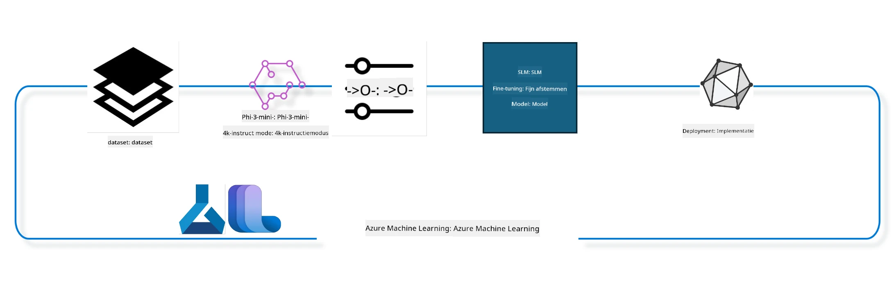

## Hoe chat-completion componenten uit het Azure ML systeemregister te gebruiken voor het fine-tunen van een model

In dit voorbeeld voeren we fine tuning uit van het Phi-3-mini-4k-instruct model om een gesprek tussen 2 personen te voltooien met behulp van de ultrachat_200k dataset.



Het voorbeeld laat zien hoe je fine tuning uitvoert met de Azure ML SDK en Python en vervolgens het fijn afgestelde model uitgeeft naar een online endpoint voor real-time inferentie.

### Trainingsdata

We gebruiken de ultrachat_200k dataset. Dit is een sterk gefilterde versie van de UltraChat dataset en werd gebruikt om Zephyr-7B-β te trainen, een geavanceerd 7b chat-model.

### Model

We gebruiken het Phi-3-mini-4k-instruct model om te laten zien hoe een gebruiker een model kan fijn afstellen voor de chat-completion taak. Als je deze notebook hebt geopend vanaf een specifieke modelkaart, vergeet dan niet de specifieke modelnaam te vervangen.

### Taken

- Kies een model om fijn af te stellen.
- Kies en verken trainingsdata.
- Configureer de fine tuning taak.
- Voer de fine tuning taak uit.
- Bekijk trainings- en evaluatiemetrics.
- Registreer het fijn afgestelde model.
- Zet het fijn afgestelde model in voor real-time inferentie.
- Ruim de gebruikte resources op.

## 1. Benodigdheden instellen

- Installeer dependencies
- Maak verbinding met AzureML Workspace. Lees meer onder SDK authenticatie instellen. Vervang <WORKSPACE_NAME>, <RESOURCE_GROUP> en <SUBSCRIPTION_ID> hieronder.
- Maak verbinding met azureml systeemregister
- Stel een optionele experimentnaam in
- Controleer of maak compute aan.

> [!NOTE]
> Vereisten: een enkele GPU node kan meerdere GPU-kaarten bevatten. Bijvoorbeeld, in één node van Standard_NC24rs_v3 zijn er 4 NVIDIA V100 GPU's terwijl in Standard_NC12s_v3 er 2 NVIDIA V100 GPU's zijn. Raadpleeg de documentatie voor deze informatie. Het aantal GPU-kaarten per node wordt ingesteld in de parameter gpus_per_node hieronder. Door deze waarde correct te zetten, wordt gebruik van alle GPU's in de node gegarandeerd. De aanbevolen GPU compute SKUs vind je hier en hier.

### Python Libraries

Installeer dependencies door onderstaande cel uit te voeren. Dit is een verplichte stap bij het draaien in een nieuwe omgeving.

```bash
pip install azure-ai-ml
pip install azure-identity
pip install datasets==2.9.0
pip install mlflow
pip install azureml-mlflow
```

### Interactie met Azure ML

1. Dit Python-script wordt gebruikt om te interacteren met de Azure Machine Learning (Azure ML) service. Hier volgt een uitleg wat het doet:

    - Het importeert benodigde modules van de azure.ai.ml, azure.identity en azure.ai.ml.entities pakketten. Ook importeert het de time module.

    - Het probeert te authenticeren met DefaultAzureCredential(), wat een vereenvoudigde authenticatie biedt om snel applicaties te ontwikkelen die in de Azure cloud draaien. Als dit niet lukt, valt het terug op InteractiveBrowserCredential(), wat een interactieve login prompt geeft.

    - Vervolgens probeert het een MLClient instantie te maken via de from_config methode, die de configuratie leest uit het standaard config bestand (config.json). Als dit mislukt, maakt het handmatig een MLClient instantie aan met subscription_id, resource_group_name en workspace_name ingevuld.

    - Het maakt nog een MLClient instantie, dit keer voor het Azure ML register met de naam "azureml". Dit register bevat modellen, fine-tuning pipelines en omgevingen.

    - Het stelt experiment_name in op "chat_completion_Phi-3-mini-4k-instruct".

    - Het genereert een unieke timestamp door de huidige tijd (in seconden sinds epoch, als float) om te zetten naar een integer en dan naar een string. Deze timestamp kan gebruikt worden om unieke namen en versies te maken.

    ```python
    # Importeer benodigde modules van Azure ML en Azure Identity
    from azure.ai.ml import MLClient
    from azure.identity import (
        DefaultAzureCredential,
        InteractiveBrowserCredential,
    )
    from azure.ai.ml.entities import AmlCompute
    import time  # Importeer time-module
    
    # Probeer te authenticeren met DefaultAzureCredential
    try:
        credential = DefaultAzureCredential()
        credential.get_token("https://management.azure.com/.default")
    except Exception as ex:  # Als DefaultAzureCredential faalt, gebruik InteractiveBrowserCredential
        credential = InteractiveBrowserCredential()
    
    # Probeer een MLClient-instantie te maken met het standaardconfiguratiebestand
    try:
        workspace_ml_client = MLClient.from_config(credential=credential)
    except:  # Als dat faalt, maak een MLClient-instantie door handmatig de gegevens te verstrekken
        workspace_ml_client = MLClient(
            credential,
            subscription_id="<SUBSCRIPTION_ID>",
            resource_group_name="<RESOURCE_GROUP>",
            workspace_name="<WORKSPACE_NAME>",
        )
    
    # Maak een andere MLClient-instantie voor de Azure ML-registry met de naam "azureml"
    # Deze registry is waar modellen, fine-tuning pipelines en omgevingen worden opgeslagen
    registry_ml_client = MLClient(credential, registry_name="azureml")
    
    # Stel de experimentnaam in
    experiment_name = "chat_completion_Phi-3-mini-4k-instruct"
    
    # Genereer een unieke timestamp die gebruikt kan worden voor namen en versies die uniek moeten zijn
    timestamp = str(int(time.time()))
    ```

## 2. Kies een fundamenteel model om fijn af te stellen

1. Phi-3-mini-4k-instruct is een lichtgewicht, state-of-the-art open model met 3,8 miljard parameters, gebaseerd op datasets gebruikt voor Phi-2. Het model behoort tot de Phi-3 model familie, en de Mini versie komt in twee varianten: 4K en 128K, wat de contextlengte (in tokens) weergeeft die het ondersteunt. We moeten het model fijn afstemmen voor ons specifieke doel om het te kunnen gebruiken. Je kunt deze modellen bekijken in de Model Catalogus in AzureML Studio, gefilterd op de chat-completion taak. In dit voorbeeld gebruiken we het Phi-3-mini-4k-instruct model. Als je deze notebook voor een ander model hebt geopend, vervang dan de modelnaam en versie dienovereenkomstig.

> [!NOTE]
> de model id eigenschap van het model. Dit wordt als input meegegeven aan de fine tuning taak. Dit is ook terug te vinden als het Asset ID veld op de model details pagina in AzureML Studio Model Catalogus.

2. Dit Python-script interageert met de Azure Machine Learning (Azure ML) service. Hier volgt wat het doet:

    - Het stelt model_name in op "Phi-3-mini-4k-instruct".

    - Het gebruikt de get methode van de models property van het registry_ml_client object om de laatste versie van het model met de opgegeven naam op te halen uit het Azure ML register. De get methode wordt aangeroepen met twee argumenten: de naam van het model en een label die aangeeft dat de laatste versie opgehaald moet worden.

    - Het print een bericht naar de console met de naam, versie en id van het model dat gebruikt wordt voor fine tuning. De format methode van de string wordt gebruikt om de naam, versie en id in het bericht te plaatsen. Deze eigenschappen worden uit het foundation_model object gehaald.

    ```python
    # Stel de modelnaam in
    model_name = "Phi-3-mini-4k-instruct"
    
    # Haal de nieuwste versie van het model op uit het Azure ML-register
    foundation_model = registry_ml_client.models.get(model_name, label="latest")
    
    # Druk de modelnaam, versie en id af
    # Deze informatie is nuttig voor het bijhouden en debuggen
    print(
        "\n\nUsing model name: {0}, version: {1}, id: {2} for fine tuning".format(
            foundation_model.name, foundation_model.version, foundation_model.id
        )
    )
    ```

## 3. Maak een compute aan voor de taak

De fine tune taak werkt ALLEEN met GPU compute. De grootte van de compute hangt af van de modelgrootte en in de meeste gevallen is het lastig om de juiste compute te kiezen voor de taak. In deze cel begeleiden we de gebruiker bij het kiezen van de juiste compute voor deze taak.

> [!NOTE]
> De hieronder genoemde computes werken met de meest geoptimaliseerde configuratie. Veranderingen aan de configuratie kunnen leiden tot een Cuda Out Of Memory fout. Probeer in dat geval de compute te upgraden naar een grotere compute.

> [!NOTE]
> Controleer bij het kiezen van compute_cluster_size hieronder dat de compute beschikbaar is in je resource group. Als een bepaalde compute niet beschikbaar is, kun je een verzoek doen om toegang te krijgen tot compute resources.

### Controleren van modelondersteuning voor fine tuning

1. Dit Python-script controleert een Azure Machine Learning (Azure ML) model. Hier volgt wat het doet:

    - Het importeert de ast module die functies biedt om Python abstracte syntaxisbomen te verwerken.

    - Het checkt of het foundation_model object (dat een model in Azure ML vertegenwoordigt) een tag heeft met de naam finetune_compute_allow_list. Tags in Azure ML zijn key-value paren die je kunt gebruiken om te filteren en sorteren.

    - Als de finetune_compute_allow_list tag aanwezig is, gebruikt het ast.literal_eval om de waarde van de tag (een string) veilig te parsen naar een Python lijst. Deze lijst wordt toegewezen aan computes_allow_list. Het print dan een bericht dat de compute uit deze lijst gemaakt moet worden.

    - Als de tag er niet is, stelt het computes_allow_list in op None en print een bericht dat de tag niet aanwezig is in de model tags.

    - Samengevat controleert dit script op een specifieke tag in de metadata van het model, zet de waarde om naar een lijst als die bestaat en geeft overeenkomstige feedback.

    ```python
    # Importeer de ast-module, die functies biedt om bomen van de abstracte syntaxisgrammatica van Python te verwerken
    import ast
    
    # Controleer of de tag 'finetune_compute_allow_list' aanwezig is in de tags van het model
    if "finetune_compute_allow_list" in foundation_model.tags:
        # Als de tag aanwezig is, gebruik dan ast.literal_eval om veilig de waarde van de tag (een string) te parsen naar een Python-lijst
        computes_allow_list = ast.literal_eval(
            foundation_model.tags["finetune_compute_allow_list"]
        )  # zet string om naar python-lijst
        # Print een bericht dat aangeeft dat een compute gemaakt moet worden vanuit de lijst
        print(f"Please create a compute from the above list - {computes_allow_list}")
    else:
        # Als de tag niet aanwezig is, stel computes_allow_list in op None
        computes_allow_list = None
        # Print een bericht dat aangeeft dat de tag 'finetune_compute_allow_list' geen onderdeel is van de tags van het model
        print("`finetune_compute_allow_list` is not part of model tags")
    ```

### Controleren van Compute Instance

1. Dit Python-script interageert met Azure Machine Learning (Azure ML) service en voert meerdere checks uit op een compute instance. Hier volgt wat het doet:

    - Het probeert de compute instance met naam compute_cluster op te halen uit de Azure ML workspace. Als de provisioning status van de compute instance "failed" is, gooit het een ValueError.

    - Het controleert of computes_allow_list niet None is. Als dat zo is, zet het alle compute maten in de lijst om naar kleine letters en checkt of de grootte van de huidige compute instance erin staat. Als dat niet zo is, wordt een ValueError gegooid.

    - Als computes_allow_list None is, checkt het of de grootte van de compute instance in een lijst van niet-ondersteunde GPU VM maten zit. Als dat zo is, wordt een ValueError gegooid.

    - Het haalt een lijst op van alle beschikbare compute maten in de workspace. Het doorloopt deze lijst en vergelijkt elke compute naam met de grootte van de huidige compute instance. Als het overeenkomt, haalt het het aantal GPU's op voor die compute grootte en zet gpu_count_found op True.

    - Als gpu_count_found True is print het het aantal GPU's in de compute instance. Als het False is, gooit het een ValueError.

    - Samengevat voert dit script meerdere controles uit op de compute instance, inclusief de provisioning status, de grootte versus een toegestane of niet-toegestane lijst, en het aantal GPU's.

    ```python
    # Print het exceptiebericht
    print(e)
    # Gooi een ValueError als de compute-grootte niet beschikbaar is in de workspace
    raise ValueError(
        f"WARNING! Compute size {compute_cluster_size} not available in workspace"
    )
    
    # Haal de compute-instantie op uit de Azure ML workspace
    compute = workspace_ml_client.compute.get(compute_cluster)
    # Controleer of de provisioning status van de compute-instantie "failed" is
    if compute.provisioning_state.lower() == "failed":
        # Gooi een ValueError als de provisioning status "failed" is
        raise ValueError(
            f"Provisioning failed, Compute '{compute_cluster}' is in failed state. "
            f"please try creating a different compute"
        )
    
    # Controleer of computes_allow_list niet None is
    if computes_allow_list is not None:
        # Zet alle compute-groottes in computes_allow_list om naar kleine letters
        computes_allow_list_lower_case = [x.lower() for x in computes_allow_list]
        # Controleer of de grootte van de compute-instantie in computes_allow_list_lower_case staat
        if compute.size.lower() not in computes_allow_list_lower_case:
            # Gooi een ValueError als de grootte van de compute-instantie niet in computes_allow_list_lower_case staat
            raise ValueError(
                f"VM size {compute.size} is not in the allow-listed computes for finetuning"
            )
    else:
        # Definieer een lijst van niet-ondersteunde GPU VM-groottes
        unsupported_gpu_vm_list = [
            "standard_nc6",
            "standard_nc12",
            "standard_nc24",
            "standard_nc24r",
        ]
        # Controleer of de grootte van de compute-instantie in unsupported_gpu_vm_list staat
        if compute.size.lower() in unsupported_gpu_vm_list:
            # Gooi een ValueError als de grootte van de compute-instantie in unsupported_gpu_vm_list staat
            raise ValueError(
                f"VM size {compute.size} is currently not supported for finetuning"
            )
    
    # Initialiseer een vlag om te controleren of het aantal GPU's in de compute-instantie is gevonden
    gpu_count_found = False
    # Haal een lijst op van alle beschikbare compute-groottes in de workspace
    workspace_compute_sku_list = workspace_ml_client.compute.list_sizes()
    available_sku_sizes = []
    # Itereer over de lijst van beschikbare compute-groottes
    for compute_sku in workspace_compute_sku_list:
        available_sku_sizes.append(compute_sku.name)
        # Controleer of de naam van de compute-grootte overeenkomt met de grootte van de compute-instantie
        if compute_sku.name.lower() == compute.size.lower():
            # Als dat zo is, haal dan het aantal GPU's van die compute-grootte op en zet gpu_count_found op True
            gpus_per_node = compute_sku.gpus
            gpu_count_found = True
    # Als gpu_count_found True is, print het aantal GPU's in de compute-instantie
    if gpu_count_found:
        print(f"Number of GPU's in compute {compute.size}: {gpus_per_node}")
    else:
        # Als gpu_count_found False is, gooi een ValueError
        raise ValueError(
            f"Number of GPU's in compute {compute.size} not found. Available skus are: {available_sku_sizes}."
            f"This should not happen. Please check the selected compute cluster: {compute_cluster} and try again."
        )
    ```

## 4. Kies de dataset voor fine tuning van het model

1. We gebruiken de ultrachat_200k dataset. De dataset is verdeeld in vier delen, geschikt voor Supervised fine-tuning (sft).
Generation ranking (gen). Het aantal voorbeelden per split is als volgt:

    ```bash
    train_sft test_sft  train_gen  test_gen
    207865  23110  256032  28304
    ```

1. De volgende cellen tonen basis data voorbereiding voor fine tuning:

### Visualiseer enkele datarijen

We willen dat dit voorbeeld snel draait, dus slaan we train_sft, test_sft bestanden op met 5% van de al ingekorte rijen. Dit betekent dat het fijn afgestelde model een lagere nauwkeurigheid zal hebben en daarom niet in de praktijk gebruikt zou moeten worden.
Het download-dataset.py script wordt gebruikt om de ultrachat_200k dataset te downloaden en het om te zetten naar een formaat dat compatibel is met de fine tuning pipeline component. Aangezien de dataset groot is, hebben we hier maar een deel van de dataset.

1. Het onderstaande script downloadt slechts 5% van de data. Dit percentage kan verhoogd worden door de parameter dataset_split_pc aan te passen.

> [!NOTE]
> Sommige taalmodellen gebruiken verschillende taalcodes en daarom moeten de kolomnamen in de dataset overeenkomen.

1. Hier is een voorbeeld van hoe de data eruit hoort te zien
De chat-completion dataset is opgeslagen in parquet formaat waarbij elke invoer het volgende schema gebruikt:

    - Dit is een JSON (JavaScript Object Notation) document, een veelgebruikt formaat om data uit te wisselen. Het is geen uitvoerbare code, maar een manier om data op te slaan en te transporteren. Hier volgt een uitleg:

    - "prompt": Deze sleutel bevat een tekstwaarde die een taak of vraag aan een AI-assistent beschrijft.

    - "messages": Deze sleutel bevat een lijst van objecten. Elk object representeert een bericht in een conversatie tussen een gebruiker en een AI-assistent. Elk berichtobject heeft twee sleutels:

    - "content": Deze sleutel bevat de inhoudstekst van het bericht.
    - "role": Deze sleutel bevat een waarde die de rol van de afzender van het bericht aanduidt. Dit kan "user" of "assistant" zijn.
    - "prompt_id": Deze sleutel bevat een unieke identifier voor de prompt.

1. In dit specifieke JSON document wordt een conversatie weergegeven waarin een gebruiker vraagt aan een AI-assistent om een protagonist te maken voor een dystopisch verhaal. De assistent reageert, de gebruiker vraagt om meer details en de assistent stemt toe die te geven. De hele conversatie is gekoppeld aan een specifiek prompt id.

    ```python
    {
        // The task or question posed to an AI assistant
        "prompt": "Create a fully-developed protagonist who is challenged to survive within a dystopian society under the rule of a tyrant. ...",
        
        // An array of objects, each representing a message in a conversation between a user and an AI assistant
        "messages":[
            {
                // The content of the user's message
                "content": "Create a fully-developed protagonist who is challenged to survive within a dystopian society under the rule of a tyrant. ...",
                // The role of the entity that sent the message
                "role": "user"
            },
            {
                // The content of the assistant's message
                "content": "Name: Ava\n\n Ava was just 16 years old when the world as she knew it came crashing down. The government had collapsed, leaving behind a chaotic and lawless society. ...",
                // The role of the entity that sent the message
                "role": "assistant"
            },
            {
                // The content of the user's message
                "content": "Wow, Ava's story is so intense and inspiring! Can you provide me with more details.  ...",
                // The role of the entity that sent the message
                "role": "user"
            }, 
            {
                // The content of the assistant's message
                "content": "Certainly! ....",
                // The role of the entity that sent the message
                "role": "assistant"
            }
        ],
        
        // A unique identifier for the prompt
        "prompt_id": "d938b65dfe31f05f80eb8572964c6673eddbd68eff3db6bd234d7f1e3b86c2af"
    }
    ```

### Data downloaden

1. Dit Python-script wordt gebruikt om een dataset te downloaden via een hulpscript download-dataset.py. Hier volgt wat het doet:

    - Het importeert de os module, die een platformonafhankelijke manier biedt om functionaliteit van het besturingssysteem te gebruiken.

    - Het gebruikt de os.system functie om het script download-dataset.py uit te voeren in de shell met specifieke argumenten. De argumenten geven aan welke dataset te downloaden (HuggingFaceH4/ultrachat_200k), de map om te downloaden (ultrachat_200k_dataset) en het percentage dataset (5) om te splitsen. De returnwaarde van os.system wordt opgeslagen in exit_status.

    - Het controleert of exit_status niet 0 is. In Unix-achtige systemen betekent 0 meestal succes, en elke andere waarde een fout. Als exit_status niet 0 is, wordt een Exception gegooid met een foutmelding dat downloaden is mislukt.

    - Samengevat voert dit script een commando uit om een dataset te downloaden met behulp van een hulpscript en werpt een fout als het misgaat.

    ```python
    # Importeer de os-module, die een manier biedt om besturingssysteemafhankelijke functionaliteit te gebruiken
    import os
    
    # Gebruik de functie os.system om het script download-dataset.py uit te voeren in de shell met specifieke commandoregelargumenten
    # De argumenten geven de dataset aan die moet worden gedownload (HuggingFaceH4/ultrachat_200k), de map waar naartoe moet worden gedownload (ultrachat_200k_dataset), en het percentage van de dataset om te splitsen (5)
    # De functie os.system retourneert de exitstatus van het commando dat het heeft uitgevoerd; deze status wordt opgeslagen in de variabele exit_status
    exit_status = os.system(
        "python ./download-dataset.py --dataset HuggingFaceH4/ultrachat_200k --download_dir ultrachat_200k_dataset --dataset_split_pc 5"
    )
    
    # Controleer of exit_status niet gelijk is aan 0
    # In Unix-achtige besturingssystemen duidt een exitstatus van 0 meestal aan dat een commando is geslaagd, terwijl elk ander getal een fout aangeeft
    # Als exit_status niet gelijk is aan 0, raise dan een Exception met een bericht dat er een fout was bij het downloaden van de dataset
    if exit_status != 0:
        raise Exception("Error downloading dataset")
    ```

### Data laden in een DataFrame
1. Dit Python-script laadt een JSON Lines-bestand in een pandas DataFrame en toont de eerste 5 rijen. Hier volgt een overzicht van wat het doet:

    - Het importeert de pandas-bibliotheek, een krachtige bibliotheek voor gegevensmanipulatie en -analyse.

    - Het stelt de maximale kolombreedte in voor de weergaveopties van pandas op 0. Dit betekent dat de volledige tekst van elke kolom wordt weergegeven zonder inkorting wanneer de DataFrame wordt afgedrukt.

    - Het gebruikt de functie pd.read_json om het bestand train_sft.jsonl uit de directory ultrachat_200k_dataset in te laden in een DataFrame. Het argument lines=True geeft aan dat het bestand in JSON Lines-formaat is, waarbij elke regel een apart JSON-object is.

    - Het gebruikt de methode head om de eerste 5 rijen van de DataFrame te tonen. Als de DataFrame minder dan 5 rijen bevat, worden ze allemaal weergegeven.

    - Samengevat laadt dit script een JSON Lines-bestand in een DataFrame en toont het de eerste 5 rijen met volledige kolomtekst.
    
    ```python
    # Importeer de pandas-bibliotheek, een krachtige bibliotheek voor gegevensmanipulatie en -analyse
    import pandas as pd
    
    # Stel de maximale kolombreedte in voor de weergave-opties van pandas op 0
    # Dit betekent dat de volledige tekst van elke kolom wordt weergegeven zonder afkapping wanneer de DataFrame wordt afgedrukt
    pd.set_option("display.max_colwidth", 0)
    
    # Gebruik de functie pd.read_json om het bestand train_sft.jsonl uit de map ultrachat_200k_dataset in een DataFrame te laden
    # Het argument lines=True geeft aan dat het bestand in JSON Lines-formaat is, waarbij elke regel een afzonderlijk JSON-object is
    df = pd.read_json("./ultrachat_200k_dataset/train_sft.jsonl", lines=True)
    
    # Gebruik de methode head om de eerste 5 rijen van de DataFrame weer te geven
    # Als de DataFrame minder dan 5 rijen bevat, worden ze allemaal weergegeven
    df.head()
    ```

## 5. Dien de fine tuning-taak in met het model en de gegevens als invoer

Maak de taak aan die de chat-completion pipeline component gebruikt. Leer meer over alle parameters die worden ondersteund voor fine tuning.

### Definieer finetune parameters

1. Finetune parameters kunnen in 2 categorieën worden onderverdeeld - trainingsparameters, optimalisatieparameters

1. Trainingsparameters definiëren de trainingsaspecten zoals -

    - De optimizer, scheduler die gebruikt wordt
    - De metriek om de fine tune te optimaliseren
    - Aantal trainingsstappen en batchgrootte, enzovoort
    - Optimalisatieparameters helpen bij het optimaliseren van het GPU-geheugen en het effectief gebruiken van de rekencapaciteit.

1. Hieronder enkele parameters die tot deze categorie behoren. De optimalisatieparameters verschillen per model en worden met het model meegeleverd om deze variaties af te handelen.

    - Deepspeed en LoRA inschakelen
    - Mixed precision training inschakelen
    - Multi-node training inschakelen

> [!NOTE]
> Supervised finetuning kan leiden tot verlies van alignment of catastrofaal vergeten. We raden aan dit probleem te controleren en een alignment fase uit te voeren na fine tuning.

### Fine Tuning Parameters

1. Dit Python-script stelt parameters in voor het fine tunen van een machine learning model. Hier volgt een overzicht:

    - Het stelt standaard trainingsparameters in zoals het aantal trainingsepochs, batchgroottes voor training en evaluatie, leersnelheid en het type learning rate scheduler.

    - Het stelt standaard optimalisatieparameters in zoals of Layer-wise Relevance Propagation (LoRa) en DeepSpeed worden toegepast, plus de DeepSpeed stage.

    - Het combineert de trainings- en optimalisatieparameters in één woordenboek genaamd finetune_parameters.

    - Het controleert of het foundation_model model-specifieke standaardparameters heeft. Zo ja, dan print het een waarschuwing en update het finetune_parameters met deze model-specifieke standaardwaarden. De functie ast.literal_eval wordt gebruikt om de model-specifieke standaardwaarden van een string naar een Python-dictionary te converteren.

    - Het print de uiteindelijke set fine tuning parameters die gebruikt zullen worden.

    - Samengevat stelt dit script de parameters in voor het fine tunen van een machine learning model, met mogelijkheid om de standaardparameters te overschrijven met model-specifieke waarden.

    ```python
    # Stel standaard trainingsparameters in, zoals het aantal trainingsepochs, batchgroottes voor training en evaluatie, leersnelheid en type leerschema
    training_parameters = dict(
        num_train_epochs=3,
        per_device_train_batch_size=1,
        per_device_eval_batch_size=1,
        learning_rate=5e-6,
        lr_scheduler_type="cosine",
    )
    
    # Stel standaard optimalisatieparameters in, zoals of Layer-wise Relevance Propagation (LoRa) en DeepSpeed worden toegepast, en de DeepSpeed-fase
    optimization_parameters = dict(
        apply_lora="true",
        apply_deepspeed="true",
        deepspeed_stage=2,
    )
    
    # Combineer de trainings- en optimalisatieparameters in één woordenboek genaamd finetune_parameters
    finetune_parameters = {**training_parameters, **optimization_parameters}
    
    # Controleer of het foundation_model model-specifieke standaardparameters heeft
    # Als dat zo is, geef een waarschuwingsbericht weer en werk het woordenboek finetune_parameters bij met deze model-specifieke standaarden
    # De functie ast.literal_eval wordt gebruikt om de model-specifieke standaarden van een string naar een Python-woordenboek om te zetten
    if "model_specific_defaults" in foundation_model.tags:
        print("Warning! Model specific defaults exist. The defaults could be overridden.")
        finetune_parameters.update(
            ast.literal_eval(  # zet string om naar Python-woordenboek
                foundation_model.tags["model_specific_defaults"]
            )
        )
    
    # Druk de uiteindelijke set fijninstellingsparameters af die gebruikt zullen worden voor de uitvoering
    print(
        f"The following finetune parameters are going to be set for the run: {finetune_parameters}"
    )
    ```

### Trainingspipeline

1. Dit Python-script definieert een functie om een weergavenaam te genereren voor een machine learning trainingspipeline, en roept deze functie aan om de weergavenaam te genereren en af te drukken. Hier volgt een overzicht:

1. De functie get_pipeline_display_name wordt gedefinieerd. Deze functie genereert een weergavenaam op basis van verschillende parameters die gerelateerd zijn aan de trainingspipeline.

1. In de functie wordt de totale batchgrootte berekend door het per-device batch size, het aantal gradient accumulation stappen, het aantal GPU’s per node en het aantal nodes voor fine tuning te vermenigvuldigen.

1. Het haalt diverse andere parameters op, zoals het type learning rate scheduler, of DeepSpeed wordt toegepast, de DeepSpeed stage, of Layer-wise Relevance Propagation (LoRa) wordt toegepast, het limiet voor het aantal model checkpoints om te bewaren en de maximale sequentielengte.

1. Het bouwt een string die al deze parameters bevat, gescheiden door streepjes. Indien DeepSpeed of LoRa toegepast wordt, bevat de string respectievelijk "ds" gevolgd door de DeepSpeed stage, of "lora". Anders bevat het "nods" of "nolora".

1. De functie retourneert deze string, die fungeert als de weergavenaam voor de trainingspipeline.

1. Nadat de functie is gedefinieerd, wordt deze aangeroepen om de weergavenaam te genereren, die vervolgens wordt afgedrukt.

1. Samengevat genereert dit script een weergavenaam voor een machine learning trainingspipeline op basis van verschillende parameters, en drukt het deze weergavenaam af.

    ```python
    # Definieer een functie om een weergavenaam voor de trainingspipeline te genereren
    def get_pipeline_display_name():
        # Bereken de totale batchgrootte door de batchgrootte per apparaat, het aantal gradient accumulation-stappen, het aantal GPU's per node en het aantal nodes dat voor fine-tuning wordt gebruikt te vermenigvuldigen
        batch_size = (
            int(finetune_parameters.get("per_device_train_batch_size", 1))
            * int(finetune_parameters.get("gradient_accumulation_steps", 1))
            * int(gpus_per_node)
            * int(finetune_parameters.get("num_nodes_finetune", 1))
        )
        # Haal het type learning rate scheduler op
        scheduler = finetune_parameters.get("lr_scheduler_type", "linear")
        # Haal op of DeepSpeed wordt toegepast
        deepspeed = finetune_parameters.get("apply_deepspeed", "false")
        # Haal het DeepSpeed-stage op
        ds_stage = finetune_parameters.get("deepspeed_stage", "2")
        # Als DeepSpeed wordt toegepast, voeg dan "ds" gevolgd door het DeepSpeed-stage toe aan de weergavenaam; zo niet, voeg "nods" toe
        if deepspeed == "true":
            ds_string = f"ds{ds_stage}"
        else:
            ds_string = "nods"
        # Haal op of Layer-wise Relevance Propagation (LoRa) wordt toegepast
        lora = finetune_parameters.get("apply_lora", "false")
        # Als LoRa wordt toegepast, voeg dan "lora" toe aan de weergavenaam; zo niet, voeg "nolora" toe
        if lora == "true":
            lora_string = "lora"
        else:
            lora_string = "nolora"
        # Haal het limiet op het aantal model checkpoints dat bewaard blijft
        save_limit = finetune_parameters.get("save_total_limit", -1)
        # Haal de maximale sequentielengte op
        seq_len = finetune_parameters.get("max_seq_length", -1)
        # Stel de weergavenaam samen door al deze parameters te concatenere, gescheiden door streepjes
        return (
            model_name
            + "-"
            + "ultrachat"
            + "-"
            + f"bs{batch_size}"
            + "-"
            + f"{scheduler}"
            + "-"
            + ds_string
            + "-"
            + lora_string
            + f"-save_limit{save_limit}"
            + f"-seqlen{seq_len}"
        )
    
    # Roep de functie aan om de weergavenaam te genereren
    pipeline_display_name = get_pipeline_display_name()
    # Print de weergavenaam
    print(f"Display name used for the run: {pipeline_display_name}")
    ```

### Configureren van Pipeline

Dit Python-script definieert en configureert een machine learning pipeline met behulp van de Azure Machine Learning SDK. Hier volgt een overzicht:

1. Het importeert benodigde modules uit de Azure AI ML SDK.

1. Het haalt een pipeline component met de naam "chat_completion_pipeline" op uit het register.

1. Het definieert een pipeline job met de `@pipeline` decorator en de functie `create_pipeline`. De naam van de pipeline is ingesteld op `pipeline_display_name`.

1. Binnen de functie `create_pipeline` initialiseert het de opgehaalde pipeline component met diverse parameters, waaronder het modelpad, compute clusters voor verschillende fasen, dataset splits voor trainen en testen, het aantal GPU’s voor fine tuning en andere fine tuning parameters.

1. Het koppelt de output van de fine tuning taak aan de output van de pipeline taak. Dit wordt gedaan zodat het fine getunede model eenvoudig geregistreerd kan worden, wat vereist is om het model te implementeren naar een online of batch endpoint.

1. Het maakt een instantie van de pipeline door de functie `create_pipeline` aan te roepen.

1. Het stelt de instelling `force_rerun` van de pipeline in op `True`, wat betekent dat gecachte resultaten van eerdere taken niet gebruikt zullen worden.

1. Het stelt de instelling `continue_on_step_failure` van de pipeline in op `False`, wat betekent dat de pipeline stopt als een stap faalt.

1. Samengevat definieert en configureert dit script een machine learning pipeline voor een chat completion taak met de Azure Machine Learning SDK.

    ```python
    # Importeer benodigde modules van de Azure AI ML SDK
    from azure.ai.ml.dsl import pipeline
    from azure.ai.ml import Input
    
    # Haal de pipeline component met de naam "chat_completion_pipeline" op uit het register
    pipeline_component_func = registry_ml_client.components.get(
        name="chat_completion_pipeline", label="latest"
    )
    
    # Definieer de pipeline job met de @pipeline decorator en de functie create_pipeline
    # De naam van de pipeline wordt ingesteld op pipeline_display_name
    @pipeline(name=pipeline_display_name)
    def create_pipeline():
        # Initialiseer de opgehaalde pipeline component met verschillende parameters
        # Deze omvatten het modelpad, compute clusters voor verschillende fasen, dataset splits voor training en testen, het aantal GPU’s voor fine-tuning, en andere fine-tuning parameters
        chat_completion_pipeline = pipeline_component_func(
            mlflow_model_path=foundation_model.id,
            compute_model_import=compute_cluster,
            compute_preprocess=compute_cluster,
            compute_finetune=compute_cluster,
            compute_model_evaluation=compute_cluster,
            # Koppel de dataset splits aan parameters
            train_file_path=Input(
                type="uri_file", path="./ultrachat_200k_dataset/train_sft.jsonl"
            ),
            test_file_path=Input(
                type="uri_file", path="./ultrachat_200k_dataset/test_sft.jsonl"
            ),
            # Trainingsinstellingen
            number_of_gpu_to_use_finetuning=gpus_per_node,  # Stel in op het aantal beschikbare GPU’s in de compute
            **finetune_parameters
        )
        return {
            # Koppel de output van de fine tuning job aan de output van de pipeline job
            # Dit wordt gedaan zodat we het fijn afgestelde model gemakkelijk kunnen registreren
            # Het registreren van het model is vereist om het model naar een online of batch endpoint te deployen
            "trained_model": chat_completion_pipeline.outputs.mlflow_model_folder
        }
    
    # Maak een instantie van de pipeline door de functie create_pipeline aan te roepen
    pipeline_object = create_pipeline()
    
    # Gebruik geen gecachte resultaten van eerdere jobs
    pipeline_object.settings.force_rerun = True
    
    # Stel continue on step failure in op False
    # Dit betekent dat de pipeline stopt als een stap mislukt
    pipeline_object.settings.continue_on_step_failure = False
    ```

### Dien de Taak in

1. Dit Python-script dient een machine learning pipeline taak in bij een Azure Machine Learning workspace en wacht vervolgens tot de taak voltooid is. Hier volgt een overzicht:

    - Het roept de methode create_or_update aan van het jobs-object in de workspace_ml_client om de pipeline taak in te dienen. De pipeline die uitgevoerd moet worden wordt gespecificeerd door pipeline_object, en het experiment waaronder de taak wordt uitgevoerd wordt gespecificeerd door experiment_name.

    - Daarna roept het de methode stream aan van het jobs-object in de workspace_ml_client om te wachten tot de pipeline taak voltooid is. De taak waarvoor gewacht wordt is gespecificeerd door het attribuut name van het pipeline_job-object.

    - Samengevat dient dit script een machine learning pipeline taak in bij een Azure Machine Learning workspace en wacht het tot de taak voltooid is.

    ```python
    # Verstuur de pipeline-taak naar de Azure Machine Learning werkruimte
    # De uit te voeren pipeline wordt gespecificeerd door pipeline_object
    # Het experiment waaronder de taak wordt uitgevoerd wordt gespecificeerd door experiment_name
    pipeline_job = workspace_ml_client.jobs.create_or_update(
        pipeline_object, experiment_name=experiment_name
    )
    
    # Wacht tot de pipeline-taak is voltooid
    # De taak om op te wachten wordt gespecificeerd door het naam-attribuut van het pipeline_job-object
    workspace_ml_client.jobs.stream(pipeline_job.name)
    ```

## 6. Registreer het fine getunede model in de workspace

We registreren het model vanuit de output van de fine tuning taak. Dit zorgt voor tracking van de genealogie tussen het fine getunede model en de fine tuning taak. De fine tuning taak zelf registreert de genealogie naar het foundation model, de data en de trainingscode.

### Registreren van het ML Model

1. Dit Python-script registreert een machine learning model dat is getraind in een Azure Machine Learning pipeline. Hier volgt een overzicht:

    - Het importeert benodigde modules uit de Azure AI ML SDK.

    - Het controleert of de trained_model output beschikbaar is van de pipeline taak door de get methode aan te roepen van het jobs-object in de workspace_ml_client en toegang te krijgen tot diens outputs attribuut.

    - Het bouwt een pad naar het getrainde model door een string te formatteren met de naam van de pipeline taak en de naam van de output ("trained_model").

    - Het definieert een naam voor het fine getunede model door "-ultrachat-200k" toe te voegen aan de originele modelnaam en alle schuine strepen te vervangen door streepjes.

    - Het bereidt het model voor om te registreren door een Model-object te maken met verschillende parameters, waaronder het pad naar het model, het type model (MLflow model), de naam en versie van het model en een beschrijving van het model.

    - Het registreert het model door de methode create_or_update aan te roepen van het models-object in de workspace_ml_client met het Model-object als argument.

    - Het print het geregistreerde model.

1. Samengevat registreert dit script een machine learning model dat is getraind in een Azure Machine Learning pipeline.
    
    ```python
    # Importeer benodigde modules uit de Azure AI ML SDK
    from azure.ai.ml.entities import Model
    from azure.ai.ml.constants import AssetTypes
    
    # Controleer of de uitvoer `trained_model` beschikbaar is van de pipeline job
    print("pipeline job outputs: ", workspace_ml_client.jobs.get(pipeline_job.name).outputs)
    
    # Stel een pad naar het getrainde model samen door een string te formatteren met de naam van de pipeline job en de naam van de uitvoer ("trained_model")
    model_path_from_job = "azureml://jobs/{0}/outputs/{1}".format(
        pipeline_job.name, "trained_model"
    )
    
    # Definieer een naam voor het fijn-afgestelde model door "-ultrachat-200k" toe te voegen aan de originele modelnaam en alle schuine strepen te vervangen door koppeltekens
    finetuned_model_name = model_name + "-ultrachat-200k"
    finetuned_model_name = finetuned_model_name.replace("/", "-")
    
    print("path to register model: ", model_path_from_job)
    
    # Bereid registratie van het model voor door een Model object te maken met verschillende parameters
    # Deze omvatten het pad naar het model, het type van het model (MLflow model), de naam en versie van het model, en een beschrijving van het model
    prepare_to_register_model = Model(
        path=model_path_from_job,
        type=AssetTypes.MLFLOW_MODEL,
        name=finetuned_model_name,
        version=timestamp,  # Gebruik een tijdstempel als versie om versieconflicten te voorkomen
        description=model_name + " fine tuned model for ultrachat 200k chat-completion",
    )
    
    print("prepare to register model: \n", prepare_to_register_model)
    
    # Registreer het model door de create_or_update methode van het models object in de workspace_ml_client aan te roepen met het Model object als argument
    registered_model = workspace_ml_client.models.create_or_update(
        prepare_to_register_model
    )
    
    # Print het geregistreerde model
    print("registered model: \n", registered_model)
    ```

## 7. Implementeer het fine getunede model naar een online endpoint

Online endpoints bieden een duurzame REST API die kan worden gebruikt om te integreren met applicaties die het model moeten gebruiken.

### Endpoint Beheren

1. Dit Python-script maakt een beheerde online endpoint in Azure Machine Learning voor een geregistreerd model. Hier volgt een overzicht:

    - Het importeert benodigde modules uit de Azure AI ML SDK.

    - Het definieert een unieke naam voor de online endpoint door een tijdstempel toe te voegen aan de string "ultrachat-completion-".

    - Het bereidt het aanmaken van de online endpoint voor door een ManagedOnlineEndpoint-object aan te maken met verschillende parameters, waaronder de naam van de endpoint, een beschrijving van de endpoint en de authenticatiemodus ("key").

    - Het maakt de online endpoint aan door de methode begin_create_or_update aan te roepen van de workspace_ml_client met het ManagedOnlineEndpoint-object als argument. Vervolgens wacht het op het voltooien van de aanmaak door de wait-methode te gebruiken.

1. Samengevat maakt dit script een beheerde online endpoint in Azure Machine Learning voor een geregistreerd model.

    ```python
    # Importeer de benodigde modules uit de Azure AI ML SDK
    from azure.ai.ml.entities import (
        ManagedOnlineEndpoint,
        ManagedOnlineDeployment,
        ProbeSettings,
        OnlineRequestSettings,
    )
    
    # Definieer een unieke naam voor het online eindpunt door een tijdstempel toe te voegen aan de string "ultrachat-completion-"
    online_endpoint_name = "ultrachat-completion-" + timestamp
    
    # Bereid het aanmaken van het online eindpunt voor door een ManagedOnlineEndpoint-object te maken met verschillende parameters
    # Deze omvatten de naam van het eindpunt, een beschrijving van het eindpunt en de authenticatiemodus ("key")
    endpoint = ManagedOnlineEndpoint(
        name=online_endpoint_name,
        description="Online endpoint for "
        + registered_model.name
        + ", fine tuned model for ultrachat-200k-chat-completion",
        auth_mode="key",
    )
    
    # Maak het online eindpunt aan door de methode begin_create_or_update van workspace_ml_client aan te roepen met het ManagedOnlineEndpoint-object als argument
    # Wacht vervolgens tot de aanmaakoperatie is voltooid door de wait-methode aan te roepen
    workspace_ml_client.begin_create_or_update(endpoint).wait()
    ```

> [!NOTE]
> Hier vindt u de lijst met SKU’s die worden ondersteund voor implementatie - [Managed online endpoints SKU list](https://learn.microsoft.com/azure/machine-learning/reference-managed-online-endpoints-vm-sku-list)

### ML Model Implementeren

1. Dit Python-script implementeert een geregistreerd machine learning model naar een beheerde online endpoint in Azure Machine Learning. Hier volgt een overzicht:

    - Het importeert de ast-module, die functies biedt om bomen van de Python abstracte syntaxisgrammatica te verwerken.

    - Het stelt het instance type voor de implementatie in op "Standard_NC6s_v3".

    - Het controleert of de tag inference_compute_allow_list aanwezig is in het foundation model. Zo ja, dan zet het de tagwaarde vanuit een string om naar een Python-lijst en wijst het toe aan inference_computes_allow_list. Zo niet, dan stelt het inference_computes_allow_list in op None.

    - Het controleert of het opgegeven instance type in de lijst staat. Zo niet, dan print het een bericht waarin de gebruiker gevraagd wordt een instance type uit de toegestane lijst te kiezen.

    - Het bereidt de aanmaak van de deployment voor door een ManagedOnlineDeployment-object te maken met verschillende parameters, waaronder de naam van de deployment, de naam van de endpoint, het ID van het model, het instance type en aantal, de instellingen voor de liveness probe en de request-instellingen.

    - Het maakt de deployment aan door de methode begin_create_or_update aan te roepen van de workspace_ml_client met het ManagedOnlineDeployment-object als argument. Vervolgens wacht het op het voltooien van de aanmaak door de wait-methode te gebruiken.

    - Het stelt de traffic van de endpoint in om 100% van de verkeer naar de "demo" deployment te leiden.

    - Het werkt de endpoint bij door de methode begin_create_or_update aan te roepen van de workspace_ml_client met het endpoint-object als argument. Vervolgens wacht het op de update door de result-methode aan te roepen.

1. Samengevat implementeert dit script een geregistreerd machine learning model naar een beheerde online endpoint in Azure Machine Learning.

    ```python
    # Importeer de ast-module, die functies biedt om bomen van de Python abstracte syntaxisgrammatica te verwerken
    import ast
    
    # Stel het type instantie in voor de uitrol
    instance_type = "Standard_NC6s_v3"
    
    # Controleer of de tag `inference_compute_allow_list` aanwezig is in het funderingsmodel
    if "inference_compute_allow_list" in foundation_model.tags:
        # Als dat het geval is, zet de tagwaarde om van een string naar een Python-lijst en wijs deze toe aan `inference_computes_allow_list`
        inference_computes_allow_list = ast.literal_eval(
            foundation_model.tags["inference_compute_allow_list"]
        )
        print(f"Please create a compute from the above list - {computes_allow_list}")
    else:
        # Als dat niet het geval is, stel `inference_computes_allow_list` in op `None`
        inference_computes_allow_list = None
        print("`inference_compute_allow_list` is not part of model tags")
    
    # Controleer of het opgegeven instantie-type in de toestemmingslijst staat
    if (
        inference_computes_allow_list is not None
        and instance_type not in inference_computes_allow_list
    ):
        print(
            f"`instance_type` is not in the allow listed compute. Please select a value from {inference_computes_allow_list}"
        )
    
    # Maak je klaar om de uitrol te creëren door een `ManagedOnlineDeployment` object te maken met verschillende parameters
    demo_deployment = ManagedOnlineDeployment(
        name="demo",
        endpoint_name=online_endpoint_name,
        model=registered_model.id,
        instance_type=instance_type,
        instance_count=1,
        liveness_probe=ProbeSettings(initial_delay=600),
        request_settings=OnlineRequestSettings(request_timeout_ms=90000),
    )
    
    # Maak de uitrol aan door de `begin_create_or_update` methode van de `workspace_ml_client` aan te roepen met het `ManagedOnlineDeployment` object als argument
    # Wacht vervolgens tot de creatiebewerking voltooid is door de `wait` methode aan te roepen
    workspace_ml_client.online_deployments.begin_create_or_update(demo_deployment).wait()
    
    # Stel het verkeer van de endpoint in om 100% van het verkeer naar de "demo" uitrol te leiden
    endpoint.traffic = {"demo": 100}
    
    # Werk de endpoint bij door de `begin_create_or_update` methode van de `workspace_ml_client` aan te roepen met het `endpoint` object als argument
    # Wacht vervolgens tot de updatebewerking voltooid is door de `result` methode aan te roepen
    workspace_ml_client.begin_create_or_update(endpoint).result()
    ```

## 8. Test de endpoint met voorbeeldgegevens

We halen wat voorbeeldgegevens op uit de test dataset en sturen deze naar de online endpoint voor inferentie. We tonen vervolgens de gescoorde labels naast de ground truth labels.

### Resultaten lezen

1. Dit Python-script leest een JSON Lines-bestand in een pandas DataFrame, neemt een willekeurige steekproef en zet de index opnieuw. Hier volgt een overzicht:

    - Het leest het bestand ./ultrachat_200k_dataset/test_gen.jsonl in een pandas DataFrame. De functie read_json wordt gebruikt met het argument lines=True omdat het bestand in JSON Lines-formaat is, waar elke regel een apart JSON-object is.

    - Het neemt een willekeurige steekproef van 1 rij uit de DataFrame. De functie sample wordt gebruikt met het argument n=1 om het aantal willekeurige rijen te specificeren.

    - Het zet de index van de DataFrame opnieuw. De functie reset_index wordt gebruikt met het argument drop=True om de originele index te verwijderen en te vervangen door een nieuwe index met standaard gehele getallen.

    - Het toont de eerste 2 rijen van de DataFrame met de functie head en het argument 2. Omdat de DataFrame maar 1 rij bevat na de steekproef, wordt alleen die ene rij getoond.

1. Samengevat leest dit script een JSON Lines-bestand in een pandas DataFrame, neemt een willekeurige steekproef van 1 rij, zet de index opnieuw en toont de eerste rij.
    
    ```python
    # Importeer de pandas bibliotheek
    import pandas as pd
    
    # Lees het JSON Lines-bestand './ultrachat_200k_dataset/test_gen.jsonl' in een pandas DataFrame
    # Het argument 'lines=True' geeft aan dat het bestand in JSON Lines-formaat is, waarbij elke regel een apart JSON-object is
    test_df = pd.read_json("./ultrachat_200k_dataset/test_gen.jsonl", lines=True)
    
    # Neem een willekeurige steekproef van 1 rij uit de DataFrame
    # Het argument 'n=1' specificeert het aantal willekeurige rijen om te selecteren
    test_df = test_df.sample(n=1)
    
    # Zet de index van de DataFrame terug
    # Het argument 'drop=True' geeft aan dat de originele index moet worden verwijderd en vervangen door een nieuwe index met standaard gehele getallen
    # Het argument 'inplace=True' geeft aan dat de DataFrame ter plaatse moet worden gewijzigd (zonder een nieuw object te maken)
    test_df.reset_index(drop=True, inplace=True)
    
    # Toon de eerste 2 rijen van de DataFrame
    # Omdat de DataFrame echter slechts één rij bevat na de steekproef, zal dit alleen die ene rij weergeven
    test_df.head(2)
    ```

### JSON-object maken
1. Dit Python-script maakt een JSON-object met specifieke parameters en slaat dit op in een bestand. Hier is een overzicht van wat het doet:

    - Het importeert de json-module, die functies biedt om met JSON-gegevens te werken.

    - Het maakt een woordenboek parameters aan met sleutels en waarden die parameters voor een machine learning-model vertegenwoordigen. De sleutels zijn "temperature", "top_p", "do_sample" en "max_new_tokens", en de bijbehorende waarden zijn respectievelijk 0.6, 0.9, True en 200.

    - Het maakt een ander woordenboek test_json met twee sleutels: "input_data" en "params". De waarde van "input_data" is een ander woordenboek met sleutels "input_string" en "parameters". De waarde van "input_string" is een lijst met het eerste bericht uit de test_df DataFrame. De waarde van "parameters" is het eerder gemaakte parameters-woordenboek. De waarde van "params" is een leeg woordenboek.

    - Het opent een bestand met de naam sample_score.json
    
    ```python
    # Importeer de json-module, die functies biedt om met JSON-gegevens te werken
    import json
    
    # Maak een woordenboek `parameters` met sleutels en waarden die parameters voor een machine learning-model voorstellen
    # De sleutels zijn "temperature", "top_p", "do_sample" en "max_new_tokens", met respectievelijk de waarden 0.6, 0.9, True en 200
    parameters = {
        "temperature": 0.6,
        "top_p": 0.9,
        "do_sample": True,
        "max_new_tokens": 200,
    }
    
    # Maak een ander woordenboek `test_json` met twee sleutels: "input_data" en "params"
    # De waarde van "input_data" is een ander woordenboek met de sleutels "input_string" en "parameters"
    # De waarde van "input_string" is een lijst die het eerste bericht uit de `test_df` DataFrame bevat
    # De waarde van "parameters" is het eerder gemaakte `parameters` woordenboek
    # De waarde van "params" is een leeg woordenboek
    test_json = {
        "input_data": {
            "input_string": [test_df["messages"][0]],
            "parameters": parameters,
        },
        "params": {},
    }
    
    # Open een bestand genaamd `sample_score.json` in de directory `./ultrachat_200k_dataset` in schrijfmodus
    with open("./ultrachat_200k_dataset/sample_score.json", "w") as f:
        # Schrijf het `test_json` woordenboek naar het bestand in JSON-formaat met behulp van de functie `json.dump`
        json.dump(test_json, f)
    ```

### Endpoint aanroepen

1. Dit Python-script roept een online endpoint aan in Azure Machine Learning om een JSON-bestand te beoordelen. Hier is een overzicht van wat het doet:

    - Het roept de invoke-methode aan van de online_endpoints-eigenschap van het workspace_ml_client-object. Deze methode wordt gebruikt om een verzoek naar een online endpoint te sturen en een reactie te krijgen.

    - Het specificeert de naam van het endpoint en de deployment met de argumenten endpoint_name en deployment_name. In dit geval is de naam van het endpoint opgeslagen in de variabele online_endpoint_name en de deploymentnaam is "demo".

    - Het specificeert het pad naar het JSON-bestand dat beoordeeld moet worden met het argument request_file. In dit geval is het bestand ./ultrachat_200k_dataset/sample_score.json.

    - Het slaat de reactie van het endpoint op in de variabele response.

    - Het print de ruwe reactie.

1. Samengevat roept dit script een online endpoint aan in Azure Machine Learning om een JSON-bestand te beoordelen en print het de reactie.

    ```python
    # Roep het online eindpunt in Azure Machine Learning aan om het bestand `sample_score.json` te scoren
    # De `invoke` methode van de `online_endpoints` eigenschap van het `workspace_ml_client` object wordt gebruikt om een verzoek te sturen naar een online eindpunt en een antwoord te krijgen
    # Het argument `endpoint_name` specificeert de naam van het eindpunt, die is opgeslagen in de variabele `online_endpoint_name`
    # Het argument `deployment_name` specificeert de naam van de deployment, die "demo" is
    # Het argument `request_file` specificeert het pad naar het JSON-bestand dat gescoord moet worden, namelijk `./ultrachat_200k_dataset/sample_score.json`
    response = workspace_ml_client.online_endpoints.invoke(
        endpoint_name=online_endpoint_name,
        deployment_name="demo",
        request_file="./ultrachat_200k_dataset/sample_score.json",
    )
    
    # Druk de ruwe respons van het eindpunt af
    print("raw response: \n", response, "\n")
    ```

## 9. Verwijder het online endpoint

1. Vergeet niet het online endpoint te verwijderen, anders blijft de factureringsmeter lopen voor de computationele middelen die door het endpoint worden gebruikt. Deze regel Python-code verwijdert een online endpoint in Azure Machine Learning. Hier is een overzicht van wat het doet:

    - Het roept de begin_delete-methode aan van de online_endpoints-eigenschap van het workspace_ml_client-object. Deze methode wordt gebruikt om het verwijderen van een online endpoint te starten.

    - Het specificeert de naam van het te verwijderen endpoint met het argument name. In dit geval is de naam van het endpoint opgeslagen in de variabele online_endpoint_name.

    - Het roept de wait-methode aan om te wachten tot de verwijderingsoperatie is voltooid. Dit is een blokkerende operatie, wat betekent dat het script niet doorgaat totdat de verwijdering is afgerond.

    - Samengevat start deze regel code het verwijderen van een online endpoint in Azure Machine Learning en wacht het tot de operatie voltooid is.

    ```python
    # Verwijder het online eindpunt in Azure Machine Learning
    # De `begin_delete`-methode van de `online_endpoints`-eigenschap van het `workspace_ml_client`-object wordt gebruikt om de verwijdering van een online eindpunt te starten
    # Het `name` argument specificeert de naam van het eindpunt dat verwijderd moet worden, welke is opgeslagen in de variabele `online_endpoint_name`
    # De `wait`-methode wordt aangeroepen om te wachten tot de verwijderingsoperatie is voltooid. Dit is een blokkerende operatie, wat betekent dat het script niet zal doorgaan totdat de verwijdering is voltooid
    workspace_ml_client.online_endpoints.begin_delete(name=online_endpoint_name).wait()
    ```

---

<!-- CO-OP TRANSLATOR DISCLAIMER START -->
**Disclaimer**:
Dit document is vertaald met behulp van de AI-vertalingsservice [Co-op Translator](https://github.com/Azure/co-op-translator). Hoewel we streven naar nauwkeurigheid, dient u er rekening mee te houden dat automatische vertalingen fouten of onnauwkeurigheden kunnen bevatten. Het oorspronkelijke document in de oorspronkelijke taal moet als de gezaghebbende bron worden beschouwd. Voor cruciale informatie wordt professionele menselijke vertaling aanbevolen. Wij zijn niet aansprakelijk voor eventuele misverstanden of verkeerde interpretaties die voortvloeien uit het gebruik van deze vertaling.
<!-- CO-OP TRANSLATOR DISCLAIMER END -->