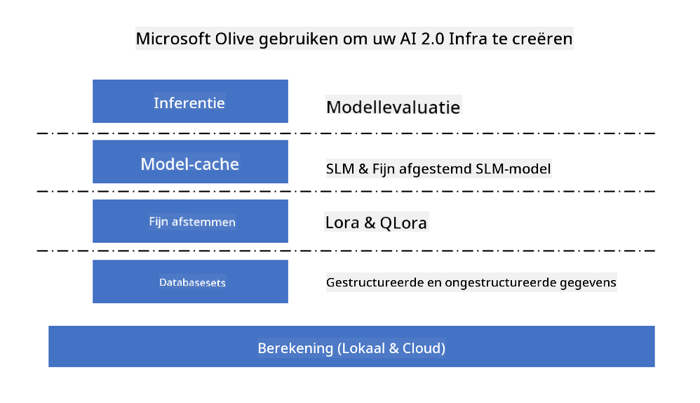
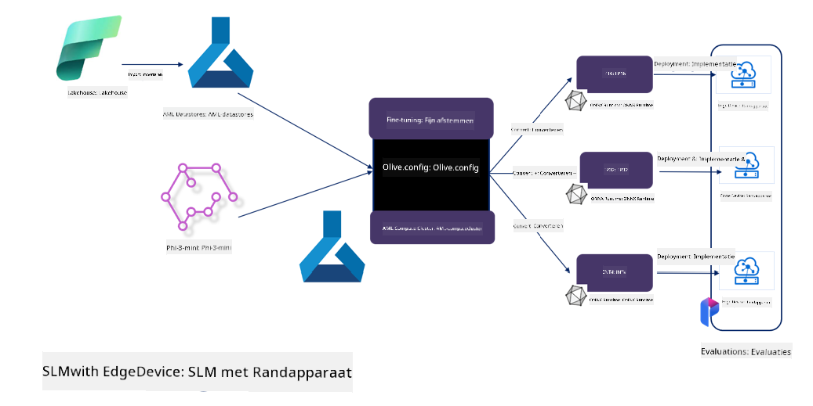

<!--
CO_OP_TRANSLATOR_METADATA:
{
  "original_hash": "5764be88ad2eb4f341e742eb8f14fab1",
  "translation_date": "2025-05-09T20:52:54+00:00",
  "source_file": "md/03.FineTuning/FineTuning_MicrosoftOlive.md",
  "language_code": "nl"
}
-->
# **Fijn afstemmen van Phi-3 met Microsoft Olive**

[Olive](https://github.com/microsoft/OLive?WT.mc_id=aiml-138114-kinfeylo) is een gebruiksvriendelijke hardware-bewuste tool voor modeloptimalisatie die toonaangevende technieken op het gebied van modelcompressie, optimalisatie en compilatie samenbrengt.

Het is ontworpen om het proces van het optimaliseren van machine learning modellen te vereenvoudigen, zodat ze zo efficiënt mogelijk gebruikmaken van specifieke hardware-architecturen.

Of je nu werkt aan cloudgebaseerde applicaties of edge-apparaten, Olive stelt je in staat om je modellen moeiteloos en effectief te optimaliseren.

## Belangrijkste kenmerken:
- Olive verzamelt en automatiseert optimalisatietechnieken voor gewenste hardwaredoelen.
- Geen enkele optimalisatietechniek past in alle scenario’s, daarom maakt Olive uitbreidbaarheid mogelijk door experts in de industrie hun optimalisatie-innovaties te laten integreren.

## Verminder engineering-inspanning:
- Ontwikkelaars moeten vaak meerdere hardware-specifieke toolchains leren en gebruiken om getrainde modellen voor implementatie voor te bereiden en te optimaliseren.
- Olive vereenvoudigt deze ervaring door optimalisatietechnieken voor de gewenste hardware te automatiseren.

## Klaar-voor-gebruik end-to-end optimalisatieoplossing:

Door geïntegreerde technieken samen te stellen en af te stemmen, biedt Olive een uniforme oplossing voor end-to-end optimalisatie.
Het houdt rekening met beperkingen zoals nauwkeurigheid en latency tijdens het optimaliseren van modellen.

## Gebruik van Microsoft Olive voor fijn afstemmen

Microsoft Olive is een zeer gebruiksvriendelijke open source tool voor modeloptimalisatie die zowel fijn afstemmen als referentie kan dekken binnen generatieve kunstmatige intelligentie. Het vereist alleen een eenvoudige configuratie, gecombineerd met het gebruik van open source kleine taalmodellen en bijbehorende runtime-omgevingen (AzureML / lokale GPU, CPU, DirectML). Zo kun je via automatische optimalisatie het model fijn afstemmen of als referentie gebruiken, en het beste model vinden om te implementeren in de cloud of op edge-apparaten. Hiermee kunnen bedrijven hun eigen verticale industriële modellen bouwen, zowel on-premises als in de cloud.



## Phi-3 fijn afstemmen met Microsoft Olive



## Phi-3 Olive voorbeeldcode en voorbeeld
In dit voorbeeld gebruik je Olive om:

- Een LoRA-adapter fijn af te stemmen om zinnen te classificeren in Sad, Joy, Fear, Surprise.
- De adaptergewichten te integreren in het basismodel.
- Het model te optimaliseren en te quantiseren naar int4.

[Voorbeeldcode](../../code/03.Finetuning/olive-ort-example/README.md)

### Microsoft Olive installeren

Microsoft Olive is heel eenvoudig te installeren en kan ook worden geïnstalleerd voor CPU, GPU, DirectML en Azure ML.

```bash
pip install olive-ai
```

Als je een ONNX-model op een CPU wilt draaien, kun je het volgende gebruiken:

```bash
pip install olive-ai[cpu]
```

Wil je een ONNX-model op een GPU draaien, dan kun je het volgende gebruiken:

```python
pip install olive-ai[gpu]
```

Wil je Azure ML gebruiken, dan gebruik je:

```python
pip install git+https://github.com/microsoft/Olive#egg=olive-ai[azureml]
```

**Let op**  
Vereiste OS: Ubuntu 20.04 / 22.04

### **Config.json van Microsoft Olive**

Na installatie kun je verschillende model-specifieke instellingen configureren via het Config-bestand, waaronder data, computing, training, deployment en modelgeneratie.

**1. Data**

Microsoft Olive ondersteunt training op lokale data en clouddata, en dit kan worden ingesteld in de configuratie.

*Instellingen voor lokale data*

Je kunt eenvoudig de dataset instellen die getraind moet worden voor fijn afstemmen, meestal in json-formaat, en aanpassen met een datatemplate. Dit moet worden aangepast op basis van de eisen van het model (bijvoorbeeld aanpassen aan het formaat dat Microsoft Phi-3-mini vereist. Voor andere modellen, raadpleeg de vereiste fijn afstem formaten van die modellen).

```json

    "data_configs": [
        {
            "name": "dataset_default_train",
            "type": "HuggingfaceContainer",
            "load_dataset_config": {
                "params": {
                    "data_name": "json", 
                    "data_files":"dataset/dataset-classification.json",
                    "split": "train"
                }
            },
            "pre_process_data_config": {
                "params": {
                    "dataset_type": "corpus",
                    "text_cols": [
                            "phrase",
                            "tone"
                    ],
                    "text_template": "### Text: {phrase}\n### The tone is:\n{tone}",
                    "corpus_strategy": "join",
                    "source_max_len": 2048,
                    "pad_to_max_len": false,
                    "use_attention_mask": false
                }
            }
        }
    ],
```

**Instellingen voor clouddatasources**

Door de datastore van Azure AI Studio/Azure Machine Learning Service te koppelen, kun je data in de cloud gebruiken. Je kunt verschillende datasources via Microsoft Fabric en Azure Data koppelen aan Azure AI Studio/Azure Machine Learning Service als ondersteuning voor fijn afstemmen.

```json

    "data_configs": [
        {
            "name": "dataset_default_train",
            "type": "HuggingfaceContainer",
            "load_dataset_config": {
                "params": {
                    "data_name": "json", 
                    "data_files": {
                        "type": "azureml_datastore",
                        "config": {
                            "azureml_client": {
                                "subscription_id": "Your Azure Subscrition ID",
                                "resource_group": "Your Azure Resource Group",
                                "workspace_name": "Your Azure ML Workspaces name"
                            },
                            "datastore_name": "workspaceblobstore",
                            "relative_path": "Your train_data.json Azure ML Location"
                        }
                    },
                    "split": "train"
                }
            },
            "pre_process_data_config": {
                "params": {
                    "dataset_type": "corpus",
                    "text_cols": [
                            "Question",
                            "Best Answer"
                    ],
                    "text_template": "<|user|>\n{Question}<|end|>\n<|assistant|>\n{Best Answer}\n<|end|>",
                    "corpus_strategy": "join",
                    "source_max_len": 2048,
                    "pad_to_max_len": false,
                    "use_attention_mask": false
                }
            }
        }
    ],
    
```

**2. Computing configuratie**

Als je lokaal wilt werken, kun je direct lokale dataresources gebruiken. Wil je gebruikmaken van Azure AI Studio / Azure Machine Learning Service, dan moet je de relevante Azure-parameters, zoals de naam van de compute resources, configureren.

```json

    "systems": {
        "aml": {
            "type": "AzureML",
            "config": {
                "accelerators": ["gpu"],
                "hf_token": true,
                "aml_compute": "Your Azure AI Studio / Azure Machine Learning Service Compute Name",
                "aml_docker_config": {
                    "base_image": "Your Azure AI Studio / Azure Machine Learning Service docker",
                    "conda_file_path": "conda.yaml"
                }
            }
        },
        "azure_arc": {
            "type": "AzureML",
            "config": {
                "accelerators": ["gpu"],
                "aml_compute": "Your Azure AI Studio / Azure Machine Learning Service Compute Name",
                "aml_docker_config": {
                    "base_image": "Your Azure AI Studio / Azure Machine Learning Service docker",
                    "conda_file_path": "conda.yaml"
                }
            }
        }
    },
```

***Let op***

Omdat het draait via een container op Azure AI Studio/Azure Machine Learning Service, moet de vereiste omgeving worden geconfigureerd. Dit wordt ingesteld in het conda.yaml environment.

```yaml

name: project_environment
channels:
  - defaults
dependencies:
  - python=3.8.13
  - pip=22.3.1
  - pip:
      - einops
      - accelerate
      - azure-keyvault-secrets
      - azure-identity
      - bitsandbytes
      - datasets
      - huggingface_hub
      - peft
      - scipy
      - sentencepiece
      - torch>=2.2.0
      - transformers
      - git+https://github.com/microsoft/Olive@jiapli/mlflow_loading_fix#egg=olive-ai[gpu]
      - --extra-index-url https://aiinfra.pkgs.visualstudio.com/PublicPackages/_packaging/ORT-Nightly/pypi/simple/ 
      - ort-nightly-gpu==1.18.0.dev20240307004
      - --extra-index-url https://aiinfra.pkgs.visualstudio.com/PublicPackages/_packaging/onnxruntime-genai/pypi/simple/
      - onnxruntime-genai-cuda

    

```

**3. Kies je SLM**

Je kunt het model direct van Hugging Face gebruiken, of het combineren met de Model Catalog van Azure AI Studio / Azure Machine Learning om het model te selecteren. In het onderstaande codevoorbeeld gebruiken we Microsoft Phi-3-mini als voorbeeld.

Als je het model lokaal hebt, kun je deze methode gebruiken:

```json

    "input_model":{
        "type": "PyTorchModel",
        "config": {
            "hf_config": {
                "model_name": "model-cache/microsoft/phi-3-mini",
                "task": "text-generation",
                "model_loading_args": {
                    "trust_remote_code": true
                }
            }
        }
    },
```

Wil je een model gebruiken van Azure AI Studio / Azure Machine Learning Service, dan gebruik je deze methode:

```json

    "input_model":{
        "type": "PyTorchModel",
        "config": {
            "model_path": {
                "type": "azureml_registry_model",
                "config": {
                    "name": "microsoft/Phi-3-mini-4k-instruct",
                    "registry_name": "azureml-msr",
                    "version": "11"
                }
            },
             "model_file_format": "PyTorch.MLflow",
             "hf_config": {
                "model_name": "microsoft/Phi-3-mini-4k-instruct",
                "task": "text-generation",
                "from_pretrained_args": {
                    "trust_remote_code": true
                }
            }
        }
    },
```

**Let op:**  
We moeten integreren met Azure AI Studio / Azure Machine Learning Service, dus bij het instellen van het model moet je letten op de versienummers en gerelateerde namen.

Alle modellen op Azure moeten worden ingesteld op PyTorch.MLflow.

Je hebt een Hugging Face-account nodig en moet de sleutel koppelen aan de Key-waarde van Azure AI Studio / Azure Machine Learning.

**4. Algoritme**

Microsoft Olive verpakt de Lora en QLora fijn afstemmingsalgoritmes heel goed. Je hoeft alleen enkele relevante parameters te configureren. Hier gebruik ik QLora als voorbeeld.

```json
        "lora": {
            "type": "LoRA",
            "config": {
                "target_modules": [
                    "o_proj",
                    "qkv_proj"
                ],
                "double_quant": true,
                "lora_r": 64,
                "lora_alpha": 64,
                "lora_dropout": 0.1,
                "train_data_config": "dataset_default_train",
                "eval_dataset_size": 0.3,
                "training_args": {
                    "seed": 0,
                    "data_seed": 42,
                    "per_device_train_batch_size": 1,
                    "per_device_eval_batch_size": 1,
                    "gradient_accumulation_steps": 4,
                    "gradient_checkpointing": false,
                    "learning_rate": 0.0001,
                    "num_train_epochs": 3,
                    "max_steps": 10,
                    "logging_steps": 10,
                    "evaluation_strategy": "steps",
                    "eval_steps": 187,
                    "group_by_length": true,
                    "adam_beta2": 0.999,
                    "max_grad_norm": 0.3
                }
            }
        },
```

Wil je quantisatie toepassen, dan ondersteunt de hoofdbranch van Microsoft Olive al de onnxruntime-genai methode. Je kunt dit instellen op basis van je wensen:

1. Adaptergewichten samenvoegen in het basismodel  
2. Het model converteren naar een onnx-model met de vereiste precisie via ModelBuilder

zoals converteren naar gequantiseerd INT4

```json

        "merge_adapter_weights": {
            "type": "MergeAdapterWeights"
        },
        "builder": {
            "type": "ModelBuilder",
            "config": {
                "precision": "int4"
            }
        }
```

**Let op**  
- Bij gebruik van QLoRA wordt de quantisatieconversie van ONNXRuntime-genai momenteel niet ondersteund.  
- Het is belangrijk te benadrukken dat je bovenstaande stappen naar eigen behoefte kunt instellen. Het is niet noodzakelijk om alle stappen volledig te configureren. Afhankelijk van je wensen kun je ook direct de algoritmestappen gebruiken zonder fijn afstemmen. Uiteindelijk moet je wel de relevante engines configureren.

```json

    "engine": {
        "log_severity_level": 0,
        "host": "aml",
        "target": "aml",
        "search_strategy": false,
        "execution_providers": ["CUDAExecutionProvider"],
        "cache_dir": "../model-cache/models/phi3-finetuned/cache",
        "output_dir" : "../model-cache/models/phi3-finetuned"
    }
```

**5. Fijn afstemmen voltooid**

Voer op de commandoregel uit in de map waar olive-config.json staat:

```bash
olive run --config olive-config.json  
```

**Disclaimer**:  
Dit document is vertaald met behulp van de AI-vertalingsdienst [Co-op Translator](https://github.com/Azure/co-op-translator). Hoewel we streven naar nauwkeurigheid, dient u er rekening mee te houden dat geautomatiseerde vertalingen fouten of onnauwkeurigheden kunnen bevatten. Het originele document in de oorspronkelijke taal moet als de gezaghebbende bron worden beschouwd. Voor cruciale informatie wordt professionele menselijke vertaling aanbevolen. Wij zijn niet aansprakelijk voor eventuele misverstanden of verkeerde interpretaties die voortvloeien uit het gebruik van deze vertaling.