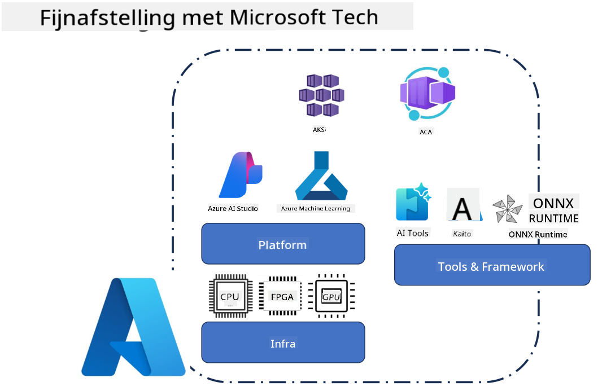
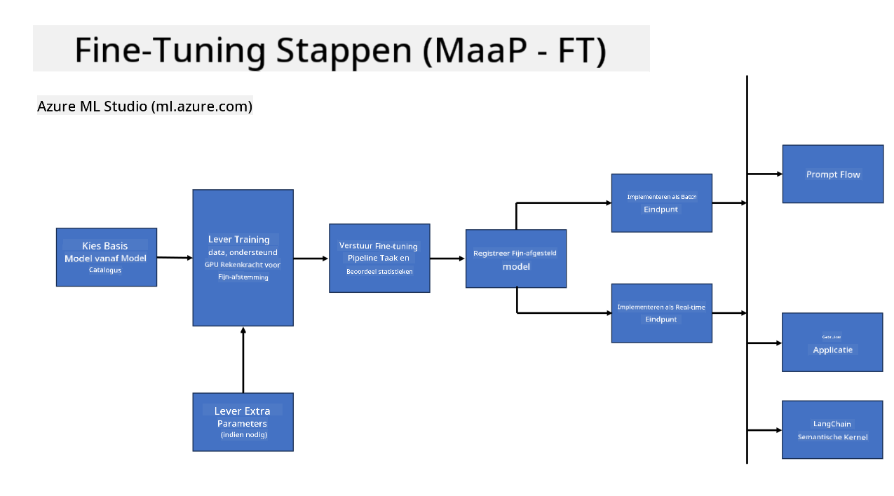
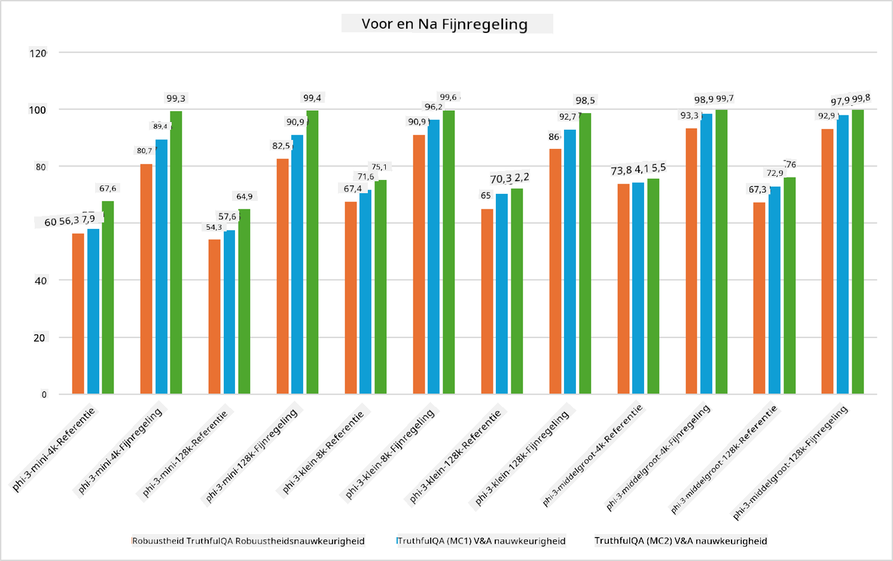

<!--
CO_OP_TRANSLATOR_METADATA:
{
  "original_hash": "cb5648935f63edc17e95ce38f23adc32",
  "translation_date": "2025-05-09T21:56:20+00:00",
  "source_file": "md/03.FineTuning/FineTuning_Scenarios.md",
  "language_code": "nl"
}
-->
## Fine-tuning scenario's

**Platform** Dit omvat verschillende technologieën zoals Azure AI Foundry, Azure Machine Learning, AI Tools, Kaito en ONNX Runtime.

**Infrastructuur** Dit omvat de CPU en FPGA, die essentieel zijn voor het fine-tuning proces. Ik laat je de iconen zien van elk van deze technologieën.

**Tools & Framework** Dit omvat ONNX Runtime en ONNX Runtime. Ik laat je de iconen zien van elk van deze technologieën.  
[Iconen voor ONNX Runtime en ONNX Runtime invoegen]

Het fine-tuning proces met Microsoft-technologieën bestaat uit verschillende componenten en tools. Door deze technologieën te begrijpen en te gebruiken, kunnen we onze toepassingen effectief fine-tunen en betere oplossingen creëren.

## Model als Service

Fine-tune het model met hosted fine-tuning, zonder dat je zelf compute hoeft te creëren en beheren.

Serverless fine-tuning is beschikbaar voor Phi-3-mini en Phi-3-medium modellen, waardoor ontwikkelaars snel en eenvoudig de modellen kunnen aanpassen voor cloud- en edge-scenario’s zonder dat ze zelf compute hoeven te regelen. We hebben ook aangekondigd dat Phi-3-small nu beschikbaar is via onze Models-as-a-Service aanbieding, zodat ontwikkelaars snel en makkelijk kunnen starten met AI-ontwikkeling zonder de onderliggende infrastructuur te hoeven beheren.

## Model als Platform

Gebruikers beheren hun eigen compute om hun modellen te fine-tunen.

[Fine Tuning Voorbeeld](https://github.com/Azure/azureml-examples/blob/main/sdk/python/foundation-models/system/finetune/chat-completion/chat-completion.ipynb)

## Fine-tuning scenario's

| | | | | | | |
|-|-|-|-|-|-|-|
|Scenario|LoRA|QLoRA|PEFT|DeepSpeed|ZeRO|DORA|
|Aanpassen van voorgetrainde LLM’s aan specifieke taken of domeinen|Ja|Ja|Ja|Ja|Ja|Ja|
|Fine-tuning voor NLP-taken zoals tekstclassificatie, named entity recognition en machinevertaling|Ja|Ja|Ja|Ja|Ja|Ja|
|Fine-tuning voor QA-taken|Ja|Ja|Ja|Ja|Ja|Ja|
|Fine-tuning voor het genereren van mensachtige antwoorden in chatbots|Ja|Ja|Ja|Ja|Ja|Ja|
|Fine-tuning voor het creëren van muziek, kunst of andere creatieve vormen|Ja|Ja|Ja|Ja|Ja|Ja|
|Verminderen van computationele en financiële kosten|Ja|Ja|Nee|Ja|Ja|Nee|
|Verminderen van geheugengebruik|Nee|Ja|Nee|Ja|Ja|Ja|
|Gebruik van minder parameters voor efficiënte fine-tuning|Nee|Ja|Ja|Nee|Nee|Ja|
|Geheugenefficiënte vorm van data parallelisme die toegang geeft tot het totale GPU-geheugen van alle beschikbare GPU-apparaten|Nee|Nee|Nee|Ja|Ja|Ja|

## Voorbeelden van fine-tuning prestaties

**Disclaimer**:  
Dit document is vertaald met behulp van de AI-vertalingsdienst [Co-op Translator](https://github.com/Azure/co-op-translator). Hoewel we streven naar nauwkeurigheid, dient u er rekening mee te houden dat automatische vertalingen fouten of onnauwkeurigheden kunnen bevatten. Het originele document in de oorspronkelijke taal moet als de gezaghebbende bron worden beschouwd. Voor cruciale informatie wordt professionele menselijke vertaling aanbevolen. Wij zijn niet aansprakelijk voor eventuele misverstanden of verkeerde interpretaties die voortvloeien uit het gebruik van deze vertaling.