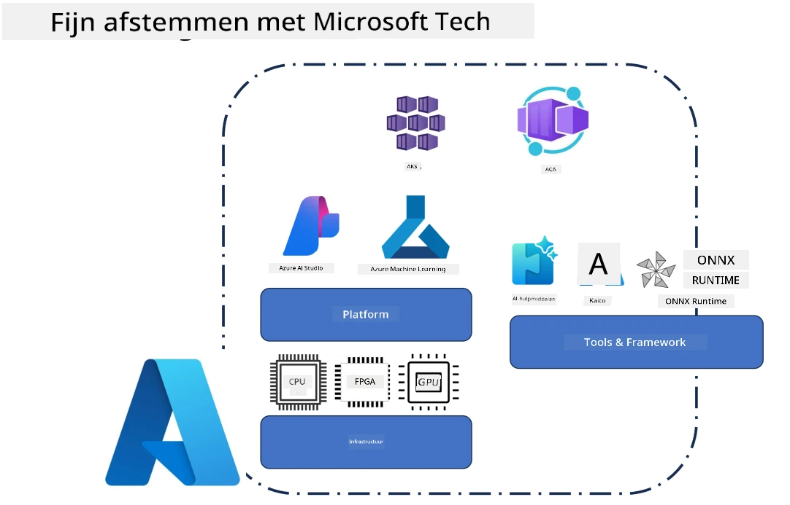
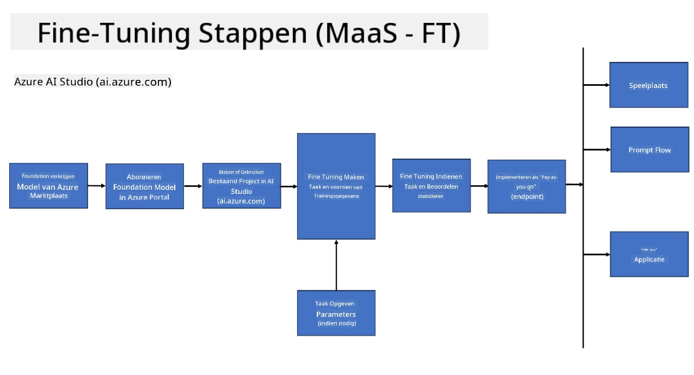
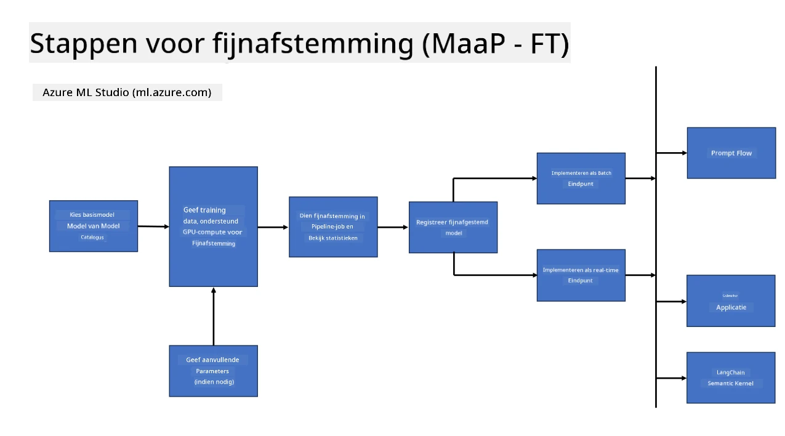
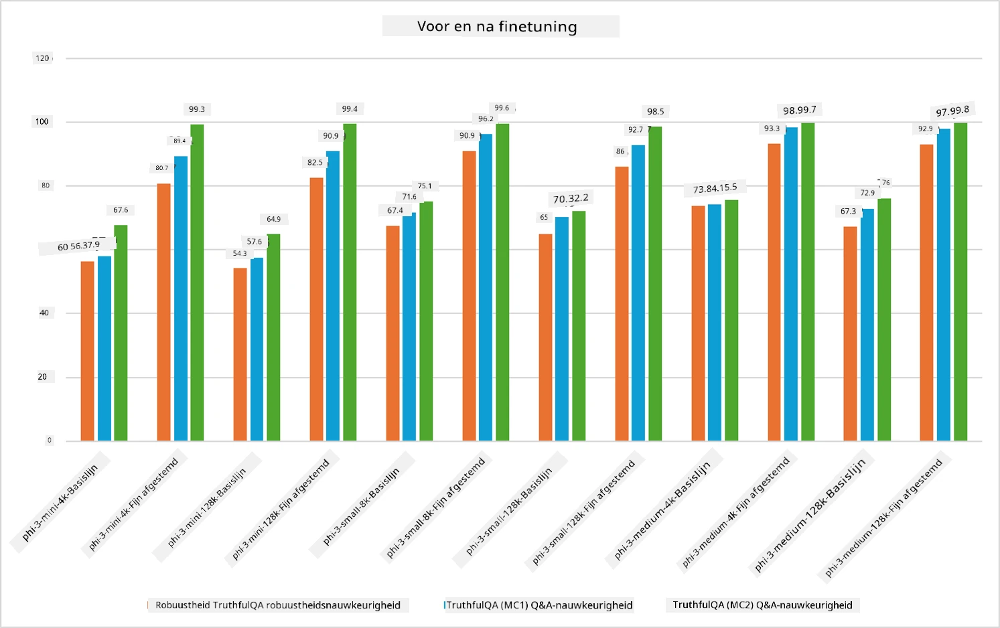

## Fine Tuning Scenario's

Deze sectie geeft een overzicht van fine-tuning scenario's in Microsoft Foundry- en Azure-omgevingen, inclusief implementatiemodellen, infrastructuurlagen en veelgebruikte optimalisatietechnieken.

**Platform**  
Dit omvat beheerde services zoals Microsoft Foundry (voorheen Azure AI Foundry) en Azure Machine Learning, die modelbeheer, orkestratie, experimenttracking en implementatieworkflows bieden.

**Infrastructuur**  
Fine-tuning vereist schaalbare computerbronnen. In Azure-omgevingen omvat dit doorgaans op GPU gebaseerde virtuele machines en CPU-bronnen voor lichte workloads, samen met schaalbare opslag voor datasets en checkpoints.

**Tools & Framework**  
Fine-tuning workflows vertrouwen vaak op frameworks en optimalisatiebibliotheken zoals Hugging Face Transformers, DeepSpeed en PEFT (Parameter-Efficient Fine-Tuning).

Het fine-tuning proces met Microsoft-technologieën beslaat platformservices, compute-infrastructuur en trainingsframeworks. Door te begrijpen hoe deze componenten samenwerken, kunnen ontwikkelaars foundation models efficiënt aanpassen aan specifieke taken en productiescenario's.

## Model als Service

Fijn afstemmen van het model met gehoste fine-tuning, zonder dat er compute hoeft te worden aangemaakt en beheerd.

Serverloze fine-tuning is nu beschikbaar voor de Phi-3, Phi-3.5 en Phi-4 modelfamilies, waardoor ontwikkelaars snel en eenvoudig modellen kunnen aanpassen voor cloud- en edge-scenario's zonder zelf voor compute te hoeven zorgen.

## Model als Platform

Gebruikers beheren hun eigen compute om hun modellen te fine-tunen.

[Fine Tuning Voorbeeld](https://github.com/Azure/azureml-examples/blob/main/sdk/python/foundation-models/system/finetune/chat-completion/chat-completion.ipynb)

## Vergelijking Fine-Tuning Technieken

|Scenario|LoRA|QLoRA|PEFT|DeepSpeed|ZeRO|DoRA|
|---|---|---|---|---|---|---|
|Aanpassen van voorgetrainde LLM's aan specifieke taken of domeinen|Ja|Ja|Ja|Ja|Ja|Ja|
|Fine-tuning voor NLP-taken zoals tekstanalyse, named entity recognition en machinevertaling|Ja|Ja|Ja|Ja|Ja|Ja|
|Fine-tuning voor QA-taken|Ja|Ja|Ja|Ja|Ja|Ja|
|Fine-tuning voor het genereren van mensachtige reacties in chatbots|Ja|Ja|Ja|Ja|Ja|Ja|
|Fine-tuning voor het genereren van muziek, kunst of andere creatieve vormen|Ja|Ja|Ja|Ja|Ja|Ja|
|Verminderen van computationele en financiële kosten|Ja|Ja|Ja|Ja|Ja|Ja|
|Verminderen van geheugengebruik|Ja|Ja|Ja|Ja|Ja|Ja|
|Gebruik van minder parameters voor efficiënte fine-tuning|Ja|Ja|Ja|Nee|Nee|Ja|
|Geheugenefficiënte vorm van dataparallelisme die toegang geeft tot het gecombineerde GPU-geheugen van alle beschikbare GPU-apparaten|Nee|Nee|Nee|Ja|Ja|Nee|

> [!NOTE]
> LoRA, QLoRA, PEFT en DoRA zijn parameter-efficiënte fine-tuning methoden, terwijl DeepSpeed en ZeRO zich richten op gedistribueerde training en geheugoptimalisatie.

## Voorbeelden van Fine Tuning Prestaties

---

<!-- CO-OP TRANSLATOR DISCLAIMER START -->
**Disclaimer**:
Dit document is vertaald met behulp van de AI-vertalingsdienst [Co-op Translator](https://github.com/Azure/co-op-translator). Hoewel we streven naar nauwkeurigheid, dient u er rekening mee te houden dat geautomatiseerde vertalingen fouten of onnauwkeurigheden kunnen bevatten. Het oorspronkelijke document in de oorspronkelijke taal moet worden beschouwd als de autoritatieve bron. Voor cruciale informatie wordt professionele menselijke vertaling aanbevolen. Wij zijn niet aansprakelijk voor misverstanden of verkeerde interpretaties die voortvloeien uit het gebruik van deze vertaling.
<!-- CO-OP TRANSLATOR DISCLAIMER END -->