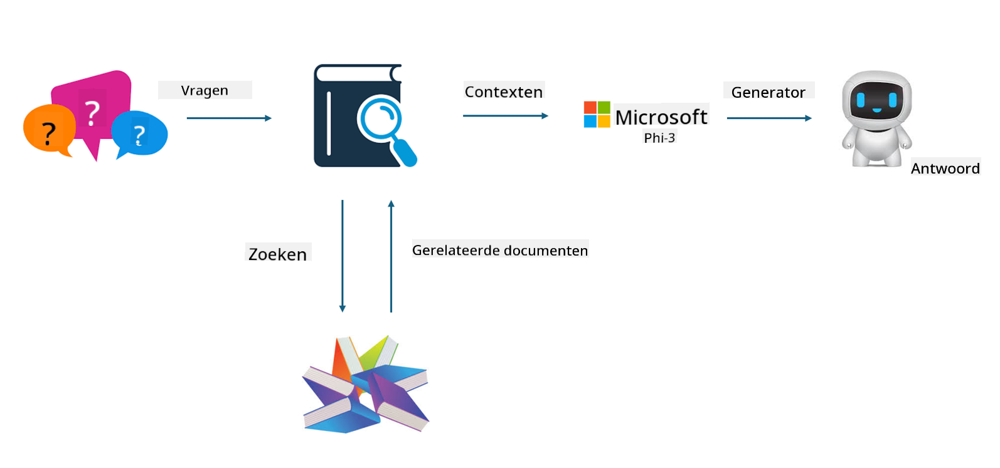

<!--
CO_OP_TRANSLATOR_METADATA:
{
  "original_hash": "e4e010400c2918557b36bb932a14004c",
  "translation_date": "2025-07-17T09:30:07+00:00",
  "source_file": "md/03.FineTuning/FineTuning_vs_RAG.md",
  "language_code": "nl"
}
-->
## Finetuning vs RAG

## Retrieval Augmented Generation

RAG is data-opvraging + tekstgeneratie. De gestructureerde en ongestructureerde data van de onderneming worden opgeslagen in de vector database. Bij het zoeken naar relevante inhoud worden de relevante samenvatting en content gevonden om een context te vormen, waarna de tekstaanvulcapaciteit van LLM/SLM wordt gecombineerd om content te genereren.

## RAG Proces

## Fine-tuning
Fine-tuning is gebaseerd op het verbeteren van een bepaald model. Het hoeft niet te beginnen met het modelalgoritme, maar er moet wel continu data worden verzameld. Als je meer nauwkeurige terminologie en taalgebruik in industriële toepassingen wilt, is fine-tuning de betere keuze. Maar als je data vaak verandert, kan fine-tuning ingewikkeld worden.

## Hoe te kiezen
Als ons antwoord externe data moet bevatten, is RAG de beste keuze.

Als je stabiele en precieze industriële kennis wilt leveren, is fine-tuning een goede optie. RAG richt zich op het ophalen van relevante content, maar raakt niet altijd de gespecialiseerde nuances.

Fine-tuning vereist een hoogwaardige dataset, en als het maar om een kleine hoeveelheid data gaat, zal het weinig verschil maken. RAG is flexibeler.  
Fine-tuning is een black box, een soort metafysica, en het is moeilijk om het interne mechanisme te begrijpen. Maar RAG maakt het makkelijker om de bron van de data te vinden, waardoor hallucinaties of inhoudelijke fouten effectief kunnen worden aangepast en er meer transparantie wordt geboden.

**Disclaimer**:  
Dit document is vertaald met behulp van de AI-vertalingsdienst [Co-op Translator](https://github.com/Azure/co-op-translator). Hoewel we streven naar nauwkeurigheid, dient u er rekening mee te houden dat geautomatiseerde vertalingen fouten of onnauwkeurigheden kunnen bevatten. Het originele document in de oorspronkelijke taal moet als de gezaghebbende bron worden beschouwd. Voor cruciale informatie wordt professionele menselijke vertaling aanbevolen. Wij zijn niet aansprakelijk voor eventuele misverstanden of verkeerde interpretaties die voortvloeien uit het gebruik van deze vertaling.