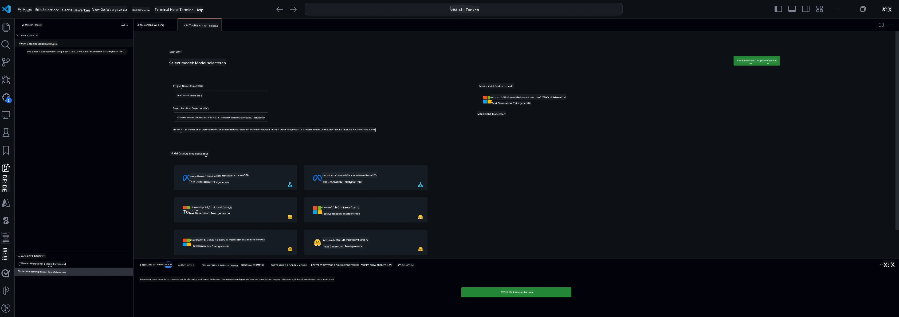

## Welkom bij AI Toolkit voor VS Code

[AI Toolkit voor VS Code](https://github.com/microsoft/vscode-ai-toolkit/tree/main) brengt verschillende modellen samen uit de Azure AI Studio Catalogus en andere catalogi zoals Hugging Face. De toolkit vereenvoudigt de veelvoorkomende ontwikkeltaken voor het bouwen van AI-apps met generatieve AI-tools en modellen door:
- Beginnen met modelontdekking en een speelveld.
- Model fine-tuning en inferentie met lokale computerbronnen.
- Externe fine-tuning en inferentie met Azure-resources.

[Installeer AI Toolkit voor VSCode](https://marketplace.visualstudio.com/items?itemName=ms-windows-ai-studio.windows-ai-studio)




**[Private Preview]** Eén-klik provisioning voor Azure Container Apps om model fine-tuning en inferentie in de cloud uit te voeren.

Laten we nu aan de slag gaan met je AI-app ontwikkeling:

- [Welkom bij AI Toolkit voor VS Code](../../../../md/03.FineTuning)
- [Lokale ontwikkeling](../../../../md/03.FineTuning)
  - [Voorbereidingen](../../../../md/03.FineTuning)
  - [Conda activeren](../../../../md/03.FineTuning)
  - [Alleen basis model fine-tuning](../../../../md/03.FineTuning)
  - [Model fine-tuning en inferentie](../../../../md/03.FineTuning)
  - [Model Fine-tuning](../../../../md/03.FineTuning)
  - [Microsoft Olive](../../../../md/03.FineTuning)
  - [Fine Tuning Voorbeelden en Bronnen](../../../../md/03.FineTuning)
- [**\[Private Preview\]** Externe ontwikkeling](../../../../md/03.FineTuning)
  - [Vereisten](../../../../md/03.FineTuning)
  - [Een extern ontwikkelproject opzetten](../../../../md/03.FineTuning)
  - [Azure-resources provisionen](../../../../md/03.FineTuning)
  - [\[Optioneel\] Huggingface Token toevoegen aan het Azure Container App Secret](../../../../md/03.FineTuning)
  - [Fine-tuning uitvoeren](../../../../md/03.FineTuning)
  - [Inference Endpoint provisionen](../../../../md/03.FineTuning)
  - [Inference Endpoint uitrollen](../../../../md/03.FineTuning)
  - [Geavanceerd gebruik](../../../../md/03.FineTuning)

## Lokale ontwikkeling
### Voorbereidingen

1. Zorg dat de NVIDIA-driver geïnstalleerd is op de host.
2. Voer `huggingface-cli login` uit als je HF gebruikt voor datasetgebruik.
3. Uitleg over `Olive` sleutelinstellingen voor alles wat het geheugenverbruik beïnvloedt.

### Conda activeren
Omdat we een WSL-omgeving gebruiken die gedeeld wordt, moet je de conda-omgeving handmatig activeren. Na deze stap kun je fine-tuning of inferentie uitvoeren.

```bash
conda activate [conda-env-name] 
```

### Alleen basis model fine-tuning
Als je alleen het basismodel wilt proberen zonder fine-tuning, kun je dit commando uitvoeren nadat je conda hebt geactiveerd.

```bash
cd inference

# Web browser interface allows to adjust a few parameters like max new token length, temperature and so on.
# User has to manually open the link (e.g. http://0.0.0.0:7860) in a browser after gradio initiates the connections.
python gradio_chat.py --baseonly
```

### Model fine-tuning en inferentie

Zodra de werkruimte geopend is in een dev container, open je een terminal (de standaardmap is de projectroot) en voer je het onderstaande commando uit om een LLM te fine-tunen op de geselecteerde dataset.

```bash
python finetuning/invoke_olive.py 
```

Checkpoints en het uiteindelijke model worden opgeslagen in de map `models`.

Voer daarna inferentie uit met het fijn-afgestelde model via chats in een `console`, `webbrowser` of `prompt flow`.

```bash
cd inference

# Console interface.
python console_chat.py

# Web browser interface allows to adjust a few parameters like max new token length, temperature and so on.
# User has to manually open the link (e.g. http://127.0.0.1:7860) in a browser after gradio initiates the connections.
python gradio_chat.py
```

Voor het gebruik van `prompt flow` in VS Code, zie deze [Quick Start](https://microsoft.github.io/promptflow/how-to-guides/quick-start.html).

### Model Fine-tuning

Download vervolgens het volgende model, afhankelijk van de beschikbaarheid van een GPU op je apparaat.

Om een lokale fine-tuning sessie te starten met QLoRA, kies je een model uit onze catalogus dat je wilt fine-tunen.
| Platform(en) | GPU beschikbaar | Modelnaam | Grootte (GB) |
|---------|---------|--------|--------|
| Windows | Ja | Phi-3-mini-4k-**directml**-int4-awq-block-128-onnx | 2.13GB |
| Linux | Ja | Phi-3-mini-4k-**cuda**-int4-onnx | 2.30GB |
| Windows<br>Linux | Nee | Phi-3-mini-4k-**cpu**-int4-rtn-block-32-acc-level-4-onnx | 2.72GB |

**_Opmerking_** Je hebt geen Azure-account nodig om de modellen te downloaden.

Het Phi3-mini (int4) model is ongeveer 2GB-3GB groot. Afhankelijk van je netwerksnelheid kan het enkele minuten duren om te downloaden.

Begin met het kiezen van een projectnaam en locatie.
Selecteer vervolgens een model uit de modelcatalogus. Je wordt gevraagd om de projecttemplate te downloaden. Daarna kun je op "Configure Project" klikken om verschillende instellingen aan te passen.

### Microsoft Olive

We gebruiken [Olive](https://microsoft.github.io/Olive/why-olive.html) om QLoRA fine-tuning uit te voeren op een PyTorch-model uit onze catalogus. Alle instellingen zijn vooraf ingesteld met standaardwaarden om het fine-tuning proces lokaal te optimaliseren met efficiënt geheugenverbruik, maar ze kunnen aangepast worden aan jouw situatie.

### Fine Tuning Voorbeelden en Bronnen

- [Fine tuning Beginnershandleiding](https://learn.microsoft.com/windows/ai/toolkit/toolkit-fine-tune)
- [Fine tuning met een HuggingFace Dataset](https://github.com/microsoft/vscode-ai-toolkit/blob/main/archive/walkthrough-hf-dataset.md)
- [Fine tuning met een Simpele Dataset](https://github.com/microsoft/vscode-ai-toolkit/blob/main/archive/walkthrough-simple-dataset.md)

## **[Private Preview]** Externe ontwikkeling

### Vereisten

1. Om model fine-tuning uit te voeren in je externe Azure Container App-omgeving, zorg dat je abonnement voldoende GPU-capaciteit heeft. Dien een [supportticket](https://azure.microsoft.com/support/create-ticket/) in om de benodigde capaciteit voor je applicatie aan te vragen. [Meer info over GPU-capaciteit](https://learn.microsoft.com/azure/container-apps/workload-profiles-overview)
2. Als je een privé dataset op HuggingFace gebruikt, zorg dan dat je een [HuggingFace-account](https://huggingface.co/?WT.mc_id=aiml-137032-kinfeylo) hebt en [genereer een toegangstoken](https://huggingface.co/docs/hub/security-tokens?WT.mc_id=aiml-137032-kinfeylo)
3. Schakel de feature flag Remote Fine-tuning en Inference in de AI Toolkit voor VS Code in
   1. Open de VS Code-instellingen via *Bestand -> Voorkeuren -> Instellingen*.
   2. Ga naar *Extensies* en selecteer *AI Toolkit*.
   3. Vink de optie *"Enable Remote Fine-tuning And Inference"* aan.
   4. Herstart VS Code om de wijziging door te voeren.

- [Remote Fine tuning](https://github.com/microsoft/vscode-ai-toolkit/blob/main/archive/remote-finetuning.md)

### Een extern ontwikkelproject opzetten
1. Voer het commandopalet `AI Toolkit: Focus on Resource View` uit.
2. Ga naar *Model Fine-tuning* om toegang te krijgen tot de modelcatalogus. Geef je project een naam en kies de locatie op je machine. Klik daarna op de knop *"Configure Project"*.
3. Projectconfiguratie
    1. Schakel de optie *"Fine-tune locally"* niet in.
    2. De Olive-configuratie-instellingen verschijnen met vooraf ingestelde standaardwaarden. Pas deze aan en vul ze in waar nodig.
    3. Ga verder met *Generate Project*. Deze stap maakt gebruik van WSL en zet een nieuwe Conda-omgeving op, ter voorbereiding op toekomstige updates met Dev Containers.
4. Klik op *"Relaunch Window In Workspace"* om je externe ontwikkelproject te openen.

> **Opmerking:** Het project werkt momenteel ofwel lokaal ofwel extern binnen de AI Toolkit voor VS Code. Als je tijdens het aanmaken van het project *"Fine-tune locally"* kiest, werkt het uitsluitend in WSL zonder externe ontwikkelmogelijkheden. Als je *"Fine-tune locally"* niet inschakelt, is het project beperkt tot de externe Azure Container App-omgeving.

### Azure-resources provisionen
Om te beginnen moet je de Azure-resource voor externe fine-tuning provisionen. Doe dit door het commando `AI Toolkit: Provision Azure Container Apps job for fine-tuning` uit te voeren vanuit het commandopalet.

Volg de voortgang van de provisioning via de link die in het outputkanaal wordt weergegeven.

### [Optioneel] Huggingface Token toevoegen aan het Azure Container App Secret
Als je een privé HuggingFace dataset gebruikt, stel dan je HuggingFace-token in als omgevingsvariabele om handmatige login op de Hugging Face Hub te voorkomen.
Dit kan met het commando `AI Toolkit: Add Azure Container Apps Job secret for fine-tuning`. Hiermee kun je de geheime naam instellen als [`HF_TOKEN`](https://huggingface.co/docs/huggingface_hub/package_reference/environment_variables#hftoken) en je Hugging Face-token als geheime waarde gebruiken.

### Fine-tuning uitvoeren
Om de externe fine-tuning job te starten, voer je het commando `AI Toolkit: Run fine-tuning` uit.

Om de systeem- en consolelogs te bekijken, kun je de Azure-portal bezoeken via de link in het outputpaneel (meer stappen bij [Logs bekijken en opvragen in Azure](https://aka.ms/ai-toolkit/remote-provision#view-and-query-logs-on-azure)). Of je bekijkt de consolelogs direct in het VSCode outputpaneel door het commando `AI Toolkit: Show the running fine-tuning job streaming logs` uit te voeren.  
> **Opmerking:** De job kan in de wachtrij staan vanwege onvoldoende resources. Als de log niet wordt weergegeven, voer dan het commando `AI Toolkit: Show the running fine-tuning job streaming logs` uit, wacht even en voer het commando opnieuw uit om opnieuw verbinding te maken met de streaming log.

Tijdens dit proces wordt QLoRA gebruikt voor fine-tuning en worden LoRA-adapters aangemaakt voor het model om te gebruiken tijdens inferentie.
De resultaten van de fine-tuning worden opgeslagen in Azure Files.

### Inference Endpoint provisionen
Nadat de adapters getraind zijn in de externe omgeving, gebruik je een eenvoudige Gradio-applicatie om met het model te communiceren.
Net als bij het fine-tuning proces moet je de Azure-resources voor externe inferentie opzetten door het commando `AI Toolkit: Provision Azure Container Apps for inference` uit te voeren vanuit het commandopalet.

Standaard moeten het abonnement en de resourcegroep voor inferentie overeenkomen met die van de fine-tuning. De inferentie maakt gebruik van dezelfde Azure Container App-omgeving en heeft toegang tot het model en de modeladapter die zijn opgeslagen in Azure Files, welke tijdens de fine-tuning stap zijn gegenereerd.

### Inference Endpoint uitrollen
Als je de inferentiecode wilt aanpassen of het inferentiemodel wilt herladen, voer dan het commando `AI Toolkit: Deploy for inference` uit. Dit synchroniseert je nieuwste code met Azure Container App en herstart de replica.

Zodra de uitrol succesvol is afgerond, kun je de inference API openen door te klikken op de knop "*Go to Inference Endpoint*" die in de VSCode-melding verschijnt. Of je vindt het web API endpoint onder `ACA_APP_ENDPOINT` in `./infra/inference.config.json` en in het outputpaneel. Je bent nu klaar om het model te evalueren via dit endpoint.

### Geavanceerd gebruik
Voor meer informatie over externe ontwikkeling met AI Toolkit, raadpleeg de documentatie over [Fine-Tuning modellen op afstand](https://aka.ms/ai-toolkit/remote-provision) en [Inferentie met het fijn-afgestelde model](https://aka.ms/ai-toolkit/remote-inference).

**Disclaimer**:  
Dit document is vertaald met behulp van de AI-vertalingsdienst [Co-op Translator](https://github.com/Azure/co-op-translator). Hoewel we streven naar nauwkeurigheid, dient u er rekening mee te houden dat geautomatiseerde vertalingen fouten of onnauwkeurigheden kunnen bevatten. Het originele document in de oorspronkelijke taal moet als de gezaghebbende bron worden beschouwd. Voor cruciale informatie wordt professionele menselijke vertaling aanbevolen. Wij zijn niet aansprakelijk voor eventuele misverstanden of verkeerde interpretaties die voortvloeien uit het gebruik van deze vertaling.