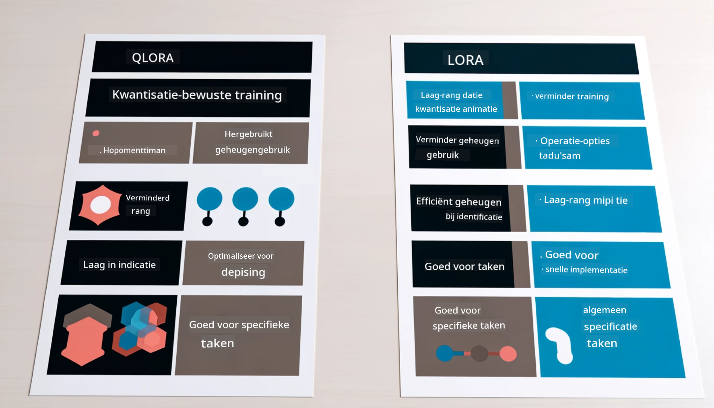

<!--
CO_OP_TRANSLATOR_METADATA:
{
  "original_hash": "743d7e9cb9c4e8ea642d77bee657a7fa",
  "translation_date": "2025-07-17T09:58:21+00:00",
  "source_file": "md/03.FineTuning/LetPhi3gotoIndustriy.md",
  "language_code": "nl"
}
-->
# **Laat Phi-3 een industrie-expert worden**

Om het Phi-3 model in een industrie toe te passen, moet je bedrijfsspecifieke data aan het Phi-3 model toevoegen. We hebben twee verschillende opties: de eerste is RAG (Retrieval Augmented Generation) en de tweede is Fine Tuning.

## **RAG vs Fine-Tuning**

### **Retrieval Augmented Generation**

RAG is data-opvraging + tekstgeneratie. De gestructureerde en ongestructureerde data van het bedrijf worden opgeslagen in de vector database. Bij het zoeken naar relevante inhoud worden de relevante samenvatting en content gevonden om een context te vormen, en wordt de tekstvoltooiingscapaciteit van LLM/SLM gecombineerd om content te genereren.

### **Fine-tuning**

Fine-tuning is gebaseerd op het verbeteren van een bepaald model. Het hoeft niet te beginnen met het modelalgoritme, maar er moet wel continu data worden verzameld. Als je meer precieze terminologie en taalgebruik in industriële toepassingen wilt, is fine-tuning de betere keuze. Maar als je data vaak verandert, kan fine-tuning ingewikkeld worden.

### **Hoe te kiezen**

1. Als ons antwoord externe data moet bevatten, is RAG de beste keuze.

2. Als je stabiele en precieze industriële kennis wilt leveren, is fine-tuning een goede keuze. RAG haalt relevante content op, maar mist soms de gespecialiseerde nuances.

3. Fine-tuning vereist een dataset van hoge kwaliteit, en als het maar om een kleine hoeveelheid data gaat, maakt het weinig verschil. RAG is flexibeler.

4. Fine-tuning is een black box, een soort metafysica, en het is moeilijk om het interne mechanisme te begrijpen. RAG maakt het makkelijker om de bron van de data te vinden, waardoor hallucinaties of fouten in de content effectiever kunnen worden aangepast en er meer transparantie is.

### **Scenario’s**

1. Verticale industrieën die specifieke vaktermen en uitdrukkingen vereisen, ***Fine-tuning*** is dan de beste keuze.

2. QA-systemen, waarbij verschillende kennispunten worden samengevoegd, ***RAG*** is dan de beste keuze.

3. De combinatie van geautomatiseerde bedrijfsprocessen ***RAG + Fine-tuning*** is de beste keuze.

## **Hoe RAG te gebruiken**

Een vector database is een verzameling data die wiskundig wordt opgeslagen. Vector databases maken het makkelijker voor machine learning modellen om eerdere input te onthouden, waardoor machine learning kan worden ingezet voor toepassingen zoals zoeken, aanbevelingen en tekstgeneratie. Data kan worden geïdentificeerd op basis van gelijkenis in plaats van exacte overeenkomsten, waardoor computermodellen de context van de data beter begrijpen.

De vector database is de sleutel tot het realiseren van RAG. We kunnen data omzetten naar vectoropslag via vector modellen zoals text-embedding-3, jina-ai-embedding, enzovoort.

Lees meer over het maken van een RAG applicatie [https://github.com/microsoft/Phi-3CookBook](https://github.com/microsoft/Phi-3CookBook?WT.mc_id=aiml-138114-kinfeylo)

## **Hoe Fine-tuning te gebruiken**

De meest gebruikte algoritmes bij Fine-tuning zijn Lora en QLora. Hoe kies je?

- [Leer meer met dit voorbeeldnotebook](../../../../code/04.Finetuning/Phi_3_Inference_Finetuning.ipynb)
- [Voorbeeld van Python FineTuning Sample](../../../../code/04.Finetuning/FineTrainingScript.py)

### **Lora en QLora**

LoRA (Low-Rank Adaptation) en QLoRA (Quantized Low-Rank Adaptation) zijn technieken om grote taalmodellen (LLM’s) fijn af te stemmen met Parameter Efficient Fine Tuning (PEFT). PEFT-technieken zijn ontworpen om modellen efficiënter te trainen dan traditionele methoden.

LoRA is een zelfstandige fine-tuning techniek die het geheugengebruik vermindert door een low-rank benadering toe te passen op de gewichtsupdatematrix. Het biedt snelle trainingstijden en behoudt prestaties die dicht bij traditionele fine-tuning liggen.

QLoRA is een uitgebreide versie van LoRA die quantisatietechnieken gebruikt om het geheugengebruik verder te verminderen. QLoRA kwantiseert de precisie van de gewichtparameters in het voorgetrainde LLM naar 4-bit precisie, wat geheugen efficiënter is dan LoRA. QLoRA training is echter ongeveer 30% langzamer dan LoRA vanwege de extra quantisatie- en dequantisatiestappen.

QLoRA gebruikt LoRA als hulpmiddel om fouten die tijdens quantisatie ontstaan te corrigeren. QLoRA maakt het mogelijk om enorme modellen met miljarden parameters te fine-tunen op relatief kleine, breed beschikbare GPU’s. Bijvoorbeeld, QLoRA kan een 70B parameter model fine-tunen dat normaal 36 GPU’s vereist met slechts 2 GPU’s.

**Disclaimer**:  
Dit document is vertaald met behulp van de AI-vertalingsdienst [Co-op Translator](https://github.com/Azure/co-op-translator). Hoewel we streven naar nauwkeurigheid, dient u er rekening mee te houden dat geautomatiseerde vertalingen fouten of onnauwkeurigheden kunnen bevatten. Het originele document in de oorspronkelijke taal moet als de gezaghebbende bron worden beschouwd. Voor cruciale informatie wordt professionele menselijke vertaling aanbevolen. Wij zijn niet aansprakelijk voor eventuele misverstanden of verkeerde interpretaties die voortvloeien uit het gebruik van deze vertaling.