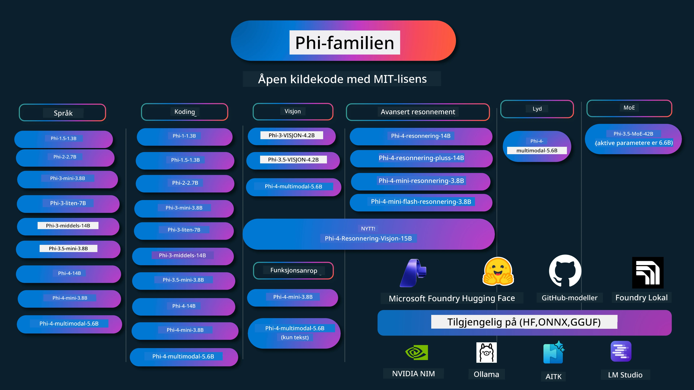

<!--
CO_OP_TRANSLATOR_METADATA:
{
  "original_hash": "c2e4b490f4bd424b095f21e38c6af33b",
  "translation_date": "2026-01-05T12:31:45+00:00",
  "source_file": "README.md",
  "language_code": "no"
}
-->
# Phi Cookbook: Praktiske eksempler med Microsofts Phi-modeller

[](https://codespaces.new/microsoft/phicookbook)
[](https://vscode.dev/redirect?url=vscode://ms-vscode-remote.remote-containers/cloneInVolume?url=https://github.com/microsoft/phicookbook)

[](https://GitHub.com/microsoft/phicookbook/graphs/contributors/?WT.mc_id=aiml-137032-kinfeylo)
[](https://GitHub.com/microsoft/phicookbook/issues/?WT.mc_id=aiml-137032-kinfeylo)
[](https://GitHub.com/microsoft/phicookbook/pulls/?WT.mc_id=aiml-137032-kinfeylo)
[](http://makeapullrequest.com?WT.mc_id=aiml-137032-kinfeylo)

[](https://GitHub.com/microsoft/phicookbook/watchers/?WT.mc_id=aiml-137032-kinfeylo)
[](https://GitHub.com/microsoft/phicookbook/network/?WT.mc_id=aiml-137032-kinfeylo)
[](https://GitHub.com/microsoft/phicookbook/stargazers/?WT.mc_id=aiml-137032-kinfeylo)

[](https://discord.com/invite/ByRwuEEgH4)

Phi er en serie med open source AI-modeller utviklet av Microsoft.

Phi er for øyeblikket den kraftigste og mest kostnadseffektive lille språkmodellen (SLM), med svært gode resultater i flerspråklige oppgaver, resonnement, tekst-/chatgenerering, koding, bilder, lyd og andre scenarioer.

Du kan distribuere Phi til skyen eller til edge-enheter, og du kan enkelt bygge generative AI-applikasjoner med begrenset datakraft.

Følg disse trinnene for å komme i gang med å bruke disse ressursene:
1. **Fork depotet**: Klikk [](https://GitHub.com/microsoft/phicookbook/network/?WT.mc_id=aiml-137032-kinfeylo)
2. **Klone depotet**:   `git clone https://github.com/microsoft/PhiCookBook.git`
3. [**Bli med i Microsoft AI Discord Community og møt eksperter og medutviklere**](https://discord.com/invite/ByRwuEEgH4?WT.mc_id=aiml-137032-kinfeylo)



### 🌐 Flerspråklig støtte

#### Støttet via GitHub Action (Automatisk og alltid oppdatert)

<!-- CO-OP TRANSLATOR LANGUAGES TABLE START -->
[Arabisk](../ar/README.md) | [Bengali](../bn/README.md) | [Bulgarsk](../bg/README.md) | [Burmesisk (Myanmar)](../my/README.md) | [Kinesisk (forenklet)](../zh/README.md) | [Kinesisk (tradisjonell, Hong Kong)](../hk/README.md) | [Kinesisk (tradisjonell, Macau)](../mo/README.md) | [Kinesisk (tradisjonell, Taiwan)](../tw/README.md) | [Kroatisk](../hr/README.md) | [Tsjekkisk](../cs/README.md) | [Dansk](../da/README.md) | [Nederlandsk](../nl/README.md) | [Estisk](../et/README.md) | [Finsk](../fi/README.md) | [Fransk](../fr/README.md) | [Tysk](../de/README.md) | [Gresk](../el/README.md) | [Hebraisk](../he/README.md) | [Hindi](../hi/README.md) | [Ungarsk](../hu/README.md) | [Indonesisk](../id/README.md) | [Italiensk](../it/README.md) | [Japansk](../ja/README.md) | [Kannada](../kn/README.md) | [Koreansk](../ko/README.md) | [Litauisk](../lt/README.md) | [Malaysisk](../ms/README.md) | [Malayalam](../ml/README.md) | [Marathi](../mr/README.md) | [Nepalesisk](../ne/README.md) | [Nigeriansk pidgin](../pcm/README.md) | [Norsk](./README.md) | [Persisk (Farsi)](../fa/README.md) | [Polsk](../pl/README.md) | [Portugisisk (Brasil)](../br/README.md) | [Portugisisk (Portugal)](../pt/README.md) | [Punjabi (Gurmukhi)](../pa/README.md) | [Rumensk](../ro/README.md) | [Russisk](../ru/README.md) | [Serbisk (kyrillisk)](../sr/README.md) | [Slovakisk](../sk/README.md) | [Slovensk](../sl/README.md) | [Spansk](../es/README.md) | [Swahili](../sw/README.md) | [Svensk](../sv/README.md) | [Tagalog (Filippinsk)](../tl/README.md) | [Tamil](../ta/README.md) | [Telugu](../te/README.md) | [Thai](../th/README.md) | [Tyrkisk](../tr/README.md) | [Ukrainsk](../uk/README.md) | [Urdu](../ur/README.md) | [Vietnamesisk](../vi/README.md)

> **Foretrekker du å klone lokalt?**

> Dette depotet inkluderer 50+ språkoversettelser som øker nedlastingsstørrelsen betydelig. For å klone uten oversettelser, bruk sparse checkout:
> ```bash
> git clone --filter=blob:none --sparse https://github.com/microsoft/PhiCookBook.git
> cd PhiCookBook
> git sparse-checkout set --no-cone '/*' '!translations' '!translated_images'
> ```
> Dette gir deg det du trenger for å fullføre kurset med en mye raskere nedlasting.
<!-- CO-OP TRANSLATOR LANGUAGES TABLE END -->

## Innholdsfortegnelse

- Introduksjon
  - [Velkommen til Phi-familien](./md/01.Introduction/01/01.PhiFamily.md)
  - [Setting opp miljøet ditt](./md/01.Introduction/01/01.EnvironmentSetup.md)
  - [Forstå nøkkelteknologier](./md/01.Introduction/01/01.Understandingtech.md)
  - [AI-sikkerhet for Phi-modeller](./md/01.Introduction/01/01.AISafety.md)
  - [Phi maskinvarestøtte](./md/01.Introduction/01/01.Hardwaresupport.md)
  - [Phi-modeller og tilgjengelighet på tvers av plattformer](./md/01.Introduction/01/01.Edgeandcloud.md)
  - [Bruke Guidance-ai og Phi](./md/01.Introduction/01/01.Guidance.md)
  - [GitHub Marketplace-modeller](https://github.com/marketplace/models)
  - [Azure AI Modellkatalog](https://ai.azure.com)

- Inference Phi i forskjellige miljøer
    -  [Hugging face](./md/01.Introduction/02/01.HF.md)
    -  [GitHub-modeller](./md/01.Introduction/02/02.GitHubModel.md)
    -  [Azure AI Foundry Modellkatalog](./md/01.Introduction/02/03.AzureAIFoundry.md)
    -  [Ollama](./md/01.Introduction/02/04.Ollama.md)
    -  [AI Toolkit VSCode (AITK)](./md/01.Introduction/02/05.AITK.md)
    -  [NVIDIA NIM](./md/01.Introduction/02/06.NVIDIA.md)
    -  [Foundry Local](./md/01.Introduction/02/07.FoundryLocal.md)

- Inference Phi-familien
    - [Inference Phi på iOS](./md/01.Introduction/03/iOS_Inference.md)
    - [Inference Phi på Android](./md/01.Introduction/03/Android_Inference.md)
    - [Inference Phi på Jetson](./md/01.Introduction/03/Jetson_Inference.md)
    - [Inference Phi på AI-PC](./md/01.Introduction/03/AIPC_Inference.md)
    - [Inference Phi med Apple MLX-rammeverk](./md/01.Introduction/03/MLX_Inference.md)
    - [Inference Phi på lokal server](./md/01.Introduction/03/Local_Server_Inference.md)
    - [Inference Phi på remote server ved bruk av AI Toolkit](./md/01.Introduction/03/Remote_Interence.md)
    - [Inference Phi med Rust](./md/01.Introduction/03/Rust_Inference.md)
    - [Inference Phi–Vision lokalt](./md/01.Introduction/03/Vision_Inference.md)
    - [Inference Phi med Kaito AKS, Azure Containers (offisiell støtte)](./md/01.Introduction/03/Kaito_Inference.md)
-  [Kvantifisering av Phi-familien](./md/01.Introduction/04/QuantifyingPhi.md)
    - [Kvantifisering av Phi-3.5 / 4 ved bruk av llama.cpp](./md/01.Introduction/04/UsingLlamacppQuantifyingPhi.md)
    - [Kvantifisering av Phi-3.5 / 4 ved bruk av Generative AI-utvidelser for onnxruntime](./md/01.Introduction/04/UsingORTGenAIQuantifyingPhi.md)
    - [Kvantifisering av Phi-3.5 / 4 ved bruk av Intel OpenVINO](./md/01.Introduction/04/UsingIntelOpenVINOQuantifyingPhi.md)
    - [Kvantifisering av Phi-3.5 / 4 ved bruk av Apple MLX-rammeverk](./md/01.Introduction/04/UsingAppleMLXQuantifyingPhi.md)

-  Evaluering av Phi
    - [Ansvarlig AI](./md/01.Introduction/05/ResponsibleAI.md)
    - [Azure AI Foundry for evaluering](./md/01.Introduction/05/AIFoundry.md)
    - [Bruke Promptflow for evaluering](./md/01.Introduction/05/Promptflow.md)
 
- RAG med Azure AI Search
    - [Hvordan bruke Phi-4-mini og Phi-4-multimodal (RAG) med Azure AI Search](https://github.com/microsoft/PhiCookBook/blob/main/code/06.E2E/E2E_Phi-4-RAG-Azure-AI-Search.ipynb)

- Eksempelprogrammer for Phi-applikasjonsutvikling
  - Tekst- og chatapplikasjoner
    - Phi-4 Eksempler 🆕
      - [📓] [Chat med Phi-4-mini ONNX-modell](./md/02.Application/01.TextAndChat/Phi4/ChatWithPhi4ONNX/README.md)
      - [Chat med Phi-4 lokal ONNX-modell .NET](../../md/04.HOL/dotnet/src/LabsPhi4-Chat-01OnnxRuntime)
      - [Chat .NET konsollapp med Phi-4 ONNX ved bruk av Semantic Kernel](../../md/04.HOL/dotnet/src/LabsPhi4-Chat-02SK)
    - Phi-3 / 3.5 Eksempler
      - [Lokal chatbot i nettleseren med Phi3, ONNX Runtime Web og WebGPU](https://github.com/microsoft/onnxruntime-inference-examples/tree/main/js/chat)
      - [OpenVino Chat](./md/02.Application/01.TextAndChat/Phi3/E2E_OpenVino_Chat.md)
      - [Multi Model - Interaktiv Phi-3-mini og OpenAI Whisper](./md/02.Application/01.TextAndChat/Phi3/E2E_Phi-3-mini_with_whisper.md)
      - [MLFlow - Lage en wrapper og bruke Phi-3 med MLFlow](./md//02.Application/01.TextAndChat/Phi3/E2E_Phi-3-MLflow.md)
      - [Modelloptimalisering - Hvordan optimalisere Phi-3-minimodell for ONNX Runtime Web med Olive](https://github.com/microsoft/Olive/tree/main/examples/phi3)
      - [WinUI3-app med Phi-3 mini-4k-instruct-onnx](https://github.com/microsoft/Phi3-Chat-WinUI3-Sample/)
      -[WinUI3 Multi Model AI-drevet Notatapp Eksempel](https://github.com/microsoft/ai-powered-notes-winui3-sample)
      - [Finjustere og integrere tilpassede Phi-3-modeller med Prompt flow](./md/02.Application/01.TextAndChat/Phi3/E2E_Phi-3-FineTuning_PromptFlow_Integration.md)
      - [Finjustere og integrere tilpassede Phi-3-modeller med Prompt flow i Azure AI Foundry](./md/02.Application/01.TextAndChat/Phi3/E2E_Phi-3-FineTuning_PromptFlow_Integration_AIFoundry.md)
      - [Evaluere den finjusterte Phi-3 / Phi-3.5-modellen i Azure AI Foundry med fokus på Microsofts prinsipper for ansvarlig AI](./md/02.Application/01.TextAndChat/Phi3/E2E_Phi-3-Evaluation_AIFoundry.md)
      - [📓] [Phi-3.5-mini-instruct språkprediksjonseksempel (kinesisk/engelsk)](./md/02.Application/01.TextAndChat/Phi3/phi3-instruct-demo.ipynb)
      - [Phi-3.5-Instruct WebGPU RAG Chatbot](./md/02.Application/01.TextAndChat/Phi3/WebGPUWithPhi35Readme.md)
      - [Bruke Windows GPU for å lage Prompt flow-løsning med Phi-3.5-Instruct ONNX](./md/02.Application/01.TextAndChat/Phi3/UsingPromptFlowWithONNX.md)
      - [Bruke Microsoft Phi-3.5 tflite for å lage Android-app](./md/02.Application/01.TextAndChat/Phi3/UsingPhi35TFLiteCreateAndroidApp.md)
      - [Q&A .NET-eksempel som bruker lokal ONNX Phi-3-modell med Microsoft.ML.OnnxRuntime](../../md/04.HOL/dotnet/src/LabsPhi301)
      - [Konsoll chat .NET-app med Semantic Kernel og Phi-3](../../md/04.HOL/dotnet/src/LabsPhi302)

  - Azure AI Inference SDK-kodebaserte eksempler 
    - Phi-4-eksempler 🆕
      - [📓] [Generer prosjektkode med Phi-4-multimodal](./md/02.Application/02.Code/Phi4/GenProjectCode/README.md)
    - Phi-3 / 3.5-eksempler
      - [Lag din egen Visual Studio Code GitHub Copilot Chat med Microsoft Phi-3-familien](./md/02.Application/02.Code/Phi3/VSCodeExt/README.md)
      - [Lag din egen Visual Studio Code Chat Copilot-agent med Phi-3.5 via GitHub-modeller](/md/02.Application/02.Code/Phi3/CreateVSCodeChatAgentWithGitHubModels.md)

  - Avanserte resonnementseksempler
    - Phi-4-eksempler 🆕
      - [📓] [Phi-4-mini-resonnement eller Phi-4-resonnement eksempler](./md/02.Application/03.AdvancedReasoning/Phi4/AdvancedResoningPhi4mini/README.md)
      - [📓] [Finjustering av Phi-4-mini-resonnement med Microsoft Olive](./md/02.Application/03.AdvancedReasoning/Phi4/AdvancedResoningPhi4mini/olive_ft_phi_4_reasoning_with_medicaldata.ipynb)
      - [📓] [Finjustering av Phi-4-mini-resonnement med Apple MLX](./md/02.Application/03.AdvancedReasoning/Phi4/AdvancedResoningPhi4mini/mlx_ft_phi_4_reasoning_with_medicaldata.ipynb)
      - [📓] [Phi-4-mini-resonnement med GitHub-modeller](./md/02.Application/02.Code/Phi4r/github_models_inference.ipynb)
      - [📓] [Phi-4-mini-resonnement med Azure AI Foundry-modeller](./md/02.Application/02.Code/Phi4r/azure_models_inference.ipynb)
  - Demoer
      - [Phi-4-mini demoer hostet på Hugging Face Spaces](https://huggingface.co/spaces/microsoft/phi-4-mini?WT.mc_id=aiml-137032-kinfeylo)
      - [Phi-4-multimodal demoer hostet på Hugginge Face Spaces](https://huggingface.co/spaces/microsoft/phi-4-multimodal?WT.mc_id=aiml-137032-kinfeylo)
  - Visjonseksempler
    - Phi-4-eksempler 🆕
      - [📓] [Bruk Phi-4-multimodal for å lese bilder og generere kode](./md/02.Application/04.Vision/Phi4/CreateFrontend/README.md) 
    - Phi-3 / 3.5-eksempler
      -  [📓][Phi-3-visjon-Bilde tekst til tekst](./md/02.Application/04.Vision/Phi3/E2E_Phi-3-vision-image-text-to-text-online-endpoint.ipynb)
      - [Phi-3-visjon-ONNX](https://onnxruntime.ai/docs/genai/tutorials/phi3-v.html)
      - [📓][Phi-3-visjon CLIP-embedding](./md/02.Application/04.Vision/Phi3/E2E_Phi-3-vision-image-text-to-text-online-endpoint.ipynb)
      - [DEMO: Phi-3 Resirkulering](https://github.com/jennifermarsman/PhiRecycling/)
      - [Phi-3-visjon - Visuell språkhjelper - med Phi3-Visjon og OpenVINO](https://docs.openvino.ai/nightly/notebooks/phi-3-vision-with-output.html)
      - [Phi-3 Visjon Nvidia NIM](./md/02.Application/04.Vision/Phi3/E2E_Nvidia_NIM_Vision.md)
      - [Phi-3 Visjon OpenVino](./md/02.Application/04.Vision/Phi3/E2E_OpenVino_Phi3Vision.md)
      - [📓][Phi-3.5 Visjon multi-ramme eller multi-bilde eksempel](./md/02.Application/04.Vision/Phi3/phi3-vision-demo.ipynb)
      - [Phi-3 Visjon lokal ONNX-modell med Microsoft.ML.OnnxRuntime .NET](../../md/04.HOL/dotnet/src/LabsPhi303)
      - [Meny-basert Phi-3 Visjon lokal ONNX-modell med Microsoft.ML.OnnxRuntime .NET](../../md/04.HOL/dotnet/src/LabsPhi304)

  - Matematikk-eksempler
    -  Phi-4-Mini-Flash-Reasoning-Instruct-eksempler 🆕 [Mattematikkdemo med Phi-4-Mini-Flash-Reasoning-Instruct](./md/02.Application/09.Math/MathDemo.ipynb)

  - Lyd-eksempler
    - Phi-4-eksempler 🆕
      - [📓] [Ekstrahering av lydtranskripsjoner med Phi-4-multimodal](./md/02.Application/05.Audio/Phi4/Transciption/README.md)
      - [📓] [Phi-4-multimodal lyd-eksempel](./md/02.Application/05.Audio/Phi4/Siri/demo.ipynb)
      - [📓] [Phi-4-multimodal taleoversettelse-eksempel](./md/02.Application/05.Audio/Phi4/Translate/demo.ipynb)
      - [.NET-konsollapplikasjon som bruker Phi-4-multimodal lyd for å analysere en lydfil og generere transkripsjon](../../md/04.HOL/dotnet/src/LabsPhi4-MultiModal-02Audio)

  - MOE-eksempler
    - Phi-3 / 3.5-eksempler
      - [📓] [Phi-3.5 Mixture of Experts Models (MoEs) sosial media-eksempel](./md/02.Application/06.MoE/Phi3/phi3_moe_demo.ipynb)
      - [📓] [Bygge en Retrieval-Augmented Generation (RAG) pipeline med NVIDIA NIM Phi-3 MOE, Azure AI Search, og LlamaIndex](./md/02.Application/06.MoE/Phi3/azure-ai-search-nvidia-rag.ipynb)
      - 
  - Funksjonsanrops-eksempler
    - Phi-4-eksempler 🆕
      -  [📓] [Bruke funksjonsanrop med Phi-4-mini](./md/02.Application/07.FunctionCalling/Phi4/FunctionCallingBasic/README.md)
      -  [📓] [Bruke funksjonsanrop for å lage multi-agenter med Phi-4-mini](./md/02.Application/07.FunctionCalling/Phi4/Multiagents/Phi_4_mini_multiagent.ipynb)
      -  [📓] [Bruke funksjonsanrop med Ollama](./md/02.Application/07.FunctionCalling/Phi4/Ollama/ollama_functioncalling.ipynb)
      -  [📓] [Bruke funksjonsanrop med ONNX](./md/02.Application/07.FunctionCalling/Phi4/ONNX/onnx_parallel_functioncalling.ipynb)
  - Multimodal miksing eksempler
    - Phi-4-eksempler 🆕
      -  [📓] [Bruke Phi-4-multimodal som teknologijournalist](./md/02.Application/08.Multimodel/Phi4/TechJournalist/phi_4_mm_audio_text_publish_news.ipynb)
      - [.NET-konsollapplikasjon som bruker Phi-4-multimodal for å analysere bilder](../../md/04.HOL/dotnet/src/LabsPhi4-MultiModal-01Images)

- Finjustering av Phi-eksempler
  - [Finjusteringsscenarier](./md/03.FineTuning/FineTuning_Scenarios.md)
  - [Finjustering vs RAG](./md/03.FineTuning/FineTuning_vs_RAG.md)
  - [Finjustering: La Phi-3 bli en bransjeekspert](./md/03.FineTuning/LetPhi3gotoIndustriy.md)
  - [Finjustering av Phi-3 med AI Toolkit for VS Code](./md/03.FineTuning/Finetuning_VSCodeaitoolkit.md)
  - [Finjustering av Phi-3 med Azure Machine Learning Service](./md/03.FineTuning/Introduce_AzureML.md)
  - [Finjustering av Phi-3 med Lora](./md/03.FineTuning/FineTuning_Lora.md)
  - [Finjustering av Phi-3 med QLora](./md/03.FineTuning/FineTuning_Qlora.md)
  - [Finjustering av Phi-3 med Azure AI Foundry](./md/03.FineTuning/FineTuning_AIFoundry.md)
  - [Finjustering av Phi-3 med Azure ML CLI/SDK](./md/03.FineTuning/FineTuning_MLSDK.md)
  - [Finjustering med Microsoft Olive](./md/03.FineTuning/FineTuning_MicrosoftOlive.md)
  - [Finjustering med Microsoft Olive Hands-On Lab](./md/03.FineTuning/olive-lab/readme.md)
  - [Finjustering av Phi-3-visjon med Weights and Bias](./md/03.FineTuning/FineTuning_Phi-3-visionWandB.md)
  - [Finjustering av Phi-3 med Apple MLX Framework](./md/03.FineTuning/FineTuning_MLX.md)
  - [Finjustering av Phi-3-visjon (offisiell støtte)](./md/03.FineTuning/FineTuning_Vision.md)
  - [Finjustering av Phi-3 med Kaito AKS, Azure Containers (offisiell støtte)](./md/03.FineTuning/FineTuning_Kaito.md)
  - [Finjustering av Phi-3 og 3.5 Visjon](https://github.com/2U1/Phi3-Vision-Finetune)

- Hands on Lab
  - [Utforske banebrytende modeller: LLMs, SLMs, lokal utvikling og mer](https://github.com/microsoft/aitour-exploring-cutting-edge-models)
  - [Utløse NLP-potensial: Finjustering med Microsoft Olive](https://github.com/azure/Ignite_FineTuning_workshop)

- Akademiske forskningsartikler og publikasjoner
  - [Textbooks Are All You Need II: phi-1.5 teknisk rapport](https://arxiv.org/abs/2309.05463)
  - [Phi-3 teknisk rapport: En svært kapabel språkmodell lokalt på telefonen din](https://arxiv.org/abs/2404.14219)
  - [Phi-4 teknisk rapport](https://arxiv.org/abs/2412.08905)
  - [Phi-4-Mini teknisk rapport: Kompakte, men kraftfulle multimodale språkmodeller via Mixture-of-LoRAs](https://arxiv.org/abs/2503.01743)
  - [Optimalisering av små språkmodeller for funksjonskalling i kjøretøy](https://arxiv.org/abs/2501.02342)
  - [(WhyPHI) Finjustering av PHI-3 for flervalgsspørsmål: Metodikk, resultater og utfordringer](https://arxiv.org/abs/2501.01588)
  - [Phi-4-reasoning teknisk rapport](https://www.microsoft.com/en-us/research/wp-content/uploads/2025/04/phi_4_reasoning.pdf)
  - [Phi-4-mini-reasoning teknisk rapport](https://huggingface.co/microsoft/Phi-4-mini-reasoning/blob/main/Phi-4-Mini-Reasoning.pdf)

## Bruke Phi-modeller

### Phi på Azure AI Foundry

Du kan lære hvordan du bruker Microsoft Phi og hvordan bygge ende-til-ende løsninger på dine ulike maskinvareenheter. For å prøve Phi selv, start med å leke med modellene og tilpasse Phi til dine scenarier ved å bruke [Azure AI Foundry Azure AI Model Catalog](https://aka.ms/phi3-azure-ai) du kan lære mer i Komme i gang med [Azure AI Foundry](/md/02.QuickStart/AzureAIFoundry_QuickStart.md).

**Playground**
Hver modell har en dedikert lekearena for å teste modellen [Azure AI Playground](https://aka.ms/try-phi3).

### Phi på GitHub-modeller

Du kan lære hvordan du bruker Microsoft Phi og hvordan bygge ende-til-ende løsninger på dine ulike maskinvareenheter. For å prøve Phi selv, start med å leke med modellen og tilpasse Phi til dine scenarier ved å bruke [GitHub Model Catalog](https://github.com/marketplace/models?WT.mc_id=aiml-137032-kinfeylo) du kan lære mer i Komme i gang med [GitHub Model Catalog](/md/02.QuickStart/GitHubModel_QuickStart.md).

**Playground**
Hver modell har en dedikert [lekearena for testing av modellen](/md/02.QuickStart/GitHubModel_QuickStart.md).

### Phi på Hugging Face

Du kan også finne modellen på [Hugging Face](https://huggingface.co/microsoft)

**Playground**
 [Hugging Chat lekearena](https://huggingface.co/chat/models/microsoft/Phi-3-mini-4k-instruct)

 ## 🎒 Andre kurs

Vårt team produserer andre kurs! Sjekk ut:

<!-- CO-OP TRANSLATOR OTHER COURSES START -->
### LangChain
[](https://aka.ms/langchain4j-for-beginners)
[](https://aka.ms/langchainjs-for-beginners?WT.mc_id=m365-94501-dwahlin)

---

### Azure / Edge / MCP / Agenter
[](https://github.com/microsoft/AZD-for-beginners?WT.mc_id=academic-105485-koreyst)
[](https://github.com/microsoft/edgeai-for-beginners?WT.mc_id=academic-105485-koreyst)
[](https://github.com/microsoft/mcp-for-beginners?WT.mc_id=academic-105485-koreyst)
[](https://github.com/microsoft/ai-agents-for-beginners?WT.mc_id=academic-105485-koreyst)

---
 
### Generativ AI-serie
[](https://github.com/microsoft/generative-ai-for-beginners?WT.mc_id=academic-105485-koreyst)
[-9333EA?style=for-the-badge&labelColor=E5E7EB&color=9333EA)](https://github.com/microsoft/Generative-AI-for-beginners-dotnet?WT.mc_id=academic-105485-koreyst)
[-C084FC?style=for-the-badge&labelColor=E5E7EB&color=C084FC)](https://github.com/microsoft/generative-ai-for-beginners-java?WT.mc_id=academic-105485-koreyst)
[-E879F9?style=for-the-badge&labelColor=E5E7EB&color=E879F9)](https://github.com/microsoft/generative-ai-with-javascript?WT.mc_id=academic-105485-koreyst)

---
 
### Kjernelæring
[](https://aka.ms/ml-beginners?WT.mc_id=academic-105485-koreyst)
[](https://aka.ms/datascience-beginners?WT.mc_id=academic-105485-koreyst)
[](https://aka.ms/ai-beginners?WT.mc_id=academic-105485-koreyst)
[](https://github.com/microsoft/Security-101?WT.mc_id=academic-96948-sayoung)
[](https://aka.ms/webdev-beginners?WT.mc_id=academic-105485-koreyst)
[](https://aka.ms/iot-beginners?WT.mc_id=academic-105485-koreyst)
[](https://github.com/microsoft/xr-development-for-beginners?WT.mc_id=academic-105485-koreyst)

---
 
### Copilot-serie
[](https://aka.ms/GitHubCopilotAI?WT.mc_id=academic-105485-koreyst)
[](https://github.com/microsoft/mastering-github-copilot-for-dotnet-csharp-developers?WT.mc_id=academic-105485-koreyst)
[](https://github.com/microsoft/CopilotAdventures?WT.mc_id=academic-105485-koreyst)
<!-- CO-OP TRANSLATOR OTHER COURSES END -->

## Ansvarlig AI 

Microsoft er forpliktet til å hjelpe våre kunder å bruke våre AI-produkter på en ansvarlig måte, dele våre erfaringer, og bygge tillitsbaserte partnerskap gjennom verktøy som Transparency Notes og Impact Assessments. Mange av disse ressursene finnes på [https://aka.ms/RAI](https://aka.ms/RAI).  
Microsofts tilnærming til ansvarlig AI er forankret i våre AI-prinsipper om rettferdighet, pålitelighet og sikkerhet, personvern og sikkerhet, inkludering, åpenhet og ansvarlighet.

Store språk-, bilde- og tale-modeller i stor skala - slik som de som brukes i dette eksempelet - kan potensielt oppføre seg på måter som er urettferdige, upålitelige eller støtende, og dermed forårsake skade. Vennligst se [Azure OpenAI service Transparency note](https://learn.microsoft.com/legal/cognitive-services/openai/transparency-note?tabs=text) for informasjon om risiko og begrensninger.

Den anbefalte tilnærmingen for å redusere disse risikoene er å inkludere et sikkerhetssystem i arkitekturen din som kan oppdage og forhindre skadelig adferd. [Azure AI Content Safety](https://learn.microsoft.com/azure/ai-services/content-safety/overview) tilbyr et uavhengig beskyttelseslag som kan oppdage skadelig innhold generert av brukere og AI i applikasjoner og tjenester. Azure AI Content Safety inkluderer tekst- og bilde-API-er som gjør det mulig å oppdage skadelig materiale. Innen Azure AI Foundry gir Content Safety-tjenesten deg mulighet til å se, utforske og prøve ut eksempel-kode for å oppdage skadelig innhold på tvers av ulike modaliteter. Følgende [hurtigstartdokumentasjon](https://learn.microsoft.com/azure/ai-services/content-safety/quickstart-text?tabs=visual-studio%2Clinux&pivots=programming-language-rest) guider deg gjennom hvordan du gjør forespørsler til tjenesten.

Et annet aspekt å ta hensyn til er den generelle applikasjonsytelsen. Med multimodale og multimodells applikasjoner anser vi ytelse som at systemet fungerer slik du og dine brukere forventer, inkludert at det ikke genererer skadelig output. Det er viktig å evaluere ytelsen til hele applikasjonen ved bruk av [Performance and Quality og Risk and Safety evaluatorer](https://learn.microsoft.com/azure/ai-studio/concepts/evaluation-metrics-built-in). Du har også mulighet til å lage og evaluere med [egendefinerte evaluatorer](https://learn.microsoft.com/azure/ai-studio/how-to/develop/evaluate-sdk#custom-evaluators).
Du kan evaluere AI-applikasjonen din i utviklingsmiljøet ved å bruke [Azure AI Evaluation SDK](https://microsoft.github.io/promptflow/index.html). Enten du har et testdatasett eller et mål, blir genereringene fra din generative AI-applikasjon kvantitativt målt med innebygde evaluatorer eller tilpassede evaluatorer etter eget valg. For å komme i gang med azure ai evaluation sdk for å evaluere systemet ditt, kan du følge [hurtigstartveiledningen](https://learn.microsoft.com/azure/ai-studio/how-to/develop/flow-evaluate-sdk). Når du har kjørt en evaluering, kan du [visualisere resultatene i Azure AI Foundry](https://learn.microsoft.com/azure/ai-studio/how-to/evaluate-flow-results). 

## Varemerker

Dette prosjektet kan inneholde varemerker eller logoer for prosjekter, produkter eller tjenester. Autorisert bruk av Microsofts varemerker eller logoer er underlagt og må følge [Microsofts retningslinjer for varemerker og merkevarer](https://www.microsoft.com/legal/intellectualproperty/trademarks/usage/general).
Bruk av Microsofts varemerker eller logoer i modifiserte versjoner av dette prosjektet må ikke føre til forvirring eller antyde Microsofts sponsing. Enhver bruk av tredjeparts varemerker eller logoer er underlagt disse tredjeparts retningslinjer.

## Få hjelp

Hvis du støter på problemer eller har spørsmål om å bygge AI-apper, bli med på:

[](https://aka.ms/foundry/discord)

Hvis du har produktinnspill eller feil under utvikling, besøk:

[](https://aka.ms/foundry/forum)

---

<!-- CO-OP TRANSLATOR DISCLAIMER START -->
**Ansvarsfraskrivelse**:
Dette dokumentet har blitt oversatt ved hjelp av AI-oversettelsestjenesten [Co-op Translator](https://github.com/Azure/co-op-translator). Selv om vi streber etter nøyaktighet, vennligst vær oppmerksom på at automatiske oversettelser kan inneholde feil eller unøyaktigheter. Det opprinnelige dokumentet på sitt opprinnelige språk skal betraktes som den autoritative kilden. For kritisk informasjon anbefales profesjonell menneskelig oversettelse. Vi er ikke ansvarlige for eventuelle misforståelser eller feiltolkninger som oppstår som følge av bruk av denne oversettelsen.
<!-- CO-OP TRANSLATOR DISCLAIMER END -->