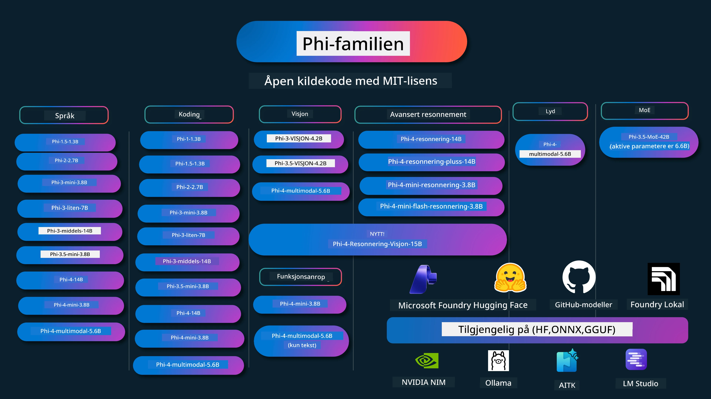

# Phi Cookbook: Praktiske eksempler med Microsofts Phi-modeller

[](https://codespaces.new/microsoft/phicookbook)
[](https://vscode.dev/redirect?url=vscode://ms-vscode-remote.remote-containers/cloneInVolume?url=https://github.com/microsoft/phicookbook)

[](https://GitHub.com/microsoft/phicookbook/graphs/contributors/?WT.mc_id=aiml-137032-kinfeylo)
[](https://GitHub.com/microsoft/phicookbook/issues/?WT.mc_id=aiml-137032-kinfeylo)
[](https://GitHub.com/microsoft/phicookbook/pulls/?WT.mc_id=aiml-137032-kinfeylo)
[](http://makeapullrequest.com?WT.mc_id=aiml-137032-kinfeylo)

[](https://GitHub.com/microsoft/phicookbook/watchers/?WT.mc_id=aiml-137032-kinfeylo)
[](https://GitHub.com/microsoft/phicookbook/network/?WT.mc_id=aiml-137032-kinfeylo)
[](https://GitHub.com/microsoft/phicookbook/stargazers/?WT.mc_id=aiml-137032-kinfeylo)

[](https://discord.com/invite/ByRwuEEgH4)

Phi er en serie med åpen kildekode AI-modeller utviklet av Microsoft.

Phi er for øyeblikket den mest kraftfulle og kostnadseffektive småspråkmodellen (SLM), med svært gode resultater innen fler-språklighet, resonnement, tekst-/chatgenerering, koding, bilder, lyd og andre scenarier.

Du kan distribuere Phi til skyen eller til enheter i kanten, og du kan enkelt bygge generative AI-applikasjoner med begrenset datakraft.

Følg disse stegene for å komme i gang med å bruke disse ressursene:
1. **Forgrene depotet**: Klikk [](https://GitHub.com/microsoft/phicookbook/network/?WT.mc_id=aiml-137032-kinfeylo)
2. **Klon depotet**: `git clone https://github.com/microsoft/PhiCookBook.git`
3. [**Bli med i Microsoft AI Discord-samfunnet og møt eksperter og medutviklere**](https://discord.com/invite/ByRwuEEgH4?WT.mc_id=aiml-137032-kinfeylo)



### 🌐 Flerspråklig støtte

#### Støttet via GitHub Action (Automatisk og alltid oppdatert)

<!-- CO-OP TRANSLATOR LANGUAGES TABLE START -->
[Arabisk](../ar/README.md) | [Bengali](../bn/README.md) | [Bulgarsk](../bg/README.md) | [Burmesisk (Myanmar)](../my/README.md) | [Kinesisk (forenklet)](../zh-CN/README.md) | [Kinesisk (tradisjonell, Hong Kong)](../zh-HK/README.md) | [Kinesisk (tradisjonell, Macau)](../zh-MO/README.md) | [Kinesisk (tradisjonell, Taiwan)](../zh-TW/README.md) | [Kroatisk](../hr/README.md) | [Tsjekkisk](../cs/README.md) | [Dansk](../da/README.md) | [Nederlandsk](../nl/README.md) | [Estisk](../et/README.md) | [Finsk](../fi/README.md) | [Fransk](../fr/README.md) | [Tysk](../de/README.md) | [Gresk](../el/README.md) | [Hebraisk](../he/README.md) | [Hindi](../hi/README.md) | [Ungarsk](../hu/README.md) | [Indonesisk](../id/README.md) | [Italiensk](../it/README.md) | [Japansk](../ja/README.md) | [Kannada](../kn/README.md) | [Koreansk](../ko/README.md) | [Litauisk](../lt/README.md) | [Malayisk](../ms/README.md) | [Malayalam](../ml/README.md) | [Marathi](../mr/README.md) | [Nepalsk](../ne/README.md) | [Nigeriansk pidgin](../pcm/README.md) | [Norsk](./README.md) | [Persisk (Farsi)](../fa/README.md) | [Polsk](../pl/README.md) | [Portugisisk (Brasil)](../pt-BR/README.md) | [Portugisisk (Portugal)](../pt-PT/README.md) | [Punjabi (Gurmukhi)](../pa/README.md) | [Rumensk](../ro/README.md) | [Russisk](../ru/README.md) | [Serbisk (kyrillisk)](../sr/README.md) | [Slovakisk](../sk/README.md) | [Slovensk](../sl/README.md) | [Spansk](../es/README.md) | [Swahili](../sw/README.md) | [Svensk](../sv/README.md) | [Tagalog (Filippinsk)](../tl/README.md) | [Tamil](../ta/README.md) | [Telugu](../te/README.md) | [Thai](../th/README.md) | [Tyrkisk](../tr/README.md) | [Ukrainsk](../uk/README.md) | [Urdu](../ur/README.md) | [Vietnamesisk](../vi/README.md)

> **Foretrekker du å klone lokalt?**
>
> Dette depotet inkluderer 50+ språkoversettelser som øker nedlastingsstørrelsen betydelig. For å klone uten oversettelser, bruk sparse checkout:
>
> **Bash / macOS / Linux:**
> ```bash
> git clone --filter=blob:none --sparse https://github.com/microsoft/PhiCookBook.git
> cd PhiCookBook
> git sparse-checkout set --no-cone '/*' '!translations' '!translated_images'
> ```
>
> **CMD (Windows):**
> ```cmd
> git clone --filter=blob:none --sparse https://github.com/microsoft/PhiCookBook.git
> cd PhiCookBook
> git sparse-checkout set --no-cone "/*" "!translations" "!translated_images"
> ```
>
> Dette gir deg alt du trenger for å fullføre kurset med en mye raskere nedlasting.
<!-- CO-OP TRANSLATOR LANGUAGES TABLE END -->

## Innholdsfortegnelse
- Introduksjon - [Velkommen til Phi-familien](./md/01.Introduction/01/01.PhiFamily.md) - [Sette opp miljøet ditt](./md/01.Introduction/01/01.EnvironmentSetup.md) - [Forstå viktige teknologier](./md/01.Introduction/01/01.Understandingtech.md) - [AI-sikkerhet for Phi-modeller](./md/01.Introduction/01/01.AISafety.md) - [Phi maskinvarestøtte](./md/01.Introduction/01/01.Hardwaresupport.md) - [Phi-modeller og tilgjengelighet på tvers av plattformer](./md/01.Introduction/01/01.Edgeandcloud.md) - [Bruke Guidance-ai og Phi](./md/01.Introduction/01/01.Guidance.md) - [GitHub Marketplace Modeller](https://github.com/marketplace/models) - [Azure AI Modellkatalog](https://ai.azure.com) - Inference Phi i forskjellige miljøer - [Hugging Face](./md/01.Introduction/02/01.HF.md) - [GitHub Modeller](./md/01.Introduction/02/02.GitHubModel.md) - [Microsoft Foundry Modellkatalog](./md/01.Introduction/02/03.AzureAIFoundry.md) - [Ollama](./md/01.Introduction/02/04.Ollama.md) - [AI Toolkit VSCode (AITK)](./md/01.Introduction/02/05.AITK.md) - [NVIDIA NIM](./md/01.Introduction/02/06.NVIDIA.md) - [Foundry Lokalt](./md/01.Introduction/02/07.FoundryLocal.md) - Inference Phi-familien - [Inference Phi på iOS](./md/01.Introduction/03/iOS_Inference.md) - [Inference Phi på Android](./md/01.Introduction/03/Android_Inference.md) - [Inference Phi på Jetson](./md/01.Introduction/03/Jetson_Inference.md) - [Inference Phi på AI-PC](./md/01.Introduction/03/AIPC_Inference.md) - [Inference Phi med Apple MLX Framework](./md/01.Introduction/03/MLX_Inference.md) - [Inference Phi på lokal server](./md/01.Introduction/03/Local_Server_Inference.md) - [Inference Phi på ekstern server med AI Toolkit](./md/01.Introduction/03/Remote_Interence.md) - [Inference Phi med Rust](./md/01.Introduction/03/Rust_Inference.md) - [Inference Phi – Vision lokalt](./md/01.Introduction/03/Vision_Inference.md) - [Inference Phi med Kaito AKS, Azure Containers (offisiell støtte)](./md/01.Introduction/03/Kaito_Inference.md) - [Kvantifisering av Phi-familien](./md/01.Introduction/04/QuantifyingPhi.md) - [Kvantifisere Phi-3.5 / 4 med llama.cpp](./md/01.Introduction/04/UsingLlamacppQuantifyingPhi.md) - [Kvantifisere Phi-3.5 / 4 med Generative AI-utvidelser for onnxruntime](./md/01.Introduction/04/UsingORTGenAIQuantifyingPhi.md) - [Kvantifisere Phi-3.5 / 4 med Intel OpenVINO](./md/01.Introduction/04/UsingIntelOpenVINOQuantifyingPhi.md) - [Kvantifisere Phi-3.5 / 4 med Apple MLX Framework](./md/01.Introduction/04/UsingAppleMLXQuantifyingPhi.md) - Evaluering Phi - [Ansvarlig AI](./md/01.Introduction/05/ResponsibleAI.md) - [Microsoft Foundry for evaluering](./md/01.Introduction/05/AIFoundry.md) - [Bruke Promptflow for evaluering](./md/01.Introduction/05/Promptflow.md) - RAG med Azure AI Search - [Hvordan bruke Phi-4-mini og Phi-4-multimodal (RAG) med Azure AI Search](https://github.com/microsoft/PhiCookBook/blob/main/code/06.E2E/E2E_Phi-4-RAG-Azure-AI-Search.ipynb) - Phi applikasjonsutviklingsprøver - Tekst- og chatteapplikasjoner - Phi-4 prøver - [📓] [Chat med Phi-4-mini ONNX modell](./md/02.Application/01.TextAndChat/Phi4/ChatWithPhi4ONNX/README.md) - [Chat med Phi-4 lokal ONNX modell .NET](../../md/04.HOL/dotnet/src/LabsPhi4-Chat-01OnnxRuntime) - [Chat .NET konsollapp med Phi-4 ONNX og Semantic Kernel](../../md/04.HOL/dotnet/src/LabsPhi4-Chat-02SK) - Phi-3 / 3.5 prøver - [Lokal chatbot i nettleseren med Phi3, ONNX Runtime Web og WebGPU](https://github.com/microsoft/onnxruntime-inference-examples/tree/main/js/chat) - [OpenVino Chat](./md/02.Application/01.TextAndChat/Phi3/E2E_OpenVino_Chat.md) - [Multi Modell – Interaktiv Phi-3-mini og OpenAI Whisper](./md/02.Application/01.TextAndChat/Phi3/E2E_Phi-3-mini_with_whisper.md) - [MLFlow – Lage et wrapper og bruke Phi-3 med MLFlow](./md//02.Application/01.TextAndChat/Phi3/E2E_Phi-3-MLflow.md) - [Modelloptimalisering – Hvordan optimalisere Phi-3-minimodell for ONNX Runtime Web med Olive](https://github.com/microsoft/Olive/tree/main/examples/phi3) - [WinUI3-app med Phi-3 mini-4k-instruct-onnx](https://github.com/microsoft/Phi3-Chat-WinUI3-Sample/) - [WinUI3 Multi Modell AI-drevet notatapp eksempel](https://github.com/microsoft/ai-powered-notes-winui3-sample) - [Finjuster og integrer egendefinerte Phi-3 modeller med Promptflow](./md/02.Application/01.TextAndChat/Phi3/E2E_Phi-3-FineTuning_PromptFlow_Integration.md) - [Finjuster og integrer egendefinerte Phi-3 modeller med Promptflow i Microsoft Foundry](./md/02.Application/01.TextAndChat/Phi3/E2E_Phi-3-FineTuning_PromptFlow_Integration_AIFoundry.md) - [Evaluer den finjusterte Phi-3 / Phi-3.5 modellen i Microsoft Foundry med fokus på Microsofts prinsipper for ansvarlig AI](./md/02.Application/01.TextAndChat/Phi3/E2E_Phi-3-Evaluation_AIFoundry.md) - [📓] [Phi-3.5-mini-instruct språkprediksjonsprøve (kinesisk/engelsk)](./md/02.Application/01.TextAndChat/Phi3/phi3-instruct-demo.ipynb) - [Phi-3.5-Instruct WebGPU RAG Chatbot](./md/02.Application/01.TextAndChat/Phi3/WebGPUWithPhi35Readme.md) - [Bruke Windows GPU for å lage Promptflow-løsning med Phi-3.5-Instruct ONNX](./md/02.Application/01.TextAndChat/Phi3/UsingPromptFlowWithONNX.md) - [Bruke Microsoft Phi-3.5 tflite for å lage Android-app](./md/02.Application/01.TextAndChat/Phi3/UsingPhi35TFLiteCreateAndroidApp.md) - [Q&A .NET eksempel med lokal ONNX Phi-3 modell ved bruk av Microsoft.ML.OnnxRuntime](../../md/04.HOL/dotnet/src/LabsPhi301) - [Konsoll chat .NET-app med Semantic Kernel og Phi-3](../../md/04.HOL/dotnet/src/LabsPhi302) - Azure AI Inference SDK kodebaserte prøver - Phi-4 prøver - [📓] [Generer prosjektkode med Phi-4-multimodal](./md/02.Application/02.Code/Phi4/GenProjectCode/README.md) - Phi-3 / 3.5 prøver - [Bygg din egen Visual Studio Code GitHub Copilot chat med Microsoft Phi-3-familien](./md/02.Application/02.Code/Phi3/VSCodeExt/README.md) - [Lag din egen Visual Studio Code Chat Copilot-agent med Phi-3.5 ved hjelp av GitHub Modeller](/md/02.Application/02.Code/Phi3/CreateVSCodeChatAgentWithGitHubModels.md) - Avanserte resonneringsprøver - Phi-4 prøver - [📓] [Phi-4-mini-resonnering eller Phi-4-resonnering prøver](./md/02.Application/03.AdvancedReasoning/Phi4/AdvancedResoningPhi4mini/README.md) - [📓] [Finjustering av Phi-4-mini-resonnering med Microsoft Olive](./md/02.Application/03.AdvancedReasoning/Phi4/AdvancedResoningPhi4mini/olive_ft_phi_4_reasoning_with_medicaldata.ipynb) - [📓] [Finjustering av Phi-4-mini-resonnering med Apple MLX](./md/02.Application/03.AdvancedReasoning/Phi4/AdvancedResoningPhi4mini/mlx_ft_phi_4_reasoning_with_medicaldata.ipynb) - [📓] [Phi-4-mini-resonnering med GitHub Modeller](./md/02.Application/02.Code/Phi4r/github_models_inference.ipynb) - [📓] [Phi-4-mini-resonnering med Microsoft Foundry modeller](./md/02.Application/02.Code/Phi4r/azure_models_inference.ipynb) -
Demonstrasjoner - [Phi-4-mini demonstrasjoner hostet på Hugging Face Spaces](https://huggingface.co/spaces/microsoft/phi-4-mini?WT.mc_id=aiml-137032-kinfeylo) - [Phi-4-multimodal demonstrasjoner hostet på Hugginge Face Spaces](https://huggingface.co/spaces/microsoft/phi-4-multimodal?WT.mc_id=aiml-137032-kinfeylo) - Visjon Eksempler - Phi-4 Eksempler - [📓] [Bruk Phi-4-multimodal for å lese bilder og generere kode](./md/02.Application/04.Vision/Phi4/CreateFrontend/README.md) - Phi-3 / 3.5 Eksempler - [📓][Phi-3-vision-Bilde tekst til tekst](./md/02.Application/04.Vision/Phi3/E2E_Phi-3-vision-image-text-to-text-online-endpoint.ipynb) - [Phi-3-vision-ONNX](https://onnxruntime.ai/docs/genai/tutorials/phi3-v.html) - [📓][Phi-3-vision CLIP Embedding](./md/02.Application/04.Vision/Phi3/E2E_Phi-3-vision-image-text-to-text-online-endpoint.ipynb) - [DEMO: Phi-3 Resirkulering](https://github.com/jennifermarsman/PhiRecycling/) - [Phi-3-vision - Visuell språkassistent - med Phi3-Vision og OpenVINO](https://docs.openvino.ai/nightly/notebooks/phi-3-vision-with-output.html) - [Phi-3 Vision Nvidia NIM](./md/02.Application/04.Vision/Phi3/E2E_Nvidia_NIM_Vision.md) - [Phi-3 Vision OpenVino](./md/02.Application/04.Vision/Phi3/E2E_OpenVino_Phi3Vision.md) - [📓][Phi-3.5 Vision multi-bilde eller multi-ramme eksempel](./md/02.Application/04.Vision/Phi3/phi3-vision-demo.ipynb) - [Phi-3 Vision Lokal ONNX Modell ved bruk av Microsoft.ML.OnnxRuntime .NET](../../md/04.HOL/dotnet/src/LabsPhi303) - [Menybasert Phi-3 Vision Lokal ONNX Modell ved bruk av Microsoft.ML.OnnxRuntime .NET](../../md/04.HOL/dotnet/src/LabsPhi304) - Resonnering-Visjon Eksempler - Phi-4-Resonnering-Visjon-15B - [📓] [Bruke Phi-4-Resonnering-Visjon-15B for å oppdage fotgjengerovertredelse](./md/02.Application/10.ReasoningVision/Phi_4_reasoning_vision_15b_Jaywalking.ipynb) - [📓] [Bruke Phi-4-Resonnering-Visjon-15B til matematikk](./md/02.Application/10.ReasoningVision/Phi_4_reasoning_vision_15b_Math.ipynb) - [📓] [Bruke Phi-4-Resonnering-Visjon-15B til å oppdage brukergrensesnitt](./md/02.Application/10.ReasoningVision/Phi_4_reasoning_vision_15b_ui.ipynb) - Matematikk Eksempler - Phi-4-Mini-Flash-Resonnering-Instruksjoner Eksempler [Matematikk Demo med Phi-4-Mini-Flash-Resonnering-Instruksjoner](./md/02.Application/09.Math/MathDemo.ipynb) - Lyd Eksempler - Phi-4 Eksempler - [📓] [Uttrekk av lydtranskripsjoner ved bruk av Phi-4-multimodal](./md/02.Application/05.Audio/Phi4/Transciption/README.md) - [📓] [Phi-4-multimodal Lyd Eksempel](./md/02.Application/05.Audio/Phi4/Siri/demo.ipynb) - [📓] [Phi-4-multimodal Taleoversettelse Eksempel](./md/02.Application/05.Audio/Phi4/Translate/demo.ipynb) - [.NET konsollapplikasjon ved bruk av Phi-4-multimodal Lyd for å analysere en lydfil og generere transkripsjon](../../md/04.HOL/dotnet/src/LabsPhi4-MultiModal-02Audio) - MOE Eksempler - Phi-3 / 3.5 Eksempler - [📓] [Phi-3.5 Mixture of Experts Modeller (MoEs) Sosiale Medier Eksempel](./md/02.Application/06.MoE/Phi3/phi3_moe_demo.ipynb) - [📓] [Bygge en Retrieval-Augmented Generation (RAG) Pipeline med NVIDIA NIM Phi-3 MOE, Azure AI Search og LlamaIndex](./md/02.Application/06.MoE/Phi3/azure-ai-search-nvidia-rag.ipynb) - - Funksjonsanrop Eksempler - Phi-4 Eksempler 🆕 - [📓] [Bruke Funksjonsanrop med Phi-4-mini](./md/02.Application/07.FunctionCalling/Phi4/FunctionCallingBasic/README.md) - [📓] [Bruke Funksjonsanrop for å lage multi-agenter med Phi-4-mini](./md/02.Application/07.FunctionCalling/Phi4/Multiagents/Phi_4_mini_multiagent.ipynb) - [📓] [Bruke Funksjonsanrop med Ollama](./md/02.Application/07.FunctionCalling/Phi4/Ollama/ollama_functioncalling.ipynb) - [📓] [Bruke Funksjonsanrop med ONNX](./md/02.Application/07.FunctionCalling/Phi4/ONNX/onnx_parallel_functioncalling.ipynb) - Multimodale Blandings Eksempler - Phi-4 Eksempler 🆕 - [📓] [Bruke Phi-4-multimodal som teknologijournalist](./md/02.Application/08.Multimodel/Phi4/TechJournalist/phi_4_mm_audio_text_publish_news.ipynb) - [.NET konsollapplikasjon ved bruk av Phi-4-multimodal for å analysere bilder](../../md/04.HOL/dotnet/src/LabsPhi4-MultiModal-01Images) - Finjustering Phi Eksempler - [Finjusteringsscenarier](./md/03.FineTuning/FineTuning_Scenarios.md) - [Finjustering vs RAG](./md/03.FineTuning/FineTuning_vs_RAG.md) - [Finjustering La Phi-3 bli en bransjeekspert](./md/03.FineTuning/LetPhi3gotoIndustriy.md) - [Finjustering Phi-3 med AI Toolkit for VS Code](./md/03.FineTuning/Finetuning_VSCodeaitoolkit.md) - [Finjustering Phi-3 med Azure Machine Learning Service](./md/03.FineTuning/Introduce_AzureML.md) - [Finjustering Phi-3 med Lora](./md/03.FineTuning/FineTuning_Lora.md) - [Finjustering Phi-3 med QLora](./md/03.FineTuning/FineTuning_Qlora.md) - [Finjustering Phi-3 med Microsoft Foundry](./md/03.FineTuning/FineTuning_AIFoundry.md) - [Finjustering Phi-3 med Azure ML CLI/SDK](./md/03.FineTuning/FineTuning_MLSDK.md) - [Finjustering med Microsoft Olive](./md/03.FineTuning/FineTuning_MicrosoftOlive.md) - [Finjustering med Microsoft Olive Hands-On Lab](./md/03.FineTuning/olive-lab/readme.md) - [Finjustering Phi-3-vision med Weights and Bias](./md/03.FineTuning/FineTuning_Phi-3-visionWandB.md) - [Finjustering Phi-3 med Apple MLX Framework](./md/03.FineTuning/FineTuning_MLX.md) - [Finjustering Phi-3-vision (offisiell støtte)](./md/03.FineTuning/FineTuning_Vision.md) - [Finjustering Phi-3 med Kaito AKS , Azure Containers (offisiell støtte)](./md/03.FineTuning/FineTuning_Kaito.md) - [Finjustering Phi-3 og 3.5 Vision](https://github.com/2U1/Phi3-Vision-Finetune) - Hands on Lab - [Utforske banebrytende modeller: LLMs, SLMs, lokal utvikling og mer](https://github.com/microsoft/aitour-exploring-cutting-edge-models) - [Låse opp NLP-potensial: Finjustering med Microsoft Olive](https://github.com/azure/Ignite_FineTuning_workshop) - Akademiske forskningsartikler og publikasjoner - [Textbooks Are All You Need II: phi-1.5 teknisk rapport](https://arxiv.org/abs/2309.05463) - [Phi-3 Teknisk Rapport: En svært kapabel språkmodell lokalt på telefonen din](https://arxiv.org/abs/2404.14219) - [Phi-4 Teknisk Rapport](https://arxiv.org/abs/2412.08905) - [Phi-4-Mini Teknisk Rapport: Kompakte men kraftige multimodale språkmodeller via Mixture-of-LoRAs](https://arxiv.org/abs/2503.01743) - [Optimalisering av små språkmodeller for funksjonsanrop i bilen](https://arxiv.org/abs/2501.02342) - [(WhyPHI) Finjustering PHI-3 for flervalgsspørsmål: Metodikk, resultater og utfordringer](https://arxiv.org/abs/2501.01588) - [Phi-4-resonnering Teknisk Rapport](https://www.microsoft.com/en-us/research/wp-content/uploads/2025/04/phi_4_reasoning.pdf)
- [Phi-4-mini-reasoning Teknisk Rapport](https://huggingface.co/microsoft/Phi-4-mini-reasoning/blob/main/Phi-4-Mini-Reasoning.pdf)
# Phi Cookbook: Praktiske eksempler med Microsofts Phi-modeller

[](https://codespaces.new/microsoft/phicookbook)
[](https://vscode.dev/redirect?url=vscode://ms-vscode-remote.remote-containers/cloneInVolume?url=https://github.com/microsoft/phicookbook)

[](https://GitHub.com/microsoft/phicookbook/graphs/contributors/?WT.mc_id=aiml-137032-kinfeylo)
[](https://GitHub.com/microsoft/phicookbook/issues/?WT.mc_id=aiml-137032-kinfeylo)
[](https://GitHub.com/microsoft/phicookbook/pulls/?WT.mc_id=aiml-137032-kinfeylo)
[](http://makeapullrequest.com?WT.mc_id=aiml-137032-kinfeylo)

[](https://GitHub.com/microsoft/phicookbook/watchers/?WT.mc_id=aiml-137032-kinfeylo)
[](https://GitHub.com/microsoft/phicookbook/network/?WT.mc_id=aiml-137032-kinfeylo)
[](https://GitHub.com/microsoft/phicookbook/stargazers/?WT.mc_id=aiml-137032-kinfeylo)

[](https://discord.com/invite/ByRwuEEgH4)

Phi er en serie med open source AI-modeller utviklet av Microsoft.

Phi er for øyeblikket den mest kraftfulle og kostnadseffektive småspråkmodellen (SLM), med veldig gode resultater innen fler-språk, resonnering, tekst-/chatgenerering, koding, bilder, lyd og andre scenarioer.

Du kan distribuere Phi til skyen eller til edge-enheter, og du kan enkelt bygge generative AI-applikasjoner med begrenset datakraft.

Følg disse trinnene for å komme i gang med å bruke disse ressursene:
1. **Fork repositoryet**: Klikk [](https://GitHub.com/microsoft/phicookbook/network/?WT.mc_id=aiml-137032-kinfeylo)
2. **Klon repositoryet**: `git clone https://github.com/microsoft/PhiCookBook.git`
3. [**Bli med i Microsoft AI Discord Community og møt eksperter og medutviklere**](https://discord.com/invite/ByRwuEEgH4?WT.mc_id=aiml-137032-kinfeylo)


### 🌐 Flerspråklig støtte

#### Støttet via GitHub Action (Automatisk og alltid oppdatert)

<!-- CO-OP TRANSLATOR LANGUAGES TABLE START -->
[Arabisk](../ar/README.md) | [Bengali](../bn/README.md) | [Bulgarsk](../bg/README.md) | [Burmesisk (Myanmar)](../my/README.md) | [Kinesisk (forenklet)](../zh-CN/README.md) | [Kinesisk (tradisjonell, Hong Kong)](../zh-HK/README.md) | [Kinesisk (tradisjonell, Macau)](../zh-MO/README.md) | [Kinesisk (tradisjonell, Taiwan)](../zh-TW/README.md) | [Kroatisk](../hr/README.md) | [Tsjekkisk](../cs/README.md) | [Dansk](../da/README.md) | [Nederlandsk](../nl/README.md) | [Estisk](../et/README.md) | [Finsk](../fi/README.md) | [Fransk](../fr/README.md) | [Tysk](../de/README.md) | [Gresk](../el/README.md) | [Hebraisk](../he/README.md) | [Hindi](../hi/README.md) | [Ungarsk](../hu/README.md) | [Indonesisk](../id/README.md) | [Italiensk](../it/README.md) | [Japansk](../ja/README.md) | [Kannada](../kn/README.md) | [Koreansk](../ko/README.md) | [Litauisk](../lt/README.md) | [Malayisk](../ms/README.md) | [Malayalam](../ml/README.md) | [Marathi](../mr/README.md) | [Nepali](../ne/README.md) | [Nigeriansk pidgin](../pcm/README.md) | [Norsk](./README.md) | [Persisk (Farsi)](../fa/README.md) | [Polsk](../pl/README.md) | [Portugisisk (Brasil)](../pt-BR/README.md) | [Portugisisk (Portugal)](../pt-PT/README.md) | [Punjabi (Gurmukhi)](../pa/README.md) | [Rumensk](../ro/README.md) | [Russisk](../ru/README.md) | [Serbisk (kyrillisk)](../sr/README.md) | [Slovakisk](../sk/README.md) | [Slovensk](../sl/README.md) | [Spansk](../es/README.md) | [Swahili](../sw/README.md) | [Svensk](../sv/README.md) | [Tagalog (Filippinsk)](../tl/README.md) | [Tamil](../ta/README.md) | [Telugu](../te/README.md) | [Thai](../th/README.md) | [Tyrkisk](../tr/README.md) | [Ukrainsk](../uk/README.md) | [Urdu](../ur/README.md) | [Vietnamesisk](../vi/README.md)

> **Foretrekker du å klone lokalt?**
>
> Dette repositoryet inkluderer 50+ språkoversettelser, noe som betydelig øker nedlastingsstørrelsen. For å klone uten oversettelser, bruk sparse checkout:
>
> **Bash / macOS / Linux:**
> ```bash
> git clone --filter=blob:none --sparse https://github.com/microsoft/PhiCookBook.git
> cd PhiCookBook
> git sparse-checkout set --no-cone '/*' '!translations' '!translated_images'
> ```
>
> **CMD (Windows):**
> ```cmd
> git clone --filter=blob:none --sparse https://github.com/microsoft/PhiCookBook.git
> cd PhiCookBook
> git sparse-checkout set --no-cone "/*" "!translations" "!translated_images"
> ```
>
> Dette gir deg alt du trenger for å fullføre kurset med en mye raskere nedlasting.
<!-- CO-OP TRANSLATOR LANGUAGES TABLE END -->

## Innholdsfortegnelse

## Bruke Phi-modellene

### Phi på Microsoft Foundry

Du kan lære hvordan du bruker Microsoft Phi og hvordan du bygger ende-til-ende løsninger på dine forskjellige maskinvareenheter. For å oppleve Phi selv, start med å prøve modellene og tilpasse Phi til dine scenarioer ved bruk av [Microsoft Foundry Azure AI Model Catalog](https://aka.ms/phi3-azure-ai). Du kan lære mer i Komme i gang med [Microsoft Foundry](/md/02.QuickStart/AzureAIFoundry_QuickStart.md)

**Lekeplass**
Hver modell har en dedikert lekeplass for å teste modellen [Azure AI Playground](https://aka.ms/try-phi3).

### Phi på GitHub Models

Du kan lære hvordan du bruker Microsoft Phi og hvordan du bygger ende-til-ende løsninger på dine forskjellige maskinvareenheter. For å oppleve Phi for deg selv, start med å prøve modellen og tilpasse Phi for dine scenarioer ved bruk av [GitHub Model Catalog](https://github.com/marketplace/models?WT.mc_id=aiml-137032-kinfeylo). Du kan lære mer i Komme i gang med [GitHub Model Catalog](/md/02.QuickStart/GitHubModel_QuickStart.md)

**Lekeplass**
Hver modell har en dedikert [lekeplass for å teste modellen](/md/02.QuickStart/GitHubModel_QuickStart.md).

### Phi på Hugging Face

Du kan også finne modellen på [Hugging Face](https://huggingface.co/microsoft)

**Lekeplass**
[Hugging Chat-lekeplass](https://huggingface.co/chat/models/microsoft/Phi-3-mini-4k-instruct)

## 🎒 Andre kurs

Teamet vårt produserer flere kurs! Sjekk ut:

<!-- CO-OP TRANSLATOR OTHER COURSES START -->
### LangChain
[](https://aka.ms/langchain4j-for-beginners)
[](https://aka.ms/langchainjs-for-beginners?WT.mc_id=m365-94501-dwahlin)
[](https://github.com/microsoft/langchain-for-beginners?WT.mc_id=m365-94501-dwahlin)
---

### Azure / Edge / MCP / Agenter
[](https://github.com/microsoft/AZD-for-beginners?WT.mc_id=academic-105485-koreyst)
[](https://github.com/microsoft/edgeai-for-beginners?WT.mc_id=academic-105485-koreyst)
[](https://github.com/microsoft/mcp-for-beginners?WT.mc_id=academic-105485-koreyst)
[](https://github.com/microsoft/ai-agents-for-beginners?WT.mc_id=academic-105485-koreyst)

---

### Generativ AI-serie
[](https://github.com/microsoft/generative-ai-for-beginners?WT.mc_id=academic-105485-koreyst)
[-9333EA?style=for-the-badge&labelColor=E5E7EB&color=9333EA)](https://github.com/microsoft/Generative-AI-for-beginners-dotnet?WT.mc_id=academic-105485-koreyst)
[-C084FC?style=for-the-badge&labelColor=E5E7EB&color=C084FC)](https://github.com/microsoft/generative-ai-for-beginners-java?WT.mc_id=academic-105485-koreyst)
[-E879F9?style=for-the-badge&labelColor=E5E7EB&color=E879F9)](https://github.com/microsoft/generative-ai-with-javascript?WT.mc_id=academic-105485-koreyst)

---
 
### Kjerne Læring
[](https://aka.ms/ml-beginners?WT.mc_id=academic-105485-koreyst)
[](https://aka.ms/datascience-beginners?WT.mc_id=academic-105485-koreyst)
[](https://aka.ms/ai-beginners?WT.mc_id=academic-105485-koreyst)
[](https://github.com/microsoft/Security-101?WT.mc_id=academic-96948-sayoung)
[](https://aka.ms/webdev-beginners?WT.mc_id=academic-105485-koreyst)
[](https://aka.ms/iot-beginners?WT.mc_id=academic-105485-koreyst)
[](https://github.com/microsoft/xr-development-for-beginners?WT.mc_id=academic-105485-koreyst)

---
 
### Copilot-serien
[](https://aka.ms/GitHubCopilotAI?WT.mc_id=academic-105485-koreyst)
[](https://github.com/microsoft/mastering-github-copilot-for-dotnet-csharp-developers?WT.mc_id=academic-105485-koreyst)
[](https://github.com/microsoft/CopilotAdventures?WT.mc_id=academic-105485-koreyst)
<!-- CO-OP TRANSLATOR OTHER COURSES END -->

## Ansvarlig AI

Microsoft er forpliktet til å hjelpe våre kunder med å bruke våre AI-produkter på en ansvarlig måte, dele våre erfaringer og bygge tillitsbaserte partnerskap gjennom verktøy som Transparency Notes og Impact Assessments. Mange av disse ressursene kan finnes på [https://aka.ms/RAI](https://aka.ms/RAI).
Microsofts tilnærming til ansvarlig AI er basert på våre AI-prinsipper om rettferdighet, pålitelighet og sikkerhet, personvern og sikkerhet, inkludering, åpenhet og ansvarlighet.

Storskala modeller for naturlig språk, bilde og tale - som de som brukes i dette eksemplet - kan potensielt oppføre seg på måter som er urettferdige, upålitelige eller støtende, og dermed forårsake skade. Vennligst se [Azure OpenAI service Transparency note](https://learn.microsoft.com/legal/cognitive-services/openai/transparency-note?tabs=text) for å bli informert om risikoer og begrensninger.

Den anbefalte tilnærmingen for å redusere disse risikoene er å inkludere et sikkerhetssystem i arkitekturen din som kan oppdage og forhindre skadelig atferd. [Azure AI Content Safety](https://learn.microsoft.com/azure/ai-services/content-safety/overview) gir et uavhengig beskyttelseslag, som kan oppdage skadelig bruker-generert og AI-generert innhold i applikasjoner og tjenester. Azure AI Content Safety inkluderer tekst- og bilde-APIer som lar deg oppdage skadelig materiale. Innen Microsoft Foundry lar Content Safety-tjenesten deg se, utforske og prøve ut eksempelkode for å oppdage skadelig innhold på tvers av ulike modaliteter. Følgende [kom igang-dokumentasjon](https://learn.microsoft.com/azure/ai-services/content-safety/quickstart-text?tabs=visual-studio%2Clinux&pivots=programming-language-rest) veileder deg gjennom hvordan du sender forespørsler til tjenesten.

Et annet aspekt å ta i betraktning er generell applikasjonsytelse. Med multimodale og multimodells applikasjoner mener vi at ytelsen innebærer at systemet oppfører seg som du og brukerne dine forventer, inkludert at det ikke genererer skadelige utdata. Det er viktig å vurdere ytelsen til din totale applikasjon ved hjelp av [Performance and Quality and Risk and Safety evaluators](https://learn.microsoft.com/azure/ai-studio/concepts/evaluation-metrics-built-in). Du har også mulighet til å opprette og evaluere med [egendefinerte evalueringer](https://learn.microsoft.com/azure/ai-studio/how-to/develop/evaluate-sdk#custom-evaluators).

Du kan evaluere AI-applikasjonen din i utviklingsmiljøet ved bruk av [Azure AI Evaluation SDK](https://microsoft.github.io/promptflow/index.html). Enten du har et testdatasett eller et mål, vil generasjoner fra din generative AI-applikasjon bli kvantitativt målt med innebygde eller egendefinerte evalueringer etter eget valg. For å komme i gang med Azure AI Evaluation SDK for å evaluere systemet ditt, kan du følge [kom igang-guiden](https://learn.microsoft.com/azure/ai-studio/how-to/develop/flow-evaluate-sdk). Når du gjennomfører en evalueringskjøring, kan du [visualisere resultatene i Microsoft Foundry](https://learn.microsoft.com/azure/ai-studio/how-to/evaluate-flow-results).

## Varemerker

Dette prosjektet kan inneholde varemerker eller logoer for prosjekter, produkter eller tjenester. Autorisert bruk av Microsofts varemerker eller logoer er underlagt og må følge [Microsofts retningslinjer for varemerker og merkevare](https://www.microsoft.com/legal/intellectualproperty/trademarks/usage/general).
Bruk av Microsoft varemerker eller logoer i modifiserte versjoner av dette prosjektet må ikke skape forvirring eller gi inntrykk av at Microsoft sponser. Enhver bruk av tredjeparts varemerker eller logoer er underlagt de respektive tredjeparts retningslinjer.

## Få Hjelp

Hvis du står fast eller har spørsmål om å bygge AI-apper, bli med:

[](https://aka.ms/foundry/discord)

Hvis du har produktfeedback eller feil under byggingen, besøk:

[](https://aka.ms/foundry/forum)

---

<!-- CO-OP TRANSLATOR DISCLAIMER START -->
**Ansvarsfraskrivelse**:
Dette dokumentet er oversatt ved hjelp av AI-oversettelsestjenesten [Co-op Translator](https://github.com/Azure/co-op-translator). Selv om vi streber etter nøyaktighet, vennligst vær oppmerksom på at automatiserte oversettelser kan inneholde feil eller unøyaktigheter. Det opprinnelige dokumentet på originalspråket bør betraktes som den autoritative kilden. For kritisk informasjon anbefales profesjonell menneskelig oversettelse. Vi er ikke ansvarlige for eventuelle misforståelser eller feiltolkninger som følge av bruken av denne oversettelsen.
<!-- CO-OP TRANSLATOR DISCLAIMER END -->